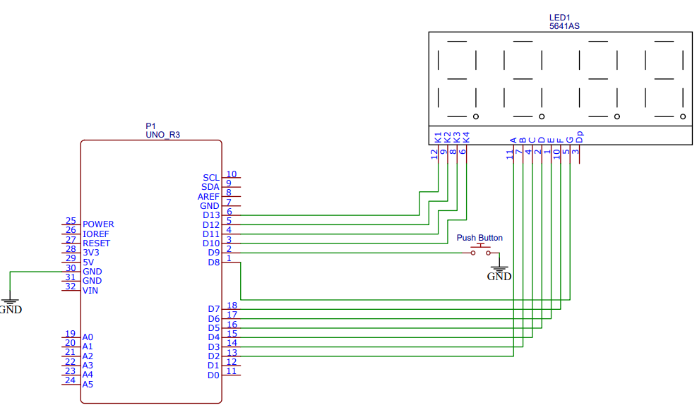
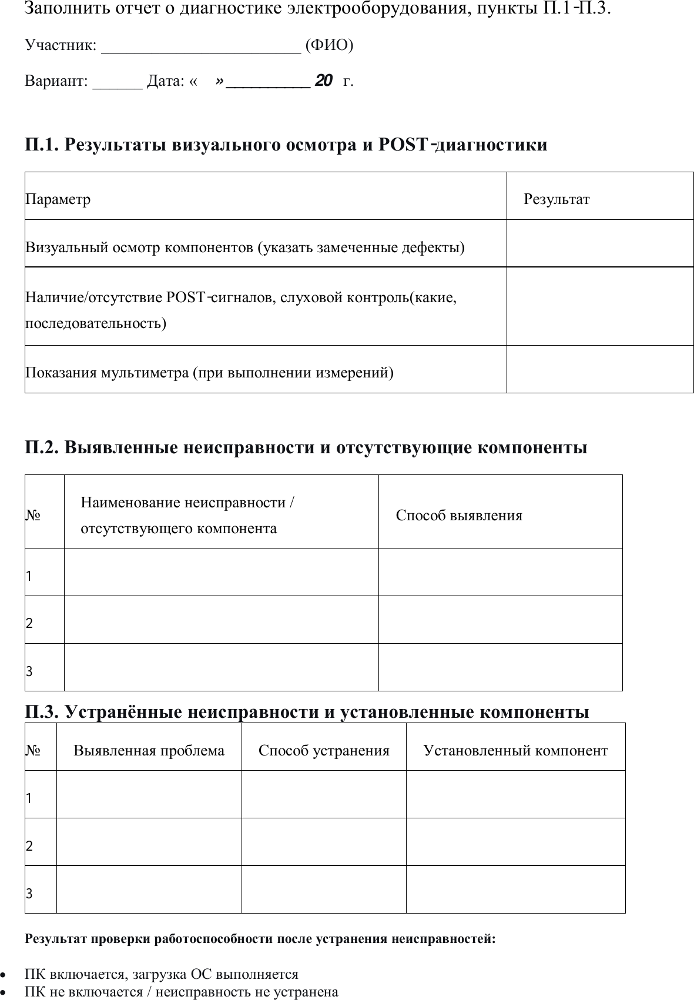

# Образец заданий демонстрационного экзамена

**Специальность:** 09.02.01 «Компьютерные системы и комплексы»  
**Источник:** раздел 3.5 документа «КИМ 09.02.01-1-2027. Том 1 (инвариантная часть)»  
**Год:** 2027

> В документ включены только образцы заданий из раздела 3.5 и материалы трёх приложений, на которые ссылаются задания. Служебные разделы КИМ, критерии оценивания и план застройки площадки не включены.

## Продолжительность выполнения заданий

| Задание | Вид деятельности | ДЭ в рамках ПА | ГИА ДЭ БУ |
|---|---|---:|---:|
| Задание 1 | Проектирование цифровых систем | 1 ч 30 мин | 1 ч 30 мин |
| Задание 2 | Проектирование управляющих программ компьютерных систем и комплексов | — | 1 ч 00 мин |
| Задание 3 | Техническое обслуживание и ремонт компьютерных систем и комплексов | — | 1 ч 00 мин |
| **Максимальная продолжительность ДЭ** |  | **1 ч 30 мин** | **3 ч 30 мин** |

---

# Образец задания для ДЭ в рамках промежуточной аттестации

## Задание 1. Проектирование цифровых систем

### Сценарий

Вам необходимо спроектировать цифровую систему согласно требованиям технического задания и проверить её работоспособность.

### 1. Выполнение требований к проектированию цифровых устройств

| Этап проектирования | Перечень работ | Документ с результатами работ |
|---|---|---|
| Схемотехнический | 1. Разработка принципиальной схемы. 2. Составление полной принципиальной схемы. 3. Проверка работоспособности схемы с помощью встроенных инструментов САПР. | Пояснительная записка |
| Конструкторский | 1. Разработка печатной платы. 2. Компоновка устройства. 3. Таблица составных частей изделия. | 1. Чертежи платы (скриншот). 2. Чертёж общего вида (скриншот). 3. Таблица. |

Объектом проектирования цифрового устройства является схема, представленная на рисунке 1. Перечень компонентов приведён в таблице 1. Логические элементы для проектирования участник выбирает самостоятельно.

Схема должна быть разработана и проверена на работоспособность с помощью встроенных инструментов САПР. После выполнения задания необходимо сдать:

- схемотехнический и конструкторский отчёты;
- файлы проекта САПР.

*Рисунок 1 — логическая схема устройства из приложения 1 к образцу задания.*

### 2. Разработка схемы цифрового устройства

Необходимо разработать схему цифрового устройства на основе интегральных схем разной степени интеграции.

Разработанные схемы оцениваются в составе разделов журнала технического специалиста. Схемотехнический и конструкторский разделы журнала участник разрабатывает и оформляет самостоятельно в точном соответствии с требованиями задания. Готовые бланки и унифицированные шаблоны журнала не предоставляются.

Журнал технического специалиста должен включать:

- схемотехнический раздел;
- конструкторский раздел.

Технический журнал, описывающий схему, должен быть представлен двумя документами в форматах **PDF** и **DOCX (DOC)**.

Требования к оформлению журнала:

- не более 10 страниц, без учёта титульного листа и содержания;
- основной текст — Times New Roman, 14 пт;
- названия разделов — Times New Roman, 18 пт;
- заголовки — Times New Roman, 16 пт;
- правое поле — 1,5 см;
- левое поле — 2,5 см;
- верхнее и нижнее поля — 2 см;
- межстрочный интервал — 1,5.

### 3. Использование средств автоматизированного проектирования

Предполагается применение облачной платформы, не требующей установки на компьютер.

В отведённое время на основании технического задания и списка электрорадиокомпонентов и интегральных микросхем необходимо с помощью САПР:

1. разработать файл схемы электрической принципиальной;
2. выполнить трассировку печатной платы;
3. разместить разработанные схемы и их техническое описание в соответствующих разделах журнала технического специалиста.

### Таблица 1 — перечень компонентов

| Обозначение элемента | Количество | Электронный компонент |
|---|---:|---|
| U1 | 1 | NE555 |
| U2 | 1 | Четырёхразрядный асинхронный счётчик |
| R1, R2, R3, R4, R5 | 5 | Резистор 220 Ом |
| C1 | 1 | Конденсатор 1 мкФ |
| D1, D2, D3, D4, D5 | 5 | Красный светодиод |
| R6 | 1 | Резистор 100 кОм |
| Bat1 | 1 | Источник питания 5 В |

**Необходимое приложение:** приложение 1 — логическая схема устройства (рисунок 1).

---

# Образец заданий для ГИА в форме демонстрационного экзамена базового уровня

## Задание 1. Проектирование цифровых систем

Содержание задания, этапы проектирования, требования к техническому журналу, перечень компонентов и приложение 1 соответствуют образцу задания 1 для промежуточной аттестации, приведённому выше.

**Продолжительность выполнения:** 1 ч 30 мин.

---

## Задание 2. Проектирование управляющих программ компьютерных систем и комплексов

### Постановка задачи

Применение микропроцессорных систем, установка и настройка периферийного оборудования.

### Сценарий

Необходимо создать программу для микропроцессорной системы.

Для выполнения задания необходимо:

1. написать программный код в среде Arduino IDE;
2. скомпилировать программу;
3. выполнить прошивку собранного макета на основе платформы Arduino UNO;
4. продемонстрировать экспертам функциональность макета;
5. сдать макет с загруженным кодом и файл проекта Arduino IDE.

В разработке программного обеспечения микроконтроллера следует использовать Arduino IDE. После завершения отведённого времени необходимо продемонстрировать экспертам функциональность секундомера. Эксперты оценивают работоспособность макета и программный код.

Макет собирается участником самостоятельно по физической схеме подключения, представленной на рисунке 2.

*Рисунок 2 — схема подключения Arduino UNO, четырёхразрядного семисегментного индикатора и кнопки из приложения 2.*

### Требования к макету и программе

Макет секундомера должен быть выполнен на основе платы **Arduino UNO** с микроконтроллером **ATmega328**. Для отображения информации используется четырёхразрядный семисегментный индикатор. Управление отсчётом и выбор режимов выполняются тактовой кнопкой.

Необходимо разработать программное обеспечение секундомера, отображающего время после нажатия кнопки.

Секундомер должен поддерживать три основных режима:

1. прямой счёт времени;
2. остановка счёта времени;
3. сброс времени счёта.

Переключение между режимами выполняется коротким нажатием управляющей кнопки.

Алгоритм работы:

1. При запуске на индикаторе отображается `0000`.
2. После первого нажатия кнопки начинается отсчёт секунд до 60.
3. В режиме счёта на семисегментном индикаторе отображаются секунды в диапазоне от 0 до 60. При изменении цифры должна мигать точка каждого сегмента.
4. При достижении значения 60 счёт останавливается.
5. При повторном нажатии кнопки счёт останавливается на текущем значении секунд.
6. При следующем нажатии значение секунд сбрасывается на `0000`.
7. При последующем нажатии секундомер снова переходит в режим счёта времени.

**Необходимое приложение:** приложение 2 — принципиальная схема подключения модулей к микроконтроллеру (рисунок 2).

**Продолжительность выполнения:** 1 ч 00 мин.

---

## Задание 3. Техническое обслуживание и ремонт компьютерных систем и комплексов

### Постановка задачи

Техническое обслуживание и ремонт компьютерных систем и комплексов.

### 1. Контроль параметров, диагностика и восстановление работоспособности

В ходе выполнения задания необходимо:

1. продиагностировать персональный компьютер;
2. выявить причину отказа;
3. доукомплектовать компьютер недостающими компонентами;
4. заполнить отчёт о диагностике электрооборудования, представленный в приложении 3.

Необходимо выполнить диагностику системного блока:

- провести визуальный осмотр;
- выполнить аппаратно-техническое выявление причин возможных отказов;
- провести слуховой контроль сигналов POST;
- при необходимости использовать мультиметр.

В системный блок заранее внесена одна типовая неисправность или некомплектность, относящаяся к категории простейших отказов оборудования.

Порядок оформления результатов:

1. Заполнить пункты П.1–П.2 отчёта по диагностике.
2. Устранить выявленную причину неисправности или установить недостающий компонент.
3. Заполнить пункт П.3 отчёта.
4. Подключить оборудование к сети переменного тока 220 В.

### 2. Системотехническое обслуживание

Необходимо выполнить следующие операции:

1. Установить необходимые драйверы для операционной системы с загрузочного USB-носителя. В вариантах задания может изменяться устанавливаемое программное обеспечение; необходимые файлы размещаются на накопителе.
2. Создать локальную учётную запись администратора с именем `Admin` без пароля.
3. Разбить жёсткий диск на два логических раздела C и D в соотношении 20 % / 80 %.
4. Подготовить патч-корд на основе UTP-кабеля и разъёмов RJ-45.
5. Подключить персональный компьютер к локальной сети.
6. Проверить передачу пакетов через коммутатор.
7. Определить IP-адрес, автоматически выданный DHCP-сервером.

> **Внимание.** Если участнику не удаётся самостоятельно устранить неисправность или некомплектность, он может обратиться к техническому эксперту. В этом случае баллы за диагностику и устранение неисправности не начисляются. Остальные этапы задания — создание учётной записи, разбиение диска, установка программного обеспечения, настройка сети и формирование отчёта — оцениваются в обычном порядке.

### Приложение 3 — форма отчёта по диагностике

*Рисунок 3 — форма отчёта для заполнения пунктов П.1–П.3.*

**Продолжительность выполнения:** 1 ч 00 мин.

### Инструкции для технического эксперта

До начала экзамена на каждом рабочем месте необходимо:

1. установить операционную систему на жёсткий диск;
2. создать на жёстком диске один раздел C, занимающий 100 % диска, для последующего разбиения участником;
3. создать одну неисправность или некомплектность из приведённого ниже списка;
4. разместить рядом с компьютером мультиметр и USB-накопитель с программным обеспечением;
5. подготовить UTP-кабель и разъёмы RJ-45 для изготовления патч-корда;
6. подготовить коммутатор с включённым DHCP-сервером.

### Список типовых неисправностей

На одном рабочем месте создаётся **одна** неисправность.

| № | Типовая неисправность | Наблюдаемый результат |
|---:|---|---|
| 1 | Отключён кабель питания HDD | HDD не определяется, возникает ошибка загрузки |
| 2 | Отсутствует или не до конца вставлена планка ОЗУ | ПК не включается, экран остаётся чёрным |
| 3 | Отключён 24-контактный кабель питания материнской платы | ПК не включается |
| 4 | Снята батарейка CMOS CR2032 | Сбрасываются настройки BIOS, возникает ошибка при загрузке |
| 5 | Отключена кнопка Power от материнской платы | ПК не включается кнопкой |
| 6 | Отсутствует видеокарта при отсутствии встроенной графики | Экран остаётся чёрным, системный динамик подаёт сигнал |

---

## Состав комплекта

- `obrazec_zadaniy_demoekzamena_09.02.01_2027.md` — текст образцов заданий;
- `images/prilozhenie_1_logicheskaya_shema.png` — схема из приложения 1;
- `images/prilozhenie_2_shema_arduino.png` — схема из приложения 2;
- `images/prilozhenie_3_otchet_diagnostika.png` — форма отчёта из приложения 3.

## Примечание об источнике

Материал скомпонован по разделу 3.5 «Образец заданий» КИМ 09.02.01-1-2027, том 1, и отдельным файлам приложений 1–3. Содержание заданий сохранено; исправлены только очевидные опечатки, слитное написание слов и оформление, возникшие при переносе из PDF в Markdown.
