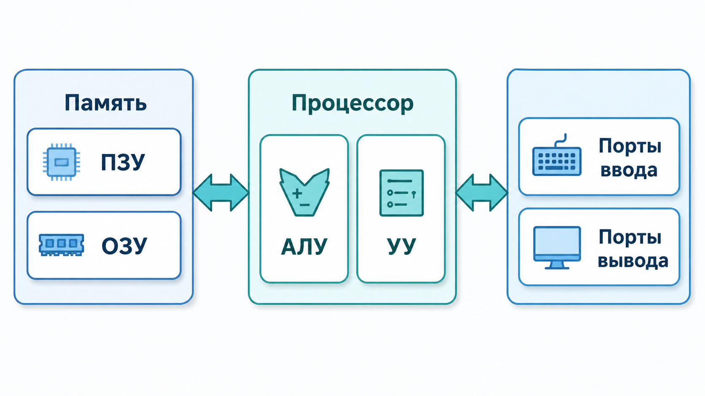
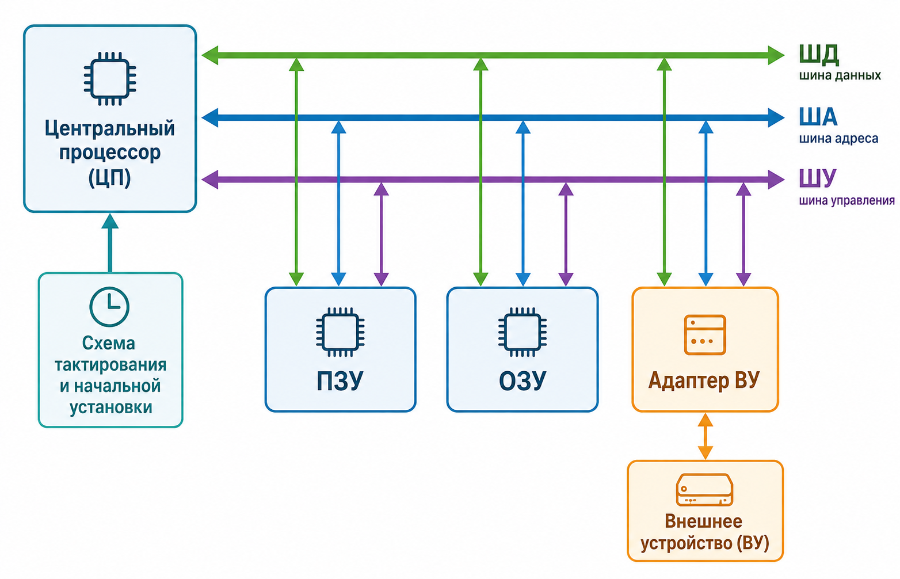
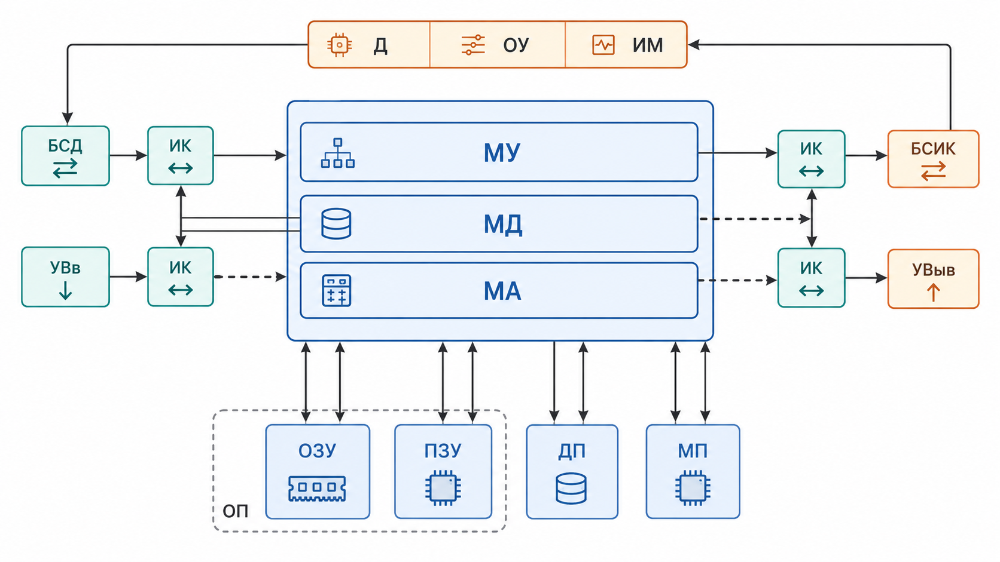
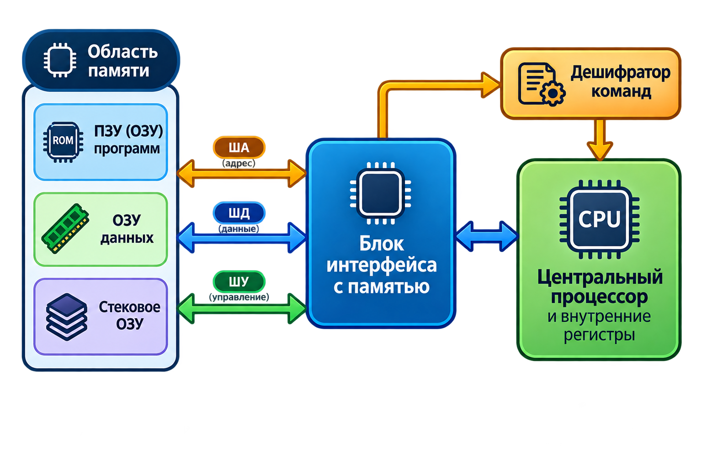
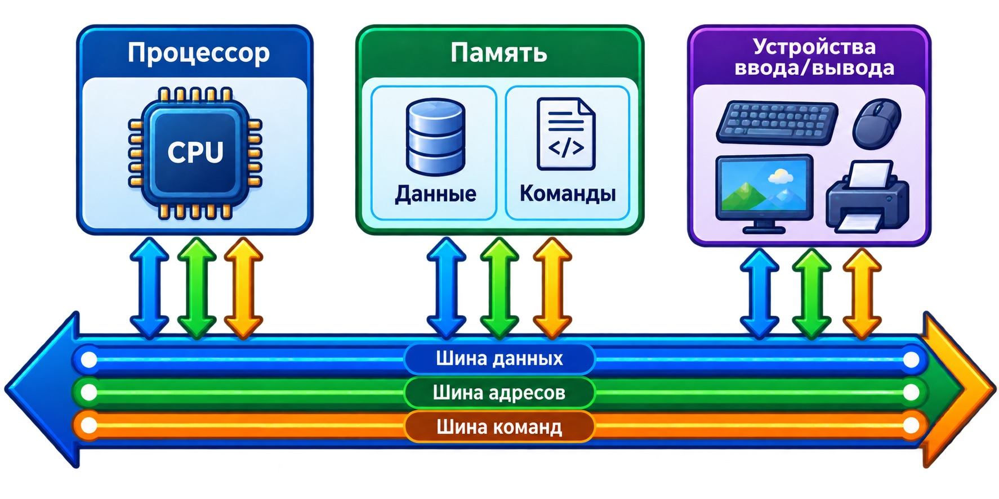
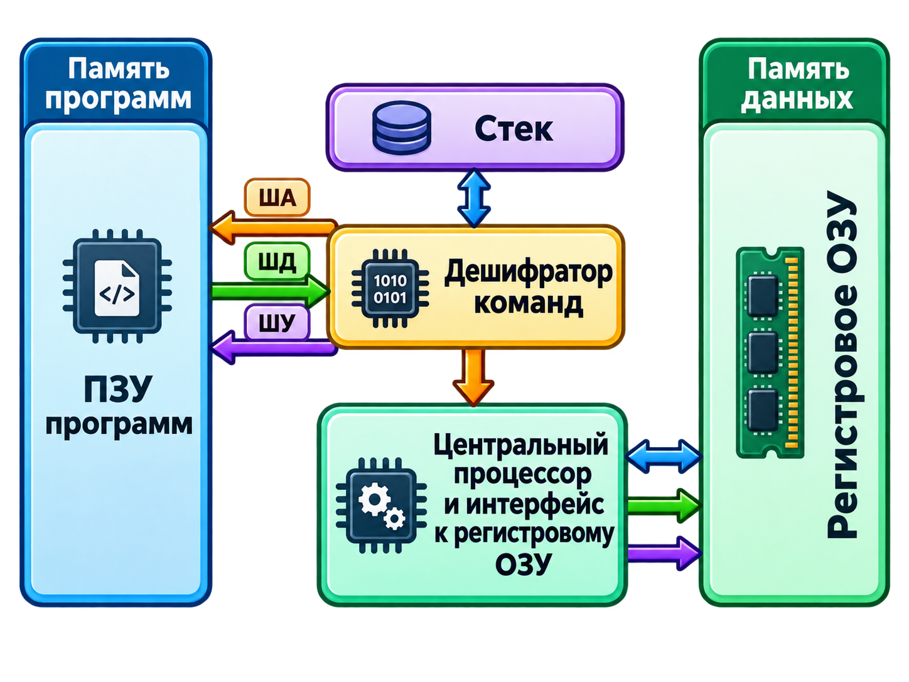
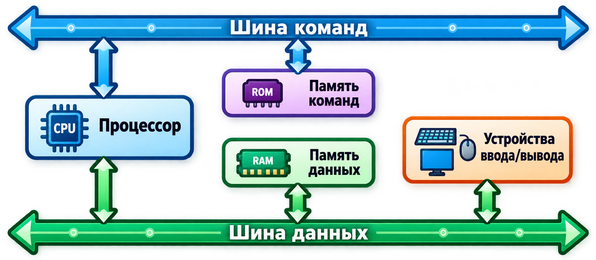
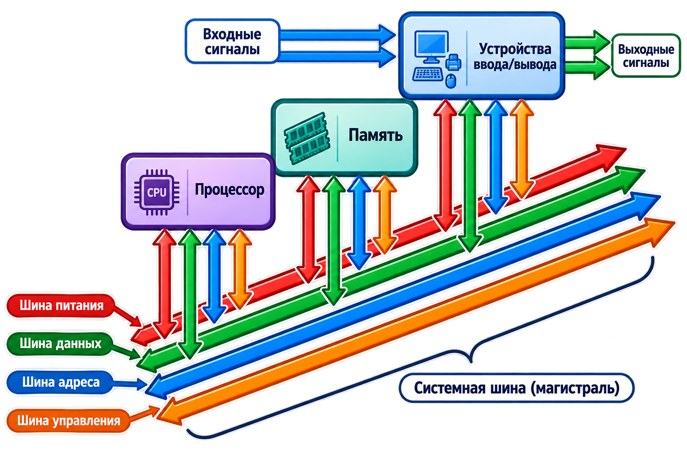

# Лекция 1. Общие понятия микропроцессорных систем

**Курс:** «Микропроцессорные системы»  
**Тема:** основные понятия, структура, классификация и архитектура МПС; шинная организация; краткая история развития.

> **Примечание.** Основной материал лекции перенесён из исходной презентации. Для связности и лучшего понимания добавлены отдельные пояснения, сравнительные таблицы, краткая хронология и контрольные вопросы. Все иллюстрации извлечены из презентации без изменения их содержимого.

---

## План лекции

1. Основные определения.
2. Основные параметры и характеристики МПС.
3. История развития микропроцессорных систем.
4. Архитектура микропроцессорных систем.
5. Классификация МПС.
6. Шинная организация МПС.

---

## 1. Основные определения

### 1.1. Что такое микропроцессорная система

**Микропроцессорная система (МПС)** — это вычислительная, контрольно-измерительная или управляющая система, основным устройством обработки информации в которой является **микропроцессор (МП)**.

Микропроцессорная система строится из набора микропроцессорных больших интегральных схем и обычно включает:

- микропроцессор;
- память;
- периферийные устройства;
- средства и системы ввода-вывода.

Ключевое свойство МПС — **высокая гибкость**. Изменение алгоритма работы во многих случаях выполняется программным путём, без существенной переделки аппаратной части. Это позволяет относительно быстро адаптировать систему к новым требованиям.

Применение микропроцессоров позволило:

- уменьшить стоимость и размеры средств обработки информации;
- повысить быстродействие;
- снизить энергопотребление;
- перенести значительную часть логики управления из аппаратной схемы в программное обеспечение.

### 1.2. МПС как система обработки сигналов

Микропроцессорную систему можно рассматривать как электронную систему, которая:

1. получает входные сигналы;
2. преобразует и обрабатывает их;
3. хранит необходимые данные;
4. формирует выходные и управляющие сигналы.

В качестве входных и выходных сигналов могут использоваться:

- аналоговые сигналы;
- одиночные цифровые сигналы;
- цифровые коды;
- последовательности цифровых кодов.

Внутри системы выполняются:

- временное хранение данных;
- долговременное хранение программ и информации;
- обработка данных;
- формирование управляющих воздействий.

МПС является **цифровым устройством**. Поэтому аналоговые входные сигналы перед обработкой преобразуются в цифровой код с помощью **АЦП** (аналого-цифрового преобразователя), а формирование аналогового выходного сигнала может выполняться с помощью **ЦАП** (цифро-аналогового преобразователя).

> **Пояснение.** Не каждая МПС обязательно содержит отдельные АЦП и ЦАП. Они требуются только тогда, когда система непосредственно взаимодействует с аналоговыми сигналами.

---

## 2. Классификация микропроцессорных систем

### 2.1. По назначению

**Компьютерные системы** — персональные компьютеры, серверы, ноутбуки, планшеты и другие устройства, ориентированные на выполнение широкого круга вычислительных задач и обработку больших объёмов данных.

**Встраиваемые системы** — микропроцессорные устройства, встроенные в более крупный технический объект и выполняющие специализированную функцию. Примеры:

- автомобильные электронные блоки;
- бытовая техника;
- промышленное оборудование;
- медицинские приборы;
- системы автоматики.

### 2.2. По размеру и сложности

**Микроконтроллеры** — программируемые микросхемы, в которых на одном кристалле обычно объединены процессорное ядро, память и периферийные модули: таймеры, порты ввода-вывода, АЦП, интерфейсы связи и др.

**Микропроцессоры** — процессорные устройства, предназначенные прежде всего для вычислительной обработки. Для построения законченной системы микропроцессору обычно требуются внешние память, интерфейсные узлы и периферия.

> **Пояснение.** В современной технике граница между микропроцессором, микроконтроллером и системой-на-кристалле (SoC) может быть условной. Практически важнее смотреть на степень интеграции, назначение устройства, набор периферии, производительность и требования к программному обеспечению.

### 2.3. По области применения

МПС могут быть:

- **универсальными** — рассчитанными на широкий круг задач;
- **специализированными** — оптимизированными для конкретной функции или класса задач.

### 2.4. По типу системы команд

**RISC (Reduced Instruction Set Computing)** — архитектурный подход с относительно простыми, унифицированными командами и акцентом на эффективное конвейерное выполнение.

**CISC (Complex Instruction Set Computing)** — подход с более развитым и сложным набором машинных команд, часть которых может выполнять составные операции.

> **Важно.** RISC и CISC нельзя напрямую сводить к утверждению «RISC всегда быстрее, CISC всегда медленнее». Реальная производительность определяется микроархитектурой, частотой, конвейером, кэш-памятью, компилятором, характером программы и многими другими факторами.

---

## 3. Применение микропроцессорных систем

Микропроцессорные системы применяются практически во всех областях современной техники.

| Область | Примеры применения |
|---|---|
| Компьютеры и информационные технологии | ПК, серверы, планшеты, смартфоны, сетевые устройства |
| Автомобилестроение | управление двигателем, ABS, ESP, навигация, системы помощи водителю |
| Бытовая техника | стиральные машины, холодильники, микроволновые печи, телевизоры, игровые устройства |
| Промышленность | автоматизация производства, робототехника, контроль технологических процессов |
| Медицина | диагностическое оборудование, лечебные аппараты, мониторинг состояния пациентов |
| Авиация и космонавтика | системы управления полётом, навигация, телеметрия |

---

## 4. Структура микропроцессорной системы

К базовым функциональным компонентам МПС относятся:

- **арифметико-логическое устройство (АЛУ)** — выполняет арифметические и логические операции над цифровыми данными;
- **устройство управления (УУ)** — организует выборку и выполнение команд, формирует управляющие сигналы;
- **ПЗУ** — энергонезависимая память, предназначенная для долговременного хранения информации, например программы;
- **ОЗУ** — оперативная память для временного хранения данных;
- **порты ввода-вывода** — обеспечивают взаимодействие с внешними устройствами.

*Рисунок 1 — Укрупнённая структура микропроцессорной системы.*

Другой вариант структурного представления показывает связь центрального процессора, памяти и внешних устройств через системные шины.

*Рисунок 2 — Связь процессора, памяти и устройства ввода-вывода через шины данных, адреса и управления.*

### 4.1. Пример МПС в составе системы управления

В системах автоматизации микропроцессорная часть связывается с объектом управления через датчики, исполнительные механизмы и согласующие устройства.

*Рисунок 3 — Схема микропроцессорной системы управления.*

Обозначения на схеме:

- **ОУ** — объект управления;
- **Д** — датчики;
- **ИМ** — исполнительные механизмы;
- **ИК** — информационные контроллеры;
- **БСД** — блок сопряжения с датчиками;
- **БСИК** — блок сопряжения с информационными контроллерами;
- **ОП** — основная память;
- **ДП** — дополнительная память.

Логика работы такой системы может быть представлена цепочкой:

**датчики → согласование сигналов → микропроцессорная обработка → формирование управляющего воздействия → исполнительные механизмы → объект управления**.

---

## 5. Микроконтроллер и микропроцессорный комплект

### 5.1. Микроконтроллер

**Микроконтроллер** — микропроцессорное устройство, ориентированное на выполнение функций управления оборудованием. Как правило, на одном кристалле микроконтроллера размещаются:

- процессорное ядро;
- память программ и данных;
- порты ввода-вывода;
- таймеры-счётчики;
- интерфейсы связи;
- АЦП и другие периферийные модули.

Микроконтроллеры широко применяются как встраиваемые устройства в станках, машинах, приборах и технологических системах.

### 5.2. Микропроцессорный комплект и микропроцессорный набор

**Микропроцессорный комплект (МПК)** — совокупность микропроцессорных и других интегральных схем, совместимых по архитектуре, конструктивному исполнению и электрическим параметрам и допускающих совместное применение.

**Микропроцессорный набор** — конкретный набор микросхем из состава МПК, необходимый для построения заданного устройства. В него могут входить не все микросхемы комплекта, а отдельные микросхемы могут использоваться в нескольких экземплярах.

---

## 6. Основные параметры и характеристики МПС

> **Добавленное пояснение.** В исходной презентации пункт «Параметры МПС» указан в плане, но не выделен отдельным разделом. Для полноты темы ниже приведены характеристики, которые обычно используют при анализе и сравнении микропроцессорных систем.

К основным параметрам относятся:

- **разрядность процессора** — число битов, которое процессор естественным образом обрабатывает за одну операцию;
- **тактовая частота** — частота синхронизации процессора и/или системных узлов;
- **разрядность шины данных** — объём данных, передаваемых за один цикл обмена;
- **разрядность шины адреса** — определяет максимально адресуемое пространство;
- **объём и тип памяти** — ОЗУ, ПЗУ, Flash, EEPROM, кэш;
- **состав периферии** — таймеры, АЦП, ЦАП, PWM, интерфейсы UART, SPI, I²C и др.;
- **производительность** — зависит не только от частоты, но и от архитектуры, системы команд, конвейера и памяти;
- **энергопотребление** — особенно важно для автономных и встраиваемых систем;
- **число линий ввода-вывода**;
- **набор интерфейсов связи**;
- **надежность, температурный диапазон и допустимые условия эксплуатации**.

### 6.1. Связь ширины адресной шины с объёмом адресного пространства

Если адресная шина имеет `N` линий, то она позволяет сформировать до:

\[
2^N
\]

различных адресов.

Например, 16-разрядная шина адреса позволяет сформировать `2^16 = 65 536` адресов. Если каждый адрес указывает на один байт, адресуемое пространство составляет **64 КиБ**.

---

## 7. Краткая история развития микропроцессорных систем

> **Добавленное пояснение.** В презентации приведены ранние вычислительные машины фон-неймановского типа, но нет отдельной последовательной хронологии развития микропроцессоров. Ниже добавлена краткая связка между ранними ЭВМ и современными МПС.

Основные этапы:

- **1940-е годы** — формирование принципов вычислительной машины с хранимой программой; создание первых практических систем этого класса.
- **1948–1950 годы** — появление ранних компьютеров, реализующих основные идеи архитектуры с хранимой программой.
- **1971 год** — появление Intel 4004, одного из первых коммерчески доступных микропроцессоров на одном кристалле.
- **1970-е годы** — развитие 8-разрядных микропроцессоров, на базе которых строятся терминалы, контроллеры и первые массовые микрокомпьютеры.
- **конец 1970-х — 1980-е годы** — переход к 16- и 32-разрядным системам; развитие персональных компьютеров и микроконтроллеров.
- **1980-е — 1990-е годы** — распространение RISC-подходов, развитие специализированных встроенных процессоров и цифровых сигнальных процессоров.
- **2000-е годы** — активное развитие систем-на-кристалле (SoC), мобильных вычислений и высокоинтегрированных микроконтроллеров.
- **2010-е — 2020-е годы** — распространение 32-разрядных микроконтроллеров, IoT, многоядерных и гетерогенных SoC, аппаратных ускорителей и систем с повышенными требованиями к энергоэффективности.

### 7.1. Ранние компьютеры, построенные на принципах фон Неймана

К первым машинам, в которых были реализованы основные особенности архитектуры с хранимой программой, в исходном материале отнесены:

1. **«Манчестерский Марк I»**; его прототип «Манчестерское дитя» — Университет Манчестера, Великобритания, 21 июня 1948 года.
2. **EDSAC** — Кембриджский университет, Великобритания, 6 мая 1949 года.
3. **BINAC** — США, 1949 год.
4. **CSIR Mk 1** — Австралия, ноябрь 1949 года.
5. **SEAC** — США, 9 мая 1950 года.

---

## 8. Принципы фон Неймана

В исходном материале выделены следующие принципы:

1. **Использование двоичной системы счисления** для представления данных и команд.
2. **Принцип программного управления.** Программа состоит из набора команд, которые выполняются процессором в определённой последовательности.
3. **Принцип однородности памяти.** Команды и данные хранятся в общей памяти и представляются в одинаковой форме — как двоичные коды.
4. **Принцип адресуемости памяти.** Память состоит из адресуемых ячеек, к которым процессор может обращаться по их номерам.
5. **Принцип последовательного программного управления.** При обычном ходе программы команды выбираются и выполняются последовательно.
6. **Принцип условного перехода.** Порядок выполнения программы может изменяться в зависимости от результата вычислений или состояния условий.

Компьютеры, построенные на этих принципах, относят к **фон-неймановским**.

> **Пояснение.** В современной литературе набор «принципов фон Неймана» может формулироваться несколько по-разному. Для архитектуры МПС наиболее важна идея **хранимой программы** и общей адресуемой памяти для программ и данных.

---

## 9. Фон-неймановская архитектура

С точки зрения организации процессов выборки и исполнения команд в МПС часто противопоставляют две модели:

- **фон-неймановскую (принстонскую)**;
- **гарвардскую**.

Основная особенность фон-неймановской архитектуры — **общая память для хранения программ и данных**.

*Рисунок 4 — Пример организации процессора и общей памяти в фон-неймановской архитектуре.*

### 9.1. Преимущества

- более простая организация системы;
- одна общая область памяти;
- возможность гибко распределять память между кодом программы и данными;
- удобство доступа к общим структурам данных, включая стек.

### 9.2. Ограничение: «узкое место фон Неймана»

Если команды и данные используют один и тот же путь обмена с памятью, то в конкретный момент времени пропускная способность этого пути разделяется между выборкой команд и передачей данных. Это ограничение часто называют **узким местом фон Неймана**.

---

## 10. Архитектура с общей шиной

В системах с общей магистралью процессор, память и устройства ввода-вывода используют общие линии обмена.

*Рисунок 5 — Пример организации процессора, общей памяти и устройств ввода-вывода на системной шине.*

Преимущества такой организации:

- относительно простая схемотехника;
- единый механизм обмена;
- гибкое распределение памяти между программами и данными.

Недостаток — общие линии связи являются совместно используемым ресурсом. Одновременные обращения разных участников требуют арбитража, а пропускная способность магистрали ограничивает общую производительность.

---

## 11. Гарвардская архитектура

**Гарвардская архитектура** — архитектура вычислительной системы, в которой память программ и память данных разделены и могут обслуживаться независимыми каналами обмена.

Исторически эта идея связана с работами Говарда Эйкена и гарвардскими вычислительными машинами конца 1930-х — 1940-х годов.

*Рисунок 6 — Раздельные память программ и память данных в гарвардской архитектуре.*

### 11.1. Основное преимущество

Раздельные каналы дают возможность **параллельно**:

- выбирать следующую команду;
- читать или записывать данные.

Это повышает потенциальную пропускную способность системы и упрощает построение конвейера.

### 11.2. Ограничения

- аппаратная часть сложнее;
- программная и информационная память имеют раздельные пространства;
- перераспределение ёмкости между памятью программ и памятью данных сложнее или невозможно.

---

## 12. Архитектура с раздельными шинами данных и команд

*Рисунок 7 — Раздельные шины команд и данных.*

В такой архитектуре процессор одновременно обслуживает два потока:

- поток команд;
- поток данных.

Обмен по обеим шинам может выполняться независимо и параллельно во времени. Параметры каждой шины — разрядность, скорость, формат обмена — могут быть выбраны с учётом её назначения.

При прочих равных условиях это может повысить быстродействие, однако требует:

- большего числа аппаратных ресурсов;
- более сложной структуры процессора;
- отдельной организации адресных пространств программ и данных.

Такая организация особенно удобна внутри одной микросхемы и поэтому широко используется в микроконтроллерах и процессорных ядрах с модифицированной гарвардской архитектурой.

### 12.1. Сравнение фон-неймановской и гарвардской архитектур

| Характеристика | Фон-неймановская | Гарвардская |
|---|---|---|
| Память команд и данных | общая | раздельная |
| Каналы обмена | общий или логически общий | раздельные |
| Параллельный доступ к командам и данным | ограничен | возможен |
| Гибкость распределения памяти | выше | ниже |
| Аппаратная сложность | обычно ниже | обычно выше |
| Типичные области | универсальные вычислительные системы | микроконтроллеры, DSP, встроенные системы |

> **Терминологическое замечание.** Не следует смешивать два разных способа подсчёта «шин». Когда говорят о фон-неймановской и гарвардской архитектуре, речь идёт прежде всего о разделении **потоков команд и данных**. Когда ниже рассматриваются ША, ШД и ШУ, речь идёт о функциональном назначении сигналов системной магистрали.

---

## 13. Шинная структура микропроцессорной системы

Процессор, память и порты ввода-вывода взаимодействуют между собой посредством **шин**.

**Шина** — совокупность электрических проводников, предназначенных для передачи информации и объединённых единым функциональным назначением.

Физически шины могут быть реализованы:

- дорожками печатной платы;
- группой проводников или кабелем;
- внутренними соединениями кристалла;
- разъёмами и магистралями между платами.

*Рисунок 8 — Типовая системная магистраль: шины питания, данных, адреса и управления.*

---

## 14. Шина данных

**Шина данных — ШД, DB (Data Bus)** — основная шина, по которой передаются информационные коды между устройствами системы.

Типичные операции:

- процессор считывает данные из памяти;
- процессор записывает данные в память;
- процессор принимает данные от устройства ввода;
- процессор передаёт данные устройству вывода.

В некоторых системах возможен обмен без непосредственного участия процессора, например при **прямом доступе к памяти (DMA/ПДП)**.

Шина данных обычно является **двунаправленной**.

> **Пример.** Если шина данных имеет ширину 8 бит, за один цикл по ней можно передать один байт. 16-разрядная шина может передать 16 бит, а 32-разрядная — 32 бита, если архитектура и конкретный режим обмена это предусматривают.

---

## 15. Шина адреса

**Шина адреса — ША, AB (Address Bus)** — служит для передачи адреса устройства или ячейки памяти, с которыми выполняется обмен.

Каждому адресуемому элементу системы соответствует адрес или диапазон адресов. Когда процессор выставляет адрес, логика декодирования определяет, какое устройство должно участвовать в текущем цикле обмена.

Именно адрес позволяет ответить на вопрос: **«с каким устройством или ячейкой памяти выполняется операция?»**

В классической процессорной системе адрес формируется процессором и шина адреса является однонаправленной. В более сложных системах с несколькими ведущими устройствами магистрали организация адресных линий может быть сложнее.

---

## 16. Шина управления

**Шина управления — ШУ, CB (Control Bus)** — набор отдельных управляющих сигналов, которые определяют тип и временные параметры обмена.

К управляющим сигналам могут относиться:

- чтение;
- запись;
- подтверждение готовности;
- тактирование;
- сброс;
- запрос и подтверждение прерывания;
- запрос и предоставление управления шиной;
- сигналы выбора режима обмена.

В отличие от шины данных, шина управления не обязательно представляет собой группу одинаковых линий. Каждая линия имеет собственное назначение и направление передачи.

---

## 17. Шина питания

**Шина питания — PB (Power Bus)** не используется для передачи информационных кодов. Она предназначена для подачи питания и общего потенциала на элементы системы.

В составе шины питания могут присутствовать:

- одна или несколько линий положительного питания;
- линии отрицательного питания, если они требуются схемой;
- общий провод (`GND`).

В современных цифровых системах типичные напряжения питания могут составлять 5 В, 3,3 В, 1,8 В и ниже — конкретное значение определяется элементной базой.

---

## 18. Трёхшинная и мультиплексированная организация

В классическом представлении данные, адреса и управляющие сигналы передаются по отдельным функциональным группам линий:

- **ШД** — шина данных;
- **ША** — шина адреса;
- **ШУ** — шина управления.

Для уменьшения числа выводов микросхем и проводников часть линий может быть **мультиплексирована**.

Например, при использовании совмещённой **шины адреса/данных (ША/Д)** одни и те же физические линии работают по очереди:

1. сначала по ним передаётся адрес;
2. затем — данные.

Чтобы система различала эти фазы, применяются специальные управляющие сигналы и внешние или внутренние регистры-защёлки.

**Преимущество:** уменьшается число физических линий и выводов микросхем.  
**Недостаток:** адрес и данные нельзя передавать по этим линиям одновременно, а протокол обмена становится сложнее.

---

## 19. Как происходит типичный цикл обмена

Рассмотрим упрощённую операцию чтения байта из памяти:

1. Процессор выставляет адрес требуемой ячейки на шину адреса.
2. Формирует на шине управления сигнал **«чтение»**.
3. Дешифратор адреса выбирает требуемую микросхему памяти.
4. Память выставляет содержимое выбранной ячейки на шину данных.
5. Процессор считывает значение с шины данных.
6. Управляющие сигналы снимаются, шина освобождается для следующего цикла.

При операции записи направление передачи по шине данных меняется: данные выдаёт процессор, а выбранная память или периферийное устройство их принимает.

---

## 20. Итоги лекции

После изучения материала необходимо понимать, что:

- МПС — это аппаратно-программная система, в которой центральную роль играет микропроцессор или микроконтроллер;
- типовая МПС включает процессор, память, ввод-вывод и средства связи между компонентами;
- программы позволяют менять алгоритм работы системы без полной переработки аппаратной части;
- микропроцессорные системы бывают универсальными и специализированными, компьютерными и встраиваемыми;
- фон-неймановская архитектура использует общее пространство памяти программ и данных;
- гарвардская архитектура разделяет память и потоки команд и данных;
- шины данных, адреса и управления совместно обеспечивают обмен информацией внутри МПС;
- мультиплексирование позволяет уменьшить количество физических линий ценой усложнения обмена.

---

## 21. Контрольные вопросы

1. Что называется микропроцессорной системой?
2. Какие основные устройства входят в состав МПС?
3. Почему программная перенастройка является важным преимуществом МПС?
4. Какие типы входных и выходных сигналов может обрабатывать МПС?
5. Для чего применяются АЦП и ЦАП?
6. Чем встраиваемая система отличается от универсальной компьютерной системы?
7. В чём принципиальное отличие микроконтроллера от классического микропроцессора?
8. Что такое микропроцессорный комплект?
9. Какие основные принципы фон Неймана приведены в лекции?
10. В чём состоит различие между фон-неймановской и гарвардской архитектурами?
11. Почему раздельные шины команд и данных могут повысить производительность?
12. Для чего предназначена шина данных?
13. Для чего предназначена шина адреса?
14. Какие сигналы входят в шину управления?
15. Что такое мультиплексированная шина адреса/данных?
16. Как разрядность адресной шины связана с размером адресного пространства?
17. Почему ширина шины данных влияет на производительность обмена?
18. Опишите последовательность чтения данных процессором из памяти.

---

## 22. Краткий словарь терминов

| Термин | Значение |
|---|---|
| МП | микропроцессор |
| МПС | микропроцессорная система |
| МК | микроконтроллер |
| АЛУ | арифметико-логическое устройство |
| УУ | устройство управления |
| ПЗУ | постоянное запоминающее устройство |
| ОЗУ | оперативное запоминающее устройство |
| АЦП | аналого-цифровой преобразователь |
| ЦАП | цифро-аналоговый преобразователь |
| ШД / DB | шина данных / Data Bus |
| ША / AB | шина адреса / Address Bus |
| ШУ / CB | шина управления / Control Bus |
| PB | шина питания / Power Bus |
| RISC | Reduced Instruction Set Computing |
| CISC | Complex Instruction Set Computing |
| DMA / ПДП | прямой доступ к памяти |
| SoC | система-на-кристалле |

---

**Конец лекции 1.**
