# Лекция 2. Микропроцессор

**Курс:** «Микропроцессорные системы»

---

## Цель лекции

Сформировать целостное представление о микропроцессоре как центральном устройстве микропроцессорной системы: рассмотреть его назначение, классификацию, основные параметры, внутреннюю структуру и функции, а также проследить основные этапы развития микропроцессоров Intel по материалам исходной презентации.

## План

1. [Основные компоненты микропроцессорной системы](#1-основные-компоненты-микропроцессорной-системы)
2. [Понятие микропроцессора](#2-понятие-микропроцессора)
3. [Классификация микропроцессоров](#3-классификация-микропроцессоров)
4. [Основные параметры микропроцессора](#4-основные-параметры-микропроцессора)
5. [Показатели быстродействия](#5-показатели-быстродействия)
6. [Структура и функции микропроцессора](#6-структура-и-функции-микропроцессора)
7. [Память и подсистема ввода-вывода](#7-память-и-подсистема-ввода-вывода)
8. [Логическая структура микропроцессора](#8-логическая-структура-микропроцессора)
9. [История развития микропроцессоров Intel](#9-история-развития-микропроцессоров-intel)
10. [Итоги](#10-итоги)
11. [Контрольные вопросы](#11-контрольные-вопросы)

---

# 1. Основные компоненты микропроцессорной системы

Основу микропроцессорной системы (МПС) составляет **микропроцессор**, который выполняет две основные группы функций:

- **обработку информации**;
- **управление работой системы**.

Остальные узлы МПС обеспечивают микропроцессор данными, программой и средствами взаимодействия с внешними устройствами.

Для построения работоспособной микропроцессорной системы необходимы как минимум:

- **микропроцессор**;
- **память**;
- **порты и средства ввода-вывода**.

### Роль основных компонентов

| Компонент | Назначение |
|---|---|
| **Микропроцессор** | Выполняет команды программы, обрабатывает данные и формирует управляющие сигналы |
| **Память** | Хранит программу, данные, промежуточные и итоговые результаты |
| **Порты ввода-вывода** | Связывают процессор с внешним миром: датчиками, исполнительными устройствами, терминалами и другой периферией |

> **Пояснение.** Микропроцессор сам по себе не является законченной вычислительной системой. Для практической работы ему необходимы память, тактирование, питание и средства обмена с внешними устройствами.

---

# 2. Понятие микропроцессора

**Микропроцессор (МП)** — программно управляемое устройство, выполненное в виде одной или нескольких интегральных схем высокой степени интеграции, которое выполняет арифметические и логические операции и управляет работой микропроцессорной системы.

Микропроцессор можно рассматривать как **центральный вычислительный и управляющий узел** МПС.

От его характеристик в значительной степени зависят:

- скорость выполнения программы;
- объем и тип обрабатываемых данных;
- доступный объем памяти;
- способы подключения периферии;
- энергопотребление;
- производительность системы в целом.

---

# 3. Классификация микропроцессоров

Микропроцессоры можно классифицировать по нескольким признакам.

## 3.1. По технологии изготовления

В исходном материале выделены следующие технологические группы:

- МП на полевых транзисторах:
  - **p-МДП**;
  - **n-МДП**;
  - **КМДП**;
  - **КНС** — «кремний на сапфире»;
- МП на основе технологий:
  - **ТТЛ**;
  - **ТТЛШ**;
  - **ИИЛ**;
  - **ЭСЛ**.

Для современных цифровых микросхем особенно важна КМДП/CMOS-технология, позволяющая сочетать высокую плотность интеграции с относительно низким энергопотреблением.

## 3.2. По назначению

### Универсальные микропроцессоры

Предназначены для выполнения широкого круга вычислительных задач.

Примеры областей применения:

- персональные компьютеры;
- рабочие станции;
- серверы;
- универсальные вычислительные комплексы.

### Специализированные микропроцессоры

Ориентированы на определенный класс задач. В исходной презентации к ним относятся:

- микроконтроллеры;
- математические микропроцессоры;
- процессоры обработки данных для специализированных областей.

> **Пояснение.** Чем уже специализация процессора, тем эффективнее он может выполнять определенный тип операций, но тем меньше круг универсальных задач, для которых он оптимален.

## 3.3. По количеству одновременно выполняемых программ

| Тип | Характеристика |
|---|---|
| **Однопрограммные** | Выполняется одна программа; переход к следующей происходит после завершения предыдущей |
| **Многопрограммные** | Работа организуется так, чтобы процессор обслуживал несколько программ |

## 3.4. По временной организации работы

### Синхронные микропроцессоры

Работа узлов согласуется тактовыми сигналами. Начало и завершение операций определяются устройством управления и временной организацией процессора.

### Асинхронные микропроцессоры

Начало следующей операции может определяться фактическим завершением предыдущей операции.

## 3.5. По архитектуре системы команд

В исходной презентации рассматриваются два распространенных подхода:

- **CISC**;
- **RISC**.

### CISC

Архитектура с развитой системой команд, включающей относительно сложные операции.

### RISC

Архитектура с сокращенным набором сравнительно простых команд, ориентированная на регулярное и быстрое их выполнение.

> **Дополнительное пояснение.** В современной технической литературе CISC обычно расшифровывается как **Complex Instruction Set Computer**, а RISC — **Reduced Instruction Set Computer**. На практике современные процессоры могут сочетать идеи обоих подходов.

## 3.6. По аппаратной реализации

- **однокристальные** — процессор реализован одной БИС;
- **многокристальные** — процессорная часть распределена между несколькими БИС;
- **секционные** — процессор строится из нескольких функциональных секций и допускает аппаратное наращивание разрядности.

---

# 4. Основные параметры микропроцессора

При выборе и сравнении микропроцессоров учитывают совокупность характеристик.

| Параметр | Что характеризует |
|---|---|
| **Архитектура** | Принципы построения процессора и организации его работы |
| **Разрядность** | Количество бит, с которыми процессор может эффективно работать за одну операцию |
| **Система команд** | Набор машинных команд, доступных программисту и компилятору |
| **Семейство** | Совместимые или эволюционно связанные модели процессоров |
| **Тактовая частота** | Частота тактового сигнала, синхронизирующего работу узлов |
| **Быстродействие** | Практическая скорость выполнения операций и программ |
| **Параметры внешних шин** | Разрядность, частота и организация обмена |
| **Интерфейсы** | Способы подключения памяти и внешних устройств |
| **Напряжение питания** | Требуемые уровни питающих напряжений |
| **Энергопотребление** | Электрическая мощность и эффективность вычислений |
| **Теплоотвод** | Требования к охлаждению |
| **Тип корпуса** | Габариты, количество и тип выводов |
| **Удельная производительность** | Производительность относительно частоты или энергопотребления |

## 4.1. Разрядность

Разрядность влияет на:

- размер машинного слова;
- диапазон целых чисел;
- организацию регистров;
- ширину шин;
- эффективность обработки данных определенного формата.

Важно различать:

- **разрядность внутренних регистров**;
- **разрядность шины данных**;
- **разрядность адресной шины**.

Эти значения не обязательно совпадают.

## 4.2. Тактовая частота

Тактовая частота измеряется в герцах:

- кГц — килогерцы;
- МГц — мегагерцы;
- ГГц — гигагерцы.

Высокая частота сама по себе **не гарантирует** более высокую производительность: на скорость работы также влияют архитектура, число выполняемых за такт операций, кэш-память, конвейер, система команд и организация памяти.

---

# 5. Показатели быстродействия

## 5.1. MIPS

**MIPS — Million Instructions Per Second** — число миллионов машинных инструкций, выполняемых процессором за одну секунду.

Пример:

```text
20 MIPS = примерно 20 миллионов инструкций в секунду
```

MIPS удобно использовать для ориентировочной оценки быстродействия в рамках сходных процессоров и сопоставимых тестов.

> **Дополнительное пояснение.** Значения MIPS различных архитектур нельзя безусловно сравнивать напрямую: одна «инструкция» в разных системах команд может выполнять различный объем работы.

## 5.2. BogoMIPS

**BogoMIPS** — используемая в Linux условная величина, предназначенная прежде всего для внутренней калибровки программных задержек.

В исходном материале приводится шутливое описание BogoMIPS как показателя того, «сколько миллионов раз в секунду компьютер может абсолютно ничего не делать».

BogoMIPS **не следует использовать как полноценный показатель производительности процессора**.

## 5.3. FLOPS

**FLOPS — Floating Point Operations Per Second** — количество операций с плавающей запятой, выполняемых за одну секунду.

FLOPS особенно важен для задач:

- научных вычислений;
- инженерного моделирования;
- обработки сигналов;
- графики;
- машинного обучения;
- суперкомпьютерных расчетов.

### Производные единицы FLOPS

| Наименование | Обозначение | Значение |
|---|---:|---:|
| FLOPS | FLOPS | 10⁰ |
| килоFLOPS | kFLOPS | 10³ |
| мегаFLOPS | MFLOPS | 10⁶ |
| гигаFLOPS | GFLOPS | 10⁹ |
| тераFLOPS | TFLOPS | 10¹² |
| петаFLOPS | PFLOPS | 10¹⁵ |
| эксаFLOPS | EFLOPS | 10¹⁸ |
| зеттаFLOPS | ZFLOPS | 10²¹ |
| йоттаFLOPS | YFLOPS | 10²⁴ |

> В исходной презентации дополнительно приведена величина `10²⁷`.

## 5.4. Примеры производительности вычислительных систем

### Суперкомпьютеры

| Система | Год | Производительность по материалам презентации |
|---|---:|---:|
| ЭНИАК | 1946 | 300 FLOPS |
| IBM 709 | 1957 | 5 kFLOPS |
| БЭСМ-6 | 1968 | 1 MFLOPS |
| Cray-1 | 1974 | 160 MFLOPS |
| БЭСМ-6 на базе Эльбрус-1К2 | 1980-е | 6 MFLOPS |
| Эльбрус-2 | 1984 | 125 MFLOPS |
| Cray Y-MP | 1988 | 2,3 GFLOPS |
| Электроника СС БИС | 1991 | 500 MFLOPS |
| ASCI Red | 1993 | 1 TFLOPS |
| Blue Gene/L | 2006 | 478,2 TFLOPS |
| Jaguar | 2008 | 1,059 PFLOPS |
| IBM Roadrunner | 2008 | 1,105 PFLOPS |
| IBM Sequoia | 2012 | 20 PFLOPS |

### Персональные компьютеры

| Система | Год | Производительность по материалам презентации |
|---|---:|---:|
| IBM PC/XT | 1983 | 6,9 kFLOPS |
| Intel 80386, 40 МГц | 1985 | 0,6 MFLOPS |
| Intel Pentium, 75 МГц | 1993 | 7,5 MFLOPS |
| Intel Pentium II, 300 МГц | 1997 | 50 MFLOPS |
| Intel Pentium III, 1 ГГц | 1999 | 320 MFLOPS |
| AMD Athlon 64, 2,211 ГГц | 2003 | 840 MFLOPS |
| Intel Core 2 Duo, 2,4 ГГц | 2006 | 1,3 GFLOPS |

### Примеры процессоров в вычислительных тестах

- Intel Core 2 Duo E7300 2,66 ГГц — **19,34 GFLOPS**;
- Intel Core 2 Duo E8400 3,0 ГГц — **18,6 GFLOPS**;
- Intel Core 2 Duo E8400 3,0 ГГц, разогнанный до 4,0 ГГц — **25 GFLOPS**;
- Intel Core 2 Quad Q9450 2,66 ГГц, разогнанный до 3,5 ГГц — **48 GFLOPS**.

> **Важно.** Результат FLOPS зависит не только от процессора, но и от методики тестирования, типа вычислений, используемого программного обеспечения и реализации алгоритмов.

---
# 6. Структура и функции микропроцессора

## 6.1. Типовая структурная схема

На рисунке показан один из вариантов представления основных узлов микропроцессора и их взаимодействия с памятью и устройствами ввода-вывода.

<p align="center">
  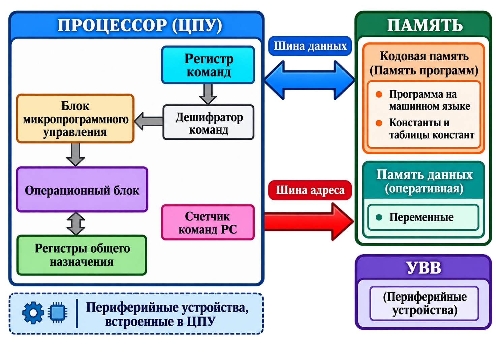
</p>

**Рисунок 1 — Типовая структурная схема микропроцессора**

На схеме можно выделить:

- регистр команд;
- дешифратор команд;
- блок микропрограммного управления;
- операционный блок;
- регистры общего назначения;
- счетчик команд `PC`;
- память программ;
- память данных;
- устройства ввода-вывода;
- шину данных;
- шину адреса.

### Упрощенная последовательность выполнения команды

1. **Счетчик команд PC** формирует адрес следующей команды.
2. Адрес передается в память.
3. Код команды считывается по шине данных.
4. Команда помещается в **регистр команд**.
5. **Дешифратор команд** определяет требуемую операцию.
6. Устройство управления формирует управляющие сигналы.
7. Операционный блок выполняет требуемую обработку.
8. Результат помещается в регистр, память или передается внешнему устройству.
9. Процессор переходит к следующей команде.

## 6.2. Более детализированная внутренняя структура

<p align="center">
  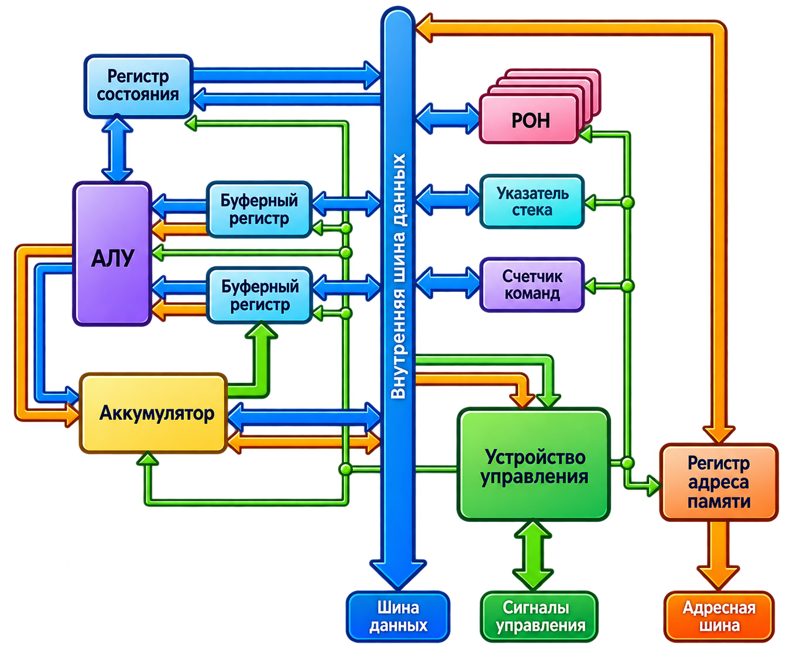
</p>

**Рисунок 2 — Взаимодействие внутренних регистров, АЛУ, устройства управления и шин**

На рисунке представлены:

- **АЛУ** — арифметико-логическое устройство;
- **аккумулятор**;
- **буферные регистры**;
- **регистр состояния**;
- **регистры общего назначения (РОН)**;
- **указатель стека**;
- **счетчик команд**;
- **устройство управления**;
- **регистр адреса памяти**;
- внутренняя шина данных;
- внешняя шина данных;
- адресная шина;
- управляющие сигналы.

> **Пояснение.** В реальном процессоре число и назначение регистров, организация шин и устройство управления зависят от конкретной архитектуры. Схема показывает общий принцип, а не единственно возможную реализацию.

## 6.3. Основные функции микропроцессора в МПС

Микропроцессор выполняет:

1. **выборку команд** программы из основной памяти;
2. **дешифрацию команд**;
3. **выполнение арифметических, логических и других операций**;
4. **управление пересылкой данных**:
   - между регистрами;
   - между регистрами и памятью;
   - между процессором и устройствами ввода-вывода;
5. **обработку сигналов от внешних устройств**;
6. **обслуживание прерываний**;
7. **координацию работы основных узлов микропроцессорной системы**.

Таким образом, работа микропроцессора представляет собой многократно повторяющийся цикл:

```text
выборка команды → декодирование → выполнение → сохранение результата → переход к следующей команде
```

---

# 7. Память и подсистема ввода-вывода

## 7.1. Постоянная память — ПЗУ (ROM)

Постоянная память используется для долговременного хранения информации.

В ней могут находиться:

- программы начального запуска системы;
- программа, выполняемая после аппаратного сброса;
- встроенное программное обеспечение;
- постоянные таблицы и параметры.

Основное свойство ПЗУ — сохранение информации после отключения питания.

## 7.2. Оперативная память — ОЗУ (RAM)

Оперативная память используется для временного хранения:

- переменных;
- промежуточных результатов;
- стека;
- буферов обмена;
- загруженных программ и данных.

После отключения питания содержимое обычной RAM, как правило, теряется.

## 7.3. Подсистема ввода-вывода

**Подсистема ввода-вывода (ПВВ)** обеспечивает обмен информацией между микропроцессором и периферийными устройствами.

Она может включать интерфейсные микросхемы и контроллеры, выполняющие:

- прием данных от внешних устройств;
- передачу данных внешним устройствам;
- согласование уровней и форматов сигналов;
- буферизацию;
- формирование сигналов готовности;
- обработку запросов прерывания.

> **Важно различать:**  
> **подсистема ввода-вывода** — это аппаратные средства, обеспечивающие обмен;  
> **периферийное устройство** — конкретное внешнее устройство: клавиатура, дисплей, накопитель, датчик, исполнительный механизм и т. п.

---

# 8. Логическая структура микропроцессора

**Логическая структура микропроцессора** — состав функциональных логических блоков и связей между ними.

Она определяется:

- назначением процессора;
- архитектурой;
- системой команд;
- способом организации управления;
- требованиями к производительности;
- требованиями к памяти и вводу-выводу.

Одни и те же архитектурные функции могут быть реализованы различными схемотехническими способами. Поэтому два процессора, выполняющие сходные команды, могут существенно различаться внутренней структурой и скоростью работы.

## 8.1. Общая логическая структура

<p align="center">
  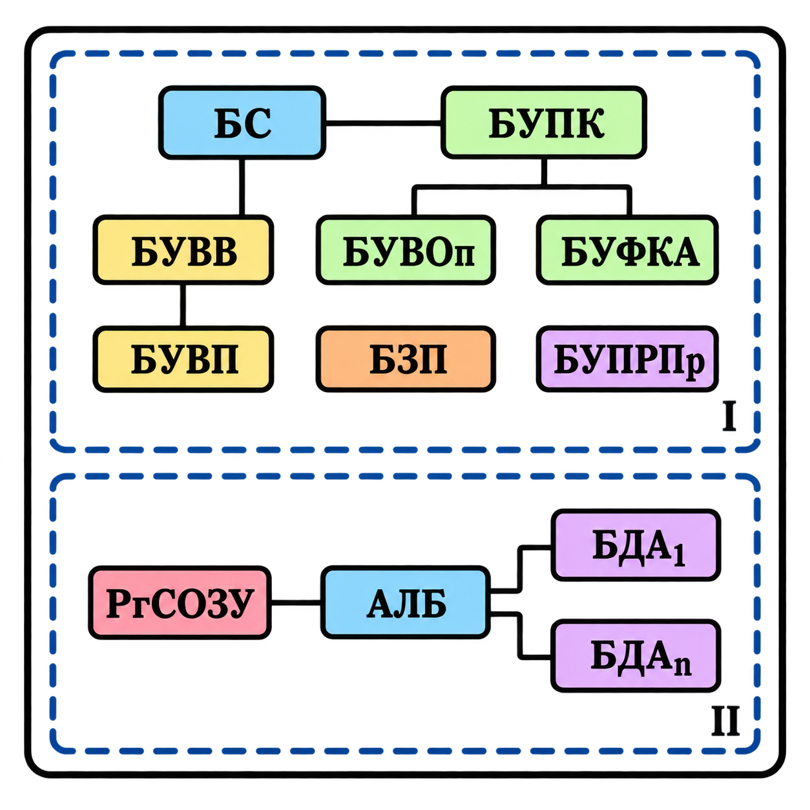
</p>

**Рисунок 3 — Управляющая и операционная части микропроцессора**

### I. Управляющая часть

| Сокращение | Назначение |
|---|---|
| **БУПК** | Блок управления последовательностью команд |
| **БУВОп** | Блок управления выполнением операций |
| **БУФКА** | Блок управления формированием кодов адресов |
| **БУВП** | Блок управления виртуальной памятью |
| **БЗП** | Блок защиты памяти |
| **БУПРПр** | Блок управления прерыванием работы процессора |
| **БУВВ** | Блок управления вводом-выводом |
| **БС** | Блок синхронизации |

Управляющая часть определяет, **что и когда должны выполнять остальные узлы процессора**.

### II. Операционная часть

| Сокращение | Назначение |
|---|---|
| **РгСОЗУ** | Регистровое сверхоперативное запоминающее устройство |
| **АЛБ** | Арифметико-логический блок |
| **БДА** | Блок дополнительной арифметики |

Операционная часть непосредственно выполняет обработку данных.

### Главное различие

```text
Управляющая часть → формирует последовательность управляющих действий.
Операционная часть → выполняет операции над данными.
```

---

# 9. История развития микропроцессоров Intel

> **Примечание к историческому разделу.** Датировки и числовые характеристики ниже перенесены и перекомпонованы по исходной презентации. Внешняя историческая верификация при подготовке этого конспекта не выполнялась.

Для удобства историю развития процессоров Intel можно представить не как набор отдельных слайдов, а как последовательность **этапов архитектурного развития**.

## 9.1. Краткая хронология

| Год по презентации | Процессор | Ключевой этап |
|---:|---|---|
| **1971** | Intel 4004 | Первый микропроцессор Intel, 4-битная архитектура |
| **1972** | Intel 8008 | Переход к 8-битной обработке |
| **1974** | Intel 8080 | Популярный 8-битный процессор, развитие персональных микрокомпьютеров |
| **1976** | Intel 8086 | 16-битный процессор, начало архитектурной линии x86 |
| **1977** | Intel 8088 | 16-битное ядро с 8-битной внешней шиной данных |
| **1982** | Intel 80286 | Защищенный режим и развитие аппаратной поддержки многозадачности |
| **1982** | Intel 80386 | Переход к 32-битной архитектуре |
| **1989** | Intel 486 | Внутренний кэш, дальнейшая интеграция функций процессора |
| **1993** | Pentium | Новый этап повышения производительности x86 |
| **1995** | Pentium Pro | Архитектура P6, ориентация на серверы и рабочие станции |
| **1997** | Pentium II | MMX, развитие платформы ПК |
| **1998** | Celeron | Бюджетная линейка процессоров |
| **1999** | Pentium III | Дальнейшее развитие Pentium II и расширение возможностей |
| **1999** | Celeron Coppermine-128 | Бюджетная линия на основе ядра Coppermine |

---

## 9.2. Этап 1. Зарождение микропроцессоров: Intel 4004 и 8008

### Intel 4004 — 1971

В исходной презентации Intel 4004 представлен как первый микропроцессор Intel.

**Характеристики:**

- разрядность данных — **4 бита**;
- адресуемая память — **640 байт**;
- тактовая частота — **108 кГц**;
- производительность — **0,06 MIPS**;
- число транзисторов — **2300**;
- технологическое разрешение — **10 мкм**.

<p align="center">
  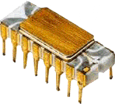
  &nbsp;&nbsp;
  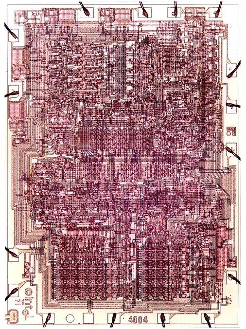
</p>

**Смысл этапа:** микропроцессор перенес функции центрального процессора в интегральную микросхему и открыл путь к компактным программируемым устройствам.

### Intel 8008 — 1972

Intel 8008 стал следующим этапом развития:

- **8-битные регистры**;
- увеличение памяти команд до **16 Кбайт**;
- внутренний стек с ограничением по глубине;
- применение в терминалах и вычислительных устройствах.

<p align="center">
  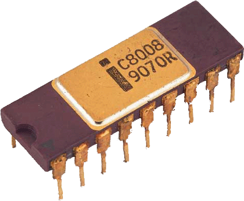
  &nbsp;&nbsp;
  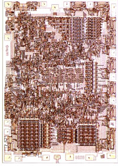
</p>

### Что изменилось между 4004 и 8008

```text
4 бита → 8 бит
небольшие специализированные вычисления → более универсальная обработка данных
рост адресуемой памяти → более сложные программы
```

---

## 9.3. Этап 2. Intel 8080 и появление массовых микрокомпьютеров

### Intel 8080 — 1974

Основные характеристики по презентации:

- разрядность — **8 бит**;
- частота — **2 МГц**;
- число транзисторов — **6000**;
- адресная шина — **16 бит**;
- шина данных — **8 бит**;
- технологический процесс — **10 мкм**;
- питание: `+5 В`, `−5 В`, `+12 В`.

Intel 8080 стал основой множества терминалов, контроллеров и микрокомпьютеров.

На его базе компания **MITS** создала **Altair 8800**, который в презентации рассматривается как один из ключевых этапов распространения общедоступных персональных компьютеров.

В СССР архитектурные идеи Intel 8080 нашли отражение в процессорах:

- **580ИК80**;
- **КР580ВМ80**.

<p align="center">
  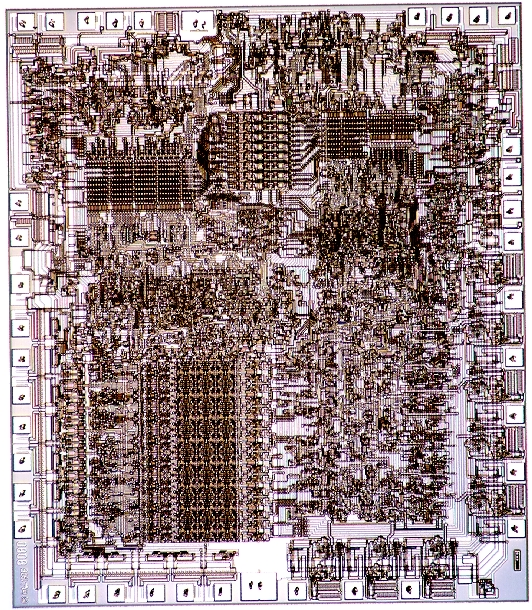
</p>

### Почему Intel 8080 важен

Intel 8080 хорошо показывает переход от микропроцессора как компонента специализированного устройства к центральному элементу **полноценного программируемого микрокомпьютера**.

---
## 9.4. Этап 3. Переход к x86: Intel 8086 и 8088

### Intel 8086 — 1976 по материалам презентации

Intel 8086 представлен как первый 16-битный процессор рассматриваемой линии.

**Основные особенности:**

- **29 000 транзисторов**;
- 16-битные регистры;
- 16-битная шина данных;
- 20-битная адресная шина;
- адресуемое пространство — **1 Мбайт**;
- начало архитектурной линии **x86**.

<p align="center">
  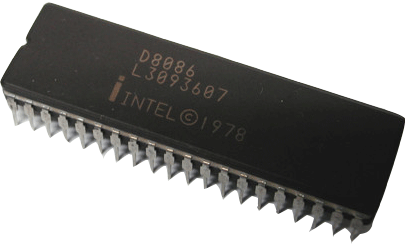
  &nbsp;&nbsp;
  
</p>

### Intel 8088 — 1977 по материалам презентации

8088 являлся близким родственником 8086:

- внутренние регистры — 16-битные;
- адресная часть — 20-разрядная;
- система команд близка к 8086;
- внешняя шина данных уменьшена до **8 бит**.

Это позволяло применять более простую и дешевую внешнюю схемотехнику, но снижало скорость передачи 16-битных данных.

<p align="center">
  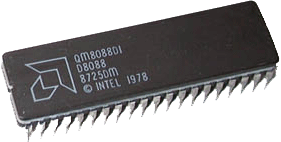
  &nbsp;&nbsp;
  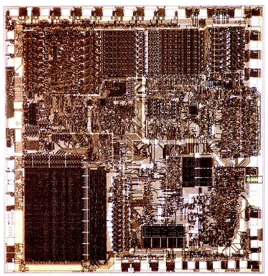
</p>

### Главное изменение этапа

```text
8-разрядная эпоха → 16-разрядная архитектура
рост адресного пространства → более крупные программы и данные
формирование линии x86 → длительная программная совместимость поколений
```

---

## 9.5. Этап 4. Защищенный режим и 32-битная архитектура

### Intel 80286 — 1982

В исходном материале 80286 связывается с развитием аппаратной поддержки многозадачности и появлением **защищенного режима**.

Характеристики:

- **134 000 транзисторов**;
- техпроцесс — **1,5 мкм**;
- 16-битная шина данных;
- 24-битная адресная шина;
- до **16 Мбайт физической памяти**;
- расширенные средства управления памятью.

<p align="center">
  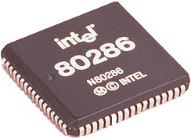
  &nbsp;&nbsp;
  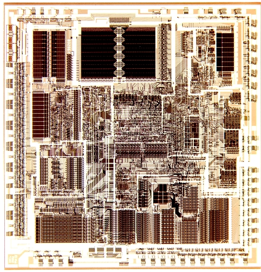
</p>

### Intel 80386 — 1982 по материалам презентации

В презентации 80386 характеризуется как процессор с полностью **32-битной архитектурой**.

Указаны:

- до **4 Гбайт физической памяти**;
- до **64 Тбайт виртуальной памяти**;
- **275 000 транзисторов**;
- развитие механизма виртуальной памяти;
- значительное увеличение сложности процессора.

<p align="center">
  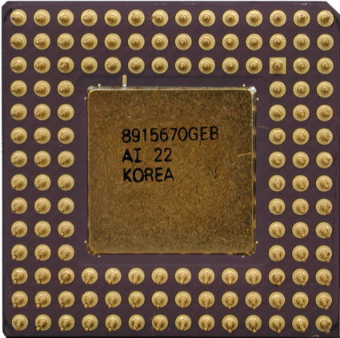
  &nbsp;
  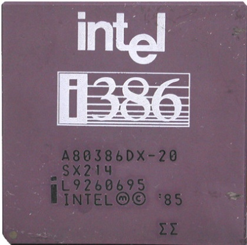
  &nbsp;
  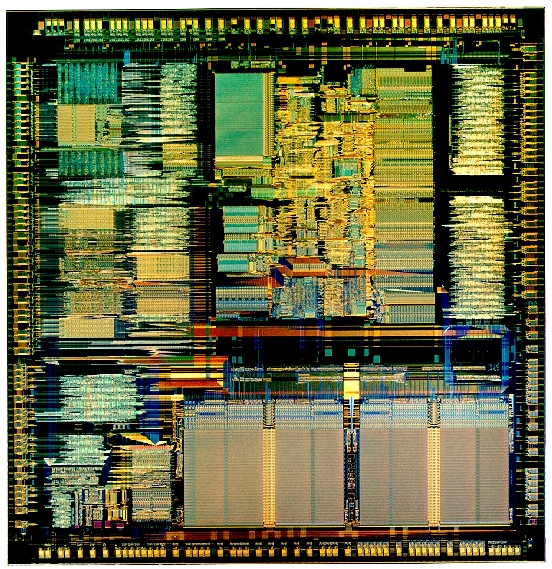
</p>

### Архитектурный смысл этапа

На этом этапе микропроцессор становится не только устройством вычислений, но и аппаратной основой для:

- разделения памяти;
- защиты программ друг от друга;
- виртуальной памяти;
- многозадачных операционных систем.

---

## 9.6. Этап 5. Intel 486: увеличение интеграции

### Intel 486 — 1989

Одним из важных нововведений в презентации назван **внутренний кэш объемом 8 Кбайт**, общий для данных и команд.

Особенности описанного кэша:

- 4-канальная наборно-ассоциативная организация;
- 128 наборов;
- 4 строки в наборе;
- строка — 16 байт.

Если нужного байта нет в кэше, из оперативной памяти загружается целая строка, содержащая требуемые данные.

<p align="center">
  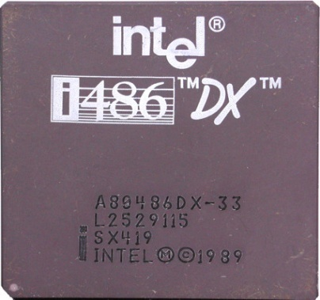
  &nbsp;&nbsp;
  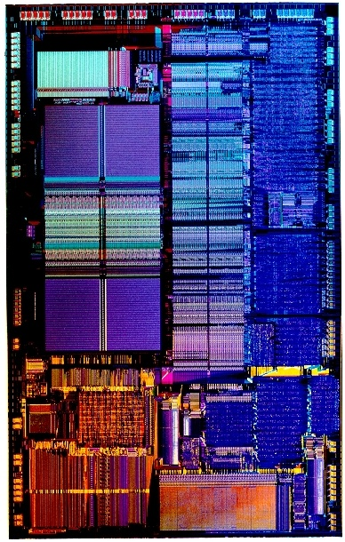
</p>

> **Пояснение.** Кэш-память уменьшает число медленных обращений к основной памяти. Это один из ключевых способов повышения производительности процессоров.

---

## 9.7. Этап 6. Pentium: повышение производительности x86

### Pentium — 1993

В презентации Pentium рассматривается как новый этап развития x86 с использованием ряда идей, характерных для высокопроизводительных архитектур.

Указаны:

- техпроцесс — **0,8 мкм**;
- **3,1 млн транзисторов**;
- первоначальные частоты — **60 и 66 МГц**;
- последующее развитие до 75, 90, 100, 120, 133, 150 и 200 МГц.

<p align="center">
  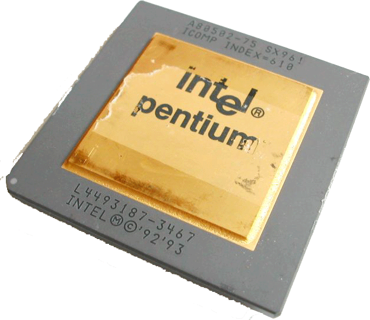
  &nbsp;&nbsp;
  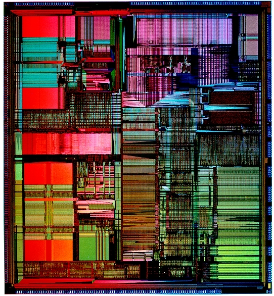
</p>

### Ключевая тенденция

Рост производительности начинает зависеть уже не только от увеличения частоты, но и от совершенствования внутреннего выполнения команд.

---

## 9.8. Этап 7. Архитектура P6: Pentium Pro

### Pentium Pro — 1995

Pentium Pro — процессор шестого поколения архитектуры x86.

По материалам презентации:

- анонсирован 1 ноября 1995 года;
- ориентировался главным образом на серверы и рабочие станции;
- поддерживал многопроцессорные конфигурации;
- использовал архитектурное ядро **P6**.

<p align="center">
  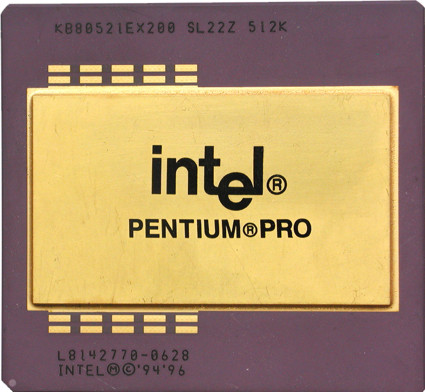
  &nbsp;
  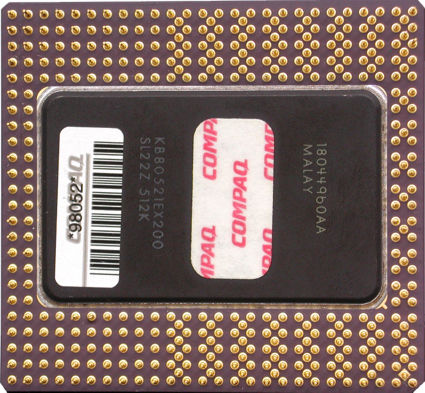
  &nbsp;
  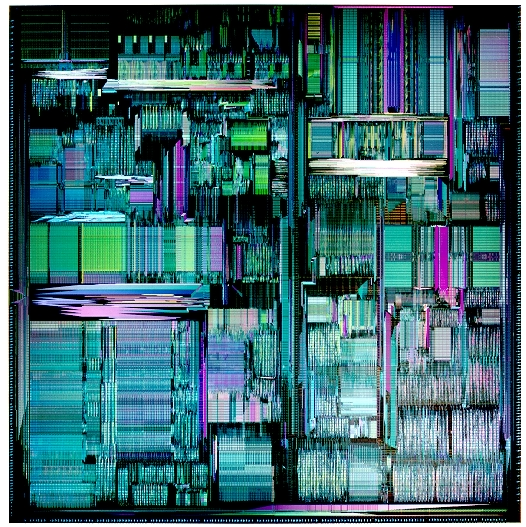
</p>

Pentium Pro показывает переход к более сложной внутренней микроархитектуре, ориентированной на эффективное выполнение программ общего назначения.

---

## 9.9. Этап 8. Pentium II

### Pentium II — 1997

Pentium II был основан на развитии Pentium Pro.

В презентации отмечены:

- блок **MMX**;
- улучшенная обработка 16-разрядных приложений;
- применение памяти **SDRAM**;
- развитие графической шины **AGP**.

<p align="center">
  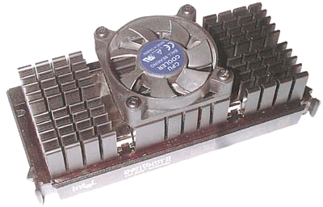
  &nbsp;&nbsp;
  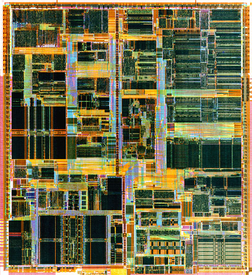
</p>

Это поколение отражает развитие процессора одновременно с развитием всей платформы персонального компьютера: памяти, графики и мультимедийных возможностей.

---

## 9.10. Этап 9. Celeron: разделение процессоров по рыночным сегментам

### Celeron — 1998

**Celeron** — семейство бюджетных x86-совместимых процессоров Intel.

Основная идея семейства:

- снизить стоимость компьютера;
- сохранить совместимость с основной программной платформой;
- предложить более доступный процессор ценой снижения части характеристик относительно старших моделей.

<p align="center">
  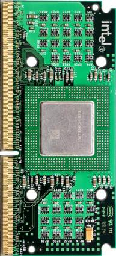
</p>

> **Пояснение.** Появление отдельных бюджетных, массовых и профессиональных линеек показывает зрелость рынка микропроцессоров: разные модели начинают проектироваться не только по принципу «новее — быстрее», но и для разных классов задач и стоимости системы.

---

## 9.11. Этап 10. Pentium III

### Pentium III — 1999

Pentium III развивал архитектурные решения Pentium II.

В презентации указаны различные варианты:

- Pentium III;
- Pentium III Xeon;
- мобильные версии;
- процессоры, связанные с бюджетной линией Celeron.

Процессор сохранил:

- MMX;
- механизмы динамического выполнения команд;

и получил новые возможности, повышающие производительность при сопоставимой тактовой частоте.

<p align="center">
  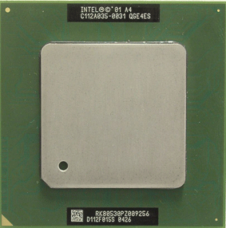
  &nbsp;
  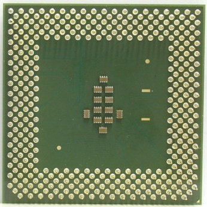
  &nbsp;
  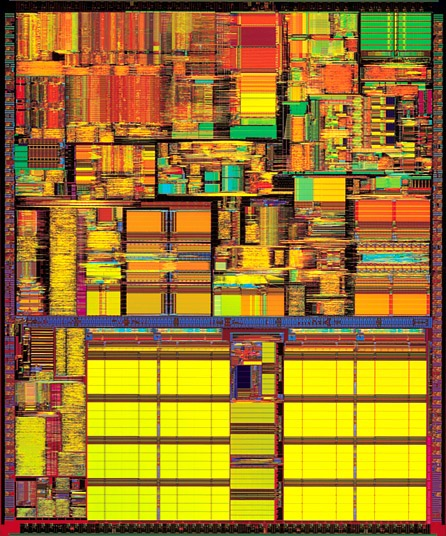
</p>

---

## 9.12. Celeron Coppermine-128

### Celeron Coppermine-128 — 1999

Процессор относится к семейству Celeron поколения Pentium III.

По материалам презентации:

- ядро основано на **Coppermine**;
- объем кэша L2 — **128 Кбайт**;
- начальная частота FSB — **66 МГц**;
- в 2001 году представлен Celeron 800 с FSB **100 МГц**.

<p align="center">
  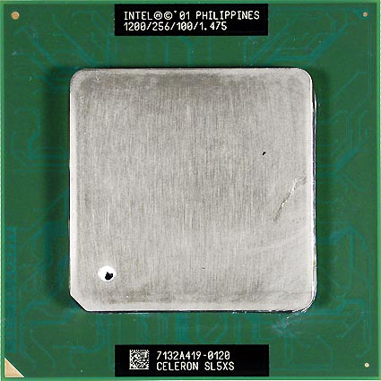
</p>

---

## 9.13. Как менялись микропроцессоры

Историю из презентации удобно свести к нескольким устойчивым направлениям развития.

### 1. Рост разрядности

```text
4 бита → 8 бит → 16 бит → 32 бита
```

Рост разрядности расширяет возможности обработки данных и тесно связан с развитием регистров, памяти и шин.

### 2. Увеличение адресуемой памяти

```text
сотни байт → килобайты → мегабайты → гигабайты
```

Чем больше адресное пространство, тем более сложные программы и наборы данных может обслуживать система.

### 3. Рост степени интеграции

```text
тысячи транзисторов → сотни тысяч → миллионы транзисторов
```

В процессор постепенно интегрировались функции, ранее требовавшие отдельных микросхем.

### 4. Усложнение управления памятью

Развитие процессоров сопровождалось появлением:

- защищенного режима;
- аппаратной защиты памяти;
- виртуальной памяти;
- механизмов поддержки многозадачности.

### 5. Развитие внутренних механизмов ускорения

Появлялись и совершенствовались:

- кэш-память;
- конвейеризация;
- более сложное выполнение команд;
- специализированные блоки;
- мультимедийные расширения.

### 6. Разделение процессоров по назначению

Со временем появились отдельные продуктовые направления:

- массовые процессоры;
- бюджетные модели;
- серверные решения;
- мобильные процессоры.

---

# 10. Итоги

После изучения лекции важно понимать следующие положения.

1. **Микропроцессор — центральный вычислительный и управляющий узел МПС.**
2. Он работает совместно с **памятью** и **подсистемой ввода-вывода**.
3. Микропроцессоры классифицируют по:
   - назначению;
   - технологии;
   - архитектуре системы команд;
   - организации работы;
   - аппаратной реализации.
4. Основные характеристики процессора нельзя сводить только к тактовой частоте.
5. Для оценки быстродействия применяются различные показатели:
   - MIPS;
   - FLOPS;
   - специализированные тесты.
6. Типовой процессор включает:
   - регистры;
   - АЛУ;
   - устройство управления;
   - счетчик команд;
   - средства работы с памятью и вводом-выводом.
7. Внутреннюю структуру удобно разделять на:
   - **управляющую часть**;
   - **операционную часть**.
8. Историческое развитие микропроцессоров связано с:
   - ростом разрядности;
   - увеличением адресуемой памяти;
   - ростом числа транзисторов;
   - интеграцией кэш-памяти и специализированных блоков;
   - развитием средств защиты и управления памятью;
   - усложнением микроархитектуры.

---

# 11. Контрольные вопросы

1. Что называется микропроцессором?
2. Какие устройства являются основными компонентами микропроцессорной системы?
3. Для чего в МПС необходима память?
4. Каково назначение подсистемы ввода-вывода?
5. По каким признакам можно классифицировать микропроцессоры?
6. Чем универсальный микропроцессор отличается от специализированного?
7. В чем состоит различие подходов CISC и RISC?
8. Что такое разрядность микропроцессора?
9. Чем разрядность процессора отличается от разрядности шины данных и шины адреса?
10. Что характеризует тактовая частота?
11. Что означает показатель MIPS?
12. Почему BogoMIPS нельзя считать полноценным тестом производительности?
13. Что измеряется в FLOPS?
14. Какие основные узлы можно выделить в типовой структуре микропроцессора?
15. Какова роль счетчика команд?
16. Какова роль регистра команд?
17. Что выполняет арифметико-логическое устройство?
18. Какие функции выполняет устройство управления?
19. Чем ПЗУ отличается от ОЗУ?
20. Что такое управляющая и операционная части микропроцессора?
21. Какие изменения характеризуют развитие процессоров Intel от 4004 до Pentium?
22. Почему увеличение тактовой частоты не является единственным способом повышения производительности?

---

## Термины и сокращения

| Сокращение | Значение |
|---|---|
| **МП** | микропроцессор |
| **МПС** | микропроцессорная система |
| **АЛУ** | арифметико-логическое устройство |
| **ПЗУ / ROM** | постоянное запоминающее устройство |
| **ОЗУ / RAM** | оперативное запоминающее устройство |
| **ПВВ** | подсистема ввода-вывода |
| **ПУ** | периферийное устройство |
| **PC** | счетчик команд (Program Counter) |
| **MIPS** | Million Instructions Per Second |
| **FLOPS** | Floating Point Operations Per Second |
| **CISC** | Complex Instruction Set Computer |
| **RISC** | Reduced Instruction Set Computer |
| **FSB** | Front Side Bus |

---

> **Примечание:** изображения в конспекте извлечены из исходной презентации и сохранены без перерисовки и изменения содержимого.
