# Лекция 3. Представление данных и операции над ними в микропроцессорных системах

**Дисциплина:** «Микропроцессорные системы»  
**Уровень:** 4 курс колледжа  
**Рекомендуемая продолжительность:** 2 академических часа

## Цель лекции

Понять, как микропроцессор представляет числа, символы и логические значения в виде двоичных кодов, а также научиться выполнять основные арифметические и побитовые операции с учётом разрядности и флагов состояния.

После изучения темы студент должен уметь:

- различать бит, байт, машинное слово и разрядность данных;
- переводить целые числа между двоичной, восьмеричной, десятичной и шестнадцатеричной системами;
- определять диапазон беззнакового и знакового целого числа;
- получать дополнительный код отрицательного числа;
- объяснять различие переноса и знакового переполнения;
- использовать логические операции, маски и сдвиги;
- учитывать порядок байтов при обмене многобайтными данными;
- выбирать типы `uint8_t`, `int16_t`, `uint32_t` и другие типы фиксированной ширины.

---

## 1. От физической величины к двоичному коду

Микропроцессор не воспринимает температуру, давление, скорость или звук непосредственно. Датчик преобразует физическую величину в электрический сигнал, а аналого-цифровой преобразователь, АЦП, превращает этот сигнал в целое число. Процессор получает уже готовый двоичный код, размещает его в регистре и выполняет над ним команды.

На рисунке показан общий путь данных от измеряемого процесса до результата обработки.

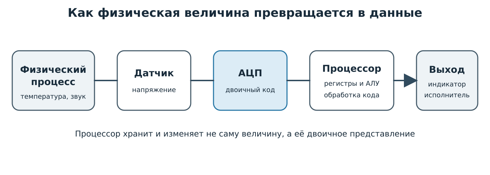

*Рисунок 1 — датчик формирует электрический сигнал, АЦП создаёт двоичный код, а процессор обрабатывает этот код и передаёт результат на выходное устройство.*

Важно различать три понятия:

- **данные** — код, который хранится или передаётся;
- **значение** — смысл, приписанный этому коду;
- **формат** — правило интерпретации битов.

Например, комбинация `11111111` может означать:

- число 255 в формате `uint8_t`;
- число −1 в формате `int8_t`;
- часть цвета пикселя;
- набор восьми логических флагов;
- фрагмент команды процессора.

Биты сами по себе не сообщают процессору, что именно они обозначают. Смысл определяется командой и программой.

---

## 2. Бит, байт и машинное слово

### 2.1. Основные единицы

**Бит** принимает одно из двух значений: 0 или 1. Физически этим значениям могут соответствовать два диапазона напряжения, два состояния триггера или два направления намагниченности.

**Байт** обычно состоит из 8 бит. Один байт имеет $2^8=256$ различных комбинаций.

**Машинное слово** — количество бит, с которым процессор наиболее естественно выполняет основные операции. У восьмиразрядного AVR основные регистры содержат 8 бит, а ядро ARM Cortex-M4 имеет 32-разрядные регистры общего назначения.

Соотношение этих понятий показано на рисунке.

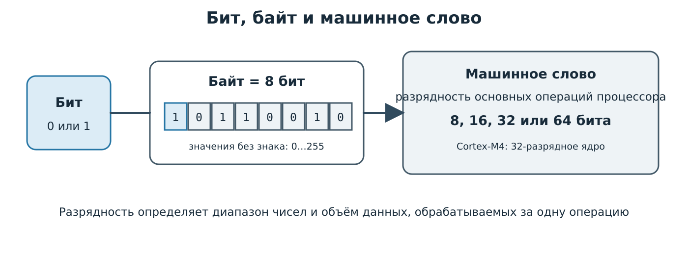

*Рисунок 2 — бит является минимальной единицей, восемь бит образуют байт, а размер машинного слова зависит от архитектуры процессора.*

### 2.2. Разрядность и диапазон

Если беззнаковое число занимает $n$ бит, оно может принимать значения:

$$
0 \leq X \leq 2^n-1.
$$

Для восьми бит диапазон равен $0\ldots255$, для шестнадцати бит — $0\ldots65535$.

Количество комбинаций и диапазон нельзя путать. Восьмиразрядное поле содержит 256 комбинаций, но максимальное беззнаковое значение равно 255, поскольку отсчёт начинается с нуля.

### 2.3. Старший и младший разряды

- **MSB** (`Most Significant Bit`) — старший, наиболее значимый бит;
- **LSB** (`Least Significant Bit`) — младший, наименее значимый бит.

В числе `10110010₂` левый бит имеет вес $2^7=128$, а правый — $2^0=1$. На рисунке показаны веса всех разрядов байта.

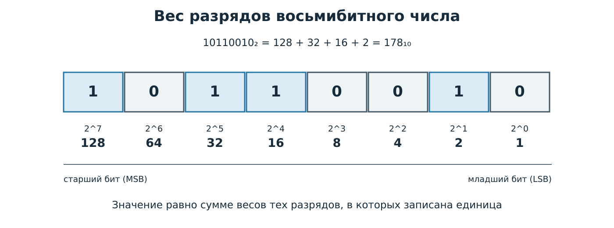

*Рисунок 3 — значение двоичного числа образуется сложением весов тех разрядов, в которых записана единица.*

---

## 3. Позиционные системы счисления

В позиционной системе вес цифры зависит от её положения. Для числа с основанием $p$ справедливо:

$$
X = a_n p^n + a_{n-1}p^{n-1}+\ldots+a_1p^1+a_0p^0,
$$

где $a_i$ — цифра соответствующего разряда.

В микропроцессорной технике используют несколько систем.

| Система | Основание | Цифры | Назначение |
|---|---:|---|---|
| Двоичная | 2 | `0`, `1` | Работа цифровых схем и регистров |
| Восьмеричная | 8 | `0`–`7` | Компактная запись групп по три бита |
| Десятичная | 10 | `0`–`9` | Привычное человеку представление |
| Шестнадцатеричная | 16 | `0`–`9`, `A`–`F` | Адреса, машинные коды, регистры, маски |

В языке C/C++ основания обозначают префиксами:

```cpp
uint8_t a = 42;          // десятичная запись
uint8_t b = 0b00101010;  // двоичная запись
uint8_t c = 052;         // восьмеричная запись
uint8_t d = 0x2A;        // шестнадцатеричная запись
```

Все четыре переменные содержат одинаковое значение 42. Различается только способ записи исходного текста программы.

---

## 4. Перевод целых чисел

### 4.1. Из двоичной системы в десятичную

Необходимо умножить каждый бит на вес его разряда и сложить результаты:

$$
10011_2=1\cdot2^4+0\cdot2^3+0\cdot2^2+1\cdot2^1+1\cdot2^0=19_{10}.
$$

### 4.2. Из десятичной системы в двоичную

Для перевода через степени двойки нужно разложить десятичное число в сумму степеней 2. Работу начинают с наибольшей степени, которая не превышает исходное число. Если степень входит в сумму, в соответствующем разряде записывают 1, иначе — 0.

Рассмотрим число 77. Наибольшая подходящая степень равна $2^6=64$:

$$
77-64=13.
$$

Следующая подходящая степень равна $2^3=8$:

$$
13-8=5.
$$

Оставшееся число раскладывается как $5=2^2+2^0$. Поэтому:

$$
77=2^6+2^3+2^2+2^0.
$$

Запишем коэффициенты при степенях от $2^6$ до $2^0$:

| Степень | $2^6$ | $2^5$ | $2^4$ | $2^3$ | $2^2$ | $2^1$ | $2^0$ |
|---|:---:|:---:|:---:|:---:|:---:|:---:|:---:|
| Значение степени | 64 | 32 | 16 | 8 | 4 | 2 | 1 |
| Входит в сумму | 1 | 0 | 0 | 1 | 1 | 0 | 1 |

Получаем:

$$
77_{10}=1001101_2.
$$

Обратный перевод выполняют по тому же набору степеней: складывают веса разрядов, содержащих единицу:

$$
1001101_2=1\cdot2^6+1\cdot2^3+1\cdot2^2+1\cdot2^0=64+8+4+1=77_{10}.
$$

Последовательность действий можно представить следующим алгоритмом.

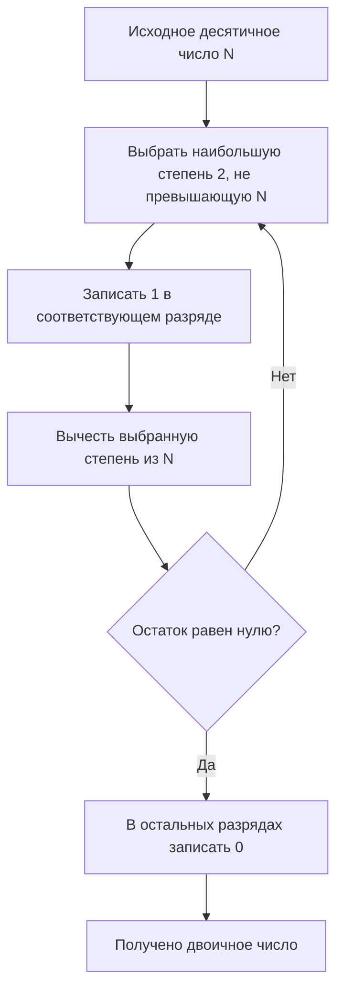

На рисунке показан перевод в обоих направлениях с использованием степеней двойки.

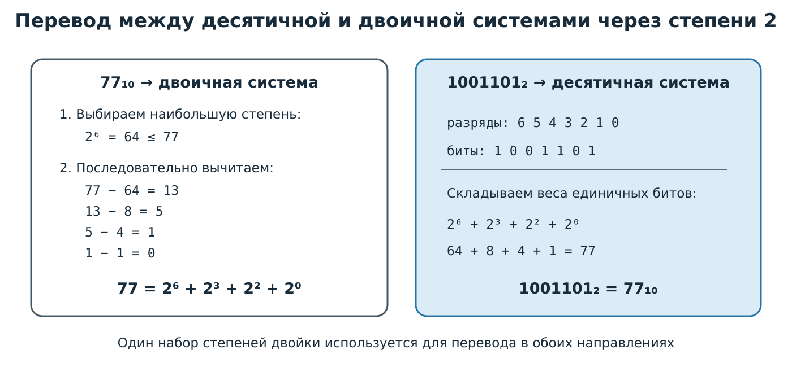

*Рисунок 4 — число 77 раскладывается в сумму $2^6+2^3+2^2+2^0$, а двоичный код образуется коэффициентами при степенях двойки.*

### 4.3. Связь двоичной, восьмеричной и шестнадцатеричной систем

Поскольку $8=2^3$, одной восьмеричной цифре соответствуют три двоичных разряда. Поскольку $16=2^4$, одной шестнадцатеричной цифре соответствуют четыре двоичных разряда.

| Десятичное | Двоичное | Шестнадцатеричное |
|---:|:---:|:---:|
| 0 | `0000` | `0` |
| 1 | `0001` | `1` |
| 2 | `0010` | `2` |
| 3 | `0011` | `3` |
| 4 | `0100` | `4` |
| 5 | `0101` | `5` |
| 6 | `0110` | `6` |
| 7 | `0111` | `7` |
| 8 | `1000` | `8` |
| 9 | `1001` | `9` |
| 10 | `1010` | `A` |
| 11 | `1011` | `B` |
| 12 | `1100` | `C` |
| 13 | `1101` | `D` |
| 14 | `1110` | `E` |
| 15 | `1111` | `F` |

Для перевода двоичного числа группировку начинают справа. При необходимости слева дописывают нули. Пример показан на рисунке.

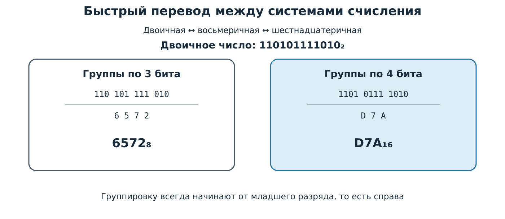

*Рисунок 5 — одно двоичное число преобразуется в восьмеричную запись группировкой по три бита, а в шестнадцатеричную — по четыре.*

---

## 5. Форматы целых чисел

### 5.1. Беззнаковые числа

В беззнаковом формате все биты задают величину. Диапазон $n$-разрядного числа:

$$
0\ldots 2^n-1.
$$

Беззнаковые типы удобны для счётчиков, адресов, битовых масок и показаний АЦП, которые не могут быть отрицательными.

### 5.2. Знаковые числа в дополнительном коде

Современные процессоры обычно представляют отрицательные целые числа в **дополнительном коде**. Для получения кода числа $-X$ в заданной разрядности нужно:

1. записать двоичный код положительного числа $X$;
2. инвертировать все биты;
3. прибавить единицу.

Для $n$ бит диапазон знакового числа равен:

$$
-2^{n-1}\leq X\leq 2^{n-1}-1.
$$

На рисунке показано получение кода числа −18 и диапазон типа `int8_t`.

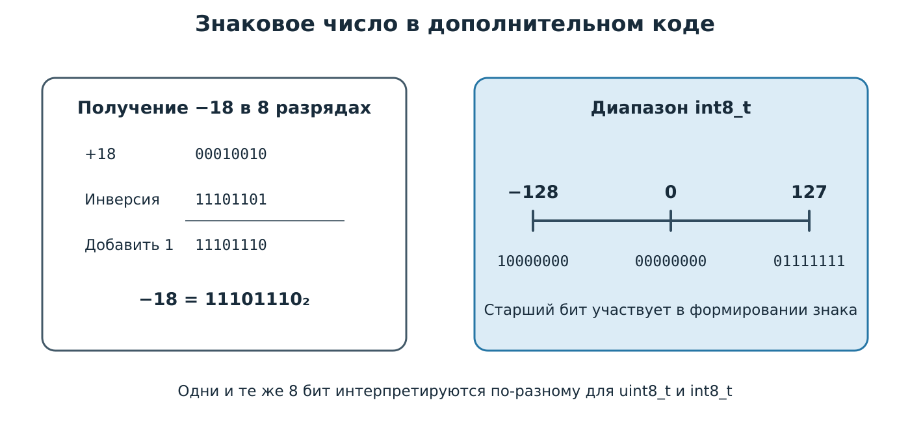

*Рисунок 6 — число −18 получается инверсией кода +18 и добавлением единицы; восьмиразрядный знаковый диапазон несимметричен и равен от −128 до +127.*

Проверим код сложением:

```text
  00010010   +18
+ 11101110   −18
-----------
1 00000000
```

Девятый бит отбрасывается, а восьмиразрядный результат равен нулю.

### 5.3. Типы фиксированной ширины

В программах для микроконтроллеров предпочтительны типы из `<stdint.h>` или `<cstdint>`:

| Тип | Разрядность | Диапазон |
|---|---:|---:|
| `uint8_t` | 8 | 0…255 |
| `int8_t` | 8 | −128…127 |
| `uint16_t` | 16 | 0…65 535 |
| `int16_t` | 16 | −32 768…32 767 |
| `uint32_t` | 32 | 0…4 294 967 295 |
| `int32_t` | 32 | −2 147 483 648…2 147 483 647 |

Запись `uint16_t` сразу сообщает читателю программы, что переменная беззнаковая и занимает ровно 16 бит. Обычный тип `int` может иметь разную ширину на разных платформах.

---

## 6. Другие виды данных

### 6.1. Логические значения

Логическое значение имеет два состояния: истина и ложь. В C++ ему соответствует тип `bool`. На уровне команд процессор обычно проверяет отдельные биты или флаги регистра состояния.

### 6.2. Символы и строки

Текст хранится как последовательность кодов. ASCII определяет коды латинских букв, цифр и управляющих символов в диапазоне 0…127. Например, `A` имеет код 65, или `0x41`.

Unicode задаёт кодовые позиции для символов различных письменностей. UTF-8 кодирует одну кодовую позицию последовательностью от одного до четырёх байтов. Первые 128 кодов UTF-8 совпадают с ASCII. Поэтому утверждение «один символ всегда занимает один байт» верно только для ограниченного набора однобайтовых кодировок и неверно для UTF-8 в общем случае.

### 6.3. Вещественные числа

В микроконтроллерных системах применяют два подхода:

- **фиксированная точка**: целое число хранит величину с заранее выбранным масштабом, например 253 означает 25,3 °C;
- **плавающая точка**: число хранится через знак, порядок и значащую часть.

Фиксированная точка обеспечивает предсказуемую точность и часто требует меньше ресурсов. Плавающая точка удобнее при большом диапазоне значений. На Cortex-M4F операции с `float` может ускорять аппаратный блок FPU, если он присутствует и включён в конкретном микроконтроллере.

---

## 7. Двоичная арифметика

### 7.1. Сложение

Основные правила:

| Операция | Результат | Перенос |
|:---:|:---:|:---:|
| `0 + 0` | `0` | `0` |
| `0 + 1` | `1` | `0` |
| `1 + 0` | `1` | `0` |
| `1 + 1` | `0` | `1` |
| `1 + 1 + 1` | `1` | `1` |

Сложение выполняют справа налево, начиная с младшего бита. Перенос из текущего разряда добавляют к следующему.

Рассмотрим сложение двух однобайтовых чисел:

$$
45_{10}=00101101_2, \qquad 27_{10}=00011011_2.
$$

Поразрядная запись имеет вид:

```text
          переносы: 1 1 1 1 1 1
                    0 0 1 0 1 1 0 1   45
                  + 0 0 0 1 1 0 1 1   27
                  -------------------
                    0 1 0 0 1 0 0 0   72
                    7 6 5 4 3 2 1 0   номера битов
```

Первые действия выполняются так:

1. Бит 0: $1+1=10_2$. В результат записывается 0, формируется перенос 1.
2. Бит 1: $0+1+1=10_2$. В результат записывается 0, перенос сохраняется.
3. Бит 2: $1+0+1=10_2$. В результат записывается 0, перенос сохраняется.
4. Бит 3: $1+1+1=11_2$. В результат записывается 1, перенос сохраняется.
5. Операция продолжается до старшего разряда.

Итог:

$$
00101101_2+00011011_2=01001000_2=72_{10}.
$$

Подробная схема сложения приведена на рисунке.

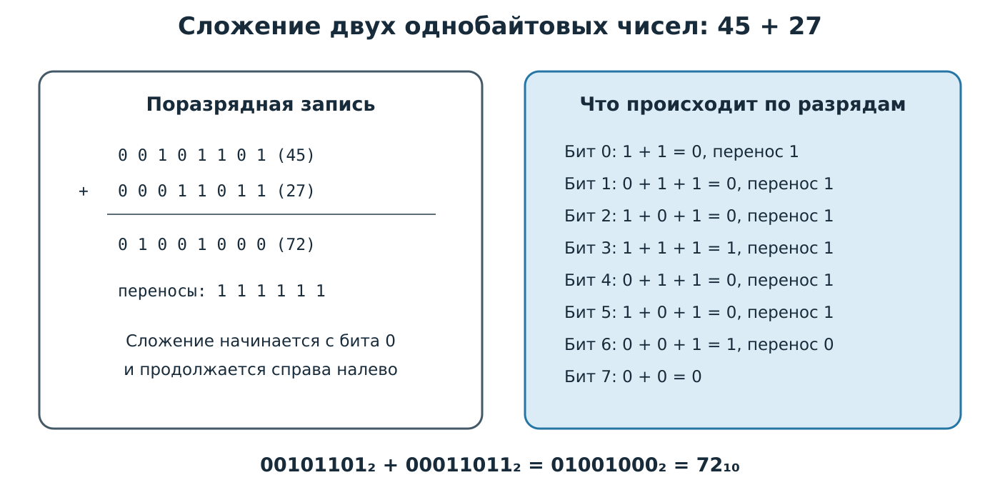

*Рисунок 7 — при сложении чисел 45 и 27 перенос последовательно передаётся в старшие разряды, а результат `01001000₂` равен 72.*

### 7.2. Вычитание

При ручном вычитании можно занимать единицу из старшего разряда. Однако АЛУ обычно заменяет вычитание сложением с дополнительным кодом второго операнда:

$$
A-B=A+(\overline{B}+1).
$$

Выполним $83-29$. Сначала получим дополнительный код числа −29:

```text
  +29:       00011101
  инверсия:  11100010
  добавить 1:11100011   это код −29
```

Теперь складываем 83 и −29:

```text
    01010011   +83
  + 11100011   −29
  ----------
  1 00110110
```

Перенос за пределы восьмиразрядного результата отбрасывается:

$$
00110110_2=54_{10}.
$$

Следовательно, $83-29=54$.

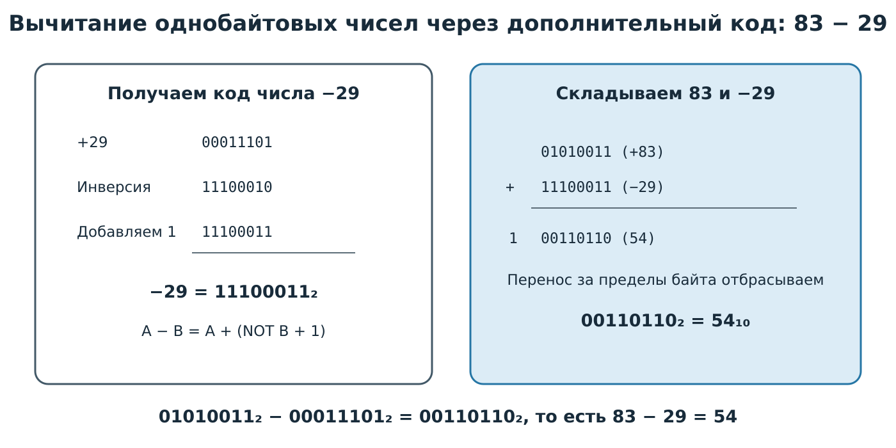

*Рисунок 8 — вычитаемое 29 заменяется его дополнительным кодом, после чего процессор выполняет обычное двоичное сложение.*

### 7.3. Умножение сдвигом и сложением

Двоичное умножение строится на частичных произведениях. Каждый единичный бит множителя добавляет к результату множимое, сдвинутое влево на номер этого бита.

Рассмотрим пример:

$$
13_{10}\cdot11_{10}=00001101_2\cdot00001011_2.
$$

Множитель `00001011₂` содержит единицы в разрядах 0, 1 и 3. Поэтому формируются три ненулевых частичных произведения:

| Бит множителя | Действие | Частичное произведение |
|---:|---|:---:|
| 0 = 1 | `00001101 << 0` | `00001101` = 13 |
| 1 = 1 | `00001101 << 1` | `00011010` = 26 |
| 2 = 0 | не добавляется | `00000000` |
| 3 = 1 | `00001101 << 3` | `01101000` = 104 |

Сложим частичные произведения:

```text
    00001101    13
    00011010    26
    00000000     0
  + 01101000   104
  ----------
    10001111   143
```

Таким образом:

$$
13\cdot11=143.
$$

Алгоритм умножения сдвигом и сложением показан ниже.

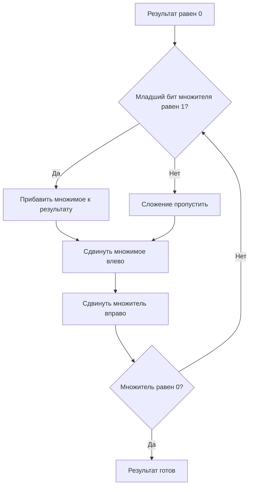

Подробный числовой пример приведён на рисунке.

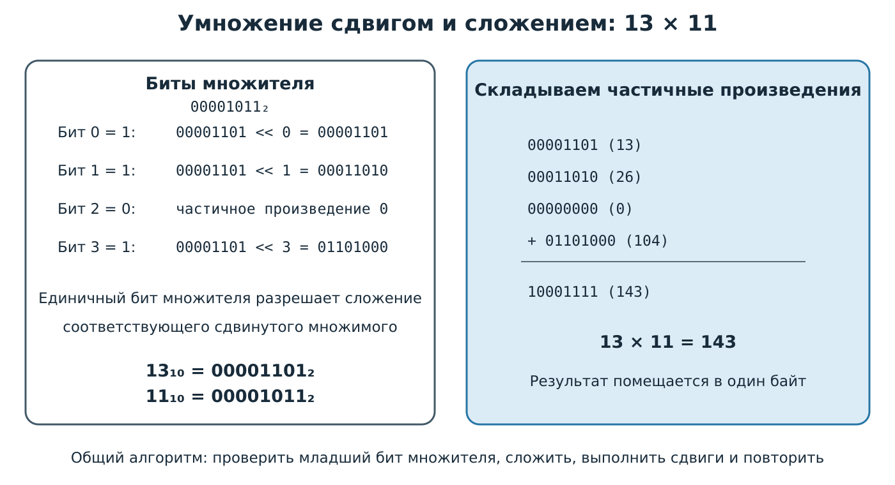

*Рисунок 9 — единичные биты множителя 11 выбирают сдвинутые значения 13, 26 и 104, сумма которых равна 143.*

Для двух восьмиразрядных сомножителей результат в общем случае может потребовать 16 бит. Например, $255\cdot255=65025$ не помещается в один байт.

### 7.4. Двоичное деление

Деление можно выполнить последовательной обработкой битов делимого. На каждом шаге очередной бит присоединяется справа к текущему остатку. Затем остаток сравнивается с делителем:

- если остаток меньше делителя, в частное записывается 0;
- если остаток не меньше делителя, делитель вычитается, а в частное записывается 1.

Рассмотрим деление $156$ на $13$:

$$
156_{10}=10011100_2, \qquad 13_{10}=00001101_2.
$$

| Шаг | Следующий бит делимого | Остаток после присоединения бита | Действие | Новый бит частного |
|---:|:---:|---:|---|:---:|
| 1 | 1 | 1 | $1<13$, вычитания нет | 0 |
| 2 | 0 | 2 | $2<13$, вычитания нет | 0 |
| 3 | 0 | 4 | $4<13$, вычитания нет | 0 |
| 4 | 1 | 9 | $9<13$, вычитания нет | 0 |
| 5 | 1 | 19 | $19-13=6$ | 1 |
| 6 | 1 | 13 | $13-13=0$ | 1 |
| 7 | 0 | 0 | $0<13$, вычитания нет | 0 |
| 8 | 0 | 0 | $0<13$, вычитания нет | 0 |

Полученные биты частного образуют `00001100₂`, то есть 12. Остаток равен нулю:

$$
10011100_2 \div 00001101_2=00001100_2,
$$

$$
156\div13=12.
$$

Алгоритм двоичного деления имеет следующий вид.

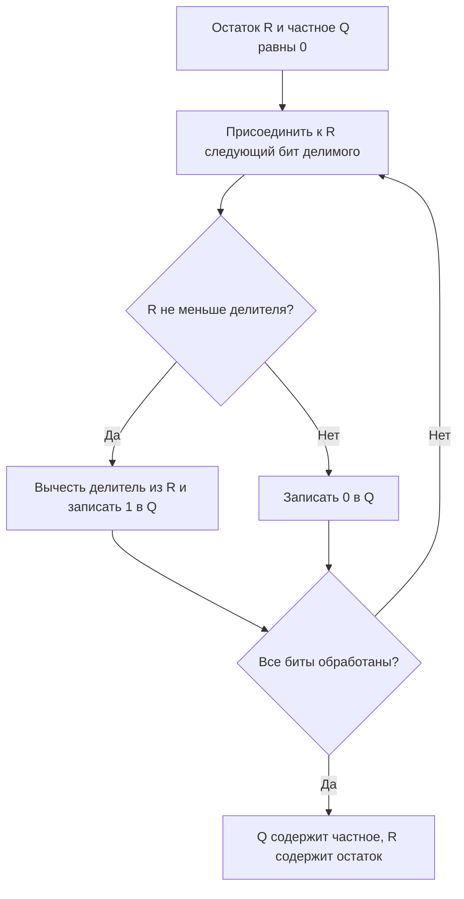

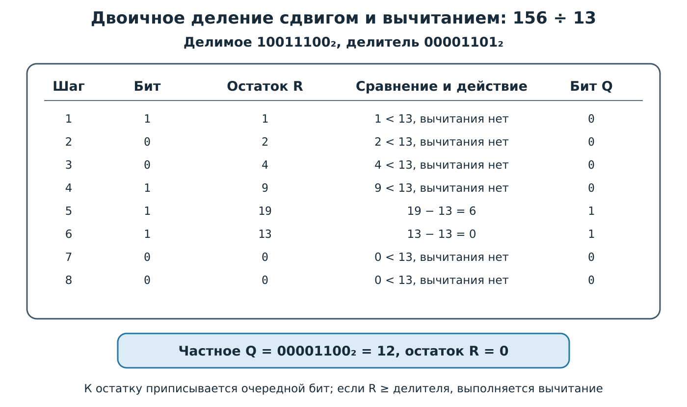

*Рисунок 10 — при делении 156 на 13 частное формируется по одному биту, а промежуточный остаток уменьшается вычитанием делителя.*

---

## 8. Флаги результата и переполнение

После арифметической или логической команды процессор может обновить флаги регистра состояния. В ARM Cortex-M используются флаги `N`, `Z`, `C`, `V`. В AVR аналогичные признаки находятся в регистре `SREG`.

| Флаг | Значение |
|:---:|---|
| `N` | результат имеет установленный знаковый бит |
| `Z` | результат равен нулю |
| `C` | возник перенос из старшего разряда или заём, согласно правилам команды |
| `V` | возникло переполнение знакового результата |

Флаги `C` и `V` нельзя считать взаимозаменяемыми. Их различие показано на рисунке.

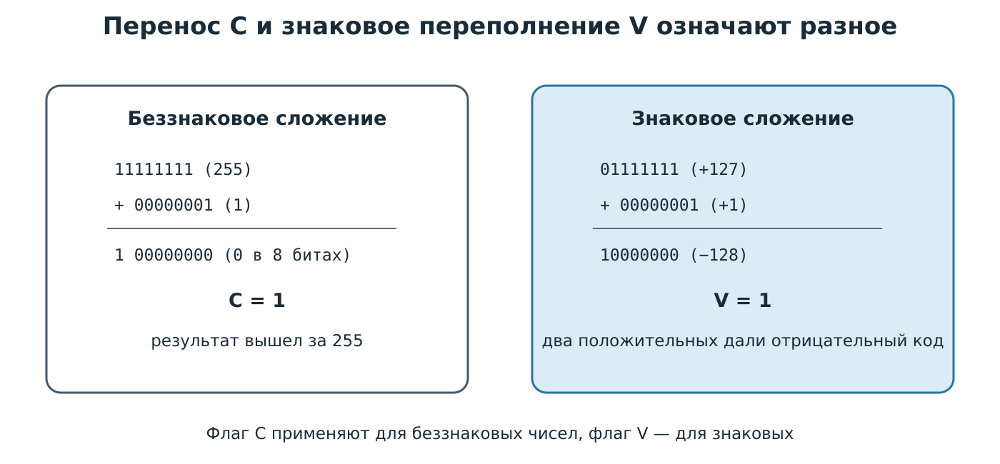

*Рисунок 11 — перенос `C` обнаруживает выход беззнакового результата за диапазон, а `V` показывает невозможный для выбранной разрядности знаковый результат.*

Знаковое переполнение при сложении возникает, если складываются числа одинакового знака, а результат получает противоположный знак. Например, в восьми разрядах `127 + 1` превращается в код `10000000`, который интерпретируется как −128.

В языках C и C++ беззнаковая арифметика выполняется по модулю $2^n$. Поведение при переполнении знакового целого требует особой осторожности. Нельзя строить переносимый код, предполагая, что знаковое переполнение всегда просто «зациклит» значение.

---

## 9. Логические операции

Логические команды обрабатывают каждый разряд независимо.

| `A` | `B` | `A AND B` | `A OR B` | `A XOR B` |
|:---:|:---:|:---:|:---:|:---:|
| 0 | 0 | 0 | 0 | 0 |
| 0 | 1 | 0 | 1 | 1 |
| 1 | 0 | 0 | 1 | 1 |
| 1 | 1 | 1 | 1 | 0 |

Операция `NOT` инвертирует каждый бит.

### 9.1. Назначение операций

- `AND` оставляет единицы только в разрешённых маской позициях;
- `OR` устанавливает выбранные биты;
- `XOR` переключает выбранные биты;
- `NOT` создаёт инвертированную маску.

### 9.2. Битовые маски

Маска — двоичное значение, в котором единицы отмечают обрабатываемые разряды. Маски особенно важны при работе с регистрами периферии: один регистр часто управляет сразу несколькими выводами или режимами.

Основные операции показаны на рисунке.

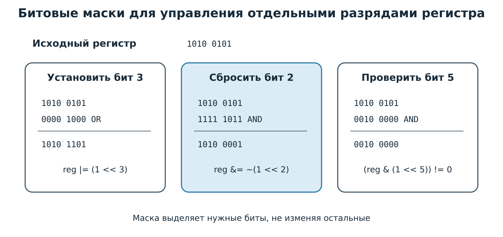

*Рисунок 12 — операции OR и AND позволяют установить, сбросить или проверить отдельный бит, сохранив остальные разряды регистра.*

Пример на C/C++:

```cpp
uint8_t reg = 0b10100101;

reg |=  (1u << 3);        // установить бит 3
reg &= ~(1u << 2);        // сбросить бит 2
reg ^=  (1u << 0);        // переключить бит 0

bool bit5 = (reg & (1u << 5)) != 0;  // проверить бит 5
```

Нумерация битов начинается с нуля: младший бит имеет номер 0.

### 9.3. Побитовые и логические операторы

Следует различать:

- побитовые операторы `&`, `|`, `^`, `~`;
- логические операторы `&&`, `||`, `!`.

Выражение `a & b` обрабатывает отдельные биты чисел, а `a && b` проверяет истинность двух условий.

---

## 10. Сдвиги и циклические сдвиги

### 10.1. Логический сдвиг

При логическом сдвиге освободившиеся позиции заполняются нулями. Для беззнакового числа сдвиг влево на один разряд соответствует умножению на 2, если значащий бит не был потерян. Сдвиг вправо соответствует целочисленному делению на 2.

### 10.2. Арифметический сдвиг вправо

Арифметический сдвиг вправо копирует знаковый бит в освободившиеся старшие позиции, благодаря чему отрицательное число сохраняет знак.

Различие показано на рисунке.

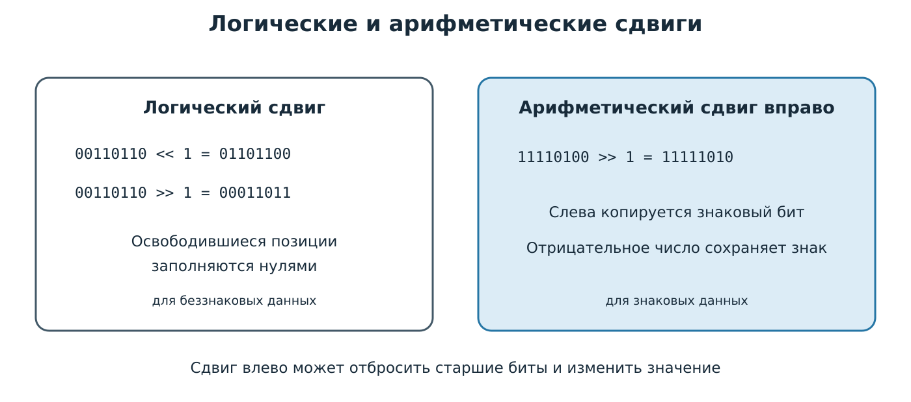

*Рисунок 13 — логический сдвиг заполняет позиции нулями, а арифметический сдвиг вправо распространяет знаковый бит.*

### 10.3. Циклический сдвиг

При циклическом сдвиге вытесненный бит возвращается с противоположной стороны. Процессоры также могут выполнять сдвиг через флаг переноса. Такие операции применяют в алгоритмах контроля, кодирования и многобайтной арифметике.

Практическое правило: перед сдвигом следует учитывать тип и ширину операнда. Для формирования 32-разрядной маски безопаснее использовать `1UL << n`, а не `1 << n`, если ширина обычного `int` на платформе неизвестна.

---

## 11. Порядок байтов в памяти

Многобайтное число занимает несколько соседних адресов. Архитектура определяет, какой байт хранится по младшему адресу.

- **little-endian**: сначала младший байт;
- **big-endian**: сначала старший байт.

На рисунке показано размещение числа `0x12345678`.

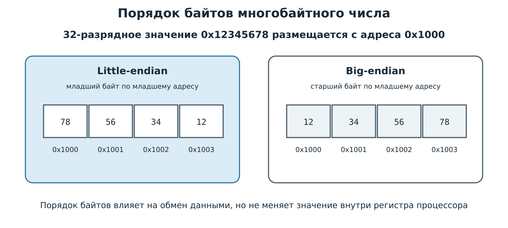

*Рисунок 14 — при little-endian по адресу `0x1000` находится байт `0x78`, а при big-endian — `0x12`.*

Порядок байтов особенно важен при:

- обмене по сети и последовательным интерфейсам;
- чтении двоичных файлов;
- передаче структур между разными процессорами;
- сборке 16- и 32-разрядного значения из отдельных байтов.

Пример явной сборки 16-разрядного числа из двух байтов:

```cpp
uint8_t highByte = 0x12;
uint8_t lowByte  = 0x34;

uint16_t value = (static_cast<uint16_t>(highByte) << 8) | lowByte;
// value == 0x1234
```

Явная сборка делает порядок байтов понятным и не зависит от размещения объекта в памяти.

---

## 12. Практический пример: упаковка состояния устройства

Предположим, один байт содержит состояние системы:

| Бит | Назначение |
|---:|---|
| 0 | двигатель включён |
| 1 | авария |
| 2 | автоматический режим |
| 3 | датчик готов |
| 4–7 | резерв |

Программа может управлять полями независимо:

```cpp
#include <stdint.h>

constexpr uint8_t MOTOR = 1u << 0;
constexpr uint8_t ALARM = 1u << 1;
constexpr uint8_t AUTO  = 1u << 2;
constexpr uint8_t READY = 1u << 3;

uint8_t status = 0;

status |= MOTOR;          // включить двигатель
status |= AUTO;           // включить автоматический режим
status &= ~MOTOR;         // выключить двигатель

if ((status & ALARM) != 0) {
    // обработать аварийное состояние
}
```

Такой способ компактен: восемь независимых логических признаков помещаются в одном байте. Однако назначение битов следует описывать именованными константами, иначе программа быстро становится непонятной.

---

## 13. Типичные ошибки

| Ошибка | Почему возникает | Правильный подход |
|---|---|---|
| Считать, что байт может хранить числа от 0 до 256 | Путают число комбинаций и максимальное значение | Диапазон `uint8_t`: 0…255 |
| Забывать разрядность результата | Старшие биты отбрасываются | Проверять диапазон до операции |
| Использовать `C` для знаковых чисел | Перенос не равен знаковому переполнению | Для знаковой арифметики учитывать `V` |
| Считать старший бит отдельным знаком | В дополнительном коде он имеет отрицательный вес | Использовать правила дополнительного кода |
| Путать `&` и `&&` | Операторы имеют разное назначение | `&` для битов, `&&` для условий |
| Сдвигать литерал `1` на большое число позиций | Тип `int` может оказаться недостаточно широким | Использовать `1u`, `1UL` или нужный тип |
| Предполагать один байт на любой символ | UTF-8 имеет переменную длину | Различать символ, кодовую позицию и байты |
| Игнорировать порядок байтов | Устройства по-разному формируют многобайтные поля | Явно задавать формат протокола |

---

## 14. Итоги

1. Микропроцессор работает с битовыми комбинациями, а формат определяет их смысл.
2. Разрядность задаёт число возможных комбинаций и диапазон значений.
3. Двоичная система удобна для цифровых схем, а шестнадцатеричная — для компактной записи кодов и адресов.
4. Отрицательные целые числа обычно хранятся в дополнительном коде.
5. Перенос `C` и переполнение `V` относятся к разным способам интерпретации результата.
6. Логические операции и маски позволяют изменять отдельные биты регистров.
7. Сдвиги перемещают разряды и могут использоваться в арифметике, упаковке данных и работе с периферией.
8. При обмене многобайтными данными нужно учитывать порядок байтов.

---

## 15. Контрольные вопросы

1. Почему одна и та же комбинация битов может обозначать разные данные?
2. Сколько комбинаций содержит 12-разрядное поле?
3. Каков диапазон `uint16_t` и `int16_t`?
4. Чему равно `10110110₂` в десятичной системе?
5. Почему одна шестнадцатеричная цифра соответствует четырём битам?
6. Как получить дополнительный код отрицательного числа?
7. Чем флаг переноса отличается от флага переполнения?
8. Как установить бит 6, не изменив остальные биты регистра?
9. Как проверить состояние бита 2?
10. Чем логический сдвиг вправо отличается от арифметического?
11. В чём различие `&` и `&&` в C/C++?
12. Как число `0x1234` размещается в памяти little-endian?
13. Почему кириллический символ в UTF-8 обычно занимает больше одного байта?
14. Когда фиксированная точка может быть удобнее `float`?
15. Как перевести десятичное число в двоичное с помощью степеней двойки?
16. Почему при умножении сдвигом складывают только те частичные произведения, которым соответствуют единичные биты множителя?
17. Как формируется очередной бит частного при двоичном делении?

---

## 16. Задания для самостоятельной работы

### Задание 1. Системы счисления

Переведите число `173₁₀` в двоичную, восьмеричную и шестнадцатеричную системы. Выполните обратную проверку.

### Задание 2. Дополнительный код

Представьте числа −37 и −100 в восьмиразрядном дополнительном коде. Сложением с положительным числом проверьте первый результат.

### Задание 3. Флаги

Для каждой восьмиразрядной операции укажите результат и значения флагов `C`, `Z`, `N`, `V`:

1. `0xFF + 0x01`;
2. `0x7F + 0x01`;
3. `0x80 + 0x80`;
4. `0x01 − 0x01`.

### Задание 4. Битовый регистр

Разработайте байт состояния, содержащий не менее пяти признаков устройства. Для каждого признака запишите выражения установки, сброса, переключения и проверки.

### Задание 5. Двоичная арифметика

Выполните вычисления подробно, показывая переносы, дополнительный код и промежуточные результаты:

1. сложите однобайтовые числа 58 и 37;
2. вычислите $91-46$ через сложение с дополнительным кодом;
3. умножьте 12 на 10 сдвигом и сложением;
4. разделите 180 на 15 сдвигом, сравнением и вычитанием;
5. проверьте все ответы обратными операциями в десятичной системе.

---

## Источники

1. [Arm. Cortex-M4 Devices Generic User Guide](https://documentation-service.arm.com/static/5f2ac76d60a93e65927bbdc5).
2. [Microchip. AVR Instruction Set Manual](https://ww1.microchip.com/downloads/en/DeviceDoc/AVR-InstructionSet-Manual-DS40002198.pdf).
3. [Microchip. AVR Status Register](https://onlinedocs.microchip.com/oxy/GUID-80B1922D-872B-40C8-A8A5-0CBE009FD908-en-US-3/GUID-CE0DCB6D-2266-4C24-8BE6-FEC114F6D6E3.html).
4. [Arduino. Bit Math](https://docs.arduino.cc/learn/programming/bit-math/).
5. [Unicode Consortium. The Unicode Standard](https://www.unicode.org/standard/standard.html).
6. [Unicode Consortium. UTF-8, UTF-16, UTF-32 and BOM](https://www.unicode.org/faq/utf_bom.html).
7. [Intel. Intel 64 and IA-32 Architectures Software Developer’s Manual, Volume 1](https://cdrdv2-public.intel.com/782149/253665-sdm-vol-1.pdf).
8. [Fixed-width integer types in C++](https://en.cppreference.com/w/cpp/types/integer.html).
