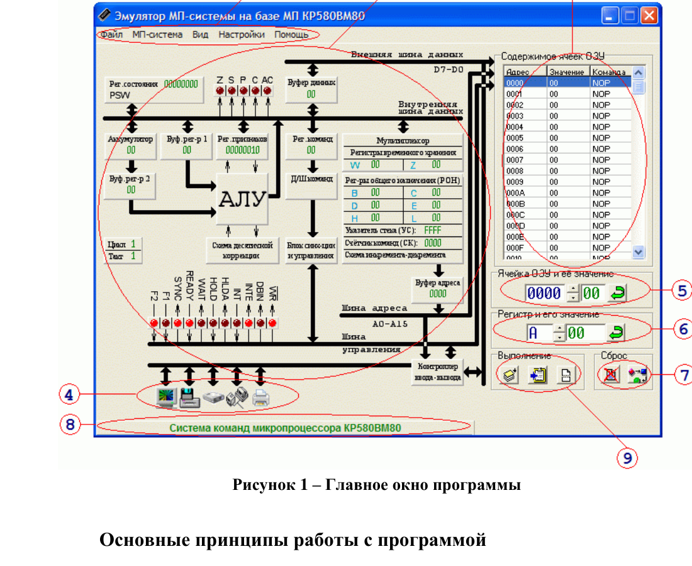

# Практическая работа №2
## Изучение эмулятора микропроцессорной системы на базе КР580ВМ80

### Цель работы

Приобрести навыки работы с эмулятором микропроцессорной системы КР580ВМ80 и научиться:

- вводить машинные коды в ОЗУ;
- изменять значения регистров;
- выполнять программу по командам и тактам;
- наблюдать изменения программно-доступных объектов;
- выполнять простейшее ручное ассемблирование.

---

## 1. Главное окно эмулятора

В центральной части окна расположена структурная схема МПС.



На схеме представлены:

- регистр состояния `PSW`;
- аккумулятор `A`;
- регистр флагов `Z, S, P, CY, AC`;
- регистр команд и дешифратор команд;
- АЛУ;
- регистры общего назначения `B, C, D, E, H, L`;
- временные регистры `W, Z`;
- указатель стека `SP`;
- счётчик команд `PC`;
- буфер адреса и буфер данных;
- контроллер ввода/вывода;
- ОЗУ;
- шины адреса, данных и управления;
- порты внешних устройств.

Активные элементы интерфейса позволяют изменять значения регистров и ячеек ОЗУ.

---

## 2. Режимы выполнения

Эмулятор предусматривает:

1. **выполнение по тактам** — для наблюдения микроопераций;
2. **выполнение по командам** — одна машинная команда за шаг;
3. **программный режим** — непрерывное выполнение.

### Важное уточнение о `HLT` и `HLDA`

Команда:

```asm
HLT
```

останавливает нормальную выборку последующих команд.

В исходной методичке останов связывается с `HLDA`. Для реального Intel 8080/КР580ВМ80 `HLDA` означает **Hold Acknowledge** — подтверждение захвата шин при сигнале `HOLD`, а не флаг команды `HLT`. Если конкретный эмулятор использует этот индикатор для визуализации останова, это особенность интерфейса эмулятора.

---

## 3. Исходный фрагмент программы

```asm
MVI A, 78
INR B
SUB B
MOV D, A
MOV A, B
HLT
```

В исходной методичке `HLT` отсутствовал. Он добавлен здесь, чтобы программа корректно завершалась.

Числа `78` и `34` трактуются как десятичные.

### Перевод чисел

```text
78₁₀ = 4Eh
34₁₀ = 22h
```

---

## 4. Машинные коды

| Команда | 1-й байт | 2-й байт |
|---|---:|---:|
| `MVI A,4Eh` | `3E` | `4E` |
| `INR B` | `04` | — |
| `SUB B` | `90` | — |
| `MOV D,A` | `57` | — |
| `MOV A,B` | `78` | — |
| `HLT` | `76` | — |

### Размещение в памяти

| Адрес | Байт |
|---:|---:|
| `0000h` | `3E` |
| `0001h` | `4E` |
| `0002h` | `04` |
| `0003h` | `90` |
| `0004h` | `57` |
| `0005h` | `78` |
| `0006h` | `76` |

---

## 5. Начальные значения

Перед запуском установить:

```text
B = 34₁₀ = 22h
A = 00h
D = 00h
PC = 0000h
```

---

## 6. Выполнение по командам

Заполните таблицу после выполнения каждой команды.

| Шаг | PC после команды | Команда | A | B | D |
|---:|---:|---|---:|---:|---:|
| 0 | `0000h` | начало | `00h` | `22h` | `00h` |
| 1 | | `MVI A,4Eh` | | | |
| 2 | | `INR B` | | | |
| 3 | | `SUB B` | | | |
| 4 | | `MOV D,A` | | | |
| 5 | | `MOV A,B` | | | |
| 6 | | `HLT` | | | |

### Контрольные ориентиры

```text
после MVI:     A = 4Eh
после INR:     B = 23h
после SUB:     A = 4Eh - 23h = 2Bh
после MOV D,A: D = 2Bh
после MOV A,B: A = 23h
```

---

## 7. Исследование по тактам

Исследовать команду:

```asm
MVI A, 4Eh
```

Для классического Intel 8080 команда `MVI r,d8` занимает:

```text
2 машинных цикла
7 T-состояний (тактов)
```

Наблюдайте:

1. выборку кода `3Eh`;
2. увеличение `PC`;
3. считывание второго байта `4Eh`;
4. загрузку значения в аккумулятор.

---

## 8. Контрольные вопросы

1. Какие основные блоки можно выделить в структуре микропроцессора?
2. Что входит в систему команд процессора?
3. Какие классы команд представлены в эмуляторе?
4. Для чего предназначены команды передачи управления?
5. Какие способы адресации используются в исследуемом фрагменте?
6. Чем режим по тактам отличается от режима по командам?
7. Как записать программу в машинных кодах в ОЗУ?
8. Как изменить содержимое регистра?
9. Как изменить содержимое ячейки памяти?
10. Что такое машинный цикл?
11. Что такое T-состояние?
12. Почему `MVI A,d8` занимает два байта?

---

## 9. Содержание отчёта

1. Номер и название работы.
2. Цель.
3. Скриншот главного окна эмулятора.
4. Таблица машинных кодов.
5. Скриншот ОЗУ после ввода программы.
6. Таблица изменения регистров.
7. Результат исследования `MVI A,4Eh` по тактам.
8. Ответы на контрольные вопросы.
9. Вывод.
