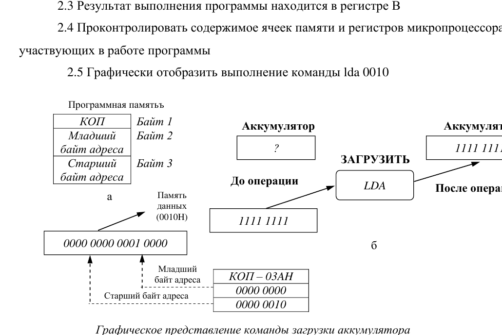

# Практическая работа №3
## Запись и выполнение простых программ

### Цель работы

Исследовать выполнение отдельных команд и простых программ микропроцессором КР580ВМ80 и закрепить навыки:

- ввода программ в эмулятор;
- пошагового выполнения;
- анализа регистров и памяти;
- использования различных способов адресации;
- применения условных переходов и циклов.

---

## 1. Подготовка

Перед каждой программой:

1. очистите ОЗУ и регистры либо загрузите подготовленный образ;
2. введите программу;
3. заполните рабочие ячейки исходными данными;
4. установите `PC` на адрес начала программы;
5. выполняйте программу по командам;
6. фиксируйте изменения регистров, флагов и памяти.

---

## 2. Задание 1. Инверсия байта

Программа читает байт из `0010h`, инвертирует его и записывает результат в `0011h`.

### Исправленный листинг программы 2.1

```asm
LXI H, 0010h    ; HL = 0010h
MOV A, M        ; A = [0010h]
CMA             ; A = NOT A
INX H           ; HL = 0011h
MOV M, A        ; [0011h] = A
HLT
```

В исходнике встречались опечатки `LXI HI`, `LNX HL`, `HIT`; они исправлены.

### Ход работы

1. Ввести программу.
2. Записать в `0010h` произвольный байт `01h...FFh`.
3. Выполнить программу по командам.
4. Проверить `0011h`.

Пример:

```text
[0010h] = 50h
NOT 50h = AFh
[0011h] = AFh
```

### Таблица наблюдений

| Объект | Начало | `LXI H` | `MOV A,M` | `CMA` | `INX H` | `MOV M,A` | `HLT` |
|---|---|---|---|---|---|---|---|
| A | | | | | | | |
| Флаги | | | | | | | |
| H | | | | | | | |
| L | | | | | | | |
| `[0010h]` | | | | | | | |
| `[0011h]` | | | | | | | |

> Команда `CMA` у 8080 инвертирует аккумулятор и не изменяет флаги. Если эмулятор показывает иное, зафиксируйте это как особенность модели.

---

## 3. Задание 2. Нахождение большего из двух байтов

Исходные значения:

```text
[0010h]
[0011h]
```

Результат — большее значение — поместить в `B`.

### Исправленный листинг программы 2.2

```asm
LDA 0010h       ; A = [0010h]
MOV D, A        ; сохранить первое число

LHLD 0011h      ; L = [0011h], H = [0012h]
SUB L           ; A = первое - второе

JNC FIRST_MAX   ; заёма нет -> первое >= второго
MOV B, L        ; максимум = второе
JMP DONE

FIRST_MAX:
MOV B, D        ; максимум = первое

DONE:
HLT
```

### Исправления

- `LHTD` → `LHLD`;
- комментарий к `JNC` исправлен: переход выполняется **при отсутствии Carry**, а после `SUB` это означает отсутствие заёма.

> `LHLD 0011h` для этой задачи избыточна, поскольку одновременно считывает `[0012h]` в `H`. Она сохранена, так как исходная программа предназначена для изучения разных команд.

### Графическое представление `LDA 0010h`



Команда:

```asm
LDA 0010h
```

занимает три байта:

```text
3Ah 10h 00h
```

Адрес хранится в формате little-endian: младший байт адреса идёт раньше старшего.

---

## 4. Задание 3. Сложение двух чисел

Исходные числа:

```text
[0010h]
[0011h]
```

Результат:

```text
[0012h]
```

### Программа 2.3

```asm
LXI H, 0010h    ; HL = адрес первого числа
LXI B, 0011h    ; BC = адрес второго числа
LDAX B          ; A = [BC] = [0011h]
ADD M           ; A = A + [HL]
INX B           ; BC = 0012h
STAX B          ; [0012h] = A
HLT
```

### Таблица наблюдений

| № | Команда | A | Флаги | HL | `[0010h]` | `[0011h]` | `[0012h]` | BC |
|---:|---|---|---|---|---|---|---|---|
| 1 | `LXI H,0010h` | | | | | | | |
| 2 | `LXI B,0011h` | | | | | | | |
| 3 | `LDAX B` | | | | | | | |
| 4 | `ADD M` | | | | | | | |
| 5 | `INX B` | | | | | | | |
| 6 | `STAX B` | | | | | | | |
| 7 | `HLT` | | | | | | | |

Пример:

```text
[0010h] = 15h
[0011h] = 01h
[0012h] = 16h
```

---

## 5. Задание 4. Проверка равенства двух чисел

### Исправленный листинг программы 2.4

```asm
START:
LXI H, 0010h
LXI B, 0011h
LDAX B          ; A = [0011h]
XRA M           ; A = [0011h] XOR [0010h]
JZ START        ; если числа равны, XOR = 0
MOV B, A        ; если не равны, B = XOR-разность
HLT
```

Исправлено `IZ START` → `JZ START`.

### Что исследовать

- при равных числах программа возвращается к `START`;
- при неравных `B` получает результат XOR.

Пример:

```text
10h XOR 01h = 11h
```

> Эта программа не только проверяет равенство, но и сохраняет XOR-разность, если числа не равны.

---

## 6. Задание 5. Копирование массива

Исходная методичка неоднозначно описывает размещение массива. По листингу источник начинается с `0000h`, а приёмник — с `0010h`.

### Исправленный листинг программы 2.5

```asm
LXI H, 0000h    ; источник
LXI D, 0010h    ; приёмник
MVI B, 10h      ; 10h = 16 элементов

COPY:
MOV A, M
STAX D
INX H
INX D
DCR B
JNZ COPY
HLT
```

### Ход работы

1. Записать 16 произвольных байтов в:

```text
0000h...000Fh
```

2. Выполнить программу.
3. Убедиться, что копия появилась в:

```text
0010h...001Fh
```

> В исходном образце встречалась фраза «10 байтов». Здесь исправлено: `10h` — это 16 десятичных элементов.

---

## 7. Задание 6. Загрузка двух 16-битных операндов

Даны четыре байта:

```text
[0010h], [0011h], [0012h], [0013h]
```

Загрузить их в пары `BC` и `DE`.

Один из вариантов:

```asm
LDA 0010h
MOV B, A

LDA 0011h
MOV C, A

LDA 0012h
MOV D, A

LDA 0013h
MOV E, A

HLT
```

В отчёте явно укажите, какой байт каждого 16-битного операнда считается старшим, а какой младшим.

---

## 8. Задание 7. Инверсия байта с результатом в D

```asm
LXI H, 0010h
MOV A, M
CMA
MOV D, A
HLT
```

1. Поместить исходное значение в `0010h`.
2. Выполнить программу.
3. Проверить результат в `D`.

Пример:

```text
[0010h] = 00h
D = FFh
```

---

## 9. Контрольные вопросы

1. Что такое мнемоника команды?
2. Чем машинный код отличается от мнемоники?
3. Что означает `M` в командах `MOV A,M` и `ADD M`?
4. Какой способ адресации использует `LDA 0010h`?
5. Какой способ адресации использует `MVI A,25h`?
6. Как работает `LDAX B`?
7. Как после `SUB` определить наличие заёма?
8. Что делает `JNC`?
9. Почему `LHLD` загружает два байта?
10. Что делает `CMA`?
11. Зачем используется `HLT`?
12. Почему `10h` равно 16, а не 10?

---

## 10. Содержание отчёта

1. Цель работы.
2. Перечень исследуемых команд.
3. Исправленные листинги программ.
4. Исходные данные для каждого задания.
5. Заполненные таблицы.
6. Скриншоты эмулятора.
7. Ответы на контрольные вопросы.
8. Анализ результатов.
9. Вывод.
