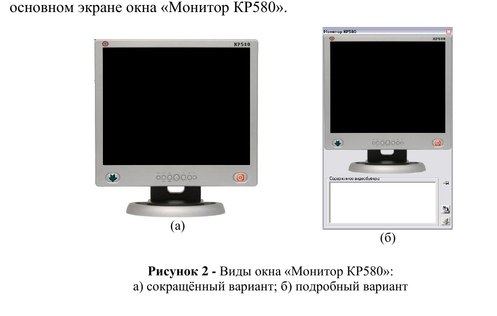

# Практическая работа №5
## Взаимодействие с внешними устройствами через программу на ассемблере

### Цель работы

Приобрести навыки программного ввода-вывода на КР580ВМ80:

- использовать команды `IN` и `OUT`;
- работать с портами эмулятора;
- выводить текст и графические точки на виртуальный монитор.

---

## 1. Ввод-вывод в КР580ВМ80

КР580ВМ80/Intel 8080 имеет отдельное пространство портов ввода-вывода.

### Вывод

```asm
OUT port
```

Передаёт содержимое аккумулятора `A` в указанный порт.

### Ввод

```asm
IN port
```

Читает байт из порта в аккумулятор `A`.

---

## 2. Порты эмулятора

По исходной методичке используются:

| Порт | Устройство |
|---:|---|
| `00h` | виртуальный монитор |
| `01h` | виртуальный дисковод |
| `02h` | виртуальный жёсткий диск |
| `03h` | сетевой адаптер |
| `04h` | принтер |

Конкретное поведение устройств зависит от версии эмулятора.

---

## 3. Виртуальный монитор

Окно монитора имеет сокращённый и подробный вид.



### Формат управляющего байта

По описанию эмулятора первый байт содержит:

- старший бит:
  - `0` — текстовый режим;
  - `1` — графический режим;
- остальные 7 бит — код цвета.

### Исправление исходного описания

В исходной методичке указана «глубина цвета 128 бит». Это некорректно. Семь бит дают:

```text
2^7 = 128
```

различных кодов цвета. То есть речь идёт о **128 значениях цвета**, а не о 128 битах на пиксель.

---

## 4. Текстовый режим

Передаются два байта:

```text
Байт 1: 0ccccccc
Байт 2: код символа
```

Пример управляющего байта:

```text
01010000b = 50h
```

Второй байт — код символа из таблицы, поддерживаемой эмулятором.

---

## 5. Графический режим

Для одной точки передаются три байта:

```text
Байт 1: 1ccccccc
Байт 2: X
Байт 3: Y
```

Диапазон координат:

```text
X = 00h...FFh
Y = 00h...FFh
```

Начало координат — левый верхний угол.

---

## 6. Задание 1. Вывод латинского алфавита

Вывести строчные латинские буквы по порядку:

```text
a b c ... z
```

### Исходные значения

```text
B = 61h     ; ASCII 'a'
C = 1Ah     ; 26 символов
```

### Алгоритм

1. `B ← 61h`.
2. `C ← 1Ah`.
3. Загрузить в `A` управляющий байт текстового режима, например `50h`.
4. Выполнить `OUT 00h`.
5. Загрузить в `A` код символа из `B`.
6. Выполнить `OUT 00h`.
7. `INR B`.
8. `DCR C`.
9. Если `C ≠ 0`, повторить цикл.
10. Выполнить `HLT`.

### Каркас программы

```asm
MVI B, 61h
MVI C, 1Ah

NEXT:
MVI A, 50h
OUT 00h

MOV A, B
OUT 00h

INR B
DCR C
JNZ NEXT

HLT
```

После выполнения сохранить изображение экрана средствами эмулятора и приложить его к отчёту.

---

## 7. Задание 2. Графические примитивы

Нарисовать по точкам:

1. отрезок;
2. треугольник;
3. прямоугольник;
4. квадрат.

### Порядок вывода одной точки

```text
1. A ← управляющий байт графического режима
2. OUT 00h
3. A ← X
4. OUT 00h
5. A ← Y
6. OUT 00h
```

Пример управляющего байта графического режима:

```text
11010000b = D0h
```

### Подсказка

Горизонтальная линия:

```text
Y = const
X = X0, X0+1, X0+2, ...
```

Вертикальная линия:

```text
X = const
Y = Y0, Y0+1, Y0+2, ...
```

Для диагонали можно одновременно изменять `X` и `Y`.

---

## 8. Контрольные вопросы

1. Чем пространство портов отличается от адресного пространства памяти?
2. Что делает `OUT 00h`?
3. Откуда команда `OUT` берёт выводимый байт?
4. Куда команда `IN` помещает считанный байт?
5. Как отличить текстовый режим от графического?
6. Сколько значений цвета можно закодировать 7 битами?
7. Сколько байт передаётся для одного текстового символа?
8. Сколько байт передаётся для одной графической точки?
9. Где находится начало координат?
10. Как организовать цикл вывода последовательности символов?

---

## 9. Содержание отчёта

1. Цель.
2. Таблица портов.
3. Описание протокола монитора.
4. Листинг задания 1.
5. Скриншот алфавита.
6. Листинг задания 2.
7. Скриншоты графических объектов.
8. Ответы на контрольные вопросы.
9. Вывод.
