# Лекция 1. Этапы проектирования микропроцессорных систем

**МДК.02.01 «Микропроцессорные системы»**  
**Тема:** постановка технического задания, анализ объекта управления, определение входных и выходных сигналов.

> **Цель лекции.** Сформировать понимание методики начального проектирования МПС управления: от словесного описания задачи до технического задания, анализа объекта управления, ведомости сигналов и требований к ресурсам системы.

## Планируемые результаты

После изучения материала студент должен понимать назначение технического задания, уметь анализировать объект управления, классифицировать входные и выходные сигналы, определять требования к GPIO, памяти, таймерам и интерфейсам, а также оформлять результаты анализа в виде **I/O Map**.

---

## Слайд 1. Титульный слайд

Лекция посвящена первому этапу инженерного проектирования микропроцессорной системы управления. На этом занятии рассматривается не программирование и не монтаж платы, а подготовительная работа, без которой невозможно получить надежное устройство: постановка технического задания, анализ объекта управления и определение состава входных и выходных сигналов. Для студента важно понять, что микропроцессорная система начинается не с выбора микросхемы, а с описания задачи, условий эксплуатации, требований к реакции системы и перечня сигналов, которые система должна принимать и выдавать.

На слайде используется схема, показывающая МПС как управляющий центр между датчиками, органами управления, исполнительными устройствами и средствами индикации.

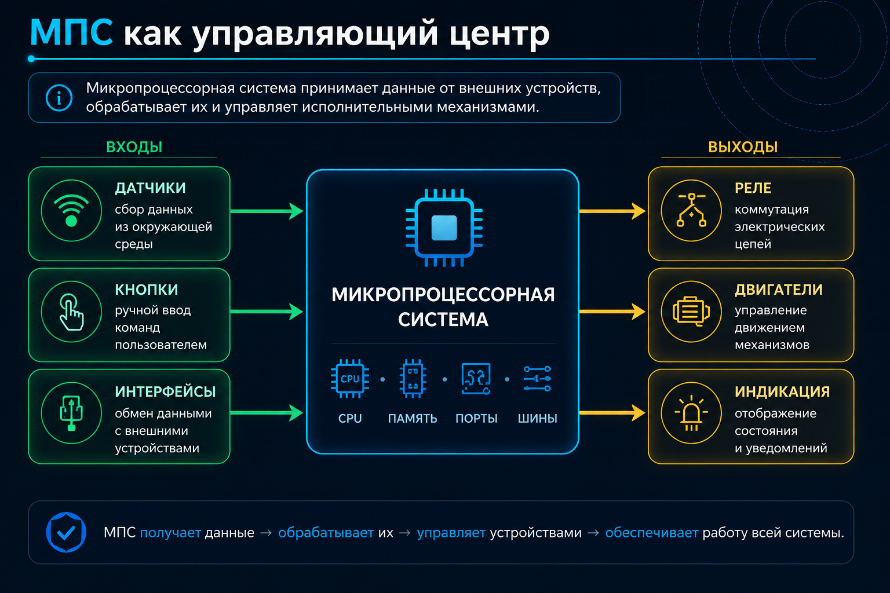

*Рисунок 1. МПС как управляющий центр: входы, обработка и выходные воздействия.*

## Слайд 2. Введение. План лекции

На лекции последовательно разбирается весь путь от исходной идеи до формализованных исходных данных для проектирования. Сначала рассматривается жизненный цикл микропроцессорной системы, затем выделяется роль технического задания. После этого проводится анализ объекта управления: что именно контролируется, какие физические процессы происходят и какие требования предъявляются к каналам связи. Далее изучаются входные и выходные сигналы, их классификация, проблемы согласования уровней, необходимость фильтрации и защиты. Завершает лекцию пример разбора задачи на основе умного светофора.

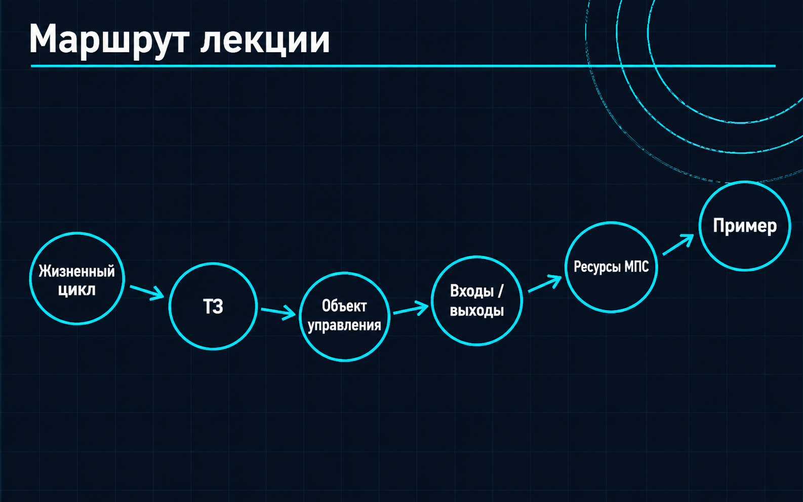

*Рисунок 2. Маршрут лекции: от жизненного цикла и ТЗ к анализу объекта, сигналам и ресурсам.*

## Слайд 3. Актуальность темы

Проектирование МПС является сложным аппаратно-программным процессом. Ошибка, допущенная на этапе требований, обычно распространяется на всю систему: неправильно выбирается микроконтроллер, не хватает портов, неверно оценивается быстродействие, не учитываются помехи или мощность нагрузки. Если такая ошибка обнаруживается после сборки устройства, приходится изменять схему, переписывать программу, менять элементную базу и заново проводить испытания. Поэтому ранний анализ требований является самым экономичным способом повышения качества проекта.

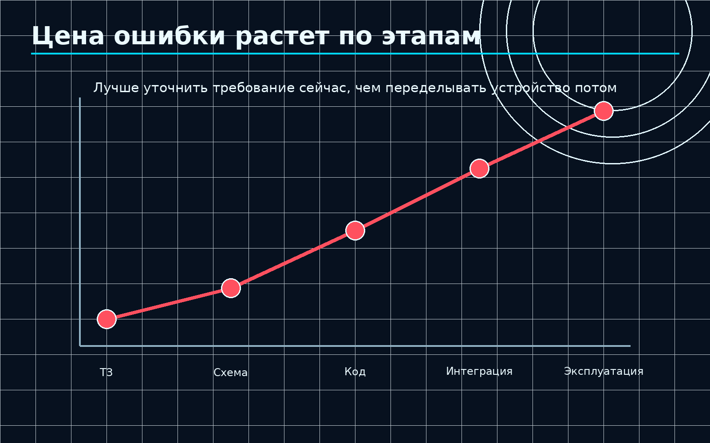

*Рисунок 3. Чем позже обнаружена ошибка требований, тем выше стоимость её исправления.*

## Слайд 4. Общая схема проектирования МПС

Проектирование микропроцессорной системы удобно рассматривать как последовательность этапов. Сначала формулируется техническое задание: назначение системы, условия работы и функции. Затем анализируется объект управления и составляются перечни входных и выходных сигналов. После этого разрабатывается структурная схема, выбирается архитектура, рассчитываются порты, память и интерфейсы. Далее создаются алгоритмы и управляющая программа. На завершающем этапе выполняются тестирование, отладка, документирование и защита проекта. В реальности эти этапы могут повторяться: обнаруженная ошибка возвращает проектировщика к предыдущим решениям.

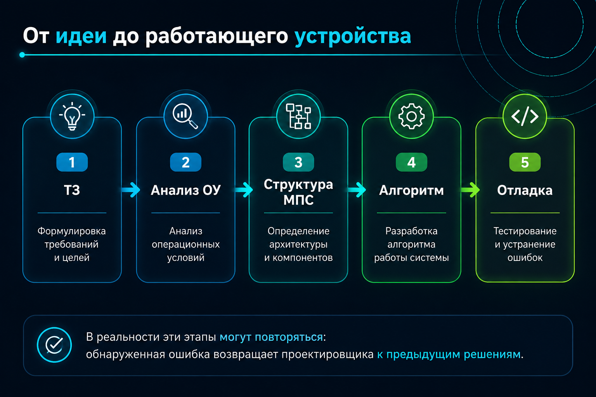

*Рисунок 4. Последовательность проектирования от ТЗ до отладки с возможностью возврата к предыдущим этапам.*

> **Ключевая идея:** Проектирование — итерационный процесс: обнаруженная ошибка может вернуть разработчика на предыдущий этап.

## Слайд 5. Связь темы с рабочей программой

Тема является вводной для раздела проектирования архитектуры МПС. Она подготавливает студентов к изучению шин адреса, данных и управления, временных диаграмм, адресного пространства, карты памяти и портов ввода-вывода. На практике результаты этой темы используются в работах по разработке технического задания, структурной схемы и карты портов. Иначе говоря, после лекции студент должен уметь взять словесное описание объекта управления и превратить его в инженерную заготовку для последующего проектирования.

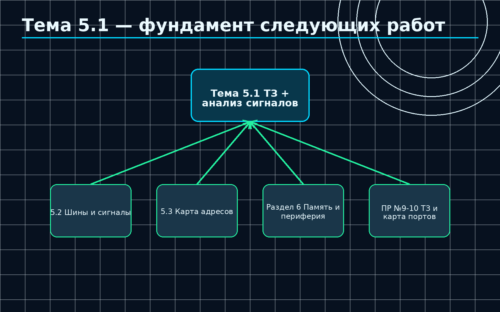

*Рисунок 5. Связь темы с последующими этапами проектирования МПС.*

## Слайд 6. Этап 1. Постановка технического задания

Техническое задание — это исходный документ, который описывает, какую систему нужно разработать и по каким признакам будет оцениваться ее работоспособность. Для МПС ТЗ должно отвечать на вопросы: что управляется, какие события нужно обнаруживать, какие действия должна выполнять система, в каких условиях она работает, за какое время должна реагировать и какая точность измерений требуется. Хорошее техническое задание не заменяет схему, но задает границы будущего проекта и позволяет проверить, соответствует ли готовое устройство поставленной задаче.

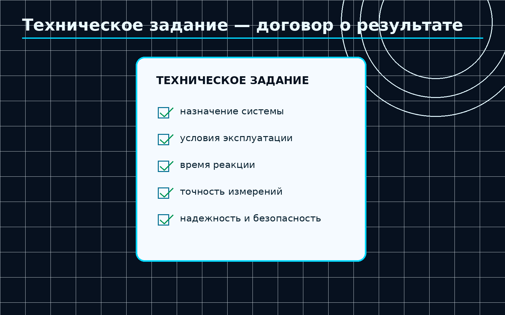

*Рисунок 6. Техническое задание как исходный документ проекта.*

## Слайд 7. Состав технического задания

В учебном проекте ТЗ можно оформлять в упрощенной, но технически строгой структуре. В начале указывают название системы и ее назначение. Далее описывают объект управления: оборудование, процесс, режимы работы, датчики, исполнительные устройства и ограничения. Затем формулируют функциональные требования: какие входные события система должна распознавать и какие выходные команды формировать. Отдельно задают условия эксплуатации, требования к электропитанию, быстродействию, точности, безопасности, надежности и удобству обслуживания. Такая структура дисциплинирует проектировщика и не позволяет пропустить критичные параметры.

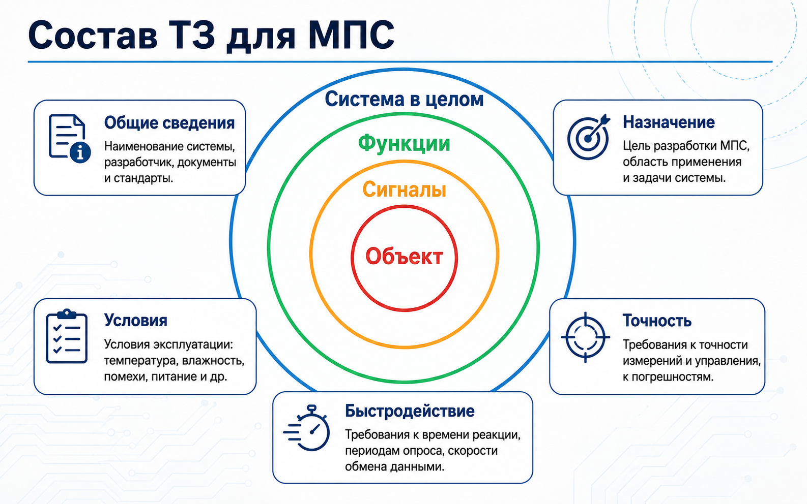

*Рисунок 7. Состав ТЗ: объект, функции, сигналы и системные требования.*

## Слайд 8. Ключевой вопрос ТЗ

Главная ценность ТЗ состоит в том, что оно переводит общую идею в проверяемые требования. Вместо фразы «система должна быстро реагировать» следует указать конкретное время реакции. Вместо «поддерживать температуру» нужно задать диапазон и допустимое отклонение. Типичная инженерная формулировка имеет вид: если произошло определенное событие на входе, то система должна сформировать конкретное действие на выходе в заданный интервал времени. Такие требования легко связать с алгоритмом, программой и тестами.

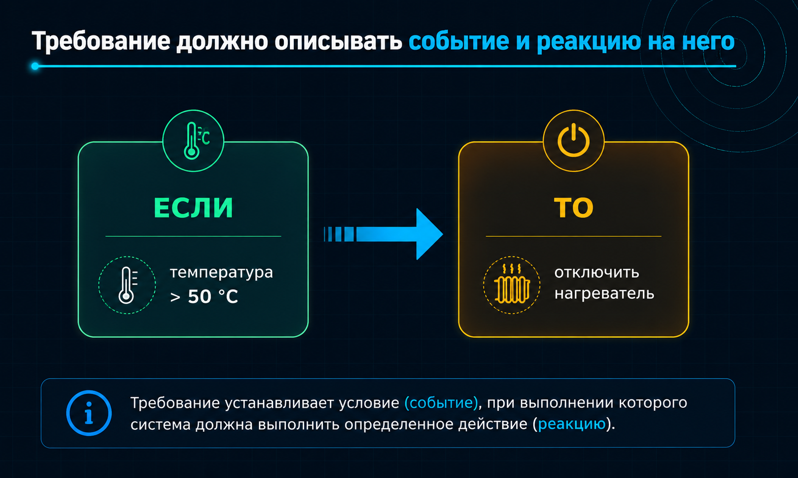

*Рисунок 8. Проверяемое требование в форме «ЕСЛИ … ТО …».*

> **Ключевая идея:** Хорошее требование описывает событие, реакцию системы и, при необходимости, допустимое время реакции.

## Слайд 9. Этап 2. Анализ объекта управления

Объект управления — это устройство, установка или процесс, на который воздействует микропроцессорная система. Это может быть конвейер, станок, климатическая установка, робот, лабораторный стенд, светофор или система сбора данных. Анализ объекта нужен для понимания физической природы сигналов, скорости изменения процесса, требований к точности и безопасности. На этом этапе проектировщик выясняет, какие параметры нужно измерять, какими механизмами управлять, какие аварийные ситуации возможны и что должно происходить при отказе датчика или питания.

Контур управления показывает движение информации от датчиков к МПС и управляющего воздействия от МПС к исполнительным устройствам.

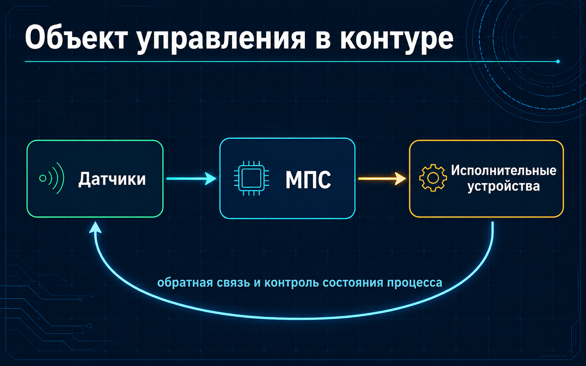

*Рисунок 9. Контур управления: датчики → МПС → исполнительные устройства → обратная связь.*

## Слайд 10. Классификация объектов и сигналов

При анализе объекта управления прежде всего классифицируют сигналы. Дискретные сигналы имеют два логических состояния, например кнопка нажата или отпущена, концевой выключатель сработал или нет. Аналоговые сигналы меняются непрерывно: температура, давление, освещенность или напряжение. Импульсные сигналы несут информацию через частоту, период, количество импульсов или длительность, как у энкодера или тахометра. От типа сигнала зависит выбор входной схемы, АЦП, таймера, фильтрации и программного алгоритма.

Три графика иллюстрируют дискретный, аналоговый и импульсный сигнал.

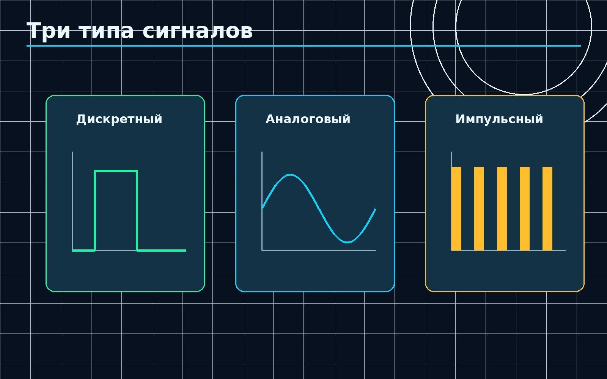

*Рисунок 10. Основные типы сигналов, встречающиеся в МПС.*

## Слайд 11. Сбор информации об объекте управления

Для каждого сигнала необходимо собрать минимальный набор технических параметров. Нужно знать электрический уровень, тип сигнала, диапазон изменения, частоту или скорость изменения, допустимую ошибку измерения, длину линии связи, наличие помех и требования к защите. Для выходных каналов дополнительно определяют напряжение и ток нагрузки, способ коммутации, необходимость реле, транзисторного ключа, драйвера или опторазвязки. Эти данные затем попадают в ведомость сигналов и определяют выбор микроконтроллера и периферии.

Таблица показывает набор параметров, которые нужно собрать об объекте управления.

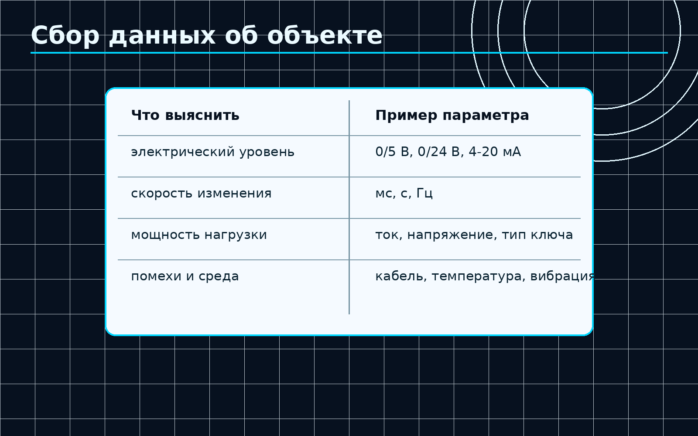

*Рисунок 11. Исходные сведения, которые необходимо собрать об объекте управления.*

## Слайд 12. Этап 3. Определение входных сигналов

Входной сигнал сообщает микропроцессорной системе о состоянии внешнего мира. Источником может быть датчик, кнопка, концевой выключатель, энкодер, приемник интерфейса или аварийный контакт. Задача проектировщика состоит не только в подсчете количества входов, но и в выборе способа их обработки. Дискретный вход может требовать подтяжки и антидребезга, аналоговый вход — нормирования и АЦП, импульсный вход — таймера или входа захвата. Важно заранее указать, какие входы критичны по времени и должны обслуживаться по прерыванию.

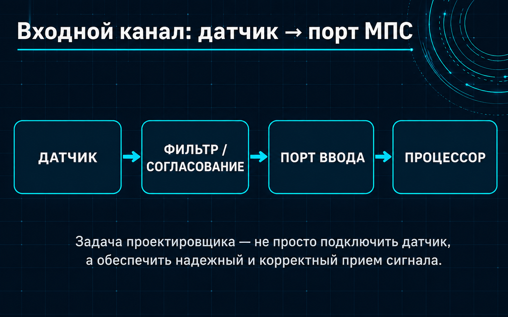

*Рисунок 12. Входной канал: датчик → согласование/фильтрация → порт ввода → процессор.*

> **Ключевая идея:** Вход МПС — это не только вывод микроконтроллера, а полный тракт согласования и обработки сигнала.

## Слайд 13. Классификация входных сигналов

В учебной документации входные сигналы удобно обозначать сокращениями DI, AI и FI. DI — цифровой дискретный вход, который принимает логический ноль или единицу. AI — аналоговый вход, требующий преобразования в цифровой код с помощью АЦП. FI — частотный или импульсный вход, который обрабатывается счетчиком, таймером или входом захвата. Для каждого входа необходимо указать диапазон, физический разъем, период опроса, фильтрацию, а также действия системы при недопустимом значении или обрыве линии.

Пиктограммная классификация разделяет входы на DI, AI и FI.

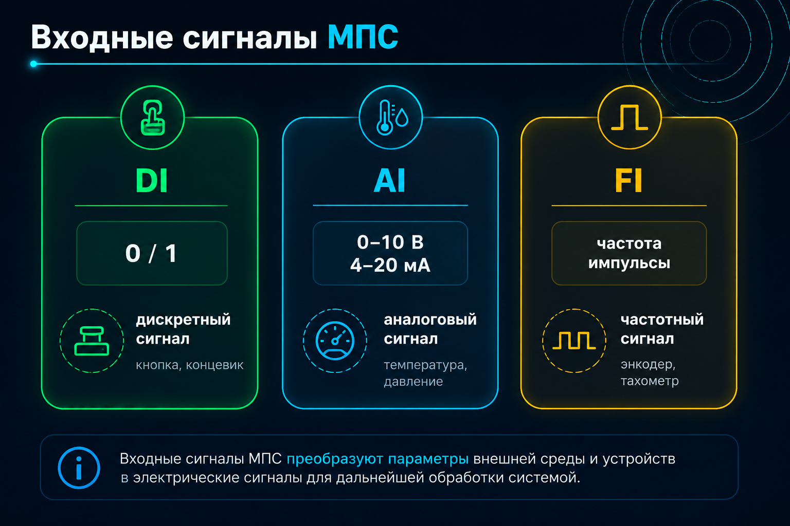

*Рисунок 13. DI, AI и FI — основные классы входных сигналов МПС.*

## Слайд 14. Проблема дребезга контактов

Дребезг контактов возникает при замыкании или размыкании механической кнопки, реле или концевого выключателя. Вместо одного четкого перехода сигнал в течение нескольких миллисекунд многократно переключается между нулем и единицей. Если программа опрашивает вход быстро, она может принять один клик за несколько нажатий. Поэтому для дискретных входов в ТЗ и алгоритме нужно предусматривать антидребезг. Он может быть программным, например проверка стабильности сигнала в течение заданного времени, или аппаратным, например RC-фильтр или триггер Шмитта.

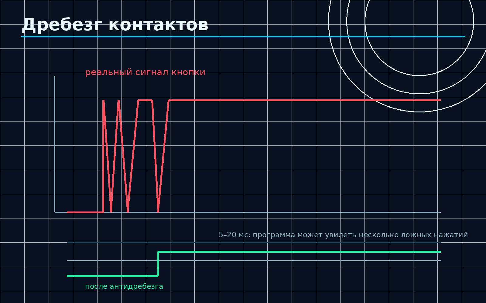

*Рисунок 14. Дребезг механического контакта и результат антидребезга.*

## Слайд 15. Пример анализа аналогового входа

Рассмотрим датчик давления с выходом 4–20 мА и диапазоном 0–10 МПа. Такой датчик не подключается напрямую к входу АЦП, потому что АЦП измеряет напряжение, а не ток. Поэтому в схеме используют измерительный резистор, на котором ток создает падение напряжения. Затем сигнал может проходить фильтр и защитные цепи, после чего поступает на АЦП микроконтроллера. В программе цифровой код преобразуется в физическую величину: 4 мА соответствует нижней границе диапазона, 20 мА — верхней. В ТЗ нужно указать точность, период измерения и действия при выходе тока за допустимые пределы.

Цепочка преобразования показывает подключение токового датчика через резистор и АЦП.

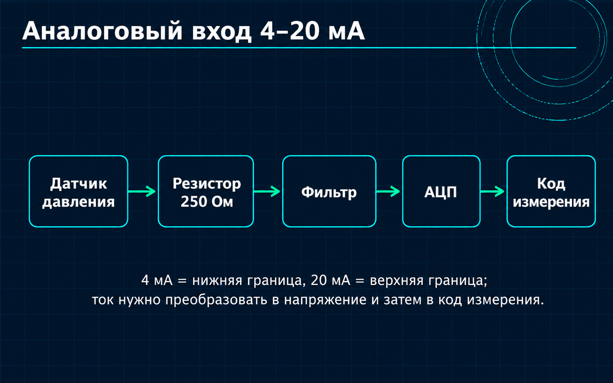

*Рисунок 15. Аналоговый вход 4–20 мА: преобразование тока в напряжение и цифровой код.*

## Слайд 16. Определение выходных сигналов

Выходной сигнал — это воздействие микропроцессорной системы на объект управления. Через выходы система включает двигатели, управляет реле, открывает клапаны, изменяет яркость, скорость или подает сигнал на индикатор. В отличие от входов, выходы часто связаны с нагрузками повышенной мощности. Поэтому проектировщик должен определить не только число выходов, но и их электрические параметры, способ коммутации, необходимость драйвера, защиты от обратного напряжения, гальванической развязки и безопасного состояния при сбросе микроконтроллера.

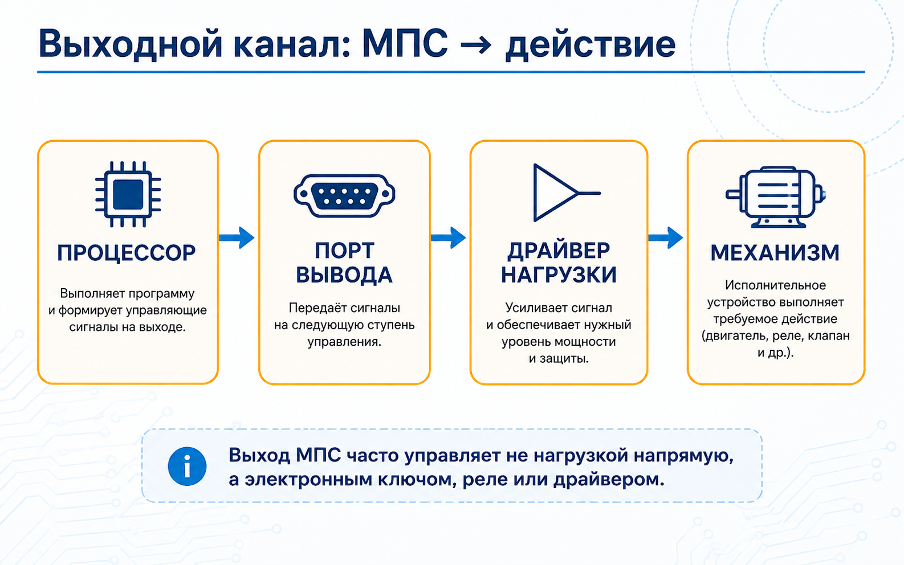

*Рисунок 16. Выходной канал: процессор → порт → драйвер нагрузки → механизм.*

## Слайд 17. Классификация выходных сигналов

Выходные сигналы можно разделить на дискретные, аналоговые и широтно-импульсные. Дискретный выход включает или отключает устройство: лампу, реле, клапан, сигнализацию. Аналоговый выход формирует плавно изменяемое напряжение или ток, например для частотного преобразователя или регулирующего клапана. ШИМ-сигнал быстро переключает выход, а среднее значение мощности определяется скважностью импульсов. ШИМ широко используется для управления яркостью светодиодов, скоростью двигателей и положением некоторых исполнительных устройств.

Классификация выходов показывает различия между DO, AO и PWM.

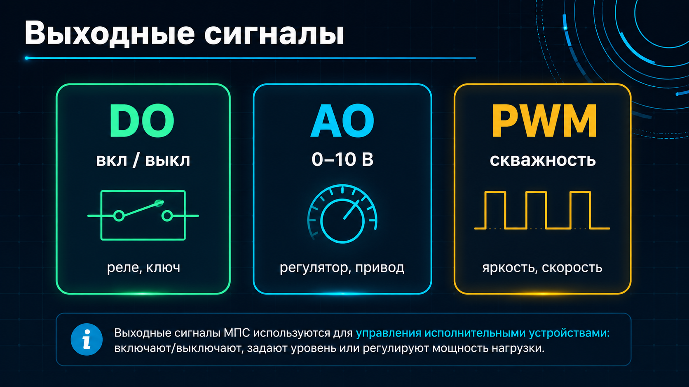

*Рисунок 17. DO, AO и PWM — основные виды выходных сигналов.*

## Слайд 18. Согласование уровней и гальваническая развязка

Выход микроконтроллера обычно работает с логическими уровнями 3,3 В или 5 В и малым током. Исполнительное устройство может требовать 12 В, 24 В, 220 В и значительно больший ток. Прямое подключение такой нагрузки к порту приведет к повреждению микроконтроллера. Поэтому применяют транзисторные ключи, драйверы, реле, оптопары и защитные диоды. Гальваническая развязка особенно важна в системах с длинными проводами, мощными двигателями, промышленными помехами или опасными напряжениями.

Важно различать понятия: **гальваническая развязка** — это электрическое разделение цепей без прямого проводящего соединения. Она может быть реализована оптопарой, трансформаторным или цифровым изолятором. Поэтому опторазвязка является одним из способов гальванической развязки, но не её синонимом.

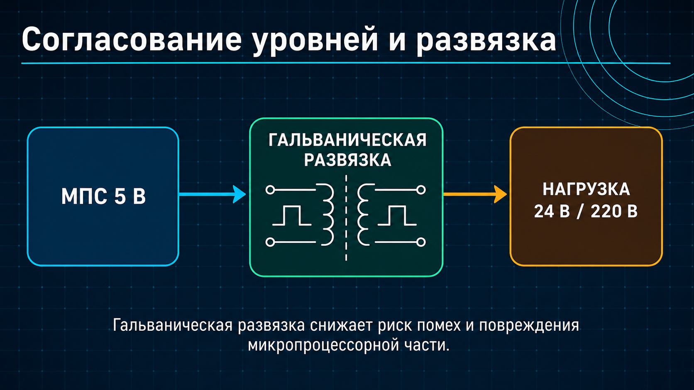

*Рисунок 18. Гальваническая развязка между низковольтной МПС и силовой нагрузкой.*

> **Ключевая идея:** Гальваническая развязка защищает низковольтную часть МПС от помех и аварий силовой цепи.

## Слайд 19. Ведомость сигналов I/O Map

Ведомость сигналов, или I/O Map, является ключевым документом после анализа объекта управления. В нее заносят каждый входной и выходной сигнал: номер, название, тип, диапазон, физический уровень, способ обработки и примечания. Для дискретного входа указывают подтяжку и антидребезг, для аналогового — диапазон и точность, для выхода — тип драйвера и безопасное состояние. Такая таблица нужна не только для схемы, но и для программы, карты портов, методики испытаний и отчета по проекту.

Таблица I/O Map показывает пример оформления сигналов.

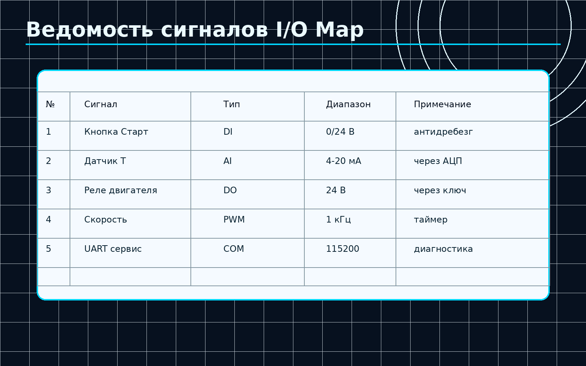

*Рисунок 19. Ведомость сигналов I/O Map как основной рабочий документ раннего проектирования.*

> **Ключевая идея:** I/O Map отвечает на вопрос «какие сигналы есть и каковы их параметры».

## Слайд 20. Формализация требований к ресурсам МПС

Когда составлена ведомость сигналов, можно перейти к расчету ресурсов микропроцессорной системы. Количество дискретных входов и выходов определяет требуемое число линий GPIO. Аналоговые сигналы требуют каналов АЦП или внешних преобразователей. ШИМ и измерение частоты требуют таймеров. Последовательный обмен требует UART, I2C, SPI, RS-485 или других интерфейсов. При выборе микроконтроллера рекомендуется предусматривать резерв по выводам, памяти и периферии, потому что в ходе проекта часто появляются дополнительные функции.

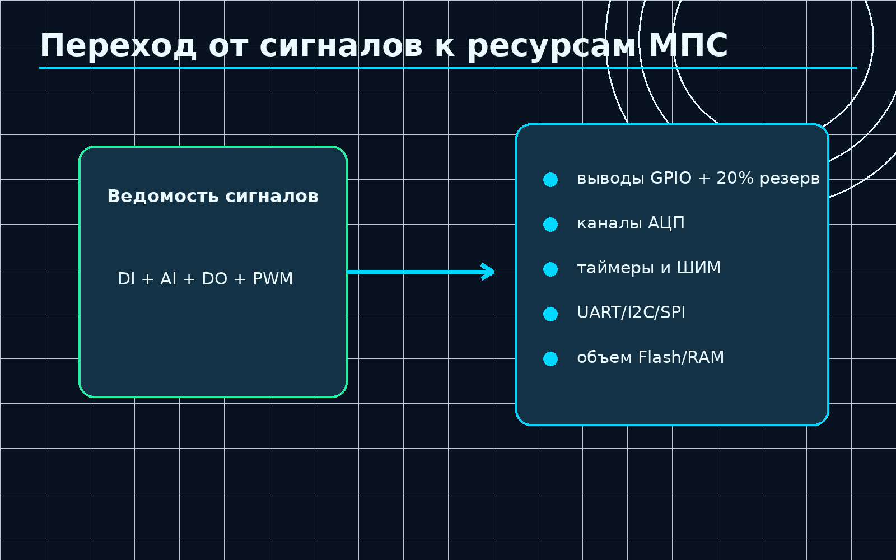

*Рисунок 20. Переход от ведомости сигналов к требованиям к ресурсам МПС.*

## Слайд 21. Требования к памяти и быстродействию

Помимо портов и периферии проектировщик оценивает объем памяти и быстродействие. Flash-память хранит прошивку, таблицы, сообщения и постоянные данные. ОЗУ используется для переменных, буферов обмена, стека, очередей и промежуточных результатов. EEPROM или другая энергонезависимая память может хранить настройки. Быстродействие зависит от тактовой частоты, архитектуры ядра, количества команд, способа обслуживания прерываний и нагрузки на интерфейсы. Если система должна реагировать на быстрые события, необходимо заранее оценить бюджет времени.

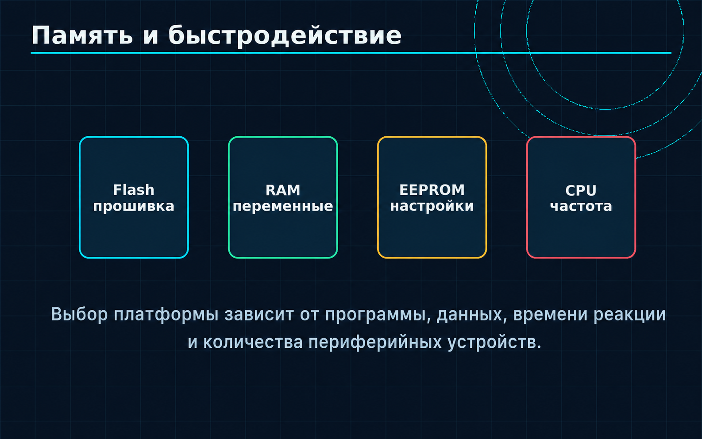

*Рисунок 21. Flash, RAM, EEPROM и быстродействие процессора.*

## Слайд 22. Временные диаграммы и бюджет времени

Временной бюджет показывает, за какое время система должна пройти путь от события на входе до действия на выходе. Например, после срабатывания датчика аварии программа должна обнаружить событие, отфильтровать ложные импульсы, выполнить обработчик, сформировать команду и перевести исполнительное устройство в безопасное состояние. Если допустимое время реакции мало, обычного циклического опроса может быть недостаточно, и нужно использовать прерывания, аппаратные таймеры или специализированные периферийные блоки. Временные требования должны быть зафиксированы еще в ТЗ.

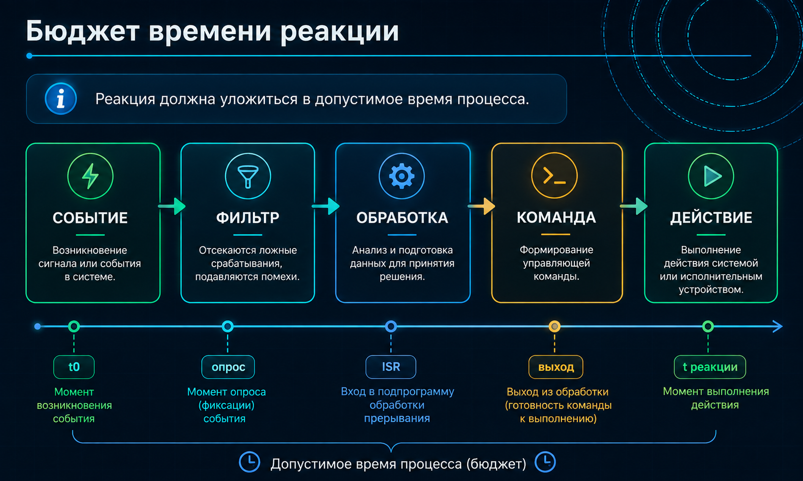

*Рисунок 22. Бюджет времени реакции: событие → фильтр → обработка → команда → действие.*

> **Ключевая идея:** Система должна не только правильно реагировать, но и укладываться в допустимый временной бюджет.

## Слайд 23. Связь с практической работой №9

На практической работе студент получает объект управления или выбирает вариант проекта. Задача состоит в том, чтобы составить техническое задание, описать функции системы, выделить входные и выходные сигналы, определить требования к быстродействию и построить структурную схему. Важно не переходить сразу к коду. Сначала нужно доказать, что состав сигналов понятен, требования проверяемы, а структура МПС соответствует задаче.

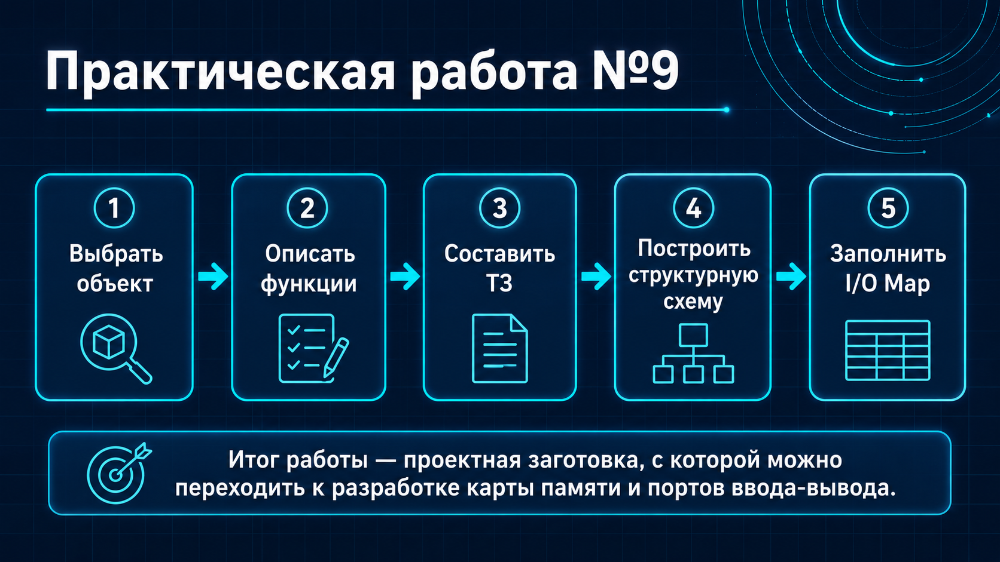

*Рисунок 23. Последовательность выполнения практической работы №9.*

## Слайд 24. Связь с практической работой №10

После составления ведомости сигналов можно переходить к карте памяти и портов ввода-вывода. В микропроцессорной системе каждому устройству или регистру назначается адрес, по которому процессор выполняет чтение или запись. Для простых микроконтроллерных систем это может быть номер вывода или периферийного регистра, а для учебной МПС с системной шиной — адрес в пространстве ввода-вывода. Карта портов связывает электрическую схему, программу и документацию. Неправильное распределение адресов приводит к тому, что процессор обращается не к тому устройству.

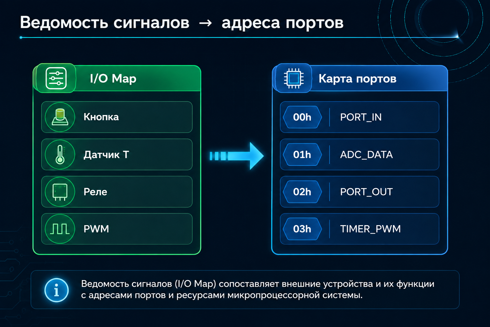

*Рисунок 24. Переход от I/O Map к карте портов и адресов.*

## Слайд 25. Пример разбора ТЗ: умный светофор

Рассмотрим учебный пример: микропроцессорная система управляет светофором на пешеходном переходе. Объект управления включает автомобильный светофор, пешеходный светофор и кнопку запроса перехода. В нормальном режиме автомобилям горит зеленый сигнал, а пешеходам красный. После нажатия кнопки система должна выполнить безопасную последовательность переключения: завершить текущий интервал, включить желтый сигнал, остановить транспорт, разрешить переход и затем вернуться в исходный режим. Уже из словесного описания можно выделить входы, выходы, временные интервалы и требования безопасности.

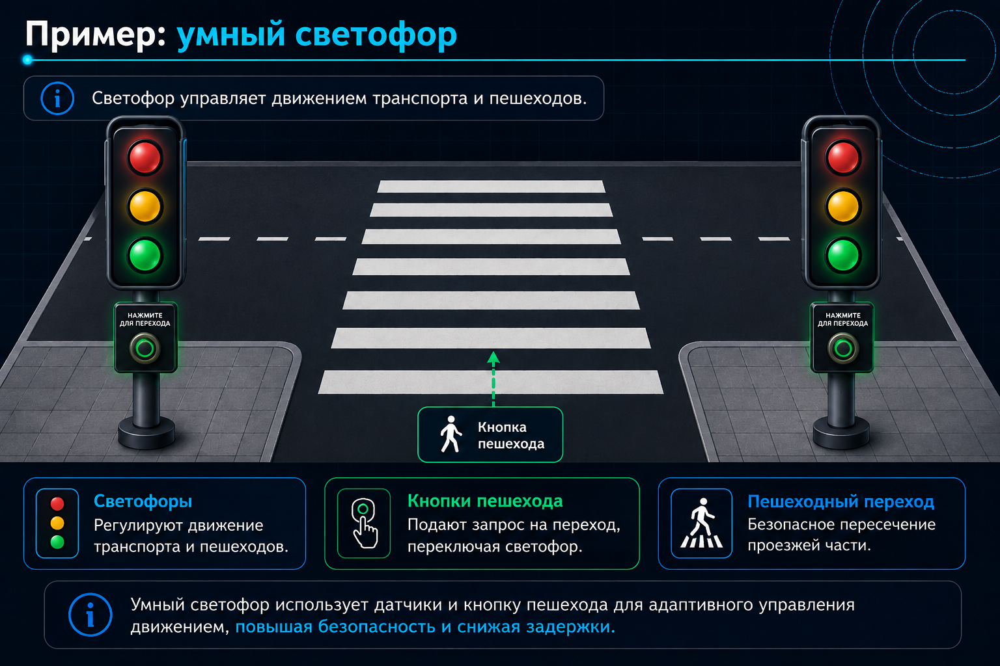

*Рисунок 25. Учебный объект: пешеходный переход со светофорами и кнопками с обеих сторон.*

## Слайд 26. Пример расчета линий портов

Для учебного примера «умный светофор» выполним первичный расчёт линий ввода-вывода. На каждой стороне пешеходного перехода установлена кнопка запроса перехода, поэтому входная часть содержит **2 дискретных входа**. Выходная часть содержит **5 дискретных выходов**: три сигнала автомобильного светофора (красный, жёлтый, зелёный) и два сигнала пешеходного светофора (красный, зелёный).

Минимально требуется **7 линий GPIO: 2 входа + 5 выходов**. При выборе микроконтроллера необходимо предусмотреть резерв для диагностического светодиода, интерфейса программирования, последовательного порта и возможных дополнительных датчиков.

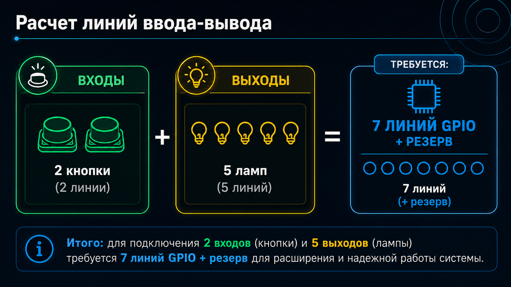

*Рисунок 26. Расчёт GPIO: 2 входа + 5 выходов = 7 линий GPIO, плюс резерв.*

> **Ключевая идея:** Для примера светофора требуется минимум 7 GPIO: 2 входа и 5 выходов; дополнительно нужен резерв.

## Слайд 27. Пример определения типов сигналов

В примере светофора кнопка является дискретным входом. Для нее нужно указать уровень сигнала, схему подтяжки и способ подавления дребезга. Лампы светофора являются дискретными выходами, но напрямую к микроконтроллеру они не подключаются. Для них требуется драйвер, транзисторный ключ или реле, рассчитанное на напряжение и ток нагрузки. Временные интервалы переключения не являются отдельными внешними сигналами, но они требуют таймера или программного счетчика. Таким образом, анализ включает не только входы и выходы, но и внутренние ресурсы МПС.

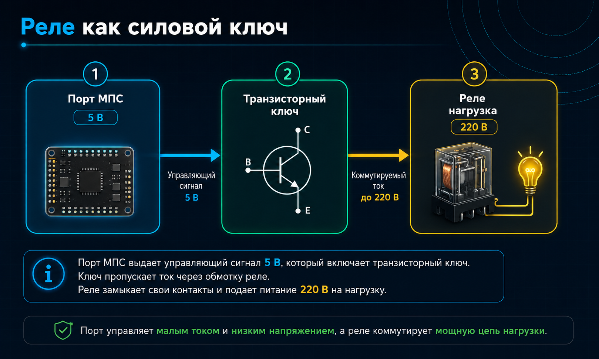

*Рисунок 27. Реле как силовой ключ: порт МПС → транзисторный ключ → реле → нагрузка.*

## Слайд 28. Методология Top-Down

Нисходящее проектирование, или Top-Down, означает движение от общей функции к конкретным техническим решениям. Сначала проектировщик формулирует, что система должна делать. Затем определяет структуру: какие блоки нужны, какие сигналы связывают их между собой, какие интерфейсы требуются. Только после этого выбираются микроконтроллер, датчики, драйверы, память и другие элементы. Такой подход уменьшает риск ситуации, когда сначала купили плату, а потом выяснили, что она не подходит по числу входов, периферии или быстродействию.

Пирамида Top-Down показывает переход от функции к архитектуре и элементам.

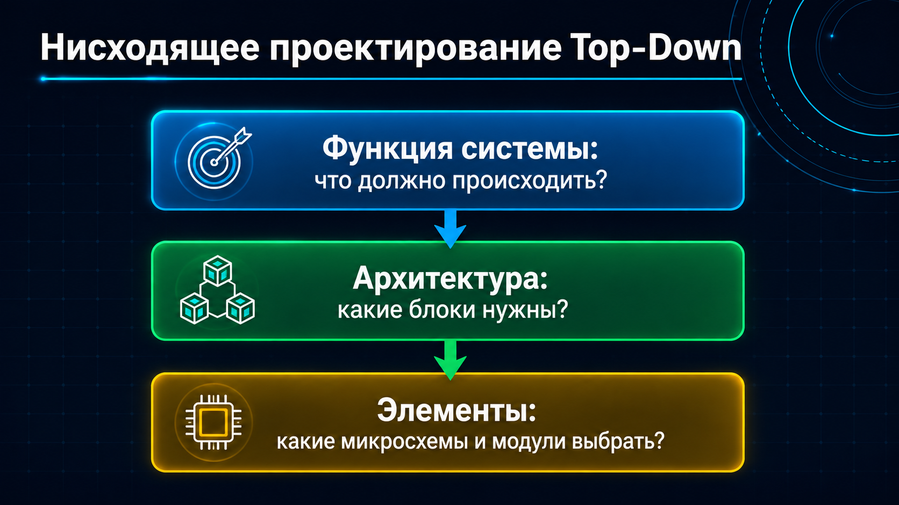

*Рисунок 28. Top-Down: функция системы → архитектура → выбор элементов.*

> **Ключевая идея:** Сначала определяется функция, затем архитектура, и только потом выбираются конкретные микросхемы и модули.

## Слайд 29. Типичные ошибки начинающих проектировщиков

Начинающие проектировщики часто совершают повторяющиеся ошибки. Они считают только основные входы и выходы, но забывают про резерв, интерфейс отладки и диагностические индикаторы. Они подключают кнопки без антидребезга, датчики без фильтрации, а силовые нагрузки без драйверов и защиты. Иногда в ТЗ отсутствует описание аварийного режима, поэтому система не знает, что делать при обрыве датчика или зависании программы. Лучший способ избежать таких проблем — пользоваться контрольным списком требований и проверять каждый сигнал в ведомости.

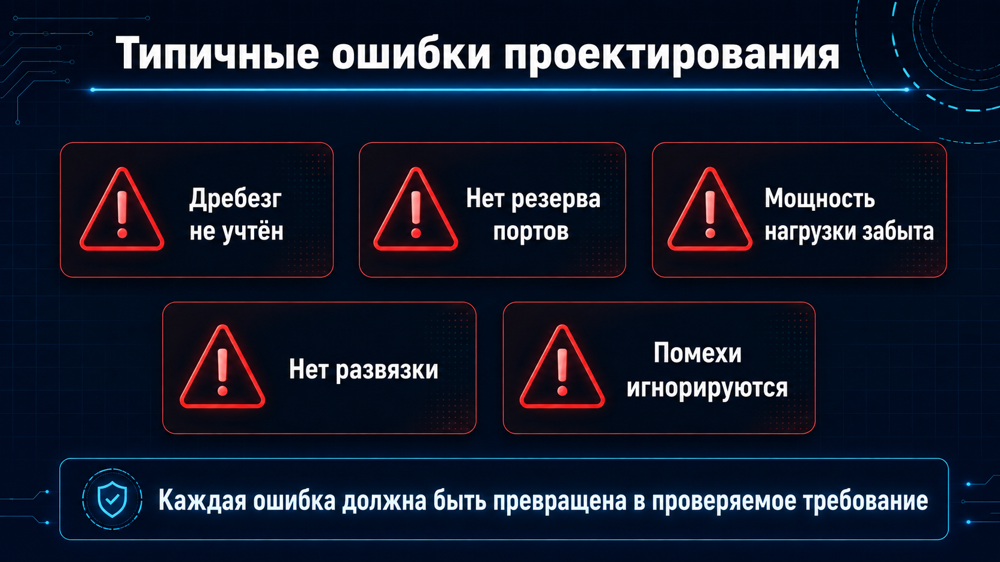

*Рисунок 29. Типичные ошибки проектирования, которые нужно превращать в проверяемые требования.*

## Слайд 30. Выводы по теме

Главный вывод лекции состоит в том, что микропроцессорная система должна проектироваться последовательно. Сначала формулируется техническое задание, затем анализируется объект управления и составляется ведомость входных и выходных сигналов. После этого можно выбирать ресурсы МПС, разрабатывать структурную схему, карту памяти и портов, алгоритм и программу. Корректное определение сигналов снижает риск ошибок в схеме и коде, облегчает тестирование и делает проект понятным для защиты. Для самопроверки студент должен ответить, какие разделы включает ТЗ, чем отличаются аналоговые и дискретные сигналы, зачем нужна I/O Map и как она связана с картой портов.

Вопросы для самопроверки

1. Какие основные разделы должно содержать техническое задание на микропроцессорную систему управления?

2. Почему проектирование МПС начинается с анализа объекта управления, а не с выбора микроконтроллера?

3. Чем отличаются дискретные, аналоговые и импульсные входные сигналы?

4. Что такое дребезг контактов и почему его нужно учитывать в алгоритме?

5. Зачем нужна ведомость сигналов I/O Map и как она связана с картой портов?

6. Какие ресурсы микропроцессорной системы определяются после анализа входов и выходов?

7. Почему выходы МПС обычно требуют драйверов, реле или опторазвязки?

8. Как временной бюджет влияет на выбор способа опроса входов и обслуживания прерываний?

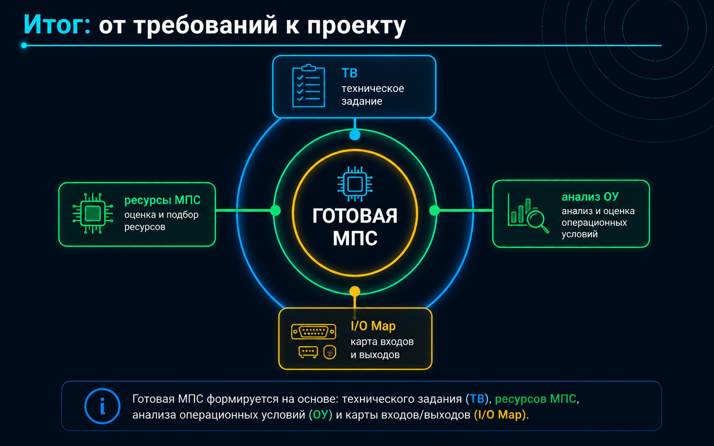

*Рисунок 30. Итог: ТЗ, анализ объекта, I/O Map и ресурсы формируют готовый проект МПС.*

> **Ключевая идея:** ТЗ → анализ объекта → I/O Map → ресурсы → структура → алгоритм → программа → испытания.

---

## Вопросы для самопроверки

1. Какие основные разделы должно содержать техническое задание на микропроцессорную систему управления?
2. Почему проектирование МПС начинается с анализа объекта управления, а не с выбора микроконтроллера?
3. Чем отличаются дискретные, аналоговые и импульсные/частотные входные сигналы?
4. Что такое дребезг контактов и почему его нужно учитывать?
5. Зачем нужна ведомость сигналов **I/O Map** и как она связана с картой портов?
6. Какие ресурсы МПС определяются после анализа входов и выходов?
7. Почему силовые выходы обычно требуют драйвера, транзисторного ключа или реле?
8. Что такое гальваническая развязка и какими средствами она может быть реализована?
9. Как временной бюджет влияет на выбор циклического опроса, прерываний и таймеров?
10. Для примера с двумя кнопками и пятью лампами сколько минимально требуется линий GPIO и зачем закладывать резерв?

## Краткий итог

Проектирование МПС начинается не с выбора платы и не с написания программы. Сначала необходимо формализовать задачу, изучить объект управления, определить все входные и выходные сигналы, зафиксировать их параметры и только после этого оценивать ресурсы аппаратной платформы. Такой порядок снижает риск переделок, делает требования проверяемыми и формирует основу для структурной схемы, карты портов, алгоритма и последующей программной реализации.
