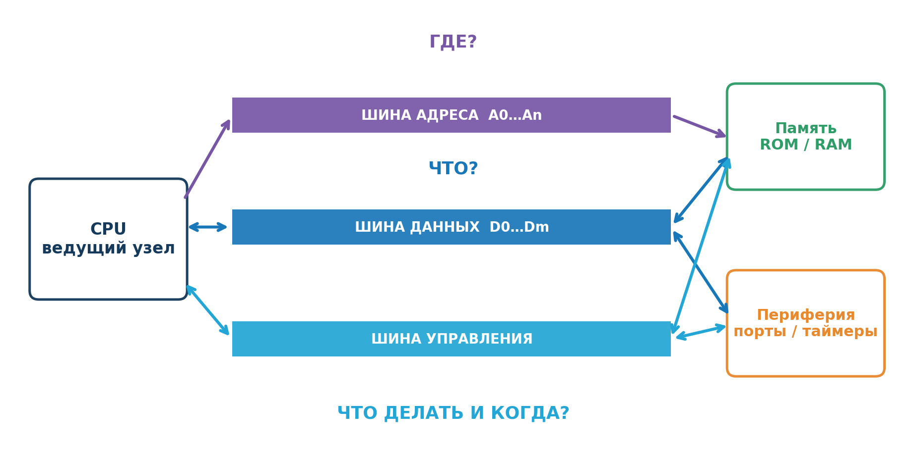
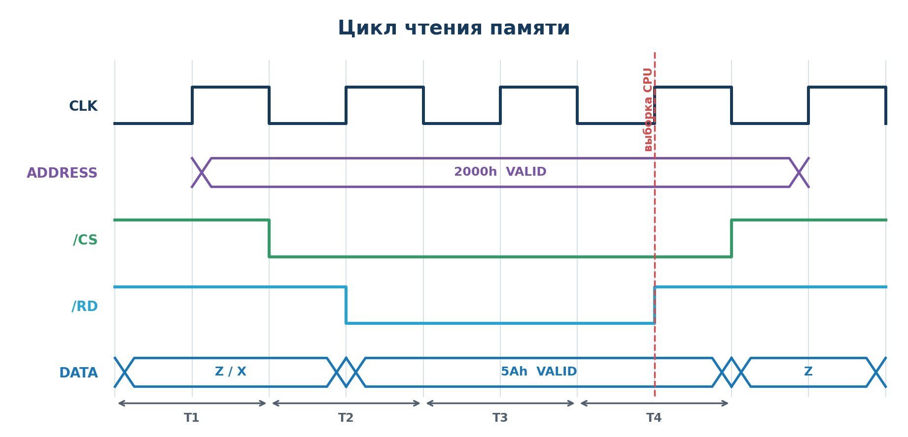
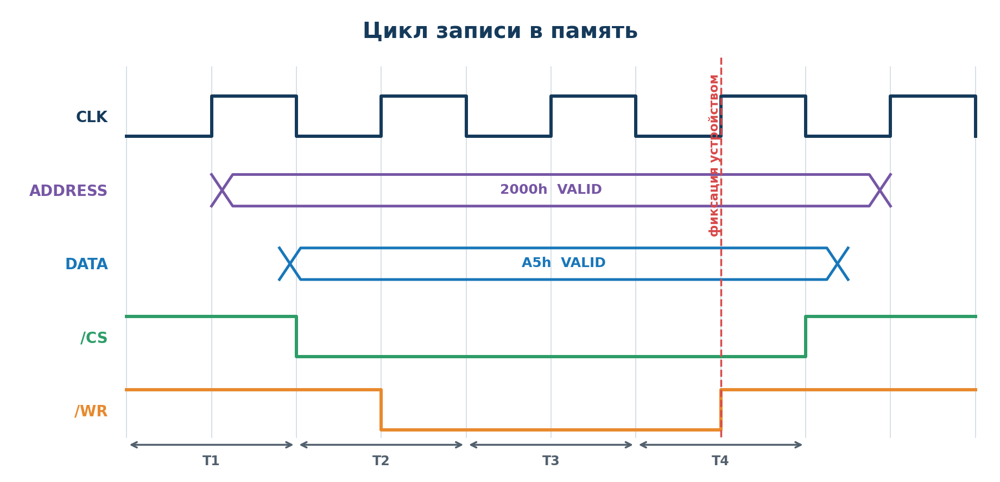
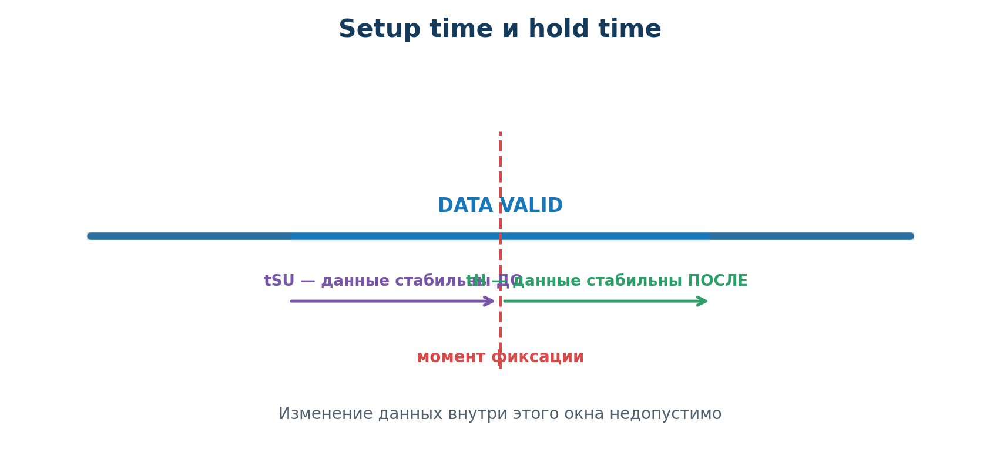
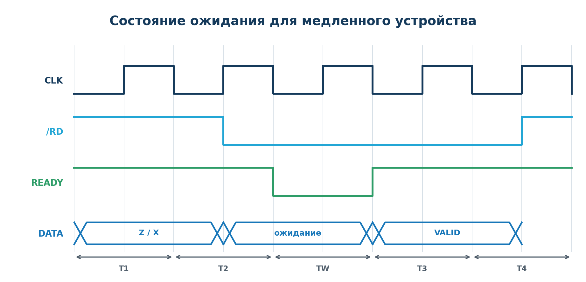
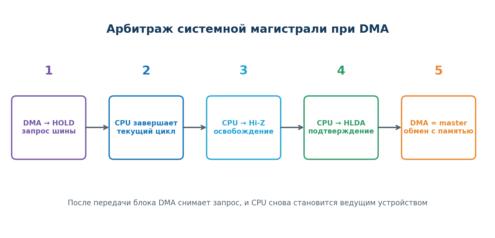
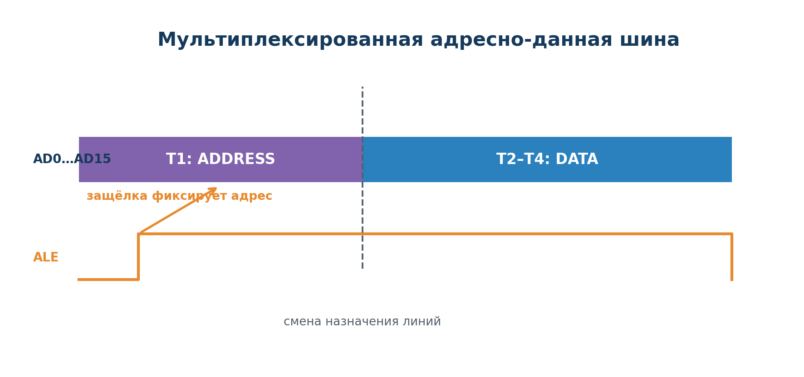

# Лекция 5.2. Организация шин и управляющих сигналов микропроцессорных систем

**Дисциплина:** МДК.02.01 «Микропроцессорные системы»  
**Специальность:** 09.02.01 «Компьютерные системы и комплексы»  
**Уровень:** 4 курс колледжа

## Цель лекции

Понять, как процессор, память и устройства ввода-вывода обмениваются адресами и данными, какую роль выполняют управляющие сигналы и как по временной диаграмме определить последовательность событий в цикле чтения или записи.

После изучения темы студент должен уметь:

- объяснять назначение шины адреса, данных и управления;
- определять направление передачи информации при чтении и записи;
- объяснять назначение сигналов `RD`, `WR`, `CS`, `READY/WAIT`, `RESET`, `IRQ/INT`, `BUSREQ/HOLD`, `BUSACK/HLDA` и `ALE`;
- различать такт процессора и законченный шинный цикл;
- находить на временной диаграмме интервалы `ADDRESS VALID` и `DATA VALID`;
- объяснять параметры `tACC`, `tSU` и `tH`;
- понимать назначение состояния `Hi-Z`, состояний ожидания и арбитража магистрали;
- читать типовую временную диаграмму обмена.

---

## 1. Зачем микропроцессорной системе нужна магистраль

Процессор, память и периферийные устройства становятся системой только тогда, когда между ними организован согласованный обмен. Для выполнения одной машинной команды процессор может несколько раз обратиться к памяти: считать код команды, получить операнд, записать результат. Работа с датчиком, дисплеем или контроллером также требует обмена.

Совокупность линий, соединяющих основные узлы микропроцессорной системы, называется **системной магистралью**, или **системной шиной**. В классической модели она включает три группы линий:

1. **Шина адреса** отвечает на вопрос: **где находится объект обмена?**
2. **Шина данных** отвечает на вопрос: **что передаётся?**
3. **Шина управления** отвечает на вопрос: **что сделать и когда?**



*Рисунок 1 — Взаимодействие процессора, памяти и периферии через три группы шин*

Важно рассматривать все три группы совместно. Адрес без сигнала чтения или записи не задаёт операцию, а данные без адреса не определяют получателя.

## 2. Что называется шиной

**Шина** — группа электрических линий, объединённых общим назначением. Восьмиразрядная шина данных содержит восемь физических линий `D0…D7`. Каждая линия переносит один бит, а вся группа одновременно представляет двоичное слово.

Например:

| D7 | D6 | D5 | D4 | D3 | D2 | D1 | D0 | Код |
|---:|---:|---:|---:|---:|---:|---:|---:|:---|
| 1 | 0 | 1 | 1 | 0 | 1 | 1 | 0 | `10110110₂ = B6h` |

Разрядность показывает, сколько бит передаётся или формируется одновременно. Однако реальная скорость обмена определяется не только шириной шины, но и тактовой частотой, длительностью шинного цикла, задержками памяти и протоколом обмена.

## 3. Шина адреса

Шина адреса передаёт код ячейки памяти или регистра периферийного устройства. В типовой однопроцессорной системе адрес формирует CPU, поэтому направление обычно считают однонаправленным:

**CPU → память или устройство ввода-вывода.**

Адрес поступает ко всем подключённым узлам. Дешифратор адреса определяет, какому устройству принадлежит заданный диапазон, и формирует для него сигнал выбора `CS` — **Chip Select**.

### 3.1. Адресное пространство

Если шина адреса содержит `N` линий, количество возможных комбинаций равно:

$$K = 2^N.$$

При побайтовой адресации каждая комбинация выбирает один байт:

| Линий адреса | Количество адресов | Максимальное пространство |
|---:|---:|---:|
| 8 | $2^8 = 256$ | 256 байт |
| 16 | $2^{16} = 65\,536$ | 64 КиБ |
| 20 | $2^{20} = 1\,048\,576$ | 1 МиБ |
| 32 | $2^{32}$ | 4 ГиБ |

Адресное пространство — это диапазон **возможных** адресов. Оно не обязано полностью совпадать с объёмом физически установленной памяти: часть диапазона может быть свободной или отведённой под периферию.

### Пример

Чтобы прочитать байт из ячейки `2000h`, процессор выставляет на линиях `A15…A0` код:

```text
2000h = 0010 0000 0000 0000₂
```

После дешифрации этого кода должна быть выбрана только та микросхема памяти, которой принадлежит адрес `2000h`.

## 4. Шина данных

Шина данных переносит коды команд, операнды, результаты вычислений и содержимое регистров периферии. Обычно она двунаправленная:

| Операция | Источник данных | Получатель данных |
|:---|:---|:---|
| Чтение `READ` | память или периферия | CPU |
| Запись `WRITE` | CPU | память или периферия |

Главное правило общей шины: **в каждый момент времени ею должен управлять только один источник**.

### 4.1. Третье состояние Hi-Z

Цифровой выход может формировать логический `0`, логическую `1` или перейти в состояние высокого сопротивления `Hi-Z`. В состоянии `Hi-Z` выход электрически почти отключён от линии и не мешает другому устройству передавать данные.

`Hi-Z` не равен логическому нулю. Это отсутствие активного управления линией.

Если два выхода одновременно задают противоположные уровни, возникает **конфликт шины** (`bus contention`). Последствия:

- искажение передаваемого кода;
- повышенный ток через выходные каскады;
- нестабильная работа;
- возможное повреждение компонентов.

Поэтому сигналы `CS`, `RD`, `WR` и разрешения выходов должны гарантировать, что активен только один источник данных.

## 5. Шина управления

Шина управления — не одно двоичное слово, а набор независимых линий. Их названия и активные уровни зависят от семейства процессора.

| Сигнал | Направление в типовой системе | Назначение |
|:---|:---|:---|
| `CLK` | генератор → узлы системы | синхронизация операций |
| `RD` или `/RD` | CPU → устройство | разрешение чтения |
| `WR` или `/WR` | CPU → устройство | разрешение записи |
| `CS` | дешифратор → устройство | выбор микросхемы или регистра |
| `READY` | устройство → CPU | устройство готово завершить обмен |
| `WAIT` | устройство → CPU | запрос продлить обмен |
| `RESET` | схема сброса → узлы | перевод системы в начальное состояние |
| `IRQ`, `INT` | устройство → CPU | запрос прерывания |
| `BUSREQ`, `HOLD` | другой ведущий узел → CPU | запрос системной магистрали |
| `BUSACK`, `HLDA` | CPU → запрашивающий узел | подтверждение передачи магистрали |
| `ALE` | CPU → внешняя защёлка | фиксация адреса при мультиплексировании |

В конкретной документации функции и полярность сигналов необходимо проверять по datasheet.

### 5.1. Активный высокий и активный низкий уровни

Сигнал с активным высоким уровнем выполняет функцию при логической `1`. Активный низкий сигнал выполняет функцию при логическом `0`. Активный низкий уровень обозначают чертой над именем, косой чертой перед именем или символом `#` после него:

- `/RD`;
- `RD#`;
- $\overline{RD}$.

Если `/RD = 0`, операция чтения активна. Ошибка в понимании полярности приводит к неверному чтению временной диаграммы.

## 6. Тактовый сигнал и шинный цикл

Тактовый сигнал `CLK` задаёт ритм синхронной системы. Его основные параметры:

- период `T` — длительность одного полного колебания;
- частота $f = 1/T$;
- фронт — переход `0 → 1`;
- спад — переход `1 → 0`.

**Такт** — один интервал синхронизации. **Шинный цикл** — законченная операция обращения к памяти или периферии. Один шинный цикл обычно занимает несколько тактов, условно `T1`, `T2`, `T3`, `T4`; при необходимости добавляются состояния ожидания `TW`.

Нельзя считать, что одна машинная команда всегда равна одному такту или одному шинному циклу. Команда может включать несколько обращений к магистрали.

## 7. Как читать временные диаграммы

Временная диаграмма показывает изменение сигналов по горизонтальной оси времени. Каждая строка соответствует отдельной линии или группе линий.

Типовые обозначения:

| Обозначение | Значение |
|:---|:---|
| `HIGH`, `1` | высокий логический уровень |
| `LOW`, `0` | низкий логический уровень |
| `X` | значение неизвестно или несущественно |
| `Z`, `Hi-Z` | источник отключён от линии |
| `VALID` | значение гарантированно действительно |

### Алгоритм анализа

1. Найдите `CLK` и границы тактов.
2. Определите интервал, в котором адрес действителен.
3. Найдите `CS` и установите выбранное устройство.
4. Определите тип операции по `RD` или `WR`.
5. Установите источник и получателя данных.
6. Найдите интервал `DATA VALID`.
7. Определите момент фиксации данных.
8. Проверьте `READY/WAIT`, состояния ожидания и момент освобождения шины.

## 8. Цикл чтения

При чтении процессор получает данные из памяти или периферии. Типовая последовательность:

1. CPU формирует адрес.
2. Дешифратор активирует `CS` выбранного устройства.
3. CPU активирует сигнал чтения `/RD`.
4. Выбранное устройство выходит из `Hi-Z` и начинает управлять шиной данных.
5. После задержки доступа на шине появляется действительное значение.
6. CPU фиксирует данные.
7. `/RD` и `CS` снимаются, устройство возвращает выходы в `Hi-Z`.



*Рисунок 2 — Чтение байта `5Ah` из ячейки `2000h`; `/CS` и `/RD` активны низким уровнем*

Ключевой признак чтения: **источником шины данных является выбранное устройство, а получателем — процессор**.

## 9. Цикл записи

При записи процессор передаёт данные памяти или периферийному устройству:

1. CPU формирует адрес.
2. CPU устанавливает записываемое значение на шине данных.
3. Дешифратор активирует `CS`.
4. CPU активирует `/WR`.
5. Выбранное устройство фиксирует данные в определённый спецификацией момент.
6. `/WR` и `CS` снимаются; затем CPU может изменить адрес и данные.



*Рисунок 3 — Запись байта `A5h` по адресу `2000h`*

Ключевой признак записи: **источником данных является процессор, а получателем — выбранное устройство**.

### 9.1. Сравнение чтения и записи

| Признак | Чтение | Запись |
|:---|:---|:---|
| Управляющий сигнал | `RD` | `WR` |
| Источник `DATA` | устройство | CPU |
| Получатель `DATA` | CPU | устройство |
| Состояние шины до обмена | часто `Z` или `X` | CPU заранее формирует данные |
| Основная проверка | данные появились до выборки CPU | данные стабильны вокруг момента записи |

## 10. Временные параметры обмена

Логически правильная схема может работать ошибочно, если нарушены временные ограничения.

### 10.1. Setup time и hold time

**Время установления `tSU`** — минимальный интервал, в течение которого данные должны быть стабильны **до** момента фиксации.

**Время удержания `tH`** — минимальный интервал стабильности данных **после** момента фиксации.



*Рисунок 4 — Запрещённое для изменения данных окно вокруг момента фиксации*

Изменение данных внутри этого окна может привести к записи неверного значения или метастабильности входного триггера.

### 10.2. Время доступа памяти

**Время доступа `tACC`** — задержка от появления действительного адреса до появления гарантированно действительных данных на выходе памяти. Считывать данные раньше окончания `tACC` нельзя.

В упрощённой проверке временного бюджета должно выполняться условие:

$$t_{доступно} \ge t_{линий} + t_{дешифратора} + t_{ACC} + t_{SU}.$$

Если условие не выполняется, применяют более быструю память, снижают частоту, изменяют логику или добавляют состояние ожидания.

## 11. READY, WAIT и состояния ожидания

Медленное устройство может не успевать завершить операцию за стандартный цикл. Сигналы `READY` или `WAIT` позволяют продлить цикл без потери данных.



*Рисунок 5 — Дополнительный такт `TW` между основными фазами обмена*

Обобщённый принцип:

- устройство сообщает, что данные ещё не готовы;
- CPU сохраняет адрес и активные управляющие сигналы;
- в цикл вставляется один или несколько тактов `TW`;
- после готовности обмен завершается обычным образом.

Полярность и точное действие `READY/WAIT` зависят от процессора. Например, в одной системе низкий `READY` означает ожидание, а в другой для этого используется активный `WAIT`.

## 12. RESET и прерывания

### 12.1. RESET

`RESET` переводит систему в известное начальное состояние. Обычно он:

- задаёт начальное значение счётчика команд;
- переводит управляющие узлы в исходное состояние;
- запрещает или инициализирует часть периферии;
- обеспечивает старт программы после стабилизации питания.

Точные действия определяются архитектурой. Сброс не означает автоматического обнуления всей оперативной памяти.

### 12.2. IRQ или INT

Запрос прерывания позволяет периферийному устройству сообщить процессору о событии без постоянного программного опроса.

Типовая последовательность:

1. Устройство формирует `IRQ/INT`.
2. CPU завершает текущую команду или допустимый этап её выполнения.
3. CPU проверяет разрешение и приоритет прерывания.
4. Сохраняется контекст выполнения.
5. Управление передаётся обработчику прерывания `ISR`.
6. После обработки восстанавливается прерванная программа.

**Задержка прерывания** — время от формирования запроса до начала выполнения обработчика.

## 13. Захват шины и прямой доступ к памяти

В обычном режиме ведущим устройством магистрали является CPU. Контроллер прямого доступа к памяти `DMA` может временно получить право управлять адресом, данными и управляющими сигналами.



*Рисунок 6 — Обобщённая последовательность передачи магистрали контроллеру DMA*

CPU должен завершить текущий цикл и перевести соответствующие выходы в `Hi-Z`. Только после подтверждения `BUSACK/HLDA` контроллер DMA становится ведущим устройством. После передачи блока DMA освобождает магистраль, и управление возвращается процессору.

**Арбитраж магистрали** — механизм, определяющий, какое устройство в данный момент имеет право быть ведущим.

## 14. Мультиплексирование адреса и данных

Для уменьшения числа выводов микросхемы одни и те же линии могут использоваться в разные моменты времени:

- в фазе `T1` линии `AD0…AD15` передают младшую часть адреса;
- в следующих фазах те же линии передают данные;
- сигнал `ALE` открывает внешнюю защёлку, которая запоминает адрес до конца цикла.



*Рисунок 7 — Разделение адреса и данных во времени с помощью сигнала `ALE`*

Преимущество — меньше выводов корпуса. Недостатки — более сложная внешняя логика и повышенные требования к временным параметрам.

## 15. Синхронный и асинхронный обмен

| Признак | Синхронный обмен | Асинхронный обмен |
|:---|:---|:---|
| Общая временная основа | тактовый сигнал | подтверждение участника |
| Завершение | после заданного числа тактов | после `READY/ACK` |
| Преимущество | простая и предсказуемая логика | работа с устройствами разной скорости |
| Ограничение | необходимо уложиться во временной бюджет | требуется дополнительная логика согласования |

На практике встречаются смешанные решения: основная магистраль синхронна, но медленные устройства могут добавлять состояния ожидания.

## 16. Шины в современных микроконтроллерах

В классической учебной МПС линии `A0…An` и `D0…Dm` часто доступны на выводах процессора. В современных микроконтроллерах большая часть магистралей находится внутри кристалла.

Например, в системах Cortex‑M применяются внутренние интерфейсы семейства AMBA:

- `AHB` или `AXI` связывают ядро, Flash, SRAM и производительные контроллеры;
- `APB` используется для сравнительно медленной периферии: `GPIO`, `UART`, таймеров;
- мост преобразует транзакции между производительной и периферийной шинами.

Отсутствие внешних линий адреса и данных не означает отсутствия шинной организации. Принцип **адрес + данные + управление** сохраняется.

## 17. Сквозной пример чтения `5Ah` из адреса `2000h`

Разберём цикл как последовательность причин и следствий.

| Шаг | Состояние системы | Результат |
|---:|:---|:---|
| 1 | CPU выставляет `2000h` | адрес доступен дешифратору и памяти |
| 2 | дешифратор активирует `/CS_RAM` | выбран только нужный модуль RAM |
| 3 | CPU активирует `/RD` | память получает команду чтения |
| 4 | память выполняет доступ | на `DATA` ещё может быть `X` или `Z` |
| 5 | проходит `tACC` | память формирует `5Ah`, начинается `DATA VALID` |
| 6 | CPU выполняет выборку | значение `5Ah` фиксируется во входном регистре |
| 7 | `/RD` и `/CS_RAM` снимаются | память переводит выходы в `Hi-Z` |

Если память не успела сформировать данные к моменту выборки, процессор может получить ошибочный байт. Поэтому временная диаграмма является не иллюстрацией «для красоты», а инструментом проверки работоспособности интерфейса.

## 18. Типичные ошибки при анализе

1. **Считать `/RD = 0` неактивным состоянием.** Косая черта указывает на активный низкий уровень.
2. **Путать источник данных.** При чтении данные формирует устройство, при записи — CPU.
3. **Принимать `Hi-Z` за ноль.** В `Hi-Z` устройство не задаёт уровень.
4. **Считывать данные сразу после установки адреса.** Нужно учитывать задержку `tACC`.
5. **Менять данные в момент записи.** Должны соблюдаться `tSU` и `tH`.
6. **Разрешать выходы двух устройств одновременно.** Это вызывает конфликт шины.
7. **Путать такт с шинным циклом.** Цикл обычно включает несколько тактов.
8. **Игнорировать документацию.** Названия, полярность и момент фиксации различаются у разных компонентов.

## 19. Практическое задание

Для условной системы с 16-разрядной шиной адреса и 8-разрядной шиной данных проанализируйте операцию записи байта `3Ch` в регистр устройства по адресу `8002h`.

Опишите:

1. какой узел формирует адрес;
2. как выбирается устройство;
3. кто является источником данных;
4. какой управляющий сигнал должен быть активен;
5. в какой момент устройство может зафиксировать данные;
6. какие нарушения приведут к конфликту или неверной записи.

### Краткий эталон решения

CPU устанавливает `8002h` на шине адреса и `3Ch` на шине данных. Дешифратор активирует `CS` выбранного устройства. CPU активирует `WR`; устройство фиксирует байт в момент, заданный его спецификацией. Адрес и данные должны сохраняться на протяжении требуемых интервалов `setup` и `hold`. Все остальные источники шины данных находятся в `Hi-Z`.

## 20. Контрольные вопросы

1. Что называется системной магистралью?
2. Какие вопросы решают шины адреса, данных и управления?
3. Почему шина данных является двунаправленной?
4. Как определить адресное пространство по разрядности адресной шины?
5. Какую функцию выполняет `CS`?
6. Что означает активный низкий уровень `/RD`?
7. Чем такт отличается от шинного цикла?
8. Как определить источник данных в циклах чтения и записи?
9. Что означает `Hi-Z` и зачем оно необходимо?
10. Чем опасен конфликт шины?
11. Что обозначают `tACC`, `tSU` и `tH`?
12. Зачем применяют `READY`, `WAIT` и состояния `TW`?
13. Какова роль сигналов `IRQ/INT`?
14. Как контроллер DMA получает магистраль?
15. Для чего используется `ALE`?
16. В каком порядке следует читать временную диаграмму?

## 21. Краткий словарь

| Термин | Значение |
|:---|:---|
| System Bus | системная магистраль адреса, данных и управления |
| Address Bus | шина адреса |
| Data Bus | шина данных |
| Control Bus | шина управления |
| `RD` | чтение |
| `WR` | запись |
| `CS` | выбор микросхемы или устройства |
| `CLK` | тактовый сигнал |
| `READY/WAIT` | согласование быстродействия участников |
| `RESET` | начальная установка системы |
| `IRQ/INT` | запрос прерывания |
| `Hi-Z` | состояние высокого сопротивления |
| Bus contention | конфликт общей шины |
| `tSU` | время установления данных |
| `tH` | время удержания данных |
| `tACC` | время доступа памяти |
| Wait state | дополнительный такт ожидания |
| DMA | прямой доступ к памяти |
| Bus arbitration | распределение права управления магистралью |
| `ALE` | разрешение фиксации адреса во внешней защёлке |

## 22. Итоги

- Системная магистраль объединяет шины адреса, данных и управления.
- Адрес определяет объект обмена, данные — передаваемое значение, управление — вид и порядок операции.
- При чтении источником данных является устройство, при записи — процессор.
- `Hi-Z` позволяет нескольким устройствам безопасно использовать общую шину.
- Корректность обмена зависит от `tACC`, `tSU`, `tH` и соблюдения момента фиксации.
- `READY/WAIT` позволяют подключать более медленные устройства.
- Прерывания и DMA изменяют обычную последовательность работы системы, но используют те же принципы управления магистралью.
- Временную диаграмму следует читать как связанную последовательность событий, а не как набор независимых линий.

