# Тема 5.3. Адресное пространство микропроцессорной системы

## Карта памяти и портов ввода-вывода. Полная и неполная дешифрация адресов

**Дисциплина:** Микропроцессорные системы  
**Курс:** 4

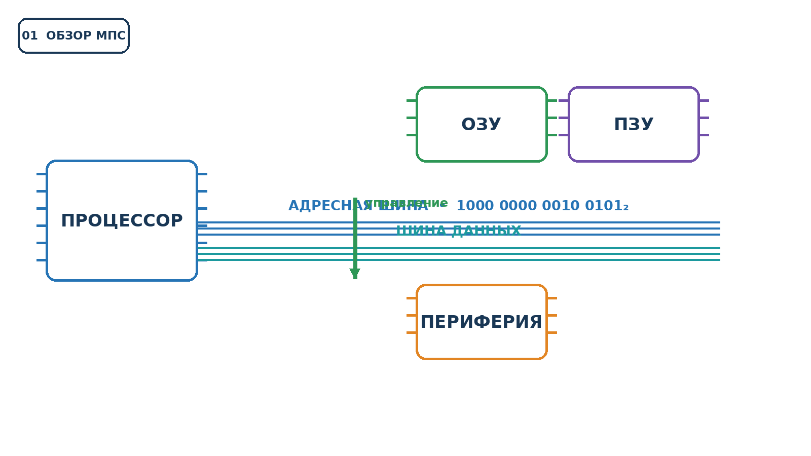

## Цель лекции

Сформировать понимание того, как микропроцессор выбирает память и устройства ввода-вывода, как строится карта адресного пространства и чем полная дешифрация адреса отличается от неполной.

После изучения темы студент должен уметь:

- определять объём адресного пространства по разрядности адресной шины;
- рассчитывать начальный и конечный адреса блока памяти;
- составлять карту памяти и портов ввода-вывода;
- различать ввод-вывод, отображённый в память, и изолированный ввод-вывод;
- определять линии адреса, используемые внутри микросхемы;
- составлять условие формирования сигнала выбора микросхемы `CS`;
- выявлять зеркальные адреса при неполной дешифрации;
- оценивать преимущества и недостатки разных способов дешифрации.

## 1. Зачем микропроцессорной системе нужны адреса

В микропроцессорной системе к процессору подключены разные объекты: оперативная память, постоянная память, таймеры, последовательные интерфейсы, контроллеры прерываний, порты общего назначения и другие устройства. Процессор должен однозначно указать, с каким объектом он выполняет обмен.

Для этого на адресную шину выводится двоичный код — адрес. Адрес сообщает системе, какая ячейка памяти или какой регистр периферийного устройства участвует в текущей операции. Данные передаются по шине данных, а тип операции задаётся управляющими сигналами чтения и записи.

Важно различать три понятия:

Адрес — номер конкретной адресуемой единицы.

Адресуемая единица — минимальный объём данных, которому назначается отдельный адрес. В большинстве современных МПС это байт, то есть 8 бит.

Адресное пространство — множество всех адресов, которые процессор способен сформировать.

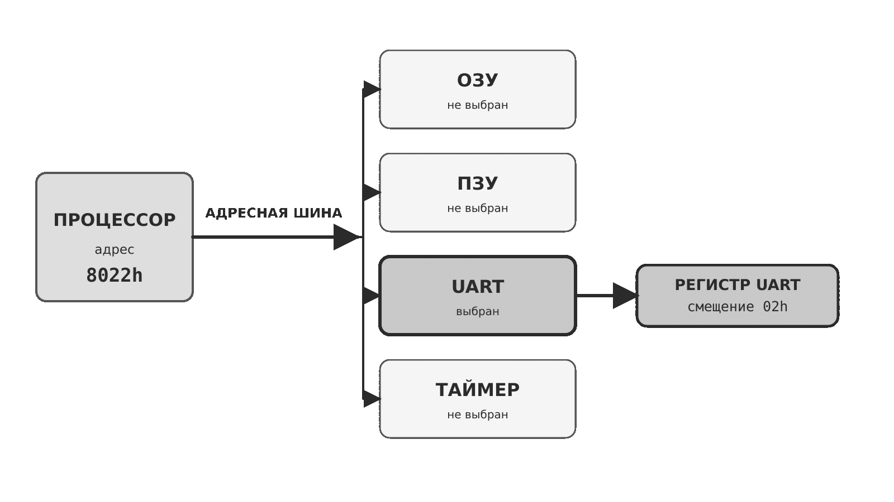

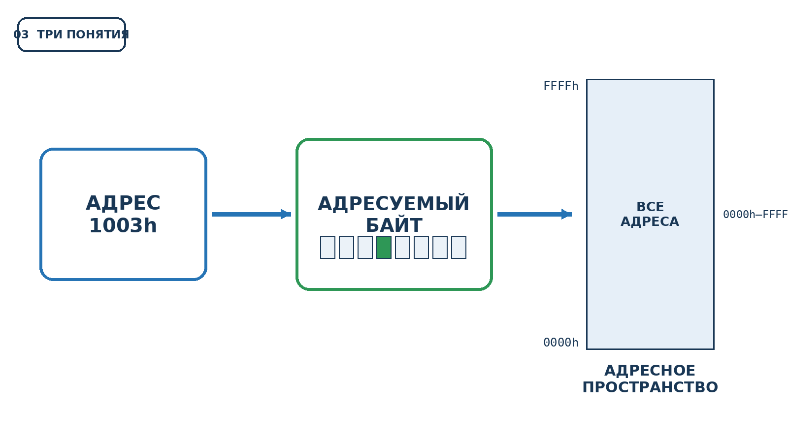

## 2. Разрядность адресной шины и объём адресного пространства

Если адресная шина содержит n линий A0…A(n−1), она может передать 2^n различных комбинаций. Следовательно, число адресуемых единиц определяется выражением:

$$
N = 2^n
$$

где N — количество адресов, n — разрядность адресной шины.

Минимальный адрес всегда равен 0, а максимальный:

$$
A_{max} = 2^n - 1
$$

Пример. Для 16-разрядной адресной шины:

N = 2^16 = 65 536 адресов;
Amax = 65 535 = FFFFh.

При побайтовой адресации процессор может обратиться к 65 536 байтам, то есть к 64 КиБ. Диапазон адресов: `0000h–FFFFh`.

Обратите внимание: 64 КиБ — это 65 536 байт, а не 64 000 байт. При расчётах памяти применяются степени числа 2:

1 КиБ = 1024 байта = 2^10 байт;
1 МиБ = 2^20 байт;
1 ГиБ = 2^30 байт.

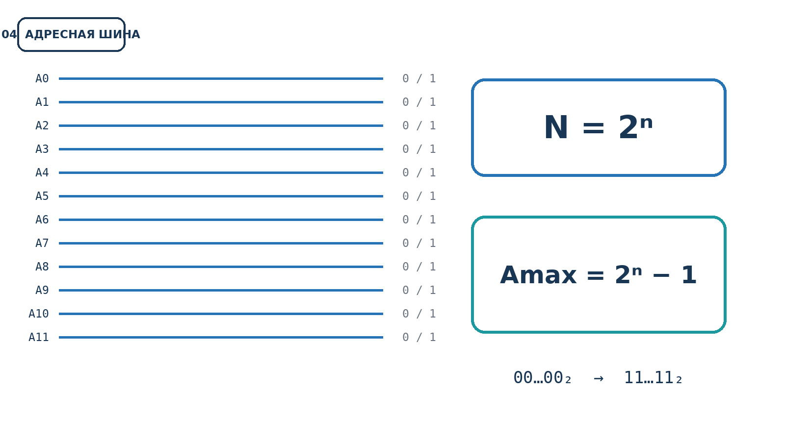

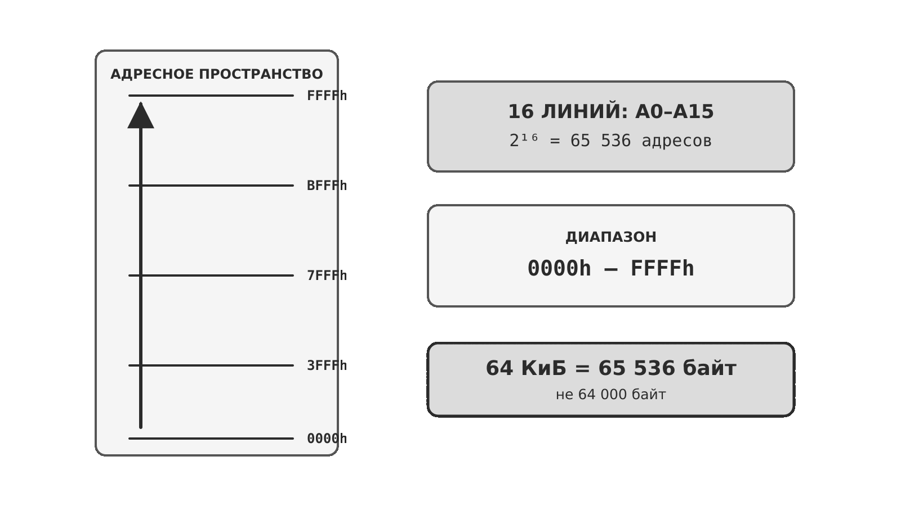

## 3. Адрес байта и адрес слова

Разрядность шины данных не следует путать с разрядностью адресной шины. Например, процессор может иметь 16-разрядную шину данных и 20-разрядную адресную шину.

В системе с побайтовой адресацией каждый адрес обозначает один байт. Двухбайтовое 16-разрядное слово занимает два последовательных адреса, а 32-разрядное слово — четыре.

Например, 32-разрядное значение, начинающееся с адреса 1000h, занимает байты по адресам 1000h, 1001h, 1002h и 1003h. Порядок значимости этих байтов определяется принятым порядком байтов — little-endian или big-endian, но набор занятых адресов остаётся тем же.

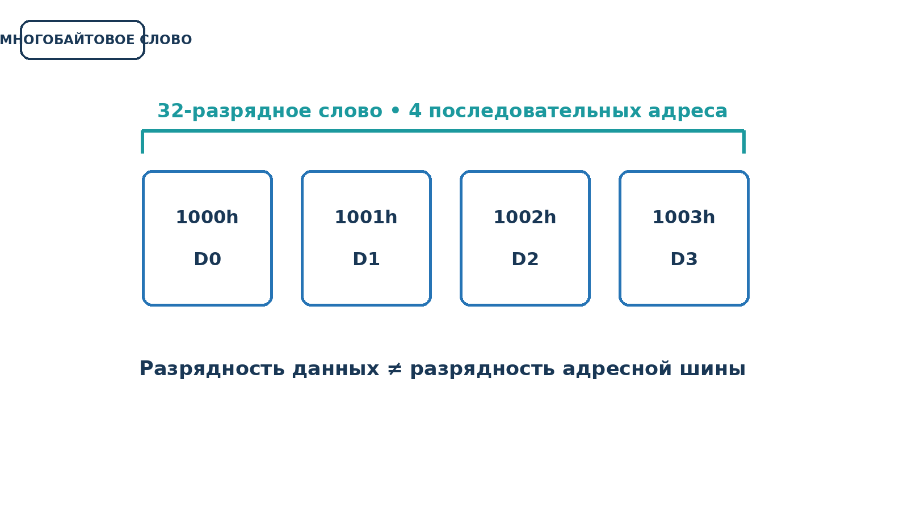

## 4. Карта адресного пространства

Карта адресного пространства — это таблица или схема, показывающая, какие диапазоны адресов назначены памяти и периферийным устройствам.

Карта нужна для того, чтобы:

- исключить наложение адресов разных устройств;
- определить базовые адреса устройств;
- спроектировать дешифратор адреса;
- подготовить программные константы и указатели;
- оставить резерв для расширения системы;
- упростить проверку принципиальной схемы и программы.

Пример карты системы с 16-разрядной адресной шиной:

| Диапазон | Размер | Назначение |
|---|---:|---|
| `0000h–1FFFh` | 8 КиБ | ОЗУ |
| `2000h–7FFFh` | 24 КиБ | Резерв |
| `8000h–80FFh` | 256 байт | Регистры периферийных устройств |
| `8100h–BFFFh` | 15,75 КиБ | Резерв |
| `C000h–FFFFh` | 16 КиБ | ПЗУ программы |

Размер диапазона от начального адреса Astart до конечного адреса Aend включительно рассчитывается так:

$$
S = A_{end} - A_{start} + 1
$$

Знак «+1» обязателен, потому что в объём входят обе границы диапазона.

Например:

$$
S = 1FFF_h - 0000_h + 1 = 2000_h = 8192\ \text{байт} = 8\ \text{КиБ}
$$

Если известны базовый адрес Abase и размер блока S, последний адрес равен:

$$
A_{end} = A_{base} + S - 1
$$

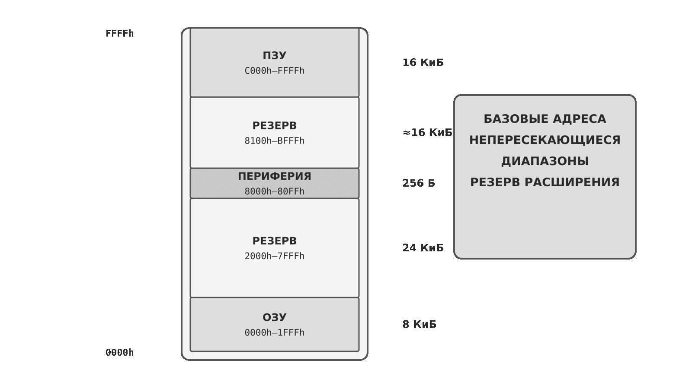

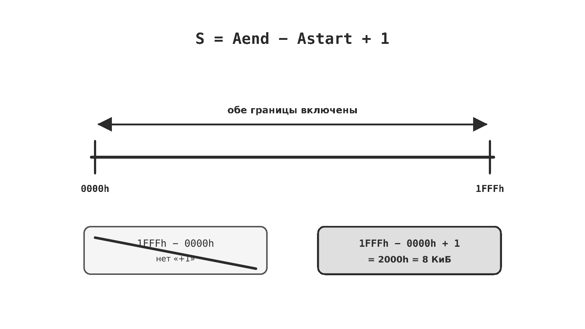

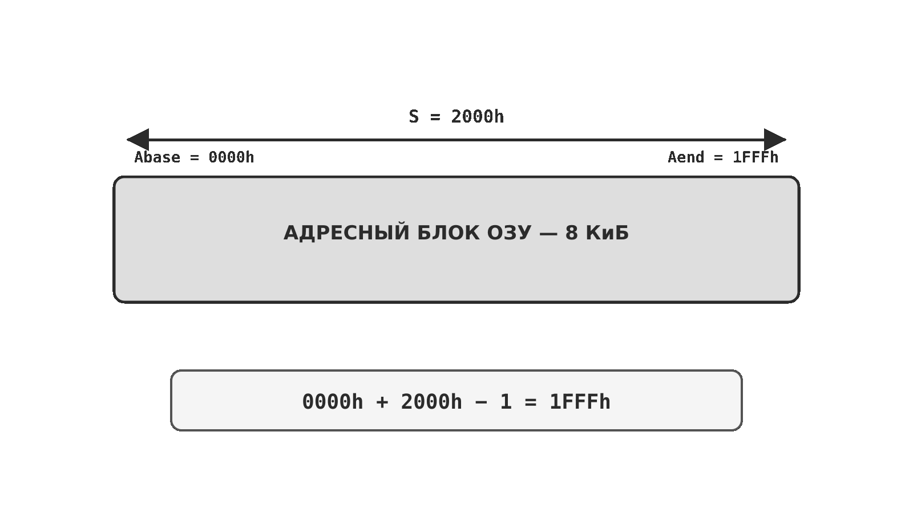

## 5. Базовый адрес и смещение

Базовый адрес — младший адрес диапазона, выделенного устройству. Конкретный регистр или ячейка внутри устройства выбирается смещением:

$$
A = A_{base} + offset
$$

Пусть модуль UART занимает адреса 8000h–8007h:

| Адрес | Смещение | Регистр |
|---|---:|---|
| `8000h` | `00h` | Регистр данных |
| `8001h` | `01h` | Регистр состояния |
| `8002h` | `02h` | Регистр управления |
| `8003h` | `03h` | Делитель частоты, младший байт |
| `8004h` | `04h` | Делитель частоты, старший байт |
| `8005h–8007h` | — | Резерв |

В документации на микроконтроллер часто указывается базовый адрес периферийного блока и смещения его регистров. Программист складывает эти значения или использует готовые определения из заголовочного файла.

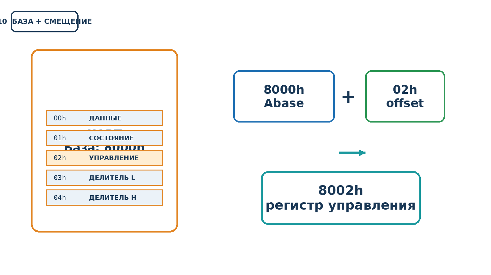

## 6. Два способа адресации устройств ввода-вывода

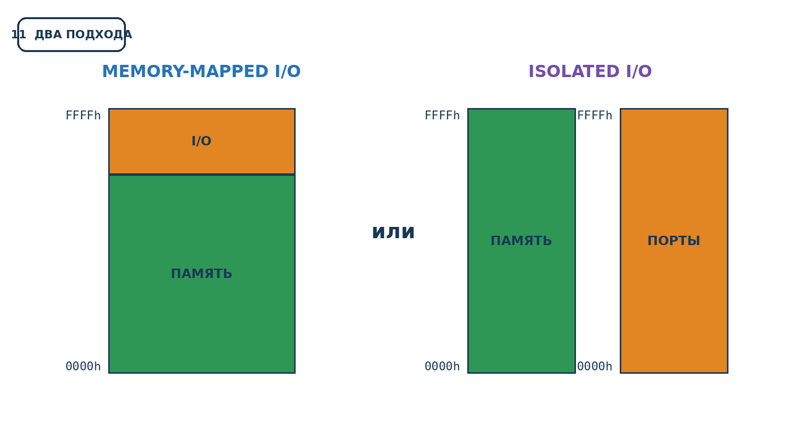

### 6.1. Ввод-вывод, отображённый в память

При memory-mapped I/O память и регистры периферийных устройств входят в общее адресное пространство. Процессор обращается к регистрам устройств теми же командами чтения и записи, которыми обращается к памяти.

Преимущества:

- единая система адресов;
- не нужны специальные команды ввода-вывода;
- к регистрам периферии можно применять обычные способы адресации;
- программная модель получается единообразной.

Недостатки:

- часть общего адресного пространства занята периферией;
- ошибочная запись по адресу периферийного регистра способна изменить состояние устройства;
- чтение некоторых регистров может иметь побочный эффект.

Архитектура ARM Cortex-M использует единое плоское 32-разрядное адресное пространство объёмом 4 ГиБ. В его областях размещаются код, SRAM, периферия, внешняя память и системные устройства.

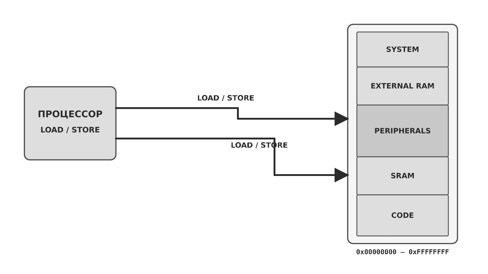

### 6.2. Изолированный ввод-вывод

При isolated I/O, или port-mapped I/O, память и порты ввода-вывода имеют разные адресные пространства. Один и тот же числовой адрес может существовать одновременно как адрес памяти и как номер порта. Тип пространства определяется специальной командой или управляющим сигналом.

В архитектуре x86 для обращения к портам предусмотрены команды `IN` и `OUT`. Номер порта не является обычным адресом оперативной памяти.

Преимущества:

- адресное пространство памяти не расходуется на порты;
- аппаратно и программно различаются операции с памятью и периферией.

Недостатки:

- требуются специальные команды;
- способы обработки данных портов обычно ограниченнее способов работы с памятью;
- архитектура процессора и система управления шиной усложняются.

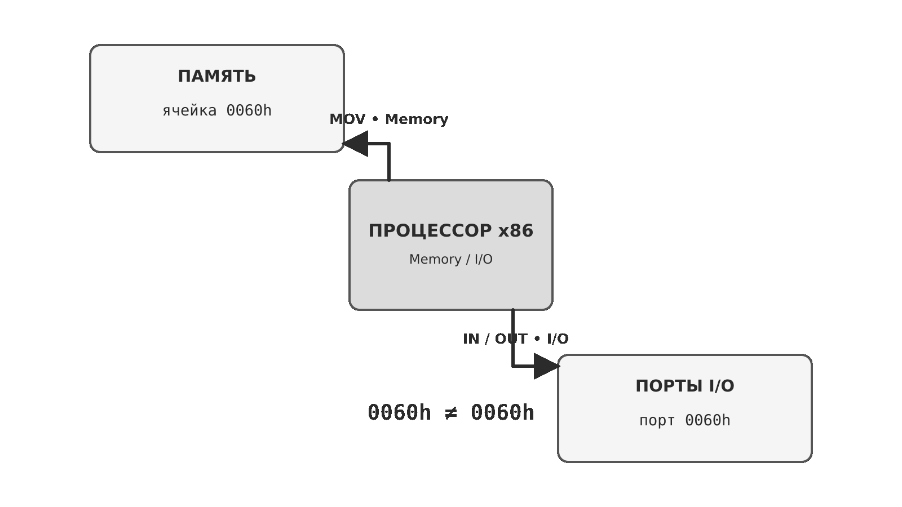

### 6.3. Особенность AVR

В AVR регистры периферии образуют пространство ввода-вывода, доступное специальными командами `IN` и `OUT`, но при этом они также отображаются в пространство данных. Поэтому часть регистров можно адресовать двумя способами. При чтении документации AVR важно уточнять, какой именно адрес указан: адрес в пространстве I/O или адрес того же регистра в пространстве данных.

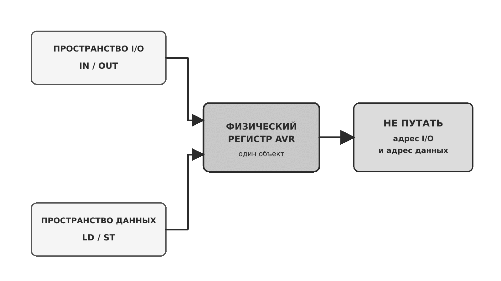

Сравнение способов:

| Признак | Отображение в память | Изолированный ввод-вывод |
|---|---|---|
| Адресное пространство | Общее | Раздельное |
| Команды доступа | Обычные `LOAD`/`STORE` | Специальные `IN`/`OUT` |
| Способы адресации | Обычно все доступные | Обычно ограниченные |
| Расход адресов памяти | Да | Нет |
| Пример | ARM Cortex-M | x86 |

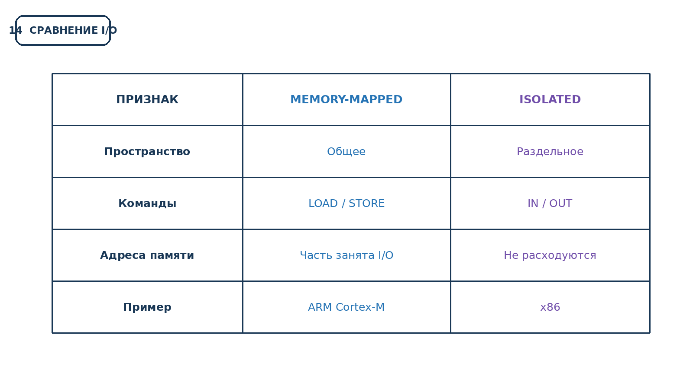

## 7. Что такое дешифрация адреса

После выдачи процессором адреса система должна определить, какое устройство должно ответить. Эту задачу выполняет дешифратор адреса — комбинационная логическая схема, формирующая сигнал выбора устройства `CS` (Chip Select).

Работу адресных линий удобно разделить на две части:

- младшие разряды выбирают ячейку или регистр внутри микросхемы;
- старшие разряды определяют саму микросхему.

Если микросхема содержит S = 2^k адресуемых ячеек, для внутреннего выбора ей нужны k младших адресных линий:

$$
k = \log_2(S)
$$

Например, память объёмом 2 КиБ содержит 2048 = 2^11 байтовых ячеек. Для выбора ячейки используются линии `A0–A10`. Оставшиеся старшие линии должны участвовать в выборе самой микросхемы.

Типичный цикл чтения выполняется так:

1. Процессор устанавливает адрес на адресной шине.
2. Дешифратор анализирует старшие биты адреса.
3. Для выбранного устройства активируется `CS`.
4. Сигнал `RD` или `OE` разрешает чтение.
5. Устройство выдаёт данные на шину данных.
6. Процессор принимает данные.
7. Управляющие сигналы снимаются, устройство отключается от шины.

При записи вместо `RD`/`OE` активируется `WR`/`WE`, а данные на шину выдаёт процессор.

Недопустимо, чтобы при чтении два обычных устройства одновременно выдавали разные данные на общую шину: это вызывает конфликт выходов. Поэтому адресные диапазоны и логика `CS` должны проектироваться особенно внимательно.

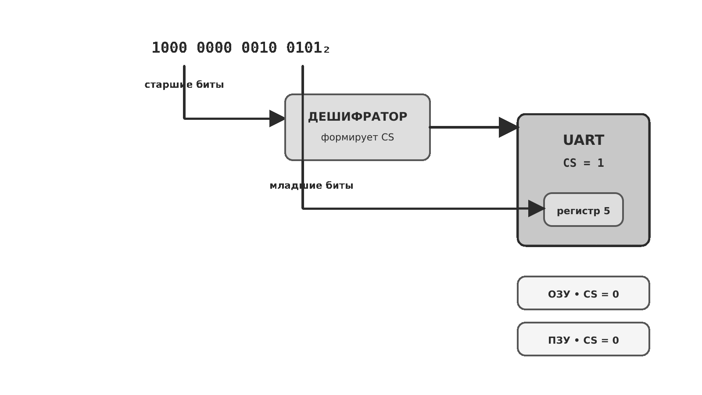

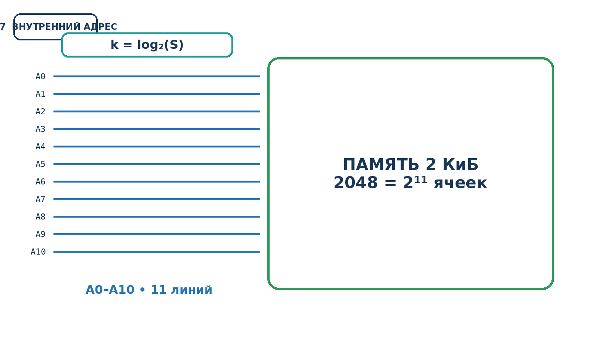

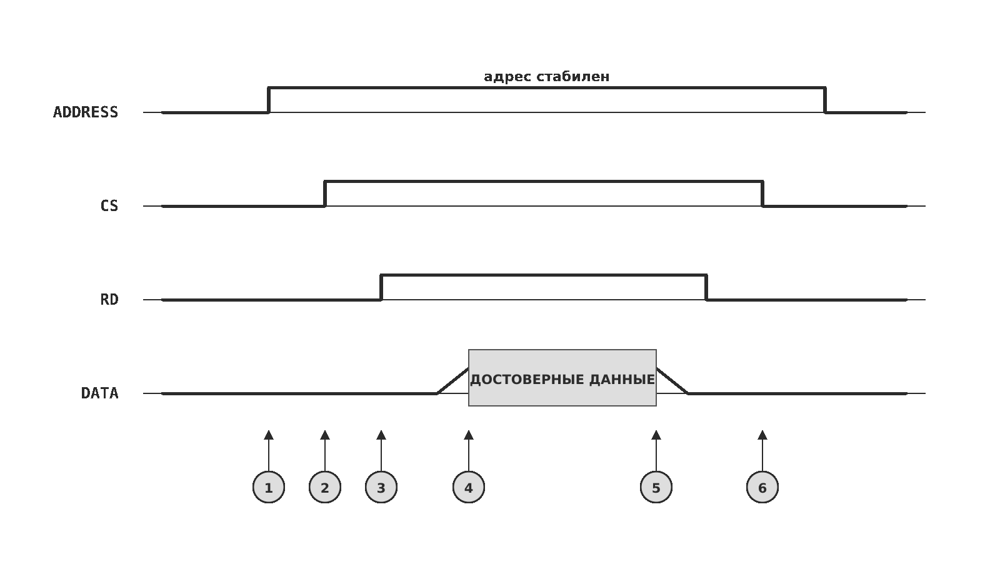

## 8. Выравнивание адресного блока

Для простого декодирования базовый адрес блока размером 2^k обычно выравнивают по его размеру. Это означает, что k младших битов базового адреса равны нулю.

Например, блок размером 2 КиБ = 0800h корректно начинается с адресов 0000h, 0800h, 1000h, 1800h и так далее. Начальный адрес 8400h для естественного 2-КиБ блока неудобен: он не кратен 0800h и потребует более сложной логики или разделения диапазона.

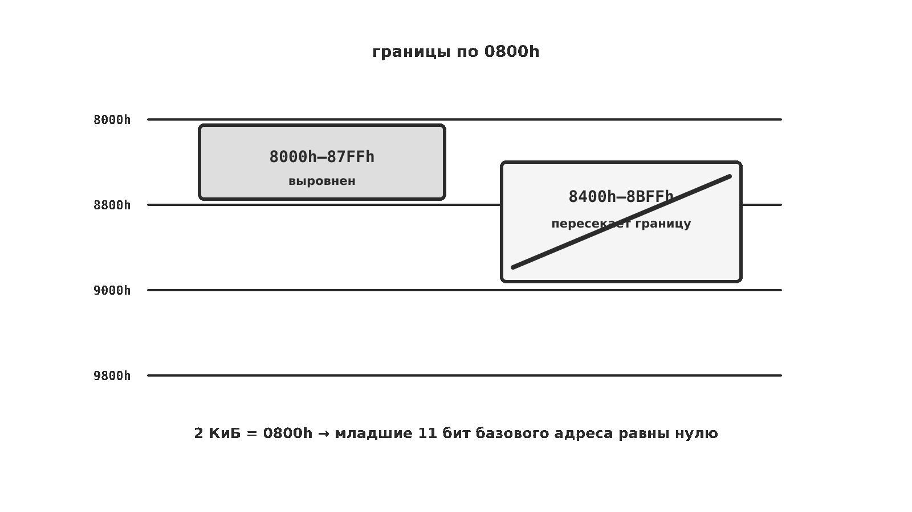

## 9. Полная дешифрация адреса

Полная дешифрация означает, что при формировании `CS` учитываются все разряды адреса, которые не используются для выбора ячейки внутри устройства. В результате устройство реагирует только на один назначенный ему диапазон.

Пример 1. Подключение памяти 2 КиБ к 16-разрядной адресной шине в диапазоне `8000h–87FFh`.

Размер микросхемы:

2 КиБ = 2048 байт = 0800h = 2^11 байт.

Для внутреннего адреса нужны `A0–A10`. Устройство должно быть выбрано, когда старшие линии `A15–A11` имеют код 10000₂:

A15 A14 A13 A12 A11 = 1 0 0 0 0.

Условие выбора для активного высоким уровнем сигнала можно записать так:

$$
`CS` = A_{15}\cdot\overline{A_{14}}\cdot\overline{A_{13}}\cdot\overline{A_{12}}\cdot\overline{A_{11}}
$$

Линии `A0–A10` могут принимать любые значения от 00000000000₂ до 11111111111₂. Поэтому диапазон содержит адреса `8000h–87FFh`.

Проверка последнего адреса:

Aend = 8000h + 0800h − 1 = 87FFh.

Преимущества полной дешифрации:

- каждый физический объект имеет единственный диапазон адресов;
- отсутствуют непредусмотренные зеркальные адреса;
- упрощаются диагностика, сопровождение и расширение системы;
- снижается риск конфликта при добавлении устройств.

Недостатки:

- требуется больше логических элементов или входов дешифратора;
- увеличиваются стоимость и задержка комбинационной логики;
- для очень простого устройства схема может оказаться избыточной.

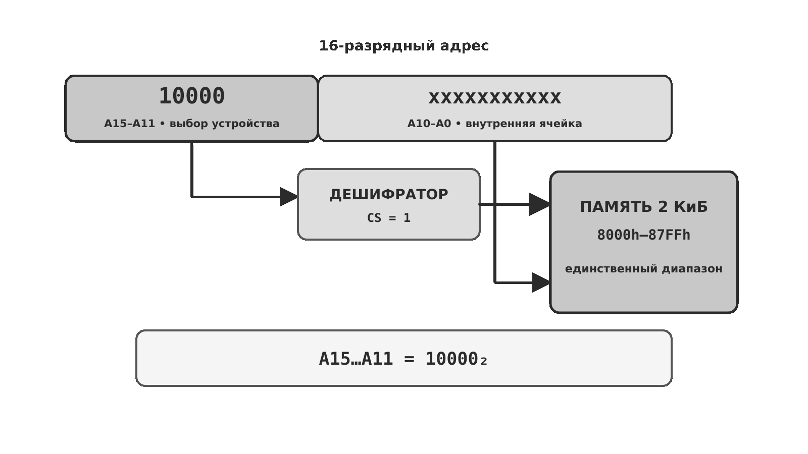

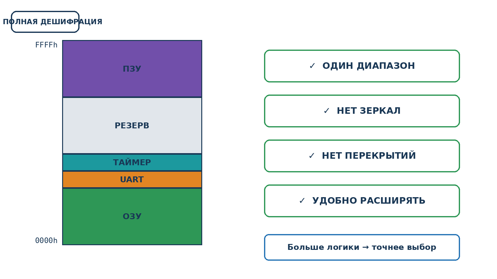

## 10. Неполная дешифрация адреса

Неполная, или частичная, дешифрация означает, что часть старших адресных линий не анализируется при формировании `CS`. Такие линии для дешифратора безразличны. Устройство будет выбрано при нескольких разных адресных комбинациях.

Результат — появление адресов-синонимов, или зеркальных адресов. Разные адреса обращаются к одной и той же физической ячейке или одному регистру.

Рассмотрим ту же память 2 КиБ. Пусть `A0–A10` выбирают внутреннюю ячейку, но дешифратор проверяет только A15 = 1, игнорируя A14–A11.

Тогда условие выбора:

`CS` = A15.

Четыре игнорируемых разряда A14–A11 образуют 2^4 = 16 комбинаций. Поэтому каждая ячейка микросхемы имеет 16 адресов-синонимов, а весь физический блок `8000h–87FFh` зеркально повторяется:

`8000h–87FFh`
8800h–8FFFh
9000h–97FFh
9800h–9FFFh
A000h–A7FFh
A800h–AFFFh
B000h–B7FFh
B800h–BFFFh
C000h–C7FFh
C800h–CFFFh
D000h–D7FFh
D800h–DFFFh
E000h–E7FFh
E800h–EFFFh
F000h–F7FFh
F800h–FFFFh

Количество зеркал определяется формулой:

$$
M = 2^m
$$

где m — число неиспользованных старших адресных линий, которые могли бы различать диапазоны.

Важно: неполная дешифрация не увеличивает физический объём памяти. Во всех 16 диапазонах видны одни и те же 2 КиБ. Например, запись по адресу 8005h изменит ту же ячейку, которая читается по адресам 8805h, 9005h и так далее.

Преимущества неполной дешифрации:

- более простая и дешёвая логика;
- меньше задержка распространения;
- допустима в небольшой неизменяемой системе, если зеркала заранее учтены.

Недостатки:

- расходуются большие участки адресного пространства;
- возникают адреса-синонимы;
- сложнее находить ошибки программы и схемы;
- дальнейшее расширение может вызвать конфликт адресов;
- программа может случайно обращаться к устройству по незапланированному адресу.

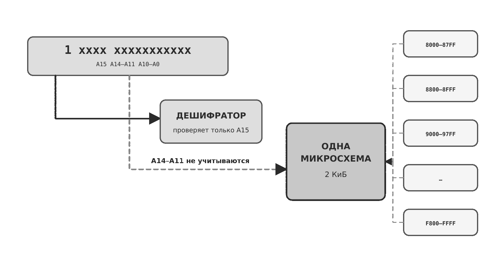

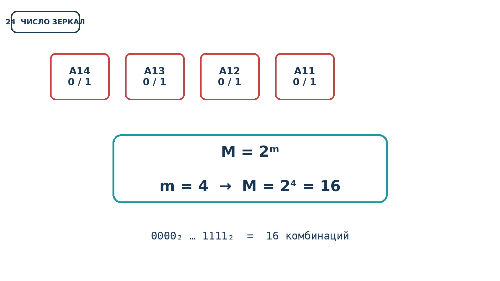

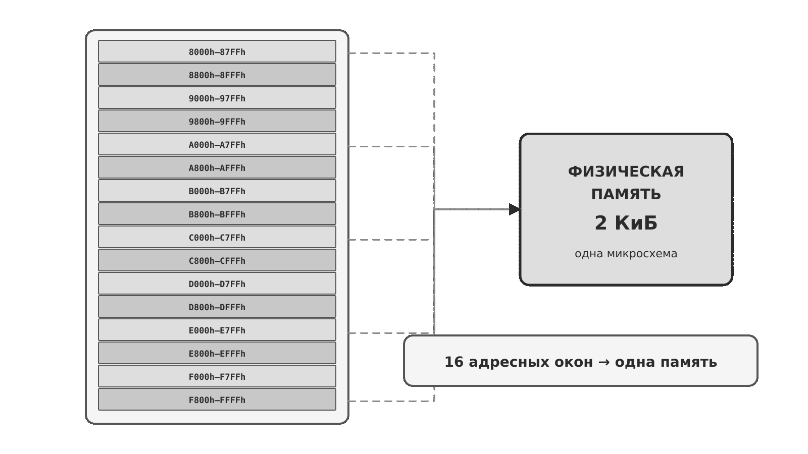

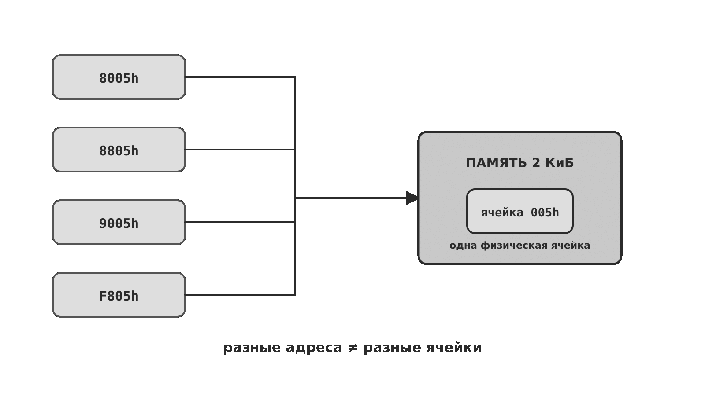

## 11. Сравнение полной и неполной дешифрации

| Признак | Полная дешифрация | Неполная дешифрация |
|---|---|---|
| Проверяемые старшие биты | Все необходимые | Только часть |
| Диапазон устройства | Единственный | Повторяется зеркалами |
| Сложность схемы | Выше | Ниже |
| Расход адресного пространства | Минимальный | Повышенный |
| Расширяемость | Хорошая | Ограниченная |
| Вероятность конфликтов | Ниже | Выше |
| Применение | Развитые и расширяемые МПС | Простые фиксированные МПС |

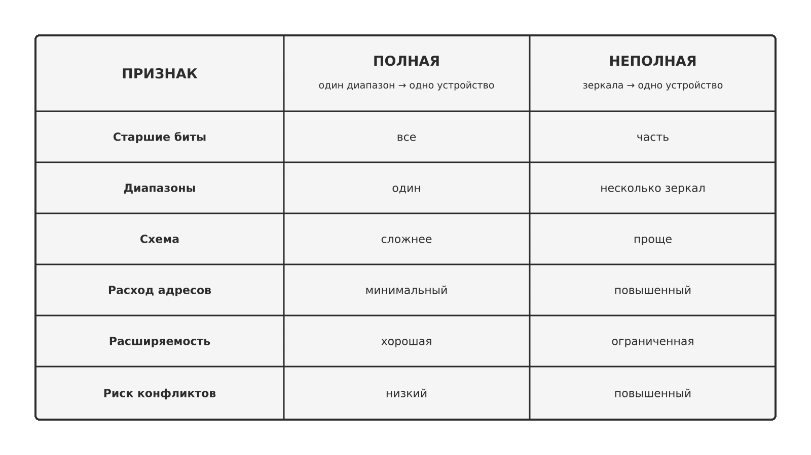

## 12. Многоуровневая дешифрация

В реальной МПС дешифрация часто выполняется в несколько уровней.

Первый уровень выбирает крупную область: ОЗУ, ПЗУ, периферию или внешнюю шину.

Второй уровень выбирает конкретный модуль внутри области: UART, таймер, GPIO, АЦП.

Третий уровень использует младшие разряды для выбора регистра внутри модуля.

Например, область периферии занимает 8000h–8FFFh. Внутри неё каждому модулю выделено по 16 адресов:

8000h–800Fh — GPIO;
8010h–801Fh — таймер;
8020h–802Fh — UART;
8030h–803Fh — АЦП.

Для выбора области проверяются старшие биты. Для выбора одного из блоков используются следующие разряды адреса. Четыре младших разряда A3–A0 задают номер регистра от 0 до 15.

## 13. Пример составления карты памяти

Условие. Спроектировать карту 16-разрядной МПС, содержащей:

- ОЗУ 8 КиБ;
- ПЗУ 16 КиБ;
- четыре периферийных блока по 16 регистров;
- резерв для расширения.

Шаг 1. Определяем всё адресное пространство:

`0000h–FFFFh`, 64 КиБ.

Шаг 2. Размещаем ОЗУ с адреса 0000h:

8 КиБ = 2000h;
Aend = 0000h + 2000h − 1 = 1FFFh.

Диапазон ОЗУ: 0000h–1FFFh.

Шаг 3. Размещаем ПЗУ в верхней части пространства:

16 КиБ = 4000h;
Astart = 10000h − 4000h = C000h.

Диапазон ПЗУ: C000h–FFFFh.

Шаг 4. Выделяем страницу периферии 256 байт:

8000h–80FFh.

Шаг 5. Размещаем устройства:

8000h–800Fh — GPIO;
8010h–801Fh — таймер;
8020h–802Fh — UART;
8030h–803Fh — АЦП;
8040h–80FFh — резерв периферии.

Шаг 6. Проверяем:

- диапазоны не перекрываются;
- каждый блок помещается в выделенную область;
- начальные адреса выровнены по размеру блоков;
- предусмотрен резерв;
- область ПЗУ содержит адрес начального запуска, если этого требует архитектура процессора.

## 14. Пример дешифрации периферийного блока

Пусть UART занимает 16 адресов 8020h–802Fh.

Так как 16 = 2^4, младшие линии A0–A3 выбирают один из 16 внутренних регистров. При полной дешифрации все линии A15–A4 должны соответствовать двоичному представлению 802h:

8020h = 1000 0000 0010 0000₂.

Для всего диапазона 8020h–802Fh неизменны A15–A4, а A3–A0 изменяются от 0000₂ до 1111₂.

Если не декодировать A4, устройство будет дополнительно реагировать на адреса 8030h–803Fh. Это создаст зеркало UART поверх диапазона, который в нашей карте назначен АЦП. При чтении возможен конфликт устройств, а при записи оба устройства могут получить сигнал выбора. Этот пример показывает, почему частичная дешифрация должна быть согласована со всей картой, а не рассматриваться отдельно.

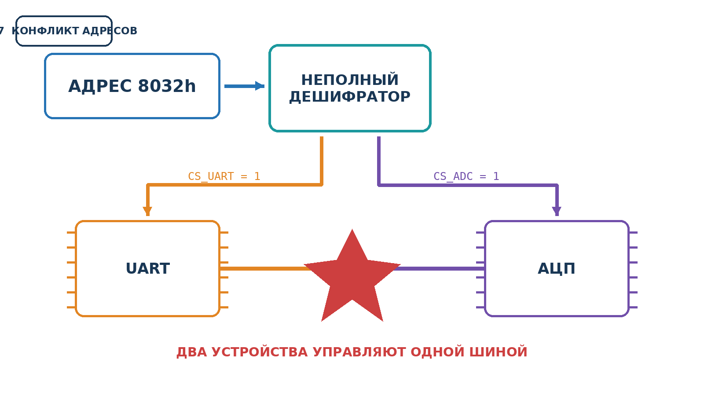

## 15. Управляющие сигналы при обмене

Одного сигнала `CS` недостаточно. Обычно используются:

`CS` — выбор микросхемы;
`RD` или `OE` — разрешение чтения;
`WR` или `WE` — разрешение записи;
M/IO — признак обращения к памяти или к пространству портов в архитектурах с разделёнными пространствами;
BE, LB/UB — разрешение отдельных байтов многобайтовой шины;
READY или WAIT — согласование с медленным устройством.

Сигналы могут быть активны высоким или низким уровнем. Активный низкий уровень часто обозначают чертой над именем, суффиксом _n или символом #, например `CS`_n, /`RD`, `WR`#. При разработке схемы нельзя смешивать активные уровни.

Упрощённые условия доступа:

чтение устройства = `CS` активно И `RD` активно;
запись в устройство = `CS` активно И `WR` активно.

## 16. Адресные промежутки, которые лучше не использовать

В карте встречаются зарезервированные области. Это не обязательно физическая память. Обращение к такому адресу может:

- не дать полезных данных;
- вернуть заранее определённое значение;
- вызвать исключение шины;
- привести к зависанию при ожидании READY;
- обратиться к незадокументированному или будущему устройству.

Поэтому программа должна работать только с адресами, разрешёнными документацией конкретной МПС.

## 17. Типичные ошибки

1. Забывают единицу в формуле размера диапазона.

Неверно: S = Aend − Astart.
Верно: S = Aend − Astart + 1.

2. Путают число адресов с максимальным адресом.

У 16-разрядной шины 65 536 адресов, но максимальный адрес равен 65 535, или FFFFh.

3. Путают разрядность данных и адреса.

8-разрядный процессор не обязательно имеет 8-разрядную адресную шину.

4. Не учитывают байтовую адресацию.

16-разрядное слово обычно занимает два последовательных байтовых адреса.

5. Допускают перекрытие диапазонов.

Два устройства получают `CS` при одном адресе.

6. Не выравнивают блок по его размеру.

Это усложняет дешифрацию и может разбить устройство на несколько диапазонов.

7. Принимают зеркальные адреса за дополнительную память.

Неполная дешифрация создаёт синонимы, но не добавляет физических ячеек.

8. Игнорируют побочные эффекты регистров периферии.

Чтение регистра может сбросить флаг, а запись единицы — очистить отдельные биты.

9. Не учитывают активный уровень управляющих сигналов.

Ошибка в полярности `CS`, `RD` или `WR` полностью нарушает обмен.

10. Считают любой незанятый адрес безопасным.

Зарезервированные адреса нельзя использовать без разрешения документации.

## 18. Алгоритм проектирования карты адресов

1. Определить разрядность адресной шины и полный диапазон адресов.
2. Уточнить адресуемую единицу: байт, слово или иной объект.
3. Составить перечень памяти и периферийных блоков с их размерами.
4. Учесть обязательные архитектурные адреса: векторы сброса, таблицу прерываний, системные области.
5. Назначить крупные непересекающиеся области ОЗУ, ПЗУ и периферии.
6. Выровнять каждый блок по размеру, если это возможно.
7. Рассчитать конечные адреса по формуле Aend = Abase + S − 1.
8. Определить младшие линии, выбирающие внутреннюю ячейку.
9. Определить старшие линии, формирующие `CS`.
10. Решить, требуется полная или допустима неполная дешифрация.
11. При неполной дешифрации перечислить все зеркальные диапазоны.
12. Проверить отсутствие конфликтов при чтении и записи.
13. Зарезервировать диапазоны для развития системы.
14. Оформить итоговую карту в таблице и перенести адреса в программную документацию.

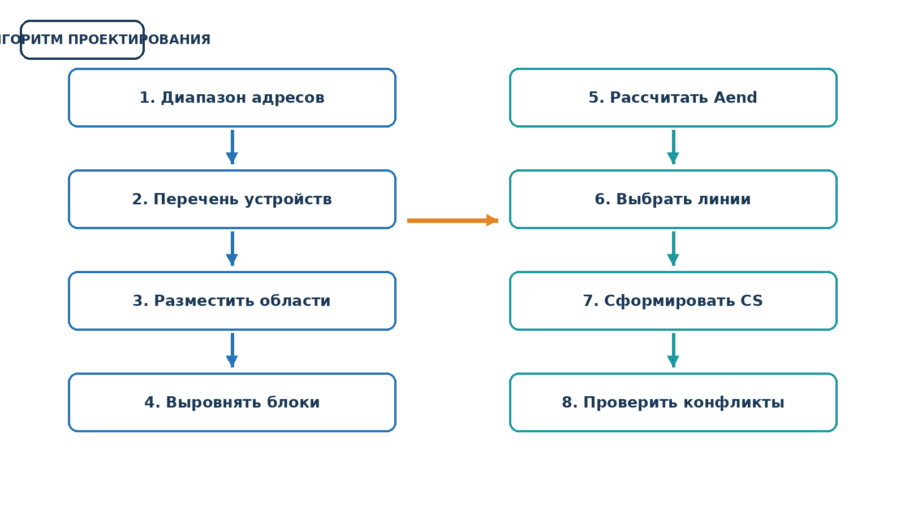

## 19. Краткий практический пример

Задано: 16-разрядная адресная шина и микросхема ОЗУ 4 КиБ. ОЗУ должно начинаться с адреса 4000h.

1. Размер:

4 КиБ = 4096 = 1000h = 2^12 байт.

2. Внутренние адресные линии:

A0–A11.

3. Последний адрес:

4000h + 1000h − 1 = 4FFFh.

4. При полной дешифрации старшие линии имеют значение:

A15 A14 A13 A12 = 0 1 0 0.

5. Если декодировать только A15 = 0 и A14 = 1, линии A13 и A12 будут проигнорированы. Число зеркал:

M = 2^2 = 4.

Физическое ОЗУ будет доступно в диапазонах:

4000h–4FFFh;
5000h–5FFFh;
6000h–6FFFh;
7000h–7FFFh.

Все четыре диапазона обращаются к одним и тем же 4096 физическим ячейкам.

## 20. Выводы

Адресное пространство определяет все объекты, к которым процессор способен обратиться. Карта адресов связывает числовые диапазоны с памятью и периферийными устройствами. В системах с memory-mapped I/O периферия входит в общее пространство памяти; при isolated I/O порты образуют отдельное пространство.

Дешифратор анализирует адрес и формирует сигнал выбора устройства. При полной дешифрации устройство имеет единственный адресный диапазон. При неполной дешифрации часть линий игнорируется и появляются зеркальные адреса. Неполная дешифрация упрощает аппаратуру, но усложняет карту и ограничивает расширение системы.

Главное правило проектирования: каждый используемый адрес должен однозначно соответствовать ожидаемому объекту, а все зеркала и зарезервированные области должны быть явно отражены в документации.

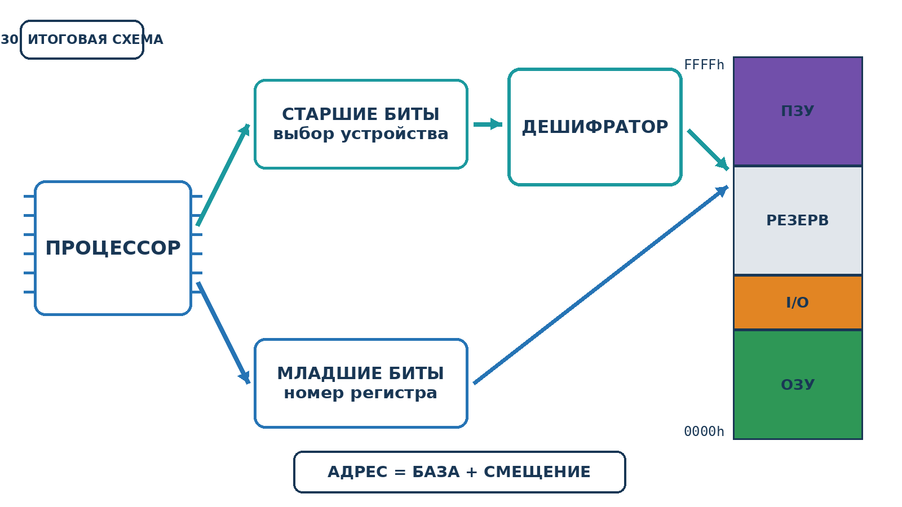

## 21. Контрольные вопросы

1. Что называют адресным пространством микропроцессорной системы?
2. Сколько байтов можно адресовать при 20-разрядной адресной шине?
3. Почему максимальный адрес 16-разрядной шины равен FFFFh, а количество адресов — 65 536?
4. Что такое базовый адрес и смещение?
5. Для чего составляется карта памяти?
6. Чем memory-mapped I/O отличается от isolated I/O?
7. Какие команды x86 используются для обращения к портам?
8. В чём особенность адресации регистров ввода-вывода AVR?
9. Какие адресные линии выбирают ячейку внутри микросхемы 8 КиБ?
10. Что делает дешифратор адреса?
11. Как определить последний адрес блока по базовому адресу и размеру?
12. Что называют полной дешифрацией?
13. Почему при неполной дешифрации появляются зеркальные адреса?
14. Увеличивают ли зеркальные адреса физический объём памяти?
15. Как определить количество зеркал по числу игнорируемых линий?
16. Какие проблемы возникают при перекрытии адресных диапазонов?
17. Почему блоки желательно выравнивать по их размеру?
18. Какие управляющие сигналы участвуют в чтении и записи?

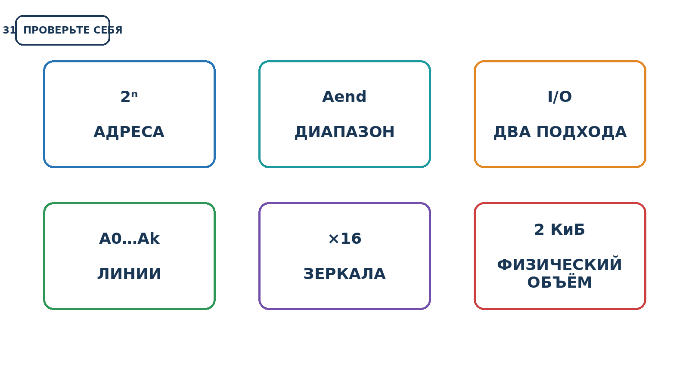

## 22. Задания для самостоятельной работы

Задание 1. Процессор имеет 18-разрядную адресную шину и побайтовую адресацию. Определите количество адресов, объём пространства и максимальный адрес.

Задание 2. Блок ОЗУ размером 8 КиБ начинается с адреса 6000h. Определите последний адрес и линии внутренней адресации.

Задание 3. Периферийный модуль имеет 32 регистра и базовый адрес A100h. Определите диапазон адресов и число младших адресных линий.

Задание 4. Микросхема 2 КиБ подключена к 16-разрядной шине. При выборе анализируются A15, A14 и A13, а линии A12 и A11 игнорируются. Определите количество зеркал и перечислите диапазоны, если основной диапазон начинается с 8000h.

Задание 5. Составьте карту 64-КиБ пространства для системы с ОЗУ 16 КиБ, ПЗУ 8 КиБ, четырьмя периферийными блоками по 32 адреса и резервом. Обоснуйте выбранные базовые адреса.

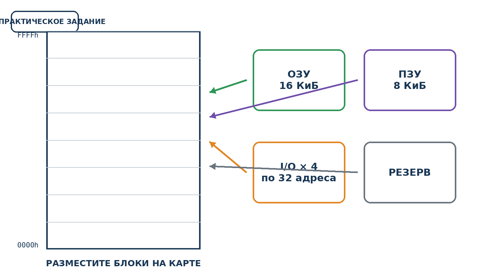

## 23. Источники и рекомендуемая литература

1. Arm. Armv7-M Architecture Reference Manual. Разделы «Address space» и «System address map».
https://developer.arm.com/documentation/ddi0403/latest/

2. Arm. Cortex-M documentation and resources.
https://developer.arm.com/Processors/Cortex-M

3. Microchip Technology. ATmega48A/PA/88A/PA/168A/PA/328/P Data Sheet. Разделы «AVR Memories» и «I/O Memory».
https://www.microchip.com/en-us/product/atmega328p?tab=documents

4. Intel. Intel 64 and IA-32 Architectures Software Developer’s Manual. Том 1: Basic Architecture; описание пространства ввода-вывода и команд `IN`/`OUT`.
https://www.intel.com/content/www/us/en/developer/articles/technical/intel-sdm.html

5. Stallings W. Computer Organization and Architecture: Designing for Performance. Pearson.

6. Hamacher C., Vranesic Z., Zaky S., Manjikian N. Computer Organization and Embedded Systems. McGraw-Hill.

7. Brey B. B. The Intel Microprocessors: Architecture, Programming, and Interfacing. Pearson.

8. Engineering LibreTexts. Types of I/O: memory-mapped and port-mapped I/O.
https://eng.libretexts.org/Courses/Delta_College/Introduction_to_Operating_Systems/16%3A_I_O_and_Disk_Management/16.02%3A_Types_of_I_O

Примечание. Конкретные адреса, допустимые операции и поведение зарезервированных областей всегда следует уточнять по актуальной документации выбранного процессора или микроконтроллера.
