# Тема 5.4. Выбор элементной базы для микропроцессорной системы

## Цель лекции

Научиться обоснованно выбирать микроконтроллер, память, интерфейсные микросхемы, источники питания, датчики, исполнительные устройства и защитные элементы для микропроцессорной системы (МПС).

После изучения темы студент должен:

- понимать, что входит в элементную базу МПС;
- уметь переводить требования технического задания в требования к компонентам;
- различать микроконтроллер, микропроцессор, модуль и отладочную плату;
- выбирать компоненты по электрическим, функциональным и эксплуатационным параметрам;
- проверять совместимость напряжений, интерфейсов и нагрузочную способность выводов;
- учитывать питание, защиту, корпус, стоимость и доступность компонентов;
- уметь оформить обоснование выбора элементной базы.

---

## План лекции

1. Понятие элементной базы МПС.
2. Почему выбор начинается с технического задания.
3. Структура элементной базы микропроцессорной системы.
4. Выбор центрального вычислительного устройства.
5. Выбор памяти.
6. Выбор интерфейсов и средств согласования.
7. Выбор датчиков и исполнительных устройств.
8. Подсистема питания, тактирования и сброса.
9. Электрическая совместимость компонентов.
10. Защита, надёжность и условия эксплуатации.
11. Конструктивные и производственные ограничения.
12. Пошаговый алгоритм выбора элементной базы.
13. Пример выбора компонентов для учебной МПС.
14. Типичные ошибки проектирования.

---

## 1. Что называют элементной базой МПС

**Элементная база** — это совокупность электронных компонентов, из которых строится микропроцессорная система.

В учебных работах под элементной базой иногда ошибочно понимают только микроконтроллер и несколько подключённых к нему модулей. В реальном проектировании это понятие значительно шире. Даже если программа написана правильно, устройство не сможет надёжно работать без подходящего источника питания, цепи сброса, развязывающих конденсаторов, согласования уровней и защиты внешних линий. Поэтому элементная база описывает не отдельные детали, а техническую основу всей системы.

Каждый компонент решает определённую задачу и одновременно предъявляет требования к остальным компонентам. Например, цифровой датчик с питанием 3,3 В требует совместимого логического уровня на входах микроконтроллера, двигатель требует отдельного силового ключа и источника питания, а длинная линия связи требует помехоустойчивого физического интерфейса. Изменение одного элемента нередко заставляет пересмотреть несколько других узлов.

В простейшей системе недостаточно выбрать только микроконтроллер. Для работы устройства обычно требуются следующие элементы (например, как на рис.1):

- вычислительный элемент: микроконтроллер, микропроцессор или однокристальная система;
- память программы и данных;
- датчики и устройства ввода;
- исполнительные устройства и устройства вывода;
- интерфейсные микросхемы;
- генератор тактового сигнала;
- цепи сброса и контроля питания;
- стабилизаторы и преобразователи напряжения;
- элементы защиты;
- разъёмы, индикаторы и органы управления;
- пассивные компоненты: резисторы, конденсаторы, дроссели и кварцевые резонаторы.

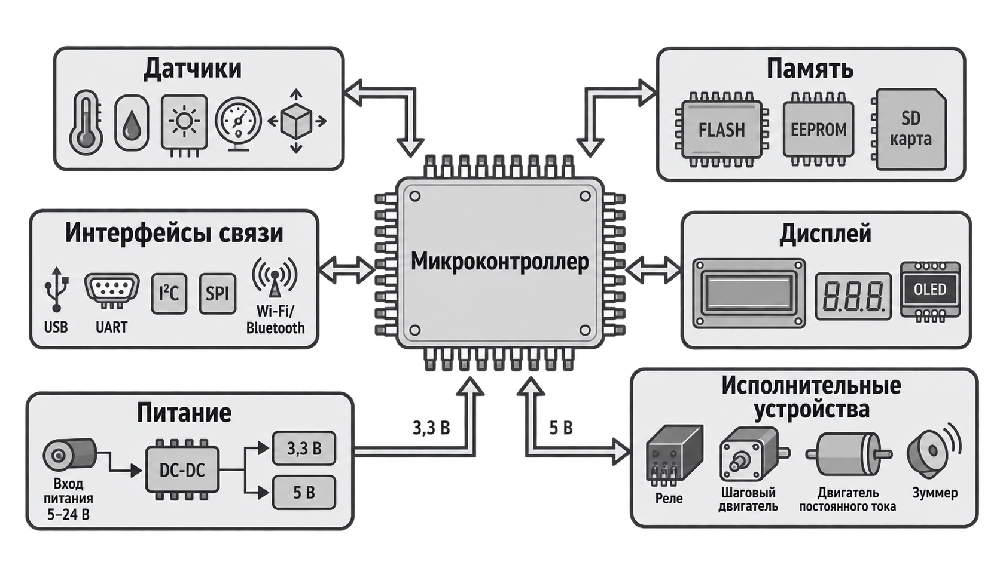

**Рисунок 1 — Состав элементной базы микропроцессорной системы.**

Таким образом, выбор элементной базы — это не поиск одной «подходящей микросхемы», а формирование согласованного набора компонентов.
Под согласованностью понимают выполнение сразу нескольких условий. Компоненты должны быть функционально совместимы, работать от имеющихся напряжений, обмениваться сигналами допустимых уровней, укладываться в энергетический баланс и выдерживать заданные условия эксплуатации. Кроме того, их необходимо разместить на печатной плате, запрограммировать, проверить и при необходимости заменить. Следовательно, хороший выбор учитывает не только электрические характеристики, но и технологию изготовления, сопровождение и ремонт.
Сначала определяют требования, затем выбирают функциональные узлы и проверяют их совместимость.
В итоге подбора элементов получается набор функциональных групп МПС, как на рисунке 2.

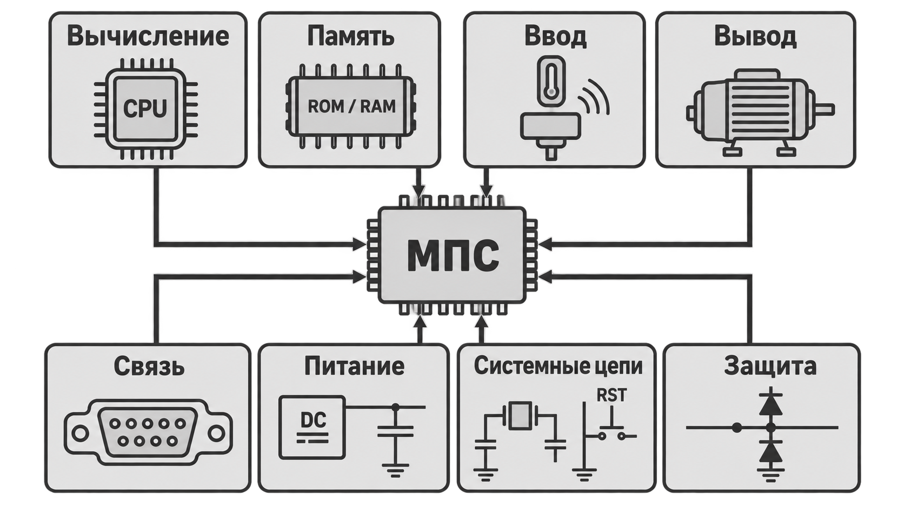

**Рисунок 2 — Основные функциональные группы микропроцессорной системы.**

---

## 2. Выбор начинается с технического задания

Одна и та же функция может быть реализована десятками способов. Например, измеритель температуры можно построить на простом 8-разрядном микроконтроллере, на 32-разрядном микроконтроллере или на беспроводном модуле ESP32. Правильность выбора зависит от требований.

Начинать проект с каталога микроконтроллеров неудобно: количество моделей слишком велико, а привлекательные характеристики могут не иметь отношения к задаче. Гораздо эффективнее сначала представить будущее устройство в виде набора функций. Нужно определить, что система принимает на входе, какие данные обрабатывает, чем управляет, как взаимодействует с пользователем и другими устройствами. После этого функции переводят в технические параметры: количество входов и выходов, число интерфейсов, точность измерений, объём памяти, допустимое время реакции и потребляемую мощность.

Например, фраза «устройство должно контролировать температуру» ещё не позволяет выбрать датчик. Нужно знать диапазон температур, допустимую погрешность, скорость изменения процесса, место установки датчика и длину соединительного кабеля. Если температура меняется медленно, измерение раз в секунду может быть достаточным. Если же контролируется нагревательный элемент, важны быстрое обнаружение перегрева и гарантированное отключение нагрузки. Из одной и той же общей формулировки получаются разные требования к датчику, контроллеру и алгоритму (рисунок 3 и 4).

До поиска компонентов необходимо ответить на вопросы :

1. Какие физические величины измеряются?
2. Сколько датчиков и исполнительных устройств используется?
3. Какова требуемая точность и частота измерений?
4. Какие интерфейсы необходимы?
5. Нужна ли беспроводная связь?
6. Какой объём программы и данных предполагается?
7. Требуется ли работа в реальном времени?
8. От какого источника питается устройство?
9. Каковы допустимые размеры и стоимость?
10. В каких условиях будет работать система?
11. Требуется ли возможность обновления программы?
12. Как будет выполняться диагностика и ремонт?

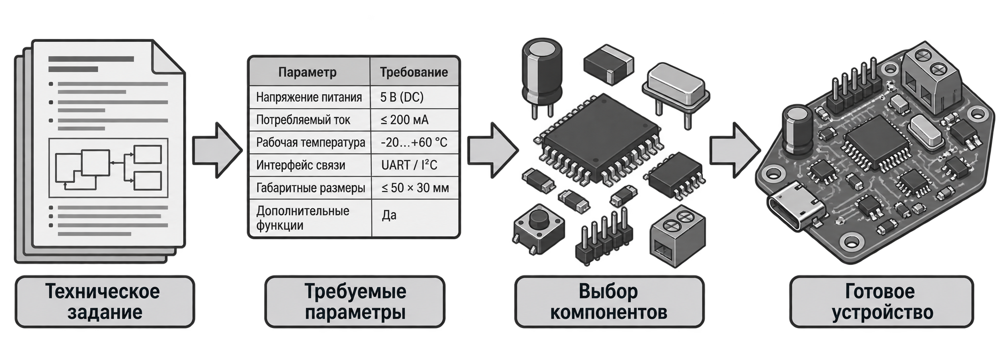

**Рисунок 3 — Переход от требований технического задания к готовому устройству.**

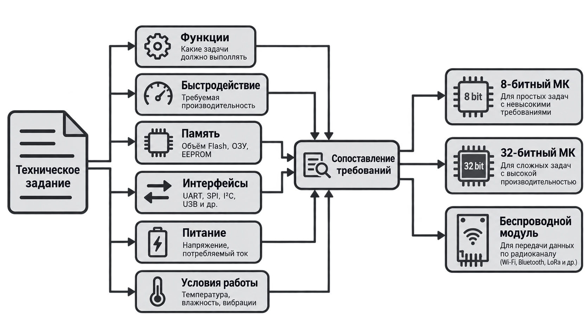

**Рисунок 4 — Связь требований технического задания с выбором вычислительного компонента.**

### 2.1. Обязательные, желательные и ограничивающие требования

Требования удобно разделять на три группы (таблица 1 и рисунок 5).

Таблица 1. Группы требований к компонентам МПС
| Группа | Смысл | Пример |
|---|---|---|
| Обязательные | Без них устройство не выполняет назначение | 4 аналоговых входа, интерфейс RS-485 |
| Желательные | Улучшают устройство, но могут быть исключены | графический дисплей, журнал событий |
| Ограничивающие | Определяют допустимые границы решения | питание 12 В, температура от −20 до +60 °C |

Если компонент не удовлетворяет хотя бы одному обязательному требованию, его нельзя выбирать только потому, что он знаком разработчику или имеется в лаборатории.

Обязательные требования образуют своеобразный фильтр. На первом этапе из рассмотрения исключаются все варианты, которые не подходят по напряжению, температуре, памяти, количеству интерфейсов или другим критическим параметрам. Желательные требования используются уже после этого — для сравнения оставшихся решений. Ограничивающие требования задают рамки: стоимость, размеры, масса, время автономной работы, тип монтажа и условия окружающей среды.

Такое разделение помогает избежать ситуации, когда разработчик выбирает удобную плату, а затем пытается приспособить к ней техническое задание. Правильная последовательность обратная: сначала фиксируются требования, затем под них подбирается элементная база.

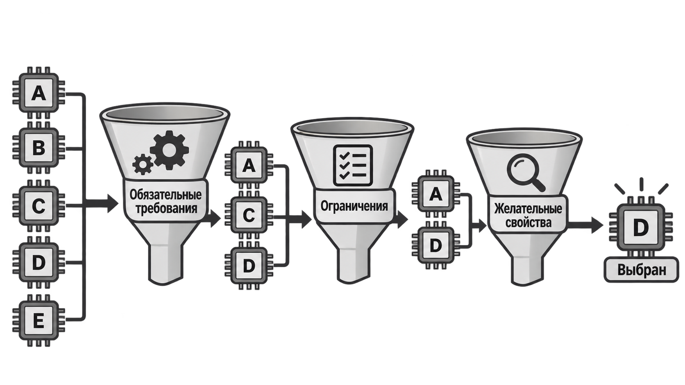

**Рисунок 5 — Последовательный отбор компонентов по группам требований.**

### 2.2. Минимально достаточное решение

Главный принцип выбора:

> Выбирают не самый мощный и не самый дешёвый компонент, а минимально достаточный компонент с обоснованным запасом.

Слишком слабый контроллер не позволит реализовать функции устройства. Слишком мощный может увеличить стоимость, энергопотребление и сложность разработки (рисунок 6).

Запас при этом необходим, но он должен быть осмысленным. Если первая версия программы занимает 28 Кбайт, выбирать микроконтроллер с 32 Кбайт Flash рискованно: после добавления диагностики, обработки ошибок и загрузчика памяти может не хватить. Однако переход сразу к устройству с несколькими мегабайтами памяти тоже не всегда оправдан. Обычно выбирают ближайший вариант семейства, который обеспечивает необходимый резерв без резкого роста сложности и стоимости.

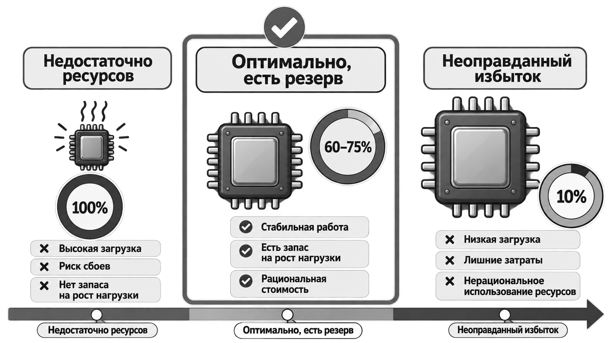

**Рисунок 6 — Недостаток ресурсов, обоснованный резерв и неоправданная избыточность.**

---
## 3. Структура элементной базы МПС

Типовая микропроцессорная система включает несколько взаимосвязанных подсистем (таблица 2).

Таблица 2. Подсистемы типовой МПС
| Подсистема | Возможные компоненты | Назначение |
|---|---|---|
| Вычислительная | MCU, MPU, SoC, модуль | выполнение программы и обработка данных |
| Память | Flash, EEPROM, SRAM, FRAM, SD-карта | хранение программы, настроек и результатов |
| Ввод | кнопки, датчики, АЦП, энкодеры | получение команд и измерительных данных |
| Вывод | дисплей, светодиоды, реле, двигатели | представление информации и воздействие на объект |
| Связь | UART, SPI, I²C, CAN, RS-485, Ethernet, Wi-Fi | обмен данными |
| Питание | LDO, DC/DC, фильтры | формирование необходимых напряжений |
| Системная | генератор, reset supervisor, watchdog | тактирование, запуск и восстановление |
| Защита | предохранитель, TVS, диоды, оптопары | защита от ошибок и помех |

При выборе необходимо учитывать не только параметры каждого компонента, но и связи между подсистемами.

Удобно рассматривать МПС как поток информации и энергии (рисунок 7). Информация проходит от датчиков к вычислительному устройству, затем после обработки поступает к индикаторам, интерфейсам и исполнительным механизмам. Энергия поступает от источника питания и распределяется между всеми узлами. Системные цепи обеспечивают правильный запуск, а защита не допускает повреждения устройства при помехах и ошибках подключения.

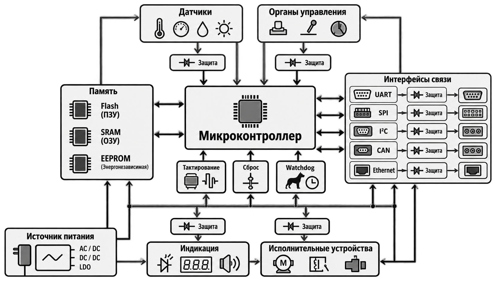

**Рисунок 7 — Типовая структурная схема микропроцессорной системы.**

Такой взгляд помогает обнаружить пропущенные элементы. Если в структурной схеме присутствует двигатель, между ним и GPIO должен появиться драйвер. Если указана связь RS-485, необходим трансивер. Если используется питание 12 В, а микроконтроллер работает от 3,3 В, нужен преобразователь напряжения. Структурная схема фактически становится основой для будущего перечня элементов.

---

## 4. Выбор центрального вычислительного устройства

Подбор элементов следует начинать с главного устройства МПС - вычислительной части (рисунок 8).

### 4.1. Микроконтроллер, микропроцессор, SoC и модуль

**Микроконтроллер (MCU)** содержит процессорное ядро, память и периферийные устройства в одной микросхеме. Он подходит для управления, измерения, автоматики и устройств реального времени.
Главное преимущество микроконтроллера состоит в высокой степени интеграции. Для многих устройств достаточно самой микросхемы, источника питания, нескольких конденсаторов и разъёма программирования. Встроенные таймеры могут формировать ШИМ, АЦП — измерять аналоговые сигналы, а UART, SPI и I²C — обеспечивать связь с внешними устройствами. Это уменьшает размеры платы и количество потенциальных точек отказа.

**Микропроцессор (MPU)** обычно требует внешней оперативной и постоянной памяти. Он используется, когда необходимы операционная система, сложный пользовательский интерфейс, обработка больших объёмов данных или высокая вычислительная производительность.
Микропроцессорное решение сложнее. Для него может потребоваться многослойная печатная плата, высокоскоростная память, точная разводка шин, несколько напряжений питания и загрузочная память. Такое решение оправдано, когда микроконтроллер уже не справляется: например, необходимо запускать Linux, работать с видеокамерой, отображать сложную графику или выполнять ресурсоёмкую обработку данных.

**Однокристальная система (SoC)** объединяет процессор, контроллеры памяти, интерфейсы и другие блоки. Граница между современными MCU и SoC условна.
В названии компонента термин SoC часто подчёркивает наличие большого числа специализированных блоков: радиочасти, криптографических ускорителей, контроллеров памяти или мультимедийных интерфейсов. Однако само название не должно быть главным критерием. Разработчик всё равно проверяет конкретные ресурсы, документацию и условия использования.

**Модуль** содержит микроконтроллер или SoC вместе с частью обязательной обвязки. Например, беспроводной модуль может включать микросхему, Flash-память, кварцевый резонатор и антенну.
Использование модуля особенно полезно при работе с радиосвязью. Проектирование антенны и высокочастотной части требует специального опыта и измерительного оборудования. Готовый модуль сокращает время разработки и снижает риск ошибок. При этом необходимо соблюдать требования к свободной зоне около антенны и размещению модуля на печатной плате.

**Отладочная плата** дополнительно содержит преобразователь USB, стабилизатор, разъёмы и средства программирования. Она удобна для обучения и прототипирования, но не всегда подходит для серийного изделия.
На этапе прототипа отладочная плата позволяет быстро проверить алгоритм и подключение датчиков. В итоговом изделии она может оказаться слишком большой, дорогой или энергозатратной. Поэтому следует различать выбор платформы для эксперимента и выбор компонента для конечной конструкции.

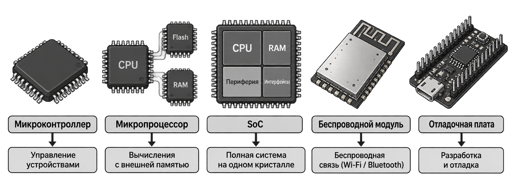

**Рисунок 8 — Основные формы реализации вычислительной части МПС.**

### 4.2. Основные параметры микроконтроллера

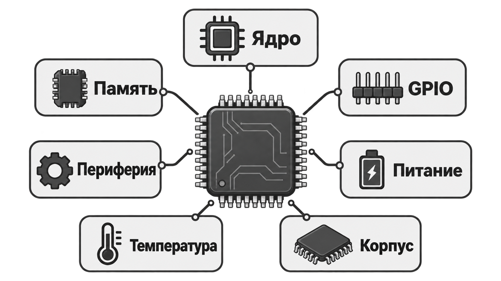

**Рисунок 9 — Совокупность параметров выбора микроконтроллера.**

#### Разрядность ядра (рисунок 10)

- 8-разрядные MCU подходят для простых алгоритмов управления и небольших объёмов данных;
- 16-разрядные применяются в ряде измерительных и управляющих задач;
- 32-разрядные удобны для сложных вычислений, развитых интерфейсов, сетевых протоколов и операционных систем реального времени.

Разрядность не определяет качество микроконтроллера сама по себе. Для простого термостата 8-разрядного устройства может быть достаточно.

Разрядность показывает, с данными какого размера ядру удобнее работать за одну операцию. Восьмиразрядный контроллер естественно обрабатывает байты, а операции с 32-разрядными числами выполняет несколькими командами. Тридцатидвухразрядное ядро эффективнее работает с большими целыми числами, адресами памяти и вычислениями, характерными для цифровой обработки сигналов и сетевых протоколов. Однако в задаче, где требуется считать кнопку, сравнить температуру с порогом и включить реле, это преимущество может практически не использоваться.

При оценке разрядности важно учитывать тип данных программы. Если система активно выполняет вычисления с плавающей точкой, следует проверить наличие аппаратного блока FPU. Если основной код состоит из логических операций и работы с периферией, наличие FPU может не дать заметного выигрыша.

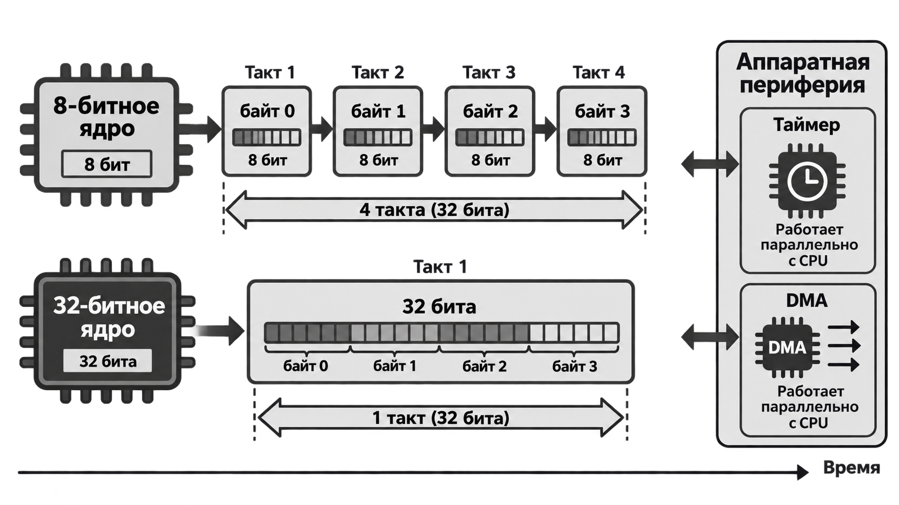

**Рисунок 10 — Сравнение обработки 32-разрядных данных 8- и 32-разрядным ядром.**

#### Тактовая частота

Частота показывает, с какой скоростью работает ядро, но не равна количеству выполненных команд в секунду. Производительность зависит от архитектуры, набора команд, памяти, кэша и периферии.

Выбирать контроллер только по максимальной частоте неправильно.

Два ядра с одинаковой частотой могут выполнять программу с разной скоростью, поскольку различаются количеством тактов на команду, организацией памяти и работой периферии. Кроме того, многие операции выгоднее передавать аппаратным блокам. Например, таймер способен формировать ШИМ без постоянного участия процессора, DMA — передавать блоки данных между памятью и периферией, а аппаратный UART — принимать последовательный поток независимо от основного цикла программы.

Частоту выбирают с учётом требуемого времени реакции и энергопотребления. Увеличение частоты обычно повышает потребляемый ток. Если процесс медленный, контроллер может большую часть времени находиться в режиме сна и просыпаться по таймеру или внешнему событию.

#### Память

При выборе проверяют необходимое значение различных видов памяти (рисунок 11):

- объём Flash для программы;
- объём SRAM для переменных, буферов и стека;
- наличие EEPROM или другой энергонезависимой памяти;
- возможность подключения внешней памяти.

Полезно предусматривать запас памяти. Для учебного и опытного устройства обычно разумен запас около 25–50 %, поскольку программа увеличивается при добавлении диагностики, обработки ошибок и новых функций.

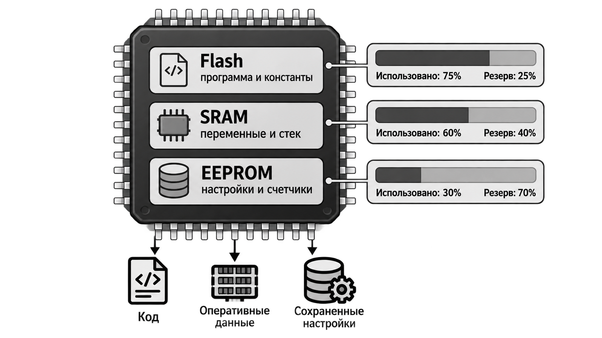

**Рисунок 11 — Назначение Flash, SRAM и EEPROM и резерв памяти.**

Объём Flash оценивают после пробной сборки программы или по аналогичному проекту. Следует учитывать, что библиотеки дисплея, файловой системы, беспроводной связи и шифрования могут занимать значительную часть памяти. SRAM часто заканчивается раньше Flash, особенно при использовании строк, динамических структур, крупных массивов и графических буферов.

Необходимо помнить и о стеке. В него помещаются адреса возврата, локальные переменные и сохранённые регистры. Глубокая вложенность функций, рекурсия и обработка прерываний увеличивают использование стека. Нехватка SRAM может проявляться нестабильно: программа работает в простом режиме, но сбрасывается при одновременной работе нескольких интерфейсов.

#### Количество выводов GPIO

Недостаточно сравнить число требуемых сигналов с общим числом выводов корпуса. Часть выводов может использоваться для:

- питания;
- сброса;
- кварцевого резонатора;
- программирования и отладки;
- загрузочной конфигурации;
- встроенной Flash-памяти или USB;
- альтернативных функций периферии.

Поэтому всегда проверяют **таблицу назначения выводов** в документации.

У современных микроконтроллеров один физический вывод может выполнять несколько альтернативных функций (рисунок 12), но одновременно использовать их нельзя. Например, один и тот же вывод может быть входом АЦП, линией SPI и каналом таймера. После предварительного выбора контроллера рекомендуется составить таблицу распределения выводов. Это позволяет заранее обнаружить конфликт, когда два необходимых периферийных блока доступны только на одном и том же контакте.

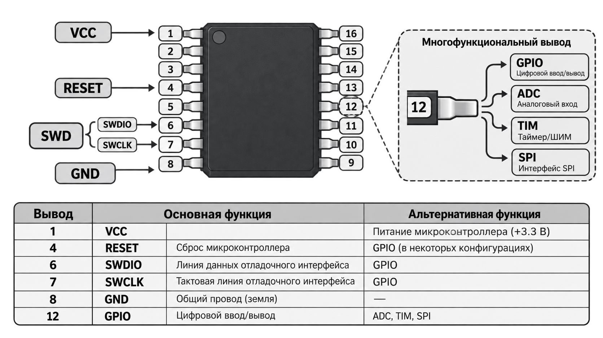

**Рисунок 12 — Назначение выводов и альтернативные функции микроконтроллера.**

Следует также проверять выводы начальной загрузки. Некоторые контакты считываются при сбросе и определяют режим запуска. Если внешнее устройство установит на таком выводе неправильный уровень, микроконтроллер может перейти в загрузчик или не запустить основную программу.

#### Встроенная периферия

В зависимости от задачи могут потребоваться различные периферийныые устройства (рисунок 13):

- АЦП и ЦАП;
- таймеры и ШИМ;
- входы захвата сигнала;
- UART, SPI и I²C;
- CAN, USB или Ethernet;
- компараторы и операционные усилители;
- контроллер сенсорных кнопок;
- аппаратные криптографические блоки.

Если нужная функция имеется внутри MCU, уменьшается число внешних компонентов. Однако качество встроенного блока необходимо проверить по документации.

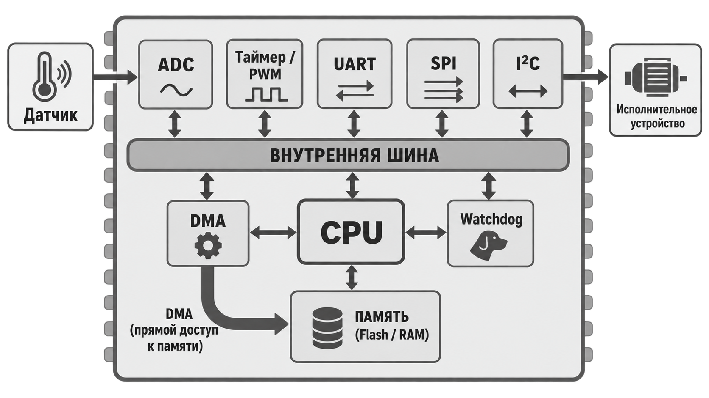

**Рисунок 13 — Встроенная периферия микроконтроллера и роль DMA.**

Наличие периферийного блока ещё не означает, что он подходит по параметрам. У АЦП важны разрядность, реальная точность, допустимая частота выборки и опорное напряжение. У таймера — разрядность счётчика, число каналов и доступные режимы. У UART — наличие аппаратного управления направлением RS-485 и достаточного количества независимых каналов. Поэтому после просмотра краткой таблицы характеристик необходимо обратиться к техническому описанию и справочному руководству.

Полезно выбирать периферию с учётом программной архитектуры. Если система должна одновременно опрашивать датчики, обновлять дисплей и передавать данные, аппаратные прерывания и DMA уменьшают нагрузку на основной цикл и делают время реакции более предсказуемым.

#### Энергопотребление

Для автономного устройства важны:

- ток в активном режиме;
- ток в режимах сна;
- время пробуждения;
- возможность отключения отдельных периферийных блоков;
- потребление беспроводного передатчика в пиковом режиме.

Средний ток периодически работающего устройства можно оценить по формуле:

$$
I_{avg}=\frac{I_1t_1+I_2t_2+\ldots+I_nt_n}{T},
$$

где $I_i$ — ток в соответствующем режиме, $t_i$ — длительность режима, $T$ — полный период работы.

При расчёте автономности нельзя учитывать только ток микроконтроллера (рисунок 14). В системе могут постоянно потреблять энергию стабилизатор, датчик, светодиод, подтягивающие резисторы и преобразователь интерфейса. У беспроводных устройств особенно важен пиковый ток передачи. Источник питания и конденсаторы должны выдерживать этот пик даже в том случае, если средний ток невелик.

Режим сна эффективен только тогда, когда остальные компоненты тоже могут быть переведены в экономичный режим или отключены электронным ключом. Если микроконтроллер потребляет микроамперы, а постоянно включённый датчик — несколько миллиампер, общий результат будет определяться датчиком.

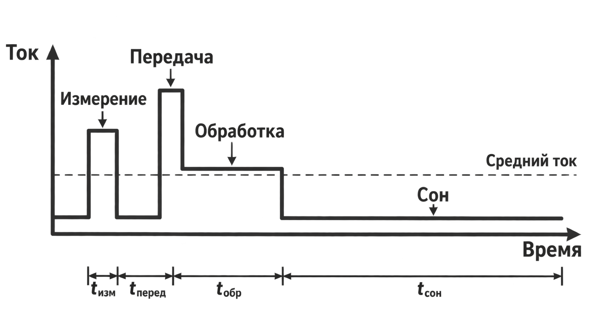

**Рисунок 14 — Изменение тока устройства в течение рабочего цикла.**

#### Температурный диапазон и исполнение

Компонент должен допускать температуру, влажность, вибрацию и другие воздействия, указанные в техническом задании. Нельзя использовать данные из раздела **Absolute Maximum Ratings** как нормальные рабочие параметры. Для проектирования применяют раздел **Recommended Operating Conditions**.

Абсолютные максимальные значения показывают границу, за которой возможно повреждение, но не гарантируют нормальную работу около этой границы. Например, если максимальное напряжение на выводе равно 5,5 В, это не означает, что устройство следует постоянно питать от 5,5 В. Рабочее напряжение выбирают внутри рекомендованного диапазона и предусматривают запас на пульсации и отклонения источника (рисунок 15).

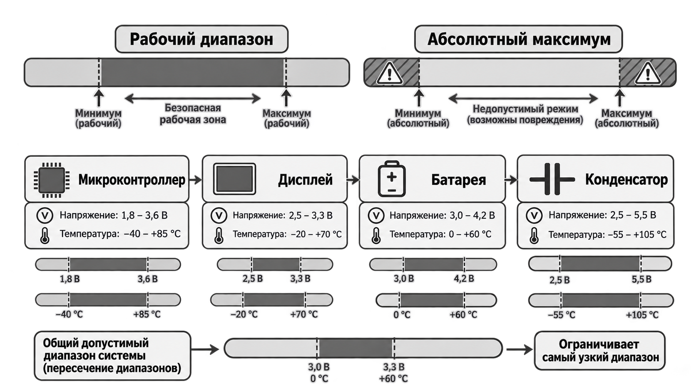

**Рисунок 15 — Рабочие диапазоны компонентов и ограничивающий диапазон системы.**

Температурный диапазон относится не только к микроконтроллеру. Слабым звеном может оказаться дисплей, аккумулятор, конденсатор или кварцевый резонатор. Поэтому проверяется вся элементная база, а не один центральный компонент.

### 4.3. Сравнение типовых платформ

ATmega328P содержит 32 Кбайт Flash, 2 Кбайт SRAM, 1 Кбайт EEPROM, UART, SPI, двухпроводный интерфейс и 10-разрядный АЦП. Семейство STM32G0 использует 32-разрядное ядро Cortex-M0+ и включает микроконтроллеры с различными объёмами памяти и наборами периферии. ESP32-C3 объединяет 32-разрядное ядро RISC-V, Wi-Fi, Bluetooth LE, интерфейсы и средства аппаратной защиты. В таблице 3 приведены основные характеристики наиболее популярных семеств микроконтроллеров.

Таблица 3. Характеристики семейств микроконтроллеров
| Характеристика | ATmega328P | STM32G0 | ESP32-C3 |
|---|---|---|---|
| Архитектура | 8-разрядная AVR | 32-разрядная Arm Cortex-M0+ | 32-разрядная RISC-V |
| Типичные задачи | простая автоматика, обучение | управление, измерение, промышленная периферия | сетевые и IoT-устройства |
| Память и периферия | небольшие объёмы, базовые интерфейсы | широкий выбор вариантов семейства | развитая периферия и встроенная радиосвязь |
| Беспроводная связь | внешним модулем | обычно внешним модулем | Wi-Fi и Bluetooth LE встроены |
| Сложность освоения | невысокая | средняя | средняя |
| Когда выбирать | алгоритм мал, интерфейсов немного | нужен современный универсальный MCU | требуется Wi-Fi или Bluetooth |

Данная таблица не предназначена для выбора конкретной модели. После выбора семейства необходимо открыть документацию именно на нужную микросхему и корпус.

Сравнение показывает разные направления применения. ATmega328P удобен для небольших учебных проектов и хорошо изучен, но обладает ограниченными ресурсами. STM32G0 предоставляет больше вариантов периферии и памяти, сохраняя ориентацию на управляющие системы. ESP32-C3 целесообразен там, где действительно используются Wi-Fi или Bluetooth. Если радиосвязь не нужна, её наличие не является преимуществом само по себе: потребуется учитывать импульсное потребление, антенну и особенности сетевого программного обеспечения (рисунок 16).

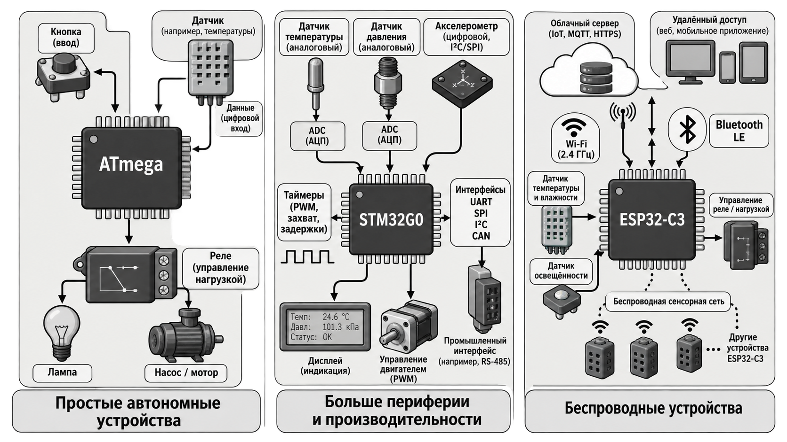

**Рисунок 16 — Примеры применения ATmega328P, STM32G0 и ESP32-C3.**

---

## 5. Выбор памяти

Подбор памяти является одним из ключевых этапов выбора микроконтроллера для МПС.

### 5.1. Основные типы памяти

Основыне типы памяти современных микроконтроллеров приведены в таблице 4.

Таблицма 4. Виды памяти МК.
| Тип памяти | Теряет данные без питания | Основное применение |
|---|---:|---|
| SRAM | да | переменные, стек, буферы |
| Flash | нет | программа, постоянные данные |
| EEPROM | нет | настройки, калибровочные коэффициенты |
| FRAM | нет | часто изменяемые данные и журналы |
| SD-карта | нет | большие объёмы файлов и архивов |

Разные типы памяти не являются взаимозаменяемыми. SRAM обеспечивает быстрый доступ и используется во время работы программы, но после выключения питания её содержимое исчезает. Flash сохраняет данные без питания и обычно хранит код программы, однако имеет ограниченный ресурс перезаписи. EEPROM предназначена для сравнительно небольших настроек, которые меняются не очень часто. FRAM также сохраняет данные, но лучше подходит для частой записи. SD-карта удобна для больших журналов, но требует файловой системы и корректного завершения операций записи.

Выбор памяти определяется характером данных (рисунок 17). Калибровочный коэффициент занимает несколько байт и может храниться в EEPROM. Журнал температуры за несколько месяцев потребует внешней памяти или SD-карты. Буфер полученных по UART данных должен находиться в SRAM. 

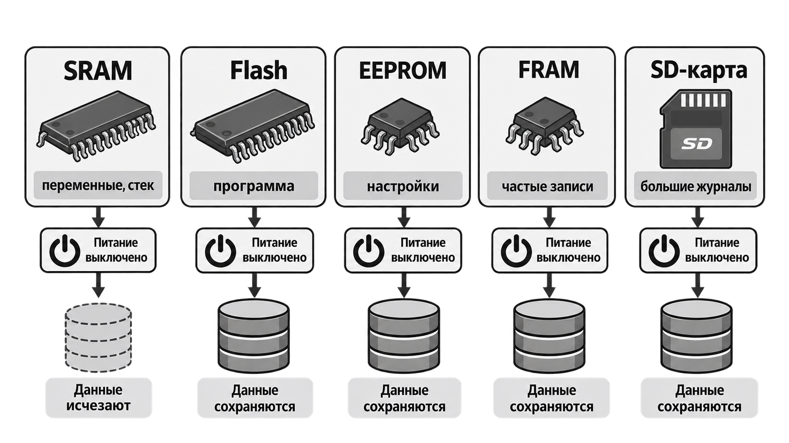

**Рисунок 17 — Типы памяти МПС и сохранение данных при отключении питания.**

Одна и та же система поэтому может одновременно использовать несколько видов памяти.

### 5.2. Как оценить необходимый объём

Для Flash учитывают:

- основной код программы;
- библиотеки;
- таблицы, шрифты и графику;
- загрузчик;
- резерв для обновления.

Для SRAM учитывают:

- глобальные и локальные переменные;
- стек;
- буферы интерфейсов;
- массивы измерений;
- графический буфер дисплея;
- память операционной системы реального времени.

Большой дисплей или сетевой стек может потребовать больше SRAM, чем основной алгоритм управления.

Оценивать память следует не только по сумме объявленных массивов. Библиотеки создают собственные буферы, а операционная система реального времени выделяет отдельный стек каждой задаче. При динамическом выделении памяти возможна фрагментация. Для небольших МПС предпочтительны статически выделенные буферы известного размера, поскольку их потребление проще проверить.

Если планируется обновление прошивки без программатора, может потребоваться место для загрузчика или даже для второй копии программы. Это требование следует учитывать до выбора микроконтроллера, а не после завершения схемы.

### 5.3. Ограниченный ресурс записи

Flash и EEPROM имеют ограниченное число циклов перезаписи. Нельзя записывать значение в энергонезависимую память в каждом проходе быстрого цикла программы. Используют:

- запись только при изменении параметра;
- накопление данных в RAM;
- кольцевой журнал;
- равномерное распределение записей по ячейкам;
- внешнюю FRAM при очень частых записях.

Ресурс записи особенно важен для счётчиков наработки и журналов событий. Если каждую секунду записывать новое значение в одну и ту же ячейку, допустимое число циклов может быть исчерпано намного раньше ожидаемого срока службы устройства (рисунок 18). 

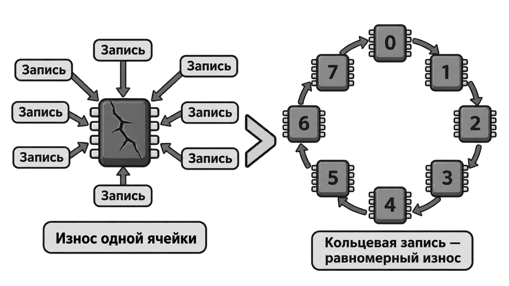

**Рисунок 18 — Износ одной ячейки и распределение записей по кольцу.**

Распределение записей по нескольким адресам и запись только при реальном изменении параметра заметно увеличивают срок службы 

---

## 6. Выбор интерфейсов и согласующих компонентов

Еще одним из главных этапов подбора МК для МПС является рассмотрение имеющихся "на борту" МК интерфейсов.

### 6.1. Локальные интерфейсы на плате

На плате МК обычно рисутствуют следующие интерфейсы для связи с датчиками и внешними модулями МПС (таблица 5).

Таблица 5. Интерфесы на плате МК
| Интерфейс | Линий данных | Особенности | Типичное применение |
|---|---:|---|---|
| GPIO | 1 на сигнал | просто, но требует много выводов | кнопки, реле, светодиоды |
| UART | 2 | асинхронный обмен, точка–точка | модем, отладка, GPS |
| I²C | 2 | адресация нескольких устройств | датчики, EEPROM, RTC |
| SPI | 3–4 и более | высокая скорость, отдельный CS | дисплей, АЦП, Flash |
| 1-Wire | 1 | малое число проводов | датчики температуры |

При выборе проверяют не только название интерфейса, но и следующие характеристики (рисунок 19):

- напряжение логических уровней;
- допустимую частоту;
- режим ведущего и ведомого;
- адрес устройства;
- требуемые подтягивающие резисторы;
- длину линии;
- необходимость согласования и защиты.

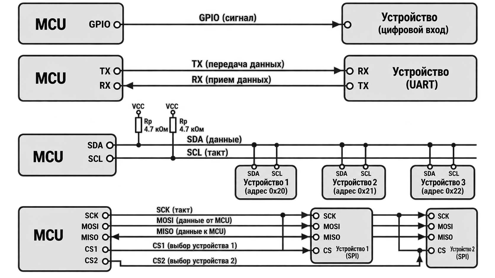

**Рисунок 19 — Топология подключения GPIO, UART, I²C и SPI.**

Интерфейс представляет собой не только набор проводов, но и правила обмена. Два устройства могут иметь выводы с одинаковыми названиями, однако не работать вместе из-за различия режимов, уровней напряжения или формата данных. Например, наличие I²C у датчика и контроллера ещё не гарантирует совместимость, если адрес датчика конфликтует с другим устройством или требуемая скорость не поддерживается.

Количество аппаратных интерфейсов также имеет значение. Если системе одновременно нужны отладочный UART, модем и внешний контроллер, одного UART недостаточно без дополнительного коммутатора или программной реализации. Аналогично несколько SPI-устройств могут использовать общие линии тактирования и данных, но каждому обычно требуется собственный сигнал выбора.

### 6.2. Интерфейсы для внешних линий

Для связи между платами и устройствами применяют физические интерфейсные микросхемы:

- RS-232;
- RS-485;
- CAN;
- LIN;
- USB;
- Ethernet.

Например, UART микроконтроллера и RS-485 — не одно и то же. UART формирует логические сигналы, а трансивер RS-485 преобразует их в дифференциальные сигналы линии.
Между UART и линией связи обязательно используется физический приёмопередатчик (рисунок 20).

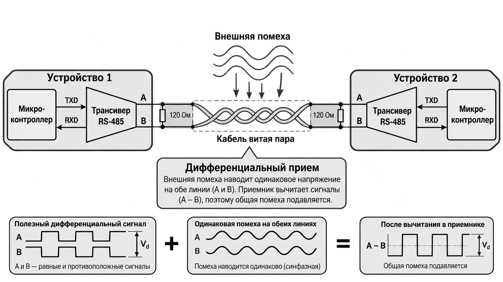

**Рисунок 20 — Физический уровень RS-485 и подавление синфазной помехи.**

Физический уровень определяет, какие напряжения и токи передаются по кабелю и насколько связь устойчива к помехам. UART микроконтроллера рассчитан на соединение внутри платы или между близко расположенными устройствами с общей землёй. RS-485 использует дифференциальную пару и лучше подходит для длинных линий и промышленной среды. CAN дополняет дифференциальную передачу механизмами арбитража и контроля ошибок. Поэтому тип интерфейса выбирают с учётом длины кабеля, скорости, числа устройств и электромагнитной обстановки.

### 6.3. Выбор между I²C и SPI

I²C удобен, когда необходимо подключить несколько сравнительно медленных устройств по двум линиям. SPI удобен при высокой скорости обмена, но обычно требует отдельной линии выбора для каждого ведомого устройства.

Для удалённых датчиков внутри промышленного объекта I²C и SPI часто непригодны без специальных расширителей. В таких случаях выбирают RS-485, CAN или другой помехоустойчивый интерфейс.

I²C требует подтягивающих резисторов, потому что устройства обычно формируют активный нулевой уровень, а единица получается за счёт подтяжки. Слишком большое сопротивление замедляет фронт сигнала, а слишком малое увеличивает ток. Значение выбирают с учётом напряжения, ёмкости шины и частоты обмена. SPI использует двухтактные выходы и может работать быстрее, но при увеличении длины проводников возрастает риск отражений и наводок.

---

## 7. Выбор датчиков и исполнительных устройств

### 7.1. Датчики

При выборе датчика проверяют:

- измеряемый диапазон;
- точность и разрешение;
- чувствительность;
- время отклика;
- тип выходного сигнала;
- напряжение питания;
- ток потребления;
- температурный диапазон;
- необходимость калибровки;
- способ монтажа и контакт с измеряемой средой.

**Разрешение** показывает минимальное различимое изменение результата. **Точность** показывает близость результата к истинному значению. Высокое разрешение не гарантирует высокой точности.

Например, датчик может выдавать значение с двумя знаками после запятой, но иметь погрешность ±0,5 °C. Дополнительные цифры делают представление более подробным, но не повышают физическую точность измерения. При выборе необходимо сопоставлять требуемую погрешность системы с погрешностью датчика, опорного напряжения, аналогового тракта и алгоритма калибровки.

Также учитывают условия установки. Датчик температуры, расположенный рядом с нагревающимся стабилизатором, будет измерять температуру платы, а не окружающего воздуха (рисунок 21). 

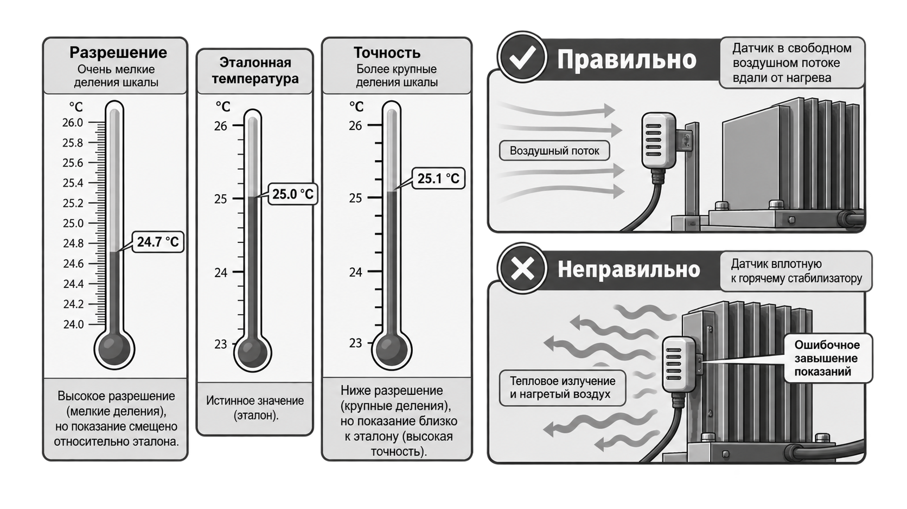

**Рисунок 21 — Различие разрешения и точности датчика; влияние места установки.**

Датчик давления должен быть совместим с измеряемой средой. Оптический датчик зависит от внешнего освещения и загрязнения. Следовательно, правильный компонент может дать неправильный результат при неправильном размещении.

Аналоговый датчик требует проверки диапазона сигнала относительно входа АЦП. Цифровой датчик упрощает передачу результата, но может требовать настройки адреса и протокола.

Аналоговый датчик удобен, если требуется непрерывный сигнал и микроконтроллер имеет подходящий АЦП. При слабом сигнале может понадобиться операционный усилитель и фильтр. Цифровой датчик уже содержит часть обработки и передаёт готовый код, что уменьшает влияние помех на значение после преобразования. Однако он сложнее с точки зрения протокола и иногда имеет фиксированный адрес, ограничивающий число устройств на одной шине (рисунок 22).
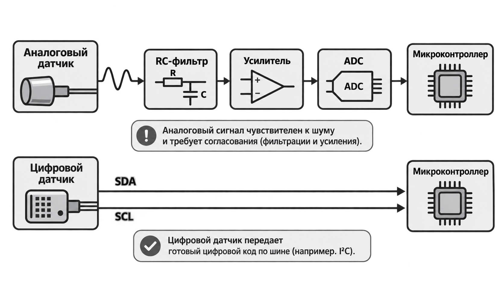

**Рисунок 22 — Структура аналогового измерительного тракта и цифрового интерфейса.**

### 7.2. Исполнительные устройства

Вывод микроконтроллера рассчитан на логический сигнал и обычно не может непосредственно питать двигатель, мощное реле, нагреватель или светодиодную ленту.

Для управления нагрузкой применяют:

- биполярный транзистор;
- MOSFET;
- драйвер реле;
- драйвер двигателя;
- оптопару или цифровой изолятор;
- твердотельное реле;
- специализированный силовой модуль.

Тип драйвера зависит от нагрузки. Для небольшого реле достаточно транзисторного ключа. 
Для двигателя постоянного тока с изменением направления нужен Н-мост или MOSFET (рисунок 23). 
Для шагового двигателя применяют драйвер, который управляет током обмоток. 
Для сетевой нагрузки требуются компоненты с соответствующим допустимым напряжением, изоляцией и безопасными расстояниями на плате.

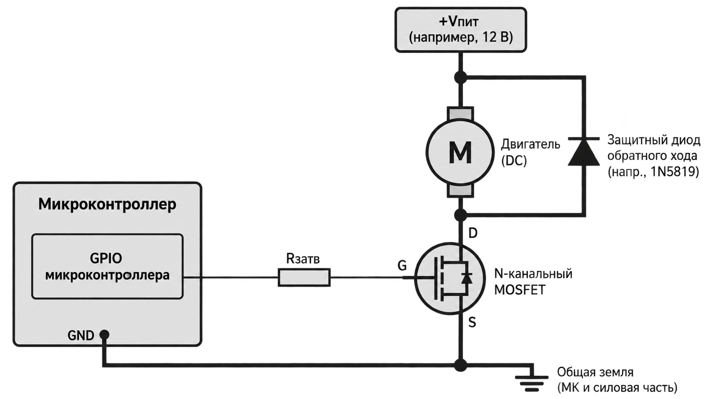

**Рисунок 23 — Управление двигателем с помощью MOSFET и защитного диода.** Микроконтроллер подаёт только управляющий сигнал, а ток нагрузки проходит через силовой элемент.

При выборе MOSFET недостаточно знать максимальный ток, напечатанный на первой странице документации. Нужно проверить сопротивление открытого канала при том напряжении затвора, которое реально выдаёт микроконтроллер. Транзистор, хорошо открывающийся при 10 В, может сильно нагреваться при управлении от 3,3 В.

Для катушки реле, электромагнита или двигателя необходим путь для тока самоиндукции. Обычно параллельно катушке устанавливают защитный диод или другую цепь подавления выбросов.

Защитный диод включают так, чтобы в нормальном режиме он был закрыт. После выключения транзистора ток катушки продолжает протекать через диод и постепенно уменьшается. Без такого пути напряжение на ключе может резко возрасти и повредить транзистор или вызвать сбой микроконтроллера.

---

## 8. Подсистема питания, тактирования и сброса

### 8.1. Источник питания

Для выбора источника питания для МПС сначала составляют таблицу напряжений и токов всех компонентов (таблица 6).

Таблица 6. таблица токов и напряжения компонент МПС
| Узел | Напряжение | Средний ток | Пиковый ток |
|---|---:|---:|---:|
| Микроконтроллер | 3,3 В | по документации | по документации |
| Датчики | 3,3 или 5 В | сумма токов | с учётом запуска |
| Дисплей | 3,3 или 5 В | зависит от подсветки | при включении |
| Радиомодуль | обычно 3,3 В | зависит от режима | особенно важен при передаче |
| Реле или двигатель | отдельное напряжение | по нагрузке | пусковой ток |

Минимальный требуемый ток источника можно предварительно оценить по формуле:

$$
I_{source}\ge K\cdot\sum I_{max},
$$

где $I_{max}$ — максимальные токи одновременно работающих узлов, а $K$ — коэффициент запаса. Для предварительной оценки часто принимают $K=1{,}2\ldots1{,}5$, но окончательное значение зависит от характера нагрузки.

Суммировать паспортные токи следует по реальным режимам одновременной работы (рисунок 24). 

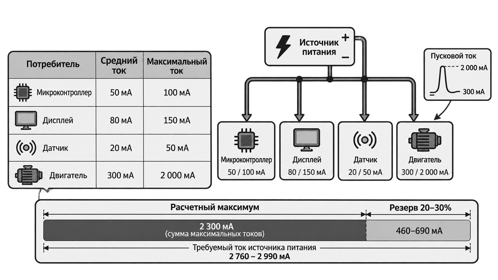
**Рисунок 24 — Расчёт источника питания по максимальным токам с запасом.**

Если двигатель и нагреватель принципиально не включаются вместе, можно учитывать это в алгоритме, но безопасность такого ограничения должна быть обеспечена. Для радиомодулей, двигателей, сервоприводов и реле обязательно учитывают кратковременные пики. Источник, который выдерживает средний ток, но просаживает напряжение во время пика, будет вызывать случайные сбросы контроллера.
Помимо тока выбирают допустимое входное напряжение, КПД, пульсации, тепловой режим и уровень помех. В аналоговых измерительных устройствах шум преобразователя может ухудшить результат АЦП, поэтому иногда применяют отдельный малошумящий стабилизатор для аналоговой части.

### 8.2. Линейный и импульсный стабилизатор

**LDO** прост, создаёт мало высокочастотных помех, но рассеивает лишнюю мощность в виде тепла.

Приблизительная мощность потерь линейного стабилизатора вычисляют по формуле: $$
P_{loss}=(U_{in}-U_{out})I_{load}.
$$
Если из 12 В получить 3,3 В при токе 0,2 А, то: $$
P_{loss}=(12-3{,}3)\cdot0{,}2=1{,}74\ \text{Вт}.
$$
Для небольшой микросхемы это значительное тепловыделение. В таком случае целесообразен импульсный DC/DC-преобразователь.

Линейный стабилизатор работает как управляемое сопротивление и превращает разность напряжений в тепло. Он удобен при небольшой разнице между входом и выходом и малом токе. Импульсный преобразователь периодически накапливает и передаёт энергию через дроссель, поэтому обычно имеет более высокий КПД при значительном понижении напряжения. Его недостатками являются более сложная схема, пульсации и требования к разводке печатной платы (рисунок 25).

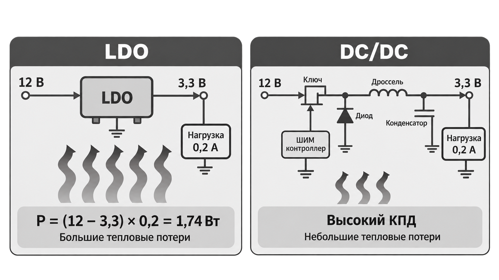

**Рисунок 25 — Сравнение линейного и импульсного стабилизаторов.**

Иногда применяют комбинированное решение: импульсный преобразователь выполняет основное понижение напряжения, а затем малошумящий LDO питает чувствительную аналоговую часть. Такое решение сочетает приемлемый КПД и низкий уровень помех.

### 8.3. Развязывающие конденсаторы

Около каждого вывода питания цифровой микросхемы размещают керамический развязывающий конденсатор, часто 0,1 мкФ. Точное значение и дополнительные конденсаторы выбирают по рекомендации производителя.
Важно не только наличие конденсатора на схеме, но и его расположение на печатной плате: проводники между конденсатором и выводами питания должны быть короткими (рисунок 26).

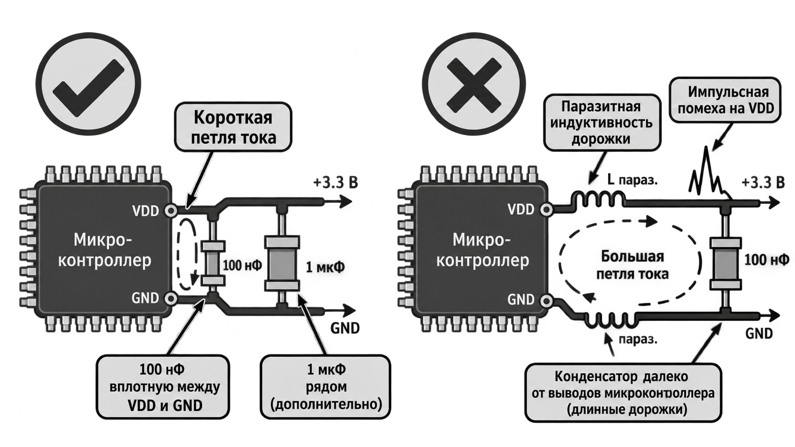

**Рисунок 26 — Правильное и неправильное размещение развязывающего конденсатора.**

Во время переключения внутренних транзисторов микроконтроллер кратковременно потребляет импульсный ток. Длинный проводник от общего источника имеет индуктивность и не может мгновенно предоставить этот ток без изменения напряжения. Развязывающий конденсатор, расположенный рядом с выводами питания, служит локальным запасом энергии. Поэтому конденсатор, находящийся на другом конце платы, не является полноценной заменой.
Кроме малых керамических конденсаторов около микросхем, на входе платы и около мощных нагрузок устанавливают конденсаторы большей ёмкости. Они компенсируют более медленные изменения тока. Номиналы и типы конденсаторов выбирают по документации на микросхемы питания и нагрузку.

### 8.4. Тактирование

Возможные источники тактового сигнала:

- внутренний RC-генератор;
- внешний кварцевый или керамический резонатор;
- внешний генератор;
- низкочастотный кварц часов реального времени.

Внутренний генератор уменьшает число компонентов. Внешний кварц выбирают, когда требуется повышенная точность частоты, определённая скорость интерфейса или точное измерение времени.

Внутренний RC-генератор удобен для большинства простых управляющих задач. Его частота может зависеть от температуры и напряжения, но для опроса кнопок и управления реле этого обычно достаточно. Кварцевый резонатор обеспечивает более стабильную частоту, но требует дополнительных компонентов и правильной разводки. Для часов реального времени часто используется отдельный кварц 32,768 кГц, позволяющий вести время при низком энергопотреблении.

Не следует автоматически устанавливать кварц «на всякий случай». Если внутренний генератор удовлетворяет требованиям, отсутствие внешнего резонатора уменьшает стоимость и освобождает выводы. Решение принимают после анализа требований к точности времени и интерфейсам.

### 8.5. Сброс и контроль питания

Система должна запускаться только при допустимом напряжении. Для этого используют:

- встроенный Power-on Reset;
- Brown-out Detector;
- внешний супервизор питания;
- кнопку сброса;
- сторожевой таймер.

Watchdog помогает восстановить работу после зависания программы, но не заменяет устранение причин сбоев.

Power-on Reset удерживает систему в состоянии сброса во время включения питания. Brown-out Detector выполняет аналогичную функцию при падении напряжения ниже безопасного уровня. Без контроля питания процессор может выполнять команды при напряжении, при котором память и периферия уже работают ненадёжно.

Сторожевой таймер необходимо обслуживать только после успешного завершения основных операций цикла. Если программа сбрасывает watchdog независимо от состояния системы, он не обнаружит зависание (рисунок 27). 
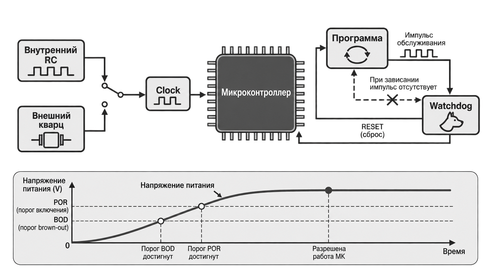

**Рисунок 27 — Связь тактирования, контроля питания и watchdog с микроконтроллером.**

После срабатывания watchdog полезно сохранить или вывести причину сброса, чтобы неисправность можно было диагностировать.

## 9. Электрическая совместимость

### 9.1. Напряжение питания и логические уровни

Компоненты на 5 В и 3,3 В нельзя соединять автоматически. 
Необходимо проверить:

- максимальное допустимое напряжение на входе;
- уровни логического нуля и единицы;
- наличие 5-вольтной устойчивости вывода;
- направление передачи сигнала;
- состояние выводов при включении и сбросе.

Если уровни несовместимы, применяют:

- резистивный делитель для простого однонаправленного сигнала;
- транзисторный преобразователь;
- специализированный преобразователь логических уровней;
- интерфейсный трансивер.

Резистивный делитель подходит только для однонаправленного сигнала и сравнительно невысокой скорости. Он уменьшает напряжение, но не способен повысить уровень 3,3 В до 5 В. Для двунаправленных линий, например I²C, используют специальные схемы с транзисторами или специализированные преобразователи. Для SPI и других быстрых интерфейсов важны задержка распространения и форма фронтов.
Способы согласования различных уровней логического сигнала приведены на рисунке 28.

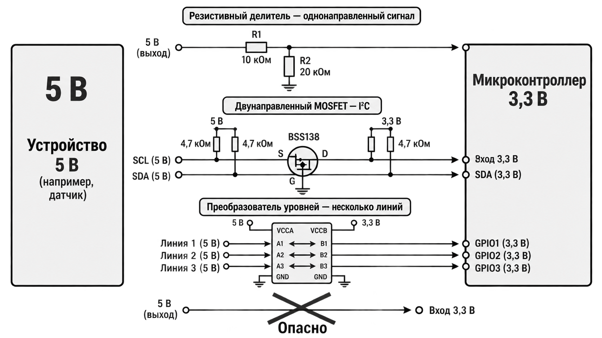

**Рисунок 28 — Способы согласования логических уровней 5 В и 3,3 В.**

Иногда вход 5-вольтового устройства распознаёт 3,3 В как логическую единицу, но это необходимо подтвердить по минимальному входному напряжению высокого уровня. Ориентироваться только на номинальное напряжение питания нельзя.

### 9.2. Нагрузочная способность GPIO и аналоговых входов

Проверяют:
- ток одного вывода;
- суммарный ток группы выводов;
- общий ток микроконтроллера;
- падение напряжения на выходе при заданном токе.

Даже если один вывод допускает требуемый ток, одновременное включение большого числа светодиодов может превысить суммарное ограничение микросхемы.
Ограничение тока GPIO связано не только с риском повреждения. При большом токе выходное напряжение отклоняется от идеальных 0 или напряжения питания, что может нарушить работу следующего цифрового входа. Для группы светодиодов применяют специализированный драйвер или транзисторные ключи, снимая нагрузку с микроконтроллера.
После сброса большинство GPIO становятся входами. Если нагрузка не должна случайно включаться в этот момент, устанавливают внешний резистор, задающий безопасный уровень на затворе или входе драйвера.

Для АЦП проверяют:
- диапазон входного напряжения;
- опорное напряжение;
- допустимое сопротивление источника;
- необходимую фильтрацию;
- защиту от перенапряжения;
- точность и шум.

Сигнал датчика при любых допустимых условиях не должен выходить за разрешённый диапазон входа.
Разрядность АЦП показывает число кодов, но реальная точность зависит от опорного напряжения, шума, разводки и параметров самого преобразователя. Для 10-разрядного АЦП при опоре 5 В шаг идеального преобразования приблизительно равен 4,88 мВ. Однако это не означает, что система гарантированно измеряет напряжение с такой точностью.
Если выходное сопротивление датчика слишком велико, внутренний конденсатор выборки АЦП может не успеть зарядиться. В таком случае увеличивают время выборки, устанавливают буферный усилитель или уменьшают сопротивление источника.

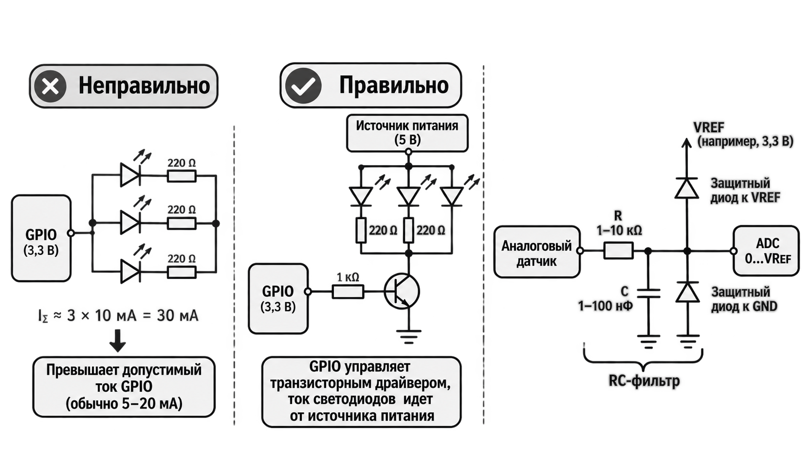

**Рисунок 29 — Ограничения GPIO и защита аналогового входа АЦП.**

---
## 10. Защита, надёжность и условия эксплуатации

### 10.1. Базовые защитные элементы

В зависимости от условий применяют:

- предохранитель или самовосстанавливающийся предохранитель;
- защиту от переполюсовки;
- TVS-диод от импульсных перенапряжений;
- ESD-защиту внешних разъёмов;
- фильтры питания;
- гальваническую развязку;
- терминаторы и защитное смещение линий связи;
- защитный диод для индуктивной нагрузки.

Защиту следует предусматривать на этапе схемы, а не после появления отказов.

Тип защиты определяется тем, откуда может прийти опасное воздействие. На входе питания возможны переполюсовка и выбросы напряжения. На внешнем разъёме — электростатический разряд. В линии датчика — наводки и ошибочная подача напряжения. У катушки реле — импульс самоиндукции. Один универсальный защитный элемент не решает все эти задачи, поэтому анализируют каждый внешний контакт системы.

Защитный элемент также необходимо правильно выбрать по энергии и скорости импульса. Слишком слабый TVS-диод может выйти из строя, а слишком ёмкая защита способна исказить высокоскоростной сигнал. Предохранитель защищает проводники и источник от длительного сверхтока, но не успевает подавить короткий импульс перенапряжения.

### 10.2. Надёжность системы

Надёжность повышают:

- запас по напряжению, току и мощности;
- работа компонентов внутри рекомендованных диапазонов;
- контроль перегрева;
- watchdog и brown-out detector;
- диагностика обрыва и короткого замыкания датчиков;
- безопасное состояние выходов при сбросе;
- журналирование критических ошибок;
- разъёмы с защитой от неправильного подключения.

Надёжность определяется не только качеством отдельных деталей. Даже хороший компонент может работать ненадёжно в системе с недостаточным охлаждением, плохой разводкой земли или ошибочным программным управлением. Поэтому аппаратные и программные меры рассматривают совместно. Аппаратная защита должна переводить выходы в безопасное состояние, а программа — обнаруживать неисправности и сообщать о них.

Для критических датчиков полезно предусмотреть диагностику обрыва и короткого замыкания. Например, аналоговый вход можно спроектировать так, чтобы оба повреждения давали значения вне нормального рабочего диапазона. Тогда программа отличит реальную величину от неисправности линии.

### 10.3. Электромагнитная совместимость

Источниками помех являются двигатели, реле, DC/DC-преобразователи, длинные кабели и радиопередатчики. Для снижения помех используют:

- короткие токовые контуры;
- сплошной полигон земли;
- развязывающие конденсаторы;
- RC- и LC-фильтры;
- дифференциальные линии;
- экранирование;
- раздельную разводку силовой и чувствительной аналоговой частей.

Помеха может распространяться по воздуху, по общему проводу питания или через землю. Поэтому фильтр на одном сигнальном входе не всегда решает проблему. Большие импульсные токи двигателя не должны проходить по тому же тонкому участку земли, который используется опорным напряжением АЦП. Быстрые цифровые линии не следует прокладывать рядом с высокоомными аналоговыми входами.

На макетной плате устройство может работать, а после подключения длинного кабеля начать давать сбои. Это связано с тем, что кабель превращается в антенну и добавляет ёмкость и индуктивность. Испытание системы должно выполняться с реальными кабелями и нагрузками, а не только с короткими перемычками на столе.

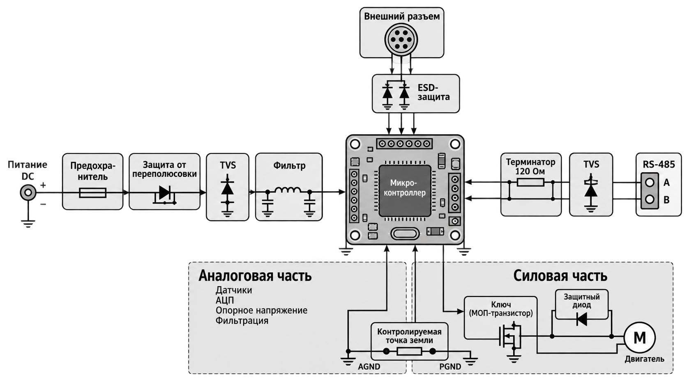

**Рисунок 30 — Комплексная защита питания, интерфейсов и силовой части МПС.**

---

## 11. Конструктивные и производственные ограничения

### 11.1. Корпус компонента

На учебном макете удобны DIP-корпуса и готовые модули. Для компактного серийного изделия применяют SMD-компоненты.

При выборе корпуса учитывают:

- доступность компонента в выбранном корпусе;
- возможность ручного или автоматического монтажа;
- шаг выводов;
- тепловые требования;
- доступность посадочного места в EasyEDA;
- возможность контроля пайки;
- размеры печатной платы.

Корпус влияет на всю технологию изготовления. DIP удобно устанавливать в панельку и паять вручную, но такие компоненты занимают много места. Корпуса TQFP доступны для ручного монтажа при определённом навыке и дают больше выводов. QFN и BGA компактны, однако требуют точной печатной платы и более сложного контроля пайки.

Посадочное место нельзя выбирать только по названию корпуса. Следует сравнить шаг выводов, размеры площадок, расположение тепловой площадки и нумерацию контактов с чертежом производителя. Ошибка в footprint может сделать правильно спроектированную электрическую схему физически непригодной.

### 11.2. Компонент, модуль или отладочная плата

Для первой версии учебного проекта разумно использовать отладочную плату или модуль. После проверки алгоритмов устройство можно переносить на собственную печатную плату.

При переносе нельзя просто скопировать только микроконтроллер. Нужно воспроизвести обязательные цепи питания, сброса, тактирования, загрузки и программирования. Полезно изучить принципиальную схему отладочной платы и рекомендации производителя. Часть её компонентов может относиться только к отладке, а часть обязательна для работы самого контроллера.

Модуль занимает промежуточное положение. Он позволяет создать собственную плату с разъёмами, питанием и исполнительными устройствами, не проектируя сложную часть с процессором или радиотрактом. Для небольших партий это часто экономически разумнее отдельной микросхемы.

Каждый из вариантов имеет свои достоинства и недостатки (таблица 7).

Таблица 7. Сравненительная характеристика вариантов создания МПС
| Вариант | Преимущества | Недостатки |
|---|---|---|
| Отдельная микросхема | минимальные размеры и стоимость серии | нужна полная обвязка и более сложная плата |
| Готовый модуль | часть обвязки уже реализована и проверена | больше размеры и стоимость |
| Отладочная плата | быстрое прототипирование | избыточность, большие размеры, не всегда удобно в изделии |

### 11.3. Доступность и замены

Перед окончательным выбором проверяют:

- доступность компонента у нескольких поставщиков;
- срок производства и статус жизненного цикла;
- наличие совместимых замен;
- срок поставки;
- минимальную партию;
- риск приобретения контрафактных компонентов.

Цена и наличие меняются, поэтому их проверяют непосредственно перед закупкой.

Для учебной работы достаточно указать доступные аналоги и критерии замены. В реальном проекте формируют перечень допустимых компонентов. Замена конденсатора или резистора обычно проще, чем замена микроконтроллера, но даже пассивные элементы различаются по допуску, напряжению, температурному коэффициенту и мощности.

При выборе основного микроконтроллера полезно оценивать не только наличие одной партии, но и перспективу семейства. Если несколько совместимых моделей отличаются объёмом памяти, разработчик сможет заменить компонент без полной переработки платы и программы (рисунок 31).

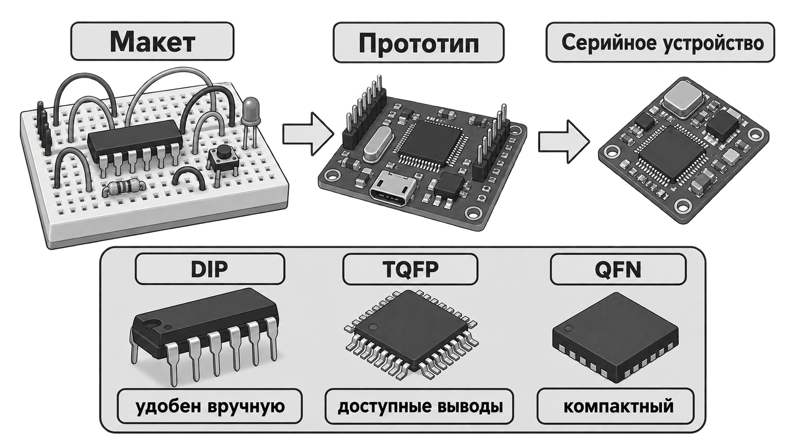

**Рисунок 31 — Переход от макета к собственной печатной плате.**

---

## 12. Пошаговый алгоритм выбора элементной базы

Подбор элементной базы для проектируемой МПС можно свести к следующим шагам (рисунок 32):

##### Шаг 1. Составить перечень функций
Необходимо перечислить измерения, вычисления, индикацию, управление и обмен данными.
Перечень функций формулируют действиями: «измерять», «сохранять», «передавать», «включать», «обнаруживать». Такая запись позволяет связать каждую функцию с аппаратным ресурсом. Например, «регулировать скорость вентилятора» приводит к требованию канала PWM и силового ключа, а «хранить журнал при отключении питания» — к энергонезависимой памяти.
##### Шаг 2. Составить таблицу входов и выходов
| Сигнал | Тип | Напряжение | Интерфейс | Частота/скорость |
|---|---|---:|---|---:|
| Датчик температуры | вход | 3,3 В | I²C | 100 кГц |
| Кнопка | вход | 3,3 В | GPIO | редко |
| Вентилятор | выход | 12 В | PWM через MOSFET | 25 кГц |
| Дисплей | выход | 3,3 В | I²C | 400 кГц |

Таблица должна охватывать не только основные датчики, но и сервисные сигналы: программирование, отладку, кнопку сброса, индикацию ошибок и управление питанием. После её заполнения становится понятно минимальное число выводов и аппаратных интерфейсов.
##### Шаг 3. Оценить вычислительные ресурсы
Определяют разрядность, производительность, Flash, SRAM и требования реального времени.
На этом этапе достаточно предварительной оценки. Если алгоритм неизвестен, создают небольшой программный прототип и измеряют размер кода и время выполнения. Особенно важно выявить операции, которые должны завершаться за строго ограниченное время.
##### Шаг 4. Выбрать интерфейсы и периферию
Проверяют количество UART, SPI, I²C, таймеров, каналов АЦП, ШИМ и других блоков.
Затем выполняют предварительное распределение выводов. Это позволяет убедиться, что все выбранные блоки доступны одновременно и не конфликтуют с линиями программирования, кварцем и загрузочными выводами.
##### Шаг 5. Выбрать семейство и конкретную модель MCU
Сначала выбирают подходящее семейство, затем конкретную модель, объём памяти и корпус.
Выбор семейства определяет среду разработки, программатор, библиотеки и возможности дальнейшего расширения. Конкретную модель выбирают только после проверки документации на требуемый корпус, поскольку варианты одного семейства могут заметно отличаться периферией.
##### Шаг 6. Выбрать датчики, драйверы и память
Проверяют диапазоны, точность, скорость, уровни сигналов и необходимость согласования.
Одновременно следует найти типовые схемы включения из документации. Они показывают обязательные резисторы, конденсаторы и ограничения, которые могут отсутствовать в кратком описании компонента.
##### Шаг 7. Рассчитать питание
Составляют баланс токов, учитывают пусковые и пиковые значения, выбирают преобразователи и конденсаторы.
Расчёт завершают проверкой мощности потерь и температуры. Если стабилизатор или транзистор рассеивает значительную мощность, оценивают тепловое сопротивление корпуса и необходимость медной площадки или радиатора.
##### Шаг 8. Добавить защиту и системные цепи
Включают сброс, программирование, отладку, watchdog, защиту питания и внешних линий.
На этом шаге проект превращается из лабораторного макета в систему, способную переживать реальные ошибки подключения и помехи. Необходимо отдельно рассмотреть каждый разъём и каждую нагрузку.
##### Шаг 9. Проверить конструктивную реализуемость
Проверяют корпуса, посадочные места, размеры платы, монтаж и доступность компонентов.
Дополнительно оценивают доступ к разъёмам, возможность замены предохранителя, размещение антенны и датчиков, а также расстояние между силовыми и сигнальными цепями.
##### Шаг 10. Провести финальную проверку
Финальная проверка выполняется не один раз в конце, а повторяется после каждого существенного изменения. Если выбранный дисплей требует больше памяти или новая нагрузка увеличивает ток, необходимо вернуться к предыдущим шагам. Поэтому процесс выбора является итерационным.

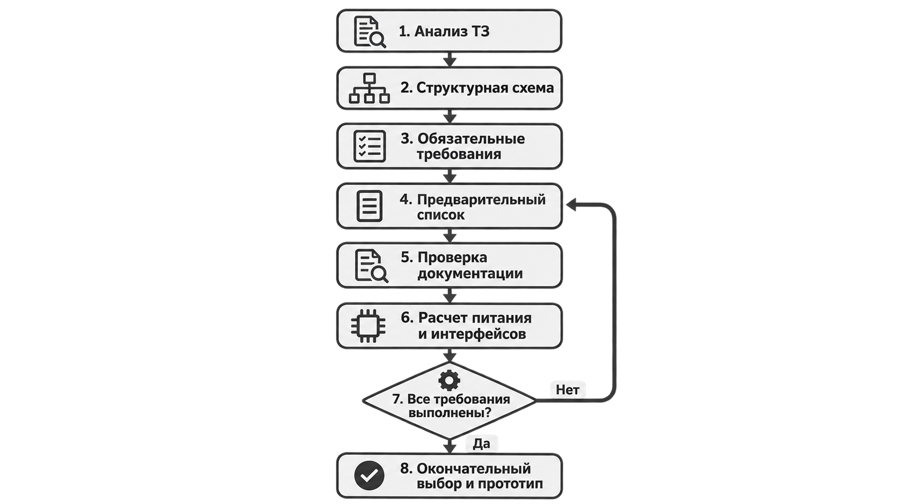

**Рисунок 32 — Итерационный алгоритм выбора элементной базы.**

Если обнаружена несовместимость или нехватка ресурсов, необходимо вернуться к выбору компонентов.

---
## 13. Пример выбора элементной базы

### 13.1. Постановка задачи

Необходимо разработать учебную МПС контроля температуры шкафа оборудования. Система должна:

- измерять температуру от 0 до 70 °C;
- показывать значение на небольшом дисплее;
- включать вентилятор при превышении порога;
- изменять скорость вентилятора с помощью ШИМ;
- принимать порог с кнопок;
- передавать результаты на компьютер по последовательному интерфейсу;
- питаться от источника 12 В;
- сохранять установленный порог после выключения питания.

Эта задача специально выбрана так, чтобы в ней присутствовали основные элементы реальной МПС: измерение, обработка данных, пользовательский интерфейс, исполнительный механизм, связь и энергонезависимое хранение настроек. При этом вычислительная часть остаётся достаточно простой и позволяет сосредоточиться на выборе аппаратуры.

Температура изменяется сравнительно медленно, поэтому высокая частота обработки не требуется. Гораздо важнее надёжно определить перегрев, не допустить частого переключения вентилятора около порога и сохранить работоспособность при помехах от двигателя. Уже из этого описания видно, что максимальная тактовая частота микроконтроллера не является главным критерием.

### 13.2. Определение входов и выходов

| Элемент | Требование к контроллеру |
|---|---|
| Цифровой датчик температуры | I²C |
| Дисплей | I²C |
| Две кнопки | 2 GPIO |
| Управление вентилятором | 1 канал PWM |
| Передача на компьютер | UART |
| Сохранение порога | EEPROM, Flash или внешняя память |

Оба I²C-устройства могут использовать одну шину, если их адреса различаются.

Использование общей шины сокращает число выводов, но требует проверки адресов и подтягивающих резисторов. Если модуль дисплея уже содержит подтяжки, а датчик имеет собственные, их параллельное сопротивление может оказаться слишком малым. Поэтому схему модулей необходимо изучить, а не считать их полностью независимыми готовыми блоками.

Вентилятор нельзя подключать непосредственно к выводу контроллера. Даже небольшой вентилятор потребляет ток, значительно превышающий возможности GPIO, а двигатель создаёт электрические помехи. Следовательно, в перечне элементов обязательно появляется MOSFET, защитная цепь и конденсаторы около нагрузки.

### 13.3. Выбор микроконтроллера

Для этой задачи не требуются сложные вычисления и беспроводная связь. Подойдут ATmega328P и многие представители STM32G0. ESP32-C3 также сможет выполнить задачу, но встроенная радиосвязь останется неиспользованной.

Для учебного прототипа можно выбрать ATmega328P или плату Arduino Nano, потому что:

- вычислительной производительности достаточно;
- имеются I²C, UART и таймеры PWM;
- имеется энергонезависимая EEPROM;
- среда разработки знакома студентам;
- устройство легко собрать на макетной плате.

Если планируется дальнейшее расширение, несколько каналов АЦП, более сложная диагностика и современная отладка, можно выбрать STM32G0.

Выбор ATmega328P в данном примере объясняется не тем, что этот контроллер лучше современных 32-разрядных моделей, а соответствием масштабу учебной задачи. Его ресурсов достаточно, а программная и аппаратная часть хорошо понятны. Если добавить сетевую связь, сложное меню, несколько вентиляторов и журнал событий, запас ресурсов может стать недостаточным, и решение следует пересмотреть.

ESP32-C3 имел бы смысл, если данные нужно отправлять по Wi-Fi или настраивать устройство по Bluetooth. Использовать его только ради высокой частоты в данной задаче не обязательно. Таким образом, функциональное требование должно объяснять каждую существенную возможность выбранного компонента.

### 13.4. Выбор остальных компонентов

| Узел | Возможное решение | Обоснование |
|---|---|---|
| Датчик | цифровой датчик I²C | не требует внешнего АЦП |
| Дисплей | OLED или LCD с I²C-модулем | использует только две сигнальные линии |
| Ключ вентилятора | логический N-канальный MOSFET | управляет током, недоступным GPIO |
| Защита нагрузки | диод или TVS по типу вентилятора | подавление выбросов |
| Питание логики | DC/DC 12→5 В или 12→3,3 В | меньше потери, чем у линейного стабилизатора |
| Связь с ПК | USB–UART | преобразование USB в UART |
| Кнопки | кнопки с подтяжкой | устойчивый логический уровень |
| Развязка питания | 0,1 мкФ у каждой микросхемы и ёмкость на входе питания | подавление импульсных помех |

DC/DC-преобразователь выбран потому, что разница между входными 12 В и напряжением логики велика. Линейный стабилизатор при заметном токе будет нагреваться. Вентилятор питается непосредственно от 12 В, а микроконтроллер, датчик и дисплей — от стабилизированной линии. Земля силовой и логической частей остаётся общей, но ток вентилятора не должен проходить через чувствительный участок земли датчика.

Для регулирования температуры одного порога недостаточно. Если включать вентилятор точно при 40 °C и выключать при малейшем снижении, он может часто переключаться около границы. Поэтому в программе используют гистерезис: например, включение при 40 °C и выключение при 37 °C. Это программное решение влияет на требования к системе, но не требует более мощного микроконтроллера.

### 13.5. Структурная схема выбранного решения

Схему предполагаемого микропроцессорного устройства контроля температуры можно представить в следующем виде (рисунок 33).

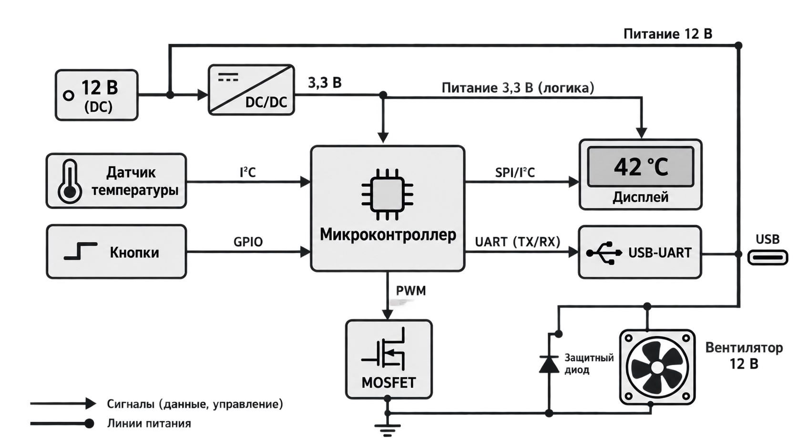

**Рисунок 33 — Структура МПС контроля температуры.** 

Логическая часть питается через преобразователь, а вентилятор получает энергию непосредственно от линии 12 В и управляется ключом.

### 13.6. Что необходимо проверить перед созданием схемы

1. Совпадают ли напряжения логики датчика, дисплея и MCU?
2. Не совпадают ли адреса устройств I²C?
3. Нужны ли внешние подтягивающие резисторы SDA и SCL?
4. Допускает ли MOSFET полное открывание от выбранного уровня GPIO?
5. Достаточен ли ток DC/DC-преобразователя?
6. Как поведутся выходы при сбросе MCU?
7. Предусмотрены ли разъёмы программирования и отладки?
8. Есть ли общая земля между управляющей и силовой частью?
9. Установлена ли защита внешних линий и индуктивной нагрузки?

Такое обоснование показывает, что компоненты выбраны не случайно, а на основании требований.

После ответов на эти вопросы можно переходить к принципиальной схеме. На ней должны появиться конкретные выводы микроконтроллера, номиналы подтягивающих резисторов, тип MOSFET, защитная цепь, модель преобразователя питания и разъёмы. Затем схема проверяется средствами ERC в EasyEDA, но автоматическая проверка не заменяет анализа допустимых токов и напряжений.

---
## 14. Матрица выбора компонентов

Если имеется несколько подходящих вариантов, удобно использовать балльную оценку.

| Критерий | Вес | Вариант A | Вариант B | Вариант C |
|---|---:|---:|---:|---:|
| Соответствие функциям | 5 | 5 | 5 | 5 |
| Запас памяти | 3 | 2 | 4 | 5 |
| Энергопотребление | 4 | 4 | 4 | 2 |
| Простота разработки | 3 | 5 | 3 | 3 |
| Стоимость системы | 4 | 4 | 4 | 3 |
| Доступность | 5 | 4 | 4 | 4 |

Итоговую оценку рассчитывают как взвешенную сумму:

$$
S=\sum_{i=1}^{n}w_iq_i,
$$

где $w_i$ — вес критерия, $q_i$ — оценка варианта по этому критерию.

Балльная матрица помогает сравнить варианты, но не отменяет обязательные ограничения. Компонент с высоким итоговым баллом всё равно нельзя выбрать, если он не поддерживает требуемый интерфейс или температурный диапазон.

Вес критерия отражает его важность именно для конкретного проекта. Для автономного датчика высокий вес получает энергопотребление, для учебного стенда — простота освоения и доступность выводов, для промышленного контроллера — температурный диапазон, надёжность и длительный жизненный цикл. Одинаковая таблица с одинаковыми весами не может использоваться для всех устройств.

Оценки должны сопровождаться пояснением и ссылкой на документацию. Число «5» без обоснования малоинформативно. Корректная запись выглядит так: «оценка 5 за интерфейсы, поскольку микроконтроллер имеет два UART, SPI и два I²C, что покрывает требования проекта с резервом».

---

## 15. Типичные ошибки

1. Выбор микроконтроллера только по тактовой частоте.
2. Подсчёт общего количества GPIO без учёта альтернативных функций.
3. Подключение нагрузки непосредственно к выводу MCU.
4. Соединение логики 5 В и 3,3 В без проверки уровней.
5. Отсутствие развязывающих конденсаторов.
6. Использование абсолютных максимальных параметров как рабочих.
7. Игнорирование пускового и импульсного тока нагрузки.
8. Выбор I²C или SPI для длинной линии без оценки помех.
9. Отсутствие цепей программирования, сброса и диагностики.
10. Запись во Flash или EEPROM в каждом цикле программы.
11. Использование посадочного места без проверки размеров по документации.
12. Выбор компонента только по низкой цене без оценки доступности и жизненного цикла.
13. Отсутствие безопасного состояния исполнительных устройств при сбросе.
14. Недостаточный запас Flash, SRAM или мощности источника.

Большинство этих ошибок связано с преждевременным выбором знакомой платы. Разработчик видит, что на макете загорелся светодиод или датчик выдал значение, и считает аппаратную часть завершённой. Однако работоспособность одного режима ещё не подтверждает корректность системы при максимальном токе, минимальном напряжении, запуске двигателя, отключении датчика или сбое программы.

Хорошая инженерная практика заключается в проверке неблагоприятных сценариев. Нужно намеренно отключить датчик, создать предельную нагрузку, перезапустить питание, проверить поведение при зависании и убедиться, что исполнительные устройства переходят в безопасное состояние.

---

## 16. Итоговый чек-лист разработчика

Перед утверждением элементной базы необходимо проверить следующее (рисунок 34):

- [ ] все обязательные функции технического задания реализуемы;
- [ ] хватает Flash, SRAM и энергонезависимой памяти;
- [ ] хватает доступных GPIO;
- [ ] имеется необходимое число интерфейсов и таймеров;
- [ ] напряжения питания совместимы;
- [ ] логические уровни совместимы;
- [ ] токи GPIO не превышены;
- [ ] мощные нагрузки управляются через драйверы;
- [ ] рассчитан максимальный и пиковый ток питания;
- [ ] предусмотрены развязывающие конденсаторы;
- [ ] предусмотрены тактирование, сброс и watchdog;
- [ ] добавлена защита питания и внешних линий;
- [ ] температурный диапазон соответствует условиям;
- [ ] корпуса и посадочные места проверены;
- [ ] предусмотрены программирование и отладка;
- [ ] компоненты доступны для закупки;
- [ ] предусмотрен запас ресурсов для развития проекта.

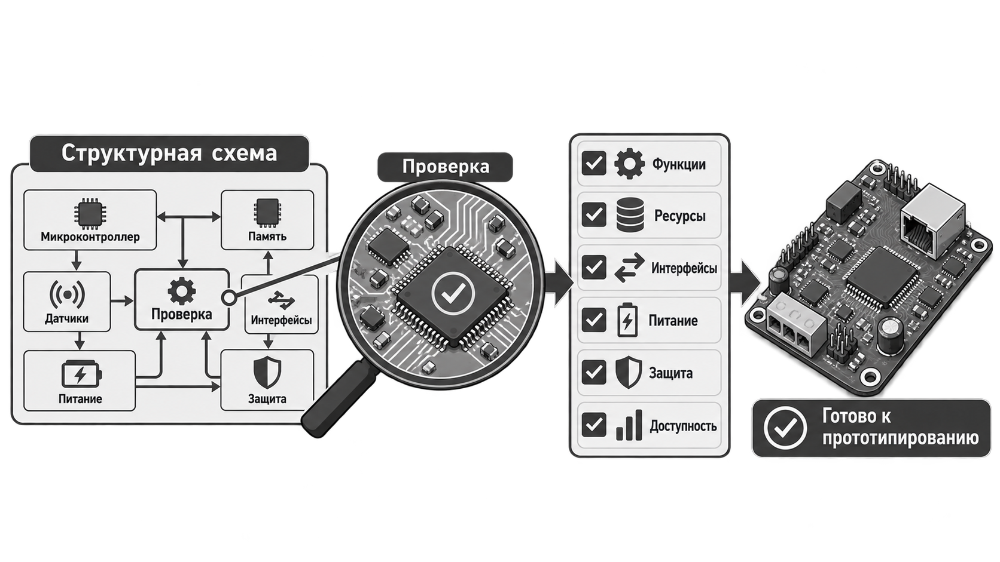

**Рисунок 34 — Итоговая проверка согласованности выбранных компонентов.**

---

## 17. Основные выводы

1. Выбор элементной базы начинается с анализа технического задания.
2. Компоненты рассматриваются как взаимосвязанная система.
3. Микроконтроллер выбирают по памяти, периферии, выводам, питанию и условиям эксплуатации, а не только по частоте.
4. Необходимо проверять электрическую совместимость всех сигналов.
5. Подсистема питания, защита и развязка так же важны, как программируемая часть.
6. Исполнительные устройства подключают через соответствующие драйверы.
7. Выбранное решение должно быть реализуемым, доступным и пригодным для диагностики.
8. Окончательное решение подтверждается документацией на конкретные компоненты.

---

## 18. Контрольные вопросы

1. Что входит в элементную базу микропроцессорной системы?
2. Почему выбор компонентов начинается с технического задания?
3. Чем микроконтроллер отличается от микропроцессора и модуля?
4. Какие параметры MCU необходимо проверить перед выбором?
5. Почему нельзя оценивать микроконтроллер только по частоте?
6. Как определить необходимое количество GPIO?
7. Чем отличаются SRAM, Flash, EEPROM и FRAM?
8. В каких случаях следует использовать внешний драйвер нагрузки?
9. Почему UART нельзя непосредственно считать интерфейсом RS-485?
10. Когда SPI предпочтительнее I²C?
11. Для чего нужны развязывающие конденсаторы?
12. Чем LDO отличается от импульсного DC/DC-преобразователя?
13. Как проверить совместимость устройств на 3,3 и 5 В?
14. Почему необходимо учитывать пиковый ток?
15. Какие ошибки возможны при выборе корпуса и посадочного места?
16. Зачем предусматривают запас памяти и производительности?
17. Почему одинаковая метка интерфейса не гарантирует совместимость устройств?
18. Какие элементы повышают надёжность МПС?

---

## 19. Источники и материалы для дополнительного изучения

1. [Microchip ATmega328P — страница продукта и документация](https://www.microchip.com/en-us/product/ATMEGA328P).
2. [STMicroelectronics STM32G0 — документация семейства](https://www.st.com/en/microcontrollers-microprocessors/stm32g0-series/documentation.html).
3. [Espressif ESP32-C3 — техническое описание](https://documentation.espressif.com/esp32-c3_datasheet_en.html).
4. [Espressif ESP32-C3 — официальный PDF Datasheet](https://documentation.espressif.com/ESP32-C3_Datasheet_en.pdf).
5. [Texas Instruments — материалы по преобразованию логических уровней](https://www.ti.com/product/SN74LV1T00).

При работе с компонентами необходимо использовать актуальную редакцию документации на конкретную модель, корпус и ревизию микросхемы.
