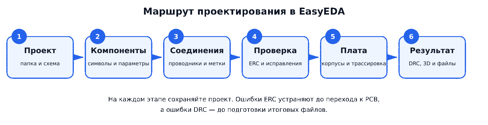
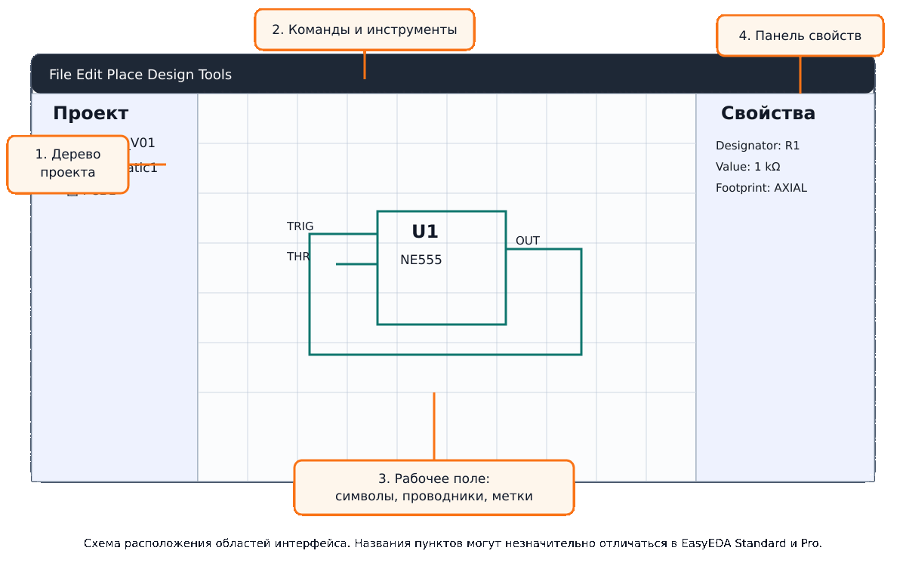
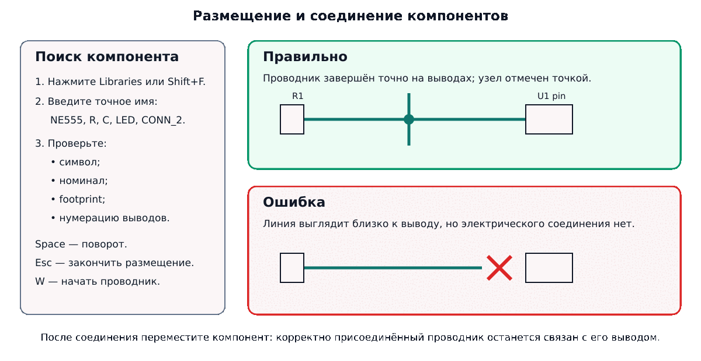
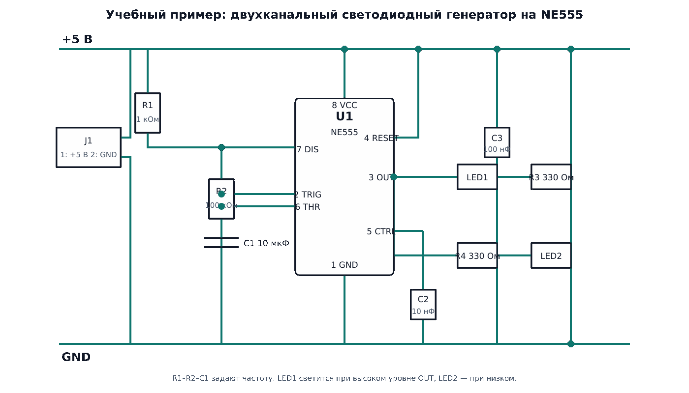
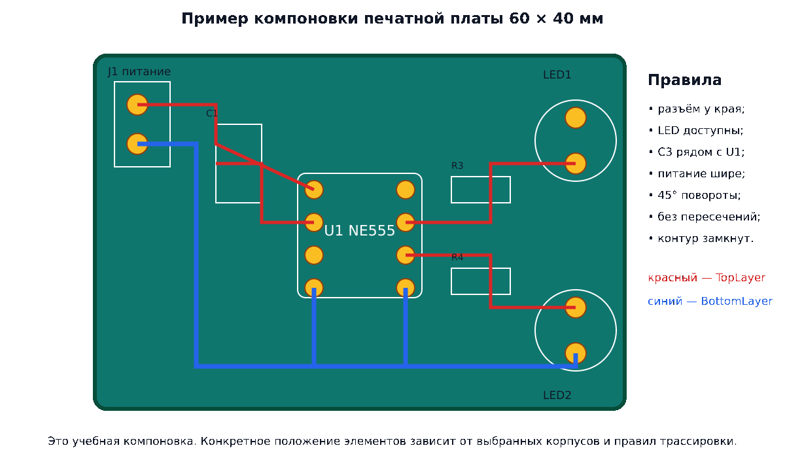

# Практическая работа № 10

## Основы работы в EasyEDA и проектирование несложного электронного устройства

**МДК.02.01:** Микропроцессорные системы  
**Специальность:** 09.02.01 «Компьютерные системы и комплексы»  
**Курс:** 4  
**Семестр:** 7  
**Продолжительность:** 6 академических часов

## Цель работы

Освоить полный базовый маршрут проектирования электронного устройства в EasyEDA: создать проект, разработать электрическую принципиальную схему, назначить компонентам посадочные места, выполнить проверку соединений, сформировать печатную плату, разместить компоненты, проложить проводники и проверить плату средствами DRC.

## Планируемые результаты

После выполнения работы студент должен уметь:

- создавать и структурировать проект EasyEDA;
- находить электронные компоненты в библиотеке;
- размещать, поворачивать и настраивать компоненты;
- выполнять электрические соединения и использовать метки цепей;
- присваивать элементам позиционные обозначения и номиналы;
- выбирать и проверять посадочные места компонентов;
- находить незавершённые цепи и другие ошибки схемы;
- преобразовывать принципиальную схему в проект печатной платы;
- задавать контур платы, размещать компоненты и вручную трассировать цепи;
- выполнять DRC и анализировать трёхмерный вид платы;
- экспортировать результаты и оформлять отчёт.

## Оборудование и программное обеспечение

- персональный компьютер с доступом в интернет;
- современный браузер;
- EasyEDA Standard в браузере или установленная версия EasyEDA;
- программа для просмотра PDF;
- текстовый редактор для оформления отчёта.

Работа ориентирована на **EasyEDA Standard**. В EasyEDA Pro расположение отдельных команд может отличаться, но последовательность действий остаётся той же.

## Краткие теоретические сведения

Проектирование начинается не с печатной платы, а с электрической принципиальной схемы. На схеме определяются компоненты, их параметры и электрические связи. Затем каждому реальному компоненту назначается посадочное место — графическое описание выводов и габаритов детали на печатной плате.

После проверки схемы создаётся PCB-документ. В нём задаются контур платы, расположение компонентов и проводящие дорожки. Проверка DRC выявляет нарушения технологических правил: слишком маленькие зазоры, пересечения, незавершённые соединения и выход объектов за допустимые границы.

Полный маршрут выполнения работы показан на рисунке 1.



*Рисунок 1 — основные этапы проектирования устройства в EasyEDA.*

## Правила выполнения работы

1. Номер варианта назначает преподаватель.
2. Проект создаётся самостоятельно и должен содержать принципиальную схему и печатную плату.
3. Компоненты должны иметь позиционные обозначения, номиналы и подходящие посадочные места.
4. Питание и общая цепь обозначаются явно. Не допускаются «висящие» обязательные выводы.
5. Печатная плата выполняется преимущественно вручную. Автотрассировщик может использоваться только с разрешения преподавателя, а результат необходимо проверить и исправить.
6. Работа считается завершённой после устранения критических ошибок проверки схемы и DRC.
7. В отчёт включаются снимки экрана, сделанные студентом на основных этапах работы.

## Организация файлов

Создайте рабочую папку с именем:

```text
PR10_Фамилия_Группа_Вариант
```

Рекомендуемая структура сдаваемого комплекта:

```text
PR10_Фамилия_Группа_Вариант/
├── project/                 исходный проект EasyEDA
├── export/                  PDF, BOM и другие экспортированные файлы
├── screenshots/             снимки схемы, PCB, DRC и 3D
└── report.pdf               отчёт студента
```

## Пример выполнения работы

В качестве учебного примера разработаем **двухканальный светодиодный генератор на таймере NE555**. При высоком уровне на выходе светится первый светодиод, при низком — второй.

### Шаг 1. Открытие EasyEDA и создание проекта

1. Откройте [редактор EasyEDA](https://easyeda.com/editor) и войдите в учётную запись.
2. Выберите команду **File → New → Project** или аналогичную команду создания проекта.
3. Введите имя проекта `PR10_NE555_Blinker`.
4. Внутри проекта создайте документ **Schematic** с именем `Generator_NE555`.
5. Сохраните проект.

Основные области редактора показаны на рисунке 2. Слева находится дерево проекта, в центре — рабочее поле, справа — свойства выделенного объекта. Названия и расположение панелей могут незначительно изменяться при обновлении EasyEDA.



*Рисунок 2 — основные области интерфейса редактора схем.*

### Шаг 2. Размещение компонентов

Откройте библиотеку компонентов кнопкой **Libraries** или сочетанием `Shift+F`. Последовательно найдите и разместите элементы из таблицы 1.

**Таблица 1 — компоненты учебного устройства**

| Обозначение | Компонент | Номинал или тип | Рекомендуемое посадочное место |
|---|---|---|---|
| U1 | Таймер | NE555, DIP-8 | DIP-8, шаг 2,54 мм |
| R1 | Резистор | 1 кОм | Axial 0.3 или подходящий THT |
| R2 | Резистор | 100 кОм | Axial 0.3 или подходящий THT |
| R3, R4 | Резистор | 330 Ом | Axial 0.3 или подходящий THT |
| C1 | Электролитический конденсатор | 10 мкФ, не менее 10 В | Radial THT |
| C2 | Конденсатор | 10 нФ | Radial или дисковый THT |
| C3 | Блокировочный конденсатор | 100 нФ | Radial или дисковый THT |
| LED1, LED2 | Светодиод | 3 или 5 мм | LED THT |
| J1 | Двухконтактный разъём питания | +5 В, GND | Terminal Block 2P, шаг 5,08 мм |

При выборе библиотечного элемента проверьте не только название символа, но и нумерацию выводов. У разных вариантов одной микросхемы могут отличаться корпус и назначение выводов.

После размещения:

1. выделите компонент;
2. в панели свойств задайте `Designator`, `Value` и `Footprint`;
3. расположите надписи так, чтобы они не пересекали символы и проводники;
4. используйте клавишу `Space` для поворота;
5. нажмите `Esc`, чтобы завершить размещение.

### Шаг 3. Соединение компонентов

Проводник должен начинаться и заканчиваться точно в точке вывода. Визуально близко расположенные линии могут оставаться электрически несоединёнными. Правильное и ошибочное соединения показаны на рисунке 3.



*Рисунок 3 — поиск компонентов и контроль электрического соединения.*

Выполните соединения в следующем порядке:

1. Создайте цепи `+5V` и `GND` и подключите к ним разъём J1.
2. Соедините вывод 8 `VCC` и вывод 4 `RESET` микросхемы U1 с `+5V`.
3. Соедините вывод 1 `GND` с общей цепью.
4. Подключите R1 между `+5V` и выводом 7 `DISCHARGE`.
5. Подключите R2 между выводом 7 и общим узлом выводов 2 `TRIGGER` и 6 `THRESHOLD`.
6. Подключите C1 между общим узлом выводов 2 и 6 и цепью `GND`. Соблюдайте полярность электролитического конденсатора.
7. Подключите C2 между выводом 5 `CONTROL` и `GND`.
8. Подключите C3 между `+5V` и `GND` рядом с выводами питания U1.
9. Подключите цепь LED1 и R3 между выводом 3 `OUT` и `GND`.
10. Подключите цепь R4 и LED2 между `+5V` и выводом 3 `OUT`, развернув LED2 так, чтобы он открывался при низком уровне на выходе.

Итоговая структура принципиальной схемы показана на рисунке 4. При выполнении проекта используйте стандартные условные графические обозначения библиотеки EasyEDA.



*Рисунок 4 — принципиальная схема учебного двухканального генератора.*

Частоту генерации можно оценить по сопротивлениям R1, R2 и ёмкости C1. После упоминания этих параметров формула расчёта имеет вид:

$$
f \approx \frac{1{,}44}{(R_1+2R_2)C_1}.
$$

Для R1 = 1 кОм, R2 = 100 кОм и C1 = 10 мкФ расчётная частота составляет приблизительно 0,72 Гц. Реальная частота зависит от допусков компонентов.

### Шаг 4. Проверка принципиальной схемы

1. Сохраните документ.
2. Откройте **Design Manager** и просмотрите список компонентов и цепей.
3. Выполните электрическую проверку схемы — ERC или проверку, запускаемую при преобразовании в PCB, в зависимости от версии редактора.
4. Исправьте дублирующиеся обозначения, отсутствующие посадочные места и незавершённые соединения.
5. Проверьте, что каждый компонент из таблицы 1 присутствует на схеме.
6. Переместите по одному компоненту в каждой части схемы и убедитесь, что его проводники остаются соединёнными с выводами.

Некоторые предупреждения о выводах питания могут быть допустимы, если питание подано через разъём и обозначено метками. Такое предупреждение нельзя просто игнорировать: в отчёте нужно объяснить его причину и показать, что цепь действительно подключена.

### Шаг 5. Преобразование схемы в печатную плату

1. Запустите команду **Convert to PCB** из редактора схемы.
2. Если EasyEDA сообщает об отсутствии посадочного места, вернитесь к схеме и назначьте подходящий `Footprint`.
3. Создайте новый PCB-документ `Generator_NE555_PCB`.
4. Задайте единицы измерения в миллиметрах.
5. На слое `BoardOutline` создайте замкнутый прямоугольный контур размером **60 × 40 мм**.

### Шаг 6. Размещение компонентов на плате

Размещайте компоненты не случайно, а с учётом назначения:

- J1 поместите у края платы;
- LED1 и LED2 разместите так, чтобы они были видны после монтажа;
- U1 установите в центральной части платы;
- C3 расположите как можно ближе к выводам питания U1;
- R1, R2 и C1 расположите рядом с выводами 7, 2 и 6;
- оставьте расстояние между корпусами для пайки;
- обозначения на слое шелкографии не должны перекрывать контактные площадки.

Пример рационального размещения и трассировки показан на рисунке 5.



*Рисунок 5 — учебный пример компоновки платы размером 60 × 40 мм.*

### Шаг 7. Трассировка

1. Начните с цепей питания и `GND`.
2. Для сигнальных цепей задайте ширину дорожки не менее 0,25 мм.
3. Для питания и общей цепи используйте ширину 0,5–0,8 мм.
4. Прокладывайте дорожки под углом 45°.
5. Не проводите дорожки вплотную к контуру платы.
6. При переходе между слоями используйте переходное отверстие `Via`.
7. Не оставляйте линии `Ratline`: каждая цепь должна быть протрассирована.

Учебную плату допускается выполнить на одном слое, если это не приводит к перемычкам и чрезмерно длинным дорожкам. При двухслойной трассировке в отчёте укажите, какие цвета соответствуют слоям `TopLayer` и `BottomLayer`.

### Шаг 8. Проверка DRC и просмотр 3D

1. Откройте правила проектирования и задайте минимальный зазор не менее 0,20 мм, если преподаватель не указал другое значение.
2. Запустите **Design Rule Check**.
3. Последовательно выберите каждую ошибку и найдите соответствующее место на плате.
4. Исправьте незавершённые цепи, нарушения зазоров и выход объектов за контур.
5. Повторяйте DRC до отсутствия критических ошибок.
6. Откройте **3D View** и проверьте ориентацию компонентов, положение разъёма и светодиодов.

### Шаг 9. Экспорт и сохранение

Сохраните проект на сервере EasyEDA и выгрузите локальную копию командой **Download Project** или экспортом исходного файла EasyEDA. Дополнительно подготовьте:

- PDF принципиальной схемы;
- изображение или PDF печатной платы;
- BOM — перечень компонентов;
- снимок результата DRC;
- снимок трёхмерного вида платы.

Gerber-файлы в данной вводной работе формируются только по указанию преподавателя. Их создание не означает, что плата автоматически пригодна для изготовления: перед производством требуется отдельная инженерная проверка.

## Индивидуальное задание

По назначенному варианту необходимо:

1. создать проект EasyEDA;
2. разработать электрическую принципиальную схему;
3. назначить позиционные обозначения, номиналы и посадочные места;
4. проверить схему и устранить критические ошибки;
5. создать плату заданного размера;
6. разместить компоненты и вручную выполнить трассировку;
7. выполнить DRC и просмотреть плату в 3D;
8. подготовить комплект проекта и отчёт.

Если в варианте не указано иное, используйте питание **5 В**, сквозные компоненты THT и плату размером не более **70 × 50 мм**. Номиналы вспомогательных резисторов и конденсаторов выбираются по справочным схемам и обосновываются в отчёте.

## Варианты заданий

| № | Проектируемое устройство | Обязательные узлы и компоненты | Требования к результату |
|---:|---|---|---|
| 1 | Двухканальный светодиодный генератор | NE555, 2 LED, 4 резистора, 3 конденсатора, J1 | Частота около 1 Гц; светодиоды включаются попеременно |
| 2 | Светодиодный маяк | NE555, 1 LED, регулировочный резистор, RC-цепь | Частота около 2 Гц; на плате предусмотреть контрольную точку OUT |
| 3 | Регулируемый генератор импульсов | NE555, потенциометр 100 кОм, LED, разъём OUT | Диапазон приблизительно 0,5–5 Гц; удобный доступ к потенциометру |
| 4 | Таймер задержанного включения | NE555 в одновибраторном режиме, кнопка, LED | После нажатия LED включается приблизительно на 5 с |
| 5 | Формирователь одиночного импульса | NE555, кнопка, LED, разъём OUT | Длительность импульса около 0,1 с; предусмотреть подавление дребезга |
| 6 | Генератор звукового сигнала | NE555, пассивный пьезоизлучатель, транзисторный ключ | Частота около 1 кГц; излучатель размещён у края платы |
| 7 | Регулятор яркости светодиода | NE555 в режиме PWM, потенциометр, LED | Изменение коэффициента заполнения; контрольная точка PWM |
| 8 | Четырёхразрядный двоичный счётчик | NE555, 74HC93 или аналог, 4 LED | На LED отображаются младшие 4 разряда счётчика |
| 9 | Восьмиканальный бегущий огонь | NE555, CD4017, 8 LED | Последовательное включение 8 LED; сброс счётчика после восьмого состояния |
| 10 | Десятиканальный индикатор-счётчик | NE555, CD4017, 10 LED | Последовательное включение всех 10 каналов; отдельный вход RESET |
| 11 | Трёхсекционный светофор | NE555, CD4017, красный, жёлтый и зелёный LED | Циклическая последовательность состояний; состояния описать в таблице |
| 12 | Транзисторный двухканальный мультивибратор | 2 транзистора NPN, 2 LED, RC-цепи | Попеременное мигание LED без использования таймера NE555 |
| 13 | Автоматический ночник | LDR, транзисторный ключ, потенциометр, LED | LED включается при снижении освещённости; порог регулируется |
| 14 | Датчик освещённости с компаратором | LM393, LDR, потенциометр, 2 LED | Раздельная индикация «светло» и «темно» |
| 15 | Сигнализатор температуры | NTC, LM393, потенциометр, LED и активный зуммер | Сигнал при превышении установленного порога |
| 16 | Драйвер электромагнитного реле | NPN-транзистор, реле 5 В, защитный диод, LED, вход IN | Гальванически корректное управление катушкой; силовые контакты выведены на разъём |
| 17 | MOSFET-драйвер светодиодной нагрузки | Logic-level N-MOSFET, вход PWM, защитные резисторы, разъёмы | Управление внешней нагрузкой; силовые дорожки шире сигнальных |
| 18 | Стабилизированный источник 5 В | 7805, защитный диод, входные и выходные конденсаторы, LED | Вход 7–12 В; выход 5 В; входной и выходной разъёмы у краёв платы |
| 19 | Регулируемый стабилизатор | LM317, потенциометр, конденсаторы, защитные диоды | Регулируемый выход приблизительно 5–9 В при допустимом входном напряжении |
| 20 | Индикатор полярности питания | 2 разноцветных LED, диоды и ограничительные резисторы | Разный цвет при прямой и обратной полярности; вход защищён |
| 21 | Индикатор целостности цепи | транзистор, активный зуммер, LED, щупы-разъёмы | Световая и звуковая сигнализация при малом сопротивлении проверяемой цепи |
| 22 | RS-триггер с индикацией | 74HC00, 2 кнопки, 2 LED | Входы SET и RESET; два взаимно противоположных выхода |
| 23 | Т-триггер на 74HC74 | 74HC74, кнопка, цепь подавления дребезга, 2 LED | Каждое нажатие меняет состояние выходов Q и /Q |
| 24 | Дешифратор «2 в 4» | логические элементы 74HC04 и 74HC08, 2 входа, 4 LED | Ровно один активный выход для каждой комбинации входов |
| 25 | Четырёхбитный индикатор состояния | 4 тумблера или кнопки, 4 LED, буфер 74HC244 | Отображение четырёх входных уровней; общий вход разрешения буфера |

## Требования к отчёту

Отчёт должен содержать:

1. титульный лист;
2. номер и тему работы;
3. цель работы;
4. номер и формулировку индивидуального варианта;
5. описание принципа работы устройства;
6. таблицу компонентов с обозначениями, номиналами и посадочными местами;
7. принципиальную схему после упоминания её в тексте;
8. объяснение предупреждений проверки схемы, если они остались;
9. изображение печатной платы после упоминания компоновки;
10. параметры платы и ширину дорожек;
11. результат DRC;
12. трёхмерный вид платы;
13. вывод по работе.

Снимки экрана должны быть читаемыми. На каждом снимке должны быть видны только необходимые области интерфейса; мелкий текст и пустые поля следует обрезать.

## Критерии оценивания

| Критерий | Баллы |
|---|---:|
| Структура проекта и корректные имена документов | 5 |
| Полнота и правильность принципиальной схемы | 20 |
| Позиционные обозначения, номиналы и маркировка цепей | 10 |
| Корректные посадочные места | 10 |
| Анализ и устранение ошибок схемы | 10 |
| Обоснованное размещение компонентов на PCB | 15 |
| Завершённая и аккуратная трассировка | 15 |
| Результат DRC и проверка 3D | 10 |
| Полнота и качество отчёта | 5 |
| **Итого** | **100** |

Критическая ошибка, делающая устройство электрически неработоспособным или создающая короткое замыкание питания, должна быть устранена до защиты работы.

## Контрольные вопросы

1. Чем символ компонента отличается от его посадочного места?
2. Почему печатную плату следует создавать после проверки принципиальной схемы?
3. Что показывает линия `Ratline` в редакторе PCB?
4. Для чего применяются метки цепей?
5. Почему выводы питания и сигнальные выводы нельзя соединять только «визуально»?
6. Какие ошибки выявляет DRC?
7. Почему блокировочный конденсатор размещают рядом с выводами питания микросхемы?
8. Почему силовые дорожки делают шире сигнальных?
9. Какие компоненты целесообразно размещать у края платы?
10. Какие материалы необходимо сохранить, чтобы другой разработчик мог продолжить проект?

## Источники

- [EasyEDA Standard User Guide — Basic Skills](https://docs.easyeda.com/en/Introduction/Basic-Skill/index.html).
- [EasyEDA Standard User Guide — Introduction and Design Flow](https://docs.easyeda.com/en/Introduction/Introduction-to-EasyEDA/).
- [EasyEDA Standard User Guide — Design Rule Check](https://docs.easyeda.com/en/PCB/Design-Rule-Check/index.html).

Интерфейс EasyEDA обновляется. Перед занятием преподавателю рекомендуется проверить названия команд в используемой версии редактора. Требования к электрической схеме, посадочным местам и проверкам проекта при этом сохраняются.
