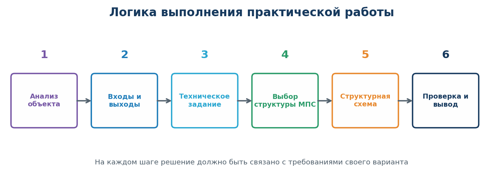
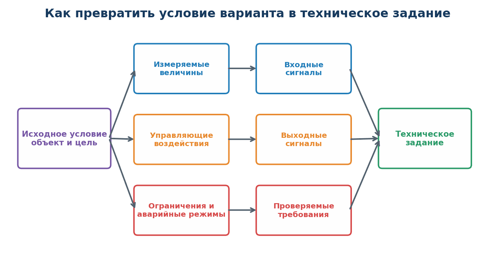
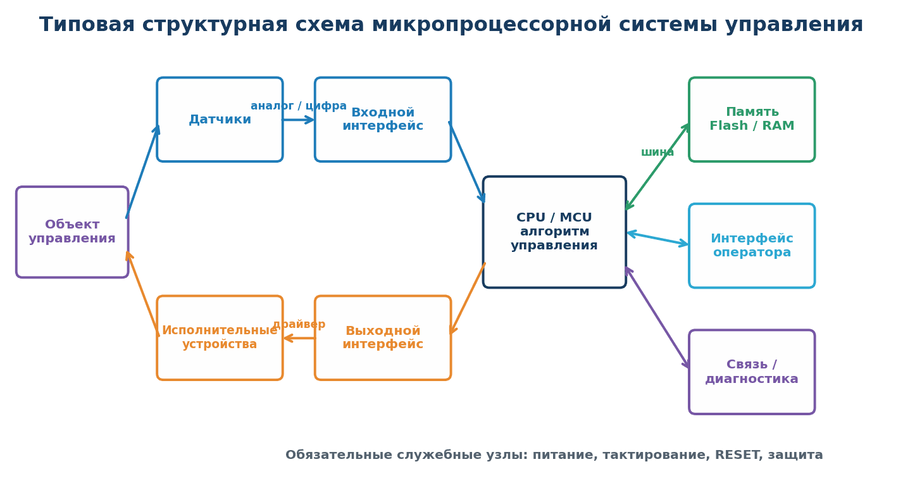

# Практическая работа № 9

## Разработка технического задания и структурной схемы микропроцессорной системы управления

**Дисциплина:** МДК.02.01 «Микропроцессорные системы»  
**Специальность:** 09.02.01 «Компьютерные системы и комплексы»  
**Курс:** 4  
**Рекомендуемая продолжительность:** 4 академических часа

## 1. Цель работы

Научиться переводить описание объекта управления в формализованные требования к микропроцессорной системе, разрабатывать техническое задание, выбирать состав основных функциональных блоков и изображать их взаимодействие на структурной схеме.

## 2. Планируемые результаты

После выполнения работы студент должен уметь:

- анализировать объект управления и выделять его основные состояния;
- определять входные и выходные сигналы системы;
- формулировать функциональные и технические требования;
- задавать нормальный, аварийный и сервисный режимы;
- выбирать обобщённую структуру микропроцессорной системы;
- определять назначение процессора или микроконтроллера, памяти, интерфейсов ввода-вывода, средств индикации и связи;
- оформлять ведомость сигналов `I/O Map` и рассчитывать требуемые аппаратные ресурсы с резервом;
- разрабатывать читаемую структурную схему с обозначением направлений сигналов;
- составлять критерии приёмки и план проверки системы;
- обосновывать принятые инженерные решения.

## 3. Теоретические сведения

Микропроцессорная система управления получает сведения об объекте с помощью датчиков, обрабатывает их по заданному алгоритму и формирует управляющие воздействия на исполнительные устройства.

Проектирование начинается не с выбора конкретной платы или микросхемы, а с анализа задачи:

1. Что является объектом управления?
2. Какова цель управления?
3. Какие величины необходимо измерять?
4. Какие воздействия система должна формировать?
5. Какие режимы и аварийные ситуации необходимо учитывать?
6. По каким признакам можно проверить правильность работы?

*Рисунок 1 — Последовательность разработки технического задания и структурной схемы*

### 3.1. Техническое задание

**Техническое задание, ТЗ** — документ, в котором определены назначение системы, условия её работы, функции, требования, состав результатов и критерии приёмки.

Хорошее требование должно быть:

- однозначным — допускает только одно толкование;
- измеримым — содержит проверяемый параметр или состояние;
- реализуемым — может быть выполнено при заданных ограничениях;
- необходимым — связано с назначением системы;
- непротиворечивым — согласовано с другими требованиями.

Фраза «система должна работать быстро» не является проверяемым требованием. Корректнее: «после достижения аварийного уровня система должна отключить насос не позднее чем через 1 с».

### 3.2. Декомпозиция исходного условия

*Рисунок 2 — Преобразование описания объекта в разделы технического задания*

Измеряемые величины преобразуются во входные сигналы, управляющие воздействия — в выходные сигналы, а ограничения и аварийные ситуации — в проверяемые требования.

### 3.3. Структурная схема

**Структурная схема** показывает основные функциональные блоки системы и связи между ними. Она отвечает на вопросы:

- из каких частей состоит система;
- что поступает на вход каждого блока;
- какой результат блок формирует;
- в каком направлении передаются данные и управляющие сигналы.

*Рисунок 3 — Обобщённая структура микропроцессорной системы управления*

На структурной схеме не требуется изображать каждый резистор или вывод микросхемы. Эти сведения относятся к принципиальной электрической схеме. Однако необходимо показать функционально значимые интерфейсы: аналоговый вход, дискретный вход, `GPIO`, `ADC`, `UART`, `I²C`, `SPI`, силовой драйвер, релейный модуль и другие применённые средства.

### 3.4. Минимальный состав проектируемой системы

В зависимости от варианта структурная схема должна включать:

- объект управления;
- датчики и органы ручного ввода;
- согласование входных сигналов и защиту входов;
- процессор или микроконтроллер;
- память программы и данных;
- выходные интерфейсы и силовые драйверы;
- исполнительные устройства;
- интерфейс оператора;
- питание, тактирование и сброс;
- интерфейс связи или диагностики, если он требуется вариантом.

Если выбрана однокристальная микроЭВМ, встроенные `Flash`, `RAM`, `GPIO`, таймеры и `ADC` следует показать внутри границы блока микроконтроллера. Если выбрана система на отдельном микропроцессоре, внешнюю память и порты ввода-вывода следует показать отдельными блоками.

### 3.5. Связь структурной схемы с организацией шин

Для системы на отдельном микропроцессоре необходимо показать системную магистраль:

- шина адреса определяет выбранную память или порт;
- двунаправленная шина данных переносит команды и значения;
- шина управления содержит `RD`, `WR`, `CS`, `RESET`, `CLK` и при необходимости `READY/WAIT`, `IRQ/INT`.

*Рисунок 4 — Адрес, данные и управление связывают вычислительное ядро, память и периферию*

Для микроконтроллерной реализации внешние датчики и исполнительные устройства обычно подключаются через `GPIO`, `ADC`, `PWM`, `UART`, `I²C` или `SPI`. При этом внутренняя связь ядра, памяти и периферийных модулей также имеет шинную организацию, хотя отдельные линии адреса и данных не выведены из корпуса.

## 4. Задание

Для объекта управления, заданного вариантом:

1. Проанализировать назначение и условия работы системы.
2. Составить перечень исходных данных и принятых допущений.
3. Выделить управляемые параметры, входные воздействия и выходные команды.
4. Разработать техническое задание по шаблону раздела 6.
5. Составить таблицу входных сигналов.
6. Составить таблицу выходных сигналов.
7. Описать нормальный, ручной, сервисный и аварийный режимы.
8. Рассчитать требуемые ресурсы: `GPIO`, каналы `ADC`, таймеры, `PWM`, интерфейсы и память; предусмотреть резерв.
9. Выбрать обобщённую аппаратную структуру МПС методом `Top-Down`.
10. Разработать структурную схему и подписать связи между блоками.
11. Обосновать выбор основных блоков, интерфейсов и способов согласования сигналов.
12. Составить не менее восьми проверок для приёмочных испытаний.
13. Сформулировать вывод по работе.

## 5. Требования к результату

Работа оформляется в одном отчёте. Отчёт должен содержать:

1. название и цель работы;
2. номер и условие варианта;
3. исходные данные и допущения;
4. техническое задание;
5. ведомость сигналов `I/O Map`;
6. расчёт ресурсов МПС с резервом;
7. структурную схему;
8. обоснование состава системы;
9. алгоритм работы верхнего уровня;
10. план испытаний;
11. ответы на контрольные вопросы;
12. вывод.

### Обязательные правила оформления схемы

- каждый блок имеет краткое и однозначное название;
- стрелками показано направление передачи сигналов;
- возле стрелок указаны типы сигналов или интерфейсы;
- датчики расположены со стороны входов, исполнительные устройства — со стороны выходов;
- показаны питание, `RESET` и тактирование;
- указаны средства защиты для опасных или мощных нагрузок;
- линии не должны проходить через подписи и блоки;
- схема должна читаться без обращения к пояснительному тексту.

## 6. Шаблон технического задания

### 6.1. Наименование системы

Указать полное название проектируемой микропроцессорной системы.

### 6.2. Назначение и цель создания

Описать объект, пользователя и ожидаемый результат автоматизации.

### 6.3. Характеристика объекта управления

Указать:

- назначение объекта;
- управляемые процессы;
- диапазоны контролируемых величин;
- внешние воздействия;
- опасные и недопустимые состояния.

### 6.4. Функции системы

Сформулировать не менее шести функций. Использовать проверяемые глаголы: «измерять», «сравнивать», «включать», «отключать», «поддерживать», «регистрировать», «отображать», «передавать», «сигнализировать».

### 6.5. Входные сигналы

Заполнить таблицу.

| № | Обозначение | Источник и назначение | Тип и диапазон | Электрический уровень | Интерфейс / ресурс | Обработка и защита | Период / время реакции |
|---:|:---|:---|:---|:---|:---|:---|:---|
| 1 |  |  |  |  |  |  |  |
| 2 |  |  |  |  |  |  |  |
| 3 |  |  |  |  |  |  |  |

Типы сигналов могут быть аналоговыми, дискретными, импульсными или цифровыми интерфейсными. Не следует автоматически назначать интерфейс датчику без проверки принципа его работы.

### 6.6. Выходные сигналы

| № | Обозначение | Получатель и действие | Тип сигнала | Напряжение / ток нагрузки | Интерфейс или драйвер | Развязка / защита | Безопасное состояние |
|---:|:---|:---|:---|:---|:---|:---|:---|
| 1 |  |  |  |  |  |  |  |
| 2 |  |  |  |  |  |  |  |
| 3 |  |  |  |  |  |  |  |

Для двигателя, нагревателя, насоса, клапана или другой мощной нагрузки необходимо предусмотреть силовой драйвер, реле, транзисторный ключ или частотный преобразователь. Подключение такой нагрузки непосредственно к выводу микроконтроллера недопустимо.

### 6.7. Режимы работы

Описать:

- **автоматический режим** — основной алгоритм;
- **ручной режим** — допустимые действия оператора;
- **сервисный режим** — диагностика датчиков и выходов;
- **аварийный режим** — безопасная реакция на отказ или выход параметра за пределы.

### 6.8. Функциональные требования

Каждое требование получает идентификатор: `FR-01`, `FR-02` и далее.

Пример:

> **FR-01.** Система должна измерять температуру не реже одного раза в 2 с.  
> **FR-02.** При температуре выше 35 °C система должна включить вентилятор.  
> **FR-03.** При отказе датчика система должна отключить нагреватель и включить аварийную индикацию.

### 6.9. Нефункциональные требования

Сформулировать требования к:

- времени реакции;
- точности измерения;
- напряжению питания и потребляемой мощности;
- условиям эксплуатации;
- надёжности и поведению после сброса;
- электрической и функциональной безопасности;
- интерфейсу оператора;
- диагностике и хранению настроек.

Требования получают идентификаторы `NFR-01`, `NFR-02` и далее.

### 6.10. Требования к аппаратной структуре

Указать:

- тип вычислительного ядра: микропроцессор или микроконтроллер;
- минимально необходимые объёмы `Flash/ROM` и `RAM` на уровне обоснованной оценки;
- требуемое количество аналоговых и дискретных входов;
- количество выходов и типы драйверов;
- таймеры, счётчики и каналы `PWM`;
- интерфейсы связи;
- средства индикации и управления;
- требования к питанию, сбросу и защите.

Конкретную модель микроконтроллера разрешается выбрать после определения требований. Выбор необходимо обосновать количеством входов-выходов, наличием нужных интерфейсов, таймеров, памяти и диапазоном питания.

После заполнения `I/O Map` выполнить сводный расчёт ресурсов.

| Ресурс | Требуется по I/O Map | Резерв | Итоговое требование |
|:---|---:|---:|---:|
| Дискретные входы `DI` |  |  |  |
| Дискретные выходы `DO` |  |  |  |
| Аналоговые входы `AI/ADC` |  |  |  |
| Импульсные входы / входы счётчика |  |  |  |
| Каналы `PWM` |  |  |  |
| Таймеры |  |  |  |
| `UART`, `I²C`, `SPI`, другие интерфейсы |  |  |  |
| `Flash/ROM` |  |  |  |
| `RAM` |  |  |  |

Для `GPIO`, памяти и каналов периферии рекомендуется предусмотреть обоснованный резерв. В учебной работе допустимо принять резерв 20 %, округляя число линий вверх, если условием не задано иное.

### 6.11. Критерии приёмки

Для каждого критического требования определить проверку и ожидаемый результат. Проверка должна учитывать не только правильное логическое действие, но и допустимое время реакции системы.

| № | Проверяемое требование | Начальные условия | Действие | Ожидаемый результат |
|---:|:---|:---|:---|:---|
| 1 |  |  |  |  |
| 2 |  |  |  |  |
| 3 |  |  |  |  |

## 7. Порядок выполнения работы

### Этап 1. Анализ объекта

Выписать существительные и глаголы из условия варианта. Существительные обычно указывают на датчики, исполнительные устройства и элементы интерфейса; глаголы — на функции системы.

### Этап 2. Определение границ системы

Отделить проектируемую МПС от объекта управления. Например, резервуар относится к объекту, датчик уровня — к измерительной части системы, а насос — к исполнительной части.

### Этап 3. Разработка таблиц ввода-вывода

Составить единую ведомость `I/O Map`. Для каждого сигнала определить направление, форму представления, физический уровень, диапазон, способ обработки, защиту и требуемый интерфейс. Для кнопок предусмотреть антидребезг; для аналоговых каналов — согласование диапазона и фильтрацию; для длинных линий — помехозащиту; для силовых цепей — драйвер и при необходимости гальваническую развязку.

### Этап 4. Формирование требований

Записать не менее:

- 8 функциональных требований;
- 5 нефункциональных требований;
- 3 требований безопасности или отказоустойчивости;
- 8 критериев приёмки.

### Этап 5. Выбор структуры

Применить нисходящее проектирование `Top-Down`: функция системы → требования → сигналы → ресурсы → архитектура → конкретные элементы. Определить, какие функции выполняет каждый блок. Не заменять обоснование фразой «выбрана плата Arduino». Сначала рассчитываются необходимые ресурсы, затем выбирается подходящее устройство.

### Этап 6. Разработка структурной схемы

Нанести блоки и связи. Для цифровых интерфейсов указать название протокола, для аналоговых сигналов — наличие `ADC`, для мощных нагрузок — драйвер и отдельную цепь питания. Если выбрана микропроцессорная архитектура с внешней памятью, отдельно показать шины адреса, данных и управления и обозначить направление передачи.

### Этап 7. Проверка проекта

Сопоставить каждый вход и выход из таблиц с блоком на схеме. Проверить наличие реакции на отказ датчика, обрыв связи, пропадание питания и недопустимое состояние объекта.

## 8. Пример фрагмента выполнения

**Объект:** камера хранения материалов.  
**Цель:** поддержание температуры и контроль доступа.

Фрагмент требования:

> **FR-01.** Система должна измерять температуру в диапазоне от 0 до 50 °C.  
> **FR-02.** При температуре выше 28 °C система должна включить вентилятор.  
> **FR-03.** При открытии двери более чем на 60 с система должна включить звуковую сигнализацию.  
> **NFR-01.** Время реакции на аварийное открытие двери — не более 1 с.

Фрагмент структуры:

`датчик температуры → входной интерфейс → MCU → драйвер → вентилятор`  
`датчик двери → цифровой вход MCU → звуковой индикатор`  
`клавиатура ↔ MCU ↔ дисплей`

Этот пример показывает уровень детализации, но не является готовым решением вариантов.

## 9. Варианты заданий

Общее требование для всех вариантов: предусмотреть автоматический и ручной режимы, индикацию состояния, аварийную сигнализацию, безопасное состояние выходов после `RESET` и не менее восьми приёмочных проверок.

| № | Объект и назначение | Обязательные входные данные | Управляющие воздействия | Специальное требование |
|---:|:---|:---|:---|:---|
| 1 | Теплица: поддержание микроклимата | температура воздуха, влажность воздуха, влажность почвы, уровень воды | нагреватель, вентилятор, полив, освещение | вести журнал аварийных отклонений |
| 2 | Накопительный резервуар: поддержание уровня | нижний и верхний уровни, непрерывный уровень, состояние насоса | насос наполнения, сливной клапан | исключить сухой ход и переполнение |
| 3 | Конвейер сортировки деталей | наличие детали, цвет или метка, положение механизма, аварийная кнопка | двигатель ленты, исполнитель сортировки, сигнализация | подсчитывать изделия по категориям |
| 4 | Система контроля доступа в лабораторию | идентификатор пользователя, датчик двери, кнопка выхода, датчик вскрытия | электрозамок, световая и звуковая индикация | сохранять последние 20 событий |
| 5 | Учебный инкубатор | температура, влажность, датчик положения лотка, уровень воды | нагреватель, увлажнитель, вентилятор, привод поворота | при отказе датчика отключать нагрев |
| 6 | Сушильный шкаф | температура в двух точках, влажность, датчик двери | нагреватель, вентилятор, заслонка | реализовать профиль из трёх стадий с таймером |
| 7 | Автоматический шлагбаум | датчик автомобиля, концевики, фотобарьер, команда оператора | привод подъёма и опускания, светофор | запрещать закрытие при препятствии |
| 8 | Двухзонная пожарная сигнализация | дым и температура в каждой зоне, кнопка подтверждения | сирена, световые указатели, отключение вентиляции | различать предупреждение и пожар |
| 9 | Освещение учебной аудитории | освещённость, присутствие, команды панели, состояние окон | две группы светильников, жалюзи | автоматический режим не должен мешать ручному |
| 10 | Насосная станция | давление, расход, уровни в резервуаре, состояние двух насосов | два насоса, перепускной клапан | обеспечить чередование основного насоса |
| 11 | Аквариум | температура воды, уровень, мутность, время | нагреватель, аэратор, освещение, дозатор корма | запретить нагрев при низком уровне |
| 12 | Холодильная камера | температура в двух точках, датчик двери, ток компрессора | компрессор, вентилятор, нагреватель оттайки | регистрировать длительность выхода из нормы |
| 13 | Зерновой силос | температура в трёх точках, влажность зерна, уровень заполнения | вентилятор, заслонка, сигнализация | выявлять недостоверный датчик сравнением каналов |
| 14 | Двухосевой солнечный трекер | освещённость по четырём направлениям, концевики, скорость ветра | два привода, тормоз | при сильном ветре переходить в безопасное положение |
| 15 | Модель железнодорожного переезда | датчики приближения и удаления, положение шлагбаума, контроль ламп | шлагбаум, красные огни, звонок | предусмотреть безопасное состояние при отказе датчика |
| 16 | Автономная метеостанция | температура, влажность, давление, осадки, скорость ветра | обогрев датчика, привод защитной крышки, индикация | передавать измерения по последовательному интерфейсу |
| 17 | Лабораторный термостат | температура рабочего объёма, температура нагревателя, команда задания | нагреватель, вентилятор | ограничить перегрев независимо от основного алгоритма |
| 18 | Вентиляция склада | температура, влажность, качество воздуха, состояние двери | два вентилятора, воздушная заслонка | поддерживать ручное и автоматическое управление |
| 19 | Установка дозирования жидкости | масса или объём, наличие тары, положение клапана, аварийная кнопка | подающий насос, дозирующий клапан, конвейер | обеспечить остановку при отсутствии тары |
| 20 | Учебная модель лифта на четыре этажа | кнопки этажей, датчики положения, концевики дверей, перегрузка | двигатель кабины, привод дверей, индикация | движение разрешено только при закрытых дверях |
| 21 | Светофор регулируемого перекрёстка | кнопки пешеходов, датчики транспорта, аварийный вход | транспортные и пешеходные секции | исключить одновременный разрешающий сигнал конфликтующих направлений |
| 22 | Птичник: поддержание условий содержания | температура, влажность, освещённость, уровень корма и воды | вентиляция, нагрев, освещение, подача корма | формировать раннее предупреждение до аварийного порога |
| 23 | Холодильник для медицинских препаратов | два датчика температуры, датчик двери, наличие сетевого питания | компрессор, вентилятор, сирена | сохранять значения температуры при нарушении режима |
| 24 | Система полива участка из четырёх зон | влажность почвы по зонам, уровень резервуара, датчик дождя | насос, четыре электроклапана | не включать полив при дожде или пустом резервуаре |
| 25 | Контроллер резервного аккумулятора | напряжение, ток, температура, наличие внешнего питания | зарядный ключ, отключение нагрузки, вентилятор | предусмотреть защиту от перегрева, перезаряда и глубокого разряда |

## 10. Указания по распределению вариантов

Номер варианта - номер по списку, номер можно вычислить:

Изменять обязательные входы, выходы и специальное требование нельзя. Дополнительные функции разрешены, если они не противоречат условию и отражены в техническом задании.

## 11. Критерии оценивания

| Раздел работы | Максимум, баллов | Проверяемый результат |
|:---|---:|:---|
| Анализ объекта и исходные данные | 10 | определены цель, границы системы, состояния и допущения |
| Таблицы входов и выходов | 15 | сигналы полны, направления и интерфейсы указаны корректно |
| Функциональные требования | 15 | требования однозначны, измеримы и связаны с вариантом |
| Нефункциональные требования и безопасность | 10 | учтены время реакции, питание, отказ датчиков и безопасные состояния |
| Расчёт ресурсов и обоснование МПС | 15 | составлена I/O Map, учтены GPIO, ADC, таймеры, интерфейсы, память и резерв |
| Структурная схема | 20 | схема полна, читаема, связи и направления обозначены |
| План испытаний | 10 | проверки воспроизводимы и содержат ожидаемый результат |
| Оформление и вывод | 5 | соблюдена структура отчёта, термины употреблены правильно |
| **Итого** | **100** |  |

Перевод баллов в оценку:

- 90–100 баллов — «отлично»;
- 70–89 баллов — «хорошо»;
- 50–69 баллов — «удовлетворительно»;
- менее 50 баллов — «неудовлетворительно».

### Существенные ошибки

Работа не может получить оценку выше «удовлетворительно», если:

- отсутствует структурная схема;
- не показан хотя бы один обязательный вход или выход варианта;
- мощная нагрузка подключена непосредственно к CPU или MCU;
- отсутствует безопасная реакция на критический отказ;
- техническое задание состоит только из описания устройства и не содержит проверяемых требований.

## 12. Контрольные вопросы

1. Чем техническое задание отличается от описания идеи устройства?
2. Почему выбор микроконтроллера выполняют после определения требований?
3. Какие требования называют функциональными?
4. Что относится к нефункциональным требованиям?
5. Как определить границы проектируемой системы?
6. Чем структурная схема отличается от принципиальной электрической схемы?
7. Какие блоки входят в минимальный состав МПС управления?
8. Когда необходим аналого-цифровой преобразователь?
9. Почему мощной нагрузке нужен отдельный драйвер?
10. Что такое безопасное состояние выхода?
11. Для чего системе необходим сигнал `RESET`?
12. Какие данные следует хранить в энергонезависимой памяти?
13. В каких случаях требуется таймер или канал `PWM`?
14. Что должно быть указано возле линии связи на структурной схеме?
15. Как превратить требование в приёмочную проверку?

## 13. Контрольный лист перед сдачей

- [ ] Указан номер варианта.
- [ ] Определены цель и границы системы.
- [ ] Все обязательные входы внесены в таблицу.
- [ ] Все обязательные выходы внесены в таблицу.
- [ ] Указаны типы сигналов и интерфейсы.
- [ ] Для сигналов указаны электрические уровни, обработка и защита.
- [ ] Сформулировано не менее 8 функциональных требований.
- [ ] Сформулировано не менее 5 нефункциональных требований.
- [ ] Описаны нормальный, ручной, сервисный и аварийный режимы.
- [ ] Определены безопасные состояния исполнительных устройств.
- [ ] Обоснованы вычислительное ядро, память и интерфейсы.
- [ ] Выполнен сводный расчёт ресурсов с резервом.
- [ ] На схеме показаны питание, тактирование и `RESET`.
- [ ] Силовые нагрузки подключены через драйверы.
- [ ] Все стрелки имеют направление, важные связи подписаны.
- [ ] Составлено не менее 8 приёмочных проверок.
- [ ] Вывод связан с целью работы.

## 14. Вывод

В выводе необходимо кратко указать:

- какой объект управления был проанализирован;
- какие функции должна выполнять разработанная МПС;
- какие блоки включены в структуру;
- какие требования определили выбор интерфейсов и средств защиты;
- каким способом будет проверяться соответствие проекта техническому заданию.
