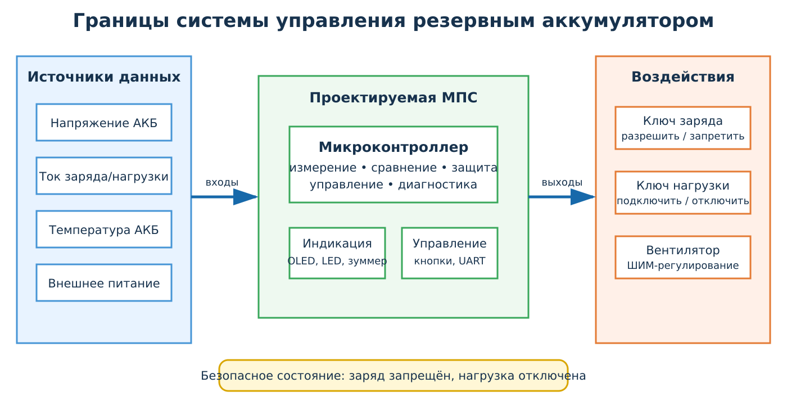
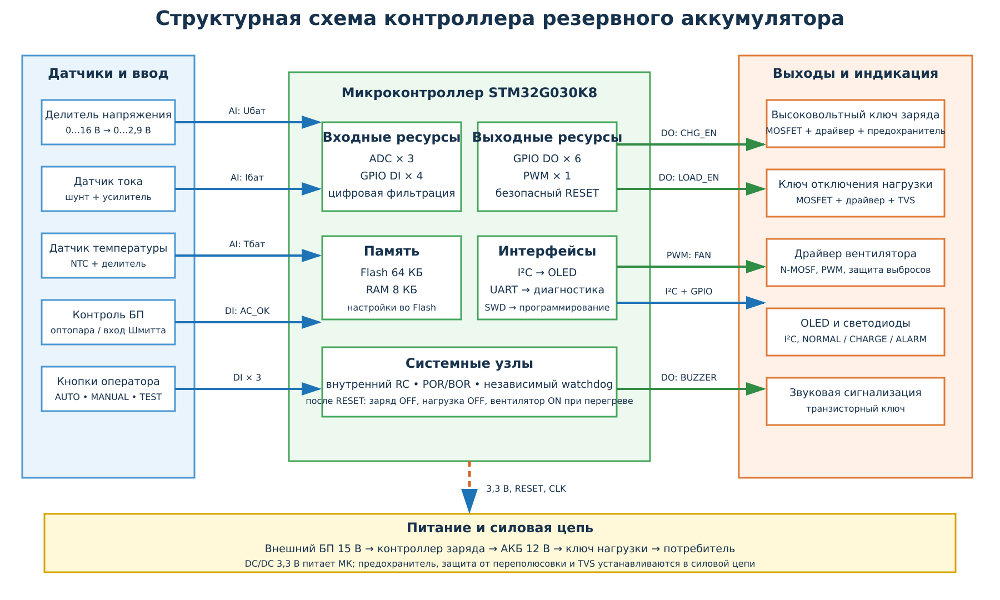
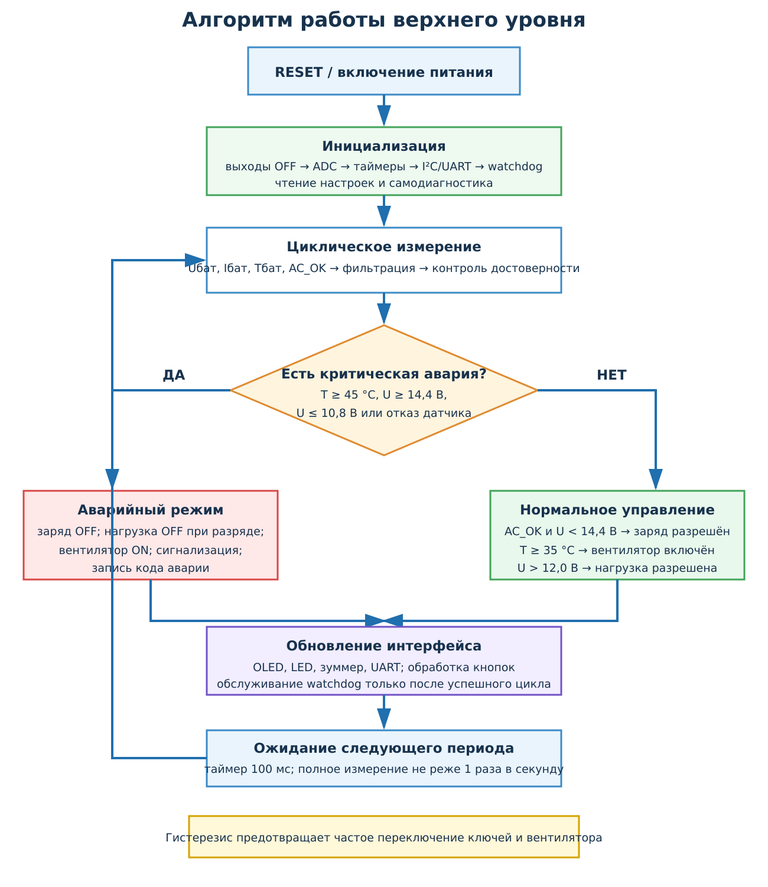

# Практическая работа № 9

## Разработка технического задания и структурной схемы микропроцессорной системы управления

**Дисциплина:** МДК.02.01 «Микропроцессорные системы»  
**Специальность:** 09.02.01 «Компьютерные системы и комплексы»  
**Курс:** 4  
**Вариант:** 25  
**Объект:** контроллер резервного аккумулятора

> Этот документ является примером оформления отчёта. Пороговые значения и конкретные компоненты приняты как учебные допущения. При проектировании реального зарядного устройства необходимо руководствоваться документацией аккумулятора, зарядного контроллера и требованиями электробезопасности.

## 1. Цель работы

Разработать техническое задание и структурную схему микропроцессорной системы контроля резервного аккумулятора, определить её входные и выходные сигналы, режимы работы, аппаратные ресурсы, средства защиты и критерии приёмки.

## 2. Условие варианта

Контроллер резервного аккумулятора должен получать данные о напряжении, токе, температуре и наличии внешнего питания. Система должна управлять зарядным ключом, отключением нагрузки и вентилятором. Необходимо предусмотреть защиту от перегрева, перезаряда и глубокого разряда.

Общие требования практической работы также предусматривают автоматический и ручной режимы, индикацию состояния, аварийную сигнализацию и безопасное состояние выходов после `RESET`.

## 3. Исходные данные и принятые допущения

Для получения проверяемого учебного проекта приняты следующие исходные данные.

| Параметр | Принятое значение |
|:---|:---|
| Тип аккумулятора | герметичный свинцово-кислотный аккумулятор, 12 В, 7 А·ч |
| Внешний источник | стабилизированный источник 15 В постоянного тока |
| Диапазон измерения напряжения АКБ | 0–16 В |
| Диапазон измерения тока | от −5 до +5 А; знак показывает заряд или разряд |
| Диапазон измерения температуры | от −10 до +70 °C |
| Порог окончания заряда | 14,4 В |
| Порог разрешения повторного заряда | 13,6 В |
| Порог глубокого разряда | 10,8 В |
| Порог повторного подключения нагрузки | 12,0 В при наличии внешнего питания |
| Включение вентилятора | при температуре не ниже 35 °C |
| Выключение вентилятора | при температуре не выше 32 °C |
| Аварийный перегрев | 45 °C |
| Максимальный ток заряда | 1,5 А |
| Период быстрого контроля защитных порогов | не более 100 мс |
| Период обновления усреднённых показаний | не более 1 с |
| Напряжение логической части | 3,3 В |

Гистерезис между порогами включения и выключения предотвращает частое переключение ключей при небольших колебаниях измеряемых величин.

### 3.1. Границы проектируемой системы

К объекту управления относятся аккумулятор, внешний источник и нагрузка. В проектируемую МПС входят датчики, цепи согласования, микроконтроллер, силовые драйверы, интерфейс оператора и диагностический интерфейс.

На рисунке 1 показано, какие данные получает контроллер и какие воздействия он формирует. После сброса заряд должен быть запрещён, а нагрузка отключена до завершения самодиагностики.



*Рисунок 1 — Границы проектируемой микропроцессорной системы*

## 4. Техническое задание

### 4.1. Наименование системы

Микропроцессорная система контроля и защиты резервного аккумулятора `МПС-АКБ-12`.

### 4.2. Назначение и цель создания

Система предназначена для автоматического контроля состояния резервного аккумулятора, безопасного управления его зарядом и подключением нагрузки, охлаждения аккумуляторного отсека и информирования оператора о нормальных и аварийных состояниях.

Цель создания — увеличить надёжность резервного питания и предотвратить опасные режимы: перезаряд, перегрев, превышение тока и глубокий разряд.

### 4.3. Характеристика объекта управления

Объект управления — аккумуляторная подсистема резервного питания на 12 В. Она включает внешний источник, аккумулятор, зарядную цепь, нагрузку и вентилятор. Контролируемыми величинами являются:

- напряжение аккумулятора;
- ток заряда или разряда;
- температура аккумулятора;
- наличие внешнего питания.

Недопустимыми состояниями являются напряжение выше 14,4 В, температура не ниже 45 °C, ток заряда выше 1,5 А, разряд ниже 10,8 В, недостоверные показания критического датчика и одновременное разрешение заряда при отсутствии внешнего питания.

### 4.4. Функции системы

Система должна:

1. измерять напряжение аккумулятора;
2. измерять ток и определять направление энергетического потока;
3. измерять температуру аккумулятора;
4. определять наличие внешнего питания;
5. разрешать и запрещать заряд аккумулятора;
6. отключать нагрузку при глубоком разряде;
7. управлять вентилятором по температуре;
8. отображать состояние и измеренные значения;
9. включать звуковую и световую аварийную сигнализацию;
10. обнаруживать недостоверность показаний датчиков;
11. сохранять параметры настройки и код последней аварии;
12. передавать диагностические данные по `UART`;
13. выполнять самодиагностику после включения и сброса;
14. восстанавливаться после программного зависания с помощью watchdog.

### 4.5. Функциональные требования

| Идентификатор | Требование |
|:---|:---|
| `FR-01` | Система должна измерять напряжение АКБ в диапазоне 0–16 В не реже одного раза в секунду. |
| `FR-02` | Система должна измерять ток в диапазоне от −5 до +5 А не реже одного раза в секунду. |
| `FR-03` | Система должна измерять температуру в диапазоне от −10 до +70 °C не реже одного раза в секунду. |
| `FR-04` | При наличии внешнего питания, напряжении ниже 14,4 В, температуре 0–45 °C и допустимом токе система должна разрешать заряд. |
| `FR-05` | При напряжении не ниже 14,4 В система должна запретить заряд не позднее чем через 200 мс. |
| `FR-06` | При температуре не ниже 45 °C система должна немедленно запретить заряд и включить аварийную сигнализацию. |
| `FR-07` | При напряжении не выше 10,8 В система должна отключить нагрузку не позднее чем через 500 мс. |
| `FR-08` | Повторное подключение нагрузки допускается при напряжении не ниже 12,0 В и наличии внешнего питания. |
| `FR-09` | Вентилятор должен включаться при 35 °C и выключаться при 32 °C или ниже. |
| `FR-10` | Система должна отображать напряжение, ток, температуру, наличие питания и текущий режим. |
| `FR-11` | При отказе датчика напряжения или температуры заряд должен быть запрещён. |
| `FR-12` | Система должна сохранять код последней аварии в энергонезависимой памяти. |
| `FR-13` | Система должна передавать измерения и состояние выходов по `UART` по запросу оператора. |
| `FR-14` | Watchdog должен перезапустить микроконтроллер, если основной цикл не завершился за 2 с. |

### 4.6. Нефункциональные требования

| Идентификатор | Требование |
|:---|:---|
| `NFR-01` | Основной период обновления измерений — не более 1 с. |
| `NFR-02` | Погрешность измерения напряжения после калибровки — не более ±0,1 В. |
| `NFR-03` | Погрешность измерения температуры — не более ±2 °C. |
| `NFR-04` | Логическая часть должна питаться стабилизированным напряжением 3,3 В. |
| `NFR-05` | После `RESET` управляющие выходы должны перейти в безопасное состояние аппаратно или за время не более 10 мс. |
| `NFR-06` | Настройки должны сохраняться при исчезновении внешнего питания. |
| `NFR-07` | Система должна работать при температуре окружающей среды от 0 до +40 °C. |
| `NFR-08` | Разъёмы измерительных и силовых цепей должны иметь однозначную маркировку. |

### 4.7. Требования безопасности и отказоустойчивости

| Идентификатор | Требование |
|:---|:---|
| `SR-01` | Силовые ключи заряда и нагрузки запрещается подключать непосредственно к GPIO микроконтроллера; должны применяться драйверы. |
| `SR-02` | Силовая цепь должна содержать предохранитель и защиту от переполюсовки. |
| `SR-03` | При недостоверных данных датчика напряжения или температуры заряд должен быть запрещён. |
| `SR-04` | При перегреве заряд отключается независимо от выбранного оператором режима. |
| `SR-05` | Ручной режим не должен позволять отменять защиту от перезаряда, перегрева и глубокого разряда. |
| `SR-06` | При включении питания и после `RESET` зарядный ключ и ключ нагрузки должны оставаться выключенными до завершения самодиагностики. |

## 5. Ведомость сигналов I/O Map

### 5.1. Входные сигналы

| № | Обозначение | Источник и назначение | Тип и диапазон | Электрический уровень | Интерфейс / ресурс | Обработка и защита | Период / реакция |
|---:|:---|:---|:---|:---|:---|:---|:---|
| 1 | `U_BAT` | напряжение аккумулятора | аналоговый, 0–16 В | 0–2,9 В после делителя | `ADC1_CH0` | делитель 100/22 кОм, RC-фильтр, ограничение входа | контроль 100 мс; индикация 1 с |
| 2 | `I_BAT` | ток заряда/разряда | аналоговый, −5…+5 А | 0–3,3 В | `ADC1_CH1` | шунт, двунаправленный усилитель, RC-фильтр | контроль 100 мс; индикация 1 с |
| 3 | `T_BAT` | температура аккумулятора | аналоговый, −10…+70 °C | 0–3,3 В | `ADC1_CH2` | NTC-делитель, RC-фильтр, проверка обрыва/КЗ | контроль 100 мс; индикация 1 с |
| 4 | `AC_OK` | наличие внешнего питания | дискретный | 0/3,3 В | `GPIO DI` | оптопара либо компаратор Шмитта, подтяжка | реакция 100 мс |
| 5 | `BTN_MODE` | выбор AUTO/MANUAL | дискретный | 0/3,3 В | `GPIO DI` | подтяжка, антидребезг 30 мс | по событию |
| 6 | `BTN_SELECT` | выбор параметра | дискретный | 0/3,3 В | `GPIO DI` | подтяжка, антидребезг 30 мс | по событию |
| 7 | `BTN_TEST` | запуск самодиагностики | дискретный | 0/3,3 В | `GPIO DI` | подтяжка, антидребезг 30 мс | по событию |

### 5.2. Выходные сигналы

| № | Обозначение | Получатель и действие | Тип сигнала | Нагрузка | Интерфейс / драйвер | Защита | Безопасное состояние |
|---:|:---|:---|:---|:---|:---|:---|:---|
| 1 | `CHG_EN` | разрешение зарядного ключа | дискретный | затвор силового MOSFET | `GPIO` + драйвер верхнего ключа | предохранитель, TVS, ограничение тока | `0`, заряд запрещён |
| 2 | `LOAD_EN` | подключение нагрузки | дискретный | затвор силового MOSFET | `GPIO` + драйвер верхнего ключа | предохранитель, TVS | `0`, нагрузка отключена |
| 3 | `FAN_PWM` | управление вентилятором | PWM | вентилятор 12 В | таймер `PWM` + N-MOSFET | защита выбросов, ограничение тока | `0`; при аппаратном перегреве — принудительный `ON` |
| 4 | `BUZZER` | звуковая авария | дискретный | зуммер | `GPIO` + транзисторный ключ | ограничительный резистор | `0` |
| 5 | `LED_NORM` | нормальное состояние | дискретный | светодиод | `GPIO` + резистор | токоограничение | `0` |
| 6 | `LED_CHARGE` | заряд активен | дискретный | светодиод | `GPIO` + резистор | токоограничение | `0` |
| 7 | `LED_ALARM` | авария | дискретный | светодиод | `GPIO` + резистор | токоограничение | `0` |
| 8 | `OLED` | вывод параметров | цифровой | OLED-дисплей | `I²C` | подтяжки SDA/SCL | сообщение о запуске |
| 9 | `UART_TX` | диагностические сообщения | цифровой | сервисный порт | `UART` 3,3 В | последовательный резистор, ESD-защита | высокий уровень покоя |

## 6. Режимы работы

### 6.1. Автоматический режим

Микроконтроллер периодически измеряет входные величины и управляет зарядом, нагрузкой и вентилятором. Заряд разрешается только при наличии внешнего питания и отсутствии запретов. Нагрузка отключается при глубоком разряде. Все защитные ограничения имеют приоритет над обычным алгоритмом.

### 6.2. Ручной режим

Оператор может вручную запретить заряд, отключить нагрузку, включить вентилятор и просмотреть параметры. Ручная команда не может разрешить заряд при перегреве, перезаряде, отсутствии внешнего питания или отказе датчика. Ручное подключение нагрузки запрещено при глубоком разряде.

### 6.3. Сервисный режим

В сервисном режиме отображаются необработанные коды `ADC`, состояние входов и выходов, код последнего сброса и аварии. Допускается кратковременная проверка индикаторов, зуммера и вентилятора. Силовые ключи проверяются только с безопасной тестовой нагрузкой.

### 6.4. Аварийный режим

При перегреве, перезаряде, сверхтоке или отказе критического датчика заряд немедленно запрещается. При глубоком разряде отключается нагрузка. Включаются аварийный светодиод и зуммер, код события сохраняется, а по `UART` передаётся диагностическое сообщение.

## 7. Расчёт аппаратных ресурсов

### 7.1. Сводная таблица

| Ресурс | Требуется по I/O Map | Резерв | Итоговое требование |
|:---|---:|---:|---:|
| Дискретные входы `DI` | 4 | 1 | 5 |
| Дискретные выходы `DO` | 6 | 2 | 8 |
| Аналоговые входы `AI/ADC` | 3 | 1 | 4 |
| Импульсные входы | 0 | 1 | 1 |
| Каналы `PWM` | 1 | 1 | 2 |
| Таймеры | 2 | 1 | 3 |
| `I²C` | 1 | 0 | 1 |
| `UART` | 1 | 0 | 1 |
| Резервный интерфейс | 0 | 1 `SPI` | 1 |
| `Flash` | около 24 КБ | 20 % | не менее 32 КБ |
| `RAM` | около 3 КБ | 20 % | не менее 4 КБ |
| Энергонезависимые данные | около 256 байт | 100 % | не менее 512 байт |

### 7.2. Выбор микроконтроллера

Для учебного проекта выбран `STM32G030K8`, поскольку он имеет:

- 32-разрядное ядро Arm Cortex-M0+;
- 64 КБ Flash и 8 КБ RAM;
- 12-разрядный АЦП с достаточным количеством каналов;
- таймеры с каналами PWM;
- интерфейсы `I²C`, `UART` и `SPI`;
- достаточное число GPIO с резервом;
- встроенные схемы `POR/BOR`, внутренний генератор и независимый watchdog;
- питание 2,0–3,6 В.

Использование микроконтроллера позволяет разместить процессор, память, `ADC`, таймеры и основные интерфейсы в одном корпусе. Поэтому внешняя параллельная память и отдельные шины адреса и данных не требуются.

## 8. Структурная схема

Структурная схема построена методом `Top-Down`: функции преобразованы в сигналы, сигналы — в требуемые ресурсы, а ресурсы — в аппаратные блоки. Аналоговые датчики подключаются к `ADC` через согласующие и защитные цепи. Силовые нагрузки управляются только через драйверы. Питание, тактирование и `RESET` показаны отдельным системным контуром.



*Рисунок 2 — Структурная схема проектируемой МПС*

## 9. Обоснование состава системы

### 9.1. Измерение напряжения

Напряжение аккумулятора выше допустимого напряжения входа `ADC`, поэтому применяется резистивный делитель. Для номиналов 100 кОм и 22 кОм коэффициент передачи равен:

$$
k = \frac{22}{100+22} \approx 0{,}180.
$$

При напряжении 16 В на входе `ADC` получится:

$$
U_{ADC}=16\cdot0{,}180\approx2{,}89\text{ В},
$$

что меньше напряжения питания 3,3 В. RC-фильтр уменьшает импульсные помехи, а защитные диоды ограничивают аварийное напряжение.

### 9.2. Измерение тока

Ток измеряется по падению напряжения на шунте с помощью двунаправленного усилителя. Смещение выходного сигнала к половине диапазона `ADC` позволяет различать заряд и разряд по знаку отклонения.

### 9.3. Измерение температуры

Термистор NTC образует делитель напряжения. Программное обеспечение проверяет выход за физически допустимый диапазон, что позволяет обнаружить обрыв или короткое замыкание датчика.

### 9.4. Силовые выходы

Зарядный ключ и ключ нагрузки реализуются на MOSFET с отдельными драйверами. Такое решение разгружает GPIO, обеспечивает управление силовым током и позволяет задать аппаратное безопасное состояние резисторами затвора. Вентилятор управляется N-MOSFET по PWM.

### 9.5. Питание, тактирование и сброс

Логическая часть питается от DC/DC-преобразователя 3,3 В. Микроконтроллер запускается от внутреннего RC-генератора: высокой точности кварца для данной задачи не требуется. `POR/BOR` удерживают систему в сбросе при недопустимом напряжении, а независимый watchdog восстанавливает работу после зависания.

## 10. Алгоритм работы верхнего уровня

После `RESET` все опасные выходы выключены. Затем выполняются инициализация, самодиагностика и первый цикл измерений. Защитные условия проверяются раньше обычных команд управления. Watchdog обслуживается только после успешного завершения полного цикла.



*Рисунок 3 — Алгоритм работы системы верхнего уровня*

### 10.1. Псевдокод

```text
после RESET:
    запретить заряд
    отключить нагрузку
    инициализировать ADC, GPIO, таймеры, I2C, UART
    прочитать настройки и причины сброса
    выполнить самодиагностику
    запустить watchdog

каждые 100 мс:
    опросить AC_OK и кнопки
    выполнить быстрый контроль U_BAT, I_BAT и T_BAT
    проверить критические пороги
    обновить программные таймеры

каждую 1 с:
    измерить U_BAT, I_BAT и T_BAT
    отфильтровать значения
    проверить достоверность датчиков

    если T_BAT >= 45 °C или U_BAT >= 14,4 В:
        запретить заряд
        включить аварийную сигнализацию

    если U_BAT <= 10,8 В:
        отключить нагрузку

    если аварий нет:
        управлять зарядом с гистерезисом
        управлять нагрузкой
        управлять вентилятором с гистерезисом

    обновить дисплей и диагностические данные
    сохранить новый код аварии при его появлении
    обслужить watchdog
```

## 11. План приёмочных испытаний

| № | Проверяемое требование | Начальные условия | Действие | Ожидаемый результат |
|---:|:---|:---|:---|:---|
| 1 | `FR-01`, `NFR-02` | АКБ заменена калибратором напряжения | подать 10,0; 12,0; 14,4 и 16,0 В | показания отличаются не более чем на ±0,1 В |
| 2 | `FR-02` | подключён источник двунаправленного тока | задать −5; 0; +1,5 и +5 А | знак и значение тока определяются корректно |
| 3 | `FR-03`, `NFR-03` | датчик помещён в термостат | задать 0, 25, 35 и 45 °C | ошибка измерения не более ±2 °C |
| 4 | `FR-04` | `AC_OK=1`, U=13,0 В, T=25 °C | включить автоматический режим | `CHG_EN=1`, горит индикатор заряда |
| 5 | `FR-05` | заряд разрешён | повысить U до 14,4 В | `CHG_EN=0` не позднее 200 мс |
| 6 | `FR-06`, `SR-04` | заряд разрешён | повысить T до 45 °C | заряд отключён, вентилятор и сигнализация включены |
| 7 | `FR-07` | нагрузка подключена | снизить U до 10,8 В | `LOAD_EN=0` не позднее 500 мс |
| 8 | `FR-08` | нагрузка отключена после разряда | подать внешнее питание и повысить U до 12,0 В | нагрузка может быть подключена после подтверждения восстановления |
| 9 | `FR-09` | температура 30 °C | повысить до 35 °C, затем снизить до 32 °C | вентилятор включается при 35 °C и выключается при 32 °C |
| 10 | `FR-11` | нормальная работа | разомкнуть цепь NTC | заряд запрещён, появляется код отказа датчика |
| 11 | `FR-14` | система работает | искусственно остановить основной цикл | watchdog вызывает перезапуск не позднее 2 с |
| 12 | `NFR-05`, `SR-06` | выходы включены | подать сигнал `RESET` | заряд и нагрузка немедленно отключаются |
| 13 | `FR-12` | создана авария | отключить и повторно включить питание | код последней аварии доступен после запуска |
| 14 | `SR-05` | активен ручной режим | попытаться включить заряд при 45 °C | команда отвергается, защита остаётся активной |

## 12. Ответы на контрольные вопросы

1. **Чем ТЗ отличается от описания идеи?** ТЗ содержит однозначные, измеримые требования и критерии проверки, а описание идеи может быть общим и непроверяемым.
2. **Почему микроконтроллер выбирают после требований?** Только после определения сигналов и ресурсов можно проверить, достаточно ли GPIO, `ADC`, таймеров, памяти и интерфейсов.
3. **Какие требования называют функциональными?** Требования, описывающие действия и реакции системы.
4. **Что относится к нефункциональным требованиям?** Точность, время реакции, питание, условия эксплуатации, надёжность, безопасность и удобство обслуживания.
5. **Как определить границы системы?** Необходимо отделить объект управления от датчиков, вычислительного блока, драйверов и интерфейса оператора.
6. **Чем структурная схема отличается от принципиальной?** Структурная схема показывает функции и связи блоков, а принципиальная — конкретные компоненты и электрические соединения.
7. **Какие блоки входят в минимальный состав МПС?** Входные устройства, согласование, вычислительное ядро, память, выходные драйверы, исполнительные устройства, питание, сброс и интерфейс оператора.
8. **Когда необходим АЦП?** Когда измеряемый сигнал является непрерывным аналоговым напряжением.
9. **Почему мощной нагрузке нужен драйвер?** GPIO не обеспечивает необходимый ток и не защищён от выбросов силовой цепи.
10. **Что такое безопасное состояние выхода?** Состояние, в котором после сброса или отказа система не создаёт опасного воздействия. В данном проекте заряд и нагрузка отключены.
11. **Для чего нужен `RESET`?** Для перевода ядра и периферии в известное начальное состояние.
12. **Что хранить в энергонезависимой памяти?** Настройки, коэффициенты калибровки и код последней аварии.
13. **Когда требуется таймер или PWM?** Таймер задаёт период измерений и контролирует время, а PWM регулирует скорость вентилятора.
14. **Что указывают возле линии на структурной схеме?** Направление, тип сигнала, интерфейс или назначение линии.
15. **Как превратить требование в проверку?** Задать начальные условия, воздействие, измеряемый результат и допустимое время реакции.

## 13. Вывод

В работе проанализирован контроллер резервного аккумулятора и разработано техническое задание на микропроцессорную систему управления. Определены обязательные входы: напряжение, ток, температура и наличие внешнего питания. Выходами являются зарядный ключ, ключ нагрузки, вентилятор и средства сигнализации.

В структуру включены микроконтроллер `STM32G030K8`, цепи согласования аналоговых сигналов, силовые драйверы, дисплей, кнопки, диагностический интерфейс, питание, схемы сброса и watchdog. Выбор микроконтроллера подтверждён расчётом GPIO, каналов `ADC`, таймеров, PWM, интерфейсов и памяти с резервом.

Безопасность обеспечивается отключением заряда при перегреве, перезаряде и отказе датчиков, отключением нагрузки при глубоком разряде и безопасным состоянием выходов после `RESET`. Соответствие проекта техническому заданию проверяется набором из четырнадцати воспроизводимых приёмочных испытаний.

## Источник задания

- [Практическая работа № 9 «Разработка технического задания и структурной схемы микропроцессорной системы управления»](https://github.com/BysonHunter/Tavrich_college/blob/main/%D0%9C%D0%9F%D0%A1/4%20%D0%BA%D1%83%D1%80%D1%81/%D0%9F%D1%80%D0%B0%D0%BA%D1%82%D0%B8%D1%87%D0%B5%D1%81%D0%BA%D0%B8%D0%B5%20%D0%B7%D0%B0%D0%B4%D0%B0%D0%BD%D0%B8%D1%8F/%D0%9F%D1%80%D0%B0%D0%BA%D1%82%D0%B8%D1%87%D0%B5%D1%81%D0%BA%D0%B0%D1%8F_%D1%80%D0%B0%D0%B1%D0%BE%D1%82%D0%B0_9/%D0%9F%D1%80%D0%B0%D0%BA%D1%82%D0%B8%D1%87%D0%B5%D1%81%D0%BA%D0%B0%D1%8F_%D1%80%D0%B0%D0%B1%D0%BE%D1%82%D0%B0_9_%D0%A2%D0%97_%D0%B8_%D1%81%D1%82%D1%80%D1%83%D0%BA%D1%82%D1%83%D1%80%D0%BD%D0%B0%D1%8F_%D1%81%D1%85%D0%B5%D0%BC%D0%B0_%D0%9C%D0%9F%D0%A1.md)
