# Лекция 3. Основы программирования Arduino

**Дисциплина:** МДК.02.02 «Программирование микроконтроллеров»  
**Специальность:** 09.02.01 «Компьютерные системы и комплексы»  
**Раздел:** Введение в архитектуру микроконтроллеров и основы программирования  
**Тема:** среда Arduino и основы языка программирования C/C++ для микроконтроллеров

> Основа лекции — исходная презентация. Материал расширен пояснениями и более современными примерами. Все исходные рисунки, таблицы, скриншоты и схемы перерисованы заново в едином учебном стиле. Там, где поведение зависит от конкретной платы, это отмечено отдельно.

---

## 1. Модель программы Arduino

Программа Arduino называется **скетчем**. Скетч фактически является программой на C/C++ с библиотеками и служебным кодом Arduino Core.

Минимальная программа содержит две обязательные функции:

```cpp
void setup() {
    // выполняется один раз после включения или reset
}

void loop() {
    // выполняется снова и снова
}
```

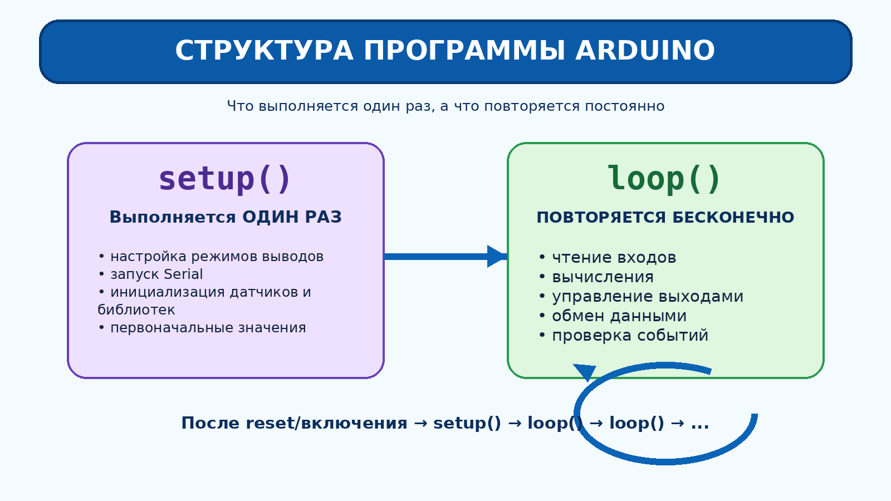

### Основные элементы синтаксиса

```cpp
// однострочный комментарий

/*
   многострочный комментарий
*/

#include <LibraryName.h>

void setup() {
    // инициализация
}

void loop() {
    // основной алгоритм
}
```

Комментарии не входят в машинный код программы после компиляции и применяются для пояснения алгоритма.

После большинства **операторов** ставится `;`:

```cpp
int value = 10;
value++;
digitalWrite(13, HIGH);
```

После заголовка функции, `if`, `for`, `while` и других конструкций с блоком `{ ... }` точка с запятой обычно не ставится.

---

## 2. Переменные и типы данных

Объявление переменной:

```cpp
int myVal;
```

Объявление с начальным значением:

```cpp
int myVal = 2300;
```

Общая форма:

```text
<тип> <имя>;
<тип> <имя> = <значение>;
```

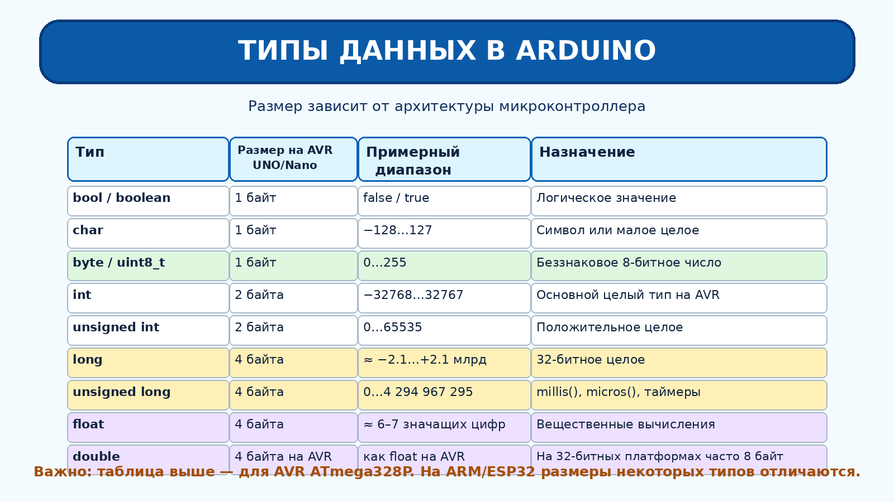

### Важное замечание о размерах типов

В исходном материале размеры типов приведены для классических Arduino на **AVR**, например Arduino Uno/Nano с ATmega328P. На 32-разрядных контроллерах ARM Cortex-M, ESP32 и других платформах размеры некоторых типов отличаются.

Например:

- на AVR `int` обычно 16-битный;
- на многих 32-битных МК `int` — 32-битный;
- на AVR `double` обычно имеет ту же точность, что и `float`;
- на многих 32-битных платформах `double` — 64-битный.

Для аппаратно-зависимого кода удобно использовать типы фиксированной ширины:

```cpp
uint8_t
int16_t
uint32_t
```

---

## 3. Глобальные и локальные переменные

### Глобальная переменная

Объявляется вне функций:

```cpp
int counter = 0;

void setup() {
}

void loop() {
    counter++;
}
```

Доступна функциям программы в пределах области видимости.

### Локальная переменная

Создается внутри функции или блока:

```cpp
void myFunction() {
    int value = 25;
}
```

После выхода из блока локальная автоматическая переменная перестает быть доступной.

Следует предпочитать локальные переменные там, где глобальный доступ не требуется: это уменьшает количество скрытых зависимостей в программе.

---

## 4. Константы

Константа с типом:

```cpp
const int ledPin = 13;
```

Препроцессорная подстановка:

```cpp
#define LED_PIN 13
```

Для обычных числовых и логических констант в C++ чаще удобнее `const` или `constexpr`, поскольку они имеют тип и лучше контролируются компилятором.

Пример:

```cpp
const unsigned long BLINK_INTERVAL = 500;
```

---

## 5. Арифметические и математические операции

Основные операторы:

| Оператор | Назначение |
|---|---|
| `+` | сложение |
| `-` | вычитание |
| `*` | умножение |
| `/` | деление |
| `%` | остаток от целочисленного деления |
| `++` | увеличить на 1 |
| `--` | уменьшить на 1 |

Составные операции:

```cpp
x += a;
x -= a;
x *= a;
x /= a;
```

Стандартные математические функции, доступные в Arduino:

```cpp
pow(x, a);
sq(x);
sqrt(x);
abs(x);
sin(x);
cos(x);
tan(x);
round(x);
ceil(x);
floor(x);
```

### Целочисленное деление

```cpp
int a = 5 / 2;       // 2
float b = 5.0 / 2.0; // 2.5
```

Тип операндов определяет способ выполнения операции.

---

## 6. Символы и ASCII

При работе с последовательным портом важно отличать **число** от **символа**.

Например, символ `'1'` хранится не как число `1`, а как код ASCII `49`.

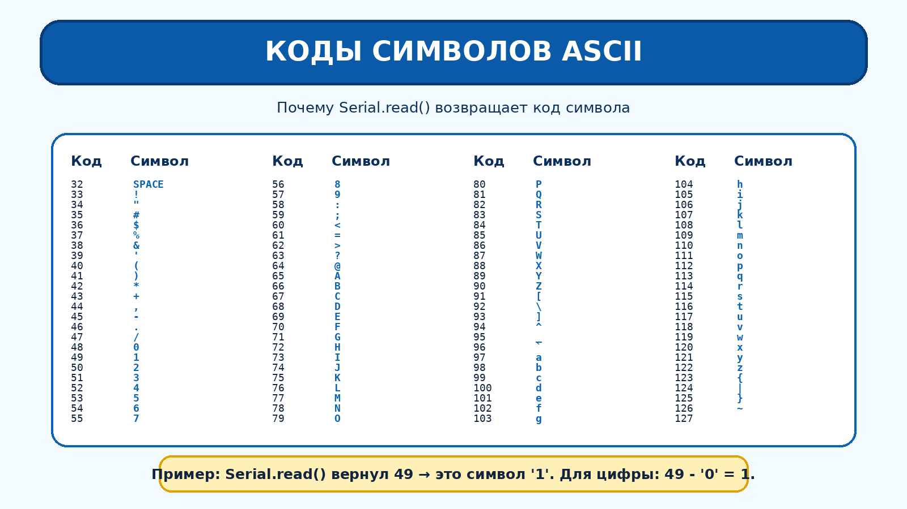

```cpp
char c = Serial.read();

if (c == '1') {
    // пользователь отправил символ 1
}
```

Если известно, что пришла одна десятичная цифра:

```cpp
int digit = Serial.read() - '0';
```

---

## 7. Условный оператор `if`

Простейшая форма:

```cpp
if (condition) {
    // выполняется, если condition истинно
}
```

Ветвление:

```cpp
if (condition) {
    // да
} else {
    // нет
}
```

Несколько вариантов:

```cpp
if (value < 10) {
    // ...
} else if (value < 20) {
    // ...
} else {
    // ...
}
```

### Операторы сравнения

```text
==   равно
!=   не равно
>    больше
<    меньше
>=   больше или равно
<=   меньше или равно
```

### Логические операторы

```text
&&   логическое И
||   логическое ИЛИ
!    логическое НЕ
```

Пример:

```cpp
if (temperature > 30 && fanEnabled) {
    digitalWrite(FAN_PIN, HIGH);
}
```

### Побитовые операторы

Они работают не с логическими условиями целиком, а с отдельными битами целого числа:

```text
&    AND
|    OR
^    XOR
~    NOT
<<   сдвиг влево
>>   сдвиг вправо
```

---

## 8. Пример: изменение частоты мигания через Serial

В исходной лекции рассматривается программа, которая меняет задержку мигания встроенного светодиода в зависимости от команды, принятой с компьютера.

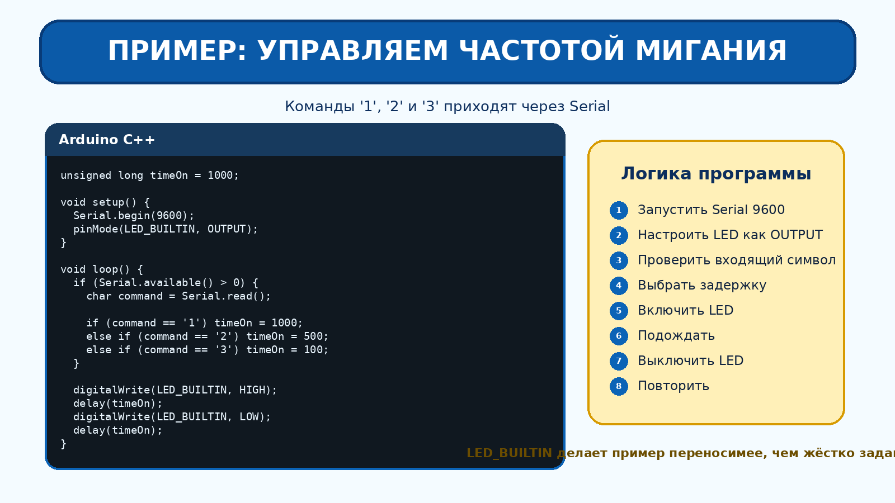

Алгоритм этой программы удобно представить так:

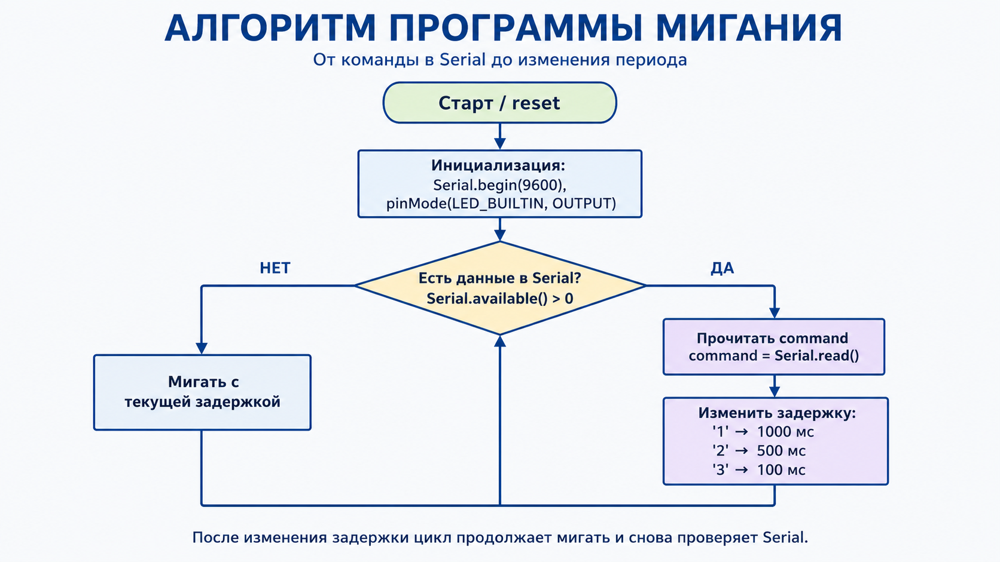

Главная идея:

- `'1'` — медленное мигание;
- `'2'` — средняя скорость;
- `'3'` — быстрое мигание.

В учебном примере используется `delay()`, потому что он хорошо демонстрирует последовательность выполнения. Для реальных многозадачных скетчей ниже рассмотрен более удобный вариант на `millis()`.

---

## 9. Оператор `switch ... case`

Когда одна переменная сравнивается с несколькими фиксированными вариантами, `switch` часто делает программу понятнее длинной цепочки `if ... else if`.

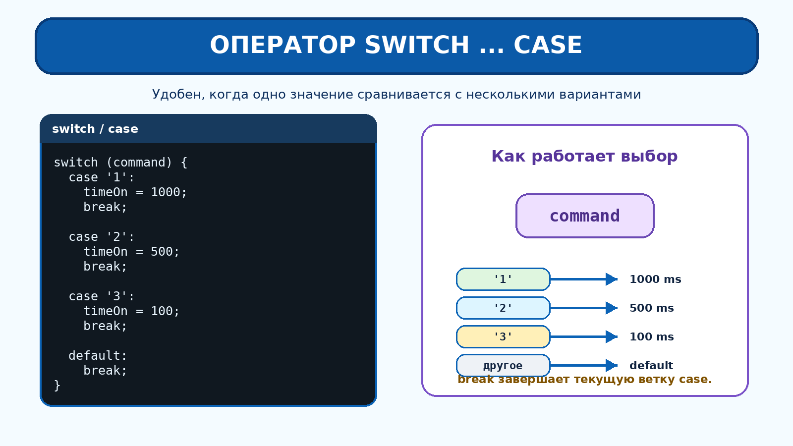

Общая форма:

```cpp
switch (value) {
    case 1:
        // ...
        break;

    case 2:
        // ...
        break;

    default:
        // ...
        break;
}
```

`break` завершает текущую ветку. Если его убрать, выполнение может продолжиться со следующего `case`.

---

## 10. Задержки и системные таймеры

### `delay()`

```cpp
delay(1000);
```

Останавливает выполнение текущего потока скетча примерно на 1000 мс.

Это удобно для простейших примеров, но во время такой задержки код в `loop()` не может выполнять другие задачи.

### `delayMicroseconds()`

```cpp
delayMicroseconds(20);
```

Создает короткую задержку в микросекундах. Допустимые интервалы и точность зависят от платформы Arduino Core и частоты микроконтроллера.

### `millis()`

Возвращает число миллисекунд с момента запуска:

```cpp
unsigned long now = millis();
```

На классическом AVR значение `unsigned long` переполняется примерно через **49,7 суток**.

### `micros()`

Возвращает время в микросекундах. Для Arduino Uno разрешение традиционно составляет несколько микросекунд, а переполнение происходит примерно через 70 минут. На других платах характеристики могут отличаться.

### Неблокирующий таймер

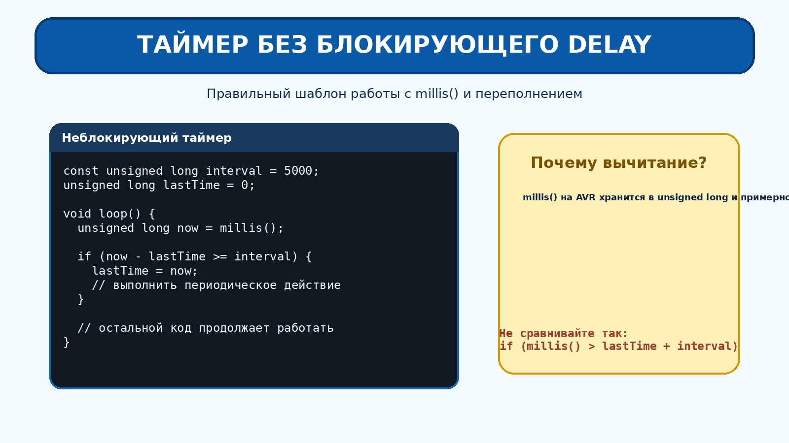

Рекомендуемый шаблон:

```cpp
if (millis() - lastTime >= interval) {
    lastTime = millis();
    // периодическое действие
}
```

Преимущество: основной цикл продолжает работать и может одновременно читать кнопки, Serial и датчики.

---

## 11. Циклы

### `for`

Используется, когда удобно явно задать счетчик:

```cpp
for (byte i = 0; i < 100; i++) {
    Serial.println(i);
}
```

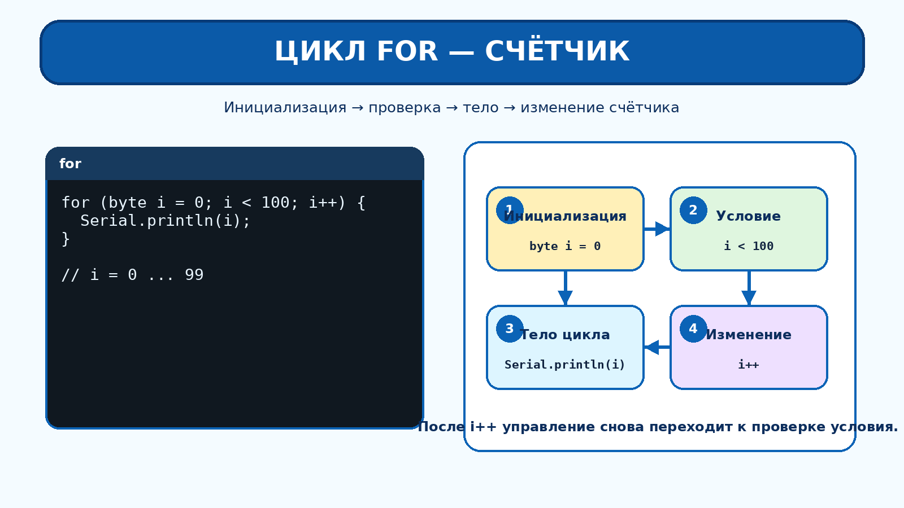

Структура:

```text
for (инициализация; условие; изменение)
```

### `while`

Сначала проверяет условие:

```cpp
while (condition) {
    // тело
}
```

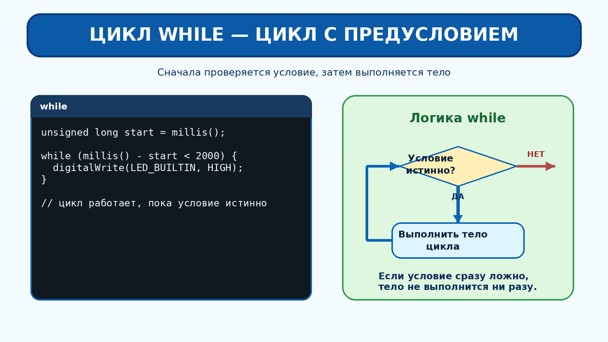

Если условие изначально ложно, тело не выполнится ни разу.

### `do ... while`

Сначала выполняет тело, затем проверяет условие:

```cpp
do {
    // тело
} while (condition);
```

Поэтому тело выполняется **минимум один раз**.

---

## 12. `break` и `continue`

### `break`

Немедленно завершает цикл:

```cpp
for (byte i = 0; i < 100; i++) {
    if (i > 50) {
        break;
    }

    Serial.println(i);
}
```

### `continue`

Пропускает оставшуюся часть текущей итерации:

```cpp
for (byte i = 0; i < 100; i++) {
    if (i > 50 && i < 60) {
        continue;
    }

    Serial.println(i);
}
```

---

## 13. Подключение библиотек

Библиотека содержит готовые классы и функции для работы с устройством или алгоритмом.

В исходном материале показан классический способ добавления ZIP-библиотеки. В современных версиях Arduino IDE также удобно использовать **Library Manager**.

### Шаг 1. Открыть менеджер библиотек

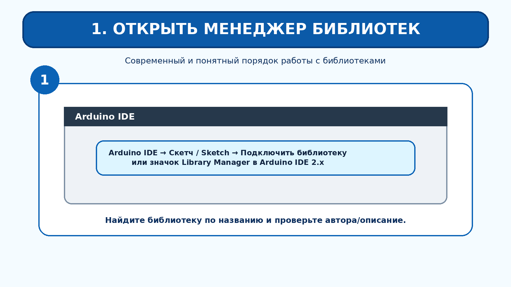

### Шаг 2. При необходимости установить ZIP

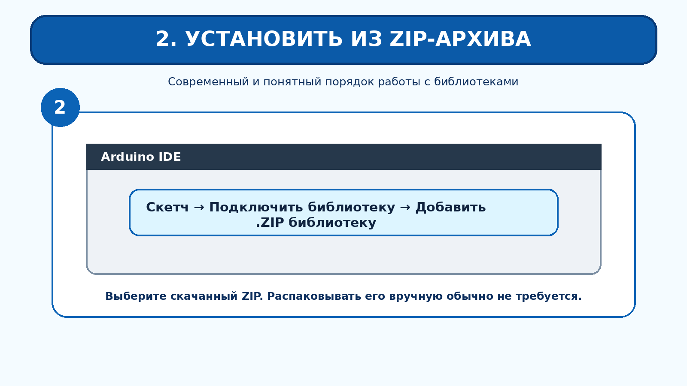

### Шаг 3. Подключить библиотеку

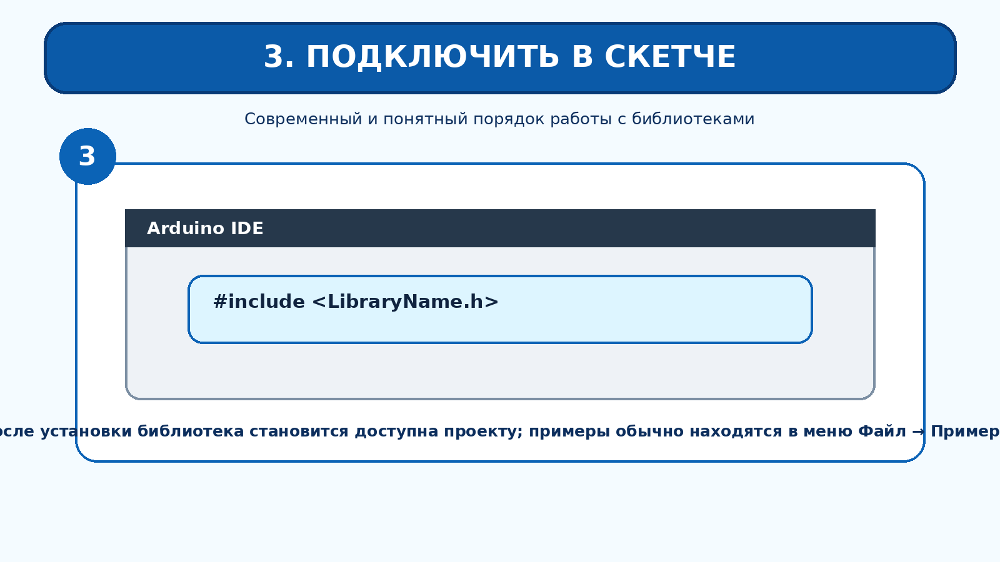

В скетче:

```cpp
#include <LibraryName.h>
```

Перед использованием сторонней библиотеки желательно проверить:

- для каких плат она предназначена;
- ее версию;
- примеры;
- наличие документации;
- совместимость с используемым Arduino Core.

---

## 14. Последовательный порт `Serial`

Arduino может обмениваться данными с ПК через USB. На компьютере это обычно отображается как **виртуальный последовательный порт**.

На Arduino Uno аппаратный UART микроконтроллера связан с выводами:

- `D0 / RX`;
- `D1 / TX`.

Поэтому при активном обмене через аппаратный `Serial` использование этих контактов для другой периферии может создавать конфликт.

Запуск:

```cpp
void setup() {
    Serial.begin(9600);
}
```

Скорость в мониторе порта должна соответствовать скорости, указанной в `Serial.begin()`.

---

## 15. Прием данных через Serial

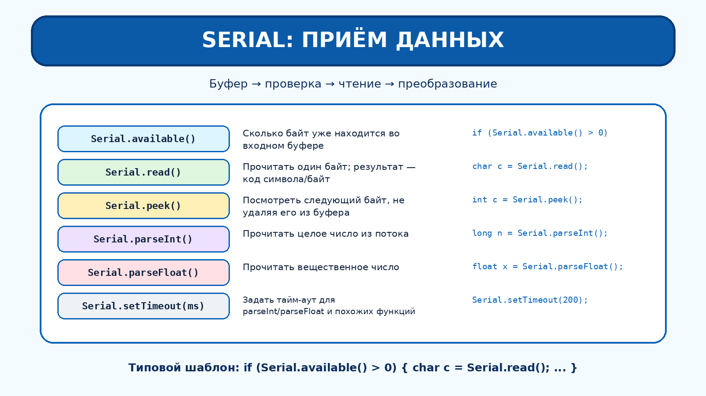

Типичный шаблон:

```cpp
if (Serial.available() > 0) {
    char c = Serial.read();
    Serial.println(c);
}
```

Входящие данные накапливаются в буфере. Размер буфера зависит от Arduino Core и конкретной платформы; число `64 байта`, приведенное в исходном материале, характерно для ряда классических AVR-конфигураций, но не является универсальным правилом.

---

## 16. Вывод данных через Serial

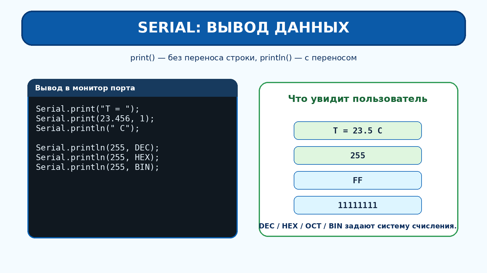

```cpp
Serial.print("Value = ");
Serial.println(value);
```

Форматирование:

```cpp
Serial.println(value, DEC);
Serial.println(value, HEX);
Serial.println(value, OCT);
Serial.println(value, BIN);
```

Для вещественного числа второй параметр может задавать количество знаков после десятичной точки:

```cpp
Serial.println(3.14159, 2);  // 3.14
```

---

## 17. Дополнительные функции Serial

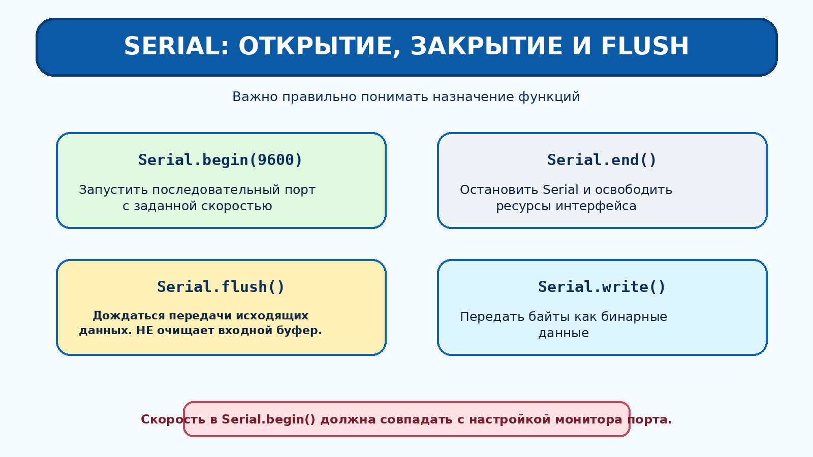

Особенно важно правильно понимать:

```cpp
Serial.flush();
```

В современных Arduino Core эта функция **ожидает завершения передачи исходящих данных**. Она не предназначена для очистки входного буфера.

Если нужно удалить непрочитанные входящие данные, их можно явно прочитать:

```cpp
while (Serial.available() > 0) {
    Serial.read();
}
```

---

## 18. Работа с цифровыми портами

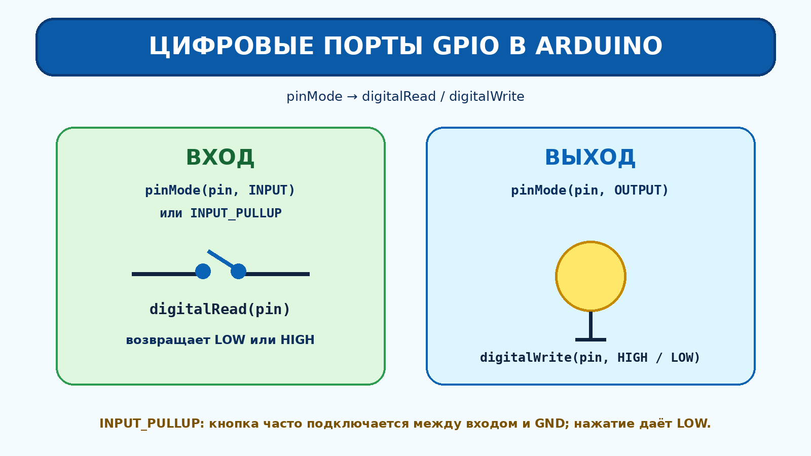

Настройка режима:

```cpp
pinMode(pin, INPUT);
pinMode(pin, OUTPUT);
pinMode(pin, INPUT_PULLUP);
```

Управление выходом:

```cpp
digitalWrite(pin, HIGH);
digitalWrite(pin, LOW);
```

Чтение входа:

```cpp
int state = digitalRead(pin);
```

`INPUT_PULLUP` включает внутренний подтягивающий резистор. Типовая кнопка подключается между входом и `GND`; тогда:

- кнопка отпущена → `HIGH`;
- кнопка нажата → `LOW`.

Это важно учитывать в условии программы.

---

## 19. Аналоговый вход и ШИМ

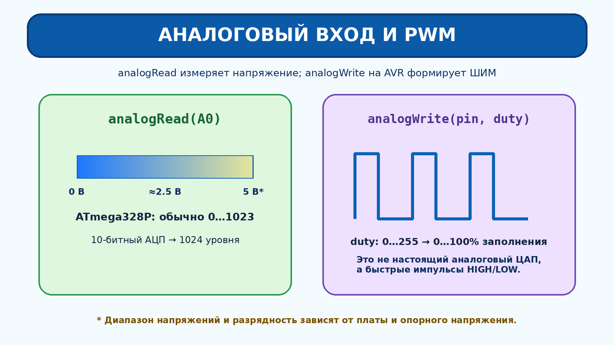

### `analogRead()`

Для Arduino Uno:

```cpp
int adc = analogRead(A0);
```

ATmega328P имеет 10-битный АЦП, поэтому функция обычно возвращает:

```text
0 ... 1023
```

Напряжение, соответствующее коду, зависит от опорного напряжения АЦП.

### `map()`

Линейно пересчитывает диапазон:

```cpp
long percent = map(adc, 0, 1023, 0, 100);
```

`map()` работает с целочисленной арифметикой.

### `constrain()`

Ограничивает значение:

```cpp
value = constrain(value, 0, 255);
```

### `analogWrite()`

На классических Arduino AVR эта функция обычно формирует **ШИМ**, а не настоящее аналоговое напряжение:

```cpp
analogWrite(9, 128);
```

`128` соответствует примерно 50% заполнения PWM.

Для Uno/Nano с ATmega328P PWM традиционно доступен на выводах:

```text
3, 5, 6, 9, 10, 11
```

Для других плат список выводов необходимо смотреть в документации.

---

## 20. Пользовательские функции

Функция без аргументов и без возвращаемого результата:

```cpp
void hello() {
    Serial.println("HELLO!");
}
```

Вызов:

```cpp
hello();
```

Функция с параметром:

```cpp
void printValue(int value) {
    Serial.println(value);
}
```

Функция, возвращающая результат:

```cpp
int mySum(int a, int b) {
    return a + b;
}
```

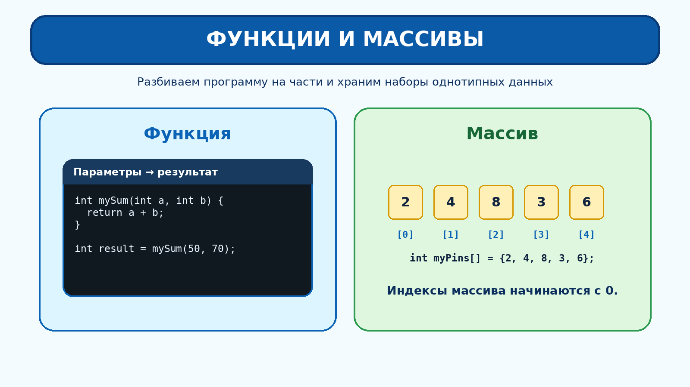

Функции позволяют:

- уменьшать повторение кода;
- разделять программу на логические модули;
- упрощать тестирование и сопровождение.

---

## 21. Псевдослучайные числа

```cpp
random(max);
random(min, max);
```

Верхняя граница в `random(min, max)` не включается.

```cpp
long x = random(0, 100);  // 0 ... 99
```

Начальное состояние генератора:

```cpp
randomSeed(value);
```

В учебных проектах иногда используют шум с неподключенного аналогового входа:

```cpp
randomSeed(analogRead(A0));
```

Это дает лишь простой источник изменяющегося значения и **не делает генератор криптографически безопасным**.

---

## 22. Массивы

Объявление:

```cpp
int values[6];
```

С начальным содержимым:

```cpp
int pins[] = {2, 4, 8, 3, 6};
```

Индексация начинается с **нуля**:

```text
pins[0] → 2
pins[1] → 4
...
pins[4] → 6
```

Заполнение массива:

```cpp
byte values[50];

for (byte i = 0; i < 50; i++) {
    values[i] = random(100);
}
```

Нельзя обращаться за пределы массива: это может повредить другие данные в SRAM.

---

## 23. Аппаратные прерывания

Прерывание позволяет микроконтроллеру быстро реагировать на внешнее событие, не проверяя вход на каждой итерации `loop()`.

В современном Arduino-коде удобно записывать:

```cpp
attachInterrupt(
    digitalPinToInterrupt(2),
    onButton,
    FALLING
);
```

Для Arduino Uno/Nano на ATmega328P внешние прерывания доступны на D2 и D3.

Основные режимы:

```text
LOW
CHANGE
RISING
FALLING
```

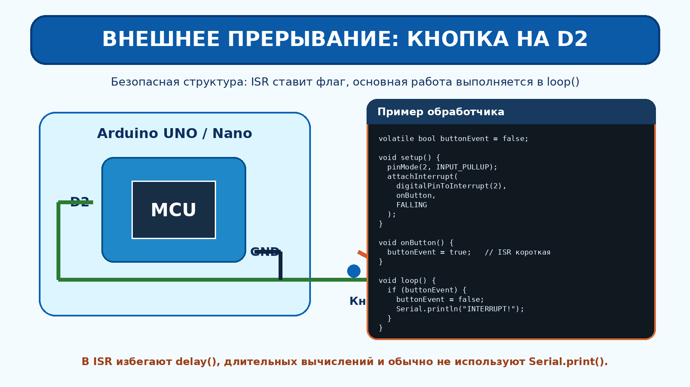

### Обработчик прерывания — ISR

Он должен быть максимально коротким.

Плохая практика:

```cpp
void onButton() {
    delay(1000);
    Serial.println("INTERRUPT");
}
```

Предпочтительно установить флаг:

```cpp
volatile bool buttonEvent = false;

void onButton() {
    buttonEvent = true;
}
```

А обработку выполнить в `loop()`.

Переменные, которыми обмениваются основной код и ISR, часто объявляют как `volatile`. Для многобайтных данных могут дополнительно потребоваться меры атомарности.

---

## 24. Что важно запомнить

1. Arduino-программа строится вокруг `setup()` и `loop()`.
2. Размеры типов данных зависят от архитектуры микроконтроллера.
3. `if`, `switch`, `for`, `while` и `do...while` формируют основную управляющую логику.
4. `delay()` прост, но блокирует выполнение основного алгоритма.
5. Для параллельной обработки нескольких задач предпочтительнее таймеры на `millis()`.
6. `Serial` используется для обмена с ПК и отладки.
7. `digitalRead/digitalWrite` работают с логическими уровнями.
8. `analogRead` выполняет аналого-цифровое преобразование.
9. `analogWrite` на Arduino Uno/Nano формирует PWM, а не постоянное аналоговое напряжение.
10. Функции и массивы помогают строить структурированные программы.
11. ISR должна выполняться быстро.
12. При программировании необходимо учитывать особенности конкретной платы и Arduino Core.

---

## 25. Вопросы для самопроверки

1. Для чего нужны `setup()` и `loop()`?
2. Чем локальная переменная отличается от глобальной?
3. Почему размер `int` нельзя считать одинаковым на всех Arduino-платформах?
4. Чем `const` отличается от `#define`?
5. В чем различие `=` и `==`?
6. Чем `&&` отличается от `&`?
7. Что вернет `Serial.read()`, если пользователь отправил символ `7`?
8. Когда удобнее использовать `switch`, а когда `if`?
9. Почему длительные `delay()` нежелательны?
10. Почему выражение `millis() - lastTime >= interval` устойчиво к переполнению?
11. Чем `while` отличается от `do...while`?
12. Для чего нужны `break` и `continue`?
13. Что делает `Serial.available()`?
14. Для чего применяется `Serial.flush()`?
15. Как работает `INPUT_PULLUP`?
16. Какой диапазон возвращает 10-битный ADC?
17. Что фактически генерирует `analogWrite()` на Arduino Uno?
18. С какого индекса начинается массив?
19. Почему обработчик прерывания должен быть коротким?
20. Для чего используется `volatile` при работе с ISR?

---

## 26. Практическое мини-задание

Напишите программу для Arduino Uno/Nano:

- кнопка подключена к D2 и GND в режиме `INPUT_PULLUP`;
- светодиод используется встроенный;
- короткое нажатие меняет режим мигания:
  - режим 1 — 1000 мс;
  - режим 2 — 500 мс;
  - режим 3 — 100 мс;
- для мигания нельзя использовать `delay()`;
- текущий режим выводится в Serial Monitor;
- прерывание должно только фиксировать факт нажатия, а смена режима выполняется в `loop()`.

Такое задание объединяет темы:

`GPIO + INPUT_PULLUP + interrupts + millis() + Serial + state machine`.

---

## Ключевые термины

**Sketch** — программа Arduino.  
**setup()** — однократная инициализация.  
**loop()** — основной повторяющийся цикл.  
**Variable** — переменная.  
**const** — типизированная константа.  
**ASCII** — система кодирования символов.  
**if / switch** — операторы ветвления.  
**for / while / do while** — циклы.  
**millis()** — системный счет времени в миллисекундах.  
**Serial** — последовательный интерфейс Arduino API.  
**GPIO** — цифровые входы/выходы.  
**ADC** — аналого-цифровой преобразователь.  
**PWM** — широтно-импульсная модуляция.  
**ISR** — обработчик прерывания.  
**volatile** — квалификатор для данных, способных изменяться вне обычного потока выполнения.
