# Лекция 4. Подключение и управление LCD1602 и сервоприводом

**Дисциплина:** Программирование микроконтроллеров  
**Специальность:** 09.02.01 Компьютерные системы и комплексы  
**Продолжительность:** 2 академических часа

## Цель лекции

На занятии рассматриваются два распространённых исполнительных устройства микроконтроллерной системы: символьный жидкокристаллический дисплей LCD1602 и позиционный сервопривод. После изучения темы студент должен уметь:

- подключать LCD1602 непосредственно и через адаптер I²C;
- объяснять назначение выводов дисплея и различие команд и данных;
- выводить текст и изменяющиеся числовые значения;
- объяснять устройство замкнутого контура сервопривода;
- формировать команды положения с помощью библиотеки `Servo`;
- правильно организовывать питание сервопривода;
- объединять дисплей, датчик и сервопривод в одной программе.

## 1. Символьный дисплей LCD1602

LCD1602 отображает две строки по 16 символов. Каждый знак формируется в матрице размером 5×8 точек. На большинстве модулей установлен контроллер, совместимый с HD44780. Он хранит коды отображаемых символов, формирует сигналы управления жидкокристаллической матрицей и принимает команды от микроконтроллера.

На фотографии показаны лицевая и обратная стороны типового модуля LCD1602. На обратной стороне расположены контроллер и контактная колодка.

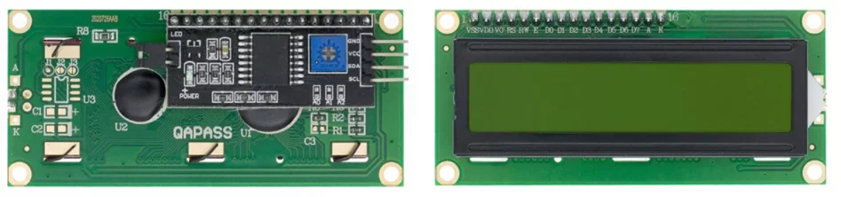

*Рисунок 1 — Модуль LCD1602 без адаптера I²C*

### 1.1. Память и формирование символов

Контроллер LCD использует несколько областей памяти:

- **DDRAM** хранит коды символов, выводимых на экран;
- **CGRAM** хранит до восьми пользовательских символов размером 5×8 точек;
- **CGROM** содержит стандартный набор знаков, записанный изготовителем.

Внутренняя DDRAM обычно рассчитана на большее количество позиций, чем физически отображается на LCD1602. Поэтому адреса начала строк могут быть не соседними: первая строка начинается с адреса `0x00`, вторая — с `0x40`. Библиотека скрывает эту особенность за методом `setCursor()`.

### 1.2. Назначение выводов LCD1602

| № | Обозначение | Назначение |
|---:|---|---|
| 1 | VSS | Общий провод GND |
| 2 | VDD | Питание, обычно +5 В |
| 3 | V0 или VEE | Настройка контрастности |
| 4 | RS | `0` — команда, `1` — данные символа |
| 5 | R/W | `0` — запись, `1` — чтение |
| 6 | E | Строб разрешения передачи |
| 7–14 | D0–D7 | Параллельная шина данных |
| 15 | A или LED+ | Анод подсветки |
| 16 | K или LED− | Катод подсветки |

Контрастность регулируют потенциометром примерно 10 кОм: крайние выводы соединяют с `5V` и `GND`, движок — с `V0`. Если контраст установлен неправильно, экран может казаться пустым или показывать только тёмные прямоугольники.

## 2. Подключение LCD1602 по параллельной шине

Контроллер HD44780 поддерживает 8- и 4-битный обмен. В 8-битном режиме байт передаётся сразу по линиям `D0–D7`. В 4-битном режиме используются только `D4–D7`: сначала передаются старшие четыре бита, затем младшие. Это уменьшает число занятых выводов Arduino.

Если линия `R/W` постоянно соединена с GND, для управления дисплеем достаточно шести выводов микроконтроллера: `RS`, `E` и `D4–D7`.

Пример соединений для Arduino Uno:

| LCD1602 | Arduino Uno |
|---|---|
| RS | D12 |
| E | D11 |
| D4 | D5 |
| D5 | D4 |
| D6 | D3 |
| D7 | D2 |
| R/W | GND |
| VSS, K | GND |
| VDD | 5V |
| V0 | Движок потенциометра 10 кОм |

На рисунке приведён вариант монтажа дисплея в 4-битном режиме. Перед включением необходимо ещё раз проверить питание, `R/W` и порядок линий `D4–D7`.

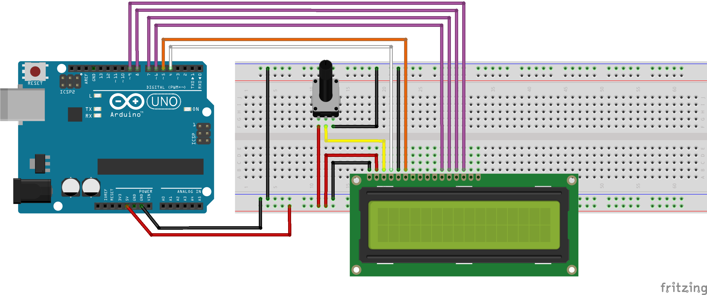

*Рисунок 2 — Подключение LCD1602 к Arduino Uno в 4-битном режиме*

### 2.1. Программа с библиотекой LiquidCrystal

```cpp
#include <LiquidCrystal.h>

// RS, E, D4, D5, D6, D7
LiquidCrystal lcd(12, 11, 5, 4, 3, 2);

void setup() {
  lcd.begin(16, 2);
  lcd.print("LCD1602 ready");

  lcd.setCursor(0, 1);
  lcd.print("Parallel mode");
}

void loop() {
}
```

Метод `begin(16, 2)` сообщает библиотеке геометрию дисплея. Координаты в `setCursor(column, row)` отсчитываются от нуля, поэтому первая позиция второй строки задаётся как `setCursor(0, 1)`.

## 3. Подключение LCD1602 через I²C

Адаптер на микросхеме PCF8574 преобразует команды I²C в восемь параллельных сигналов. Часть выходов управляет линиями `RS`, `E`, `D4–D7` и подсветкой. Arduino использует только две сигнальные линии: `SDA` и `SCL`.

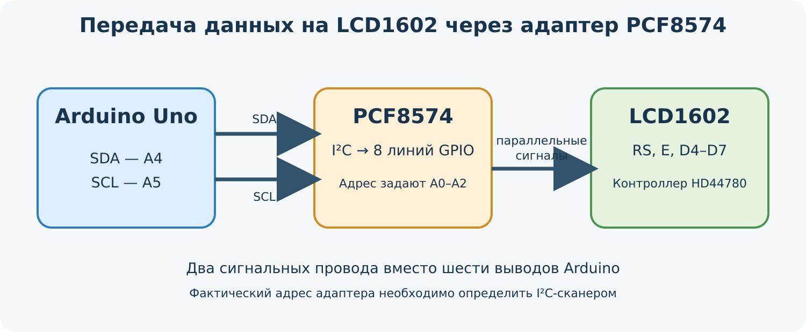

*Рисунок 3 — Преобразование интерфейса I²C в параллельные сигналы LCD1602*

Для Arduino Uno и классической Arduino Nano применяют следующие соединения:

| Адаптер LCD | Arduino Uno/Nano |
|---|---|
| SDA | A4 |
| SCL | A5 |
| VCC | 5V |
| GND | GND |

Расположение `SDA` и `SCL` зависит от конкретной платы. Перед подключением другой модели Arduino необходимо проверить её распиновку.

На рисунке показана минимальная схема соединения дисплея с адаптером I²C.

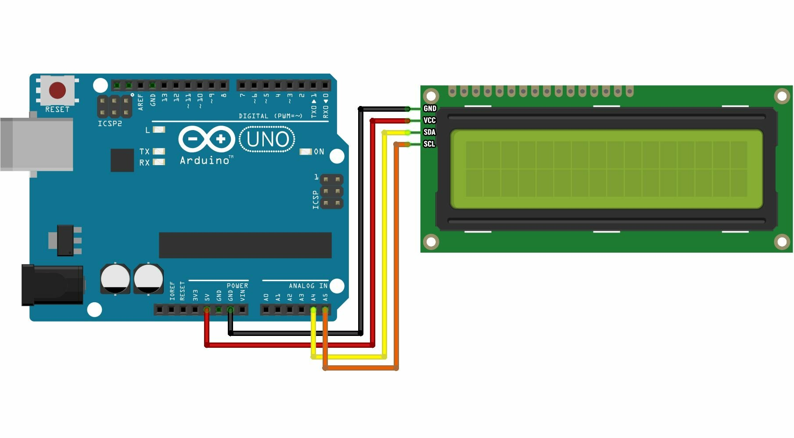

*Рисунок 4 — LCD1602 с адаптером I²C и Arduino Uno*

### 3.1. Адрес адаптера

Адрес определяется состоянием выводов `A0–A2` микросхемы PCF8574 и её модификацией. Часто встречаются `0x27` и `0x3F`, но полагаться только на эти значения нельзя. Адрес следует определить I²C-сканером.

```cpp
#include <Wire.h>

void setup() {
  Serial.begin(9600);
  Wire.begin();

  for (byte address = 1; address < 127; address++) {
    Wire.beginTransmission(address);
    if (Wire.endTransmission() == 0) {
      Serial.print("I2C device: 0x");
      if (address < 16) Serial.print('0');
      Serial.println(address, HEX);
    }
  }
}

void loop() {
}
```

### 3.2. Установка библиотеки

В Arduino IDE библиотеку устанавливают через менеджер библиотек. Для прямого подключения используется стандартная `LiquidCrystal`. Для адаптера I²C существует несколько библиотек с похожим названием `LiquidCrystal_I2C`; их программные интерфейсы могут незначительно различаться.

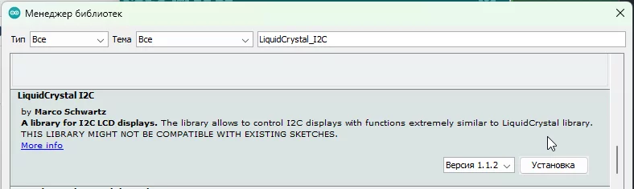

*Рисунок 5 — Установка библиотеки LiquidCrystal_I2C через менеджер библиотек*

### 3.3. Вывод текста через I²C

```cpp
#include <Wire.h>
#include <LiquidCrystal_I2C.h>

LiquidCrystal_I2C lcd(0x27, 16, 2);

void setup() {
  lcd.init();       // В некоторых версиях используется begin()
  lcd.backlight();

  lcd.setCursor(0, 0);
  lcd.print("I2C LCD1602");
  lcd.setCursor(0, 1);
  lcd.print("Address 0x27");
}

void loop() {
}
```

### 3.4. Основные методы библиотек LCD

| Метод | Назначение |
|---|---|
| `begin()` или `init()` | Инициализация дисплея |
| `clear()` | Очистка экрана и возврат курсора в начало |
| `home()` | Возврат курсора без удаления текста |
| `setCursor(x, y)` | Выбор позиции вывода |
| `print(value)` | Вывод текста или числа |
| `write(code)` | Вывод символа по коду |
| `cursor()` / `noCursor()` | Показать или скрыть подчёркивание курсора |
| `blink()` / `noBlink()` | Включить или выключить мигание курсора |
| `display()` / `noDisplay()` | Включить или скрыть содержимое без удаления DDRAM |
| `scrollDisplayLeft()` | Сдвинуть изображение влево |
| `scrollDisplayRight()` | Сдвинуть изображение вправо |
| `createChar()` | Записать пользовательский знак в CGRAM |

Команды `clear()` и `home()` выполняются заметно дольше большинства остальных команд HD44780. Библиотека учитывает требуемые задержки, но при самостоятельной низкоуровневой реализации их нельзя игнорировать.

### 3.5. Обновление изменяющегося значения

Если новое число содержит меньше цифр, чем предыдущее, часть старого значения может остаться на экране. Один из способов — допечатать пробелы.

```cpp
void printAngle(int angle) {
  lcd.setCursor(0, 1);
  lcd.print("Angle: ");
  lcd.print(angle);
  lcd.print(" deg   ");
}
```

Частая полная очистка экрана командой `clear()` вызывает заметное мерцание, поэтому лучше обновлять только изменяемое поле.

## 4. Устройство сервопривода

Хобби-сервопривод содержит двигатель постоянного тока, редуктор, датчик положения и электронный контроллер. Контроллер сравнивает требуемое положение с фактическим и изменяет направление и мощность двигателя до уменьшения ошибки.

На рисунке показано внутреннее устройство сервопривода: двигатель передаёт вращение через редуктор, потенциометр измеряет угол выходного вала, а электронная плата замыкает контур обратной связи.

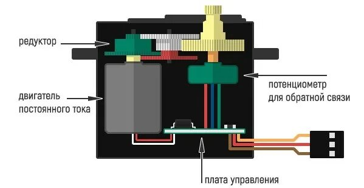

*Рисунок 6 — Основные узлы позиционного сервопривода*

Сервоприводы различаются размерами, напряжением питания, допустимым током, моментом, скоростью, материалом редуктора и диапазоном углов.

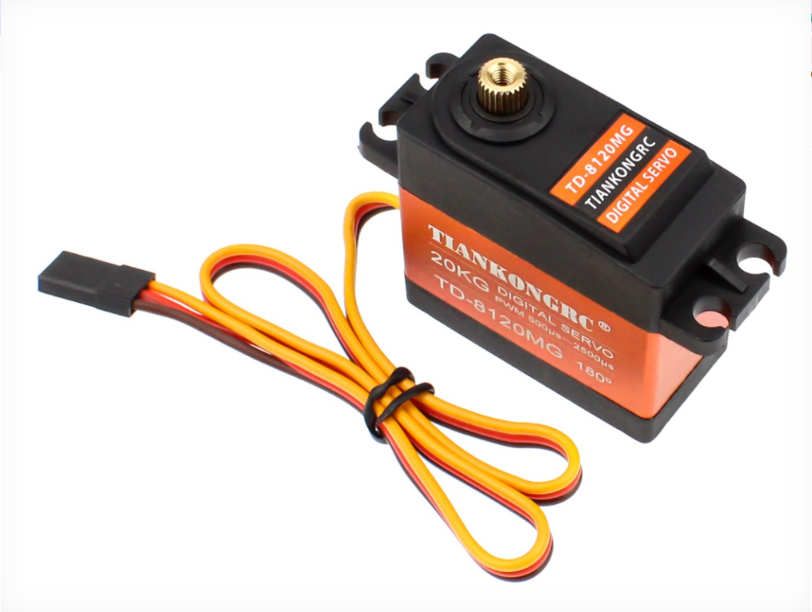

*Рисунок 7 — Сервопривод стандартного размера*

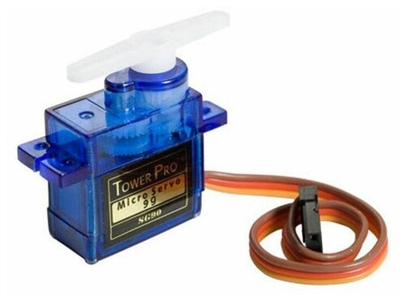

*Рисунок 8 — Микросервопривод для малых нагрузок*

## 5. Управляющий сигнал сервопривода

Позиционный сервопривод получает периодические импульсы. Для распространённых моделей период составляет примерно 20 мс, то есть частота повторения около 50 Гц. Требуемое положение кодируется длительностью высокого уровня.

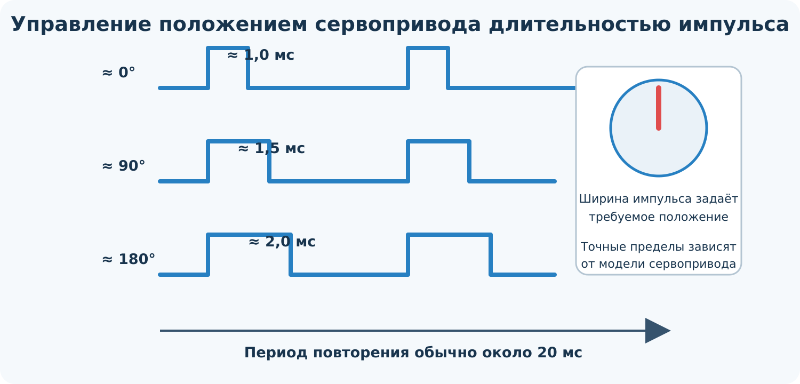

*Рисунок 9 — Связь длительности управляющего импульса и положения вала*

Типовые ориентировочные значения:

| Длительность импульса | Положение |
|---:|---:|
| около 1000 мкс | около 0° |
| около 1500 мкс | среднее положение |
| около 2000 мкс | около 180° |

Эти значения не являются универсальными. Некоторые сервоприводы используют более широкий диапазон, например 500–2400 мкс, а фактический механический ход может быть меньше 180°. Перед калибровкой необходимо изучить документацию и начинать с безопасного диапазона, чтобы не упереть редуктор в механический ограничитель.

## 6. Подключение и питание сервопривода

Типовой сервопривод имеет три провода:

- красный — положительный вывод питания;
- коричневый или чёрный — GND;
- оранжевый, жёлтый или белый — управляющий сигнал.

Небольшой сервопривод без нагрузки иногда работает от линии 5 В отладочной платы, но такое соединение ненадёжно. При запуске, резком изменении направления или заклинивании ток двигателя возрастает. Это вызывает падение напряжения, перезапуск Arduino, дрожание привода и помехи на дисплее.

Для практической схемы рекомендуется отдельный источник питания сервопривода. Землю источника необходимо соединить с GND Arduino, иначе уровни управляющего сигнала не имеют общей точки отсчёта.

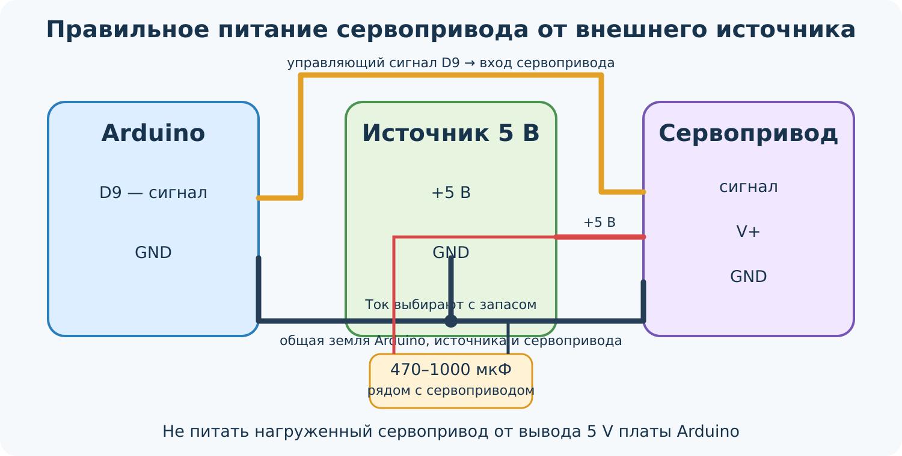

*Рисунок 10 — Подключение сервопривода к внешнему источнику с общей землёй*

Электролитический конденсатор 470–1000 мкФ рядом с сервоприводом уменьшает кратковременные провалы напряжения, но не заменяет источник с достаточным током.

Сигнальный провод можно подключить к поддерживаемому библиотекой цифровому выводу. Наличие символа `~` около номера вывода Arduino не является обязательным условием для библиотеки `Servo`.

## 7. Библиотека Servo

| Метод | Назначение |
|---|---|
| `attach(pin)` | Подключить объект к выводу |
| `attach(pin, min, max)` | Задать границы импульсов для 0° и 180° |
| `write(angle)` | Задать положение в условных градусах |
| `writeMicroseconds(us)` | Задать длительность импульса непосредственно |
| `read()` | Получить последнее заданное значение угла |
| `attached()` | Проверить, подключён ли объект к выводу |
| `detach()` | Прекратить формирование импульсов |

Метод `read()` не считывает физический угол с потенциометра сервопривода. Он возвращает последнюю команду, переданную библиотеке. Обычный трёхпроводный хобби-серво не передаёт фактическое положение в Arduino.

### 7.1. Плавное перемещение

```cpp
#include <Servo.h>

Servo servo;

void setup() {
  servo.attach(9);
}

void loop() {
  for (int angle = 0; angle <= 180; angle++) {
    servo.write(angle);
    delay(15);
  }

  for (int angle = 180; angle >= 0; angle--) {
    servo.write(angle);
    delay(15);
  }
}
```

Задержка в 15 мс определяет скорость изменения команды, но не гарантирует, что вал успеет занять каждое положение. Реальная скорость зависит от модели, питания и нагрузки.

## 8. Совместная работа LCD1602 и сервопривода

В общей системе Arduino формирует команду положения сервопривода и выводит это заданное значение на LCD1602. Дисплей подключён по I²C, поэтому занимает только `SDA` и `SCL`.

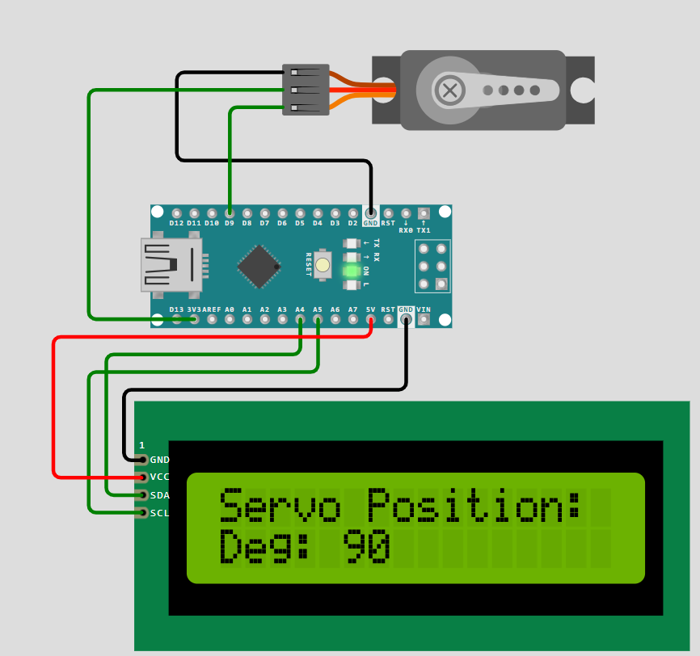

*Рисунок 11 — Пример системы с LCD1602, адаптером I²C и сервоприводом*

```cpp
#include <Wire.h>
#include <LiquidCrystal_I2C.h>
#include <Servo.h>

LiquidCrystal_I2C lcd(0x27, 16, 2);
Servo servo;

void showAngle(int angle) {
  lcd.setCursor(0, 1);
  lcd.print("Angle: ");
  lcd.print(angle);
  lcd.print(" deg   ");
}

void setup() {
  lcd.init();
  lcd.backlight();
  lcd.print("Servo command");

  servo.attach(9);
}

void loop() {
  for (int angle = 0; angle <= 180; angle += 45) {
    servo.write(angle);
    showAngle(angle);
    delay(1000);
  }
}
```

Надпись `Angle` в данном примере означает заданную команду, а не независимо измеренный фактический угол.

## 9. Управление сервоприводом потенциометром

Потенциометр формирует напряжение от 0 до 5 В, которое АЦП Arduino Uno преобразует в число от 0 до 1023. Функция `map()` переводит это значение в диапазон углов.

```cpp
#include <Wire.h>
#include <LiquidCrystal_I2C.h>
#include <Servo.h>

LiquidCrystal_I2C lcd(0x27, 16, 2);
Servo servo;

const byte POT_PIN = A0;
const byte SERVO_PIN = 9;

int previousAngle = -1;

void setup() {
  lcd.init();
  lcd.backlight();
  servo.attach(SERVO_PIN);
}

void loop() {
  int adc = analogRead(POT_PIN);
  int angle = map(adc, 0, 1023, 0, 180);

  if (abs(angle - previousAngle) >= 2) {
    servo.write(angle);

    lcd.setCursor(0, 0);
    lcd.print("ADC: ");
    lcd.print(adc);
    lcd.print("    ");

    lcd.setCursor(0, 1);
    lcd.print("Angle: ");
    lcd.print(angle);
    lcd.print(" deg   ");

    previousAngle = angle;
  }

  delay(30);
}
```

Порог в два градуса уменьшает дрожание команды из-за шума АЦП. В более точной системе применяют усреднение измерений или цифровой фильтр.

## 10. Типичные неисправности

| Признак | Возможная причина | Проверка и устранение |
|---|---|---|
| LCD светится, но текста нет | Неверный контраст | Настроить потенциометр V0 |
| Видны прямоугольники | Дисплей не инициализирован | Проверить код, RS, E и D4–D7 |
| I²C-дисплей не отвечает | Неверный адрес | Запустить I²C-сканер |
| Текст искажён | Перепутаны линии или нестабильное питание | Проверить монтаж и GND |
| Серво дёргается | Слабый источник или шум команды | Использовать внешний источник, конденсатор и фильтрацию |
| Arduino перезапускается | Просадка питания при движении серво | Разделить питание и объединить земли |
| Серво гудит у края | Команда выходит за механический диапазон | Ограничить углы или импульсы |
| LCD мерцает | Экран постоянно очищается | Обновлять только изменяемое поле |

## 11. Контрольные вопросы

1. Для чего служат линии `RS`, `R/W` и `E` дисплея?
2. Почему в 4-битном режиме байт передаётся за два цикла?
3. Какие выводы Arduino Uno используются для I²C?
4. Почему адрес адаптера LCD необходимо проверять сканером?
5. Чем `print()` отличается от `write()`?
6. Почему частая команда `clear()` вызывает мерцание?
7. Какие узлы образуют замкнутый контур сервопривода?
8. Какая характеристика импульса задаёт положение сервопривода?
9. Почему библиотека `Servo` не требует именно аппаратного PWM-вывода?
10. Для чего объединяют GND Arduino и внешнего источника питания?
11. Почему `servo.read()` не является измерением фактического угла?
12. Как уменьшить дрожание сервопривода при управлении потенциометром?

## 12. Задание для самостоятельной работы

Разработайте систему, в которой потенциометр на входе `A0` задаёт положение сервопривода, а LCD1602 с адаптером I²C отображает:

- в первой строке — значение АЦП от 0 до 1023;
- во второй строке — заданный угол от 0 до 180°.

В отчёте приведите:

1. структурную и монтажную схемы;
2. адрес I²C-адаптера, найденный сканером;
3. программу с комментариями;
4. объяснение организации питания;
5. результаты проверки для пяти положений потенциометра;
6. перечень выявленных ошибок и способы их устранения.

## Источники

1. [Arduino LiquidCrystal Library](https://github.com/arduino-libraries/LiquidCrystal).
2. [Texas Instruments PCF8574 Remote 8-Bit I/O Expander](https://www.ti.com/lit/ds/symlink/pcf8574.pdf).
3. Hitachi HD44780U Dot Matrix Liquid Crystal Display Controller Driver — техническое описание контроллера.
4. Arduino Servo Library — справочник по методам `attach()`, `write()` и `writeMicroseconds()`.

