# Лекция 1. Основы архитектуры микроконтроллеров

**Курс:** МДК.02.02 «Программирование микроконтроллеров»  
**Тема:** основы архитектуры микроконтроллеров, семейство AVR/ATmega, платформа Arduino  
**Базовая учебная плата:** Arduino UNO R3 на ATmega328P

> Материал подготовлен на основе исходной презентации «Лекция 1. Общие сведения о МК». Рисунки и скриншоты из презентации сохранены без перерисовки. В текст добавлены пояснения, а устаревшие инструкции по Arduino IDE отделены от актуального порядка работы.

---

## Цели лекции

После изучения материала студент должен:

- объяснять, что такое микроконтроллер и чем он отличается от микропроцессора;
- называть основные семейства микроконтроллеров и области их применения;
- описывать назначение ядра, памяти, шин и периферийных блоков микроконтроллера;
- понимать особенности 8-разрядных AVR-микроконтроллеров на примере ATmega328P;
- ориентироваться в основных узлах платы Arduino UNO R3;
- безопасно подключать питание и простые внешние устройства;
- настроить Arduino IDE, выбрать плату и порт и загрузить первую программу.

## План

1. Понятие микроконтроллера.
2. История развития микроконтроллеров.
3. Основные семейства микроконтроллеров.
4. Архитектура микроконтроллера.
5. Архитектура AVR и ATmega328P.
6. Платформа Arduino и Arduino UNO R3.
7. Питание, память, входы и выходы Arduino UNO.
8. Подготовка Arduino IDE и первая программа.

---

# 1. Что такое микроконтроллер

**Микроконтроллер** (англ. *Microcontroller Unit*, MCU) — это микропроцессорная вычислительная система, выполненная, как правило, на одном кристалле и предназначенная для программного управления электронным устройством.

В одном корпусе микроконтроллера обычно объединены:

- вычислительное ядро **CPU**;
- память программы **Flash**;
- оперативная память **RAM/SRAM**;
- энергонезависимая память данных **EEPROM** или ее функциональный аналог;
- цифровые порты ввода-вывода **GPIO**;
- таймеры и счетчики;
- система прерываний;
- аналого-цифровой преобразователь **АЦП (ADC)**;
- последовательные интерфейсы связи **UART, SPI, I2C**;
- система тактирования и сброса;
- в более функциональных моделях — ЦАП, USB, CAN, Ethernet, Wi‑Fi, Bluetooth и другие модули.

Именно высокая степень интеграции делает микроконтроллер удобной основой для встраиваемых систем: датчиков, контроллеров станков, бытовой техники, автомобильной электроники, робототехники, измерительных устройств и IoT-узлов.

## 1.1. Микроконтроллер и микропроцессор — не одно и то же

| Признак | Микроконтроллер | Микропроцессор |
|---|---|---|
| Основное назначение | Управление конкретным устройством | Универсальные вычисления |
| Память | Обычно встроена в кристалл | Часто используется внешняя память |
| Периферия | GPIO, таймеры, ADC, UART и др. встроены | Значительная часть периферии внешняя |
| Энергопотребление | Обычно низкое | Обычно выше |
| Типичная ОС | Программа без ОС или RTOS | Linux, Windows и др. |
| Примеры | ATmega328P, STM32, ESP32 | x86-64 CPU, мощные ARM-процессоры |

> **Главная идея:** микроконтроллер — это не просто процессор. Это небольшая законченная вычислительная система, ориентированная на управление внешним миром.

---

# 2. История развития микроконтроллеров

Ниже сохранена исходная схема из презентации.

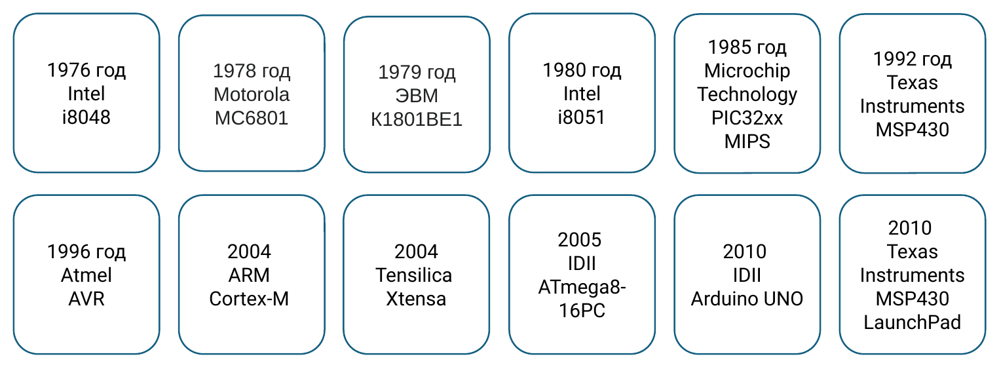

> **Примечание к исходной схеме.** Она полезна как иллюстрация развития отрасли, но не должна использоваться как строгая хронологическая таблица конкретных моделей: на ней в одном ряду смешаны даты появления архитектур, семейств, отдельных микросхем и отладочных платформ.

Ключевые этапы развития можно представить так:

- **1970-е** — появление первых однокристальных управляющих вычислительных систем; характерный пример — Intel 8048.
- **1980-е** — широкое распространение 8-разрядных архитектур, в том числе Intel 8051 и семейства PIC.
- **1990-е** — развитие энергоэффективных 16-разрядных MSP430 и появление AVR.
- **2000-е** — быстрый переход в массовых встроенных системах к 32-разрядным архитектурам, прежде всего ARM Cortex-M.
- **2010-е** — рост Arduino, недорогих Wi‑Fi/Bluetooth-контроллеров ESP и IoT-платформ.
- **2020-е** — расширение применения открытой архитектуры RISC‑V и появление все более производительных MCU с аппаратными средствами безопасности, DSP, AI/ML-ускорением и развитой беспроводной связью.

---

# 3. Основные семейства микроконтроллеров

## 3.1. 8-разрядные микроконтроллеры

### AVR

AVR — одно из наиболее известных 8-разрядных семейств. Исторически разработано компанией Atmel, в настоящее время относится к продуктам Microchip.

Характерные особенности:

- простая и понятная архитектура;
- RISC-набор команд;
- развитая периферия;
- большое количество учебных материалов;
- широкое применение в классических платах Arduino.

Пример: **ATmega328P** — микроконтроллер Arduino UNO R3.

### PIC

PIC — большое семейство Microchip, в которое входят решения различной разрядности и производительности. Контроллеры применяются в бытовой, промышленной и автомобильной электронике.

### 8051

Архитектура 8051 — классическая 8-разрядная архитектура, которая до сих пор встречается в учебных и специализированных промышленных микроконтроллерах.

## 3.2. 16-разрядные микроконтроллеры

### MSP430

MSP430 компании Texas Instruments ориентированы на малое энергопотребление и хорошо подходят для:

- автономных измерительных приборов;
- батарейных устройств;
- датчиков;
- систем длительного мониторинга.

## 3.3. 32-разрядные микроконтроллеры

### ARM Cortex-M

ARM Cortex-M — один из наиболее распространенных классов процессорных ядер для микроконтроллеров.

Типичные варианты:

- **Cortex-M0/M0+** — простые и энергоэффективные системы;
- **Cortex-M3** — универсальные управляющие задачи;
- **Cortex-M4** — DSP-инструкции и, во многих реализациях, аппаратная работа с числами с плавающей точкой;
- **Cortex-M7** — высокая производительность для сложного управления и обработки сигналов;
- современные Cortex-M23/M33/M55 и другие — расширенные средства безопасности и обработки данных.

Микроконтроллеры STM32 компании STMicroelectronics являются одним из наиболее известных примеров ARM Cortex-M платформ.

### ESP8266 / ESP32

Микроконтроллеры Espressif популярны в IoT за счет встроенных средств беспроводной связи. Классические ESP32 используют ядра Xtensa, а часть более новых семейств ESP32 построена на RISC‑V.

### RISC-V

**RISC‑V** — открытая расширяемая система команд. Она применяется как в учебных и недорогих MCU, так и в более сложных SoC.

Примеры, встречающиеся в учебной и промышленной практике:

- WCH CH32Vxxx;
- SiFive;
- российские разработки на RISC‑V.

## 3.4. Краткое сравнение

| Семейство | Типичная разрядность | Сильная сторона | Типичные задачи |
|---|---:|---|---|
| AVR | 8 бит | Простота, обучение | Учебные стенды, простая автоматика |
| PIC | 8/16/32 бит | Широкая номенклатура | Бытовая и промышленная электроника |
| 8051 | 8 бит | Простая классическая архитектура | Учебные и специализированные устройства |
| MSP430 | 16 бит | Низкое энергопотребление | Измерители, автономные датчики |
| ARM Cortex-M | 32 бит | Производительность и развитая экосистема | Промышленность, робототехника, приборы |
| ESP32 | 32 бит | Wi‑Fi/Bluetooth | IoT и беспроводная автоматика |
| RISC-V MCU | обычно 32 бит | Открытая ISA | Обучение, IoT, специализированные системы |

---

# 4. Архитектура микроконтроллера

Исходная структурная схема из презентации:

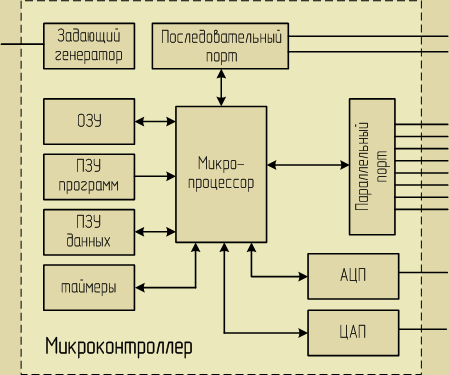

На схеме видно, что центральный процессор взаимодействует с памятью и периферийными узлами внутри одного микроконтроллера.

## 4.1. Центральное процессорное устройство — CPU

**CPU** выполняет машинные команды программы. От архитектуры ядра зависят:

- разрядность вычислений;
- система команд;
- число и назначение регистров;
- способы адресации;
- скорость выполнения команд;
- механизм прерываний.

В микроконтроллерах применяются как RISC-, так и CISC-подходы, однако для современных учебных MCU особенно характерны RISC-архитектуры.

## 4.2. Память

### Flash — память программы

Энергонезависимая память, в которой хранится прошивка микроконтроллера. После отключения питания программа сохраняется.

### SRAM — оперативная память

Используется для:

- переменных;
- промежуточных результатов вычислений;
- буферов;
- стека вызовов функций.

После отключения питания содержимое SRAM теряется.

### EEPROM

Энергонезависимая память для небольших объемов данных, которые должны сохраняться между включениями:

- настройки;
- идентификаторы;
- калибровочные коэффициенты;
- счетчики событий.

> У современных MCU отдельная EEPROM может отсутствовать; ее функции часто реализуются средствами Flash-памяти.

## 4.3. Порты ввода-вывода — GPIO

**GPIO** (*General Purpose Input/Output*) — программируемые цифровые выводы.

Вывод можно настроить:

- **на вход** — прочитать состояние кнопки, датчика, логического сигнала;
- **на выход** — управлять светодиодом, транзистором, драйвером, логическим входом другого устройства.

Для многих выводов доступно несколько альтернативных функций: UART, SPI, I2C, PWM, вход таймера и т. д.

## 4.4. Таймеры и счетчики

Таймеры позволяют аппаратно работать со временем без постоянного участия CPU.

Применения:

- создание точных интервалов времени;
- генерация периодических событий;
- подсчет внешних импульсов;
- измерение длительности импульсов;
- генерация **ШИМ (PWM)**;
- управление сервоприводами и двигателями.

## 4.5. Аналого-цифровой преобразователь — АЦП

**ADC** преобразует аналоговое напряжение в цифровой код.

Например, 10-разрядный АЦП имеет $2^{10}=1024$ возможных кодовых значения.

При опорном напряжении 5 В идеальный шаг преобразования составляет примерно:

\[
\$$
\frac{5\,\text{В}}{1024} \approx 4{,}88\,\text{мВ}
$$

Или в более привычной записи:

$$
\frac{5\ \text{В}}{1024} \approx 0{,}00488\ \text{В} = 4{,}88\ \text{мВ}
$$

\]

АЦП используется для чтения:

- потенциометров;
- аналоговых датчиков температуры;
- датчиков освещенности;
- сигналов измерительных схем.

## 4.6. Последовательные интерфейсы

### UART / USART

Асинхронный последовательный обмен. Обычно используются линии:

- **TX** — передача;
- **RX** — прием.

UART удобен для обмена с компьютером, другим микроконтроллером, GPS-модулем и другими устройствами.

### I2C / TWI

Двухпроводная шина:

- **SDA** — данные;
- **SCL** — тактовый сигнал.

Позволяет подключать несколько адресуемых устройств к одной паре линий.

### SPI

Высокоскоростной синхронный интерфейс. Типичные линии:

- **MOSI**;
- **MISO**;
- **SCK**;
- **CS/SS**.

Часто используется для дисплеев, внешней Flash-памяти, АЦП, ЦАП и высокоскоростных датчиков.

## 4.7. Система тактирования

Для выполнения команд микроконтроллеру нужен тактовый сигнал.

Источником может быть:

- внутренний RC-генератор;
- внешний кварцевый/керамический резонатор;
- внешний генератор;
- в современных MCU — цепочка PLL и делителей частоты.

Тактовая частота влияет на производительность и энергопотребление, но увеличение частоты не всегда автоматически делает программу эффективнее.

## 4.8. Система шин

Внутри микроконтроллера данные передаются по шинам. Упрощенно можно выделить:

- шину данных;
- шину адреса;
- управляющие сигналы.

В конкретных MCU внутренняя структура значительно сложнее: могут применяться несколько шин, матрицы шин, мосты периферии и отдельные домены тактирования.

---

# 5. Архитектура AVR на примере ATmega328P

Поскольку Arduino UNO R3 построена на **ATmega328P**, далее рассмотрим этот микроконтроллер как учебный пример.

## 5.1. Основные особенности AVR

ATmega328P — 8-разрядный AVR-микроконтроллер с RISC-архитектурой.

Для понимания программирования важны следующие особенности:

- большинство вычислительных операций выполняется над 8-разрядными данными;
- ядро содержит **32 регистра общего назначения**;
- память программы и память данных логически разделены — используется модифицированная гарвардская архитектура;
- имеется аппаратный стек в SRAM;
- периферийные блоки управляются через регистры;
- события от периферии могут обрабатываться через систему прерываний.

## 5.2. Гарвардская архитектура

В архитектуре фон Неймана команды и данные используют общее адресное пространство и общий путь доступа к памяти.

В гарвардской архитектуре память команд и память данных разделены. Это позволяет независимо организовать хранение программы и работу с данными.

AVR использует **модифицированную гарвардскую архитектуру**: Flash-память программы и SRAM данных различаются, но предусмотрены специальные механизмы доступа к программной памяти как к данным.

## 5.3. Регистры

Регистры CPU — самая быстрая память микроконтроллера.

У AVR имеется 32 регистра общего назначения `R0...R31`. Некоторые пары регистров могут использоваться как 16-разрядные указатели:

- `X = R27:R26`;
- `Y = R29:R28`;
- `Z = R31:R30`.

На уровне Arduino-программирования разработчик обычно не работает с этими регистрами напрямую, но понимание их роли полезно для изучения C/C++ и ассемблера.

## 5.4. Периферия ATmega328P

На плате Arduino UNO программист наиболее часто использует:

- GPIO;
- таймеры/счетчики;
- PWM;
- 10-разрядный ADC;
- внешние и внутренние прерывания;
- USART;
- SPI;
- TWI/I2C;
- watchdog timer.

Именно периферия превращает процессорное ядро в полноценную систему управления.

---

# 6. Что такое Arduino

**Arduino** — аппаратно-программная платформа для разработки электронных устройств, прототипов, автоматики и робототехники.

Платформа включает:

1. **Аппаратную часть** — платы с микроконтроллером, стабилизатором питания, USB-интерфейсом, разъемами и другими служебными узлами.
2. **Программную часть** — Arduino IDE, компилятор, загрузчик, библиотеки и программный API.

Важно различать понятия:

- **ATmega328P** — микроконтроллер;
- **Arduino UNO R3** — плата на базе этого микроконтроллера;
- **Arduino IDE** — среда разработки;
- **Arduino API** — набор удобных функций (`pinMode`, `digitalWrite`, `analogRead` и др.).

Оригинальное изображение Arduino UNO из презентации:

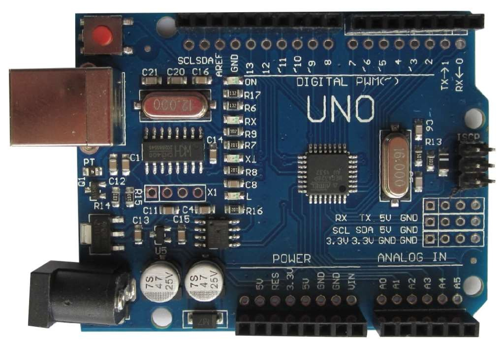

---

# 7. Разновидности плат Arduino и совместимых платформ

В исходной презентации приведены различные платы Arduino и совместимые решения. Изображения сохранены без изменения.

| Arduino UNO | Arduino Leonardo | Arduino Nano |
|---|---|---|
| 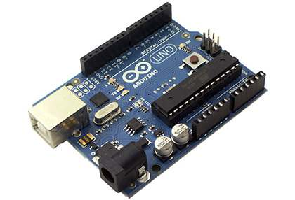 | 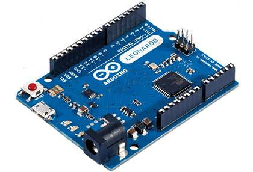 | 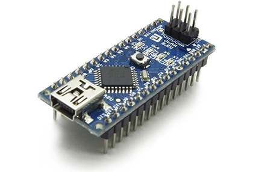 |

| Совместимая Mini-плата | Совместимая Micro-плата | Совместимая Mega/Micro-плата |
|---|---|---|
| 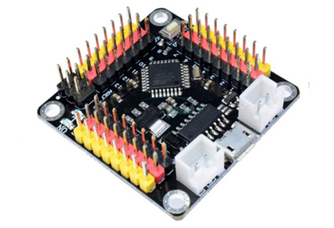 | 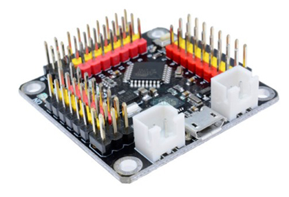 | 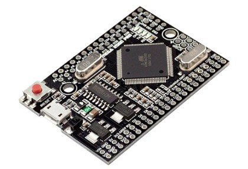 |

| Arduino Mega | Arduino Pro Mini | Arduino Pro Micro |
|---|---|---|
| 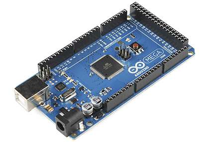 | 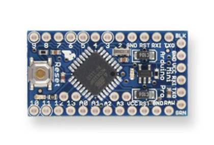 | 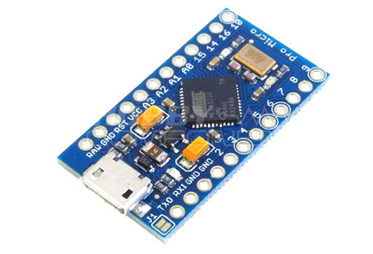 |

| USB-программатор | Arduino LilyPad | STM32-плата |
|---|---|---|
| 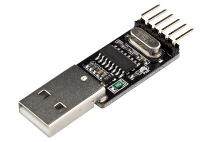 | 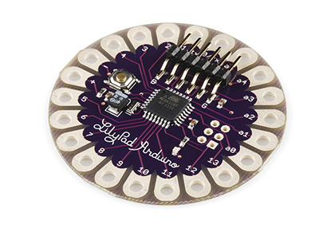 | 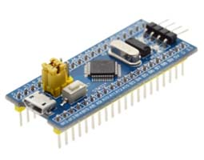 |

> Не все платы на иллюстрациях являются официальными моделями Arduino. В учебной практике часто используются совместимые платы и модули сторонних производителей.

---

# 8. Arduino UNO R3

Arduino UNO R3 построена на микроконтроллере **ATmega328P**.

Исходное изображение платы:

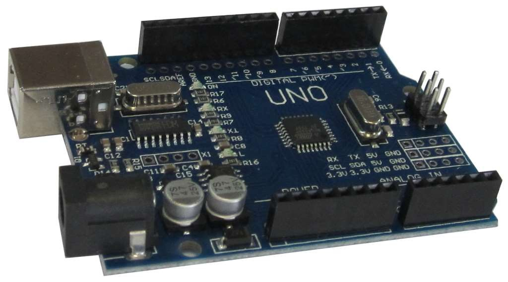

Плата содержит:

- 14 цифровых линий ввода-вывода;
- 6 каналов PWM среди цифровых выводов;
- 6 аналоговых входов;
- тактовую частоту 16 МГц;
- USB-интерфейс;
- разъем внешнего питания;
- ICSP-разъем для внутрисхемного программирования;
- кнопку RESET;
- встроенный светодиод `L`, связанный с цифровым выводом 13.

## 8.1. Технические характеристики

| Параметр | Значение |
|---|---|
| Микроконтроллер | ATmega328P |
| Рабочее напряжение MCU | 5 В |
| Рекомендуемое входное напряжение платы | 7–12 В |
| Предельный диапазон входного напряжения | 6–20 В |
| Цифровые I/O | 14 |
| PWM-выводы | 6 |
| Аналоговые входы | 6 |
| Рекомендуемый рабочий ток одного I/O | 20 мА |
| Максимальный ток вывода 3.3 В | 50 мА |
| Flash | 32 КБ, из них около 0.5 КБ занято загрузчиком |
| SRAM | 2 КБ |
| EEPROM | 1 КБ |
| Частота | **16 МГц** |
| Размер платы | 68.6 × 53.4 мм |
| Масса | около 25 г |

> В исходной таблице частота была написана как «16 мГц». Правильно: **16 МГц (MHz)**.

---

# 9. Питание Arduino UNO

Плата может получать питание:

- от USB;
- через разъем внешнего питания;
- через вывод `VIN` при корректном напряжении.

Для внешнего питания платы обычно рекомендуется диапазон **7–12 В**.

## 9.1. Основные выводы питания

### VIN

Используется для подачи внешнего напряжения на вход схемы питания платы или для доступа к входному напряжению при питании через разъем питания.

### 5V

Линия стабилизированного питания 5 В. Подача внешнего питания непосредственно на этот вывод обходит часть штатной защиты/стабилизации платы, поэтому для начинающих такой способ питания не рекомендуется.

### 3V3

Выход 3.3 В. Для Arduino UNO R3 в официальных характеристиках указан максимальный ток **50 мА**.

### GND

Общий провод. При соединении Arduino с внешним модулем, питающимся от совместимого источника, обычно необходимо обеспечить общий потенциал земли.

### IOREF

Показывает рабочий уровень логики платы. Для UNO R3 это 5 В. Совместимые shield-модули могут использовать IOREF для согласования уровней.

## 9.2. Практическое правило

Не подключайте двигатели, мощные реле, нагреватели, длинные светодиодные ленты и другие силовые нагрузки напрямую к GPIO.

Для них применяют:

- транзисторные ключи;
- MOSFET;
- драйверы двигателей;
- релейные модули;
- отдельные источники питания;
- защитные диоды для индуктивных нагрузок.

---

# 10. Память Arduino UNO / ATmega328P

Основные объемы памяти:

- **Flash — 32 КБ**: программа;
- **SRAM — 2 КБ**: переменные, стек, буферы;
- **EEPROM — 1 КБ**: сохраняемые настройки.

Небольшой объем SRAM особенно важен при программировании AVR.

Например, большие массивы, строки и графические буферы могут быстро занять доступные 2 КБ. Поэтому во встроенном программировании необходимо контролировать использование памяти.

---

# 11. Цифровые и аналоговые выводы Arduino UNO

Каждый цифровой вывод можно программно настроить на вход или выход.

Уровень логики UNO R3 — **5 В**.

Для обычного режима работы ориентируются на ток порядка **20 мА на вывод**. Значение 40 мА является предельным значением для вывода ATmega328P и не должно использоваться как нормальный рабочий режим.

Внутренние подтягивающие резисторы входов имеют сопротивление порядка 20–50 кОм и могут программно включаться, например:

```cpp
pinMode(2, INPUT_PULLUP);
```

## 11.1. Схема выводов

Оригинальная схема из презентации:

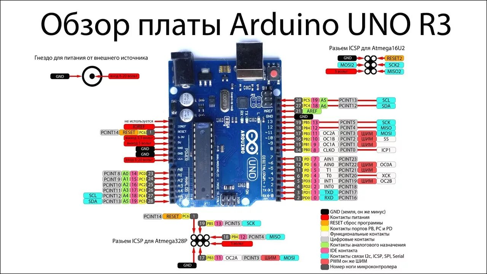

## 11.2. Выводы со специальными функциями

### UART

- `D0` — RX;
- `D1` — TX.

Эти линии связаны с USB-UART частью платы, поэтому их использование внешним устройством может влиять на загрузку программы и обмен с Serial Monitor.

### Внешние прерывания

- `D2`;
- `D3`.

Могут вызывать обработчик при изменении сигнала, по фронту или уровню в зависимости от выбранного режима.

### PWM

PWM поддерживают выводы:

- `D3`;
- `D5`;
- `D6`;
- `D9`;
- `D10`;
- `D11`.

В Arduino обычно используется функция:

```cpp
analogWrite(pin, value);
```

где `value` для классической UNO задается в диапазоне `0...255`.

### SPI

Основные линии:

- `D10` — SS/CS;
- `D11` — MOSI;
- `D12` — MISO;
- `D13` — SCK.

SPI также выведен на ICSP-разъем.

### I2C / TWI

- `A4` — SDA;
- `A5` — SCL.

### Аналоговые входы

`A0...A5` подключены к 10-разрядному АЦП ATmega328P.

---

# 12. Ограничения по току и электрическая безопасность

В исходной презентации для цифрового вывода фигурирует значение 40 мА. Это значение следует трактовать только как **абсолютный максимум**, а не как нормальный режим.

Для учебных схем безопаснее исходить из официальной рабочей характеристики UNO R3 — **20 мА на I/O** и дополнительно учитывать суммарные ограничения микроконтроллера.

> **Важно:** утверждение «с вывода 5V можно всегда получить 800 мА» нельзя использовать как универсальное проектное правило. Допустимый ток зависит от способа питания, USB-ограничений, стабилизатора, нагрева платы и потребления самой Arduino.

Пример правильного подключения светодиода:

```text
Arduino GPIO ---- резистор 220...1000 Ом ---->|---- GND
                                             LED
```

Для двигателя:

```text
Arduino GPIO -> драйвер / MOSFET -> двигатель -> отдельное питание
                         ^
                    общий GND
```

---

# 13. Макетирование и подключение модулей

Изображения из исходной презентации:

| Макетные платы | Shield для Nano | Макетный shield для UNO |
|---|---|---|
| 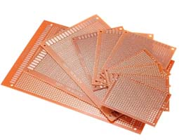 | 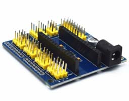 | 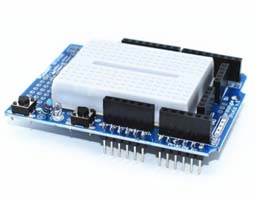 |

Макетная плата позволяет быстро собирать схему без пайки. Для надежной работы необходимо:

- проверять полярность питания;
- не допускать короткого замыкания 5V и GND;
- устанавливать токоограничивающие резисторы для светодиодов;
- проверять допустимое напряжение каждого модуля;
- учитывать, что устройства с логикой 3.3 В могут требовать согласования уровней с UNO 5 В.

---

# 14. Подготовка среды разработки Arduino

Исходные слайды были подготовлены для старой ветки Arduino IDE 1.x. Скриншоты ниже сохранены без изменения, однако интерфейс Arduino IDE 2 отличается.

## 14.1. Актуальный порядок для Arduino IDE 2

1. Установить Arduino IDE 2 с официального сайта Arduino.
2. Подключить плату USB-кабелем с передачей данных.
3. При необходимости установить пакет поддержки платы через **Boards Manager**.
4. Выбрать тип платы, например **Arduino Uno**.
5. Выбрать обнаруженный последовательный порт.
6. Открыть или создать скетч.
7. Выполнить **Verify** и **Upload**.

> Для Arduino IDE 2 отдельная ручная установка Java/JRE не требуется.

Оригинальный скриншот страницы загрузки из презентации:

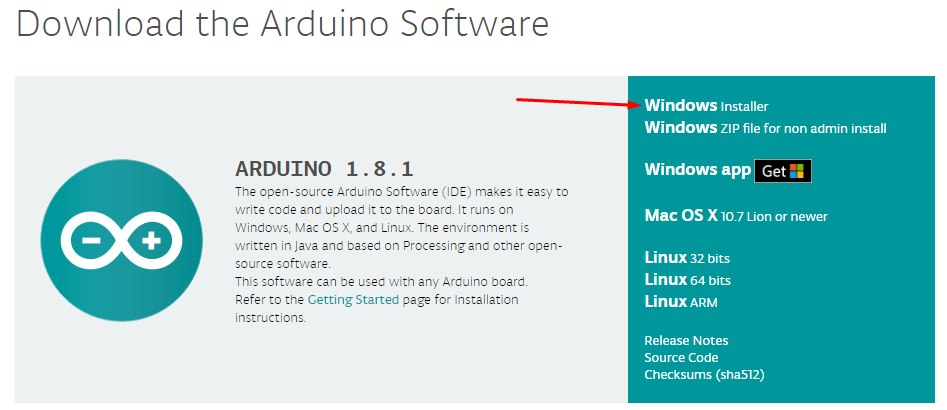

## 14.2. Драйвер USB-UART

Оригинальные Arduino UNO обычно определяются современной ОС автоматически. В совместимых платах могут использоваться преобразователи CH340/CH341, CP210x и другие.

Если порт не появляется:

1. проверить USB-кабель — он должен поддерживать передачу данных;
2. проверить другой USB-порт;
3. посмотреть устройство в «Диспетчере устройств»;
4. при необходимости установить драйвер именно для используемого USB-UART контроллера из надежного источника.

Скриншоты из исходной презентации:

| Файлы драйвера | Установка CH34x |
|---|---|
| 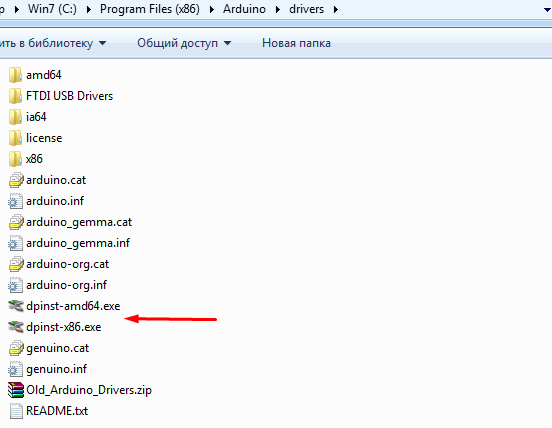 | 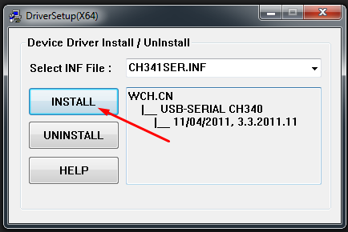 |

## 14.3. Выбор платы и порта

Старый интерфейс Arduino IDE из презентации:

| Выбор платы/процессора | Выбор COM-порта |
|---|---|
| 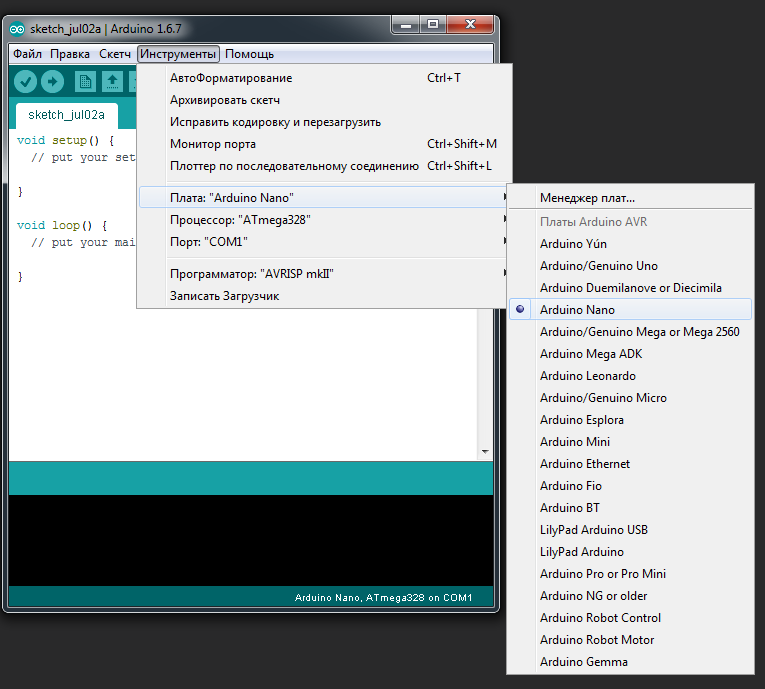 | 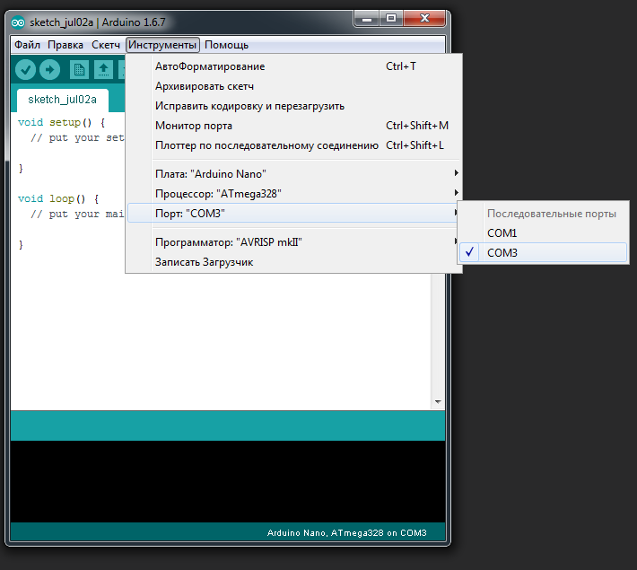 |

В Arduino IDE 2 названия меню и расположение отдельных элементов могут отличаться, но логика остается той же: необходимо правильно выбрать **плату** и **порт**.

Для некоторых старых Arduino Nano-совместимых плат также может потребоваться выбор варианта загрузчика/процессора.

## 14.4. Установка библиотек

В старой презентации показано ручное копирование библиотеки в каталог установки Arduino:

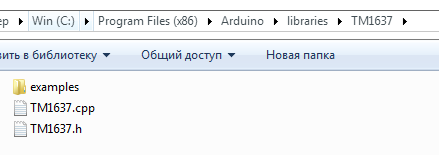

Для современных версий предпочтительнее использовать **Library Manager**. При ручной установке пользовательские библиотеки обычно размещают в каталоге `libraries` внутри папки Sketchbook, а не в `Program Files`.

Структура типичной библиотеки:

```text
LibraryName/
├── examples/
├── src/
│   ├── LibraryName.cpp
│   └── LibraryName.h
└── library.properties
```

У старых библиотек `.h` и `.cpp` могут находиться непосредственно в корне библиотеки.

---

# 15. Запуск Arduino IDE и первая программа

Скриншоты из исходной презентации сохранены как справочные изображения старого интерфейса.

## 15.1. Выбор платы

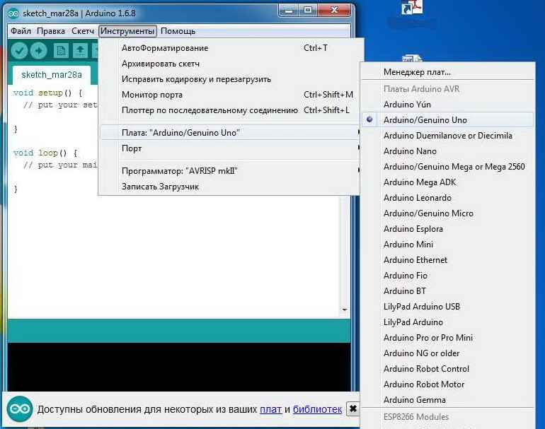

## 15.2. Выбор порта

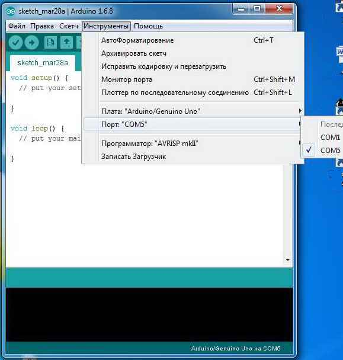

## 15.3. Пример Blink

В Arduino IDE можно открыть встроенный пример:

`File → Examples → 01.Basics → Blink`

Исходный скриншот:

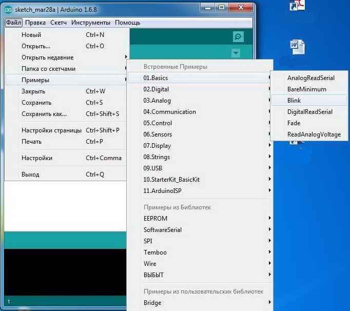

Минимальный вариант программы:

```cpp
void setup() {
    pinMode(LED_BUILTIN, OUTPUT);
}

void loop() {
    digitalWrite(LED_BUILTIN, HIGH);
    delay(1000);

    digitalWrite(LED_BUILTIN, LOW);
    delay(1000);
}
```

### Как работает программа

`setup()` вызывается один раз после старта или сброса микроконтроллера.

```cpp
pinMode(LED_BUILTIN, OUTPUT);
```

настраивает вывод встроенного светодиода как цифровой выход.

`loop()` выполняется циклически, пока плата включена.

```cpp
digitalWrite(LED_BUILTIN, HIGH);
```

включает светодиод, а

```cpp
digitalWrite(LED_BUILTIN, LOW);
```

выключает его.

```cpp
delay(1000);
```

останавливает выполнение программы приблизительно на 1000 мс.

## 15.4. Загрузка программы

После нажатия **Upload** IDE:

1. компилирует C/C++ код;
2. формирует машинную прошивку;
3. связывается с загрузчиком платы;
4. записывает программу во Flash-память микроконтроллера;
5. выполняет запуск новой программы.

Оригинальный скриншот результата:

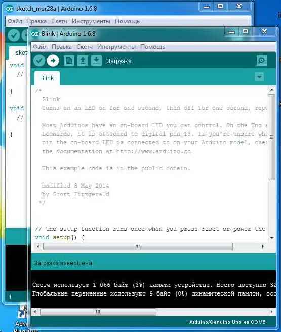

Если встроенный светодиод `L` мигает примерно один раз в секунду, первая программа работает.

---

# 16. Что происходит между исходным кодом и микроконтроллером

При нажатии **Verify/Upload** происходит цепочка преобразований:

```text
Скетч Arduino (.ino)
       ↓
C/C++ исходный код + библиотеки Arduino
       ↓
Компиляция
       ↓
Машинный код AVR
       ↓
Файл прошивки
       ↓
Загрузчик / программатор
       ↓
Flash ATmega328P
       ↓
Выполнение команд CPU
       ↓
Управление GPIO, таймерами, ADC, интерфейсами
```

Это важный переход от «программирования Arduino» к **программированию микроконтроллера**: функции Arduino — удобная программная оболочка над аппаратными возможностями MCU.

---

# 17. Пример: от задачи к аппаратным блокам

Пусть необходимо создать систему, которая измеряет освещенность и плавно регулирует яркость светодиода.

Потребуются:

1. **аналоговый датчик** — формирует напряжение;
2. **ADC** — преобразует напряжение в число;
3. **CPU** — вычисляет требуемую яркость;
4. **таймер/PWM** — формирует сигнал управления яркостью;
5. **GPIO/PWM-вывод** — передает сигнал внешней схеме.

Упрощенный алгоритм:

```text
Датчик → ADC → число → программа → PWM → светодиод
```

Этот пример показывает, что прикладная программа работает не «сама по себе»: она управляет конкретными аппаратными блоками микроконтроллера.

---

# 18. Типичные ошибки начинающих

1. **Путать Arduino и микроконтроллер.** Arduino UNO — плата, ATmega328P — MCU.
2. **Подключать мощную нагрузку непосредственно к GPIO.** Для двигателя или реле нужен драйвер/ключ.
3. **Забывать общий GND** между связанными устройствами.
4. **Использовать 40 мА как штатный ток вывода.** Это предельное, а не рекомендуемое значение.
5. **Не учитывать уровень логики.** UNO работает с логикой 5 В, а многие современные модули — 3.3 В.
6. **Занимать D0/D1 внешним устройством и одновременно использовать Serial/загрузку**, не понимая возможного конфликта.
7. **Игнорировать ограниченный объем SRAM.** Для ATmega328P доступно всего 2 КБ.
8. **Использовать `delay()` в сложной программе как единственный способ работы со временем.** Позже следует переходить к таймерам и неблокирующим алгоритмам.

---

# 19. Выводы

- Микроконтроллер — законченная программируемая вычислительная система на одном кристалле.
- Основные части MCU: **CPU, память, GPIO, таймеры, ADC, интерфейсы, тактирование и система прерываний**.
- Современные MCU представлены 8-, 16- и 32-разрядными семействами, а выбор зависит от производительности, энергопотребления, периферии и стоимости.
- AVR и ATmega328P удобны для изучения базовых принципов встроенного программирования.
- Arduino UNO R3 упрощает работу с ATmega328P, добавляя питание, USB-интерфейс, загрузчик и удобные разъемы.
- Программист микроконтроллеров должен учитывать не только алгоритм, но и электрические ограничения аппаратуры.
- Программа Blink — простой пример полного цикла: **исходный код → компиляция → прошивка → работа реального аппаратного вывода**.

---

# 20. Вопросы для самопроверки

1. Что такое микроконтроллер?
2. Чем микроконтроллер отличается от универсального микропроцессора?
3. Какие виды памяти обычно присутствуют в MCU?
4. Для чего предназначена SRAM?
5. Чем Flash отличается от EEPROM?
6. Что такое GPIO?
7. Для чего используются таймеры-счетчики?
8. Что такое PWM и какие задачи он позволяет решать?
9. Для чего нужен ADC?
10. Чем UART отличается от SPI и I2C?
11. Что означает термин «тактирование»?
12. Какие особенности архитектуры AVR важны для программиста?
13. Какой микроконтроллер используется в Arduino UNO R3?
14. Каков объем Flash, SRAM и EEPROM в ATmega328P на Arduino UNO R3?
15. Какие выводы UNO используются для UART?
16. Какие выводы поддерживают PWM?
17. Какие выводы используются для I2C?
18. Почему нельзя подключать двигатель напрямую к GPIO?
19. Что выполняется в функции `setup()`?
20. Почему функция `loop()` повторяется непрерывно?

---

# 21. Ключевые термины

- **MCU** — Microcontroller Unit, микроконтроллер.
- **CPU** — центральное процессорное устройство.
- **GPIO** — цифровые линии общего назначения.
- **Flash** — энергонезависимая память программы.
- **SRAM** — оперативная память.
- **EEPROM** — энергонезависимая память данных.
- **ADC / АЦП** — аналого-цифровой преобразователь.
- **PWM / ШИМ** — широтно-импульсная модуляция.
- **UART** — асинхронный последовательный интерфейс.
- **SPI** — синхронный высокоскоростной последовательный интерфейс.
- **I2C / TWI** — двухпроводная адресная последовательная шина.
- **Interrupt / прерывание** — механизм реакции CPU на событие.
- **Clock / тактирование** — система синхронизации работы MCU.
- **Bootloader** — небольшая программа, обеспечивающая загрузку основной прошивки.
- **Firmware / прошивка** — программа, записанная в память встроенного устройства.

---

# 22. Полезные официальные материалы

- Arduino IDE: <https://docs.arduino.cc/software/ide/>
- Arduino UNO Rev3: <https://store.arduino.cc/products/arduino-uno-rev3>
- Документация Microchip по AVR/ATmega: <https://www.microchip.com/>

---

**Конец лекции 1.**
