# Лекция 2. Микроконтроллеры семейства ARM Cortex-M: архитектура и периферия

**Дисциплина:** МДК.02.02 «Программирование микроконтроллеров»  
**Специальность:** 09.02.01 «Компьютерные системы и комплексы»  
**Тема:** знакомство с ARM Cortex-M

> Материал построен по исходной презентации. Там, где это помогает пониманию архитектуры, добавлены пояснения и небольшие практические примеры. Исходные рисунки из презентации сохранены без перерисовки.

---

## 1. Цели лекции

После изучения материала обучающийся должен:

- понимать, чем **ядро Cortex-M** отличается от готового микроконтроллера;
- знать принцип лицензирования архитектур ARM;
- ориентироваться в семействах Cortex-M0/M0+, M3, M4, M7, M23 и M33;
- понимать базовую программную модель Cortex-M;
- знать назначение **NVIC**, **SysTick**, **MPU**, **FPU** и отладочного интерфейса;
- понимать организацию 32-битного адресного пространства;
- знать назначение основных периферийных блоков: GPIO, АЦП, таймеров, UART, SPI, I2C;
- понимать принцип **Alternate Function / Pin Multiplexing**.

---

## 2. ARM: ядро, архитектура и микроконтроллер — не одно и то же

Одна из главных идей, которую необходимо понять в начале: **Arm не обязана производить конкретный микроконтроллер, чтобы архитектура Cortex-M использовалась в микроконтроллере**.

Компания Arm разрабатывает процессорные архитектуры и готовые процессорные ядра в виде интеллектуальной собственности — **IP (Intellectual Property)**. Производитель микросхем получает лицензию и строит вокруг выбранного ядра собственный микроконтроллер.

Примеры производителей:

- **STMicroelectronics** — семейства STM32;
- **NXP** — LPC и другие семейства;
- **Microchip** — SAM;
- **Texas Instruments** — микроконтроллеры на ядрах Arm;
- многие другие компании.

Таким образом, микроконтроллер можно условно представить как:

```text
┌─────────────────────────────────────────────────────┐
│                 МИКРОКОНТРОЛЛЕР                     │
│                                                     │
│   ┌───────────────────────┐                         │
│   │     Cortex-M core     │  ← процессорное ядро    │
│   │ CPU + NVIC + SysTick  │                         │
│   └───────────────────────┘                         │
│            │                                        │
│   ┌────────┴─────────────────────────────────────┐  │
│   │ Flash │ SRAM │ GPIO │ ADC │ TIM │ UART │ ...│  │
│   └──────────────────────────────────────────────┘  │
│       периферия и память конкретного производителя  │
└─────────────────────────────────────────────────────┘
```

### Почему такая модель оказалась успешной

Производитель микроконтроллера получает уже разработанное и проверенное процессорное ядро, а собственные ресурсы может направить на:

- периферию;
- энергопотребление;
- встроенную Flash и SRAM;
- аналоговые блоки;
- беспроводную связь;
- безопасность;
- стоимость конечной микросхемы.

Для программиста важное преимущество — **сходная программная модель разных микроконтроллеров на Cortex-M**.

### Важное уточнение

Cortex-M определяет прежде всего **процессорное ядро и системную архитектуру**. Такие блоки, как GPIO, ADC, большинство таймеров, UART, SPI и I2C, обычно реализует уже производитель конкретного микроконтроллера. Поэтому регистры периферии у STM32, SAM, LPC и других семейств могут заметно отличаться.

---

## 3. Краткая история развития

В исходной лекции выделены четыре ключевых этапа.

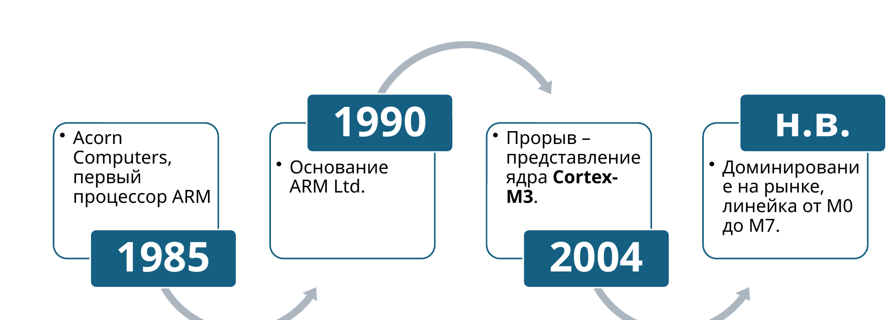

- **1985** — в Acorn Computers создан ранний процессор ARM.
- **1990** — формируется самостоятельная компания ARM Ltd.
- **2004** — появление Cortex-M3 становится важным этапом распространения ARM в микроконтроллерах.
- **Современный этап** — масштабная линейка Cortex-M от энергоэффективных до высокопроизводительных ядер.

Главное направление развития Cortex-M — получить **32-битную архитектуру**, пригодную не только для сложных вычислительных устройств, но и для компактных встраиваемых систем.

---

## 4. Семейство Cortex-M и выбор ядра

| Ядро | Основная идея | Типичные задачи |
|---|---|---|
| **Cortex-M0 / M0+** | Минимальная сложность, площадь кристалла и энергопотребление | простые датчики, компактные устройства, замена части 8-битных МК |
| **Cortex-M3** | Баланс производительности и стоимости | автоматика, контроллеры, сетевые и измерительные устройства |
| **Cortex-M4** | Возможности M3 + DSP-инструкции, возможен FPU | цифровая обработка сигналов, управление двигателями, аудио |
| **Cortex-M7** | Более высокая производительность, развитый конвейер, кэш | сложные системы управления, GUI, интенсивные вычисления |
| **Cortex-M23 / M33** | Новое поколение с возможностями архитектуры Armv8-M и средствами безопасности | IoT, защищенные устройства, медицинская и промышленная электроника |

### Как выбирать ядро

Выбор не следует выполнять только по принципу «чем мощнее, тем лучше». Обычно учитывают:

1. требуемую производительность;
2. объем Flash и SRAM;
3. количество GPIO;
4. наличие ADC/DAC;
5. необходимые таймеры;
6. интерфейсы UART/SPI/I2C/CAN/USB/Ethernet;
7. энергопотребление;
8. стоимость;
9. требования к безопасности;
10. наличие подходящих средств разработки.

> **Практический принцип:** сначала определяют требования системы, затем подбирают микроконтроллер и только после этого оценивают, какое ядро Cortex-M необходимо.

---

## 5. Единство программной модели

Одно из преимуществ Cortex-M — сходная логика программирования разных ядер семейства.


При переходе между различными Cortex-M программист снова встречает:

- регистры общего назначения;
- стек;
- таблицу векторов;
- исключения и прерывания;
- NVIC;
- SysTick;
- похожую модель адресного пространства;
- стандартные механизмы отладки.

### Но переносимость не абсолютна

Фраза «код для M0 будет работать на M7» полезна как общая идея, однако ее нельзя понимать буквально для любой программы.

Причины:

- набор инструкций у поколений Cortex-M различается;
- Cortex-M0/M0+ использует более компактный набор команд архитектуры Armv6-M;
- M3/M4/M7 обладают более широкими возможностями;
- периферия разных микроконтроллеров различна;
- адреса и регистры GPIO, таймеров и ADC задаются производителем микроконтроллера.

Наиболее переносимым обычно является код, использующий:

- стандартный язык C/C++;
- **CMSIS** для доступа к общим компонентам Cortex-M;
- аппаратно-независимые слои и драйверы;
- минимальное количество прямых обращений к специфическим регистрам.

---

## 6. Cortex-M как RISC-архитектура

**RISC — Reduced Instruction Set Computer**.

Для RISC-подхода характерны:

- относительно простые машинные команды;
- большое количество регистров;
- активное использование конвейера;
- разделение операций работы с памятью и вычислений;
- высокая эффективность выполнения типовых последовательностей команд.

### Load–Store принцип

Типичная последовательность:

```text
Память → регистр → вычисление → регистр → память
```

Например, процессор не обязан выполнять сложное арифметическое действие непосредственно над произвольной ячейкой памяти. Данные сначала загружаются в регистры, затем обрабатываются.

### Конвейер

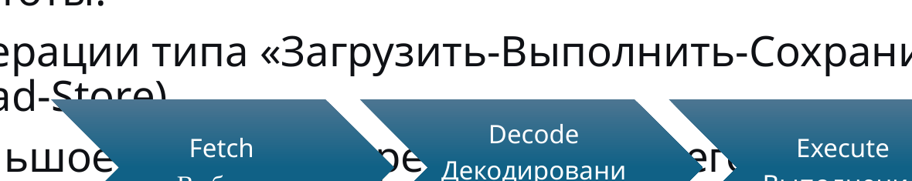

Для Cortex-M3/M4 удобно использовать базовую трехступенчатую модель:

1. **Fetch** — выборка команды;
2. **Decode** — декодирование;
3. **Execute** — выполнение.

Пока одна команда выполняется, следующая может декодироваться, а еще одна — загружаться.

> **Уточнение:** Cortex-M7 имеет существенно более сложную микроархитектуру, поэтому простая трехступенчатая схема относится прежде всего к объяснению M3/M4 и не описывает все ядра Cortex-M одинаково.

---

## 7. Регистры процессорного ядра

Для понимания программ и отладки важно знать базовые регистры Cortex-M.

| Регистр | Назначение |
|---|---|
| **R0–R12** | регистры общего назначения |
| **R13 (SP)** | Stack Pointer — указатель стека |
| **R14 (LR)** | Link Register — адрес возврата / служебная информация |
| **R15 (PC)** | Program Counter — адрес выполняемой команды |
| **xPSR** | регистр состояния процессора |

### Стек

Стек используется для:

- локальных переменных;
- сохранения адресов возврата;
- передачи части параметров функций;
- сохранения контекста при прерываниях.

При входе в исключение Cortex-M аппаратно сохраняет часть контекста, что существенно упрощает и ускоряет обработку прерываний.

---

## 8. Внутреннее устройство ядра Cortex-M3/M4

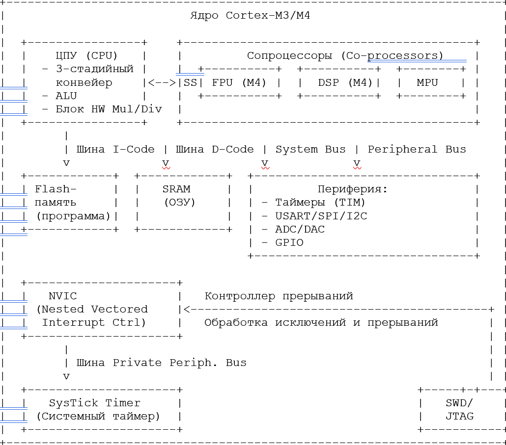

В исходной схеме выделяются основные блоки.

### 8.1. CPU

Центральный процессор выполняет команды программы. Для M3/M4 характерна конвейерная обработка.

### 8.2. ALU

**ALU — Arithmetic Logic Unit** выполняет:

- сложение;
- вычитание;
- логические операции;
- сдвиги;
- сравнение.

### 8.3. Аппаратное умножение и деление

Наличие специализированной аппаратной поддержки позволяет выполнять математические операции значительно быстрее, чем их программная реализация.

### 8.4. Внутренние шины

В архитектуре ядра используются несколько путей доступа:

- **I-Code bus** — выборка инструкций;
- **D-Code bus** — доступ к данным в области кода;
- **System bus** — SRAM, периферия и другие области.

Это позволяет уменьшать количество конфликтов при доступе к памяти и повышать производительность.

Такую организацию часто описывают как **модифицированную Гарвардскую архитектуру**: логически пути команд и данных разделены, хотя адресное пространство для программиста остается единым.

---

## 9. NVIC — контроллер вложенных векторных прерываний

**NVIC — Nested Vectored Interrupt Controller**.

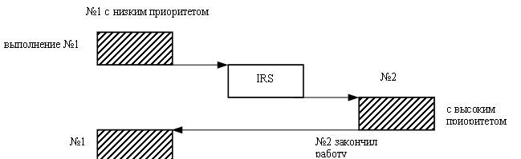

NVIC является одним из ключевых преимуществ Cortex-M для систем управления.

### Основные свойства

**Векторность.**  
Для каждого исключения или прерывания в таблице векторов хранится адрес соответствующего обработчика.

**Приоритеты.**  
Прерывания могут иметь разные уровни приоритета.

**Вложенность.**  
Высокоприоритетное прерывание может прервать обработчик более низкого приоритета.

**Аппаратная работа с контекстом.**  
При входе в обработчик процессор автоматически сохраняет необходимые регистры.

### Упрощенная последовательность

```text
Событие
   ↓
Периферийный блок формирует IRQ
   ↓
NVIC проверяет разрешение и приоритет
   ↓
Процессор сохраняет часть контекста
   ↓
PC получает адрес обработчика из таблицы векторов
   ↓
Выполняется ISR
   ↓
Возврат и восстановление контекста
```

### Почему это важно

Без прерываний программа часто была бы вынуждена постоянно опрашивать устройства:

```c
while (1) {
    check_button();
    check_uart();
    check_timer();
}
```

С прерываниями процессор реагирует на событие только тогда, когда оно действительно произошло.

---

## 10. SysTick — системный таймер

**SysTick** — стандартный 24-битный системный таймер Cortex-M.


Типичные применения:

- формирование периодических прерываний;
- системный счет времени;
- программные задержки;
- системный «тик» операционной системы реального времени;
- планирование периодических задач.

В ОСРВ, например FreeRTOS, системный таймер может использоваться как один из источников времени для работы планировщика.

### Пример

Если процессор работает на частоте 72 МГц и SysTick получает ту же частоту, для периода около 1 мс требуется отсчитать примерно:

```text
72 000 000 / 1000 = 72 000 тактов
```

Конкретная настройка зависит от источника тактирования SysTick и используемого микроконтроллера.

---

## 11. FPU и MPU

### 11.1. FPU — Floating Point Unit

**FPU** ускоряет вычисления с плавающей точкой.

Типичные задачи:

- цифровая фильтрация;
- обработка сигналов;
- управление электроприводом;
- вычисление координат;
- математические модели.

Для Cortex-M4 наличие FPU зависит от конкретной реализации ядра. Поэтому встречаются обозначения и реализации с аппаратной поддержкой floating point и без нее.

### 11.2. MPU — Memory Protection Unit

**MPU** позволяет задавать правила доступа к различным областям памяти.

Можно определить, например:

- область только для чтения;
- область, из которой запрещено выполнение кода;
- область доступную только привилегированному коду;
- разные правила доступа для компонентов системы.

MPU особенно полезен в:

- ОСРВ;
- критических системах;
- системах, где необходимо изолировать ошибки программных модулей.

> MPU не устраняет все программные ошибки, но позволяет обнаруживать ряд недопустимых обращений к памяти и ограничивать последствия ошибки.

---

## 12. Организация памяти Cortex-M

Cortex-M использует **32-битное адресное пространство**:

```text
2^32 = 4 294 967 296 байт = 4 ГБ
```

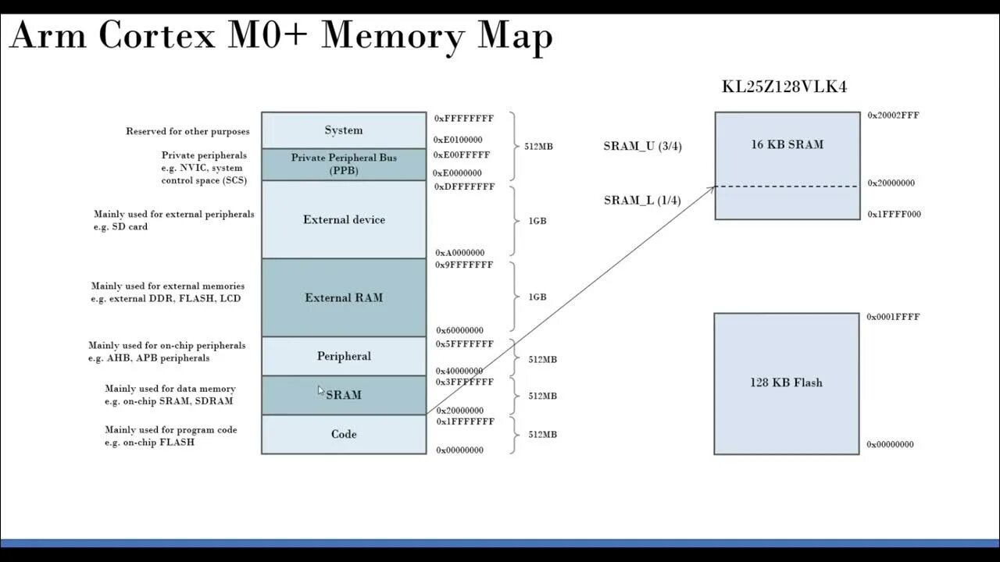

Типовая архитектурная карта:

| Диапазон | Назначение |
|---|---|
| `0x00000000 – 0x1FFFFFFF` | Code region |
| `0x20000000 – 0x3FFFFFFF` | SRAM region |
| `0x40000000 – 0x5FFFFFFF` | Peripheral region |
| `0x60000000 – 0x9FFFFFFF` | External RAM |
| `0xA0000000 – 0xDFFFFFFF` | External devices |
| `0xE0000000 – 0xFFFFFFFF` | System region / PPB и служебные области |

### Важный принцип

Память и периферия доступны через **единое адресное пространство**. Регистры периферийных устройств выглядят для процессора как специальные адреса памяти.

Например, если регистр GPIO расположен по адресу:

```text
0x4002_0014
```

то запись в этот адрес фактически изменяет состояние аппаратного регистра, а не обычной ячейки RAM.

Такой подход называется **memory-mapped I/O**.

### Небольшая проверка

Определите область:

```text
0x20001000 → SRAM
0x40021000 → Peripheral
0xE000E010 → System region
```

Адрес `0xE000E010` часто встречается при работе с регистрами SysTick.

---

## 13. GPIO — универсальные цифровые входы и выходы

**GPIO — General Purpose Input/Output.**

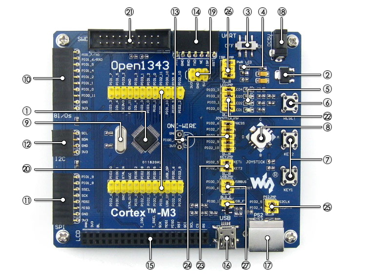

GPIO позволяют программно управлять физическими выводами микроконтроллера.

### Основные режимы входа

- цифровой вход;
- вход с подтяжкой к питанию (**Pull-Up**);
- вход с подтяжкой к земле (**Pull-Down**);
- аналоговый режим для некоторых выводов.

### Основные режимы выхода

**Push-Pull**  
Выход активно формирует и логический 0, и логическую 1.

**Open-Drain**  
Выход способен активно формировать один уровень, а второй формируется внешней или внутренней подтяжкой. Такой режим широко применяется в шинах типа I2C.

### Что подключают к GPIO

- кнопки;
- светодиоды;
- дискретные датчики;
- транзисторные ключи;
- реле через драйвер;
- сигнальные входы других цифровых устройств.

> Мощную нагрузку нельзя подключать непосредственно к выводу GPIO. Для двигателей, реле и мощных светодиодов используют транзисторные ключи, MOSFET или специализированные драйверы.

---

## 14. ADC — аналого-цифровой преобразователь

**ADC — Analog-to-Digital Converter.**

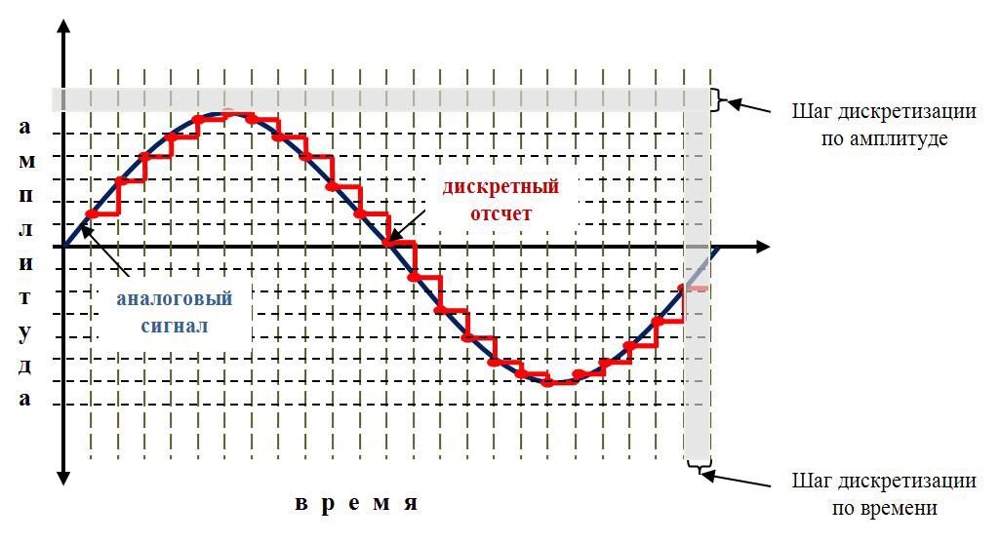

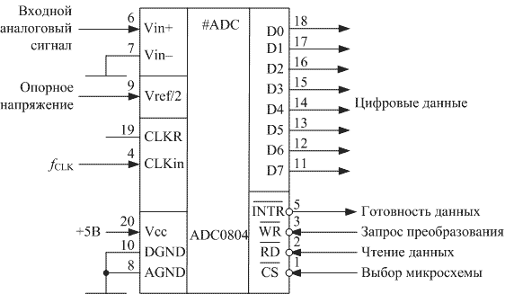

АЦП преобразует входное аналоговое напряжение в цифровое число.

Для `N`-разрядного АЦП количество кодов:

```text
2^N
```

Для 12-битного АЦП:

```text
2^12 = 4096 уровней
```

Коды находятся приблизительно в диапазоне:

```text
0 ... 4095
```

### Приближенная формула

```text
ADC_code ≈ Vin / Vref × (2^N - 1)
```

Например, для:

```text
Vref = 3.3 В
Vin  = 1.65 В
N    = 12
```

получаем:

```text
ADC_code ≈ 1.65 / 3.3 × 4095 ≈ 2048
```

### Что подключают к ADC

- потенциометры;
- терморезисторы;
- фоторезистивные схемы;
- аналоговые датчики давления;
- датчики тока;
- выходы операционных усилителей.

> Значение `0–3,3 В` и разрядность 12 бит типичны для многих микроконтроллеров, но не являются универсальными для всех Cortex-M. Всегда проверяют документацию конкретной микросхемы.

---

## 15. Таймеры и счетчики

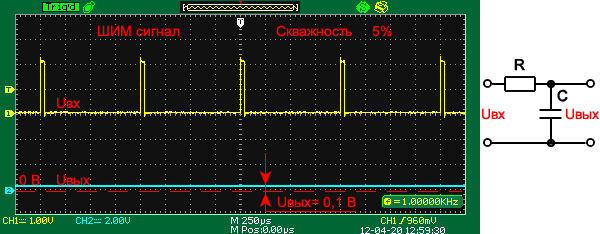

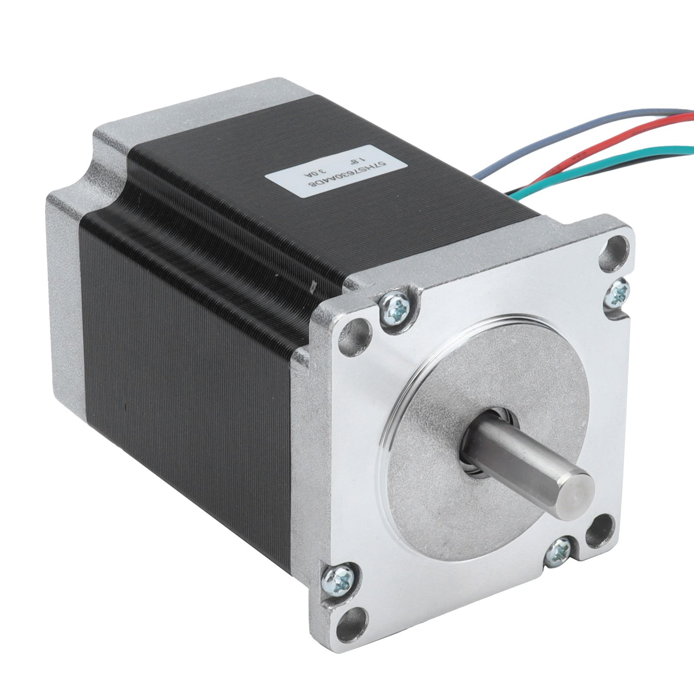

Аппаратный таймер — один из наиболее важных блоков микроконтроллера.

### Основные задачи

**Счет времени**
- формирование интервалов;
- периодические события;
- таймауты.

**PWM — широтно-импульсная модуляция**
- управление яркостью светодиодов;
- управление двигателями через драйвер;
- формирование управляющих сигналов.

**Input Capture**
- измерение длительности импульса;
- определение периода или частоты внешнего сигнала.

**Output Compare**
- формирование события при совпадении счетчика с заданным значением.

### PWM

Коэффициент заполнения:

```text
D = ton / T × 100 %
```

где:

- `ton` — время активного уровня;
- `T` — период.

Например, при `D = 25 %` активный уровень занимает четверть периода.

---

## 16. Интерфейсы связи: UART, SPI, I2C

### 16.1. UART / USART

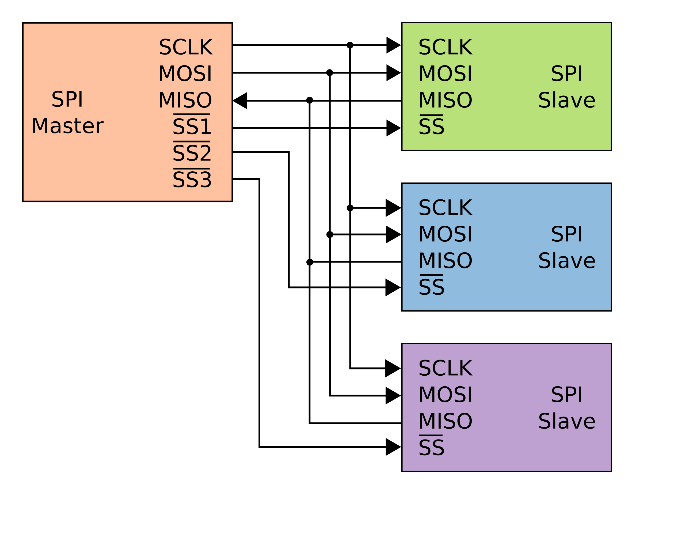

Асинхронный последовательный интерфейс.

Основные линии:

- `TX` — передача;
- `RX` — прием.

Типичные применения:

- связь с ПК через USB-UART;
- GPS;
- GSM/LTE-модемы;
- другие микроконтроллеры;
- диагностический вывод.

---

### 16.2. SPI

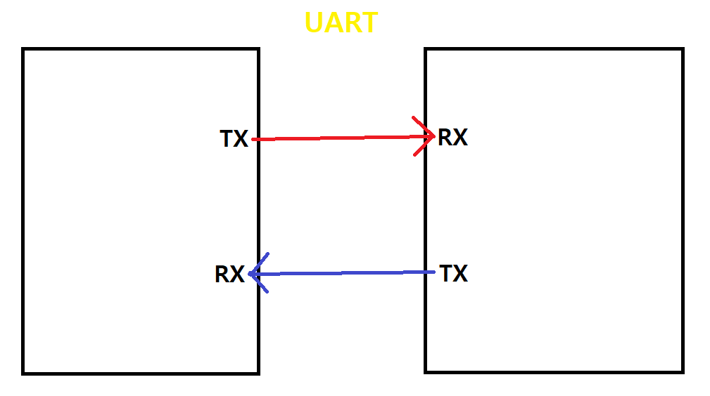

Синхронный последовательный интерфейс.

Основные сигналы:

- `SCK` — тактовый сигнал;
- `MOSI` — данные от ведущего к ведомому;
- `MISO` — данные от ведомого к ведущему;
- `CS/SS` — выбор устройства.

Типичные устройства:

- дисплеи;
- внешняя Flash;
- АЦП/ЦАП;
- SD-карты;
- датчики с высокой скоростью обмена.

---

### 16.3. I2C

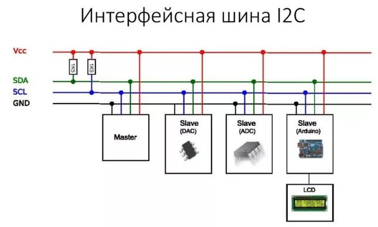

Двухпроводная синхронная шина.

Линии:

- `SDA` — данные;
- `SCL` — тактовый сигнал.

Особенность I2C — возможность подключить несколько адресуемых устройств к одной паре линий.

Типичные устройства:

- датчики температуры;
- датчики давления;
- часы реального времени;
- EEPROM;
- небольшие OLED/LCD-модули.

### Сравнение

| Характеристика | UART | SPI | I2C |
|---|---|---|---|
| Тактовая линия | нет | есть | есть |
| Типичный минимум линий | 2 | 4 | 2 |
| Адресация устройств | обычно нет | через CS | встроенная адресация |
| Полный дуплекс | да | да | обычно обмен по одной линии данных |
| Типичная скорость | средняя | высокая | средняя |
| Удобство нескольких устройств | среднее | требуется CS | высокое |

---

## 17. Alternate Function — многофункциональность выводов

Количество внутренних сигналов микроконтроллера обычно значительно больше количества физических выводов корпуса. Поэтому выводы делают **многофункциональными**.

Например, один и тот же физический вывод может быть связан с:

```text
GPIO
или
каналом таймера
или
UART
или
SPI
или
другой периферийной функцией
```

Для STM32 используется понятие **Alternate Function**, а выбор функций связан с настройкой регистров GPIO, включая регистры `AFR`.

### Важное уточнение по примеру PA5

В исходной лекции PA5 используется как иллюстрация нескольких возможных функций. Конкретный набор функций **зависит от модели микроконтроллера**. Нельзя считать, что любой PA5 любого STM32 обязательно является одновременно `TIM2_CH1` и `ADC1_IN5`.

Перед настройкой необходимо смотреть:

1. datasheet конкретного MCU;
2. таблицу **Alternate Function mapping**;
3. схему платы;
4. руководство Reference Manual.

### Общий алгоритм

```text
1. Выбрать нужную периферию
2. Найти подходящий вывод в datasheet
3. Включить тактирование GPIO и периферии
4. Настроить режим вывода
5. Выбрать Alternate Function
6. Настроить сам периферийный блок
```

---

## 18. Что относится к Cortex-M, а что — к конкретному MCU

Это принципиально важно для дальнейшего курса.

### Относится к архитектуре Cortex-M

- CPU;
- регистры ядра;
- система исключений;
- NVIC;
- SysTick;
- системная модель памяти;
- отладочные механизмы;
- часть системных регистров.

### Зависит от производителя микроконтроллера

- количество и структура GPIO;
- ADC и DAC;
- таймеры;
- UART/USART;
- SPI;
- I2C;
- USB;
- CAN;
- Ethernet;
- система тактирования конкретного MCU;
- Flash-контроллер;
- DMA;
- расположение регистров периферии.

Поэтому знания Cortex-M обеспечивают **общую архитектурную основу**, а для программирования конкретного микроконтроллера необходимо дополнительно изучать его документацию.

---

## 19. Средства разработки и документация

При работе с Cortex-M обычно используют несколько уровней документации.

### 1. Документация Arm

Нужна для понимания:

- ядра;
- исключений;
- NVIC;
- SysTick;
- системы команд;
- системных регистров.

### 2. Datasheet микроконтроллера

Содержит:

- электрические характеристики;
- корпус;
- назначение выводов;
- Alternate Functions;
- объемы памяти;
- перечень периферии.

### 3. Reference Manual

Содержит подробное описание:

- регистров;
- таймеров;
- ADC;
- UART;
- GPIO;
- тактирования;
- DMA и другой периферии.

### 4. CMSIS

**CMSIS — Cortex Microcontroller Software Interface Standard** — унифицирует доступ к общим возможностям Cortex-M и дает стандартные определения регистров ядра, обработчиков исключений и ряда программных интерфейсов.

---

## 20. Итоги лекции

1. **Cortex-M — это процессорное ядро, а не конкретный микроконтроллер.**
2. Производители создают на базе Cortex-M собственные семейства MCU.
3. Линейка Cortex-M масштабируется от маломощных M0/M0+ до более производительных M7.
4. Cortex-M использует 32-битное адресное пространство объемом 4 ГБ.
5. **NVIC** обеспечивает эффективную обработку прерываний.
6. **SysTick** дает стандартный системный таймер.
7. **FPU** ускоряет вычисления с плавающей точкой, а **MPU** помогает контролировать доступ к памяти.
8. GPIO, ADC, таймеры и коммуникационные интерфейсы являются основой взаимодействия микроконтроллера с внешним миром.
9. Периферия разных производителей отличается, даже если процессорное ядро одинаково.
10. Для эффективного программирования необходимо уметь работать с datasheet и Reference Manual.

---

## 21. Вопросы для самопроверки

1. Почему ARM/Arm нельзя рассматривать только как производителя готовых микроконтроллеров?
2. Чем Cortex-M4 отличается от Cortex-M3?
3. Для каких задач целесообразен Cortex-M0+?
4. Что такое RISC?
5. Какие три стадии используются в упрощенной модели конвейера Cortex-M3/M4?
6. Каково назначение регистров SP, LR и PC?
7. Что делает NVIC?
8. Что означает вложенность прерываний?
9. Для чего используется SysTick?
10. Чем FPU отличается от MPU?
11. Какой размер адресного пространства имеет 32-битный Cortex-M?
12. В какой области находятся адреса `0x20000000...`?
13. Что означает memory-mapped I/O?
14. В чем различие режимов Push-Pull и Open-Drain?
15. Сколько цифровых уровней имеет 12-битный АЦП?
16. Для чего используются Input Capture и Output Compare?
17. Назовите основные сигналы SPI.
18. Почему I2C удобно использовать для подключения нескольких датчиков?
19. Что такое Alternate Function?
20. Почему при переносе программы со STM32 на другой Cortex-M нельзя просто считать регистры GPIO одинаковыми?

---

## 22. Небольшие задания

### Задание 1. Определение области памяти

Определите назначение адресов:

```text
0x00012000
0x20000400
0x40011000
0xE000E100
```

### Задание 2. Расчет кода АЦП

12-битный АЦП работает с `Vref = 3.3 В`. Найдите приблизительный код для:

```text
Vin = 0.825 В
Vin = 1.65 В
Vin = 2.475 В
```

### Задание 3. Выбор интерфейса

Выберите интерфейс и объясните выбор:

- подключение одного GPS-модуля;
- подключение нескольких датчиков температуры на общей шине;
- высокоскоростное подключение TFT-дисплея;
- диагностический вывод сообщений на ПК.

### Задание 4. Выбор ядра

Какое семейство Cortex-M вы бы рассматривали в первую очередь для:

- автономного батарейного датчика;
- контроллера двигателя с цифровой обработкой сигналов;
- устройства со сложным графическим интерфейсом?

---

## 23. Ключевые термины

**ARM / Arm** — архитектуры и процессорные IP-блоки.  
**Cortex-M** — семейство процессорных ядер для микроконтроллеров и встраиваемых систем.  
**RISC** — архитектурный подход с относительно простыми командами.  
**NVIC** — контроллер вложенных векторных прерываний.  
**SysTick** — системный 24-битный таймер.  
**FPU** — блок вычислений с плавающей точкой.  
**MPU** — блок защиты памяти.  
**GPIO** — универсальный цифровой ввод-вывод.  
**ADC** — аналого-цифровой преобразователь.  
**PWM** — широтно-импульсная модуляция.  
**UART** — асинхронный последовательный интерфейс.  
**SPI** — синхронный высокоскоростной последовательный интерфейс.  
**I2C** — двухпроводная адресуемая последовательная шина.  
**Alternate Function** — выбор альтернативной функции физического вывода.  
**CMSIS** — стандартный программный интерфейс для Cortex-M.
