# Лекция 5.1. AVR, ARM Cortex-M, STM32 и ESP32

**Тема:** сравнительная характеристика, области применения, производительность, энергопотребление и периферия  
**Специальность:** 09.02.01 «Компьютерные системы и комплексы»  
**Курс:** 4 курс  
**Дисциплина:** «Микропроцессорные системы» / МДК.02.02 «Программирование микроконтроллеров»

> Главный вопрос темы: не «какой микроконтроллер лучший вообще», а **какая платформа даёт оптимальный баланс ресурсов, энергопотребления, сложности разработки и стоимости для конкретной задачи**.

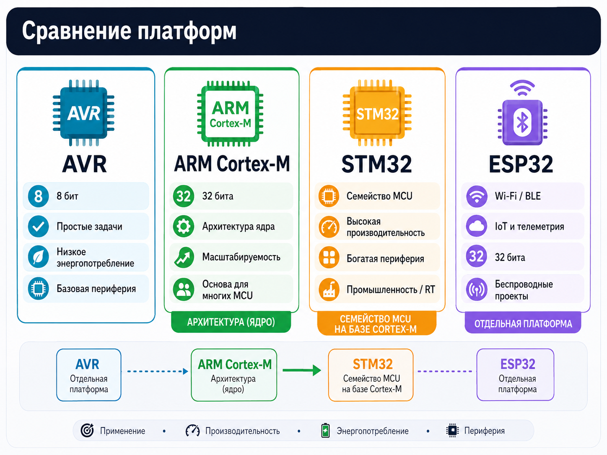

---

## Цели лекции

- объяснять различие между архитектурой процессорного ядра, семейством микроконтроллеров и конкретной микросхемой/отладочной платой;
- характеризовать особенности 8-разрядной AVR и 32-разрядных решений на базе Cortex-M;
- ориентироваться в назначении основных линий STM32 и семейства ESP32;
- сравнивать платформы по вычислительной производительности, памяти, периферии и энергопотреблению;
- оценивать пригодность платформы для систем автоматизации, робототехники, измерительных устройств, автономных узлов и IoT;
- формулировать критерии выбора микроконтроллера с учетом аппаратного и программного резерва.

## Методическая характеристика

Тема посвящена сопоставлению наиболее распространенных классов микроконтроллерных платформ, встречающихся в учебных, промышленных и IoT-проектах. Ключевая задача лекции — научить сравнивать платформы не по принципу «какая быстрее», а по совокупности инженерных критериев: архитектура процессорного ядра, объем и организация памяти, производительность, набор аппаратной периферии, энергопотребление, средства отладки, наличие беспроводной связи и сложность программной экосистемы.

Важный методический момент: AVR, ARM Cortex-M, STM32 и ESP32 находятся на разных уровнях классификации. AVR — семейство и архитектурная линия 8-разрядных микроконтроллеров; ARM Cortex-M — семейство процессорных ядер и архитектур, которое лицензируется производителям; STM32 — семейство микроконтроллеров STMicroelectronics, большая часть которого построена на ядрах Cortex-M; ESP32 — семейство микроконтроллеров/SoC Espressif с интегрированной беспроводной связью, причем классический ESP32 использует Xtensa, а часть новых представителей семейства — RISC-V. Понимание этой иерархии предотвращает типичную ошибку, когда Cortex-M воспринимается как конкретная плата или конкретный микроконтроллер.

Рабочая программа 4 курса связывает освоение современных микроконтроллеров с умением выбирать платформу, использовать GPIO, таймеры, АЦП, ШИМ, прерывания, интерфейсы связи и режимы энергосбережения. Поэтому лекция строится вокруг практического вопроса: какую платформу выбрать для заданной микропроцессорной системы и почему.

## Содержание

1. [Введение и критерии сравнения](#1-введение-и-критерии-сравнения)
2. [AVR: 8-битная архитектура и периферия](#2-avr-8-битная-архитектура-и-периферия)
3. [ARM Cortex-M: 32-битный архитектурный фундамент](#3-arm-cortex-m-32-битный-архитектурный-фундамент)
4. [STM32: семейство микроконтроллеров на Cortex-M](#4-stm32-семейство-микроконтроллеров-на-cortex-m)
5. [ESP32: SoC, беспроводная связь и IoT](#5-esp32-soc-беспроводная-связь-и-iot)
6. [Сводное сравнение и инженерный выбор](#6-сводное-сравнение-и-инженерный-выбор)

---

## 1. Введение и критерии сравнения

### 1. AVR, ARM Cortex-M, STM32 и ESP32: что выбрать?

**Ключевые тезисы**

- Точное название темы 5.1
- Четыре объекта сравнения: AVR, Cortex-M, STM32, ESP32
- Ключевые критерии: применение, производительность, энергопотребление, периферия

**Подробное объяснение**

Начать лекцию следует с практической постановки задачи. В реальном проекте разработчик редко выбирает микроконтроллер только по известности бренда или максимальной тактовой частоте. Платформа должна соответствовать объекту управления: количеству входов и выходов, требованиям к времени реакции, числу датчиков, способу связи, допустимому энергопотреблению и стоимости.

AVR, Cortex-M, STM32 и ESP32 часто встречаются в одной учебной среде, но представляют разные инженерные подходы. AVR хорошо демонстрирует основы микроконтроллерной архитектуры и эффективен в простых системах управления. Cortex-M задает современный 32-разрядный архитектурный фундамент. STM32 превращает Cortex-M в широкий спектр конкретных микроконтроллеров с развитой периферией. ESP32 делает акцент на интеграции вычислений и беспроводных сетей.

Главный вопрос лекции: не «какой микроконтроллер лучший вообще», а «какой из вариантов дает оптимальный баланс ресурсов, энергопотребления, сложности разработки и стоимости для заданной системы».

> **Визуальный акцент:** Четыре логотипа/условных блока, между ними — знак сравнения. Внизу крупный вопрос: «Какая платформа оптимальна для конкретной задачи?»

---

### 2. Цели лекции и ожидаемые результаты

**Ключевые тезисы**

- Понять архитектурные различия
- Научиться читать сравнительные характеристики
- Уметь сопоставлять задачу и аппаратные ресурсы
- Осознать роль энергопотребления и периферии

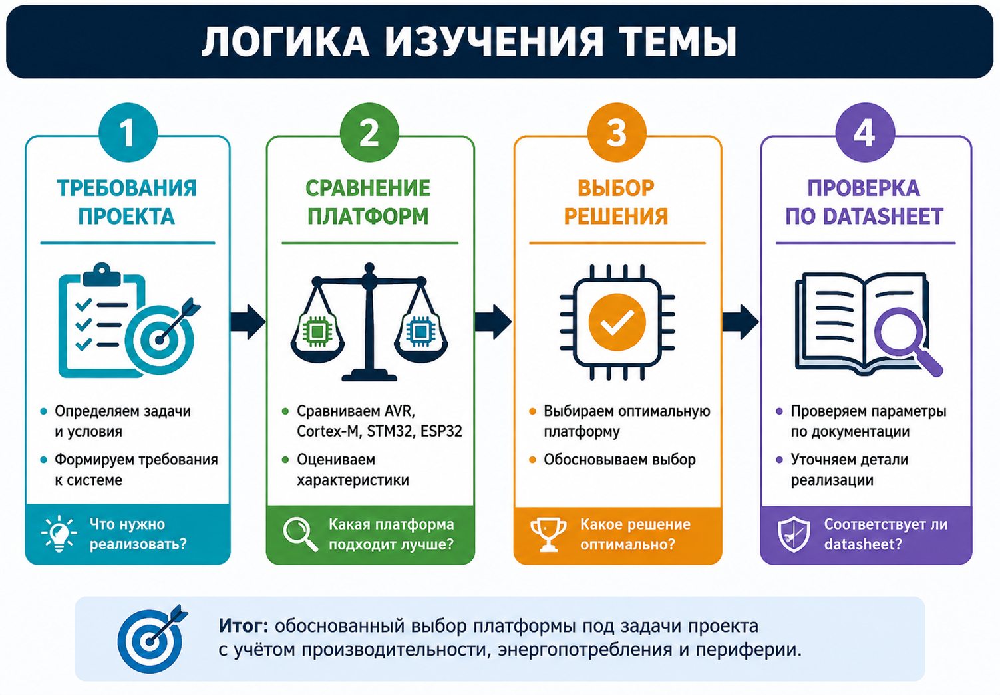

**Подробное объяснение**

После изучения темы обучающийся должен уметь объяснить, почему для простого термостата может быть достаточно 8-разрядного AVR, а для сложной системы управления приводом или измерительного комплекса разумнее использовать STM32. Для автономного датчика с Wi‑Fi выбор может сместиться в сторону ESP32, но при этом возрастает роль режима сна и управления радиомодулем.

Особое внимание уделяется чтению технических характеристик. Частота процессора не равна производительности всей системы, число каналов АЦП не говорит о качестве измерений, а наличие глубокого сна не гарантирует низкое среднее потребление, если устройство большую часть времени работает с включенным радио.

Итоговый результат лекции — умение сформировать аргументированный выбор платформы на языке технических требований: «нужно N GPIO, два UART, CAN, 12-разрядный АЦП, период реакции не более X мс, питание от батареи, поэтому выбираем…».

> **Визуальный акцент:** Схема «требования проекта → сравнение платформ → выбор → проверка по datasheet».

---

### 3. Уровни классификации: ядро, MCU, SoC и плата

**Ключевые тезисы**

- ARM Cortex-M — процессорное ядро/архитектурное семейство
- STM32 — семейство микроконтроллеров ST на Cortex-M
- AVR — семейство 8-разрядных MCU Microchip
- ESP32 — семейство SoC Espressif
- Arduino/Nucleo/DevKit — отладочные платы, а не архитектуры

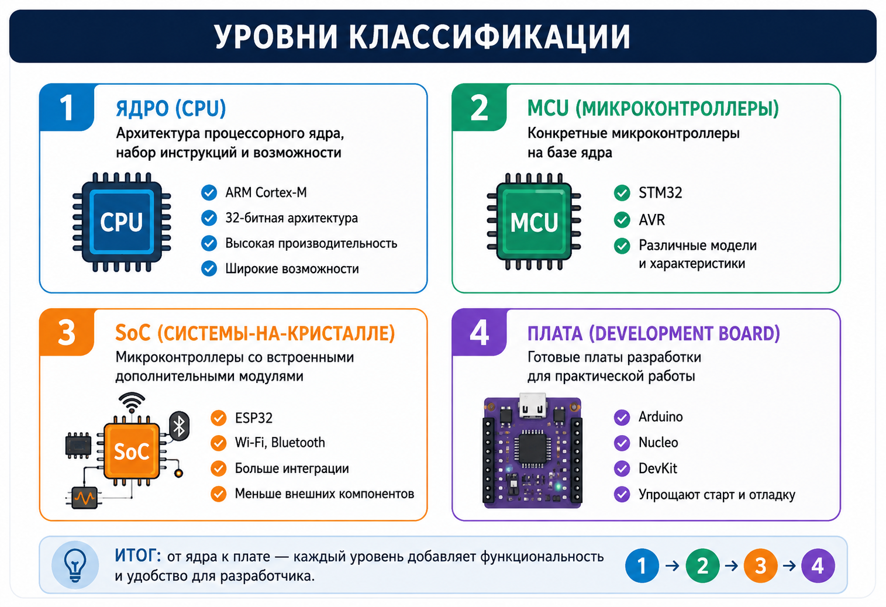

**Подробное объяснение**

Это один из самых важных теоретических слайдов. Термины, которые часто употребляются рядом, относятся к разным уровням. Cortex-M — не конкретная микросхема, а семейство процессорных ядер Arm для микроконтроллеров. Производители, например STMicroelectronics, NXP, Microchip, Nordic и другие, лицензируют ядро и дополняют его собственной памятью, периферией, тактированием и корпусами.

STM32 — конкретное семейство микроконтроллеров STMicroelectronics. Два STM32 могут иметь разные ядра Cortex-M, различаться частотой, Flash, SRAM, ADC, USB, CAN и таймерами. Поэтому фраза «STM32 быстрее AVR» без указания конкретной модели и режима работы слишком общая.

ESP32 — семейство систем-на-кристалле. Классический ESP32 использует ядра Xtensa LX6, ESP32-S3 — Xtensa LX7, а некоторые новые серии, например ESP32-C3/C6, используют RISC-V. Следовательно, ESP32 нельзя относить к Cortex-M только потому, что он является 32-разрядным микроконтроллером.

Отладочная плата также не равна микроконтроллеру. Arduino Uno — плата, классически построенная на ATmega328P; STM32 Nucleo — семейство плат; ESP32 DevKit — плата/модуль вокруг конкретного SoC.

> **Визуальный акцент:** Иерархическая схема: архитектура/ядро → микроконтроллер → модуль/плата → готовое устройство.

---

### 4. Критерии инженерного сравнения

**Ключевые тезисы**

- Архитектура и разрядность
- Тактовая частота и эффективность исполнения
- Flash/SRAM/EEPROM и внешняя память
- GPIO, таймеры, ADC/DAC, интерфейсы
- Энергопотребление и режимы сна
- Средства отладки и программная экосистема
- Стоимость, доступность, масштабируемость

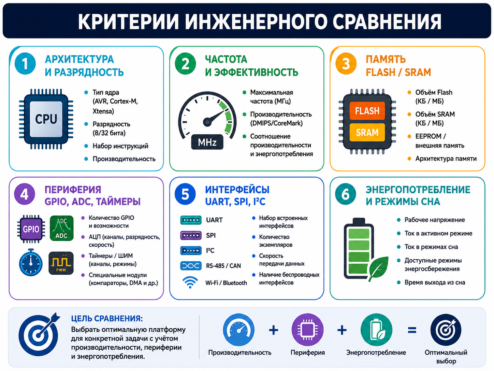

**Подробное объяснение**

Сравнение микроконтроллеров удобно проводить не по одному показателю, а по набору критериев. Архитектура определяет размер регистров, набор команд, особенности обработки прерываний и типичные вычислительные возможности. Память определяет размер программы, буферов, таблиц и стеков. Периферия часто важнее частоты CPU: наличие аппаратного CAN, USB, высокоточного таймера или DMA может радикально упростить проект.

Производительность оценивается не только в мегагерцах. Время выполнения задачи приближенно можно представить как T = Ncycles / fCPU. Но число циклов зависит от архитектуры, компилятора, кэша, wait-state памяти и аппаратных ускорителей. Два микроконтроллера на одинаковой частоте могут иметь разную реальную производительность.

Энергопотребление необходимо оценивать по режимам. Средний ток определяется долями времени в активном состоянии, ожидании и глубоком сне. Поэтому инженер сравнивает не только «ток в Active», но и время пробуждения, потребление периферии, возможность отключать домены питания и частоту выполнения активных операций.

> **Визуальный акцент:** Радарная диаграмма критериев или таблица с семью строками и четырьмя платформами.

---

### 5. Общая карта AVR, Cortex-M, STM32 и ESP32

**Ключевые тезисы**

- AVR: простое 8-битное управление
- Cortex-M: масштабируемая 32-битная архитектура реального времени
- STM32: широкая реализация Cortex-M с богатой периферией
- ESP32: интегрированный MCU/SoC с Wi‑Fi/Bluetooth

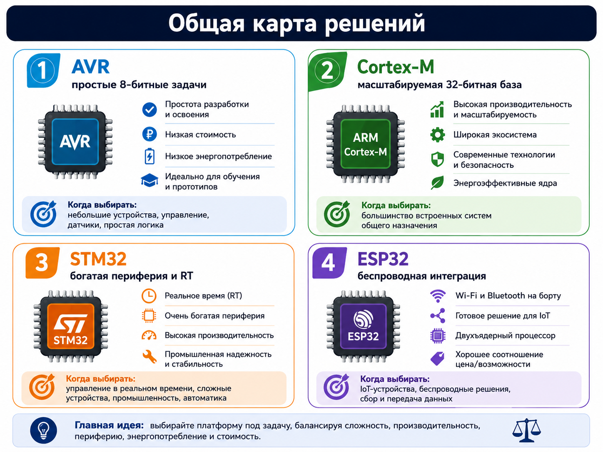

**Подробное объяснение**

AVR удобен там, где требования умеренные, важны простота, предсказуемость и большое количество учебных примеров. Многие задачи управления светодиодами, реле, небольшими дисплеями и простыми датчиками решаются без 32-разрядной вычислительной мощности.

Cortex-M — архитектурная основа огромного числа современных MCU. Младшие ядра ориентированы на минимальную стоимость и энергию, старшие — на обработку сигналов, высокую частоту, FPU, безопасность и сложные системы реального времени.

STM32 охватывает диапазон от простых и дешевых MCU до высокопроизводительных решений. Главное достоинство — сочетание Cortex-M, богатой периферии, DMA, таймеров, развитой системы тактирования и профессиональной отладки.

ESP32 особенно силен в IoT: Wi‑Fi и Bluetooth встроены в кристалл или модуль, что резко сокращает число внешних компонентов. Однако радио увеличивает пиковое и среднее энергопотребление, а программный стек становится сложнее.

> **Визуальный акцент:** Четыре колонки: «простота», «универсальность ядра», «периферия и real-time», «беспроводная интеграция».

---

## 2. AVR: 8-битная архитектура и периферия

### 6. Архитектура AVR: базовая организация

**Ключевые тезисы**

- 8-разрядное RISC-ядро
- Гарвардская организация программ и данных
- Большинство операций через регистры
- Прямой доступ к регистрам периферии
- Простая модель прерываний

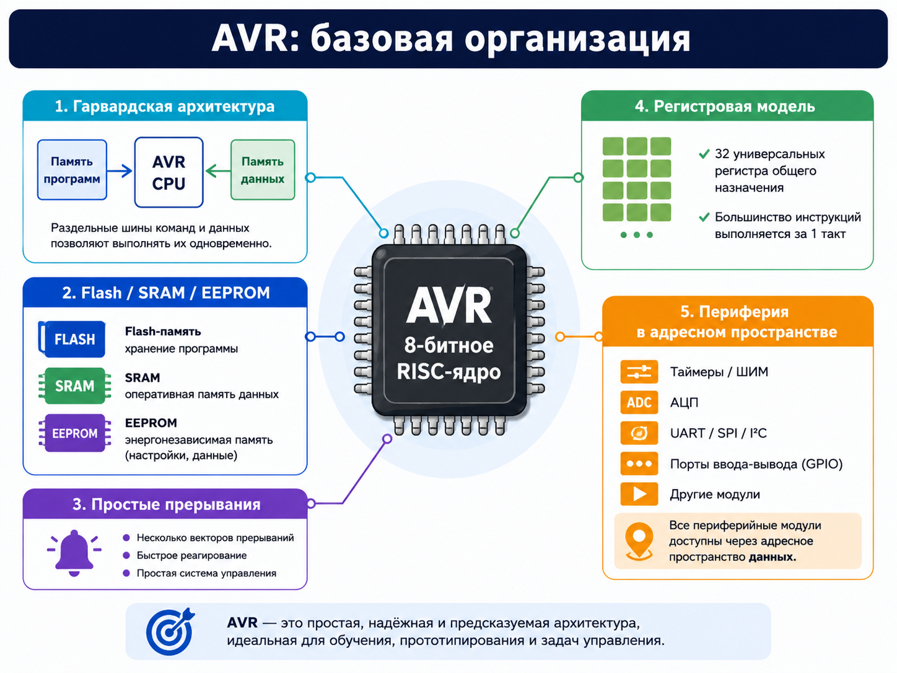

**Подробное объяснение**

Классические AVR — 8-разрядные RISC-микроконтроллеры. Это означает, что естественный размер большинства целочисленных операций — 8 бит. Для 16- и 32-разрядных величин компилятор выполняет несколько последовательных операций. Несмотря на это, для управления дискретными сигналами, таймерами и простыми датчиками такая архитектура остается эффективной.

Гарвардская организация означает разделение памяти программ и памяти данных. Программа находится во Flash, оперативные переменные — в SRAM. Это позволяет организовать независимые пути доступа и делает структуру учебного микроконтроллера наглядной.

Сильная сторона AVR — большое число регистров общего назначения и простая связь между инструкциями и аппаратными ресурсами. В учебном процессе это хорошо демонстрирует, как машинные команды взаимодействуют с портами, таймерами, стеком и прерываниями.

> **Визуальный акцент:** Блок-схема: CPU ↔ регистры; отдельно Flash программы и SRAM данных; вокруг — GPIO, Timer, ADC, UART/SPI/TWI.

---

### 7. AVR: выполнение команд и производительность

**Ключевые тезисы**

- Простые RISC-команды
- Многие операции выполняются за малое число тактов
- Ограниченная 8-битная арифметика
- Предсказуемое время реакции
- Типичные частоты — единицы/десятки МГц

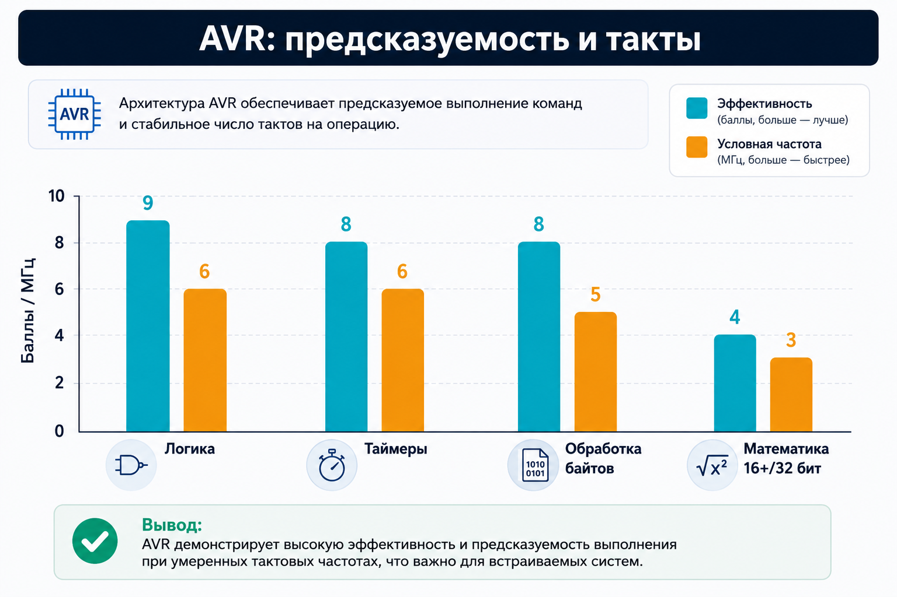

**Подробное объяснение**

AVR традиционно ценится за простую и достаточно предсказуемую модель исполнения. Для систем жесткого или близкого к жесткому реальному времени важна не только максимальная скорость, но и возможность заранее оценить задержку реакции на событие.

При частоте 16 МГц длительность одного такта составляет 62,5 нс. Однако конкретная инструкция может занимать один или несколько тактов, а сложная операция на типе long или float — десятки и сотни тактов. Поэтому корректная оценка производительности всегда идет от алгоритма и типа данных.

Для задач чтения датчиков, управления реле, генерации PWM, обработки кнопок и простых протоколов производительности AVR обычно достаточно. Ограничения становятся заметными при цифровой обработке сигналов, больших графических интерфейсах, сетевых стеках, криптографии и работе с крупными массивами данных.

> **Визуальный акцент:** Временная шкала: Fetch/Execute; рядом пример «16 МГц ≠ 16 млн сложных операций в секунду».

---

### 8. AVR: организация памяти

**Ключевые тезисы**

- Flash — код программы
- SRAM — переменные, буферы, стек
- EEPROM/энергонезависимая память — настройки
- Ограниченный объем RAM как важный фактор
- PROGMEM/хранение констант во Flash в классических AVR

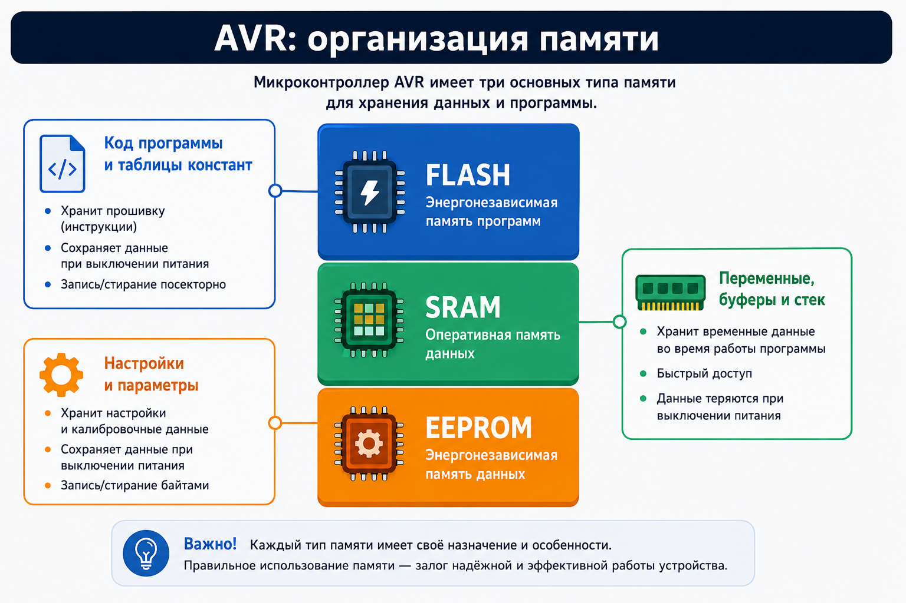

**Подробное объяснение**

В микроконтроллерах AVR объем оперативной памяти обычно существенно меньше объема Flash. Это дисциплинирует разработчика: крупные строки, таблицы и буферы нельзя бездумно хранить в SRAM. На классических AVR при работе с текстом и константами часто применяют хранение данных во Flash.

Стек также размещается в оперативной памяти. Глубокая вложенность функций, рекурсия, крупные локальные массивы и чрезмерное использование динамической памяти могут привести к переполнению SRAM. В небольших встраиваемых системах надежность часто повышают статическим распределением памяти.

EEPROM или другие энергонезависимые области удобно использовать для коэффициентов калибровки, настроек, счетчиков и конфигурации. Но число циклов записи ограничено, поэтому обновлять такие данные в каждом проходе главного цикла нельзя.

> **Визуальный акцент:** Схема трех областей памяти с примерами содержимого: код, переменные, настройки.

---

### 9. AVR: типовая периферия

**Ключевые тезисы**

- GPIO и внешние прерывания
- 8/16-битные таймеры, input capture, PWM
- АЦП и аналоговый компаратор
- USART, SPI, TWI/I2C
- Watchdog, RTC/событийная система в новых семействах

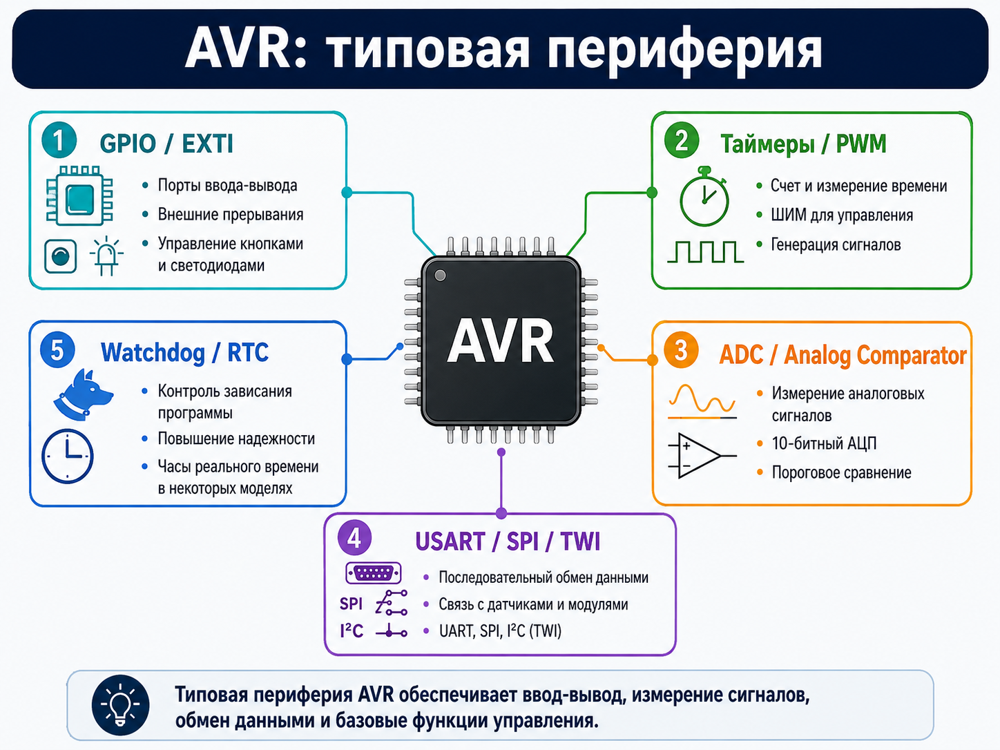

**Подробное объяснение**

В простых проектах ценность AVR определяется не только CPU, но и периферией. Таймеры позволяют формировать PWM, измерять длительности импульсов и создавать точные интервалы без постоянного участия процессора. АЦП обеспечивает подключение аналоговых датчиков. USART, SPI и TWI позволяют работать с дисплеями, памятью и цифровыми датчиками.

Современные AVR развивают идею аппаратной автономности. В ряде семейств присутствуют Event System, Configurable Custom Logic и более развитая аналоговая часть. Это позволяет связывать периферийные блоки между собой без обработки каждого события CPU, снижая задержки и потребление.

При выборе конкретного AVR необходимо проверять число каналов, разрядность таймеров, доступность выводов в выбранном корпусе и ограничения альтернативных функций GPIO. Название семейства само по себе не гарантирует наличие конкретного интерфейса.

> **Визуальный акцент:** Таблица «периферийный блок → типовая задача»: Timer→PWM, ADC→датчик, USART→ПК, SPI→дисплей, TWI→датчики.

---

### 10. AVR: энергопотребление и области применения

**Ключевые тезисы**

- Низкое потребление при умеренной частоте
- Sleep/Power-down режимы
- Быстрое пробуждение и простые duty-cycle системы
- Учебные стенды, бытовая автоматика, простые контроллеры, сенсорные узлы
- Ограничения: RAM, вычисления, графика, сложные сети

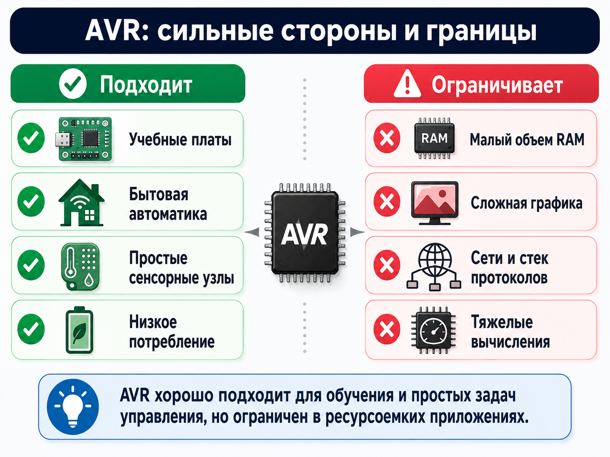

**Подробное объяснение**

AVR хорошо подходит для устройств, которые большую часть времени выполняют простую логику: измерили вход, приняли решение, переключили выход и снова перешли в ожидание. Низкая сложность программной среды и отсутствие тяжелого сетевого стека упрощают расчет времени и энергопотребления.

Типовые области — бытовая автоматика, простые исполнительные контроллеры, учебные системы, датчики, интерфейсные преобразователи, небольшие приборы. Современные 8-битные AVR также используются как вспомогательные MCU рядом с более мощным процессором.

Главные ограничения проявляются при необходимости большой памяти, сложной многозадачности, высокоскоростной обработки сигналов, развитой графики и встроенных беспроводных протоколов. В этих случаях переход на 32-разрядное решение часто уменьшает общую сложность проекта, даже если сам MCU сложнее.

> **Визуальный акцент:** Матрица «подходит хорошо / условно / плохо» для задач: термостат, счетчик импульсов, моторный привод, графический HMI, Wi‑Fi-узел.

---

## 3. ARM Cortex-M: 32-битный архитектурный фундамент

### 11. ARM Cortex-M: что это за архитектура

**Ключевые тезисы**

- 32-разрядное семейство M-profile
- Оптимизация для MCU и систем реального времени
- Единая концепция исключений и NVIC
- Масштабирование от минимальных ядер до DSP/FPU классов
- Большая экосистема CMSIS и инструментов

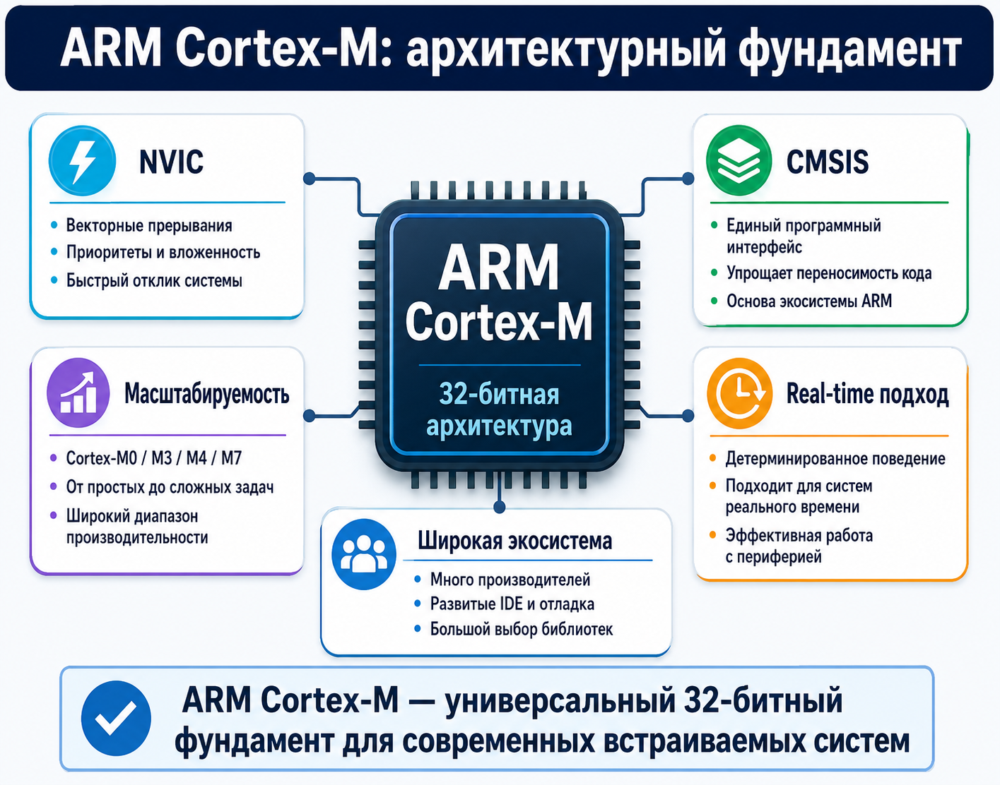

**Подробное объяснение**

Cortex-M — семейство процессорных ядер Arm, специально ориентированное на микроконтроллеры и deeply embedded системы. В отличие от прикладных Cortex-A, которые часто работают с Linux и MMU, Cortex-M проектируются для малых задержек, предсказуемой обработки прерываний и тесной интеграции с периферией.

Разные ядра Cortex-M реализуют разные версии M-profile архитектуры и наборы возможностей. Младшие варианты минимизируют площадь кристалла и потребление, старшие добавляют более производительный pipeline, DSP-инструкции, FPU, кэш и расширенные средства безопасности.

Для программиста важна относительная унификация: сходная модель регистров, системных исключений, NVIC, SysTick и отладки. Это облегчает перенос знаний между микроконтроллерами разных производителей, хотя периферия каждого производителя остается собственной.

> **Визуальный акцент:** Линейка Cortex-M от M0+/M23 к M4/M33 и M7: стрелка «стоимость/энергия → производительность/функции».

---

### 12. Семейство Cortex-M: от M0+ до M7/M33

**Ключевые тезисы**

- Cortex-M0/M0+ — минимальная стоимость и энергия
- Cortex-M3 — универсальное управление
- Cortex-M4 — DSP и часто FPU
- Cortex-M7 — высокая производительность, cache, DSP/FPU
- Cortex-M23/M33 — Armv8-M, расширенная безопасность; M33 поддерживает DSP

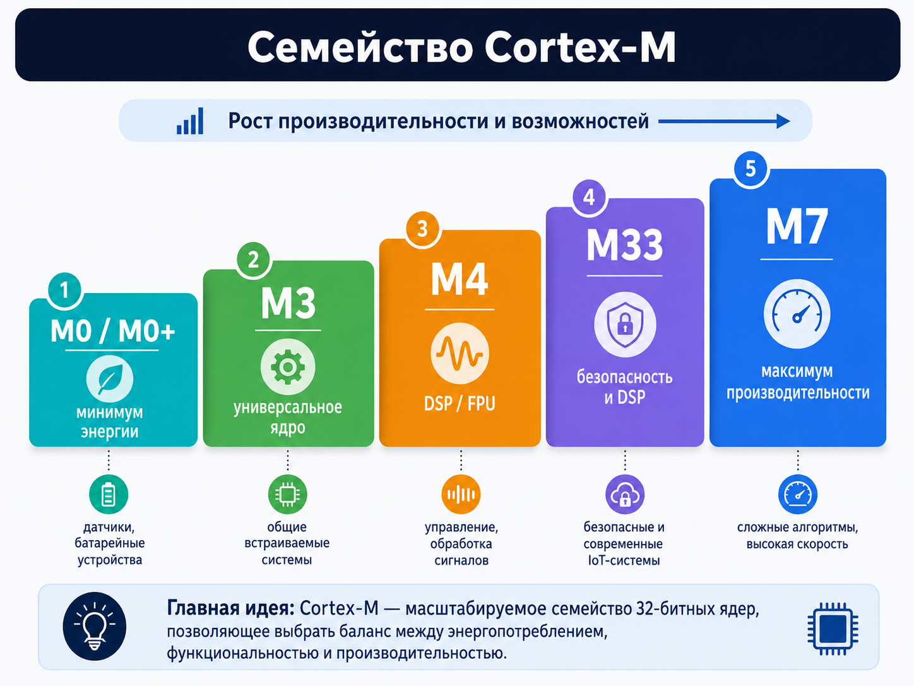

**Подробное объяснение**

Нельзя присвоить Cortex-M одну тактовую частоту или один объем памяти: ядро встраивается в микроконтроллер, а конкретную частоту, Flash, SRAM и периферию определяет производитель чипа. Поэтому корректно сравнивать возможности ядер, а численные параметры брать из datasheet конкретного MCU.

Cortex-M0/M0+ подходит для простых 32-разрядных задач, где важны стоимость и энергоэффективность. Cortex-M3 исторически стал универсальным вариантом для управления. Cortex-M4 добавляет DSP-расширения и часто FPU, что полезно в моторном управлении, фильтрации и обработке сигналов.

Cortex-M7 ориентирован на высокую производительность и сложные real-time вычисления. Cortex-M23/M33 относятся к более новым архитектурам Armv8-M; M33 сочетает развитые возможности управления с механизмами безопасности, включая TrustZone в соответствующих реализациях.

> **Визуальный акцент:** Сравнительная лестница возможностей Cortex-M. Не указывать одну «частоту ядра»: она зависит от конкретного MCU.

---

### 13. Программная модель Cortex-M

**Ключевые тезисы**

- 32-разрядные регистры R0–R15
- SP, LR, PC и регистры состояния
- Thumb/Thumb-2 инструкции в зависимости от ядра
- Единая карта памяти
- Memory-mapped периферия

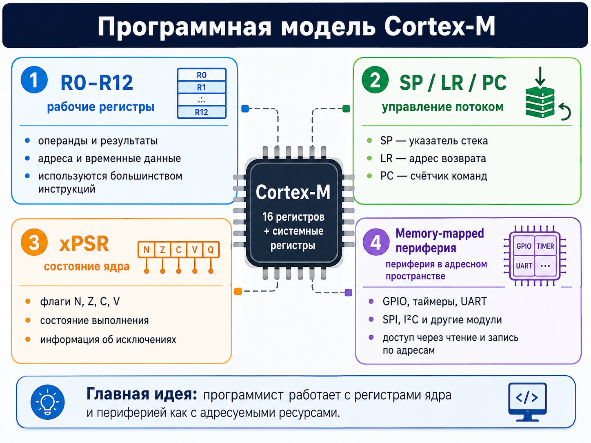

**Подробное объяснение**

Cortex-M использует 32-разрядные регистры общего назначения. Это естественно для работы с адресами, 32-разрядными счетчиками, сетевыми протоколами и более крупными вычислениями. Многие операции, которые на 8-разрядном ядре требуют нескольких команд, выполняются одной или несколькими 32-разрядными инструкциями.

Периферийные регистры обычно отображаются в общее адресное пространство. Это означает, что обращение к GPIO или таймеру концептуально является чтением/записью по определенному адресу памяти. Поверх этой модели производители создают CMSIS-совместимые заголовки, HAL или LL-библиотеки.

Разработчику важно понимать роль SP, LR и PC при вызове функций и обработке исключений. Cortex-M аппаратно сохраняет часть контекста при входе в обработчик прерывания, что ускоряет и стандартизирует реакцию на события.

> **Визуальный акцент:** Схема регистров R0–R12, SP, LR, PC; рядом карта памяти: code, SRAM, peripherals, system region.

---

### 14. NVIC, исключения и SysTick

**Ключевые тезисы**

- Векторная таблица
- NVIC — вложенные и приоритетные прерывания
- Аппаратное сохранение части контекста
- SysTick — системный таймер ядра
- Низкие задержки реакции

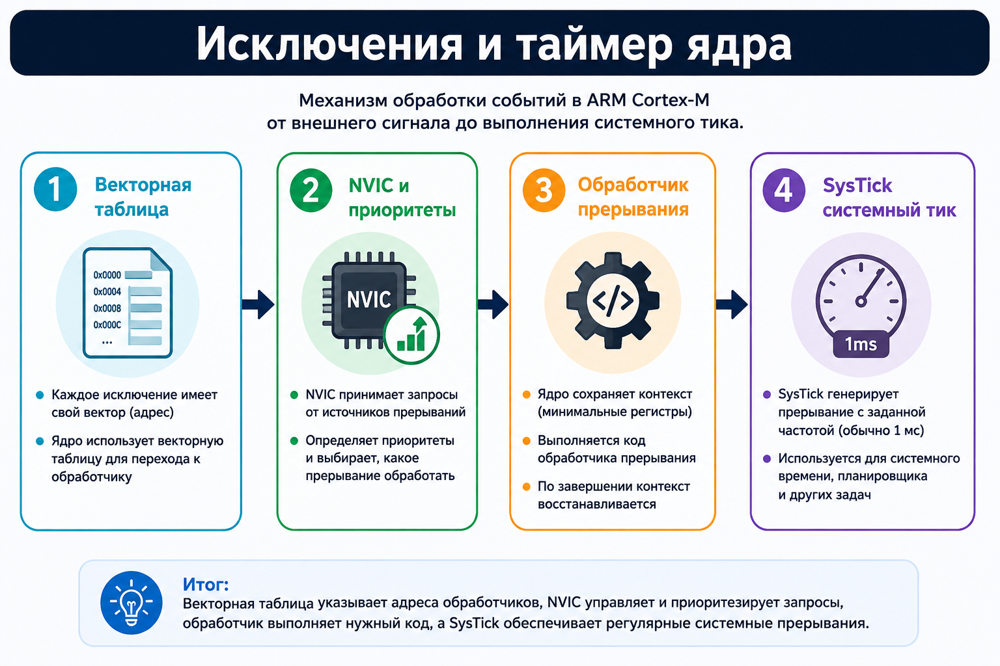

**Подробное объяснение**

NVIC — один из ключевых элементов Cortex-M. Он принимает запросы прерываний, учитывает приоритеты и позволяет более важному событию прерывать обработку менее важного. Это принципиально для систем управления, где аварийный вход должен обслуживаться быстрее, чем, например, обновление дисплея.

При входе в исключение ядро автоматически сохраняет базовый набор регистров на стек. За счет этого обработчик может быть коротким и быстрым, а компилятор берет на себя большую часть служебной работы.

SysTick — системный таймер, встроенный в архитектуру Cortex-M. Его часто используют для системного тика, неблокирующих задержек и RTOS. При этом для точных PWM, capture/compare и моторного управления обычно применяют периферийные таймеры самого микроконтроллера.

> **Визуальный акцент:** Блок-схема: периферия → NVIC → CPU; несколько IRQ с разными приоритетами. Отдельно SysTick как источник периодического события.

---

### 15. Производительность Cortex-M: что дает 32 бита

**Ключевые тезисы**

- Более эффективная 32-битная арифметика
- DSP-инструкции в M4/M7/M33 и др.
- FPU в соответствующих реализациях
- Pipeline, cache и ускорители в старших ядрах
- Производительность зависит от памяти и шин

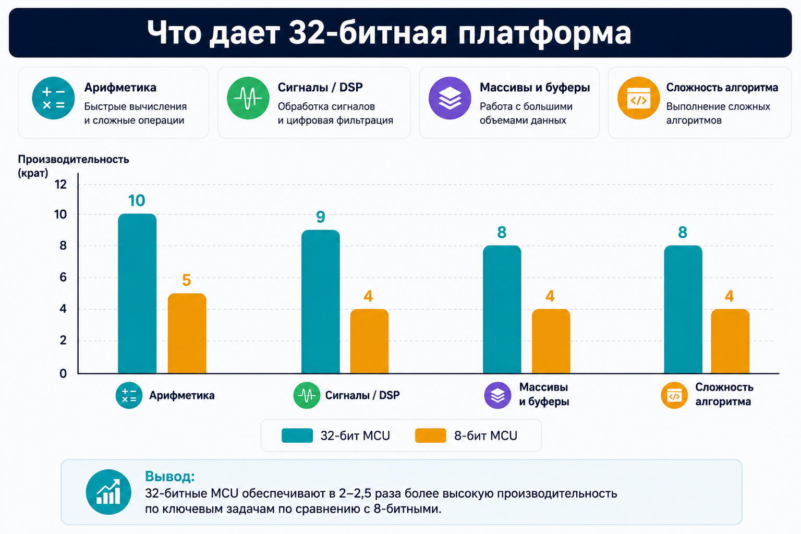

**Подробное объяснение**

32-разрядность особенно полезна при обработке адресов, счетчиков, протокольных структур, фильтров и цифровой обработки. Но сама разрядность не гарантирует высокую скорость: важны частота, архитектура pipeline, скорость Flash, наличие wait-state, кэша и DMA.

DSP-расширения позволяют эффективнее выполнять умножение с накоплением, насыщаемую арифметику и операции над упакованными данными. FPU ускоряет вычисления с плавающей точкой, но только если компилятор настроен на использование аппаратной FPU и алгоритм действительно содержит float-операции.

Для embedded-систем часто важнее не максимальный CoreMark, а выполнение временного ограничения. Если контур управления должен рассчитываться каждые 100 мкс, необходимо оценивать худшее время выполнения, нагрузку прерываний и передач DMA.

> **Визуальный акцент:** Формула T≈Ncycles/fCPU и схема «CPU ↔ Flash/cache ↔ SRAM ↔ bus/peripherals».

---

### 16. Cortex-M: энергосбережение, безопасность и отладка

**Ключевые тезисы**

- Sleep/WFI/WFE как базовые механизмы
- Низкопотребляющие режимы реализует конкретный MCU
- MPU и TrustZone в поддерживаемых ядрах
- SWD/JTAG и hardware breakpoints
- Трассировка и системная диагностика

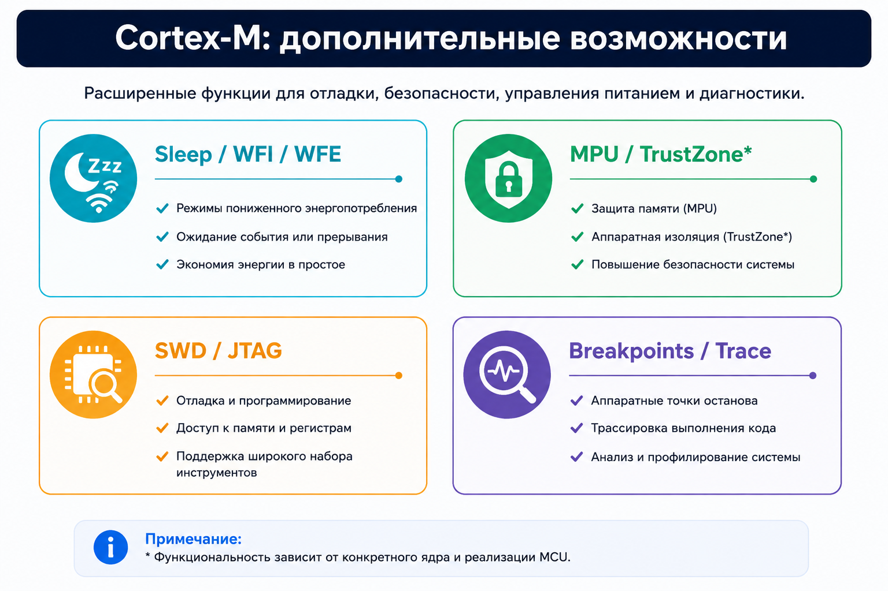

**Подробное объяснение**

Архитектура Cortex-M поддерживает базовые механизмы ожидания событий, но конкретные режимы Stop, Standby, Shutdown и управление тактированием периферии определяются производителем микроконтроллера. Поэтому оценка энергопотребления всегда выполняется по документации конкретного STM32, NXP, SAM и т. п.

В новых архитектурах важную роль играют средства изоляции и безопасности. MPU ограничивает доступ задач к областям памяти, а TrustZone в совместимых Cortex-M позволяет разделить защищенный и обычный миры исполнения. Это особенно важно для устройств с сетевой связью и обновлением прошивки.

SWD — стандартный двухпроводный интерфейс отладки Cortex-M. Он позволяет ставить точки останова, читать регистры и память, выполнять пошаговую отладку. Для профессиональной разработки это огромное преимущество по сравнению с подходом, основанным только на Serial Monitor.

> **Визуальный акцент:** Три блока: Power, Security, Debug. В Debug — ПК ↔ SWD ↔ MCU.

---

## 4. STM32: семейство микроконтроллеров на Cortex-M

### 17. STM32: семейство микроконтроллеров на Cortex-M

**Ключевые тезисы**

- Производитель — STMicroelectronics
- Широкий набор Cortex-M ядер
- Общая периферийная философия и STM32Cube ecosystem
- Масштабирование от простых MCU до высокопроизводительных
- Большое число корпусов и наборов периферии

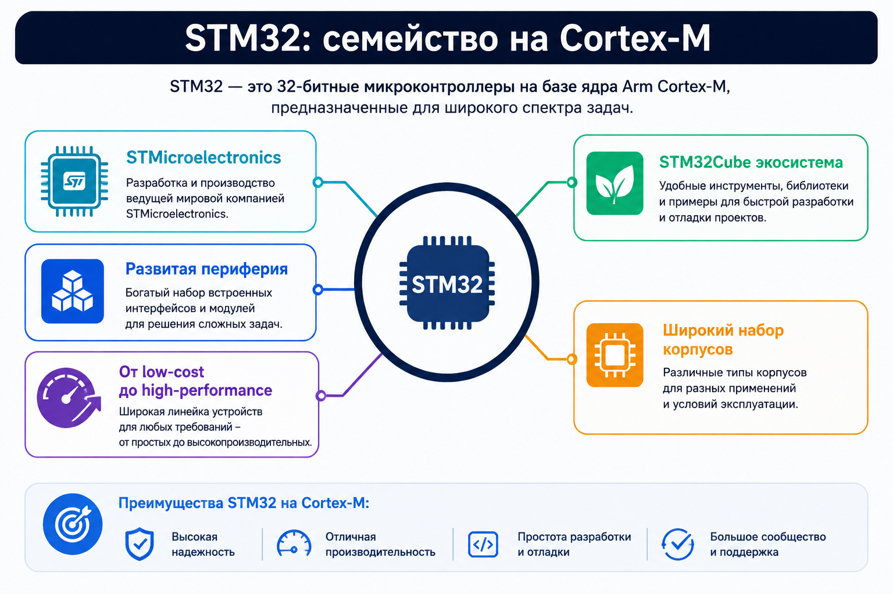

**Подробное объяснение**

STM32 — не одно устройство, а большое семейство. Внутри встречаются разные ядра Cortex-M и разные наборы периферии. Поэтому выбор STM32 начинается не с «берем STM32», а с выбора серии и конкретного part number.

Сильная сторона STM32 — масштабируемость. Разработчик может начать с простого MCU, а затем перейти на более мощную серию, сохраняя многие подходы к GPIO, HAL, CMSIS и инструментам. Это удобно для промышленных семейств устройств с разными комплектациями.

В учебных проектах особенно полезны платы Nucleo и Discovery. Они дают встроенный или доступный SWD-отладчик, разведенные выводы и тесную интеграцию с STM32CubeIDE/CubeMX.

> **Визуальный акцент:** Схема: Arm Cortex-M core + ST bus matrix + Flash/SRAM + timers + analog + interfaces = STM32 MCU.

---

### 18. Основные группы STM32 и их назначение

**Ключевые тезисы**

- Mainstream: C0/G0/F0/F1/G4 и др.
- Ultra-low-power: L/U семейства
- High-performance: F4/F7/H7/H5 и др.
- Wireless: WB/WL и специализированные линии
- Выбор серии определяется задачей, а не только ядром

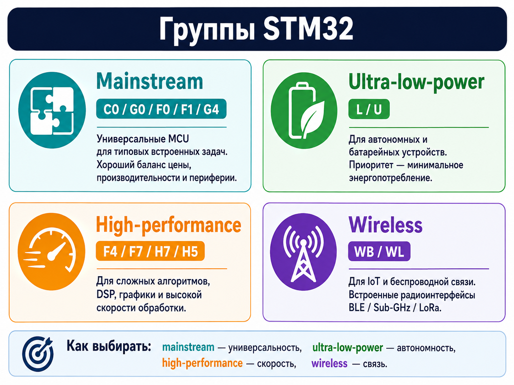

**Подробное объяснение**

Mainstream-линейки предназначены для широкого круга задач управления. Они дают хороший баланс цены, производительности и периферии. Серии с индексом G часто ориентированы на современную периферию и эффективное управление, а исторические F-серии широко распространены в учебных и промышленных проектах.

Низкопотребляющие L/U-линии проектируются для батарейных и автономных устройств. Здесь важны не только токи сна, но и скорость пробуждения, low-power таймеры, RTC и возможность сохранять контекст при выключении доменов.

Высокопроизводительные серии используются для сложной обработки сигналов, графики, управления двигателями, коммуникационных шлюзов и других задач, где нужны высокая частота, большие объемы памяти, кэш, внешняя память или расширенные интерфейсы.

Wireless-линии интегрируют радиоканалы или специализированные беспроводные функции. Но даже внутри одной категории следует сравнивать конкретные модели по datasheet.

> **Визуальный акцент:** Четыре сектора портфеля: mainstream, low-power, high-performance, wireless. В каждом — примеры серий.

---

### 19. STM32: тактирование, шины и реальная производительность

**Ключевые тезисы**

- HSI/HSE/PLL и несколько доменов тактирования
- AHB/APB или аналогичная иерархия шин
- Разные частоты CPU и периферии
- Flash wait-states, cache в старших сериях
- DMA как средство разгрузки CPU

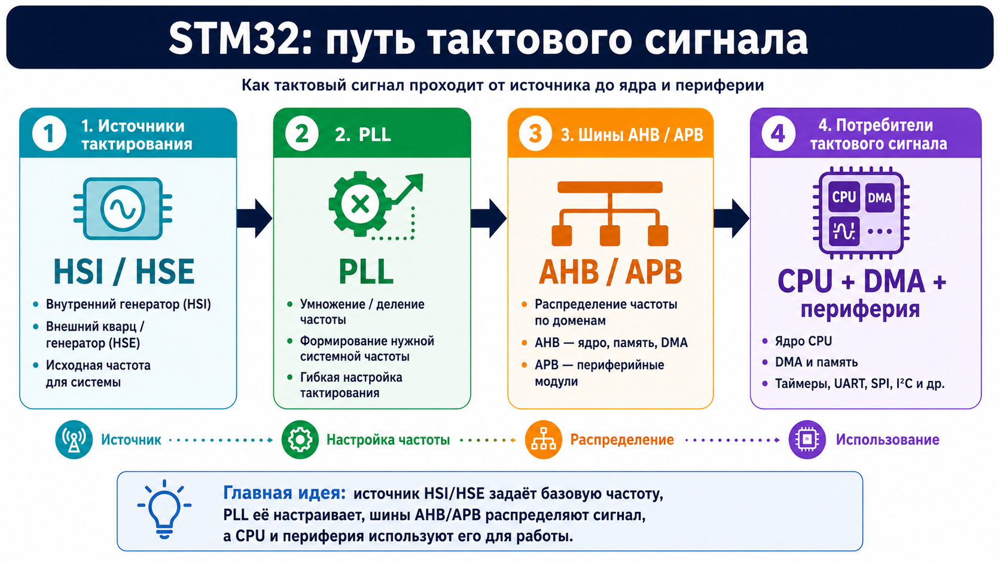

**Подробное объяснение**

В STM32 частота ядра — только часть системы. Отдельные шины и периферийные блоки могут работать на собственных частотах, полученных через делители. Неправильная настройка clock tree приводит к ошибкам UART baud rate, частоты PWM, ADC и системных таймеров.

На высоких частотах Flash не всегда успевает выдавать инструкции за один такт, поэтому используются wait-state, кэш или другие механизмы ускорения. Это показывает, почему простое сравнение мегагерц недостаточно.

DMA позволяет передавать данные между периферией и памятью без обслуживания каждого байта процессором. Например, ADC может складывать результаты в буфер, UART — передавать пакет, SPI — обновлять дисплей, а CPU в это время выполняет алгоритм управления или находится в ожидании.

> **Визуальный акцент:** Схема Clock tree: HSI/HSE → PLL → SYSCLK → AHB/APB → timers/peripherals.

---

### 20. STM32: цифровая периферия и интерфейсы

**Ключевые тезисы**

- GPIO/EXTI
- Расширенные таймеры и PWM
- USART/UART, SPI, I2C/I3C в отдельных сериях
- CAN/FDCAN, USB, Ethernet в соответствующих моделях
- DMA, CRC, hardware crypto в части серий

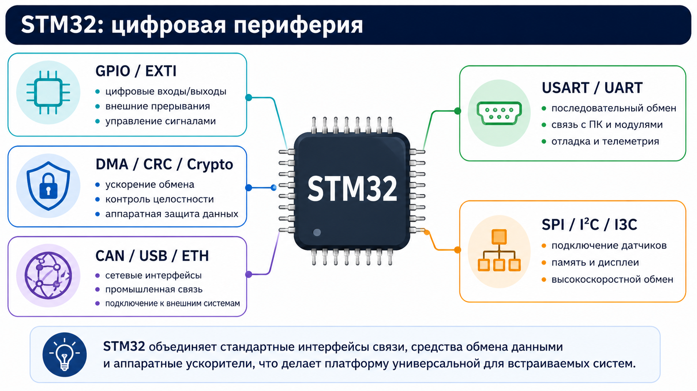

**Подробное объяснение**

STM32 часто выбирают именно из-за богатой периферии. Таймеры способны выполнять захват фронтов, генерацию нескольких каналов PWM, синхронизацию ADC и управление силовыми ключами. В моторных приложениях это позволяет реализовать точные временные связи между измерением тока и переключением транзисторов.

Коммуникационные интерфейсы представлены в разных комбинациях. Одни модели имеют только базовые UART/SPI/I2C, другие добавляют CAN FD, USB, Ethernet, SDMMC и высокоскоростные последовательные блоки. Поэтому для проекта сначала составляют список обязательных интерфейсов, а затем используют selector производителя.

DMA и аппаратные контроллеры контрольной суммы/криптографии позволяют строить системы, которые устойчиво обрабатывают потоки данных без чрезмерной загрузки процессора.

> **Визуальный акцент:** Таблица «периферия → приложение»: advanced timer→motor control; CAN→industrial/auto; USB→device; DMA→streaming.

---

### 21. STM32: аналоговая периферия и таймеры

**Ключевые тезисы**

- 12/16-битные ADC в зависимости от серии
- DAC, comparators, op-amps в отдельных семействах
- Advanced-control timers
- Input capture/output compare
- Синхронный запуск ADC от таймера

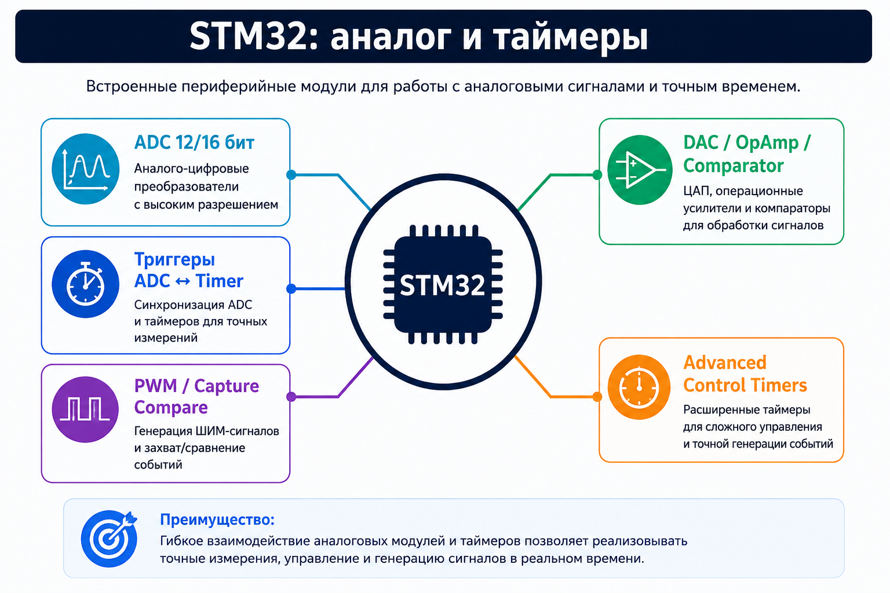

**Подробное объяснение**

В измерительных и управляющих системах качество периферии может быть важнее CPU. STM32 предлагает широкий диапазон аналоговых блоков: ADC, DAC, компараторы и встроенные операционные усилители в отдельных сериях. Но точность зависит не только от разрядности, а от опорного напряжения, разводки земли, шумов питания, времени выборки и калибровки.

Таймеры STM32 — один из наиболее мощных ресурсов семейства. Помимо обычного счета и PWM они поддерживают input capture, output compare, encoder mode, dead-time и синхронизацию. Это делает STM32 особенно удобным для силовой электроники, приводов, частотных измерений и систем автоматики.

Хороший embedded-дизайн связывает периферию аппаратно. Например, таймер формирует событие запуска ADC, ADC передает результат через DMA, а CPU получает прерывание только после заполнения блока данных.

> **Визуальный акцент:** Сигнальная цепочка: датчик → аналоговый фронтенд → ADC → DMA → алгоритм; таймер синхронизирует измерение и PWM.

---

### 22. STM32: энергопотребление и инструменты разработки

**Ключевые тезисы**

- Run/Sleep/Stop/Standby/Shutdown — в зависимости от серии
- Отключение тактирования неиспользуемой периферии
- STM32CubeMX/CubeIDE, HAL, LL, CMSIS
- SWD/JTAG, ST-LINK
- Большая экосистема Nucleo/Discovery

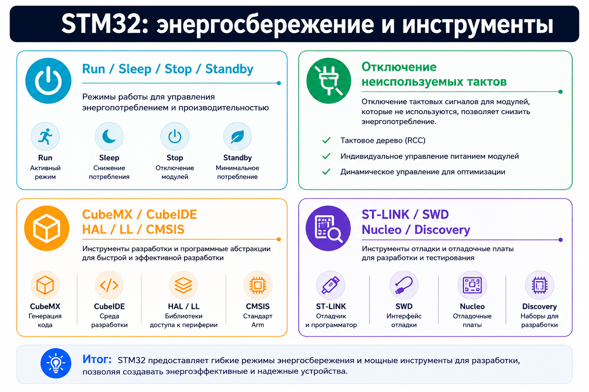

**Подробное объяснение**

В STM32 энергопотребление управляется на нескольких уровнях: частота CPU, напряжение ядра, активность периферии, режим сна и тактирование отдельных доменов. Низкопотребляющий проект требует проектирования сценария работы: пробуждение, измерение, вычисление, передача, возврат в сон.

STM32CubeMX помогает визуально настроить clock tree, GPIO, периферию и конфликты выводов. CubeIDE объединяет генерацию проекта, компиляцию и отладку. HAL ускоряет разработку и повышает переносимость, LL дает более низкоуровневый контроль, а прямой доступ к регистрам используют там, где необходима максимальная предсказуемость или обучение архитектуре.

Аппаратный отладчик ST-LINK и интерфейс SWD позволяют наблюдать память, регистры, переменные, точки останова и периферийные регистры. Для сложной МПС это существенно сокращает время поиска ошибок.

> **Визуальный акцент:** Слева — лестница режимов питания; справа — цепочка CubeMX → code generation → compile → SWD debug.

---

## 5. ESP32: SoC, беспроводная связь и IoT

### 23. ESP32: архитектура системы-на-кристалле

**Ключевые тезисы**

- Классический ESP32: 32-бит Xtensa LX6, одно/два ядра в вариантах
- Интегрированный Wi‑Fi и Bluetooth
- SRAM, ROM, внешняя SPI Flash
- Многофункциональная матрица GPIO
- Отдельные low-power/RTC блоки

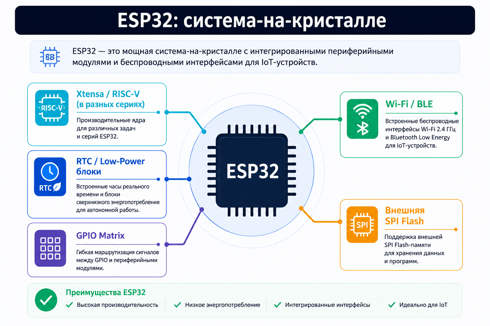

**Подробное объяснение**

ESP32 отличается от типичного «чистого» MCU сильной интеграцией коммуникаций. Классический ESP32 содержит 32-разрядные ядра Xtensa LX6 с частотой до 240 МГц, встроенный Wi‑Fi 2,4 ГГц и Bluetooth, а также развитую цифровую периферию. В официальном datasheet классического ESP32 указывается 520 КБ SRAM; код и ресурсы обычно хранятся во внешней SPI Flash модуля.

Важно не переносить характеристики классического ESP32 на все семейство. Например, ESP32-C3/C6 используют RISC-V, ESP32-S3 — другую версию Xtensa и имеют иной набор периферии. Поэтому слово «ESP32» всегда желательно уточнять названием конкретного SoC или модуля.

GPIO matrix позволяет гибко назначать многие периферийные сигналы на выводы. Это удобно для разводки, но некоторые пины имеют специальные функции, ограничения загрузки или заняты внешней Flash/PSRAM, поэтому pinout платы обязательно проверяют по документации.

> **Визуальный акцент:** Блок-схема SoC: CPU cores, SRAM/ROM, Wi‑Fi/BT, RTC, GPIO matrix, timers, ADC/DAC, SPI/I2C/UART.

---

### 24. ESP32: Wi‑Fi и Bluetooth как главное отличие

**Ключевые тезисы**

- Wi‑Fi 802.11 b/g/n 2,4 ГГц у классического ESP32
- Bluetooth Classic + BLE у классического ESP32
- TCP/IP, HTTP, MQTT и другие сетевые стеки
- Режимы Station/SoftAP
- Сетевая функциональность увеличивает сложность и энергопотребление

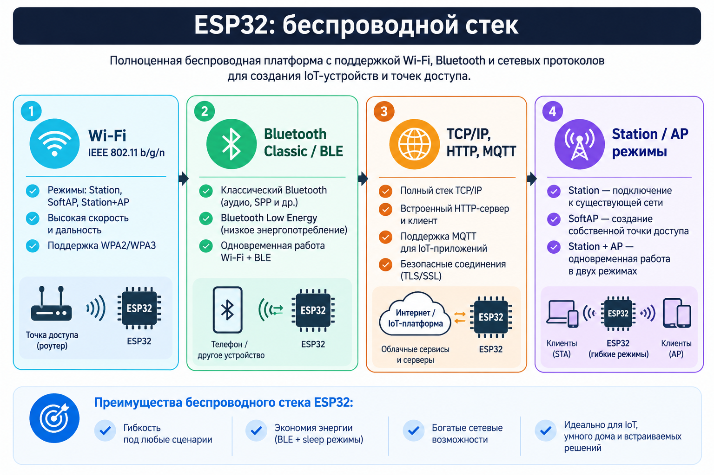

**Подробное объяснение**

Главное преимущество ESP32 — возможность построить сетевой узел без отдельного Wi‑Fi-модуля. Это особенно выгодно для телеметрии, удаленного управления, домашней автоматизации, мобильной настройки устройств и IoT-шлюзов.

Вместе с возможностями появляются дополнительные задачи: подключение к сети, хранение учетных данных, обработка разрывов связи, повторное соединение, безопасность TLS, обновление по сети и сетевые таймауты. То есть ESP32 снижает аппаратную сложность, но увеличивает программную.

Радиопередача требует заметно большего тока, чем сон или простая работа CPU. Поэтому батарейный IoT-проект строится на duty cycle: устройство просыпается, измеряет, быстро передает пакет и снова засыпает. Постоянно включенный Wi‑Fi существенно сокращает время автономной работы.

> **Визуальный акцент:** Сценарий: датчик → ESP32 → Wi‑Fi router → MQTT broker/cloud → dashboard; рядом Bluetooth-связь со смартфоном.

---

### 25. ESP32: периферия, память и FreeRTOS

**Ключевые тезисы**

- UART, SPI, I2C, I2S
- ADC, DAC у классического ESP32, touch sensors
- RMT, pulse counter, PWM/LEDC
- TWAI (CAN 2.0 compatible controller) у классического ESP32
- ESP-IDF и FreeRTOS как базовая программная среда

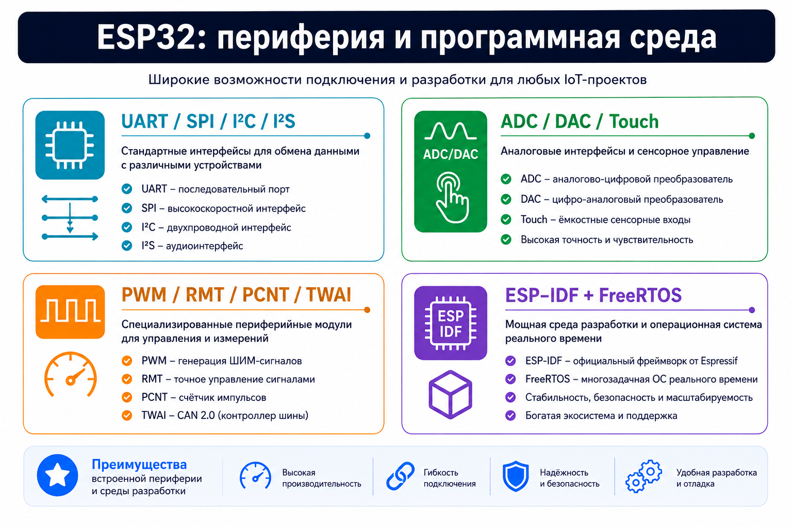

**Подробное объяснение**

ESP32 имеет богатую периферию, ориентированную не только на классическое управление, но и на мультимедиа, импульсные протоколы и сетевые устройства. RMT удобен для точного формирования/приема импульсных последовательностей, I2S — для цифрового аудио и потоковых данных, TWAI позволяет строить CAN-совместимые сети при наличии внешнего трансивера.

В ESP-IDF многозадачность FreeRTOS является естественной частью архитектуры ПО. Сетевой стек, драйверы и пользовательские задачи работают параллельно, используя очереди, семафоры и события. Это мощно, но требует понимания синхронизации и разделяемых ресурсов.

Оперативная память расходуется не только прикладным кодом, но и системными компонентами. Поэтому при работе с TLS, веб-серверами, буферами изображений или большим JSON необходимо контролировать heap и stack каждой задачи.

> **Визуальный акцент:** Схема задач FreeRTOS: Sensor Task, Network Task, UI Task, Queue; снизу — периферия и драйверы.

---

### 26. ESP32: энергопотребление и ограничения

**Ключевые тезисы**

- Активное радио — высокий ток относительно простых MCU
- Light-sleep/deep-sleep режимы
- RTC-домен и источники пробуждения
- Логические уровни 3,3 В
- АЦП и аналоговые измерения требуют аккуратной калибровки

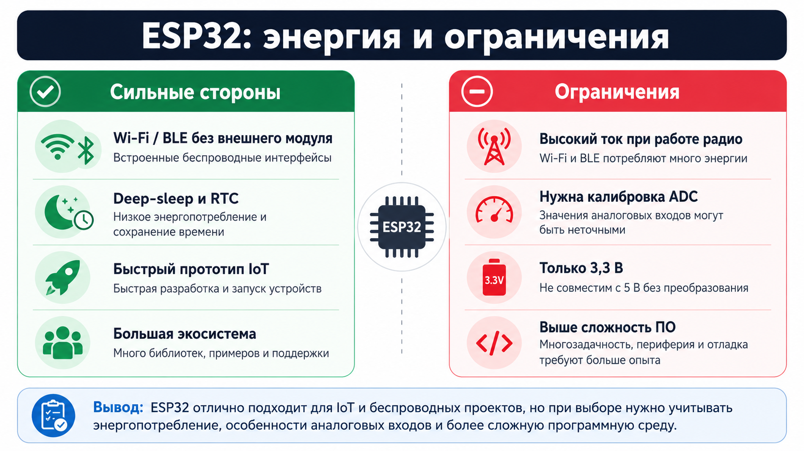

**Подробное объяснение**

ESP32 может работать в глубоких режимах сна с очень низким потреблением, но это не означает, что любой проект на ESP32 автоматически энергоэффективен. Средний ток определяется длительностью радио-сеанса, частотой пробуждений, временем подключения к сети и активностью периферии.

Большинство плат ESP32 рассчитаны на логику 3,3 В. Подключение 5-вольтовых сигналов без согласования уровней может повредить микроконтроллер. При переходе с Arduino Uno это одно из наиболее частых аппаратных ошибок студентов.

Аналоговые входы ESP32 удобны, но для точных измерений необходимо учитывать особенности конкретной серии, нелинейность, шум, диапазоны attenuation и влияние цифровой/радиочасти. Если главная задача — высокоточные аналоговые измерения, специализированный ADC или STM32 с подходящей аналоговой периферией может быть рациональнее.

> **Визуальный акцент:** График качественного характера: Active Wi‑Fi → CPU active → light sleep → deep sleep. Подпись: «важен средний ток за цикл».

---

## 6. Сводное сравнение и инженерный выбор

### 27. Сводное сравнение AVR, Cortex-M, STM32 и ESP32

**Ключевые тезисы**

- Единая таблица по архитектуре, производительности, энергии и периферии
- Качественные оценки без ложной точности
- Примечание: Cortex-M — ядро, а не конкретный MCU

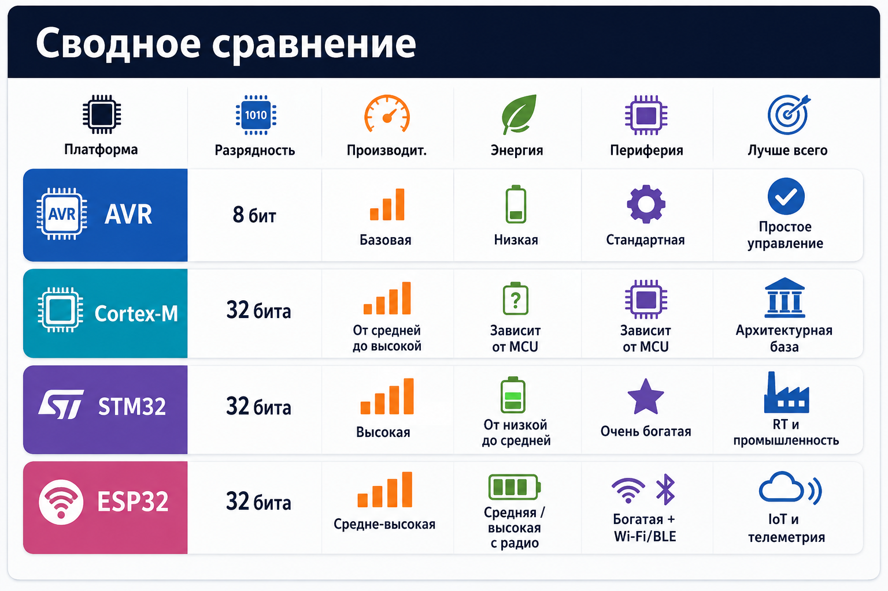

**Подробное объяснение**

Сводное сравнение показывает, что категории частично пересекаются. STM32 является реализацией Cortex-M, поэтому в колонке Cortex-M оцениваются архитектурные возможности ядра, а в колонке STM32 — конкретная экосистема и периферийный портфель ST.

Частоты и объемы памяти в таблице должны восприниматься как типичные классы, а не гарантированные значения. Для проектирования всегда используется datasheet конкретного part number. Особенно это важно для количества ADC, UART, CAN, USB, памяти и поддерживаемых режимов сна.

Главный инженерный вывод: AVR выигрывает простотой и предсказуемостью; Cortex-M — масштабируемой 32-разрядной архитектурой; STM32 — сочетанием Cortex-M с богатой real-time периферией; ESP32 — интеграцией беспроводной связи и сетевого программного стека.

> **Визуальный акцент:** Большая сравнительная таблица. Отдельной строкой — «главное преимущество» и «главное ограничение».

---

### 28. Выбор платформы по типовым задачам

**Ключевые тезисы**

- Термостат/счетчик → AVR или младший Cortex-M
- Моторное управление → STM32 с advanced timers/ADC
- Батарейный датчик → AVR или low-power STM32; ESP32 при редких сеансах Wi‑Fi
- IoT/телеметрия → ESP32
- Сложная обработка/графика → старший STM32 или подходящий ESP32-S3/др.

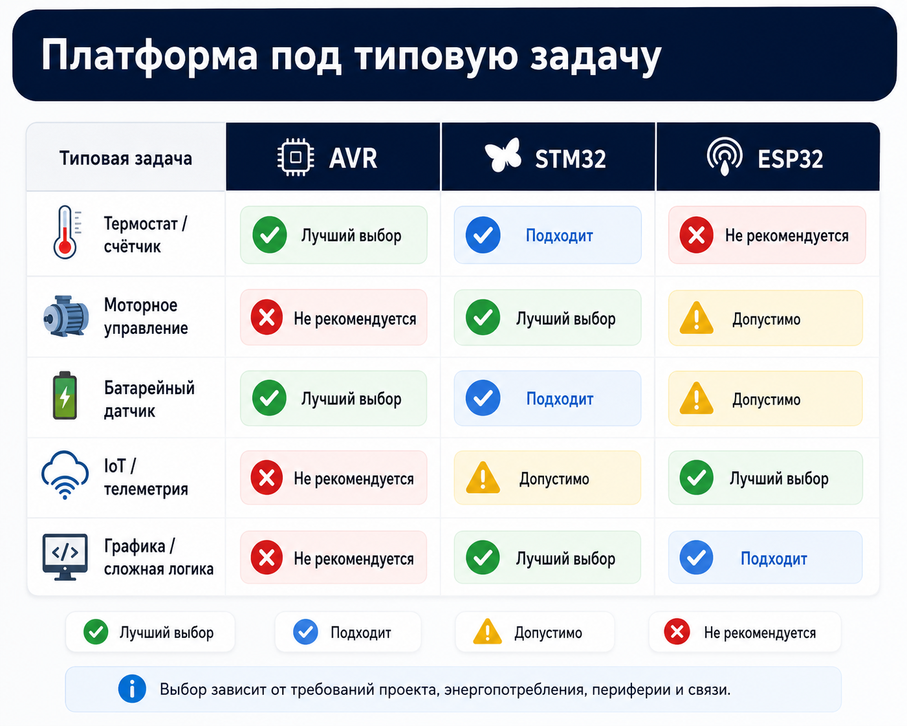

**Подробное объяснение**

Для простого термостата с одним датчиком, реле и дисплеем применение высокопроизводительного MCU не обязательно. AVR дает простую программу и понятную отладку. Если нужны дополнительные интерфейсы, 32-разрядные вычисления и запас на расширение, младший Cortex-M/STM32 может быть рациональнее.

Для моторного управления важны advanced timers, синхронный ADC, быстрые прерывания и аппаратное формирование PWM с dead-time. Здесь STM32, особенно соответствующие серии с моторной и mixed-signal периферией, имеет сильное преимущество.

Для автономного датчика с батареей выбор зависит от связи. Если связь проводная или отсутствует, AVR/low-power STM32 часто проще. Если требуется Wi‑Fi, ESP32 может уменьшить аппаратную часть, но энергию нужно экономить за счет глубокого сна и коротких сетевых сеансов.

Для сложной графики или обработки сигналов смотрят на старшие Cortex-M/STM32 с FPU, DSP, cache и достаточной RAM либо на специализированные ESP32-варианты. Здесь решающими становятся объемы памяти, интерфейсы дисплея и программная экосистема.

> **Визуальный акцент:** Пять карточек задач; под каждой — рекомендуемый класс платформы и объяснение одним предложением.

---

### 29. Инженерный алгоритм выбора микроконтроллера

**Ключевые тезисы**

- 1. Определить входы/выходы и интерфейсы
- 2. Задать временные ограничения
- 3. Оценить Flash/RAM и вычисления
- 4. Рассчитать энергетический сценарий
- 5. Проверить напряжения и корпус
- 6. Оценить инструменты/библиотеки
- 7. Заложить 20–30% разумного резерва и проверить datasheet

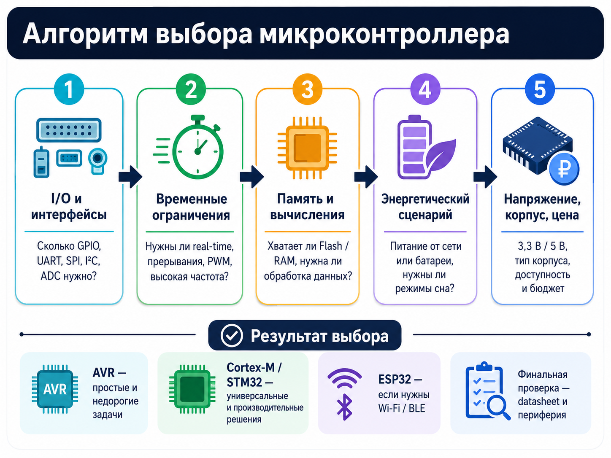

**Подробное объяснение**

Правильный выбор начинается с технического задания. Сначала составляют таблицу сигналов: сколько цифровых входов и выходов, сколько ADC, нужны ли PWM, encoder inputs, UART, I2C, SPI, CAN, USB и беспроводная связь. Далее задают временные требования: частота измерения, максимальная задержка реакции, период управления.

После этого оценивают программные ресурсы: размер кода, RAM для буферов, стеков и RTOS, необходимость float/DSP, сетевых протоколов и файловой системы. Затем рассчитывают энергетический сценарий. Формула среднего тока: Iavg = Σ(Ii·Di), где Di — доля времени в соответствующем режиме. Это позволяет сравнивать устройство с 10 мА постоянно и устройство с 100 мА в течение 1% времени.

Последний этап — проверка конкретного part number: напряжение питания, допустимый ток GPIO, pin multiplexing, число реально доступных интерфейсов в выбранном корпусе, температура, наличие отладчика и доступность компонентов. Разумный запас нужен для расширения проекта, но чрезмерный запас приводит к ненужной стоимости и сложности.

> **Визуальный акцент:** Блок-схема выбора с развилками «нужен Wi‑Fi?», «нужен CAN?», «battery?», «DSP/FPU?», «сколько ADC/timers?».

---

### 30. Итоги темы и контрольные вопросы

**Ключевые тезисы**

- AVR — простота и 8-битное управление
- Cortex-M — масштабируемая 32-битная архитектура
- STM32 — богатая real-time периферия и профессиональная экосистема
- ESP32 — беспроводная интеграция и RTOS
- Выбор определяется требованиями проекта

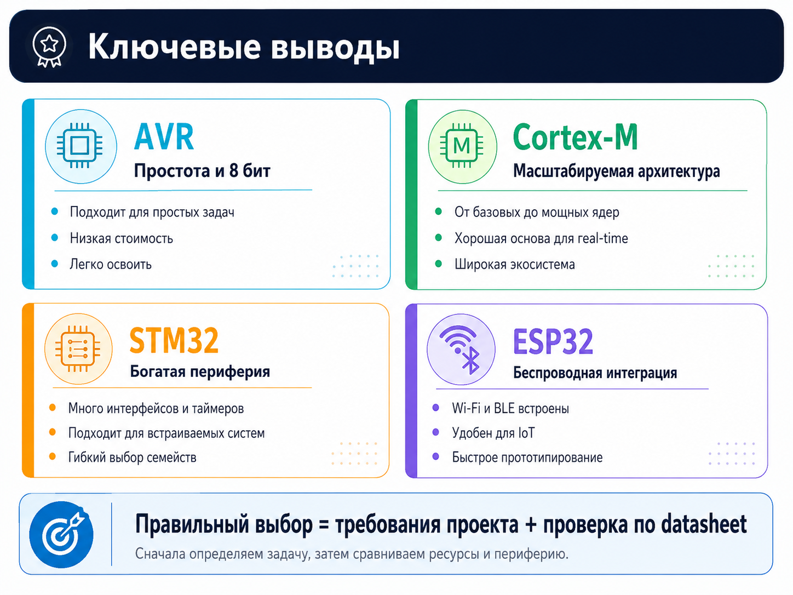

**Подробное объяснение**

В завершение необходимо вернуть студентов к исходному вопросу. Нельзя корректно назвать одну платформу «лучшей». AVR может быть лучшим выбором для простой, надежной и дешевой системы. STM32 — для задач с точными таймерами, ADC, CAN, DMA и жесткими временными ограничениями. ESP32 — когда сетевые функции являются частью основной задачи. Cortex-M объединяет большой класс 32-разрядных MCU и дает общую программную и отладочную модель.

Особенно важно различать характеристики ядра и конкретного микроконтроллера. Cortex-M33 сам по себе не сообщает объем Flash и число UART; ESP32 как название семейства не сообщает архитектуру конкретного варианта; STM32 как бренд не определяет производительность без серии и part number.

Практический навык после лекции — составить таблицу требований и выбрать микроконтроллер с техническим обоснованием, а затем проверить это решение по datasheet и reference manual.

4. Дополнительные сравнительные материалы для преподавателя

4.1. Как корректно сравнивать производительность

Тактовая частота fCPU показывает, сколько тактов генерируется в секунду, но не определяет напрямую количество полезных операций. Для оценки конкретной функции полезна формула Ttask ≈ Ncycles / fCPU. Ncycles зависит от набора команд, оптимизации компилятора, обращений к памяти, кэша, wait-state, прерываний и DMA.

Для AVR характерна высокая эффективность простых регистровых операций на небольшой частоте. Cortex-M4/M7/M33 могут выполнять специализированные DSP-инструкции, а наличие FPU резко меняет время выполнения float-алгоритмов. ESP32 одновременно обслуживает пользовательский код и системные сетевые задачи, поэтому измерять только частоту CPU недостаточно.

Корректный способ выбора: взять критичный алгоритм или его оценочную сложность, измерить/оценить worst-case execution time и убедиться, что остается запас по времени.

4.2. Как сравнивать энергопотребление

Мощность приблизительно определяется P = U × I, а энергия за интервал E = P × t. Для батарейного устройства особенно важен средний ток Iavg = Iactive·Dactive + Isleep·Dsleep + Iradio·Dradio + …, где D — доля времени в режиме.

Например, устройство, потребляющее 80 мА в течение 0,2 с и 20 мкА в течение 59,8 с, имеет совсем другой средний ток, чем устройство с постоянными 8 мА. Поэтому таблица «ток в Active» без duty cycle может дать неверный выбор.

Нужно учитывать также стабилизатор, светодиоды платы, USB-UART, датчики и внешнюю память. Отладочная плата почти всегда потребляет больше, чем оптимизированное конечное устройство на той же микросхеме.

4.3. Типичные ошибки при сравнении

Сравнивать Cortex-M и STM32 как два независимых конкурирующих семейства, не объясняя, что STM32 использует Cortex-M.

Считать, что 32-битный MCU автоматически лучше 8-битного для любой задачи.

Сравнивать только максимальные MHz и игнорировать память, DMA и периферию.

Оценивать энергопотребление только по одному режиму.

Игнорировать уровни 5 В/3,3 В и допустимые токи выводов.

Выбирать MCU без проверки, что нужные периферийные функции доступны одновременно на выводах конкретного корпуса.

Использовать характеристики «ESP32 вообще» без указания серии/варианта.

Закладывать нулевой резерв Flash/RAM/GPIO либо, наоборот, выбирать избыточную платформу без необходимости.

5. Контрольные вопросы

Почему ARM Cortex-M и STM32 нельзя считать сущностями одного уровня классификации?

Какие свойства AVR делают его удобным для простых систем управления?

Почему сравнение тактовых частот разных MCU не дает полной оценки производительности?

Какие преимущества дает NVIC в Cortex-M?

Для каких задач DSP-инструкции и FPU могут быть критически важны?

Почему STM32 часто выбирают для моторного управления?

Как DMA влияет на загрузку процессора?

В чем основное отличие ESP32 от типичного MCU без радио?

Почему ESP32 может быть одновременно мощным и энергоэффективным только при правильном duty cycle?

Какие аппаратные риски возникают при подключении 5-вольтовой периферии к ESP32?

Какие параметры аналогового тракта важнее одной только разрядности ADC?

Какие три группы требований нужно определить до выбора микроконтроллера?

Почему следует проверять pin multiplexing конкретного корпуса?

В каких случаях AVR будет рациональнее STM32?

В каких случаях STM32 будет рациональнее ESP32, несмотря на отсутствие встроенного Wi‑Fi?

Как выбрать платформу для батарейного датчика с передачей данных один раз в час?

Что должно быть указано в обосновании выбора микроконтроллера для итогового проекта?

Почему отладочная плата и конечное устройство могут иметь разное энергопотребление?

6. Задание для закрепления

7. Источниковая основа и рекомендуемые материалы

1. Рабочая программа для студентов 4 курса специальности 09.02.01 «Компьютерные системы и комплексы»: требования к знанию архитектуры AVR, ARM Cortex-M, ESP32 и STM32, периферии, тактирования и режимов энергосбережения. Тематическая формулировка лекции принята в редакции, указанной преподавателем: «Тема 5.1. AVR, ARM Cortex-M, STM32 и ESP32: сравнительная характеристика, области применения, производительность, энергопотребление и периферия».

2. Arm. Cortex-M Processor Comparison Table. Официальная сравнительная таблица ядер Cortex-M.

3. Microchip Technology. AVR Microcontrollers (MCUs) и материалы по 8-bit PIC/AVR MCU portfolio.

4. STMicroelectronics. STM32 32-bit Arm Cortex MCUs — официальное описание семейства и документация по сериям.

5. Espressif Systems. ESP32 Series Datasheet и ESP-IDF Programming Guide / Hardware Reference.

6. При подготовке конкретного проекта численные параметры следует брать из datasheet, reference manual и errata выбранного микроконтроллера/модуля. Частоты, память, число интерфейсов и токи существенно зависят от модели и режима работы.

> **Визуальный акцент:** Сводная схема «задача → критерии → платформа». Внизу 5–7 коротких контрольных вопросов.

---

## Итоговый чек-лист выбора микроконтроллера

Перед окончательным выбором платформы необходимо последовательно проверить:

1. требуемое число GPIO и набор интерфейсов;
2. временные ограничения и требования реального времени;
3. объём Flash и RAM, сложность вычислений;
4. энергетический сценарий и режимы сна;
5. рабочее напряжение, корпус, стоимость и доступность;
6. соответствие характеристик **конкретной микросхемы** данным её datasheet.

> **Правильный выбор = требования проекта + проверка по datasheet.**

---

### Иллюстрации

Все схемы и инфографика в этом конспекте сохранены в каталоге `images/` в формате PNG.
