# Лекция 5.2. Программная модель ARM Cortex-M

**МДК.02.02 «Программирование микроконтроллеров»**  
**Специальность:** 09.02.01 «Компьютерные системы и комплексы»  
**Курс:** 4  
**Продолжительность:** 90 минут  

> **Тема:** программная модель ARM Cortex-M: регистры ядра, карта памяти, NVIC, SysTick, интерфейсы SWD и JTAG.

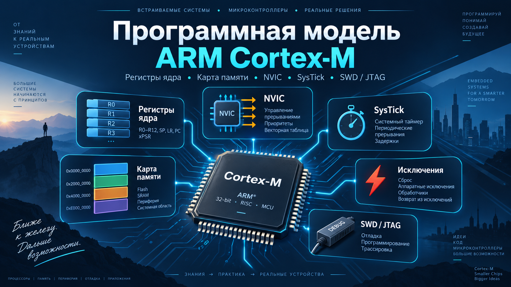

---

## 1. Цель и планируемые результаты обучения

Цель лекции — сформировать целостное представление о **программной модели ARM Cortex-M**, то есть о тех архитектурных объектах и механизмах, которые непосредственно доступны программному обеспечению: регистрах ядра, адресном пространстве, системе исключений и прерываний, системном таймере и средствах аппаратной отладки.

После изучения материала студент должен уметь:

- объяснять назначение регистров **R0–R15** и основных специальных регистров Cortex-M;
- различать **MSP** и **PSP**, а также **Thread mode** и **Handler mode**;
- интерпретировать типовую карту 32-битного адресного пространства Cortex-M;
- объяснять принцип **memory-mapped I/O**;
- описывать назначение таблицы векторов и контроллера **NVIC**;
- различать состояния IRQ и понимать принцип приоритетной и вложенной обработки прерываний;
- объяснять автоматическое сохранение контекста при входе в исключение;
- рассчитывать значение перезагрузки **SysTick** для заданного периода;
- сравнивать интерфейсы **SWD** и **JTAG** и понимать минимальное подключение отладчика.

### Рекомендуемое распределение времени

| Этап | Время | Основное содержание |
|---|---:|---|
| Введение | 8 мин | Понятие программной модели, Cortex-M и конкретный MCU |
| Регистры и режимы ядра | 22 мин | R0–R15, xPSR, MSP/PSP, CONTROL, Thread/Handler mode |
| Карта памяти | 15 мин | 4 Гбайт адресного пространства, memory-mapped I/O, SCS |
| NVIC и исключения | 20 мин | Таблица векторов, IRQ, приоритеты, вложенность, контекст |
| SysTick | 10 мин | 24-битный таймер, регистры, расчёт периода |
| SWD/JTAG | 10 мин | Аппаратная отладка, сигнальные линии, сравнение |
| Закрепление | 5 мин | Сквозной пример, вопросы и задания |

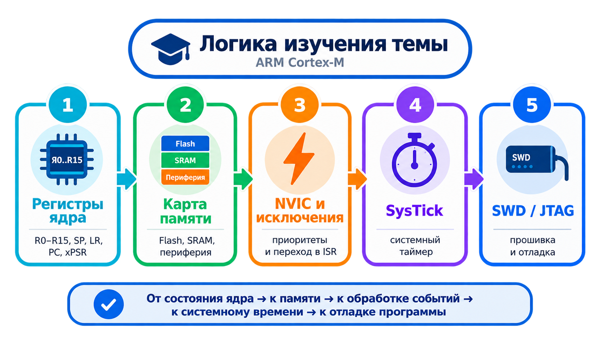

---

## 2. Что такое программная модель процессорного ядра

**Программная модель** — это совокупность аппаратных ресурсов и правил их использования, которые видит программное обеспечение. Она определяет:

- какие регистры доступны программе;
- какие состояния и режимы выполнения существуют;
- каким образом организовано адресное пространство;
- как программа обращается к памяти и периферии;
- как ядро реагирует на исключения и аппаратные прерывания;
- как формируется системное время;
- каким образом отладчик получает доступ к состоянию процессора.

Для разработчика программная модель является связующим уровнем между исходным кодом и физической реализацией микроконтроллера. Высокоуровневый код на C в конечном счёте преобразуется в операции над регистрами, памятью и периферийными адресами.

**ISR (Interrupt Service Routine)** — обработчик прерывания, то есть программная процедура, выполняемая ядром в ответ на соответствующее исключение или IRQ.

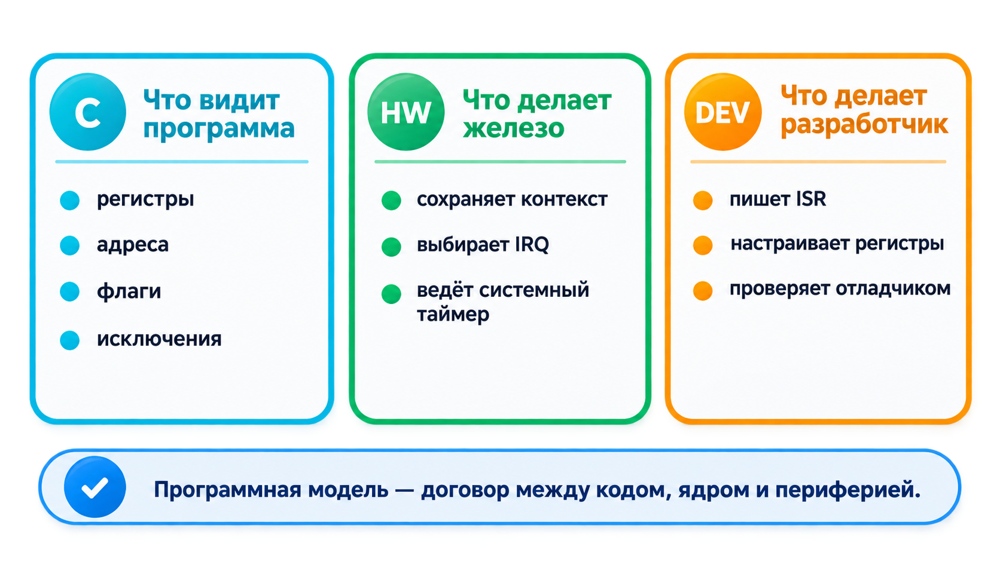

### 2.1. Ядро Cortex-M и микроконтроллер — не одно и то же

Важно различать два уровня:

1. **ARM Cortex-M** задаёт архитектуру процессорного ядра: регистры, механизм исключений, NVIC, SysTick, системные области памяти и базовую отладочную инфраструктуру.
2. **Конкретный микроконтроллер** реализует это ядро и дополняет его Flash, SRAM, GPIO, таймерами, АЦП, UART, SPI, I²C, DMA и другими периферийными блоками.

Именно поэтому разработчик обычно использует документацию двух типов:

- документацию Arm на конкретное ядро Cortex-M;
- Reference Manual и Datasheet производителя микроконтроллера.

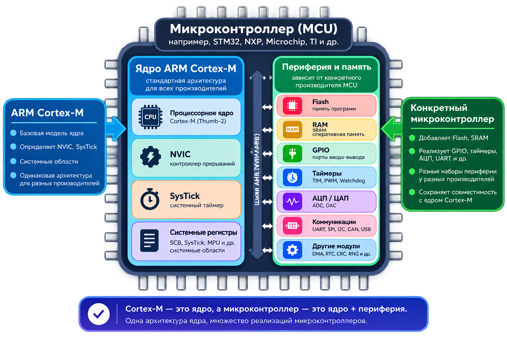

> **Инженерный принцип:** архитектура ядра стандартизирует фундаментальные механизмы, но объём памяти, состав периферии, адреса периферийных регистров и часть дополнительных возможностей определяются конкретной реализацией MCU.

---

## 3. Регистровая модель Cortex-M

Cortex-M относится к 32-битным архитектурам. Основные регистры ядра имеют ширину 32 бита и являются наиболее быстрыми аппаратными ресурсами для хранения операндов, адресов и служебной информации.

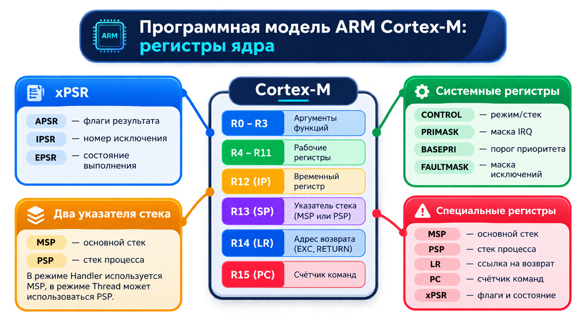

### 3.1. Регистры общего назначения R0–R12

Регистры **R0–R12** предназначены для хранения данных и адресов. На уровне языка C их распределением обычно занимается компилятор, однако знание их назначения необходимо при:

- отладке низкоуровневого кода;
- чтении дизассемблера;
- анализе вызовов функций;
- исследовании обработчиков прерываний;
- диагностике аварийных исключений.

Основные роли регистров:

- **R0–R3** — часто используются для передачи первых аргументов функции и возврата результата;
- **R4–R11** — рабочие регистры, значения которых вызываемая функция обычно должна сохранить, если она их изменяет;
- **R12 (IP, Intra-Procedure-call scratch register)** — временный регистр, который компилятор может использовать при вызовах и промежуточных вычислениях.

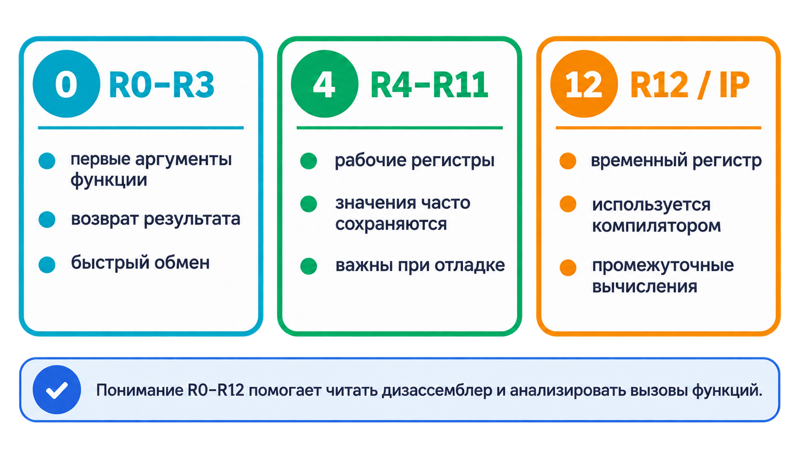

> Конкретные правила передачи аргументов и сохранения регистров задаются соглашением вызовов ABI. Для учебного понимания важно помнить, что часть параметров функции передаётся непосредственно через регистры, а не через память.

### 3.2. R13 — Stack Pointer

**R13 (SP, Stack Pointer)** указывает на вершину текущего стека. Стек располагается в SRAM и используется для:

- локальных переменных;
- временных данных;
- сохранения адресов возврата;
- сохранения контекста функции;
- сохранения контекста исключения.

В Cortex-M предусмотрено два физических указателя стека:

- **MSP (Main Stack Pointer)** — основной стек. Используется после сброса и всегда применяется в Handler mode;
- **PSP (Process Stack Pointer)** — альтернативный стек, который может использоваться в Thread mode, например для задач RTOS.

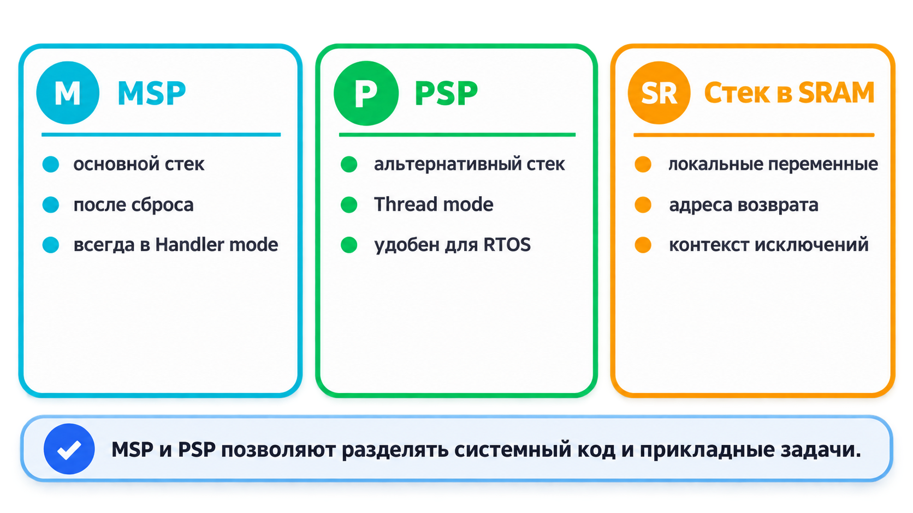

В простом bare-metal приложении обычно используется только MSP. В системе с RTOS PSP позволяет разделить стеки пользовательских задач и стек системных обработчиков.

### 3.3. R14 — Link Register

**R14 (LR, Link Register)** хранит информацию, необходимую для возврата из подпрограммы.

При выполнении команды ветвления с сохранением связи (`BL`) ядро сохраняет в LR адрес, связанный с точкой возврата. После завершения подпрограммы управление возвращается к вызывающему коду через значение LR.

Во время обработки исключения LR получает особое служебное значение **EXC_RETURN**. Оно кодирует информацию, необходимую ядру для аппаратного возврата из исключения: какой стек использовать и в какой режим выполнения вернуться.

### 3.4. R15 — Program Counter

**R15 (PC, Program Counter)** определяет текущий поток команд. Любое изменение PC изменяет ход выполнения программы.

К загрузке нового значения в PC фактически приводят:

- переходы;
- вызовы функций;
- возвраты;
- вход в обработчик исключения;
- переход по адресу из таблицы векторов.

При аппаратном прерывании адрес соответствующего ISR извлекается из таблицы векторов и загружается в PC.

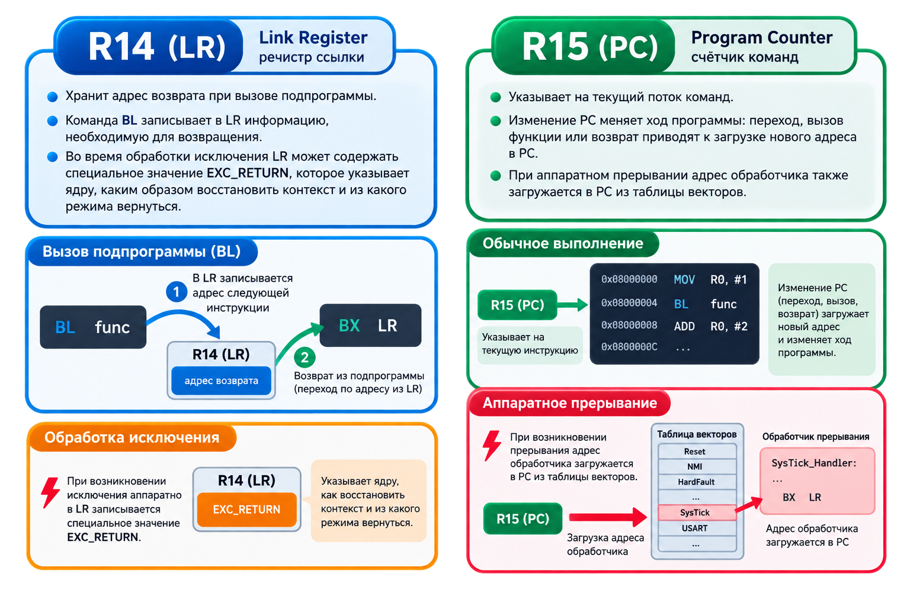

### 3.5. xPSR и специальные регистры

Регистр состояния **xPSR** логически объединяет несколько компонентов:

- **APSR (Application Program Status Register)** — флаги результатов арифметических и логических операций;
- **IPSR (Interrupt Program Status Register)** — номер текущего исключения;
- **EPSR (Execution Program Status Register)** — служебное состояние выполнения команд.

Наиболее известные флаги APSR:

| Флаг | Назначение |
|---|---|
| N | отрицательный результат (Negative) |
| Z | нулевой результат (Zero) |
| C | перенос (Carry) |
| V | арифметическое переполнение (Overflow) |

К специальным регистрам относятся также:

- **CONTROL** — выбор стека в Thread mode и управление уровнем привилегий;
- **PRIMASK** — маскирование обычных прерываний;
- **BASEPRI** — порог приоритета, ниже которого IRQ временно не обслуживаются;
- **FAULTMASK** — дополнительный механизм маскирования исключений в ядрах, где он реализован.

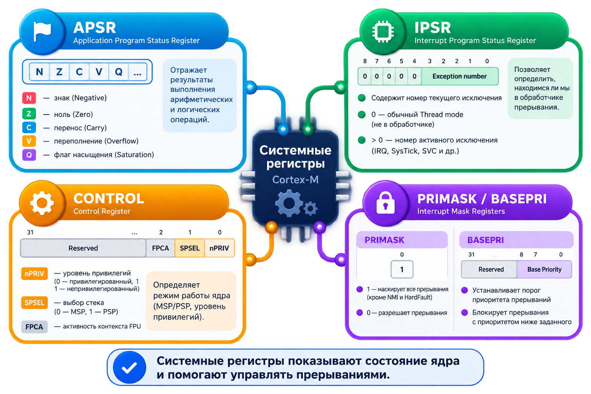

> **Ограничение реализации:** состав специальных регистров и отдельных возможностей отличается между семействами Cortex-M. Например, более компактные ядра Cortex-M0/M0+ не реализуют часть механизмов, присутствующих в более функциональных ядрах. Следует сверяться с документацией конкретного ядра и MCU.

---

## 4. Режимы выполнения Cortex-M

Cortex-M использует два базовых режима выполнения.

| Режим | Назначение | Стек | Пример |
|---|---|---|---|
| **Thread mode** | основной код приложения | MSP или PSP | `main()`, задачи RTOS |
| **Handler mode** | обработчики исключений | MSP | `SysTick_Handler`, `USART_IRQHandler` |

После сброса ядро начинает работу в **Thread mode** с использованием MSP. Когда возникает исключение, аппаратная логика переводит процессор в **Handler mode**.

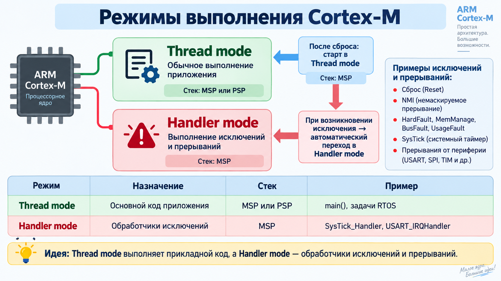

Ключевое отличие от обычного вызова функции заключается в том, что переход в ISR инициируется аппаратным механизмом исключений. Программа не выполняет явный вызов обработчика: ядро само сохраняет необходимую часть состояния и изменяет поток команд.

---

## 5. Автоматический кадр исключения

При входе в исключение Cortex-M аппаратно сохраняет в текущем стеке минимальный контекст:

- R0–R3;
- R12;
- LR;
- PC;
- xPSR.

Этот набор называют **аппаратным кадром исключения**. Его назначение — обеспечить быстрый вход в ISR и последующее восстановление прерванного потока команд.

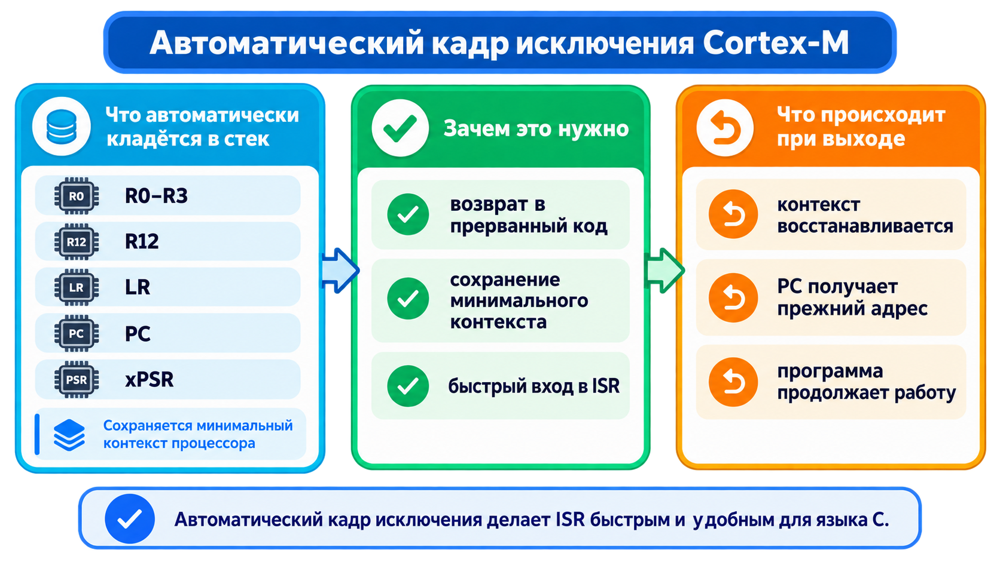

Дополнительные регистры при необходимости сохраняются кодом, сформированным компилятором. После завершения обработчика ядро восстанавливает аппаратно сохранённый контекст и продолжает выполнение программы с прежнего состояния.

> **Практическое следствие:** аппаратное сохранение части контекста позволяет писать большинство обработчиков прерываний как обычные C-функции, не выполняя вручную сохранение R0–R3, R12, LR, PC и xPSR.

---

## 6. Адресное пространство Cortex-M

Cortex-M использует единое **32-битное адресное пространство**. Возможный диапазон адресов составляет:

```text
0x00000000 ... 0xFFFFFFFF
```

Это соответствует 4 Гбайт **логического адресного пространства**, но не означает наличие 4 Гбайт физической памяти внутри микроконтроллера.

Типовая организация включает области для:

- кода и постоянной памяти;
- SRAM;
- периферии;
- внешней памяти;
- внешних устройств;
- системных компонентов ядра.

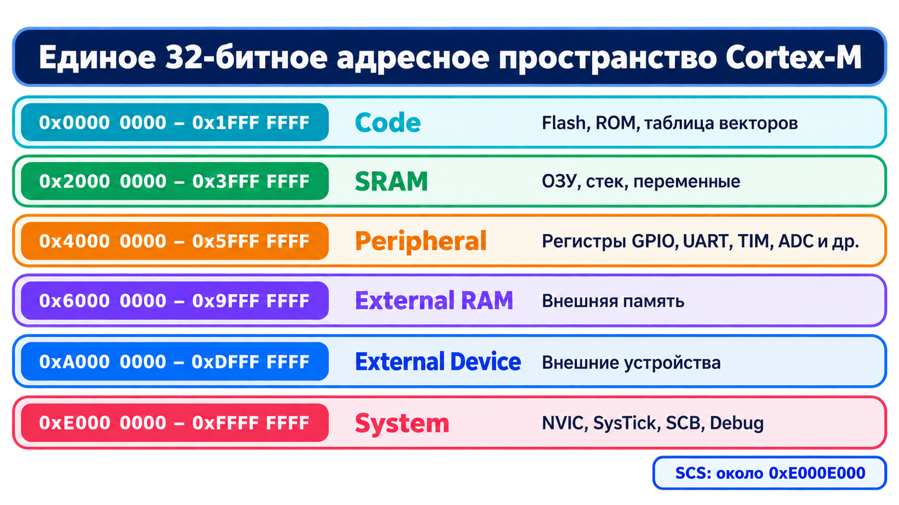

> Реальные размеры Flash и SRAM, а также конкретные периферийные адреса определяются производителем микроконтроллера.

---

## 7. Memory-mapped I/O

Один из фундаментальных принципов Cortex-M — **регистры периферии отображаются в адресное пространство памяти**. Это означает, что CPU обращается к регистру GPIO, таймера или UART через обычные операции чтения и записи по адресу.

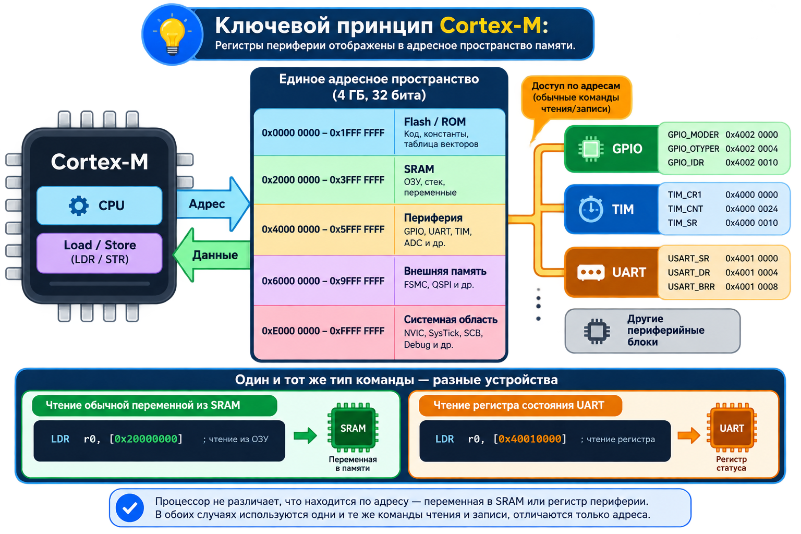

Для процессора чтение обычной переменной из SRAM и чтение регистра UART выполняются командами одного класса. Различается прежде всего **адрес**, по которому выполняется операция.

Упрощённый пример низкоуровневого доступа:

```c
volatile uint32_t *reg = (uint32_t *)0x40000000U;

uint32_t value = *reg;        // чтение регистра периферии
*reg = value | (1U << 3);     // изменение выбранного бита
```

Ключевое слово `volatile` сообщает компилятору, что значение объекта может изменяться независимо от нормального потока программы, например аппаратной периферией. Поэтому компилятор не должен удалять или некорректно кэшировать такие обращения.

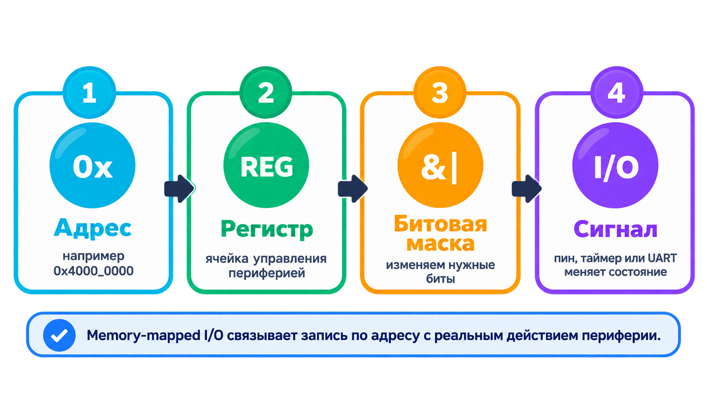

На практике вместо «магических» адресов следует использовать определения, предоставленные CMSIS, HAL/LL или заголовочными файлами конкретного MCU.

---

## 8. System Control Space

В верхней части адресного пространства Cortex-M расположена системная область. Существенная её часть — **System Control Space (SCS)**, типичный базовый адрес которой:

```text
0xE000E000
```

В этой области размещаются системные регистры и блоки ядра, включая:

- NVIC;
- SysTick;
- System Control Block (SCB);
- отладочные компоненты.

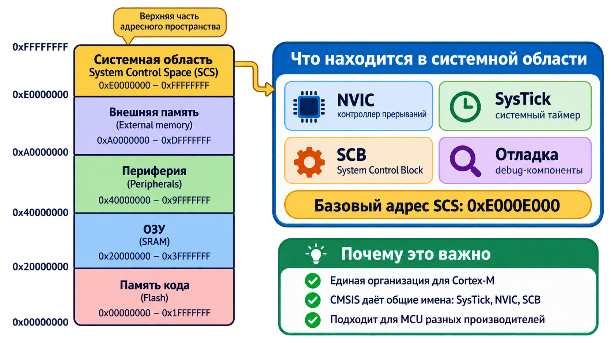

Стандартизация системной области позволяет CMSIS предоставлять единые программные имена и интерфейсы для доступа к объектам `NVIC`, `SysTick` и `SCB` в микроконтроллерах разных производителей, если они используют совместимое ядро Cortex-M.

---

## 9. Таблица векторов исключений

**Таблица векторов** — массив 32-битных слов, связывающий исключения и IRQ с адресами соответствующих обработчиков.

Типовая последовательность начала таблицы:

```text
Вектор 0  : initial MSP
Вектор 1  : Reset_Handler
Вектор 2  : NMI_Handler
Вектор 3  : HardFault_Handler
...
Вектор 15 : SysTick_Handler
Вектор 16+: внешние IRQ периферии
```

После сброса первое слово таблицы используется для задания начального значения MSP, а второе — как адрес `Reset_Handler`.

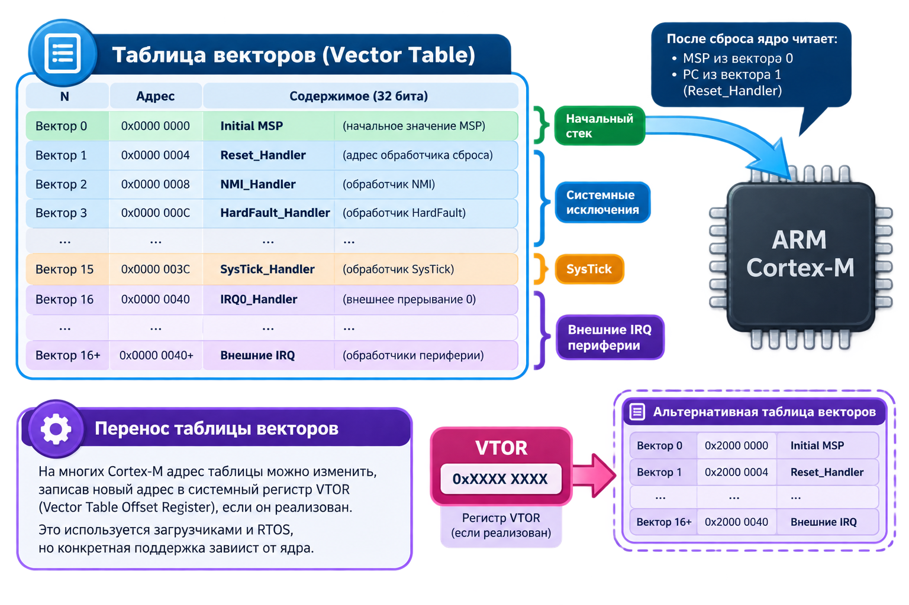

На многих реализациях Cortex-M таблицу векторов можно переместить посредством соответствующего системного регистра, например **VTOR**, если этот механизм присутствует в конкретном ядре. Перенос таблицы применяется, в частности, загрузчиками и операционными системами реального времени.

---

## 10. NVIC — Nested Vectored Interrupt Controller

**NVIC** — встроенный контроллер прерываний Cortex-M. Он участвует в выборе исключения, которое должно быть обслужено ядром.

Основные функции NVIC:

- разрешение и запрещение внешних IRQ;
- хранение ожидающих запросов;
- отслеживание активных обработчиков;
- назначение и сравнение приоритетов;
- поддержка вложенных прерываний;
- векторный переход к обработчику.

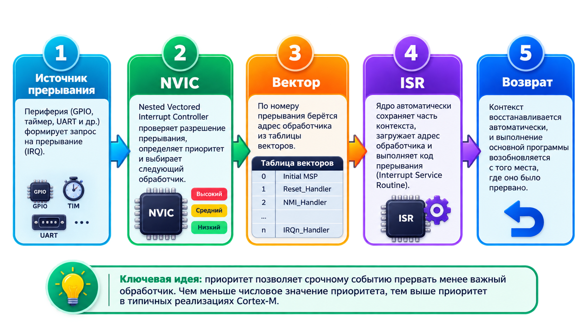

### 10.1. Состояния IRQ

Для понимания работы NVIC полезно различать четыре состояния:

- **Disabled** — запрос не разрешён в NVIC;
- **Enabled** — IRQ разрешён к обслуживанию;
- **Pending** — событие произошло и ожидает обслуживания;
- **Active** — обработчик данного исключения выполняется в текущий момент.

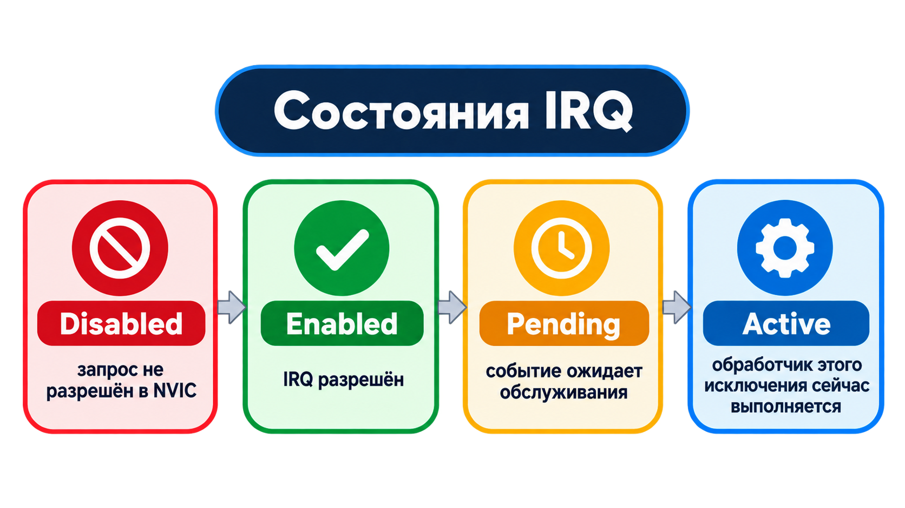

Следует учитывать, что состояние периферийного флага и состояние IRQ внутри NVIC — не одно и то же. Периферийный блок может продолжать удерживать свой флаг, поэтому ISR должен корректно обслужить источник события в соответствии с документацией конкретного устройства.

### 10.2. Приоритеты и вложенность

NVIC поддерживает приоритетную обработку событий. В типичной модели Cortex-M **меньшее числовое значение соответствует более высокому приоритету**. Например, приоритет `0` выше приоритета `5`.

Количество реально реализованных битов поля приоритета зависит от конкретной реализации микроконтроллера. Следовательно, нельзя без проверки переносить число доступных уровней приоритета с одного MCU на другой.

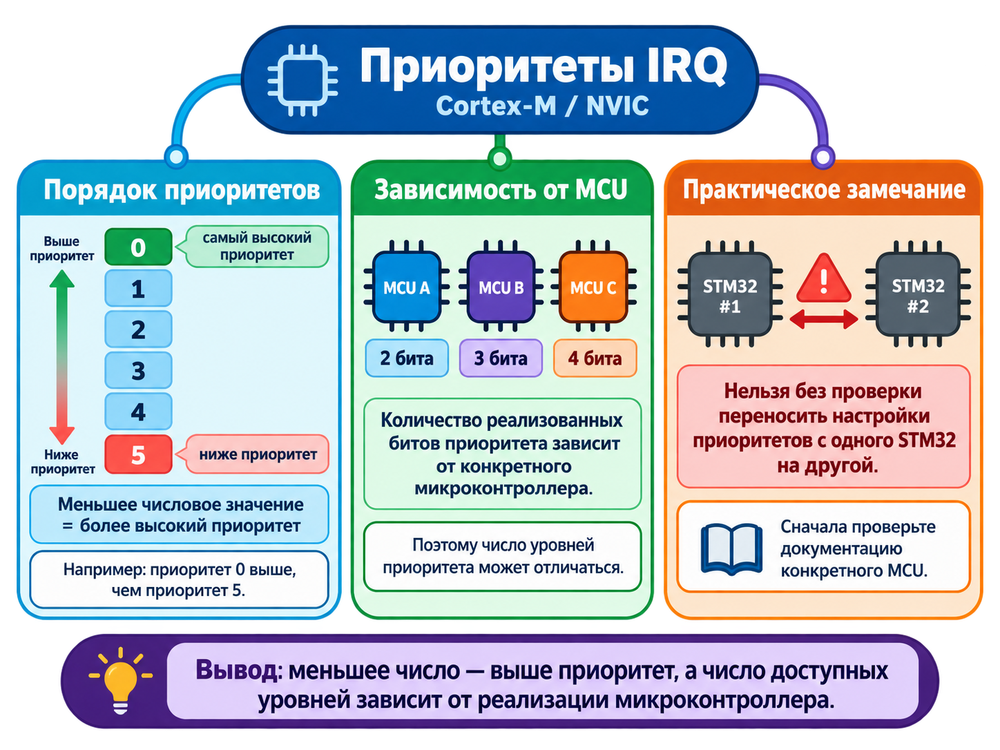

Вложенность означает, что обработчик более высокого приоритета может прервать обработчик более низкого приоритета, если архитектурные и конфигурационные условия это допускают.

### 10.3. Настройка IRQ через CMSIS

Упрощённый пример:

```c
NVIC_SetPriority(USART1_IRQn, 2);
NVIC_EnableIRQ(USART1_IRQn);

void USART1_IRQHandler(void)
{
    // 1. Проверить источник события.
    // 2. Обработать минимально необходимые данные.
    // 3. Сбросить/обслужить флаг периферии.
}
```

Названия IRQ и правила очистки флагов определяются конкретным MCU и его периферией.

### 10.4. Почему ISR должна быть короткой

Пока выполняется ISR, основной поток программы приостановлен, а часть других событий может ожидать своей очереди. Поэтому чрезмерно длинный обработчик увеличивает латентность системы.

В ISR рекомендуется:

1. определить источник события;
2. обслужить аппаратный флаг;
3. сохранить минимально необходимые данные;
4. установить программный флаг или поместить данные в буфер/очередь;
5. как можно быстрее завершить обработчик.

Продолжительные вычисления, ожидание обмена и большой объём вывода целесообразно переносить в основной цикл или задачу RTOS.

---

## 11. SysTick — системный таймер ядра

**SysTick** — встроенный в Cortex-M 24-битный декрементирующий таймер. Его основная задача — формирование регулярного временного события.

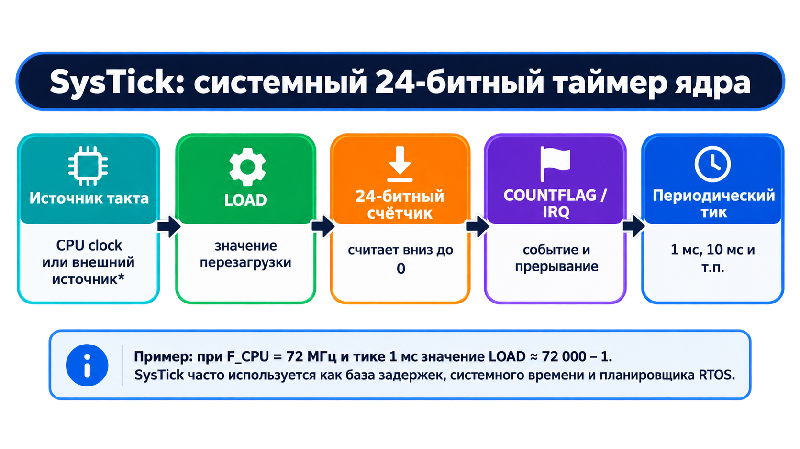

Типичные применения:

- миллисекундный системный счётчик;
- неблокирующие задержки;
- таймауты;
- периодическая проверка состояния;
- временная база антидребезга;
- системный тик планировщика RTOS.

### 11.1. Основные регистры SysTick

| Регистр | Назначение |
|---|---|
| **CTRL** | управление счётчиком, разрешение прерывания, выбор источника тактирования |
| **LOAD** | значение перезагрузки |
| **VAL** | текущее значение счётчика |
| **CALIB** | калибровочная информация, если она предусмотрена реализацией |

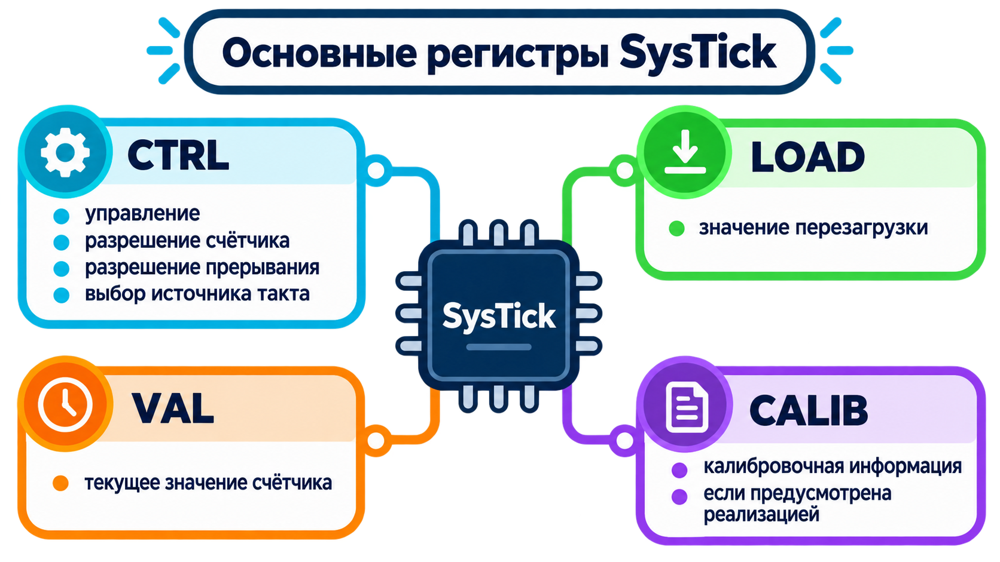

### 11.2. Расчёт периода

Если SysTick тактируется частотой `F` и должен генерировать событие через `T` секунд, число тактов равно:

\[
N = F \cdot T
\]

В регистр `LOAD` обычно записывается:

\[
LOAD = F \cdot T - 1
\]

**Пример:** при `F = 72 МГц` и `T = 1 мс`:

```text
N = 72 000 000 × 0,001 = 72 000
LOAD = 72 000 - 1 = 71 999
```

Полученное значение укладывается в 24-разрядный счётчик.

Пример на CMSIS:

```c
volatile uint32_t ms = 0;

void SysTick_Handler(void)
{
    ms++;
}

int main(void)
{
    SystemCoreClockUpdate();
    SysTick_Config(SystemCoreClock / 1000U); // период 1 мс

    while (1)
    {
        // неблокирующая логика по значению ms
    }
}
```

Функция `SysTick_Config()` обычно конфигурирует значение перезагрузки, очищает текущее значение и включает SysTick с прерыванием. Конкретная доступность зависит от используемого CMSIS-пакета и среды разработки.

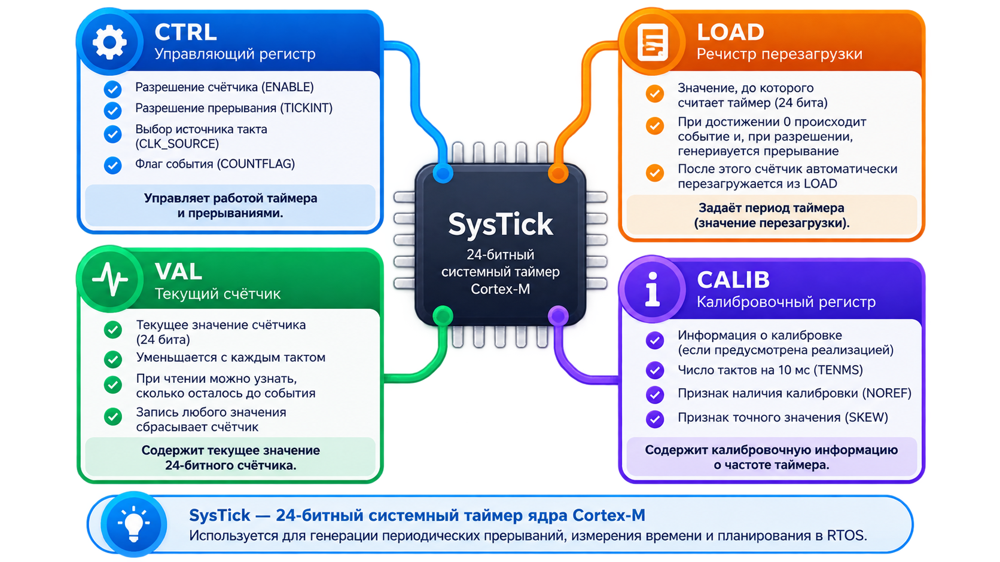

> Для задач PWM, input capture и других специализированных функций синхронизации применяются периферийные таймеры конкретного микроконтроллера. SysTick прежде всего предназначен для системной временной базы.

---

## 12. Аппаратная отладка: SWD и JTAG

Аппаратный отладочный интерфейс даёт доступ к внутреннему состоянию ядра и позволяет:

- программировать Flash;
- останавливать CPU;
- выполнять код пошагово;
- устанавливать точки останова;
- читать и изменять регистры;
- просматривать память и периферийные регистры.

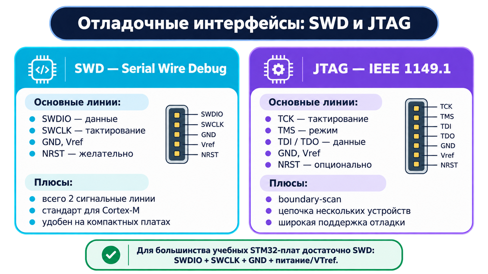

### 12.1. SWD

**SWD (Serial Wire Debug)** — компактный отладочный интерфейс Arm. Основные сигнальные линии:

- `SWDIO` — двунаправленные данные;
- `SWCLK` — тактовый сигнал.

На практике также необходимы:

- общий `GND`;
- `VTref` или корректное опорное питание;
- часто `NRST` для надёжного управления сбросом.

SWD особенно удобен для микроконтроллерных плат, так как требует небольшого числа выводов.

### 12.2. JTAG

JTAG использует больше линий:

- `TCK`;
- `TMS`;
- `TDI`;
- `TDO`;
- иногда `TRST`;
- общий GND и опорное напряжение.

Помимо отладки, JTAG применяется для boundary-scan и последовательного соединения нескольких устройств в цепочку.

| Критерий | SWD | JTAG |
|---|---|---|
| Основные сигнальные линии | 2 | 4–5 |
| Занимаемые выводы MCU | меньше | больше |
| Отладка Cortex-M | да | да |
| Boundary-scan | обычно нет | да |
| Типичный учебный STM32-проект | часто | реже |

---

## 13. Сквозной пример: кнопка GPIO → NVIC → ISR → возврат

Рассмотрим кнопку, подключённую к GPIO и формирующую внешнее прерывание. Этот сценарий связывает практически все элементы программной модели Cortex-M.

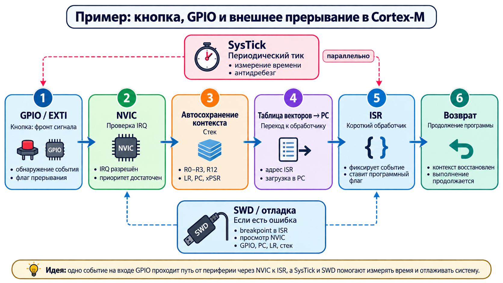

Последовательность работы:

1. **GPIO/EXTI** обнаруживает фронт сигнала и устанавливает аппаратный флаг события.
2. Запрос поступает в **NVIC**. Если IRQ разрешён и имеет достаточный приоритет, он выбирается для обслуживания.
3. Ядро автоматически сохраняет минимальный контекст в текущем стеке.
4. Адрес ISR извлекается из **таблицы векторов** и загружается в **PC**.
5. ISR выполняет короткий код: фиксирует событие, обслуживает аппаратный флаг и, например, устанавливает программный признак для основного кода.
6. При выходе из обработчика ядро восстанавливает сохранённый контекст и продолжает прерванную программу.
7. **SysTick** может параллельно формировать системный тик, используемый для измерения времени или программного антидребезга кнопки.
8. При диагностике ошибки разработчик подключается через **SWD**, устанавливает breakpoint в ISR и анализирует NVIC, GPIO, PC, LR и содержимое стека.

Этот пример показывает, что программная модель — не набор независимых терминов, а единая система аппаратно-программного взаимодействия.

---

## 14. Типичные ошибки и инженерные правила

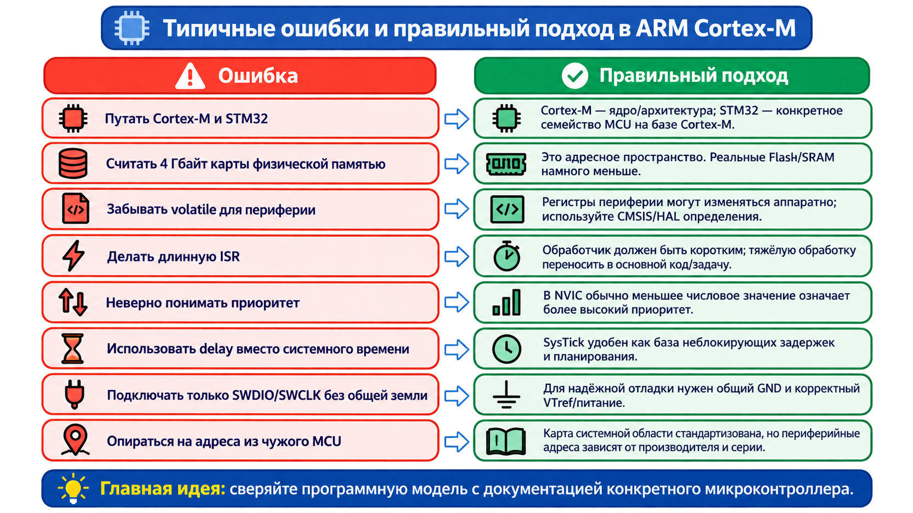

| Ошибка | Правильный подход |
|---|---|
| Путать Cortex-M и STM32 | Cortex-M — ядро/архитектура; STM32 — конкретное семейство MCU на базе Cortex-M |
| Считать 4 Гбайт карты физической памятью | Это адресное пространство; физические Flash/SRAM существенно меньше |
| Забывать `volatile` при прямом доступе к периферии | Периферийные регистры могут изменяться аппаратно; используйте корректные CMSIS/HAL определения |
| Делать длинную ISR | В обработчике выполнять только необходимый минимум; тяжёлую обработку переносить в main/RTOS |
| Неверно трактовать приоритет | В типичной конфигурации NVIC меньшее число означает более высокий приоритет |
| Использовать блокирующий `delay` вместо системного времени | SysTick позволяет строить неблокирующие временные алгоритмы |
| Подключать только SWDIO/SWCLK без общей земли | Требуется общий GND и корректный VTref/питание; NRST часто полезен |
| Использовать периферийные адреса от другого MCU | Системная область стандартизована, но периферийные адреса зависят от производителя и серии |

---

## 15. Итоги лекции

1. **Программная модель Cortex-M** описывает регистры, режимы выполнения, адресное пространство, исключения, системный таймер и аппаратную отладку.
2. **R0–R12** — рабочие регистры; **R13** — SP; **R14** — LR; **R15** — PC; **xPSR** отражает состояние исполнения.
3. **MSP и PSP** позволяют разделять системный и прикладной стеки; обработчики исключений выполняются в Handler mode с MSP.
4. Cortex-M имеет единое **32-битное адресное пространство**, а периферия управляется по принципу **memory-mapped I/O**.
5. **Таблица векторов** связывает исключения и IRQ с адресами обработчиков.
6. **NVIC** обеспечивает разрешение, приоритизацию, вложенность и векторное обслуживание прерываний.
7. При входе в исключение ядро аппаратно сохраняет минимальный контекст, что уменьшает задержку и упрощает ISR.
8. **SysTick** — встроенный 24-битный системный таймер, удобный для временной базы и RTOS.
9. **SWD** — компактный основной интерфейс отладки Cortex-M; **JTAG** использует больше линий и поддерживает дополнительные аппаратные сценарии.

> **Главный вывод:** программирование Cortex-M основано на управлении регистрами и адресуемыми аппаратными ресурсами, тогда как критические механизмы — вход и возврат из исключений, приоритетная обработка событий, системный тик и аппаратная отладка — поддерживаются непосредственно архитектурой ядра.

---

## 16. Контрольные вопросы

1. Что понимается под программной моделью Cortex-M?
2. Почему необходимо различать ядро Cortex-M и конкретный микроконтроллер STM32?
3. Для чего используются R0–R3 и R4–R11?
4. Чем MSP отличается от PSP?
5. Каково назначение LR и что такое EXC_RETURN?
6. Как изменение PC влияет на ход программы?
7. Какие составляющие объединяет xPSR?
8. Чем Thread mode отличается от Handler mode?
9. Какие регистры аппаратно сохраняются в кадр исключения?
10. Почему 4 Гбайт адресного пространства не означают наличие 4 Гбайт физической памяти?
11. Что означает принцип memory-mapped I/O?
12. Что находится в System Control Space?
13. Как устроены первые элементы таблицы векторов?
14. Какую функцию выполняет NVIC?
15. Чем различаются состояния Enabled, Pending и Active?
16. Как интерпретируется числовое значение приоритета NVIC?
17. Почему обработчик прерывания рекомендуется делать коротким?
18. Каково назначение регистров CTRL, LOAD, VAL и CALIB SysTick?
19. Как рассчитать LOAD для заданной частоты и периода?
20. Какие линии необходимы для надёжного подключения SWD?
21. В каких сценариях JTAG может быть предпочтительнее SWD?

---

## 17. Задания для закрепления

### Задание 1. Анализ карты памяти

Определите тип области для адресов:

```text
0x20000100
0x40011000
0xE000E010
```

Объясните, почему последний адрес связан с системной частью программной модели Cortex-M.

### Задание 2. Расчёт SysTick

Рассчитайте `LOAD`:

1. для тика 1 мс при `F_CPU = 48 МГц`;
2. для тика 10 мс при `F_CPU = 48 МГц`.

Проверьте, укладываются ли значения в 24 бита.

### Задание 3. Приоритеты NVIC

В системе имеются:

- прерывание UART;
- аварийный вход.

Определите, какому событию следует назначить более высокий приоритет. Объясните, что произойдёт, если аварийное событие возникнет во время обработки UART.

### Задание 4. Аппаратная отладка

На плате доступны:

```text
SWDIO
SWCLK
GND
3V3
NRST
```

Составьте минимальную схему подключения ST-LINK и объясните назначение каждой линии.

### Задание 5. Анализ ISR

Дан обработчик, который выполняет длительный расчёт, выводит строку через UART и ждёт завершения передачи. Объясните, почему такая архитектура опасна. Предложите переработанную структуру, при которой ISR только фиксирует событие и передаёт обработку в основной код.

---

## 18. Краткая шпаргалка

| Объект | Назначение | Что помнить |
|---|---|---|
| R0–R12 | данные и адреса | основные рабочие ресурсы ядра |
| SP (R13) | стек | MSP / PSP |
| LR (R14) | возврат | при исключении может содержать EXC_RETURN |
| PC (R15) | поток команд | определяет адрес выполнения |
| xPSR | состояние | флаги + номер исключения + состояние исполнения |
| NVIC | прерывания | enable, pending, active, priority |
| Vector Table | адреса обработчиков | vector 0 = initial MSP, vector 1 = Reset_Handler |
| SysTick | системный тик | 24-битный down-counter |
| SCS | системная область | NVIC, SysTick, SCB, debug-компоненты |
| SWD | отладка | SWDIO + SWCLK + GND + VTref/питание |
| JTAG | отладка/тест | TCK, TMS, TDI, TDO |

---

## 19. Рекомендуемые источники для дальнейшего изучения

- Рабочая программа МДК.02.02 «Программирование микроконтроллеров» для 4 курса КСК.
- Arm Cortex-M Generic User Guide / Technical Reference Manual для конкретного ядра.
- CMSIS-Core documentation.
- Reference Manual и Datasheet конкретного микроконтроллера, используемого в лабораторных и практических работах.

---

**Конец лекции 5.2**
