# Лекция 5.3. Системы тактирования, сброса и энергопотребления

## Внутренние и внешние генераторы, PLL и режимы сна

**Дисциплина:** МДК 02.02 «Программирование микроконтроллеров»  
**Уровень:** 4 курс колледжа  
**Тип занятия:** проблемная лекция  
**Продолжительность:** 2 академических часа

На вводной иллюстрации объединены три подсистемы, которые рассматриваются в лекции: формирование тактового сигнала, аппаратный сброс и переход микроконтроллера в режим сна.

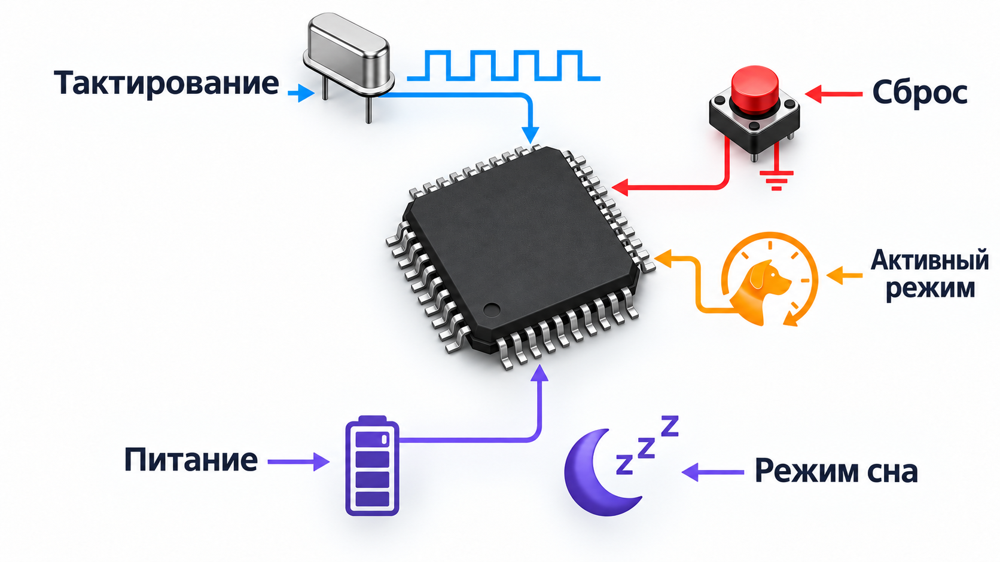

*Рисунок 1 — Тактирование, сброс и энергопотребление микроконтроллера*

# Назначение лекции

Тактирование определяет скорость выполнения команд и работу периферии,
система сброса гарантирует известное начальное состояние, а управление
питанием определяет время автономной работы и тепловой режим устройства.
Эти три подсистемы проектируются совместно: повышение частоты ускоряет
вычисления, но увеличивает динамическое потребление; глубокий сон
уменьшает ток, но ограничивает доступные источники пробуждения; выбор
внешнего кварца улучшает точность, но усложняет схему и увеличивает
время запуска.

Их взаимосвязь удобно представить как единый инженерный компромисс между производительностью, надёжностью и временем автономной работы.

*Рисунок 2 — Взаимосвязь основных подсистем микроконтроллера*

После изучения темы студент должен уметь читать упрощённое дерево
тактирования, различать внутренние и внешние генераторы, вычислять
частоты после PLL и делителей, объяснять причины аппаратного сброса,
выбирать режим сна и составлять безопасный алгоритм настройки
тактирования микроконтроллера.

# План лекции

> 1\. Назначение тактовых сигналов и основные параметры генераторов.
>
> 2\. Внутренние и внешние источники тактирования.
>
> 3\. Дерево тактирования, делители и отключение тактовых сигналов.
>
> 4\. Назначение и работа PLL.
>
> 5\. Источники сброса и последовательность запуска.
>
> 6\. Составляющие энергопотребления микроконтроллера.
>
> 7\. Режимы сна, источники пробуждения и сохранение состояния.
>
> 8\. Сравнение AVR, STM32 и ESP32 и практические алгоритмы настройки.

# 1 Тактовый сигнал и его роль

Микроконтроллер является синхронной цифровой системой. Большинство его
регистров изменяет состояние по фронту тактового сигнала. Такт не равен
машинной команде: одна команда может занимать один или несколько тактов,
а в конвейерном ядре разные стадии нескольких команд выполняются
одновременно.

На временной диаграмме фронты тактового сигнала задают моменты, в которые синхронные узлы могут изменять своё состояние. При этом одна команда процессора не обязана завершаться за один период.

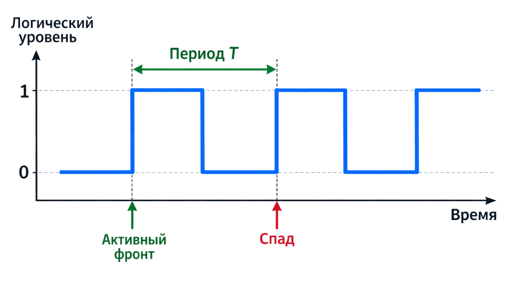

*Рисунок 3 — Тактовый сигнал задаёт временную основу работы цифровой системы*

Частота показывает количество периодов в секунду, а период —
длительность одного цикла. Эти величины связаны обратной зависимостью:

$$
T = \frac{1}{f}
$$

Например, при частоте 16 МГц период составляет 62,5 нс. Значение
системной частоты необходимо для расчёта задержек, скорости UART,
периода таймера, частоты ШИМ и скорости интерфейсов.

Обратная зависимость периода от частоты показана на следующей иллюстрации: чем выше частота, тем меньше длительность одного такта.

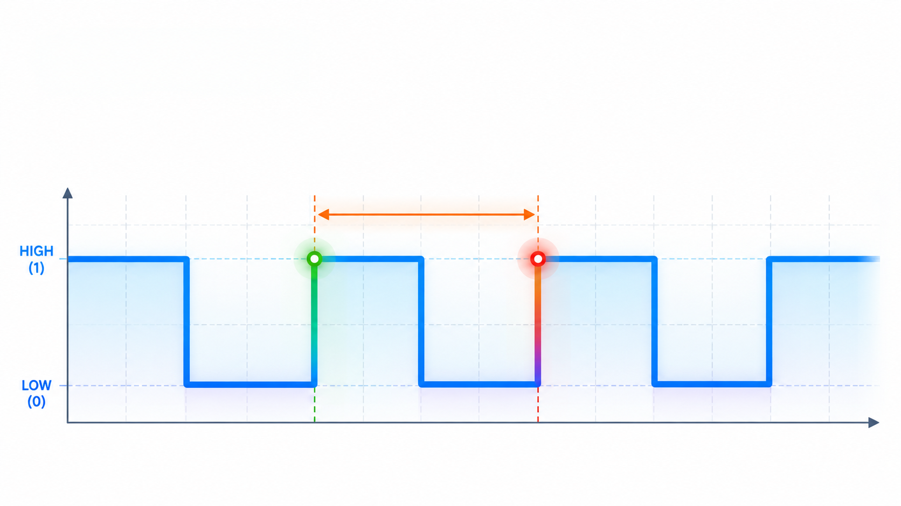

*Рисунок 4 — Связь периода и частоты тактового сигнала*

## 1.1 Параметры качества тактового сигнала

- Номинальная частота — частота, на которую рассчитана система.

- Начальная точность — отклонение реальной частоты от номинальной при
  заданных условиях.

- Температурный дрейф — изменение частоты при изменении температуры.

- Долговременный уход — медленное изменение параметров генератора во
  времени.

- Джиттер — кратковременное отклонение моментов фронтов сигнала от
  идеального положения.

- Время запуска — интервал от включения источника до получения
  устойчивого сигнала.

- Потребляемая мощность — энергия, необходимая самому генератору и
  тактируемым им блокам.

Точность часто задают в ppm. Один ppm соответствует одной миллионной
доле. Для генератора 16 МГц отклонение 100 ppm означает возможную ошибку
примерно 1,6 кГц. Для UART и USB допустимая ошибка ограничена
протоколом, поэтому внутренний RC-генератор подходит не всегда.

$$
\Delta f = \frac{f_0 \cdot \delta_{ppm}}{10^6}
$$

Качество генератора оценивают не по одному параметру. Важны точность, стабильность, джиттер, время запуска и потребляемая мощность.

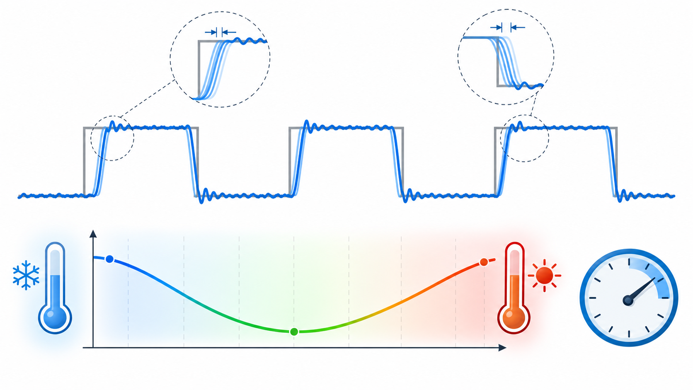

*Рисунок 5 — Основные параметры качества тактового сигнала*

# 2 Источники тактирования

Современный микроконтроллер обычно имеет несколько независимых
источников. После сброса выбирается безопасный внутренний генератор,
затем программа может включить более точный или более быстрый источник.
Низкочастотный домен RTC и watchdog нередко продолжает работать, когда
основное ядро остановлено.

Источники могут обслуживать разные домены: высокочастотное ядро, периферию, RTC и независимый watchdog. Мультиплексоры выбирают активный источник, а делители формируют необходимые частоты.

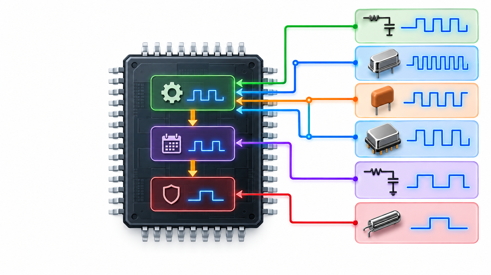

*Рисунок 6 — Основные внутренние и внешние источники тактирования*

## 2.1 Внутренний RC генератор

Внутренний RC-генератор интегрирован в кристалл и не требует внешних
компонентов. Его основные преимущества — низкая стоимость, быстрый
запуск и возможность выхода из сна без ожидания кварца. Недостатки —
меньшая абсолютная точность и заметная зависимость от температуры и
напряжения. Многие микроконтроллеры хранят заводскую калибровку
RC-генератора и позволяют программно корректировать частоту.

RC-генератор целесообразен для управляющей логики, таймеров с невысокими
требованиями к точности, быстрого запуска после сна и аварийного
резервирования внешнего генератора.

Внутренний RC-генератор расположен непосредственно на кристалле. Он быстро готов к работе, но его частота сильнее зависит от температуры и напряжения питания.

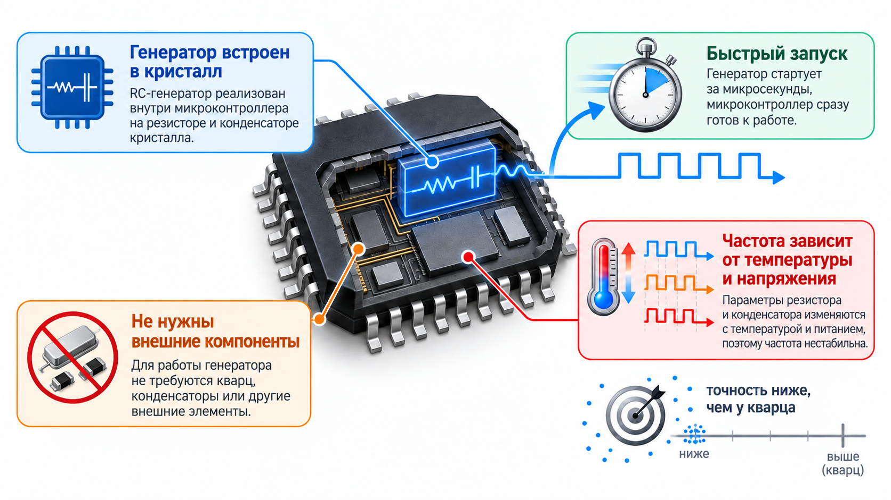

*Рисунок 7 — Особенности внутреннего RC-генератора*

## 2.2 Внешний кварцевый или керамический резонатор

Кварцевый резонатор включается между специальными выводами генератора.
Нагрузочные конденсаторы и паразитные ёмкости платы образуют
колебательную систему. Кварц обеспечивает лучшую точность и
стабильность, но запускается медленнее и требует аккуратной разводки:
коротких симметричных проводников, удаления быстрых цифровых сигналов от
узла генератора и корректного подбора ёмкостей.

Приближённо ёмкость нагрузки кварца определяется выражением, где C1 и C2
— внешние конденсаторы, а Cstray — паразитная ёмкость монтажа:

$$
C_L \approx \frac{C_1 C_2}{C_1 + C_2} + C_{stray}
$$

Для часов реального времени часто применяется кварц 32,768 кГц. Эта
частота удобна тем, что последовательное деление на 2 пятнадцать раз
даёт 1 Гц.

Кварц подключают короткими симметричными проводниками. Нагрузочные конденсаторы размещают рядом с выводами микроконтроллера, а узел генератора удаляют от быстрых цифровых линий.

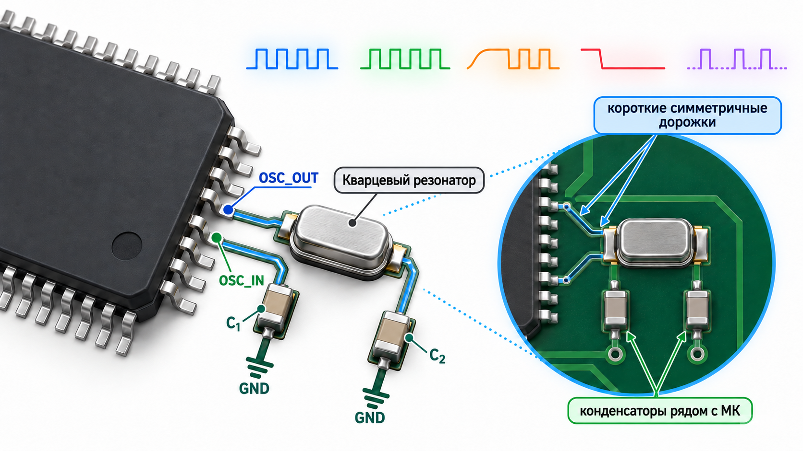

*Рисунок 8 — Подключение кварцевого резонатора и влияние монтажа*

## 2.3 Внешний готовый генератор

Вместо резонатора на вход микроконтроллера может подаваться готовый
прямоугольный сигнал от отдельного генератора. Такой вариант применяется
при общей синхронизации нескольких микросхем, при повышенных требованиях
к точности или когда генератор должен работать независимо от
микроконтроллера. В режиме bypass внутренний усилитель кварцевого
генератора обычно отключается.

## 2.4 Сравнение источников

| **Источник**           | **Преимущества**                                      | **Ограничения**                              | **Типичное применение**                          |
|------------------------|-------------------------------------------------------|----------------------------------------------|--------------------------------------------------|
| Внутренний RC          | Быстрый запуск, нет внешних деталей, низкая стоимость | Ограниченная точность, дрейф                 | Запуск, простая автоматика, резервный источник   |
| Внешний кварц          | Высокая стабильность и повторяемость                  | Время запуска, элементы и требования к плате | UART, точные таймеры, USB при подходящей частоте |
| Керамический резонатор | Проще и дешевле кварца                                | Точность ниже кварца                         | Бытовая автоматика                               |
| Готовый генератор      | Высокая точность, общий опорный сигнал                | Цена, постоянное потребление                 | Синхронизация нескольких узлов                   |
| RC низкой частоты      | Малое потребление, быстрый запуск                     | Низкая точность                              | Watchdog, грубые интервалы сна                   |
| Кварц 32,768 кГц       | Точные часы при малом потреблении                     | Долгий запуск, чувствительность разводки     | RTC, календарь, пробуждение по времени           |

Таким образом, источник выбирают по совокупности критериев: точности, времени запуска, стоимости, энергопотреблению и требованиям конкретного интерфейса.

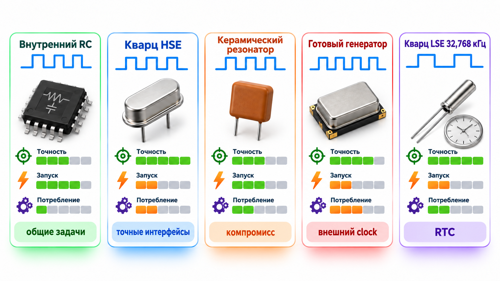

*Рисунок 9 — Сравнение источников тактирования по инженерным критериям*

# 3 Дерево тактирования

Дерево тактирования — совокупность мультиплексоров, PLL, делителей и
разрешающих элементов, распределяющих частоту между ядром и
периферийными блоками. В STM32 для этой подсистемы применяется RCC, в
AVR — регистры выбора источника и предделителя, в ESP32 — несколько
высоко- и низкочастотных доменов.

Обобщённое дерево начинается с набора источников, затем включает мультиплексор, PLL и предделители. На выходе формируются отдельные частоты ядра, шин, таймеров, интерфейсов, RTC и watchdog.

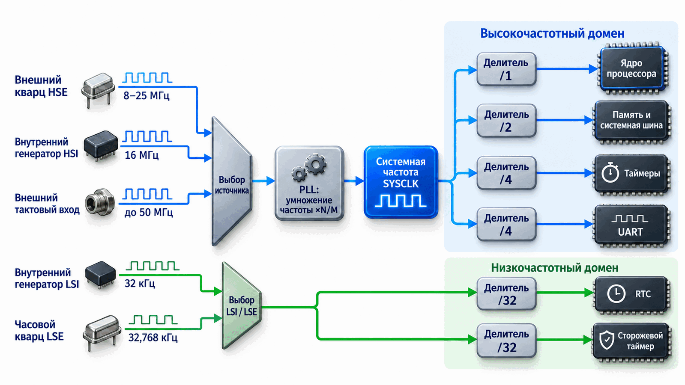

*Рисунок 10 — Обобщённое дерево тактирования микроконтроллера*

- SYSCLK — выбранный системный источник.

- HCLK или CPU clock — частота ядра и высокоскоростной шины.

- PCLK — частота периферийной шины.

- Kernel clock — отдельный тактовый сигнал конкретной периферии.

- Clock gating — отключение тактового сигнала у неиспользуемого модуля.

Предделитель уменьшает частоту в целое число раз. Если исходная частота
равна fIN, а коэффициент деления равен D, выходная частота определяется
формулой:

$$
f_{OUT} = \frac{f_{IN}}{D}
$$

Периферийный модуль нельзя настраивать до включения его тактирования.
После изменения системной частоты необходимо пересчитать параметры
SysTick, таймеров, UART и других блоков, зависящих от времени.

Один источник может одновременно формировать несколько частот: например, ядро работает без деления, периферийная шина — с делителем 2, а таймеры — по правилам конкретного семейства микроконтроллеров.

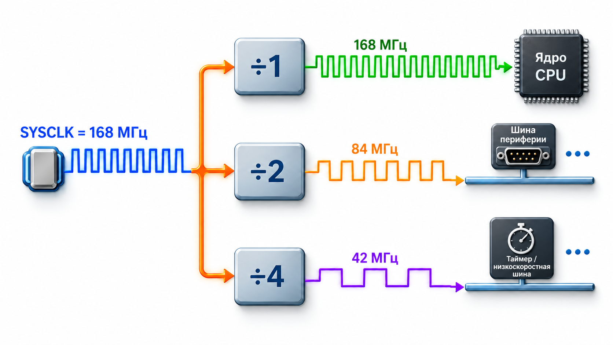

*Рисунок 11 — Формирование частот ядра и периферийных шин делителями*

# 4 Фазовая автоподстройка частоты PLL

PLL — замкнутая система фазовой автоподстройки. Она сравнивает опорный
сигнал с сигналом обратной связи и регулирует управляемый генератор. В
микроконтроллере PLL позволяет получить высокую системную частоту из
относительно низкой и точной опорной частоты.

PLL содержит фазовый детектор, фильтр контура, управляемый генератор и цепь обратной связи. После захвата частота и фаза обратного сигнала согласуются с опорным сигналом.

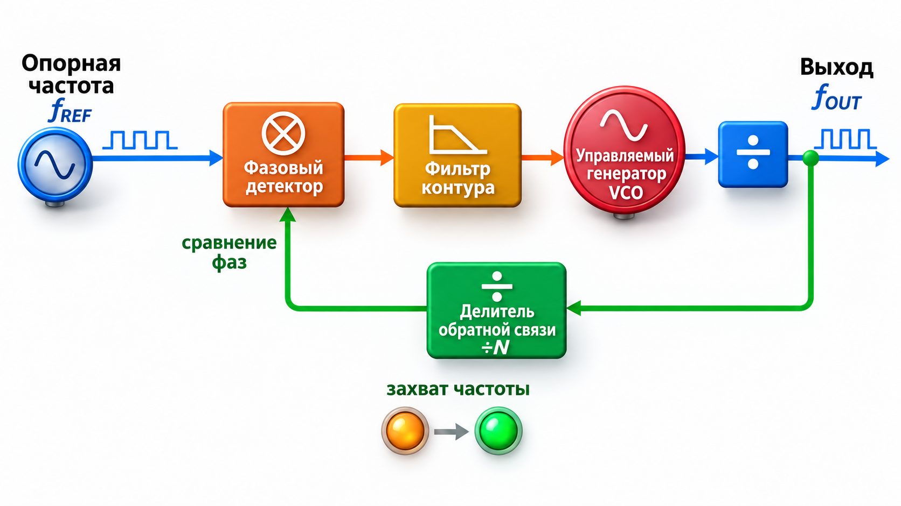

*Рисунок 12 — Упрощённая структурная схема PLL*

## 4.1 Расчёт частоты PLL

Конкретные обозначения коэффициентов зависят от семейства. Для
распространённой структуры STM32 опорная частота делится на M, затем
умножается на N, а выход VCO делится на P. Дополнительный выход Q может
использоваться периферией.

$$
f_{VCO\_IN} = \frac{f_{SOURCE}}{M}
$$

$$
f_{VCO} = f_{VCO\_IN} \cdot N
$$

$$
f_{SYS} = \frac{f_{VCO}}{P}
$$

Пример. При внешнем кварце 8 МГц выбраны M = 8, N = 336 и P = 2. Тогда
вход VCO равен 1 МГц, частота VCO — 336 МГц, а системная частота — 168
МГц. Такой набор допустим только тогда, когда все промежуточные и
итоговые частоты входят в диапазоны, указанные в справочном руководстве
конкретного микроконтроллера.

На схеме примера кварцевый генератор 8 МГц последовательно проходит делитель M, умножитель N и выходной делитель P. При расчёте проверяют не только итоговые 168 МГц, но и входную и рабочую частоты VCO.

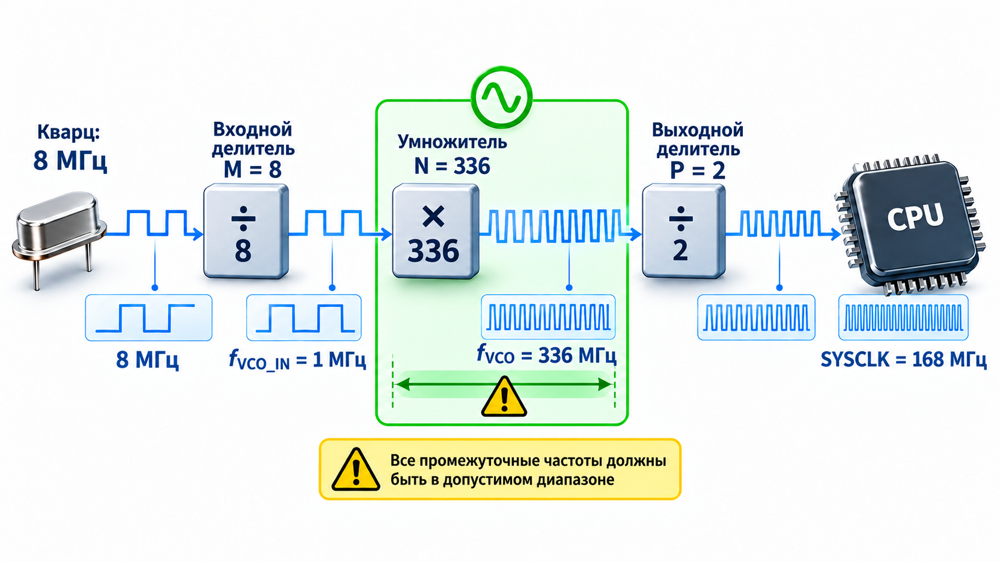

*Рисунок 13 — Пример формирования частоты 168 МГц с помощью PLL*

## 4.2 Состояние захвата и безопасное переключение

После включения PLL требуется время для установления режима. Программа
должна дождаться флага готовности PLLRDY или LOCK. До этого момента
нельзя выбирать PLL системным источником. Перед повышением частоты ядра
настраиваются питание, число циклов ожидания Flash и делители шин.
Безопасная последовательность настройки следующая:

> 1\. Запустить надёжный исходный генератор и дождаться его готовности.
>
> 2\. Настроить напряжение питания ядра и задержки доступа к Flash.
>
> 3\. Задать коэффициенты PLL при выключенной PLL.
>
> 4\. Включить PLL и дождаться флага захвата.
>
> 5\. Установить безопасные делители шин.
>
> 6\. Переключить системный мультиплексор на PLL.
>
> 7\. Проверить фактически выбранный источник и обновить программную
> переменную системной частоты.

Последовательность принципиальна: новый источник включают и проверяют до переключения системного мультиплексора. При неудаче программа должна сохранить безопасный резервный источник.

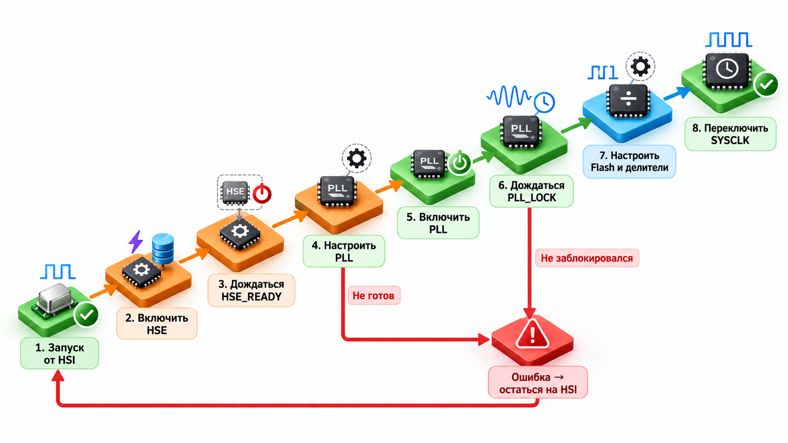

*Рисунок 14 — Последовательность безопасного переключения системной частоты на PLL*

Типичные ошибки: изменение коэффициентов работающей PLL, отсутствие
ожидания флага готовности, превышение допустимой частоты Flash или
периферийной шины, а также неверное предположение, что частота таймера
всегда равна PCLK.

# 5 Система сброса

Сброс переводит ядро и часть периферии в документированное начальное
состояние. Он отличается от выключения питания: некоторые резервные
домены, регистры причины сброса или память RTC могут сохраняться. После
сброса ядро получает начальное значение указателя стека и адрес
обработчика Reset либо начинает выполнение с фиксированного вектора.

Система сброса возвращает ядро и периферию из неизвестного или аварийного состояния в документированную исходную конфигурацию. Отдельные резервные домены при этом могут продолжать работу.

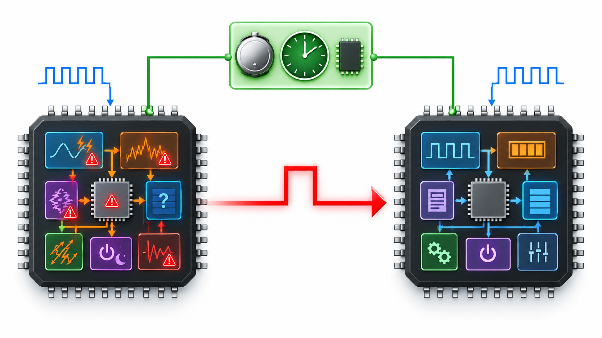

*Рисунок 15 — Переход микроконтроллера в известное состояние после сброса*

## 5.1 Основные источники сброса

| **Источник**         | **Назначение**                  | **Особенность**                                                        |
|----------------------|---------------------------------|------------------------------------------------------------------------|
| POR Power on reset   | Запуск после подачи питания     | Удерживает систему до достижения допустимого питания                   |
| BOR Brown out reset  | Защита при просадке напряжения  | Предотвращает выполнение кода при нестабильном VDD                     |
| Внешний RESET NRST   | Сброс кнопкой или супервизором  | Асинхронный вход, требует корректной схемы и защиты от помех           |
| Watchdog reset       | Восстановление после зависания  | Возникает, если программа не обслужила watchdog вовремя                |
| Software reset       | Перезапуск по команде программы | Используется после обновления конфигурации или критической ошибки      |
| Low power reset      | Выход из глубокого режима       | В некоторых режимах пробуждение эквивалентно новому запуску            |
| Clock security reset | Реакция на отказ генератора     | Доступен не во всех семействах; возможен переход на резервный источник |

Разные источники сброса контролируют разные виды отказов: питание, внешний сигнал, зависание программы, программный запрос, глубокий сон или отказ генератора.

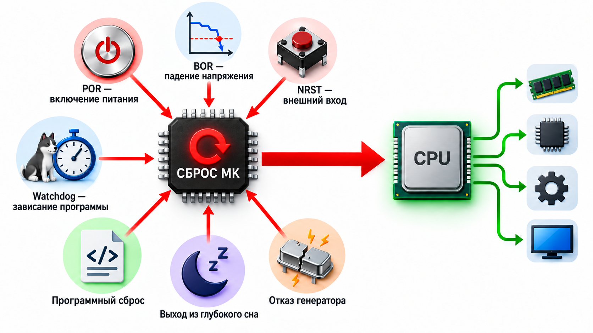

*Рисунок 16 — Основные источники сброса микроконтроллера*

## 5.2 Последовательность запуска

При подаче питания схема POR и детектор пониженного напряжения
удерживают сброс. Затем ожидается стабилизация выбранного стартового
генератора. После снятия сброса выполняется стартовый код:
устанавливается стек, копируются и инициализируются секции памяти,
настраивается системная частота, после чего вызывается функция main.

Последовательность запуска включает контроль питания, удержание сброса, ожидание генератора, выполнение стартового кода, инициализацию памяти и переход к пользовательской программе.

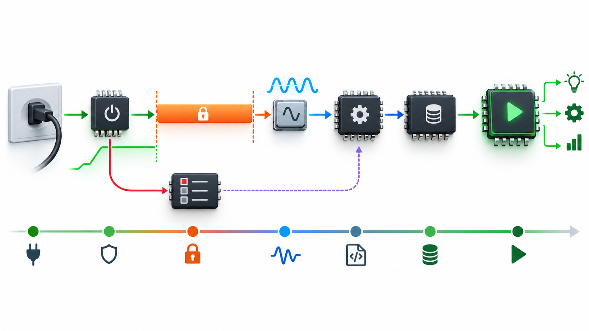

*Рисунок 17 — Типовая последовательность запуска после подачи питания*

Программа должна прочитать регистр причины сброса до его очистки. Это
позволяет отличить включение питания от watchdog-сброса, программного
перезапуска или выхода из глубокого сна и корректно вести журнал
отказов.

## 5.3 Watchdog как элемент надёжности

Watchdog — независимый таймер, который вызывает сброс, если программа не
подтверждает работоспособность. Обслуживать его следует только после
завершения контролируемого цикла, а не из безусловного прерывания. Иначе
зависшая основная логика может остаться незамеченной. Независимый
watchdog обычно тактируется отдельным низкочастотным генератором и
продолжает работать в части режимов сна.

Правильное обслуживание watchdog выполняют только после успешного завершения контролируемых операций. Если основная логика зависла, таймер должен истечь и сформировать аппаратный сброс.

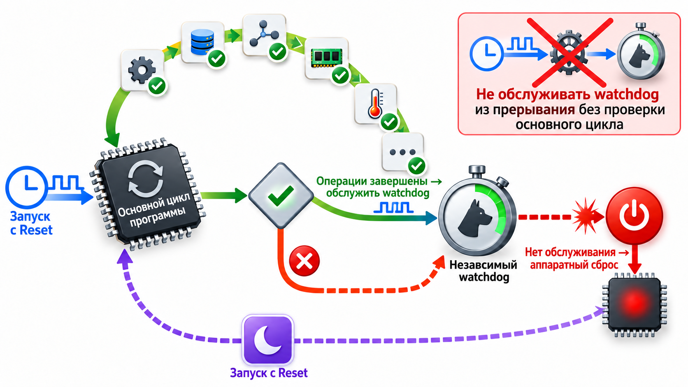

*Рисунок 18 — Правильное включение watchdog в цикл контроля работоспособности*

# 6 Энергопотребление микроконтроллера

Потребление цифровой КМОП-схемы складывается из динамической и
статической составляющих. Динамическая мощность связана с перезарядом
внутренних ёмкостей при переключениях:

$$
P_{dynamic} \approx \alpha \cdot C \cdot V^2 \cdot f
$$

Здесь α — коэффициент активности переключений, C — эффективная ёмкость,
V — напряжение питания, f — тактовая частота. Формула показывает, что
снижение напряжения особенно эффективно, поскольку мощность зависит от
его квадрата. Однако минимальное напряжение ограничивает допустимую
частоту и устойчивость работы.

Статическая мощность определяется токами утечки и сохраняется даже при
остановленном тактировании:

$$
P_{static} = V \cdot I_{leak}
$$

Динамическая составляющая связана с переключениями цифровых узлов, а статическая — с токами утечки. Поэтому остановка тактирования резко снижает динамическую мощность, но не устраняет утечки полностью.

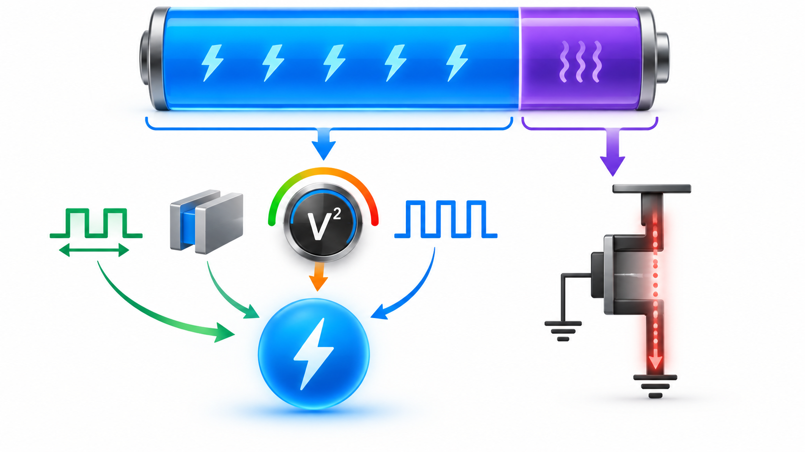

*Рисунок 19 — Динамическая и статическая составляющие энергопотребления*

Полная энергия задачи зависит не только от мгновенного тока, но и от
времени её выполнения:

$$
E = \int P(t)\,dt \approx P_{active}t_{active} + P_{sleep}t_{sleep}
$$

Поэтому уменьшение частоты не всегда экономит энергию. Иногда выгоднее
быстро выполнить короткую работу на повышенной частоте, отключить
периферию и перейти в глубокий сон. Эта стратегия называется race to
sleep.

При стратегии race to sleep микроконтроллер быстро завершает задачу, после чего большую часть периода находится в состоянии с малым током. Энергетический выигрыш определяют по площади под графиком мощности.

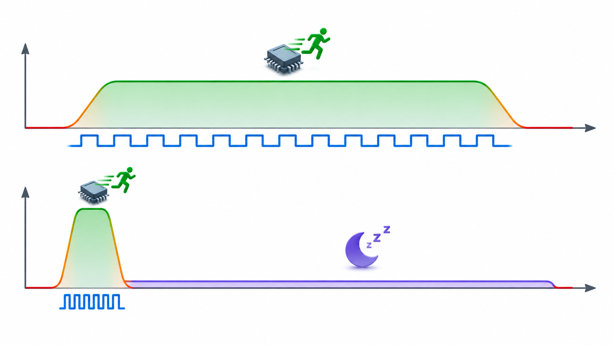

*Рисунок 20 — Периодическая работа с переходом в сон после обработки*

## 6.1 Практические способы снижения потребления

- Отключать тактирование неиспользуемых периферийных модулей.

- Снижать частоту и напряжение, когда полная производительность не
  требуется.

- Использовать прерывания вместо постоянного опроса.

- Передавать блоки данных через DMA, позволяя ядру спать.

- Выключать АЦП, компараторы, радиомодуль и внешние датчики вне
  измерений.

- Задавать определённые уровни GPIO, чтобы исключить плавающие входы и
  сквозные токи.

- Учитывать светодиоды, стабилизатор, USB UART и другие элементы
  отладочной платы: они могут потреблять больше самого
  микроконтроллера.

На практике потребление уменьшают на нескольких уровнях: отключают тактирование периферии, переводят внешние устройства в экономичный режим, используют прерывания и DMA, а также устраняют лишнюю нагрузку от элементов отладочной платы.

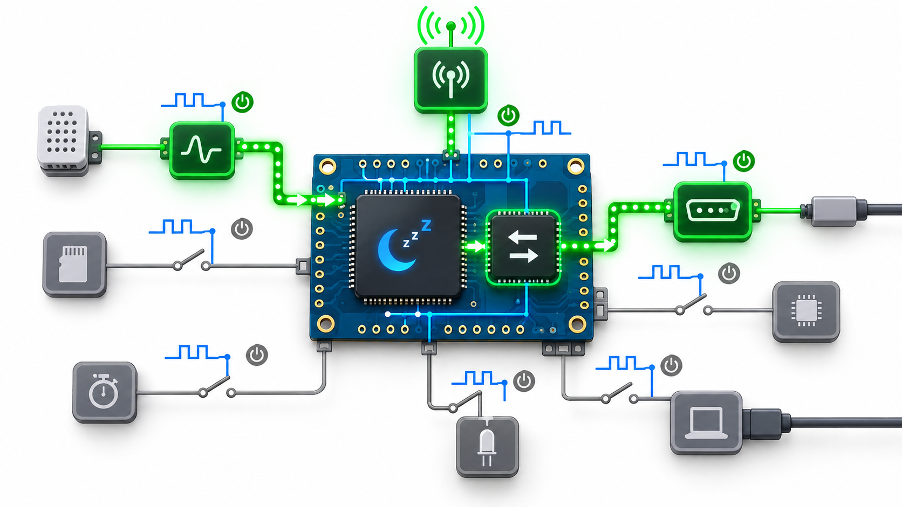

*Рисунок 21 — Способы снижения энергопотребления микроконтроллерной системы*

# 7 Режимы сна

Режим сна — аппаратное состояние, при котором останавливается ядро,
часть тактовых сигналов или целые домены питания. Чем глубже режим, тем
меньше ток, но тем меньше сохраняется состояние и тем больше задержка
пробуждения. Названия режимов различаются у производителей, поэтому
сравнивать нужно не названия, а набор работающих доменов.

## 7.1 Уровни энергосбережения

| **Уровень**            | **Что отключено**                          | **Что обычно сохраняется**             | **Пробуждение**                                 |
|------------------------|--------------------------------------------|----------------------------------------|-------------------------------------------------|
| Idle или Sleep         | Ядро CPU                                   | Регистры, RAM, большая часть периферии | Любое разрешённое прерывание                    |
| Stop или Light sleep   | Основные высокочастотные генераторы и ядро | RAM и выбранные домены                 | RTC, GPIO, UART и другие разрешённые источники  |
| Standby или Deep sleep | Большая часть питания цифрового домена     | RTC, backup-регистры, часть RTC RAM    | RTC или специальные GPIO; запуск похож на сброс |
| Shutdown               | Почти весь кристалл                        | Минимальный резервный домен или ничего | Внешнее событие, подача питания                 |

Углубление сна уменьшает ток, но увеличивает время восстановления и число отключённых доменов. Поэтому режим выбирают по допустимой задержке пробуждения и требуемому объёму сохраняемого состояния.

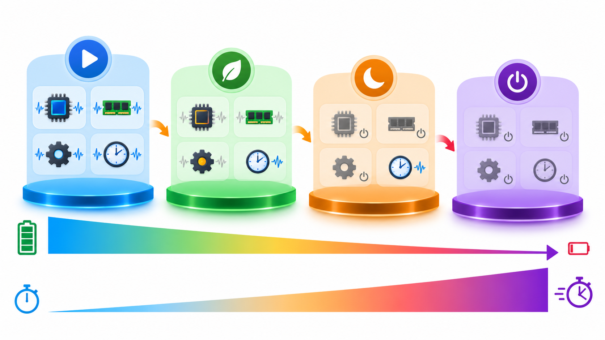

*Рисунок 22 — Обобщённое сравнение режимов энергосбережения*

## 7.2 Источники пробуждения

- таймер RTC или низкопотребляющий таймер;

- внешний вывод GPIO или линия прерывания;

- watchdog;

- UART, CAN, USB или сетевой контроллер, если они поддерживаются в
  выбранном режиме;

- АЦП, компаратор, touch-сенсор или ультранизкопотребляющий сопроцессор;

- событие радиомодуля в режимах, сохраняющих соединение.

Не каждый источник доступен в каждом режиме. Например, UART не сможет разбудить устройство, если его тактовый домен полностью отключён. Источник пробуждения выбирают одновременно с режимом сна.

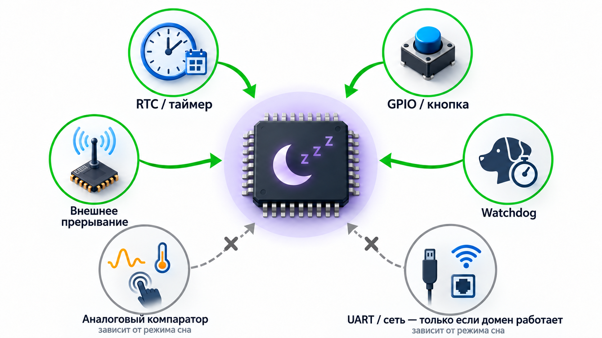

*Рисунок 23 — Возможные источники пробуждения микроконтроллера*

Перед входом в сон необходимо завершить критические операции, дождаться
окончания передачи, настроить источник пробуждения и очистить старые
флаги. После пробуждения программа проверяет причину события и при
необходимости восстанавливает частоту, периферию и интерфейсы.

## 7.3 Пример расчёта среднего тока

Устройство один раз в секунду выполняет измерение в течение 10 мс при
токе 12 мА, а оставшиеся 990 мс находится в сне с током 20 мкА. Средний
ток равен:

$$
I_{avg} = \frac{12\,\text{мА}\cdot0{,}010\,\text{с} + 0{,}020\,\text{мА}\cdot0{,}990\,\text{с}}{1\,\text{с}} \approx 0{,}140\,\text{мА}
$$

Без сна устройство потребляло бы около 12 мА постоянно. В реальном
расчёте необходимо добавить ток датчиков, стабилизатора, памяти,
радиомодуля и саморазряд батареи.

На временной диаграмме короткий импульс активного тока 12 мА занимает только 10 мс, а почти весь секундный период приходится на сон с током 20 мкА. Это снижает средний ток примерно до 0,140 мА.

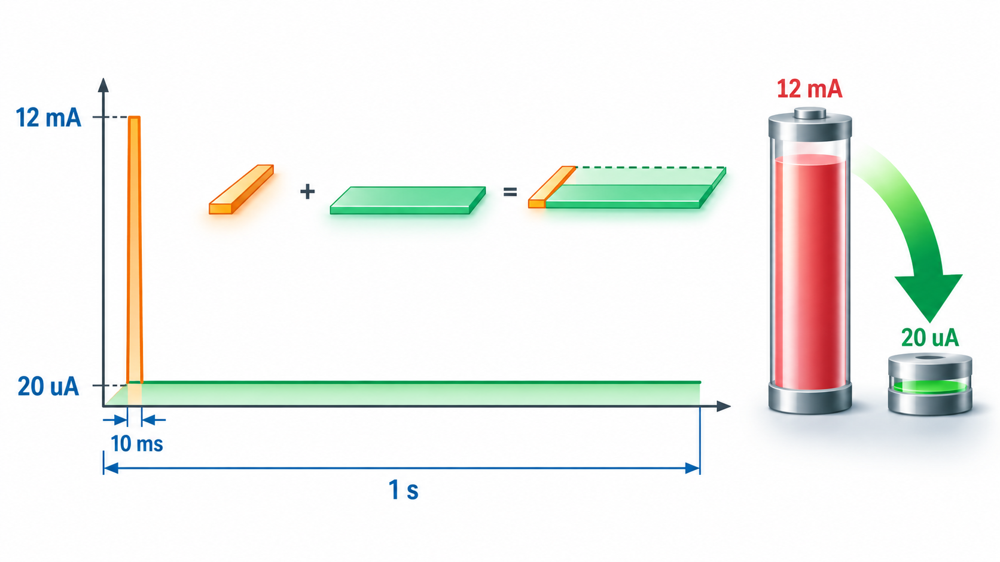

*Рисунок 24 — Расчёт среднего тока периодически работающего устройства*

# 8 Особенности AVR STM32 и ESP32

| **Платформа**  | **Тактирование**                                                              | **Сброс**                                                       | **Энергосбережение**                                                             |
|----------------|-------------------------------------------------------------------------------|-----------------------------------------------------------------|----------------------------------------------------------------------------------|
| AVR ATmega328P | Внутренний RC, внешний кварц или внешний clock; системный предделитель        | POR, BOR, внешний сброс, watchdog, программные флаги причины    | Idle, ADC Noise Reduction, Power save, Power down, Standby                       |
| STM32 Cortex M | HSI, HSE, LSI, LSE, PLL, развитое дерево RCC и делители шин                   | POR PDR, BOR, NRST, watchdog, software reset, флаги RCC         | Sleep, Stop и Standby; состав зависит от серии; clock gating периферии           |
| ESP32          | Внутренние RC, внешний кварц, PLL, отдельные RTC clocks, динамическая частота | Power on, brownout, watchdog, software, deep sleep wakeup reset | Modem sleep, Light sleep, Deep sleep; RTC домен и ULP могут оставаться активными |

У ATmega328P режимы сна выбираются регистром управления сном, а
пробуждение зависит от разрешённых прерываний. В STM32 конкретный набор
генераторов и режимов определяется серией, поэтому обязательна проверка
reference manual. ESP32 поддерживает Light sleep с сохранением состояния
CPU и Deep sleep, при котором основная цифровая часть выключается, а
RTC-контроллер и выбранные RTC-домены обеспечивают пробуждение.

Платформы различаются набором генераторов, глубиной отключения цифровых доменов и доступными источниками пробуждения. Поэтому сравнивать следует не названия режимов, а реально работающие блоки.

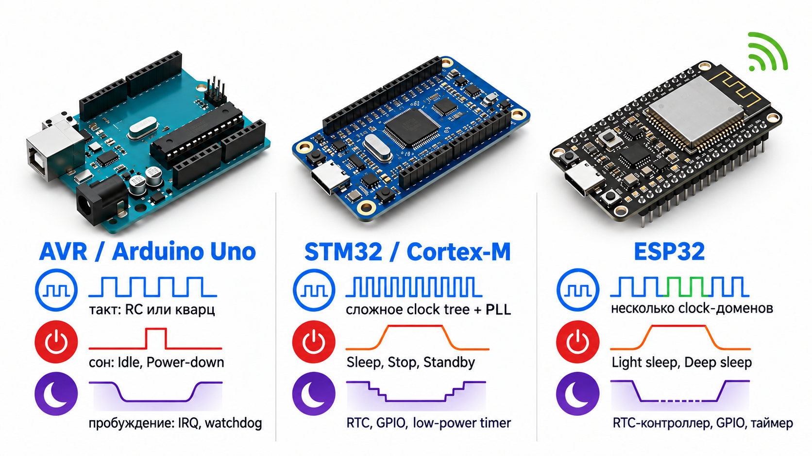

*Рисунок 25 — Сравнение подходов к тактированию и энергосбережению в AVR, STM32 и ESP32*

# 9 Практические алгоритмы

## 9.1 Настройка системного тактирования

> 1\. Определить требуемые частоты ядра, шин и периферии.
>
> 2\. Выбрать источник с подходящей точностью, временем запуска и
> потреблением.
>
> 3\. Проверить диапазоны напряжения, Flash, VCO, шин и периферийных
> модулей.
>
> 4\. Запустить источник и дождаться аппаратного флага готовности.
>
> 5\. Настроить делители, PLL, задержки Flash и параметры питания.
>
> 6\. Переключить системный clock только после стабилизации нового
> источника.
>
> 7\. Проверить флаг фактического источника и измерить частоту на выводе
> MCO CLKOUT или таймером.
>
> 8\. Пересчитать baud rate, SysTick и параметры таймеров.

## 9.2 Вход в режим сна

> 1\. Завершить запись во Flash EEPROM и передачу по интерфейсам.
>
> 2\. Перевести внешние устройства в экономичный режим.
>
> 3\. Настроить источник пробуждения и очистить его флаг.
>
> 4\. Отключить ненужную периферию и её тактирование.
>
> 5\. Сохранить данные, которые не удерживаются выбранным режимом.
>
> 6\. Выполнить барьерные инструкции, если этого требует архитектура.
>
> 7\. Войти в сон специальной инструкцией или API.
>
> 8\. После пробуждения определить причину, восстановить clock tree и
> периферию.

Безопасный вход в сон состоит из трёх фаз: подготовка системы, аппаратный переход в выбранный режим и контролируемое восстановление после события пробуждения.

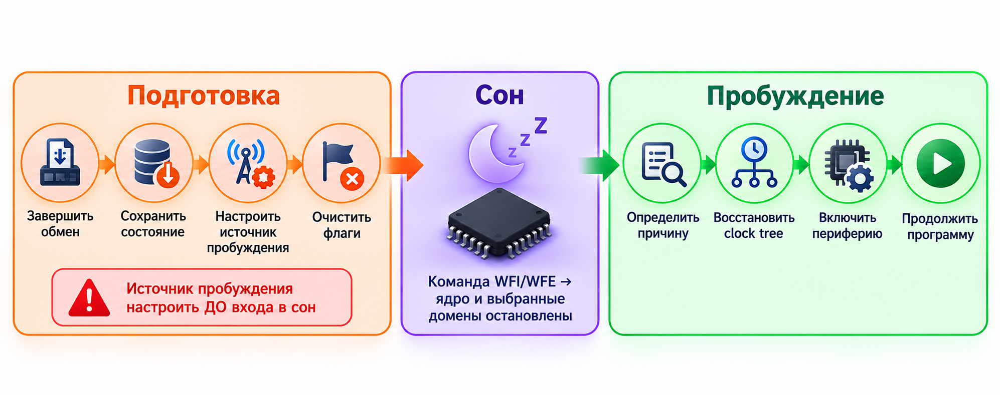

*Рисунок 26 — Алгоритм безопасного входа в сон и восстановления работы*

## 9.3 Псевдокод безопасного режима сна

> prepare_peripherals_for_sleep();  
> clear_wakeup_flags();  
> configure_rtc_or_gpio_wakeup();  
> disable_unused_clocks();  
> save_nonretained_context();  
> enter_sleep();  
>   
> reason = read_wakeup_reason();  
> restore_system_clock();  
> restore_peripherals();  
> handle_wakeup_event(reason);

# 10 Диагностика типичных неисправностей

| **Наблюдение**                 | **Вероятная причина**                                      | **Проверка**                                                                               |
|--------------------------------|------------------------------------------------------------|--------------------------------------------------------------------------------------------|
| МК не запускается от кварца    | Неверные ёмкости, разводка, повреждение резонатора         | Запустить от внутреннего RC; проверить флаг HSE ready и форму сигнала безопасным пробником |
| UART выдаёт нечитаемые символы | Неверная системная частота или baud rate                   | Проверить clock tree и значение SystemCoreClock                                            |
| После PLL система зависает     | Нет lock, неверные диапазоны VCO или Flash latency         | Вернуться на безопасный источник и проверить ограничения datasheet                         |
| После сна нет пробуждения      | Источник не разрешён или флаг не очищен                    | Проверить таблицу wakeup sources выбранного режима                                         |
| Ток сна слишком велик          | Активная периферия, подтяжки, отладчик, стабилизатор платы | Измерить ток самого МК, отключить интерфейсы и изолировать выводы                          |
| Периодические сбросы           | Watchdog, brownout или помехи RESET                        | Считать и сохранить флаги причины сброса в начале программы                                |

Диагностику начинают с проверки питания и тактового сигнала, затем контролируют линию RESET, частоты интерфейсов, флаги PLL и причины пробуждения. Осциллограф и мультиметр дополняют чтение аппаратных регистров.

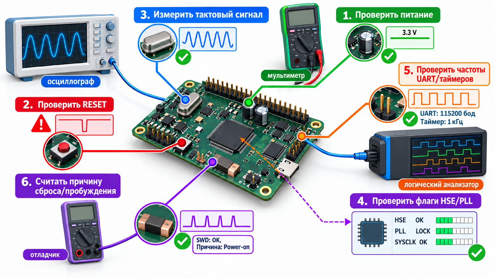

*Рисунок 27 — Контрольные точки и средства диагностики микроконтроллерной системы*

# 11. Инженерная задача для обсуждения

Устройство питается от батареи и должно один раз в секунду измерять датчик, раз в минуту передавать накопленные данные по UART, сохранять отсчёт времени между пробуждениями, восстанавливаться после зависания и работать как можно дольше.

Для такой системы требуется предложить:

1. источник системной частоты;
2. источник тактирования RTC;
3. режим сна;
4. источники периодического и аварийного пробуждения;
5. способ контроля зависания программы.

На рисунке показаны основные узлы устройства и пять пустых карточек для фиксации решений во время обсуждения. В карточки следует вписать выбранные варианты и кратко обосновать каждый выбор.

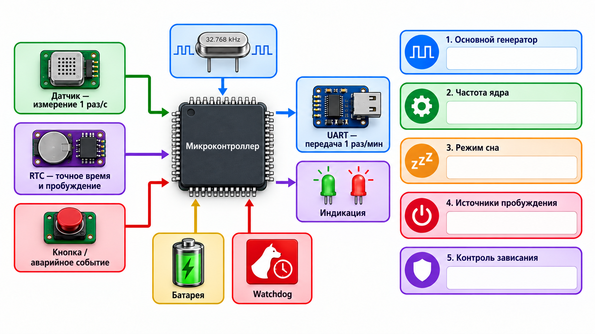

*Рисунок 28 — Структура автономного устройства и карточки для ответов студентов*

# 12. Итоги

Система тактирования задаёт не только частоту ядра, но и временную
основу всей периферии. Внутренний RC обеспечивает быстрый и дешёвый
запуск, внешний кварц — повышенную точность, а PLL — формирование
высокой частоты. Система сброса должна гарантировать запуск только при
допустимом питании и устойчивом тактировании. Энергопотребление
уменьшают отключением тактовых сигналов, снижением напряжения и частоты,
а также переходом в режимы сна с правильно выбранными источниками
пробуждения.

Главный инженерный принцип: выбирать не самый быстрый и не самый
глубокий режим, а минимально достаточную конфигурацию, которая выполняет
требования по производительности, точности, времени отклика и
надёжности.

Итоговая схема объединяет три взаимосвязанные области: тактирование определяет скорость и временную точность, сброс обеспечивает восстановление, а управление питанием задаёт продолжительность автономной работы.

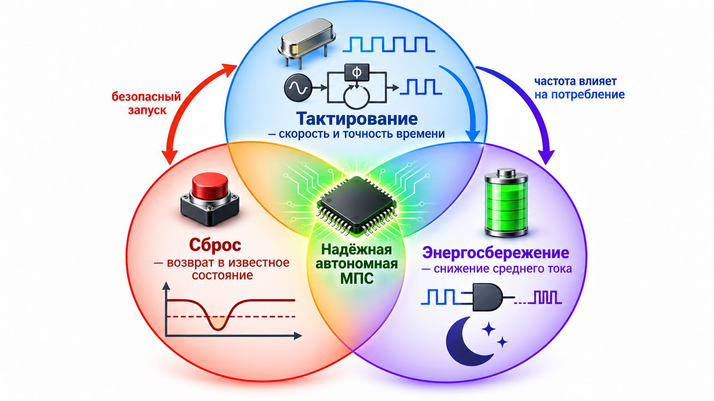

*Рисунок 29 — Взаимосвязь тактирования, сброса и энергосбережения*

# Контрольные вопросы

> 1\. Почему после сброса микроконтроллер обычно запускается от
> внутреннего генератора?
>
> 2\. Чем внутренний RC-генератор отличается от внешнего кварца?
>
> 3\. Что такое дерево тактирования и зачем нужны делители шин?
>
> 4\. Для чего применяется PLL и почему требуется ждать флаг готовности?
>
> 5\. Как вычислить частоту выхода PLL по коэффициентам M N и P?
>
> 6\. Чем POR отличается от BOR и watchdog reset?
>
> 7\. Почему необходимо читать флаг причины сброса?
>
> 8\. От каких величин зависит динамическая мощность КМОП-схемы?
>
> 9\. Почему снижение частоты не всегда уменьшает энергию задачи?
>
> 10\. Какие данные могут потеряться в Deep sleep?
>
> 11\. Какие действия выполняются перед входом в сон?
>
> 12\. Почему ток платы разработки может быть значительно больше тока
> микроконтроллера?

Контрольные вопросы охватывают выбор генератора, расчёт PLL, назначение источников сброса, подготовку ко сну и анализ причин неожиданного перезапуска.

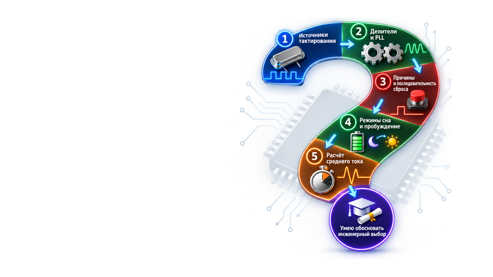

*Рисунок 30 — Основные направления итогового контроля знаний*

# Задания для самостоятельной работы

> 1\. Для исходной частоты 8 МГц подберите коэффициенты PLL,
> обеспечивающие системную частоту 72 МГц, и укажите промежуточные
> частоты. Допустимые диапазоны возьмите из документации выбранного
> STM32.
>
> 2\. Определите средний ток устройства, которое работает 25 мс с током
> 18 мА и затем 1975 мс находится в сне с током 35 мкА.
>
> 3\. Сравните режимы Power down ATmega328P, Stop выбранного STM32 и
> Deep sleep ESP32 по сохранению RAM, источникам пробуждения и поведению
> после выхода.
>
> 4\. Составьте алгоритм аварийного перехода на внутренний генератор при
> отказе внешнего кварца.

# Основные источники

1.  Barr M., Massa A. Programming Embedded Systems. 2nd ed. O’Reilly
    Media, 2006.

2.  Valvano J. W. Embedded Systems: Introduction to ARM Cortex-M
    Microcontrollers. 5th ed. 2019.

3.  Razavi B. Design of Analog CMOS Integrated Circuits. 2nd ed.
    McGraw-Hill, 2016. Разделы по генераторам и PLL.

4.  Chandrakasan A. P., Sheng S., Brodersen R. W. Low-Power CMOS Digital
    Design. IEEE Journal of Solid-State Circuits. 1992. Vol. 27,
    no. 4. P. 473–484. DOI 10.1109/4.126534.

5.  Microchip Technology. ATmega328P Data Sheet DS40002061. Разделы
    System Clock and Clock Options, System Control and Reset, Sleep
    Modes.

6.  STMicroelectronics. AN2867 Oscillator design guide for STM8AF/AL/S,
    STM32 MCUs and MPUs.

7.  STMicroelectronics. RM0090 STM32F405/415, STM32F407/417,
    STM32F427/437 and STM32F429/439 advanced Arm-based 32-bit MCUs.
    Разделы RCC и PWR.

8.  Arm. Cortex-M4 Devices Generic User Guide DUI 0553. Разделы system
    control, reset and power management.

9.  Espressif Systems. ESP32 Technical Reference Manual. Разделы Reset
    and Clock, Low-Power Management.

10. Espressif Systems. ESP-IDF Programming Guide. Разделы Sleep Modes и
    Power Management. docs.espressif.com, дата обращения 18.09.2026.
