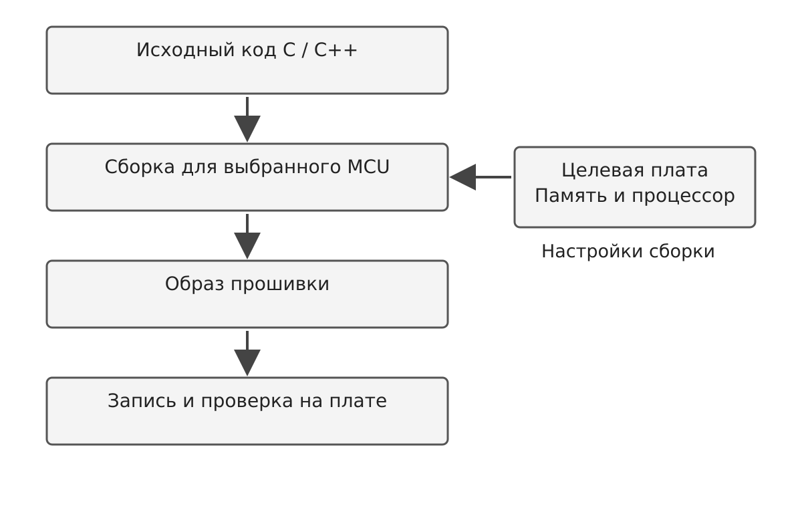
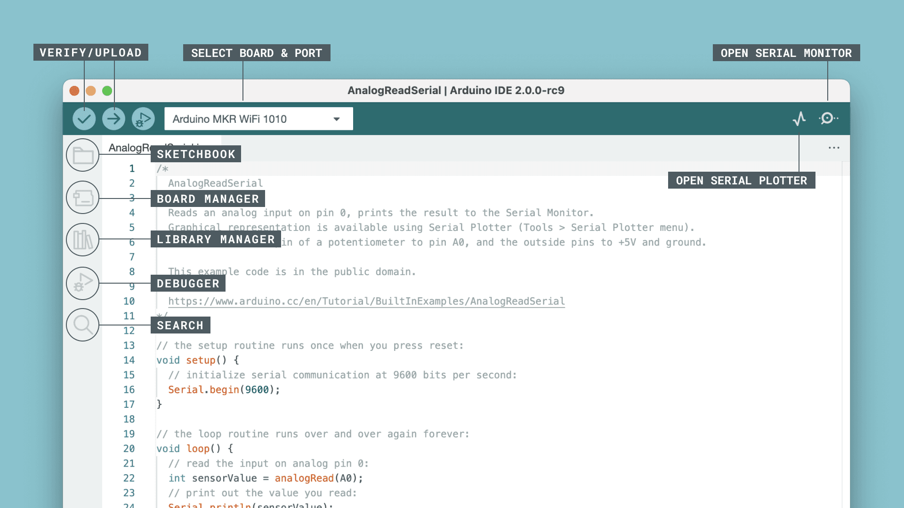
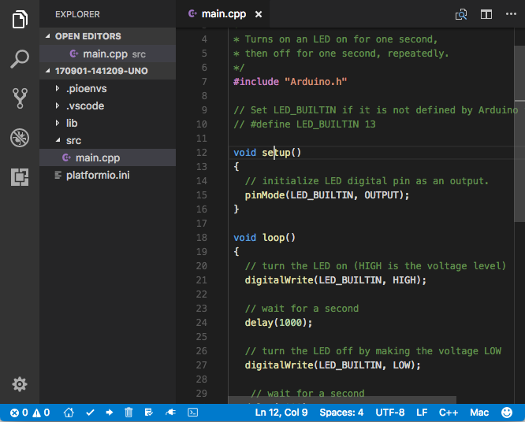
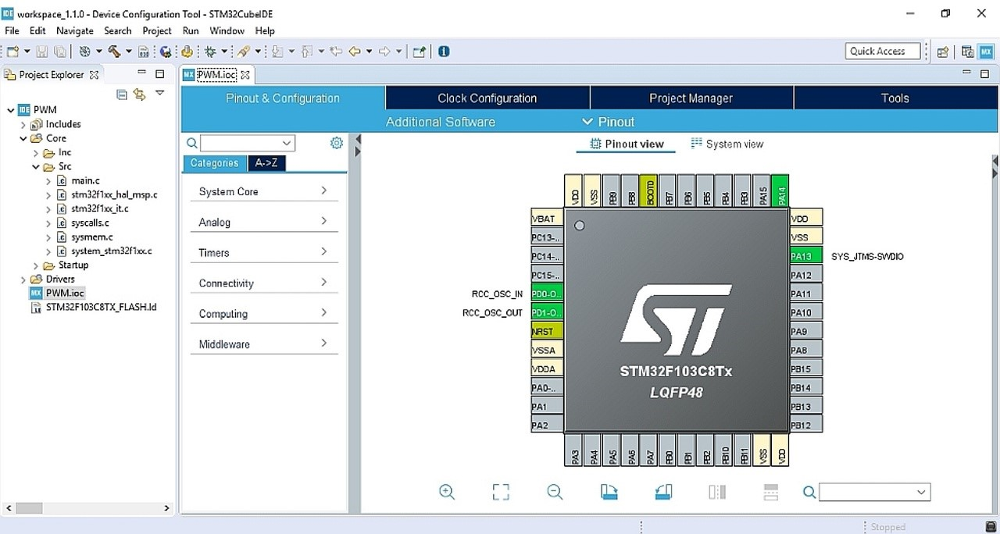
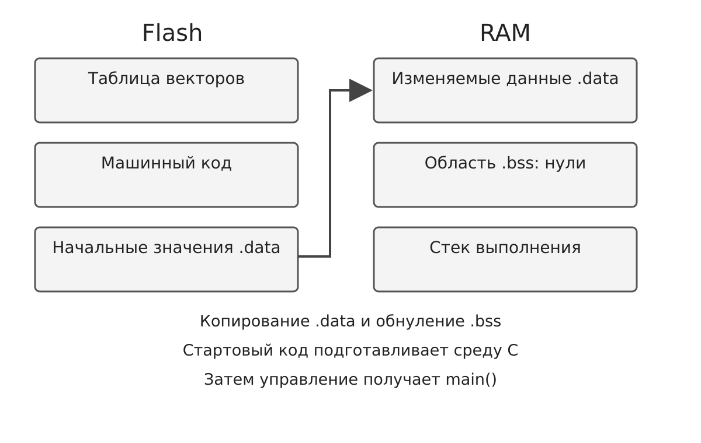
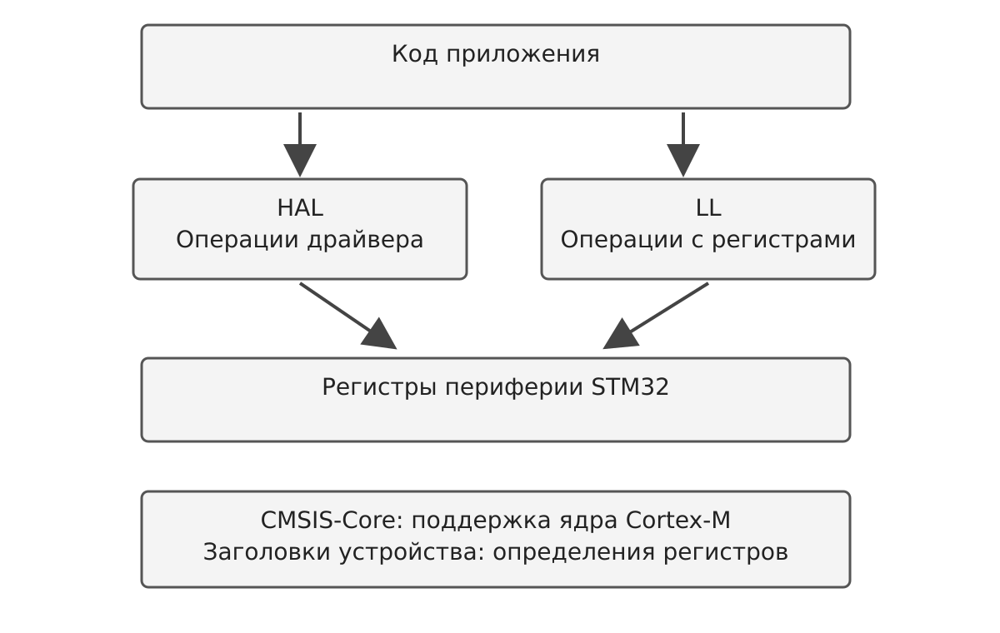
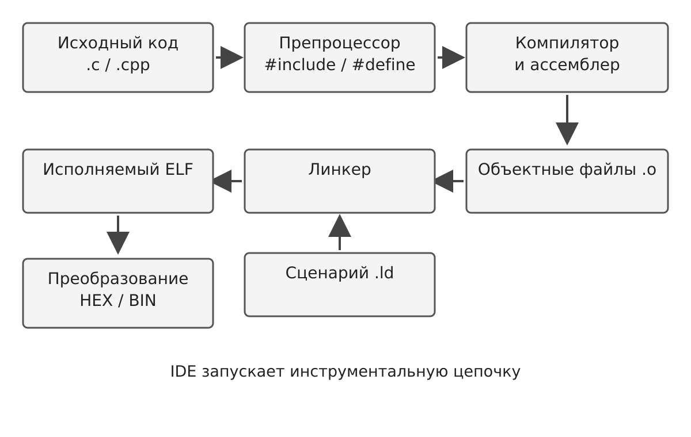
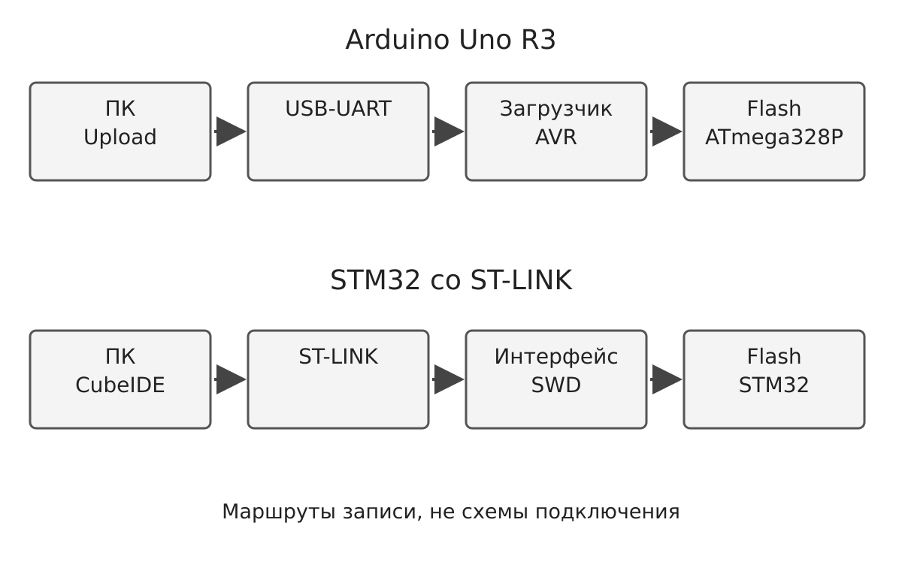

# Лекция 5.4. Инструментальные средства разработки прошивок

**МДК.02.02 «Программирование микроконтроллеров»**  
Специальность 09.02.01 «Компьютерные системы и комплексы»  
Таврический колледж, 7-й семестр. Продолжительность: 2 академических часа (90 минут).

**Тема по РПД:** Arduino IDE, PlatformIO, STM32CubeIDE, CMSIS, HAL и LL. Структура проекта, компиляция и загрузка прошивки.

**Цель:** понять назначение инструментов и программных слоёв, путь сборки и загрузки и принципы диагностики ошибок.

## Оглавление

- [1. От программы к работающему устройству](#s1)
- [2. Среда, платформа и библиотека](#s2)
- [3. Arduino IDE и устройство скетча](#s3)
- [4. Что Arduino делает перед компиляцией](#s4)
- [5. PlatformIO: проект как набор настроек](#s5)
- [6. Сборка и загрузка в PlatformIO](#s6)
- [7. STM32CubeIDE и STM32CubeMX](#s7)
- [8. Структура проекта STM32](#s8)
- [9. CMSIS: единый язык работы с ядром](#s9)
- [10. HAL и LL: выбор уровня управления](#s10)
- [11. Этапы сборки: почему возникает ошибка](#s11)
- [12. ELF, HEX, BIN и карта памяти](#s12)
- [13. Загрузка прошивки и отладка](#s13)
- [14. Типовые неисправности и их локализация](#s14)
- [15. Воспроизводимый проект и выбор инструмента](#s15)
- [16. Вопросы для самоконтроля](#s16)
- [Источники](#sources)

<a id="s1"></a>

## 1. От программы к работающему устройству

Программа микроконтроллера управляет физическим устройством: считывает сигналы, обрабатывает данные и изменяет состояние выходов. Однако текст на языке C или C++ сам по себе не исполняется процессором. До запуска его необходимо преобразовать в машинные команды, разместить в памяти выбранного микроконтроллера и проверить результат.

Прошивкой называют встроенное программное обеспечение устройства, а также подготовленный для записи образ этого программного обеспечения. Среда разработки объединяет средства, которые помогают создать такой образ. IDE — Integrated Development Environment, интегрированная среда разработки. Обычно она содержит редактор, средства запуска сборки, сообщения об ошибках и инструменты загрузки или отладки. Компилятор при этом является отдельным инструментом, который IDE запускает с нужными параметрами.

Представим электронный термометр. Программист пишет код чтения датчика и вывода температуры. Компилятор переводит код для нужного процессора, компоновщик соединяет части программы, а загрузчик или программатор записывает результат во Flash. Если выбрана другая плата, код может успешно собраться, но работать неправильно: отличаются выводы, частоты, память или способ подключения датчика.

Поэтому разработчик всегда связывает три составляющие: аппаратную платформу, программный код и конфигурацию инструментов. Связь этих составляющих показана на рисунке 1.



<p align="center">Рисунок 1 — Общий путь от исходного кода к работающему устройству</p>

<a id="s2"></a>

## 2. Среда, платформа и библиотека

Arduino IDE, PlatformIO и STM32CubeIDE относятся к инструментам разработки. CMSIS, HAL и LL относятся к программной поддержке микроконтроллеров. Эти названия встречаются рядом, но выполняют разные задачи.

Arduino IDE удобна для знакомства с платами и небольшими учебными проектами. Поддержку конкретной платы обеспечивает установленный пакет: сведения о плате, ядро Arduino, компилятор и средства загрузки. Наличие Arduino IDE ещё не означает наличие поддержки каждой платы.

PlatformIO — экосистема разработки встроенного программного обеспечения. Она включает командные инструменты PlatformIO Core и интеграцию с редакторами, в том числе Visual Studio Code. PlatformIO управляет платформами, библиотеками и параметрами проекта. Важно различать platform, board и framework: платформа определяет семейство инструментов, board описывает целевую плату, framework задаёт программную основу. Для одной платы иногда доступно несколько framework.

STM32CubeIDE предназначена для разработки и отладки проектов STM32. STM32CubeMX помогает настроить выводы, периферию и тактирование и сформировать код инициализации. CMSIS стандартизирует программную поддержку Arm, HAL предоставляет функции управления периферией STM32, LL предлагает операции ближе к регистрам.

Таблица 1 — Назначение инструментов и программных компонентов

| Название | Основная роль | Что определяет разработчик |
|---|---|---|
| Arduino IDE | Редактирование, сборка, загрузка скетчей | Плату, пакет, порт, библиотеки |
| PlatformIO | Управление проектом и инструментами | Платформу, плату, framework, зависимости |
| STM32CubeIDE | Разработка и отладка STM32 | Проект, конфигурацию сборки, отладчик |
| STM32CubeMX | Настройка и генерация инициализации | Выводы, периферию, частоты |
| CMSIS-Core | Доступ к ядру Cortex-M | Заголовки и поддержку выбранного устройства |
| HAL / LL | Драйверы периферии STM32 | Нужный уровень доступа и настройки |

<a id="s3"></a>

## 3. Arduino IDE и устройство скетча

Скетч — проект Arduino. Его основной файл имеет расширение .ino, а имя основного файла совпадает с именем папки скетча: например, BlinkDemo/BlinkDemo.ino. Проект может включать дополнительные исходные и заголовочные файлы. Функция setup() выполняется один раз после запуска, а loop() вызывается повторно. Их вызывает код ядра Arduino, поэтому отсутствие написанного пользователем main() не означает отсутствие точки входа в итоговой программе.

Интерфейс Arduino IDE содержит редактор, выбор платы, команды Verify и Upload, окно сообщений и монитор последовательного порта. Verify запускает сборку и позволяет выявить ошибки кода без записи на устройство. Upload обычно сначала выполняет сборку, затем запускает инструмент загрузки. Успешная Verify подтверждает пригодность программы к сборке с выбранными настройками, но не исправность подключения.

На рисунке 2 приведён снимок Arduino IDE 2 из документации Arduino. Внешний вид и расположение некоторых элементов зависят от версии. В работе нужно ориентироваться на назначение команд, а не только на форму значков.



<p align="center">Рисунок 2 — Обзор интерфейса Arduino IDE 2</p>

Для Arduino Uno R3 выбирают пакет Arduino AVR Boards и плату Arduino Uno. Uno R4 — другая аппаратная платформа, поэтому выбирать её вместо Uno R3 нельзя. Подключённая плата должна появиться в списке портов. Если она питается, но порт отсутствует, возможен кабель только для зарядки, отсутствие драйвера USB-преобразователя или неисправность соединения.

Разобранный пример для Uno R3:

```cpp
void setup() {
  pinMode(LED_BUILTIN, OUTPUT);
  Serial.begin(9600);
  Serial.println("BlinkDemo 1.0");
}

void loop() {
  digitalWrite(LED_BUILTIN, HIGH);
  delay(500);
  digitalWrite(LED_BUILTIN, LOW);
  delay(500);
}
```

pinMode задаёт режим вывода, digitalWrite устанавливает логический уровень. Две задержки по 500 мс дают приблизительно одну секунду полного цикла мигания. delay блокирует выполнение основного потока, поэтому такой пример подходит для проверки инструментов, но сложному устройству потребуются неблокирующие алгоритмы. Serial.begin задаёт скорость обмена. В мониторе последовательного порта выбирают 9600 бод. Стартовое сообщение может быть пропущено, если монитор открыли после запуска; на Uno R3 открытие порта часто вызывает автоматический сброс.

LED_BUILTIN связан с определением выбранной платы. Для Uno R3 встроенный светодиод подключён к D13. Нельзя переносить это число на все STM32 и ESP32: встроенный светодиод может иметь другую полярность, другой вывод или отсутствовать.

<a id="s4"></a>

## 4. Что Arduino делает перед компиляцией

Файл .ino содержит код C++, но проходит дополнительную подготовку. Arduino объединяет файлы .ino скетча, добавляет подключение Arduino.h при необходимости и формирует прототипы функций. После этого обычный компилятор C++ обрабатывает подготовленный исходный файл. Для некоторых сложных объявлений автоматическое создание прототипов может оказаться недостаточным, и объявления нужно написать явно.

Файлы .cpp не получают все удобства предварительной обработки .ino. Поэтому при переносе примера в main.cpp обычно явно добавляют #include <Arduino.h> и соблюдают обычные правила C++: объявление функции должно быть известно до её использования. Заголовочные файлы .h содержат объявления и общие определения, а реализацию функций обычно размещают в .c или .cpp.

Библиотека тоже участвует в сборке. Её наличие в каталоге не гарантирует совместимость с целевой архитектурой. Например, библиотека, обращающаяся непосредственно к регистрам AVR, не заработает на ESP32 только потому, что обе платы поддерживают Arduino API. Предупреждение о несовместимой архитектуре следует изучать до загрузки.

<a id="s5"></a>

## 5. PlatformIO: проект как набор настроек

В небольшом скетче часть настроек выбирают в меню. В PlatformIO основные параметры записывают в platformio.ini в корне проекта. Такой подход облегчает передачу проекта: вместе с исходным кодом другой разработчик получает описание целевой платы и программной основы. Для воспроизводимости дополнительно фиксируют фактически использованные версии платформ и библиотек.

На рисунке 3 показан пример проекта PlatformIO в Visual Studio Code из официальной документации. Файлы программы находятся в src, а результаты сборки формируются отдельно.



<p align="center">Рисунок 3 — Проект PlatformIO в Visual Studio Code</p>

Таблица 2 — Основные элементы проекта PlatformIO

| Путь | Назначение |
|---|---|
| platformio.ini | Параметры сред сборки |
| src/main.cpp | Основной исходный код |
| include/ | Общие заголовочные файлы проекта |
| lib/ | Локальные библиотеки |
| test/ | Код тестов, если они предусмотрены |
| .pio/ | Создаваемые инструментариями результаты и служебные данные |

Пример конфигурации для Uno R3:

```ini
[env:uno]
platform = atmelavr
board = uno
framework = arduino
monitor_speed = 9600
```

env:uno — имя среды сборки. platform = atmelavr выбирает платформу AVR, board = uno — описание платы, framework = arduino — ядро и программные интерфейсы Arduino. monitor_speed относится к терминалу, а не к компилятору и не к скорости загрузки.

В src/main.cpp помещают разобранный ранее пример с явной строкой #include <Arduino.h>. При первой сборке PlatformIO может скачать платформу и инструменты. Это требует доступного соединения с соответствующими ресурсами. Если загрузка пакета завершилась ошибкой, причина находится в подготовке инструментов, а не обязательно в программе.

<a id="s6"></a>

## 6. Сборка и загрузка в PlatformIO

Команды выполняют в терминале PlatformIO Core из корня проекта, где находится platformio.ini. В обычном терминале команда pio доступна только при соответствующей настройке PATH. Установка расширения сама по себе не гарантирует её доступность в любом внешнем терминале.

```sh
pio run -e uno
pio run -e uno -t upload
pio device monitor -b 9600
```

Первая команда собирает выбранную среду без записи в плату. Вторая собирает проект и загружает результат. Третья открывает монитор последовательного порта. При нескольких подключённых устройствах задают конкретный порт параметром -p для monitor или через upload_port для загрузки. Значение порта берут из своей системы, например из списка pio device list.

Изолированная проверка сборки помогает локализовать неисправность. Если pio run завершилась успешно, а upload — нет, сначала исследуют порт, кабель, права доступа, настройки загрузки и состояние устройства. Переписывать алгоритм мигания в такой ситуации обычно бессмысленно.

Разные среды в одном platformio.ini позволяют собирать общий исходный код для разных плат. Однако это не обещание автоматической переносимости. Нужно проверить наличие светодиода, уровни напряжения, выводы и совместимость библиотек. Одна и та же строка digitalWrite может управлять разными физическими выводами.

<a id="s7"></a>

## 7. STM32CubeIDE и STM32CubeMX

Для STM32 существенно не только написать алгоритм, но и согласовать выводы, источники тактирования, периферию и память. STM32CubeMX показывает доступные функции выводов и помогает сформировать начальную конфигурацию. На рисунке 4 приведён снимок окна настройки выводов из опубликованного методического пособия STM32. Это пример прежнего встроенного интерфейса CubeMX в CubeIDE, а не снимок актуального размещения окон CubeIDE 2.x.



<p align="center">Рисунок 4 — Пример графической настройки выводов STM32 в интерфейсе CubeMX</p>

В STM32CubeIDE 2.x STM32CubeMX используется как отдельное приложение. Последовательность работы: открыть CubeMX, выбрать точный микроконтроллер или плату, настроить проект, выбрать STM32CubeIDE как целевую инструментальную среду, сгенерировать код, затем открыть или импортировать проект в CubeIDE. В ветке 1.x конфигуратор мог открываться непосредственно внутри IDE. Поэтому старые видеоматериалы полезны для понимания настроек, но расположение команд может отличаться.

Для учебного примера можно использовать NUCLEO-F401RE со встроенным ST-LINK. Это конкретный пример, а не утверждение о составе лаборатории. При выборе другой платы проверяют её схему и документацию. ST-LINK предоставляет отладочную связь с микроконтроллером, тогда как виртуальный COM-порт служит для обмена сообщениями. Наличие COM-порта не заменяет настройку отладчика.

В CubeIDE сборка создаёт исполняемый файл для выбранного STM32. Запуск отладки обычно включает запись программы через отладчик, остановку в предусмотренной точке и управление выполнением. После запуска процессор может оставаться остановленным на точке останова: это нормальное состояние отладочной сессии, а не признак неудачной прошивки.

<a id="s8"></a>

## 8. Структура проекта STM32

Конкретная структура зависит от генератора и выбранных компонентов. В типовом проекте CubeMX папка Core/Src содержит main.c и другие исходные файлы приложения, Core/Inc — заголовки. Drivers/CMSIS содержит поддержку ядра и устройства, Drivers/STM32...HAL_Driver — драйверы соответствующего семейства. Файл .ioc хранит конфигурацию CubeMX. Сценарий компоновки .ld задаёт области памяти и размещение секций.

Стартовый файл содержит таблицу векторов и код начального запуска. После сброса Cortex-M получает исходное значение указателя стека и адрес обработчика сброса из таблицы векторов. Стартовый код подготавливает среду C: в типичном проекте копирует начальные значения изменяемых данных из Flash в RAM, обнуляет область .bss и передаёт управление main(). Точное расположение вызова SystemInit() зависит от стартового кода.

В main() проекта HAL часто видны HAL_Init(), SystemClock_Config(), MX_GPIO_Init() и бесконечный цикл while (1). HAL_Init подготавливает базовую поддержку HAL, SystemClock_Config задаёт тактирование проекта, MX_GPIO_Init — конфигурацию портов. Код управления выходом должен выполняться после необходимой инициализации.

CubeMX может повторно генерировать часть файлов. Пользовательские фрагменты размещают в предусмотренных областях USER CODE BEGIN / END при включённом сохранении пользовательского кода, либо выносят в отдельные модули. Резервная копия и контроль версий остаются необходимыми: специальные комментарии не защищают произвольные правки в любой строке.

Связь основных файлов с начальным запуском показана на рисунке 5.



<p align="center">Рисунок 5 — Память программы и подготовка среды C перед main</p>

<a id="s9"></a>

## 9. CMSIS: единый язык работы с ядром

CMSIS — Common Microcontroller Software Interface Standard, стандарт программных интерфейсов и компонентов для микроконтроллеров Arm. В этой лекции прежде всего рассматривается CMSIS-Core для Cortex-M. Он задаёт согласованные определения регистров ядра, функции доступа к NVIC и SysTick и правила поддержки устройства.

Например, NVIC_EnableIRQ(USART2_IRQn) включает разрешение соответствующего прерывания в контроллере NVIC. Эта операция сама по себе не настраивает USART, не включает его тактирование и не создаёт обработчик. Она выполняет только свою часть общей настройки.

Заголовок конкретного устройства предоставляет определения адресов и полей регистров периферии. Условная операция GPIOA->ODR обращается к регистру порта GPIOA, но существование такого определения не означает, что порт уже включён и настроен.

CMSIS-Core облегчает работу с одинаковыми механизмами ядра в разных микроконтроллерах. Периферия производителей при этом может существенно различаться. Кроме Core, семейство CMSIS включает другие компоненты, например DSP и NN, которые решают отдельные задачи обработки сигналов и вычислений. CMSIS-Core не следует отождествлять с драйверами всей периферии STM32.

<a id="s10"></a>

## 10. HAL и LL: выбор уровня управления

HAL — Hardware Abstraction Layer, слой аппаратной абстракции. В STM32 HAL содержит функции настройки и управления периферией. Разработчик задаёт параметры через структуры и вызывает функции с понятными именами. Для некоторых периферийных устройств применяются дескрипторы handle, состояния, обработчики и обратные вызовы.

LL — Low Layer, низкоуровневые драйверы STM32. Они предоставляют операции ближе к отдельным регистрам и битовым полям. Многие LL-функции небольшие и встраиваемые. Их применение требует более подробного знания периферии и порядка её настройки. LL не является обязательной ступенью, через которую проходит каждый вызов HAL: HAL и LL обычно представляют альтернативные способы работы с периферией.

Таблица 3 — Сравнение способов управления периферией

| Способ | Преимущество | Что нужно учитывать |
|---|---|---|
| HAL | Удобные операции и готовые механизмы драйвера | Состояния, обработчики, ограничения API |
| LL | Более точное управление отдельными операциями | Порядок настройки и устройство периферии |
| Прямые регистры | Полный контроль конкретной операции | Адреса, биты, побочные эффекты и семейство MCU |

Нельзя утверждать, что LL всегда быстрее, а HAL всегда слишком медленна. Влияние зависит от операции, оптимизации компилятора и требований приложения. Для первого учебного проекта HAL облегчает понимание общей последовательности. Для критичного участка выбор подтверждают измерением.

На рисунке 6 HAL и LL показаны как отдельные ветви доступа к периферии. CMSIS-Core обеспечивает поддержку ядра, а заголовки устройства описывают регистры конкретного STM32.



<p align="center">Рисунок 6 — Приложение, HAL, LL и поддержка CMSIS</p>

Разобранный фрагмент для STM32F401 с предварительно настроенным PA5:

```c
/* Вариант HAL: необходим заголовок HAL выбранного семейства. */
HAL_GPIO_TogglePin(GPIOA, GPIO_PIN_5);

/* Альтернативный вариант LL: необходим stm32f4xx_ll_gpio.h. */
LL_GPIO_TogglePin(GPIOA, LL_GPIO_PIN_5);
```

Оба примера показывают переключение выхода и рассматриваются по отдельности. Для NUCLEO-F401RE PA5 связан со светодиодом LD2. Перед вызовом нужны включённое тактирование GPIOA и настройка PA5 как выхода. Совместное выполнение обеих строк быстро переключит вывод дважды, и видимого изменения может не быть. Смешивать HAL и LL в сложном драйвере нужно осознанно, чтобы не нарушить состояние, которое отслеживает HAL.

<a id="s11"></a>

## 11. Этапы сборки: почему возникает ошибка

Сборка включает несколько стадий. Препроцессор обрабатывает #include, #define и условную компиляцию. Компилятор переводит исходный код в представление для целевого процессора, а ассемблер формирует объектные файлы. Компоновщик, или линкер, соединяет объектные файлы и библиотеки, разрешает ссылки на функции и размещает код и данные по правилам проекта.

Объектный файл .o содержит машинный код своего модуля и информацию, необходимую для объединения с другими модулями. Если один модуль вызывает функцию, реализация которой не попала в сборку, компоновщик выдаёт undefined reference. Если заголовок не найден, ошибка появляется раньше, при обработке исходного файла. Если забыта точка с запятой, компилятор сообщает о синтаксической ошибке.

Успешное завершение каждого этапа означает только выполнение его условий. Компилятор способен принять неверный алгоритм, а компоновщик — соединить программу, которая обращается к неподходящему выводу. Поэтому сборка является обязательной, но неполной проверкой.

Последовательность обработки файлов показана на рисунке 7. IDE управляет запуском инструментов и показывает их вывод, а сами преобразования выполняет инструментальная цепочка, toolchain.



<p align="center">Рисунок 7 — Стадии сборки и промежуточные файлы</p>

При чтении журнала полезно начинать с первой содержательной ошибки. Итоговая строка exit status 1 сообщает о неудаче процесса, но обычно не объясняет причину. Несколько последующих ошибок могут быть следствием одной пропущенной скобки.

<a id="s12"></a>

## 12. ELF, HEX, BIN и карта памяти

После компоновки часто получается ELF — Executable and Linkable Format. Он может содержать секции программы, адреса, таблицы символов и отладочную информацию. Отладчик использует эти сведения, чтобы связать машинные команды со строками исходного кода.

Intel HEX представляет данные в текстовых записях с адресной информацией. BIN содержит последовательность байтов без такой структуры адресов. Поэтому для BIN загрузчику нужно отдельно сообщить подходящий адрес записи. Файлы ELF, HEX и BIN — разные представления результата сборки. Переименование расширения не преобразует один формат в другой.

MAP-файл помогает понять размещение секций и вклад модулей в размер программы. Во Flash обычно находятся код и постоянные данные. RAM нужна для изменяемых данных, стека и при наличии динамического выделения — кучи. Начальные значения некоторых изменяемых данных одновременно занимают место в образе Flash и место в RAM после запуска.

Предположим, у условного устройства 64 КиБ Flash и 20 КиБ RAM, а сборка сообщает 28 КиБ программных данных и 5 КиБ статических данных в RAM. Это ещё не доказывает, что RAM хватает: стек, динамические объекты и некоторые буферы во время выполнения могут увеличить расход. Пример условный и не описывает конкретную плату.

Изменение оптимизации может поменять размер и поведение отладки. Конфигурация Debug часто удобнее для пошагового выполнения, а Release ориентирована на итоговое приложение. Названия конфигураций сами по себе не определяют конкретные флаги: их проверяют в настройках проекта.

<a id="s13"></a>

## 13. Загрузка прошивки и отладка

Загрузка — перенос результата сборки в память устройства. Для Uno R3 обычный путь использует USB-последовательный преобразователь и загрузчик в микроконтроллере. Для STM32 в рассматриваемом примере используется ST-LINK через SWD — Serial Wire Debug. Для ESP32 распространена загрузка через последовательное соединение и загрузочный режим, но способ подключения зависит от конкретной платы и варианта чипа.

Один USB-разъём может обеспечивать питание, последовательный обмен, собственный USB-интерфейс микроконтроллера или связь со встроенным отладчиком. Назначение определяет схема платы. Поэтому наличие разъёма не позволяет автоматически выбрать способ загрузки.

На рисунке 8 сравниваются два конкретных пути записи: последовательная загрузка Uno R3 и отладочное подключение STM32. Они служат для объяснения маршрута данных и не являются монтажными схемами внешнего программатора.



<p align="center">Рисунок 8 — Последовательная загрузка и запись через отладчик</p>

Отладка отличается от простого вывода сообщений. Аппаратный отладчик позволяет останавливать выполнение, просматривать переменные и выполнять программу по шагам. Точка останова прерывает обычное течение времени: двигатель, таймер или внешний датчик могут продолжать работать по своим правилам. Поэтому наблюдение под отладчиком иногда отличается от автономного запуска.

После записи проверяют фактическое поведение: мигает ли нужный светодиод, выводится ли версия, сохраняется ли работа после сброса. Перед изменением физического подключения отключают питание. Вопросы загрузчиков, обновления, OTA и совместимости версий подробно рассматриваются в следующей теме 5.5.

<a id="s14"></a>

## 14. Типовые неисправности и их локализация

Удобно разделять проблемы по этапам. Если сборка не дошла до загрузки, кабель и порт обычно ещё не участвовали в отказавшей операции. Если запись завершилась успешно, но светодиод не мигает, нужно исследовать исполнение и аппаратное соответствие, а не только повторять upload.

Таблица 4 — Примеры диагностики

| Наблюдение | Возможная причина | Что проверяют сначала |
|---|---|---|
| Заголовок не найден | Отсутствует библиотека или неверен путь | Зависимость и имя #include |
| undefined reference | Нет реализации в сборке | Исходный модуль, имя и сигнатуру функции |
| Не помещается во Flash | Превышен объём доступной памяти | Размер секций, библиотеки, целевое устройство |
| Порт не появляется | Кабель, драйвер, разъём | Кабель данных и список устройств ОС |
| Порт занят | Другая программа открыла соединение | Мониторы и терминалы |
| ST-LINK не соединяется | Питание, интерфейс, настройки | Плату, кабель и конфигурацию отладчика |
| Запись успешна, результата нет | Другой вывод, остановка, ошибка алгоритма | Схему платы, режим запуска, инициализацию |
| Символы в мониторе искажены | Не совпадает скорость | Serial.begin и скорость терминала |

Первая полезная информация — точный текст ошибки, выбранная плата и стадия отказа. Формулировка «не работает» не позволяет отличить неисправный USB-кабель от ошибки компоновки. Изменять несколько настроек одновременно нежелательно: тогда трудно понять, какая из них повлияла на результат.

Ещё одна распространённая ситуация: после изменения кода устройство показывает старую строку версии. Возможны неудачная загрузка, выбор другой подключённой платы или запуск ранее собранного файла. Простая строка версии в стартовом сообщении помогает различать такие случаи.

<a id="s15"></a>

## 15. Воспроизводимый проект и выбор инструмента

Чтобы проект можно было продолжить на другом компьютере, сохраняют исходники, конфигурацию платы, описание зависимостей и способ сборки. Для STM32 важны .ioc, сценарий компоновки и сведения об использованном пакете поддержки. Для PlatformIO важен platformio.ini. Для Arduino полезны сведения о пакете платы, версии ядра и библиотеках.

Исходные файлы и результаты сборки имеют разное назначение. Образ прошивки позволяет записать готовую программу, но не заменяет исходники. Исходники без сведений о целевой платформе и зависимостях могут оказаться недостаточными для повторной сборки. Пароли и секретные ключи не включают в общедоступный проект.

Для первого опыта и демонстрации простого устройства Arduino IDE сокращает число начальных настроек. Для модульного проекта с несколькими средами удобен PlatformIO. Для изучения периферии STM32 и аппаратной отладки полезны CubeMX и CubeIDE. Выбор определяется платой, задачей и необходимыми инструментами, а не только знакомым интерфейсом.

Основной результат темы: студент различает редактор, компилятор, библиотеку и загрузчик, понимает структуру проекта и способен объяснить, на каком этапе возникла неисправность. Эти знания поддерживают практическую работу № 9 по настройке среды, созданию, сборке и загрузке тестовой программы, указанную в РПД.

<a id="s16"></a>

## 16. Вопросы для самоконтроля

1. Чем IDE отличается от компилятора и framework?
2. Почему выбор платы влияет на сборку и работу программы?
3. Кто вызывает setup() и loop() в проекте Arduino?
4. Чем отличается обработка .ino от обычного файла .cpp?
5. Для чего нужен platformio.ini и что означают platform, board, framework?
6. Чем сборка отличается от загрузки?
7. Как взаимодействуют STM32CubeMX и STM32CubeIDE 2.x?
8. Для чего нужны стартовый файл и сценарий компоновки?
9. Какие задачи решает CMSIS-Core?
10. Чем отличаются HAL и LL? Почему LL не является обязательным внутренним слоем HAL?
11. На каком этапе возникает undefined reference?
12. Чем ELF отличается от HEX и BIN?
13. Почему небольшой расход статических данных ещё не гарантирует достаточный объём RAM?
14. Чем монитор последовательного порта отличается от аппаратного отладчика?
15. Что проверить, если сборка успешна, но загрузка не выполняется?
16. Какие файлы и сведения нужны для воспроизводимой сборки?

<a id="sources"></a>

## Источники

Дата проверки интернет-материалов: 05.10.2026. Примеры и пояснения адаптированы для студентов колледжа.

1. [РПД МДК.02.02, 2026](https://github.com/BysonHunter/Tavrich_college/blob/main/РПД/2026/РП_МДК0202_ПМК_КСК_2026.md).
2. [Arduino: документация IDE](https://docs.arduino.cc/software/ide/).
3. [Arduino: Sketch build process](https://docs.arduino.cc/arduino-cli/sketch-build-process).
4. [Arduino: Sketch specification](https://docs.arduino.cc/arduino-cli/sketch-specification/).
5. [PlatformIO: Quick Start](https://docs.platformio.org/en/stable/core/quickstart.html).
6. [PlatformIO: конфигурация проекта](https://docs.platformio.org/en/stable/projectconf/index.html).
7. [PlatformIO: интеграция с VS Code](https://docs.platformio.org/en/stable/integration/ide/vscode.html).
8. [ST: STM32CubeIDE](https://www.st.com/en/development-tools/stm32cubeide.html).
9. [ST: новый порядок работы в CubeIDE 2.0](https://community.st.com/stm32cubeide-mcus-28/how-do-i-revert-the-ide-version-2-0-0-doesn-t-have-the-ability-to-create-a-project-from-a-board-161589).
10. [Arm: CMSIS-Core](https://arm-software.github.io/CMSIS_6/main/Core/index.html).
11. [ST: HAL/LL STM32F4 и совместимость компонентов](https://github.com/STMicroelectronics/stm32f4xx-hal-driver).
12. [Методическое пособие STM32: источник снимка прежнего интерфейса](https://slanny.github.io/diplom/ide.html).

