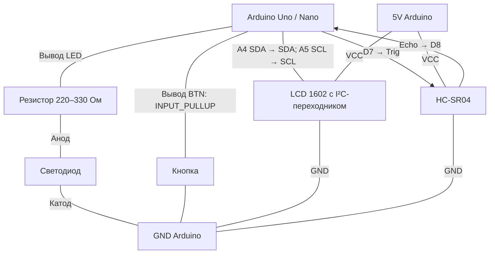

# Практическая работа №11. Разработка загрузочной и диагностической программы

**МДК.02.02 «Программирование микроконтроллеров» · 4 курс**

## Цель

Разработать диагностическую прошивку для проверки запуска платы, цифровых портов, LCD 1602 по I²C, ультразвукового датчика HC-SR04 и последовательного соединения с компьютером. Научиться выявлять ошибки по наблюдаемому поведению устройства и результатам в мониторе последовательного порта.

В этой работе загрузочная программа — скетч, который запускается после загрузки прошивки или сброса платы и выполняет первоначальную проверку. Изменять штатный загрузчик Arduino не требуется.

## Выбор варианта

**Вариант соответствует порядковому номеру студента в журнале группы.** Нажмите на номер своего варианта:

[№01](#variant-01) · [№02](#variant-02) · [№03](#variant-03) · [№04](#variant-04) · [№05](#variant-05) · [№06](#variant-06) · [№07](#variant-07) · [№08](#variant-08) · [№09](#variant-09) · [№10](#variant-10) · [№11](#variant-11) · [№12](#variant-12) · [№13](#variant-13) · [№14](#variant-14) · [№15](#variant-15) · [№16](#variant-16) · [№17](#variant-17) · [№18](#variant-18) · [№19](#variant-19) · [№20](#variant-20) · [№21](#variant-21) · [№22](#variant-22) · [№23](#variant-23) · [№24](#variant-24) · [№25](#variant-25)

## Оснащение (оборудование и программное обеспечение)

- Arduino Uno R3 или Arduino Nano с ATmega328P.
- Компьютер с Arduino IDE, установленным пакетом плат Arduino AVR Boards и USB-кабель с передачей данных.
- Макетная плата, соединительные провода, кнопка, светодиод и резистор 220–330 Ом.
- LCD 1602 с I²C-переходником на PCF8574/PCF8574A, ультразвуковой датчик HC-SR04.
- Линейка и плоская твёрдая мишень для проверки расстояния.
- Монитор последовательного порта Arduino IDE (Serial Monitor).

Для дисплея установите через менеджер библиотек Arduino IDE библиотеку **hd44780 (Bill Perry)**. Используйте класс `hd44780_I2Cexp`: он автоматически определяет адрес и подключение совместимого I²C-переходника. Встроенная библиотека `Wire` устанавливается вместе с пакетом плат; отдельная библиотека для HC-SR04 не требуется. Симулятор допускается по согласованию с преподавателем. Другую платформу можно использовать после согласования выводов и параметров последовательного соединения.

## Описание устройства и подключений

Макет диагностирует запуск программы, управление цифровым выходом, состояние цифрового входа и обмен текстовыми командами с компьютером. Светодиод служит тестируемым выходом; кнопка — тестируемым входом. LCD показывает состояние диагностики и расстояние; HC-SR04 измеряет расстояние до мишени через отдельные сигналы Trig/Echo, а не через I²C. Номера выводов и скорость соединения указаны в варианте.

| Элемент | Подключение |
| --- | --- |
| Светодиод | Вывод `LED` из варианта → резистор 220–330 Ом → анод; катод → GND. |
| Кнопка | Между выводом `BTN` из варианта и GND; в скетче используется `INPUT_PULLUP`. |
| LCD: VCC, GND | 5V, GND Arduino. |
| LCD: SDA, SCL | A4 (SDA), A5 (SCL) Arduino Uno/Nano. |
| HC-SR04: VCC, GND | 5V, GND Arduino. |
| HC-SR04: Trig | D7. |
| HC-SR04: Echo | D8. |
| USB | Плата → компьютер; через USB загружается скетч и выполняется обмен с Serial Monitor. |

### Схема подключения макета

На схеме `LED` и `BTN` — номера выводов из таблицы своего варианта. Trig и Echo во всех вариантах подключаются к D7 и D8. Узлы 5V и GND обозначают общие цепи питания Arduino и модулей.



Это схема электрических соединений: положение блоков не задаёт расположение компонентов на макетной плате. Для отчёта подпишите конкретные выводы `LED` и `BTN` своего варианта.

Все обозначения D2, D3, D9 и другие означают маркировку цифровых выводов Arduino, а не номера контактов микросхемы. Отпущенная кнопка соответствует `HIGH`, нажатая — `LOW`. Отдельные провода к D0/RX и D1/TX не подключайте: на Uno/Nano эти выводы используются для обмена через USB-UART.

Подключения меняйте при отключённом питании. Проверка выходного порта по светодиоду выполняется визуально; программа сообщает заданное состояние выхода, но не определяет, действительно ли светодиод светится.


### Подготовка LCD и проверка I²C

1. Откройте менеджер библиотек, найдите `hd44780`, выберите библиотеку автора Bill Perry и установите её.
2. Подключите только LCD, затем запустите пример **Файл → Примеры → hd44780 → ioClass → hd44780_I2Cexp → I2CexpDiag**. Сохраните результат проверки и обнаруженный адрес из Serial Monitor. Скорость для этого примера смотрите в его скетче; для задач используйте скорость своего варианта.
3. Настройте контраст подстроечным резистором на I²C-переходнике. Проверьте отображение текста примером `HelloWorld` из того же раздела.
4. В своих программах используйте объявления ниже. `lcd.begin(16, 2)` возвращает 0 при успешной инициализации; ненулевой результат обрабатывайте как ошибку. Не фиксируйте адрес `0x27` без проверки.

```cpp
#include <Wire.h>
#include <hd44780.h>
#include <hd44780ioClass/hd44780_I2Cexp.h>
hd44780_I2Cexp lcd;
```

LCD имеет 16 столбцов и 2 строки. В `setCursor(column, row)` строки имеют номера 0 и 1. Используйте латинские символы; при замене длинной строки короткой затирайте остаток пробелами до 16 символов. Не вызывайте `lcd.clear()` в каждом проходе `loop()`.

### Правила измерения HC-SR04

- Настройте Trig как `OUTPUT`, Echo как `INPUT`; исходный уровень Trig — LOW.
- Перед измерением удерживайте Trig в LOW не менее 2 мкс, затем подайте HIGH на 10 мкс и верните LOW. Для этого короткого импульса разрешён `delayMicroseconds()`.
- Измерьте длительность HIGH на Echo: `pulseIn(ECHO, HIGH, 25000UL)`. Значение возвращается в микросекундах; расстояние в сантиметрах вычисляйте как `duration / 58.0`.
- Возвращённый 0 означает отсутствие полного эха за время ожидания. Значение вне диапазона 2–400 см также считайте недостоверным. В обоих случаях выводите `NO ECHO`, не подменяя его расстоянием 0 см.
- Интервал между началами измерений задаётся вариантом и составляет не менее 100 мс. Проверяйте его через `millis()`.
- `pulseIn()` блокирует выполнение максимум на заданное время: это допустимое в этой работе исключение. Не добавляйте другие блокирующие ожидания. При таком подходе реакция на команду может задержаться примерно на время одного измерения.
- При недостоверном измерении сбрасывайте состояние `NEAR`: нельзя оставлять прошлое расстояние как новое достоверное показание.

Проверяйте датчик на плоской твёрдой мишени, расположенной перед ним. Для воспроизводимой проверки тайм-аута выключите питание, отключите провод Echo от датчика и подключите D8 к GND; затем включите питание. После проверки восстановите соединение при отключённом питании. Безопасное отсутствие LCD моделируйте его отключением перед запуском, а не во время обмена.

## Описание задания и порядок выполнения

Выполните пять задач своего варианта: **три на разработку программы и две на поиск и исправление ошибок**.

1. Проверьте выбор платы и порта в Arduino IDE, соберите макет по своему варианту.
2. Разработайте задачу 1. Для задачи 2 создайте копию этого скетча и дополните её; для задачи 3 дополните копию решения задачи 2. Сохраните три полученных скетча отдельно.
3. В задачах 4 и 5 изучите ошибочный код, сопоставьте его с требуемым поведением, исправьте и сохраните каждый скетч отдельно. Объясните причины ошибок.
4. Перед проверкой каждого скетча загрузите именно его на плату. Настройте скорость Serial Monitor по варианту; для строковых команд выберите завершение строки LF («Новая строка») либо CR+LF.
5. Проведите испытания и продемонстрируйте результаты преподавателю. Проверьте запуск после сброса, работу входа и выхода, правильные и ошибочные команды.

### Общие требования к программам

- Скорость `Serial.begin()` и настройка Serial Monitor должны совпадать.
- Результаты проверки и ответы на команды выводите **в монитор последовательного порта** через `Serial.print()` / `Serial.println()`.
- В разработанных программах и исправленных решениях не используйте `delay()` и блокирующее ожидание ввода. Исключения: формирование импульса Trig через `delayMicroseconds()` и измерение Echo через `pulseIn()` с тайм-аутом 25 мс. Время остальных процессов проверяйте через `millis()` с переменными `unsigned long` и вычитанием меток времени.
- Подавление дребезга: новое состояние кнопки принимается, только если оно остаётся неизменным не менее 30 мс. Одно удержание должно учитываться как одно нажатие.
- Строковые команды собирайте посимвольно в буфер `char` размером 32 байта: не более 31 символа команды и завершающий `\0`. Обрабатывайте команду после LF; CR игнорируйте. Пустые строки игнорируйте. При превышении длины отбрасывайте всю строку до LF и затем один раз выводите `ERR LENGTH`. Нельзя выполнять усечённую команду.
- Команды чувствительны к регистру, вводятся без пробелов в начале и конце. Неизвестная команда должна давать `ERR COMMAND` и не менять состояние устройства.
- В задачах 4–5 может быть несколько ошибок. Ошибочные фрагменты специально нарушают отдельные требования; их нельзя использовать как образец готового решения.

## Содержание отчёта

1. Титульный лист.
2. Задание по варианту: номер, параметры макета и условия всех пяти задач.
3. Схемы подключения, если требуются. Для одинаковых подключений достаточно одной схемы с указанием задач.
4. Листинги пяти программ с комментариями. Для задач 4–5 дополнительно укажите найденные ошибки, их причины и внесённые исправления.
5. Результаты работы: скриншоты Serial Monitor и таблица «задача — действие — ожидаемый результат — фактический результат». Приложите фотографии LCD с нормальным расстоянием и `NO ECHO`, результат `I2CexpDiag` и сравнение показаний с линейкой. Визуальные результаты проверки светодиода также запишите в таблицу.
6. Выводы отдельно по каждой задаче.

## Оценивание

Работа оценивается по пятибалльной системе с учётом алгоритмов, работы макета, объяснения ошибок, проверки результатов и полноты отчёта.

- **«5» (отлично)** — выполнены все пять задач; программы соответствуют условиям, ошибки найдены и объяснены, испытания и отчёт полные.
- **«4» (хорошо)** — выполнены все пять задач; есть отдельные недочёты в программах, проверке или отчёте, которые не мешают продемонстрировать основные режимы.
- **«3» (удовлетворительно)** — выполнены не менее трёх задач, включая хотя бы одну задачу на исправление ошибок; результаты показаны, но имеются существенные недочёты.
- **«2» (неудовлетворительно)** — выполнено менее трёх задач либо не удалось продемонстрировать работу программ по заданным алгоритмам.


---

<a id="variant-01"></a>

## Вариант 01

### Параметры устройства

| Параметр | Значение |
| --- | --- |
| Идентификатор платы | `DIAG-01` |
| Выход светодиода `LED` | D9 |
| Вход кнопки `BTN` | D2 |
| Скорость последовательного соединения | 9600 бод |
| Количество тестовых вспышек | 2 |
| Длительность включения и выключения при тесте | 150 мс каждое |
| Период диагностического вывода | 500 мс |
| HC-SR04 Trig / Echo | D7 / D8 |
| Интервал измерения | 100 мс |
| Порог близкого объекта | 10 см |

### Задача 1. Разработка программы первоначальной проверки

После сброса платы настройте порты и последовательное соединение. Светодиод изначально выключен. Один раз выведите в монитор последовательного порта `BOOT DIAG-01 FW=1.0`, затем выполните 2 вспышки. Каждая вспышка состоит из включения на 150 мс и выключения на 150 мс. Первое включение начинается сразу после сообщения `BOOT`. После последнего интервала выключения выведите `READY DIAG-01` один раз; светодиод оставьте выключенным. Тест не повторяется до следующего сброса.

Перед вспышками инициализируйте LCD. При успехе выведите в Serial Monitor `LCD OK`, на первой строке LCD — `DIAG-01 BOOT`, на второй — `LED TEST`. После теста первая строка — `DIAG-01 READY`, вторая — `WAIT SENSOR`. При ошибке инициализации выведите `LCD ERROR`; не обращайтесь к LCD до следующего сброса, но продолжайте тест светодиода и вывод через Serial Monitor. Наличие подсветки само по себе не подтверждает исправность дисплея.

**Проверка:** выполните два сброса платы, для каждого зафиксируйте последовательность сообщений и количество вспышек. При открытии Serial Monitor плата также может перезапускаться; отсчёт начинается с сообщения `BOOT`.

### Задача 2. Разработка диагностики входа и датчика расстояния

Дополните копию решения задачи 1. После `READY` считайте нажатия кнопки с подавлением дребезга. Начальное значение счётчика — 0. После каждого нового нажатия увеличивайте счётчик и выводите `PRESS=<число>`. Удержание не увеличивает счётчик повторно. Каждые 500 мс после `READY` выводите `BTN=RELEASED;COUNT=<число>` либо `BTN=PRESSED;COUNT=<число>` по принятому устойчивому состоянию входа. Периодический вывод не должен мешать обработке кнопки. Дополнительно каждые 100 мс измеряйте расстояние HC-SR04 по общим правилам. Первая попытка выполняется сразу после `READY`. Каждое измерение выводите в Serial Monitor: `DIST=<см>;NEAR=YES/NO` с одним десятичным знаком либо `DIST=NO ECHO;NEAR=NO`. `NEAR=YES` только при достоверном расстоянии не больше 10 см.

На первой строке LCD оставьте идентификатор и `READY`. На второй выводите `D=<см>cm` с одним десятичным знаком либо `NO ECHO`, затирая предыдущую строку пробелами. При `LCD ERROR` измерения, кнопка и Serial Monitor продолжают работать. Светодиод после стартового теста остаётся выключенным.

При переходе к `READY` примите фактическое состояние кнопки как исходное: кнопка, уже удерживаемая в этот момент, не засчитывается. Её необходимо отпустить и нажать заново.

**Проверка:** три отдельных нажатия, удержание не менее двух периодов вывода, отпускание и новое нажатие; отдельно — сброс с удерживаемой кнопкой. Для датчика сравните показания с линейкой на двух расстояниях по разные стороны порога, проверьте `NO ECHO` и восстановление измерений после восстановления соединения и сброса.

### Задача 3. Разработка командного интерфейса диагностики

Дополните копию решения задачи 2. После `READY` принимайте строки команд по общим правилам. Стартовый тест не запускается командами.

| Команда | Действие и ответ в Serial Monitor |
| --- | --- |
| `ping` | Ответ `PONG DIAG-01`; состояние устройства не меняется. |
| `led on` | Включить светодиод; ответ `OK LED=ON`. |
| `led off` | Выключить светодиод; ответ `OK LED=OFF`. |
| `status` | Ответ `ID=DIAG-01;BTN=PRESSED/RELEASED;COUNT=<число>;LED=ON/OFF;LCD=OK/ERROR;DIST=<см или NO ECHO>;NEAR=YES/NO`, подставив фактические значения последнего измерения. До первого измерения `DIST=NOT READY;NEAR=NO`. |
| `lcd test` | При исправном LCD показать `LCD TEST LINE 1` и `LCD TEST LINE 2` на 2 секунды; ответ `OK LCD TEST`. При ошибке LCD — `ERR LCD`. Повторная команда во время теста даёт `BUSY LCD`; другие команды работают. |
| `distance` | Вывести результат последнего измерения в формате задачи 2; новое внеплановое измерение не запускать. До первого измерения — `DIST=NOT READY;NEAR=NO`. |
| `clear` | Обнулить только счётчик нажатий; ответ `OK COUNT=0`. |

Команды, кнопка и измерение расстояния должны работать совместно. Во время `lcd test` обновляйте результаты измерений в памяти и Serial Monitor, но сохраняйте тестовые строки на LCD; через 2 секунды восстановите основной экран с последним результатом. Команды светодиода управляют им вручную: порог расстояния не изменяет его состояние. Периодическая диагностика из задачи 2 сохраняется. Команды разрешены после `READY`: все байты, полученные во время стартового теста, отбрасывайте; при переходе к `READY` очистите накопленные байты и буфер команды.

**Проверка:** `ping`, обе команды светодиода, `status` при отпущенной и удерживаемой кнопке, `clear`, неизвестная команда, пустая строка и строка из 32 символов. После слишком длинной строки отправьте `ping` и убедитесь, что приём восстановлен. Также проверьте `distance` при нормальном измерении и `NO ECHO`, `lcd test`, повторную `lcd test` во время теста, нажатие кнопки и `ping` во время тестового экрана. Проверьте запуск без подключённого LCD. В отчёте укажите, как эти проверки подтверждают обмен в обоих направлениях.

### Задача 4. Поиск и исправление ошибок LCD

**Требуемое поведение:** после запуска при успешной инициализации LCD вывести в Serial Monitor `LCD OK`; первая строка LCD — `DIAG-01 READY`, вторая — `DIST=123.4cm`. Через 2 секунды заменить только вторую строку на `NO ECHO` без оставшихся символов. Переход выполнить один раз через `millis()`. При ошибке LCD один раз вывести `LCD ERROR` и прекратить обращения к дисплею; скетч не должен зависать.

```cpp
#include <Wire.h>
#include <hd44780.h>
#include <hd44780ioClass/hd44780_I2Cexp.h>
hd44780_I2Cexp lcd;
bool lcdOk = false;
unsigned long started = 0;
void setup() {
  Serial.begin(9600);
  int status = lcd.begin(16, 2);
  lcdOk = (status != 0);
  if (lcdOk) {
    Serial.println("LCD OK");
    lcd.setCursor(0, 0);
    lcd.print("DIAG-01 READY");
    lcd.setCursor(0, 2);
    lcd.print("DIST=123.4cm");
  } else {
    Serial.println("LCD ERROR");
  }
  started = millis();
}
void loop() {
  if (millis() - started >= 2000) {
    lcd.setCursor(0, 1);
    lcd.print("NO ECHO");
  }
}
```

**Проверка:** нормальный запуск, однократная смена второй строки, отсутствие остатка `123.4cm`, запуск с отключённым LCD. Объясните ошибки проверки статуса, адресации строк и обновления дисплея.

### Задача 5. Поиск и исправление ошибок HC-SR04

**Требуемое поведение:** каждые 100 мс измерять расстояние, выводить `DIST=<см>;NEAR=YES/NO` с одним десятичным знаком. Порог близкого объекта — 10 см включительно; достоверный диапазон — 2–400 см. Отсутствие эха или недостоверное значение даёт `DIST=NO ECHO;NEAR=NO`. Для Echo используется `pulseIn()` с тайм-аутом 25000 мкс. Исправьте настройки выводов, импульс запуска, измерение, преобразование и периодичность. Соблюдайте общие требования.

```cpp
const byte TRIG = 7, ECHO = 8;
const unsigned long PERIOD = 100;
unsigned long last = 0;
void setup() {
  Serial.begin(9600);
  pinMode(TRIG, INPUT);
  pinMode(ECHO, OUTPUT);
}
void loop() {
  if (millis() - last >= PERIOD) {
    digitalWrite(TRIG, HIGH);
    delayMicroseconds(2);
    digitalWrite(TRIG, LOW);
    unsigned long duration = pulseIn(ECHO, LOW);
    float cm = duration / 58;
    Serial.print("DIST=");
    Serial.print(cm, 1);
    Serial.print(";NEAR=");
    Serial.println(cm < 10 ? "YES" : "NO");
  }
}
```

**Проверка:** сравнение с линейкой на двух расстояниях, переход через порог и отсутствие эха по описанной процедуре. Если точно выставить порог физически не получается, отдельно проверьте условие для расчётных значений ниже, на и выше порога и укажите это в отчёте. При `NO ECHO` прошлое расстояние не должно отображаться как новое измерение.

---

<a id="variant-02"></a>

## Вариант 02

### Параметры устройства

| Параметр | Значение |
| --- | --- |
| Идентификатор платы | `DIAG-02` |
| Выход светодиода `LED` | D10 |
| Вход кнопки `BTN` | D3 |
| Скорость последовательного соединения | 9600 бод |
| Количество тестовых вспышек | 3 |
| Длительность включения и выключения при тесте | 200 мс каждое |
| Период диагностического вывода | 750 мс |
| HC-SR04 Trig / Echo | D7 / D8 |
| Интервал измерения | 150 мс |
| Порог близкого объекта | 12 см |

### Задача 1. Разработка программы первоначальной проверки

После сброса платы настройте порты и последовательное соединение. Светодиод изначально выключен. Один раз выведите в монитор последовательного порта `BOOT DIAG-02 FW=1.0`, затем выполните 3 вспышки. Каждая вспышка состоит из включения на 200 мс и выключения на 200 мс. Первое включение начинается сразу после сообщения `BOOT`. После последнего интервала выключения выведите `READY DIAG-02` один раз; светодиод оставьте выключенным. Тест не повторяется до следующего сброса.

Перед вспышками инициализируйте LCD. При успехе выведите в Serial Monitor `LCD OK`, на первой строке LCD — `DIAG-02 BOOT`, на второй — `LED TEST`. После теста первая строка — `DIAG-02 READY`, вторая — `WAIT SENSOR`. При ошибке инициализации выведите `LCD ERROR`; не обращайтесь к LCD до следующего сброса, но продолжайте тест светодиода и вывод через Serial Monitor. Наличие подсветки само по себе не подтверждает исправность дисплея.

**Проверка:** выполните два сброса платы, для каждого зафиксируйте последовательность сообщений и количество вспышек. При открытии Serial Monitor плата также может перезапускаться; отсчёт начинается с сообщения `BOOT`.

### Задача 2. Разработка диагностики входа и датчика расстояния

Дополните копию решения задачи 1. После `READY` считайте нажатия кнопки с подавлением дребезга. Начальное значение счётчика — 0. После каждого нового нажатия увеличивайте счётчик и выводите `PRESS=<число>`. Удержание не увеличивает счётчик повторно. Каждые 750 мс после `READY` выводите `BTN=RELEASED;COUNT=<число>` либо `BTN=PRESSED;COUNT=<число>` по принятому устойчивому состоянию входа. Периодический вывод не должен мешать обработке кнопки. Дополнительно каждые 150 мс измеряйте расстояние HC-SR04 по общим правилам. Первая попытка выполняется сразу после `READY`. Каждое измерение выводите в Serial Monitor: `DIST=<см>;NEAR=YES/NO` с одним десятичным знаком либо `DIST=NO ECHO;NEAR=NO`. `NEAR=YES` только при достоверном расстоянии не больше 12 см.

На первой строке LCD оставьте идентификатор и `READY`. На второй выводите `D=<см>cm` с одним десятичным знаком либо `NO ECHO`, затирая предыдущую строку пробелами. При `LCD ERROR` измерения, кнопка и Serial Monitor продолжают работать. Светодиод после стартового теста остаётся выключенным.

При переходе к `READY` примите фактическое состояние кнопки как исходное: кнопка, уже удерживаемая в этот момент, не засчитывается. Её необходимо отпустить и нажать заново.

**Проверка:** три отдельных нажатия, удержание не менее двух периодов вывода, отпускание и новое нажатие; отдельно — сброс с удерживаемой кнопкой. Для датчика сравните показания с линейкой на двух расстояниях по разные стороны порога, проверьте `NO ECHO` и восстановление измерений после восстановления соединения и сброса.

### Задача 3. Разработка командного интерфейса диагностики

Дополните копию решения задачи 2. После `READY` принимайте строки команд по общим правилам. Стартовый тест не запускается командами.

| Команда | Действие и ответ в Serial Monitor |
| --- | --- |
| `ping` | Ответ `PONG DIAG-02`; состояние устройства не меняется. |
| `led on` | Включить светодиод; ответ `OK LED=ON`. |
| `led off` | Выключить светодиод; ответ `OK LED=OFF`. |
| `status` | Ответ `ID=DIAG-02;BTN=PRESSED/RELEASED;COUNT=<число>;LED=ON/OFF;LCD=OK/ERROR;DIST=<см или NO ECHO>;NEAR=YES/NO`, подставив фактические значения последнего измерения. До первого измерения `DIST=NOT READY;NEAR=NO`. |
| `lcd test` | При исправном LCD показать `LCD TEST LINE 1` и `LCD TEST LINE 2` на 2 секунды; ответ `OK LCD TEST`. При ошибке LCD — `ERR LCD`. Повторная команда во время теста даёт `BUSY LCD`; другие команды работают. |
| `distance` | Вывести результат последнего измерения в формате задачи 2; новое внеплановое измерение не запускать. До первого измерения — `DIST=NOT READY;NEAR=NO`. |
| `clear` | Обнулить только счётчик нажатий; ответ `OK COUNT=0`. |

Команды, кнопка и измерение расстояния должны работать совместно. Во время `lcd test` обновляйте результаты измерений в памяти и Serial Monitor, но сохраняйте тестовые строки на LCD; через 2 секунды восстановите основной экран с последним результатом. Команды светодиода управляют им вручную: порог расстояния не изменяет его состояние. Периодическая диагностика из задачи 2 сохраняется. Команды разрешены после `READY`: все байты, полученные во время стартового теста, отбрасывайте; при переходе к `READY` очистите накопленные байты и буфер команды.

**Проверка:** `ping`, обе команды светодиода, `status` при отпущенной и удерживаемой кнопке, `clear`, неизвестная команда, пустая строка и строка из 32 символов. После слишком длинной строки отправьте `ping` и убедитесь, что приём восстановлен. Также проверьте `distance` при нормальном измерении и `NO ECHO`, `lcd test`, повторную `lcd test` во время теста, нажатие кнопки и `ping` во время тестового экрана. Проверьте запуск без подключённого LCD. В отчёте укажите, как эти проверки подтверждают обмен в обоих направлениях.

### Задача 4. Поиск и исправление ошибок LCD

**Требуемое поведение:** после запуска при успешной инициализации LCD вывести в Serial Monitor `LCD OK`; первая строка LCD — `DIAG-02 READY`, вторая — `DIST=123.4cm`. Через 2 секунды заменить только вторую строку на `NO ECHO` без оставшихся символов. Переход выполнить один раз через `millis()`. При ошибке LCD один раз вывести `LCD ERROR` и прекратить обращения к дисплею; скетч не должен зависать.

```cpp
#include <Wire.h>
#include <hd44780.h>
#include <hd44780ioClass/hd44780_I2Cexp.h>
hd44780_I2Cexp lcd;
bool lcdOk = false;
unsigned long started = 0;
void setup() {
  Serial.begin(9600);
  int status = lcd.begin(16, 2);
  lcdOk = (status != 0);
  if (lcdOk) {
    Serial.println("LCD OK");
    lcd.setCursor(0, 0);
    lcd.print("DIAG-02 READY");
    lcd.setCursor(0, 2);
    lcd.print("DIST=123.4cm");
  } else {
    Serial.println("LCD ERROR");
  }
  started = millis();
}
void loop() {
  if (millis() - started >= 2000) {
    lcd.setCursor(0, 1);
    lcd.print("NO ECHO");
  }
}
```

**Проверка:** нормальный запуск, однократная смена второй строки, отсутствие остатка `123.4cm`, запуск с отключённым LCD. Объясните ошибки проверки статуса, адресации строк и обновления дисплея.

### Задача 5. Поиск и исправление ошибок HC-SR04

**Требуемое поведение:** каждые 150 мс измерять расстояние, выводить `DIST=<см>;NEAR=YES/NO` с одним десятичным знаком. Порог близкого объекта — 12 см включительно; достоверный диапазон — 2–400 см. Отсутствие эха или недостоверное значение даёт `DIST=NO ECHO;NEAR=NO`. Для Echo используется `pulseIn()` с тайм-аутом 25000 мкс. Исправьте настройки выводов, импульс запуска, измерение, преобразование и периодичность. Соблюдайте общие требования.

```cpp
const byte TRIG = 7, ECHO = 8;
const unsigned long PERIOD = 150;
unsigned long last = 0;
void setup() {
  Serial.begin(9600);
  pinMode(TRIG, INPUT);
  pinMode(ECHO, OUTPUT);
}
void loop() {
  if (millis() - last >= PERIOD) {
    digitalWrite(TRIG, HIGH);
    delayMicroseconds(2);
    digitalWrite(TRIG, LOW);
    unsigned long duration = pulseIn(ECHO, LOW);
    float cm = duration / 58;
    Serial.print("DIST=");
    Serial.print(cm, 1);
    Serial.print(";NEAR=");
    Serial.println(cm < 12 ? "YES" : "NO");
  }
}
```

**Проверка:** сравнение с линейкой на двух расстояниях, переход через порог и отсутствие эха по описанной процедуре. Если точно выставить порог физически не получается, отдельно проверьте условие для расчётных значений ниже, на и выше порога и укажите это в отчёте. При `NO ECHO` прошлое расстояние не должно отображаться как новое измерение.

---

<a id="variant-03"></a>

## Вариант 03

### Параметры устройства

| Параметр | Значение |
| --- | --- |
| Идентификатор платы | `DIAG-03` |
| Выход светодиода `LED` | D11 |
| Вход кнопки `BTN` | D2 |
| Скорость последовательного соединения | 9600 бод |
| Количество тестовых вспышек | 4 |
| Длительность включения и выключения при тесте | 250 мс каждое |
| Период диагностического вывода | 1000 мс |
| HC-SR04 Trig / Echo | D7 / D8 |
| Интервал измерения | 200 мс |
| Порог близкого объекта | 14 см |

### Задача 1. Разработка программы первоначальной проверки

После сброса платы настройте порты и последовательное соединение. Светодиод изначально выключен. Один раз выведите в монитор последовательного порта `BOOT DIAG-03 FW=1.0`, затем выполните 4 вспышки. Каждая вспышка состоит из включения на 250 мс и выключения на 250 мс. Первое включение начинается сразу после сообщения `BOOT`. После последнего интервала выключения выведите `READY DIAG-03` один раз; светодиод оставьте выключенным. Тест не повторяется до следующего сброса.

Перед вспышками инициализируйте LCD. При успехе выведите в Serial Monitor `LCD OK`, на первой строке LCD — `DIAG-03 BOOT`, на второй — `LED TEST`. После теста первая строка — `DIAG-03 READY`, вторая — `WAIT SENSOR`. При ошибке инициализации выведите `LCD ERROR`; не обращайтесь к LCD до следующего сброса, но продолжайте тест светодиода и вывод через Serial Monitor. Наличие подсветки само по себе не подтверждает исправность дисплея.

**Проверка:** выполните два сброса платы, для каждого зафиксируйте последовательность сообщений и количество вспышек. При открытии Serial Monitor плата также может перезапускаться; отсчёт начинается с сообщения `BOOT`.

### Задача 2. Разработка диагностики входа и датчика расстояния

Дополните копию решения задачи 1. После `READY` считайте нажатия кнопки с подавлением дребезга. Начальное значение счётчика — 0. После каждого нового нажатия увеличивайте счётчик и выводите `PRESS=<число>`. Удержание не увеличивает счётчик повторно. Каждые 1000 мс после `READY` выводите `BTN=RELEASED;COUNT=<число>` либо `BTN=PRESSED;COUNT=<число>` по принятому устойчивому состоянию входа. Периодический вывод не должен мешать обработке кнопки. Дополнительно каждые 200 мс измеряйте расстояние HC-SR04 по общим правилам. Первая попытка выполняется сразу после `READY`. Каждое измерение выводите в Serial Monitor: `DIST=<см>;NEAR=YES/NO` с одним десятичным знаком либо `DIST=NO ECHO;NEAR=NO`. `NEAR=YES` только при достоверном расстоянии не больше 14 см.

На первой строке LCD оставьте идентификатор и `READY`. На второй выводите `D=<см>cm` с одним десятичным знаком либо `NO ECHO`, затирая предыдущую строку пробелами. При `LCD ERROR` измерения, кнопка и Serial Monitor продолжают работать. Светодиод после стартового теста остаётся выключенным.

При переходе к `READY` примите фактическое состояние кнопки как исходное: кнопка, уже удерживаемая в этот момент, не засчитывается. Её необходимо отпустить и нажать заново.

**Проверка:** три отдельных нажатия, удержание не менее двух периодов вывода, отпускание и новое нажатие; отдельно — сброс с удерживаемой кнопкой. Для датчика сравните показания с линейкой на двух расстояниях по разные стороны порога, проверьте `NO ECHO` и восстановление измерений после восстановления соединения и сброса.

### Задача 3. Разработка командного интерфейса диагностики

Дополните копию решения задачи 2. После `READY` принимайте строки команд по общим правилам. Стартовый тест не запускается командами.

| Команда | Действие и ответ в Serial Monitor |
| --- | --- |
| `ping` | Ответ `PONG DIAG-03`; состояние устройства не меняется. |
| `led on` | Включить светодиод; ответ `OK LED=ON`. |
| `led off` | Выключить светодиод; ответ `OK LED=OFF`. |
| `status` | Ответ `ID=DIAG-03;BTN=PRESSED/RELEASED;COUNT=<число>;LED=ON/OFF;LCD=OK/ERROR;DIST=<см или NO ECHO>;NEAR=YES/NO`, подставив фактические значения последнего измерения. До первого измерения `DIST=NOT READY;NEAR=NO`. |
| `lcd test` | При исправном LCD показать `LCD TEST LINE 1` и `LCD TEST LINE 2` на 2 секунды; ответ `OK LCD TEST`. При ошибке LCD — `ERR LCD`. Повторная команда во время теста даёт `BUSY LCD`; другие команды работают. |
| `distance` | Вывести результат последнего измерения в формате задачи 2; новое внеплановое измерение не запускать. До первого измерения — `DIST=NOT READY;NEAR=NO`. |
| `clear` | Обнулить только счётчик нажатий; ответ `OK COUNT=0`. |

Команды, кнопка и измерение расстояния должны работать совместно. Во время `lcd test` обновляйте результаты измерений в памяти и Serial Monitor, но сохраняйте тестовые строки на LCD; через 2 секунды восстановите основной экран с последним результатом. Команды светодиода управляют им вручную: порог расстояния не изменяет его состояние. Периодическая диагностика из задачи 2 сохраняется. Команды разрешены после `READY`: все байты, полученные во время стартового теста, отбрасывайте; при переходе к `READY` очистите накопленные байты и буфер команды.

**Проверка:** `ping`, обе команды светодиода, `status` при отпущенной и удерживаемой кнопке, `clear`, неизвестная команда, пустая строка и строка из 32 символов. После слишком длинной строки отправьте `ping` и убедитесь, что приём восстановлен. Также проверьте `distance` при нормальном измерении и `NO ECHO`, `lcd test`, повторную `lcd test` во время теста, нажатие кнопки и `ping` во время тестового экрана. Проверьте запуск без подключённого LCD. В отчёте укажите, как эти проверки подтверждают обмен в обоих направлениях.

### Задача 4. Поиск и исправление ошибок LCD

**Требуемое поведение:** после запуска при успешной инициализации LCD вывести в Serial Monitor `LCD OK`; первая строка LCD — `DIAG-03 READY`, вторая — `DIST=123.4cm`. Через 2 секунды заменить только вторую строку на `NO ECHO` без оставшихся символов. Переход выполнить один раз через `millis()`. При ошибке LCD один раз вывести `LCD ERROR` и прекратить обращения к дисплею; скетч не должен зависать.

```cpp
#include <Wire.h>
#include <hd44780.h>
#include <hd44780ioClass/hd44780_I2Cexp.h>
hd44780_I2Cexp lcd;
bool lcdOk = false;
unsigned long started = 0;
void setup() {
  Serial.begin(9600);
  int status = lcd.begin(16, 2);
  lcdOk = (status != 0);
  if (lcdOk) {
    Serial.println("LCD OK");
    lcd.setCursor(0, 0);
    lcd.print("DIAG-03 READY");
    lcd.setCursor(0, 2);
    lcd.print("DIST=123.4cm");
  } else {
    Serial.println("LCD ERROR");
  }
  started = millis();
}
void loop() {
  if (millis() - started >= 2000) {
    lcd.setCursor(0, 1);
    lcd.print("NO ECHO");
  }
}
```

**Проверка:** нормальный запуск, однократная смена второй строки, отсутствие остатка `123.4cm`, запуск с отключённым LCD. Объясните ошибки проверки статуса, адресации строк и обновления дисплея.

### Задача 5. Поиск и исправление ошибок HC-SR04

**Требуемое поведение:** каждые 200 мс измерять расстояние, выводить `DIST=<см>;NEAR=YES/NO` с одним десятичным знаком. Порог близкого объекта — 14 см включительно; достоверный диапазон — 2–400 см. Отсутствие эха или недостоверное значение даёт `DIST=NO ECHO;NEAR=NO`. Для Echo используется `pulseIn()` с тайм-аутом 25000 мкс. Исправьте настройки выводов, импульс запуска, измерение, преобразование и периодичность. Соблюдайте общие требования.

```cpp
const byte TRIG = 7, ECHO = 8;
const unsigned long PERIOD = 200;
unsigned long last = 0;
void setup() {
  Serial.begin(9600);
  pinMode(TRIG, INPUT);
  pinMode(ECHO, OUTPUT);
}
void loop() {
  if (millis() - last >= PERIOD) {
    digitalWrite(TRIG, HIGH);
    delayMicroseconds(2);
    digitalWrite(TRIG, LOW);
    unsigned long duration = pulseIn(ECHO, LOW);
    float cm = duration / 58;
    Serial.print("DIST=");
    Serial.print(cm, 1);
    Serial.print(";NEAR=");
    Serial.println(cm < 14 ? "YES" : "NO");
  }
}
```

**Проверка:** сравнение с линейкой на двух расстояниях, переход через порог и отсутствие эха по описанной процедуре. Если точно выставить порог физически не получается, отдельно проверьте условие для расчётных значений ниже, на и выше порога и укажите это в отчёте. При `NO ECHO` прошлое расстояние не должно отображаться как новое измерение.

---

<a id="variant-04"></a>

## Вариант 04

### Параметры устройства

| Параметр | Значение |
| --- | --- |
| Идентификатор платы | `DIAG-04` |
| Выход светодиода `LED` | D6 |
| Вход кнопки `BTN` | D3 |
| Скорость последовательного соединения | 9600 бод |
| Количество тестовых вспышек | 5 |
| Длительность включения и выключения при тесте | 300 мс каждое |
| Период диагностического вывода | 1250 мс |
| HC-SR04 Trig / Echo | D7 / D8 |
| Интервал измерения | 250 мс |
| Порог близкого объекта | 16 см |

### Задача 1. Разработка программы первоначальной проверки

После сброса платы настройте порты и последовательное соединение. Светодиод изначально выключен. Один раз выведите в монитор последовательного порта `BOOT DIAG-04 FW=1.0`, затем выполните 5 вспышки. Каждая вспышка состоит из включения на 300 мс и выключения на 300 мс. Первое включение начинается сразу после сообщения `BOOT`. После последнего интервала выключения выведите `READY DIAG-04` один раз; светодиод оставьте выключенным. Тест не повторяется до следующего сброса.

Перед вспышками инициализируйте LCD. При успехе выведите в Serial Monitor `LCD OK`, на первой строке LCD — `DIAG-04 BOOT`, на второй — `LED TEST`. После теста первая строка — `DIAG-04 READY`, вторая — `WAIT SENSOR`. При ошибке инициализации выведите `LCD ERROR`; не обращайтесь к LCD до следующего сброса, но продолжайте тест светодиода и вывод через Serial Monitor. Наличие подсветки само по себе не подтверждает исправность дисплея.

**Проверка:** выполните два сброса платы, для каждого зафиксируйте последовательность сообщений и количество вспышек. При открытии Serial Monitor плата также может перезапускаться; отсчёт начинается с сообщения `BOOT`.

### Задача 2. Разработка диагностики входа и датчика расстояния

Дополните копию решения задачи 1. После `READY` считайте нажатия кнопки с подавлением дребезга. Начальное значение счётчика — 0. После каждого нового нажатия увеличивайте счётчик и выводите `PRESS=<число>`. Удержание не увеличивает счётчик повторно. Каждые 1250 мс после `READY` выводите `BTN=RELEASED;COUNT=<число>` либо `BTN=PRESSED;COUNT=<число>` по принятому устойчивому состоянию входа. Периодический вывод не должен мешать обработке кнопки. Дополнительно каждые 250 мс измеряйте расстояние HC-SR04 по общим правилам. Первая попытка выполняется сразу после `READY`. Каждое измерение выводите в Serial Monitor: `DIST=<см>;NEAR=YES/NO` с одним десятичным знаком либо `DIST=NO ECHO;NEAR=NO`. `NEAR=YES` только при достоверном расстоянии не больше 16 см.

На первой строке LCD оставьте идентификатор и `READY`. На второй выводите `D=<см>cm` с одним десятичным знаком либо `NO ECHO`, затирая предыдущую строку пробелами. При `LCD ERROR` измерения, кнопка и Serial Monitor продолжают работать. Светодиод после стартового теста остаётся выключенным.

При переходе к `READY` примите фактическое состояние кнопки как исходное: кнопка, уже удерживаемая в этот момент, не засчитывается. Её необходимо отпустить и нажать заново.

**Проверка:** три отдельных нажатия, удержание не менее двух периодов вывода, отпускание и новое нажатие; отдельно — сброс с удерживаемой кнопкой. Для датчика сравните показания с линейкой на двух расстояниях по разные стороны порога, проверьте `NO ECHO` и восстановление измерений после восстановления соединения и сброса.

### Задача 3. Разработка командного интерфейса диагностики

Дополните копию решения задачи 2. После `READY` принимайте строки команд по общим правилам. Стартовый тест не запускается командами.

| Команда | Действие и ответ в Serial Monitor |
| --- | --- |
| `ping` | Ответ `PONG DIAG-04`; состояние устройства не меняется. |
| `led on` | Включить светодиод; ответ `OK LED=ON`. |
| `led off` | Выключить светодиод; ответ `OK LED=OFF`. |
| `status` | Ответ `ID=DIAG-04;BTN=PRESSED/RELEASED;COUNT=<число>;LED=ON/OFF;LCD=OK/ERROR;DIST=<см или NO ECHO>;NEAR=YES/NO`, подставив фактические значения последнего измерения. До первого измерения `DIST=NOT READY;NEAR=NO`. |
| `lcd test` | При исправном LCD показать `LCD TEST LINE 1` и `LCD TEST LINE 2` на 2 секунды; ответ `OK LCD TEST`. При ошибке LCD — `ERR LCD`. Повторная команда во время теста даёт `BUSY LCD`; другие команды работают. |
| `distance` | Вывести результат последнего измерения в формате задачи 2; новое внеплановое измерение не запускать. До первого измерения — `DIST=NOT READY;NEAR=NO`. |
| `clear` | Обнулить только счётчик нажатий; ответ `OK COUNT=0`. |

Команды, кнопка и измерение расстояния должны работать совместно. Во время `lcd test` обновляйте результаты измерений в памяти и Serial Monitor, но сохраняйте тестовые строки на LCD; через 2 секунды восстановите основной экран с последним результатом. Команды светодиода управляют им вручную: порог расстояния не изменяет его состояние. Периодическая диагностика из задачи 2 сохраняется. Команды разрешены после `READY`: все байты, полученные во время стартового теста, отбрасывайте; при переходе к `READY` очистите накопленные байты и буфер команды.

**Проверка:** `ping`, обе команды светодиода, `status` при отпущенной и удерживаемой кнопке, `clear`, неизвестная команда, пустая строка и строка из 32 символов. После слишком длинной строки отправьте `ping` и убедитесь, что приём восстановлен. Также проверьте `distance` при нормальном измерении и `NO ECHO`, `lcd test`, повторную `lcd test` во время теста, нажатие кнопки и `ping` во время тестового экрана. Проверьте запуск без подключённого LCD. В отчёте укажите, как эти проверки подтверждают обмен в обоих направлениях.

### Задача 4. Поиск и исправление ошибок LCD

**Требуемое поведение:** после запуска при успешной инициализации LCD вывести в Serial Monitor `LCD OK`; первая строка LCD — `DIAG-04 READY`, вторая — `DIST=123.4cm`. Через 2 секунды заменить только вторую строку на `NO ECHO` без оставшихся символов. Переход выполнить один раз через `millis()`. При ошибке LCD один раз вывести `LCD ERROR` и прекратить обращения к дисплею; скетч не должен зависать.

```cpp
#include <Wire.h>
#include <hd44780.h>
#include <hd44780ioClass/hd44780_I2Cexp.h>
hd44780_I2Cexp lcd;
bool lcdOk = false;
unsigned long started = 0;
void setup() {
  Serial.begin(9600);
  int status = lcd.begin(16, 2);
  lcdOk = (status != 0);
  if (lcdOk) {
    Serial.println("LCD OK");
    lcd.setCursor(0, 0);
    lcd.print("DIAG-04 READY");
    lcd.setCursor(0, 2);
    lcd.print("DIST=123.4cm");
  } else {
    Serial.println("LCD ERROR");
  }
  started = millis();
}
void loop() {
  if (millis() - started >= 2000) {
    lcd.setCursor(0, 1);
    lcd.print("NO ECHO");
  }
}
```

**Проверка:** нормальный запуск, однократная смена второй строки, отсутствие остатка `123.4cm`, запуск с отключённым LCD. Объясните ошибки проверки статуса, адресации строк и обновления дисплея.

### Задача 5. Поиск и исправление ошибок HC-SR04

**Требуемое поведение:** каждые 250 мс измерять расстояние, выводить `DIST=<см>;NEAR=YES/NO` с одним десятичным знаком. Порог близкого объекта — 16 см включительно; достоверный диапазон — 2–400 см. Отсутствие эха или недостоверное значение даёт `DIST=NO ECHO;NEAR=NO`. Для Echo используется `pulseIn()` с тайм-аутом 25000 мкс. Исправьте настройки выводов, импульс запуска, измерение, преобразование и периодичность. Соблюдайте общие требования.

```cpp
const byte TRIG = 7, ECHO = 8;
const unsigned long PERIOD = 250;
unsigned long last = 0;
void setup() {
  Serial.begin(9600);
  pinMode(TRIG, INPUT);
  pinMode(ECHO, OUTPUT);
}
void loop() {
  if (millis() - last >= PERIOD) {
    digitalWrite(TRIG, HIGH);
    delayMicroseconds(2);
    digitalWrite(TRIG, LOW);
    unsigned long duration = pulseIn(ECHO, LOW);
    float cm = duration / 58;
    Serial.print("DIST=");
    Serial.print(cm, 1);
    Serial.print(";NEAR=");
    Serial.println(cm < 16 ? "YES" : "NO");
  }
}
```

**Проверка:** сравнение с линейкой на двух расстояниях, переход через порог и отсутствие эха по описанной процедуре. Если точно выставить порог физически не получается, отдельно проверьте условие для расчётных значений ниже, на и выше порога и укажите это в отчёте. При `NO ECHO` прошлое расстояние не должно отображаться как новое измерение.

---

<a id="variant-05"></a>

## Вариант 05

### Параметры устройства

| Параметр | Значение |
| --- | --- |
| Идентификатор платы | `DIAG-05` |
| Выход светодиода `LED` | D5 |
| Вход кнопки `BTN` | D2 |
| Скорость последовательного соединения | 9600 бод |
| Количество тестовых вспышек | 2 |
| Длительность включения и выключения при тесте | 350 мс каждое |
| Период диагностического вывода | 500 мс |
| HC-SR04 Trig / Echo | D7 / D8 |
| Интервал измерения | 300 мс |
| Порог близкого объекта | 18 см |

### Задача 1. Разработка программы первоначальной проверки

После сброса платы настройте порты и последовательное соединение. Светодиод изначально выключен. Один раз выведите в монитор последовательного порта `BOOT DIAG-05 FW=1.0`, затем выполните 2 вспышки. Каждая вспышка состоит из включения на 350 мс и выключения на 350 мс. Первое включение начинается сразу после сообщения `BOOT`. После последнего интервала выключения выведите `READY DIAG-05` один раз; светодиод оставьте выключенным. Тест не повторяется до следующего сброса.

Перед вспышками инициализируйте LCD. При успехе выведите в Serial Monitor `LCD OK`, на первой строке LCD — `DIAG-05 BOOT`, на второй — `LED TEST`. После теста первая строка — `DIAG-05 READY`, вторая — `WAIT SENSOR`. При ошибке инициализации выведите `LCD ERROR`; не обращайтесь к LCD до следующего сброса, но продолжайте тест светодиода и вывод через Serial Monitor. Наличие подсветки само по себе не подтверждает исправность дисплея.

**Проверка:** выполните два сброса платы, для каждого зафиксируйте последовательность сообщений и количество вспышек. При открытии Serial Monitor плата также может перезапускаться; отсчёт начинается с сообщения `BOOT`.

### Задача 2. Разработка диагностики входа и датчика расстояния

Дополните копию решения задачи 1. После `READY` считайте нажатия кнопки с подавлением дребезга. Начальное значение счётчика — 0. После каждого нового нажатия увеличивайте счётчик и выводите `PRESS=<число>`. Удержание не увеличивает счётчик повторно. Каждые 500 мс после `READY` выводите `BTN=RELEASED;COUNT=<число>` либо `BTN=PRESSED;COUNT=<число>` по принятому устойчивому состоянию входа. Периодический вывод не должен мешать обработке кнопки. Дополнительно каждые 300 мс измеряйте расстояние HC-SR04 по общим правилам. Первая попытка выполняется сразу после `READY`. Каждое измерение выводите в Serial Monitor: `DIST=<см>;NEAR=YES/NO` с одним десятичным знаком либо `DIST=NO ECHO;NEAR=NO`. `NEAR=YES` только при достоверном расстоянии не больше 18 см.

На первой строке LCD оставьте идентификатор и `READY`. На второй выводите `D=<см>cm` с одним десятичным знаком либо `NO ECHO`, затирая предыдущую строку пробелами. При `LCD ERROR` измерения, кнопка и Serial Monitor продолжают работать. Светодиод после стартового теста остаётся выключенным.

При переходе к `READY` примите фактическое состояние кнопки как исходное: кнопка, уже удерживаемая в этот момент, не засчитывается. Её необходимо отпустить и нажать заново.

**Проверка:** три отдельных нажатия, удержание не менее двух периодов вывода, отпускание и новое нажатие; отдельно — сброс с удерживаемой кнопкой. Для датчика сравните показания с линейкой на двух расстояниях по разные стороны порога, проверьте `NO ECHO` и восстановление измерений после восстановления соединения и сброса.

### Задача 3. Разработка командного интерфейса диагностики

Дополните копию решения задачи 2. После `READY` принимайте строки команд по общим правилам. Стартовый тест не запускается командами.

| Команда | Действие и ответ в Serial Monitor |
| --- | --- |
| `ping` | Ответ `PONG DIAG-05`; состояние устройства не меняется. |
| `led on` | Включить светодиод; ответ `OK LED=ON`. |
| `led off` | Выключить светодиод; ответ `OK LED=OFF`. |
| `status` | Ответ `ID=DIAG-05;BTN=PRESSED/RELEASED;COUNT=<число>;LED=ON/OFF;LCD=OK/ERROR;DIST=<см или NO ECHO>;NEAR=YES/NO`, подставив фактические значения последнего измерения. До первого измерения `DIST=NOT READY;NEAR=NO`. |
| `lcd test` | При исправном LCD показать `LCD TEST LINE 1` и `LCD TEST LINE 2` на 2 секунды; ответ `OK LCD TEST`. При ошибке LCD — `ERR LCD`. Повторная команда во время теста даёт `BUSY LCD`; другие команды работают. |
| `distance` | Вывести результат последнего измерения в формате задачи 2; новое внеплановое измерение не запускать. До первого измерения — `DIST=NOT READY;NEAR=NO`. |
| `clear` | Обнулить только счётчик нажатий; ответ `OK COUNT=0`. |

Команды, кнопка и измерение расстояния должны работать совместно. Во время `lcd test` обновляйте результаты измерений в памяти и Serial Monitor, но сохраняйте тестовые строки на LCD; через 2 секунды восстановите основной экран с последним результатом. Команды светодиода управляют им вручную: порог расстояния не изменяет его состояние. Периодическая диагностика из задачи 2 сохраняется. Команды разрешены после `READY`: все байты, полученные во время стартового теста, отбрасывайте; при переходе к `READY` очистите накопленные байты и буфер команды.

**Проверка:** `ping`, обе команды светодиода, `status` при отпущенной и удерживаемой кнопке, `clear`, неизвестная команда, пустая строка и строка из 32 символов. После слишком длинной строки отправьте `ping` и убедитесь, что приём восстановлен. Также проверьте `distance` при нормальном измерении и `NO ECHO`, `lcd test`, повторную `lcd test` во время теста, нажатие кнопки и `ping` во время тестового экрана. Проверьте запуск без подключённого LCD. В отчёте укажите, как эти проверки подтверждают обмен в обоих направлениях.

### Задача 4. Поиск и исправление ошибок LCD

**Требуемое поведение:** после запуска при успешной инициализации LCD вывести в Serial Monitor `LCD OK`; первая строка LCD — `DIAG-05 READY`, вторая — `DIST=123.4cm`. Через 2 секунды заменить только вторую строку на `NO ECHO` без оставшихся символов. Переход выполнить один раз через `millis()`. При ошибке LCD один раз вывести `LCD ERROR` и прекратить обращения к дисплею; скетч не должен зависать.

```cpp
#include <Wire.h>
#include <hd44780.h>
#include <hd44780ioClass/hd44780_I2Cexp.h>
hd44780_I2Cexp lcd;
bool lcdOk = false;
unsigned long started = 0;
void setup() {
  Serial.begin(9600);
  int status = lcd.begin(16, 2);
  lcdOk = (status != 0);
  if (lcdOk) {
    Serial.println("LCD OK");
    lcd.setCursor(0, 0);
    lcd.print("DIAG-05 READY");
    lcd.setCursor(0, 2);
    lcd.print("DIST=123.4cm");
  } else {
    Serial.println("LCD ERROR");
  }
  started = millis();
}
void loop() {
  if (millis() - started >= 2000) {
    lcd.setCursor(0, 1);
    lcd.print("NO ECHO");
  }
}
```

**Проверка:** нормальный запуск, однократная смена второй строки, отсутствие остатка `123.4cm`, запуск с отключённым LCD. Объясните ошибки проверки статуса, адресации строк и обновления дисплея.

### Задача 5. Поиск и исправление ошибок HC-SR04

**Требуемое поведение:** каждые 300 мс измерять расстояние, выводить `DIST=<см>;NEAR=YES/NO` с одним десятичным знаком. Порог близкого объекта — 18 см включительно; достоверный диапазон — 2–400 см. Отсутствие эха или недостоверное значение даёт `DIST=NO ECHO;NEAR=NO`. Для Echo используется `pulseIn()` с тайм-аутом 25000 мкс. Исправьте настройки выводов, импульс запуска, измерение, преобразование и периодичность. Соблюдайте общие требования.

```cpp
const byte TRIG = 7, ECHO = 8;
const unsigned long PERIOD = 300;
unsigned long last = 0;
void setup() {
  Serial.begin(9600);
  pinMode(TRIG, INPUT);
  pinMode(ECHO, OUTPUT);
}
void loop() {
  if (millis() - last >= PERIOD) {
    digitalWrite(TRIG, HIGH);
    delayMicroseconds(2);
    digitalWrite(TRIG, LOW);
    unsigned long duration = pulseIn(ECHO, LOW);
    float cm = duration / 58;
    Serial.print("DIST=");
    Serial.print(cm, 1);
    Serial.print(";NEAR=");
    Serial.println(cm < 18 ? "YES" : "NO");
  }
}
```

**Проверка:** сравнение с линейкой на двух расстояниях, переход через порог и отсутствие эха по описанной процедуре. Если точно выставить порог физически не получается, отдельно проверьте условие для расчётных значений ниже, на и выше порога и укажите это в отчёте. При `NO ECHO` прошлое расстояние не должно отображаться как новое измерение.

---

<a id="variant-06"></a>

## Вариант 06

### Параметры устройства

| Параметр | Значение |
| --- | --- |
| Идентификатор платы | `DIAG-06` |
| Выход светодиода `LED` | D9 |
| Вход кнопки `BTN` | D3 |
| Скорость последовательного соединения | 19200 бод |
| Количество тестовых вспышек | 3 |
| Длительность включения и выключения при тесте | 150 мс каждое |
| Период диагностического вывода | 750 мс |
| HC-SR04 Trig / Echo | D7 / D8 |
| Интервал измерения | 100 мс |
| Порог близкого объекта | 20 см |

### Задача 1. Разработка программы первоначальной проверки

После сброса платы настройте порты и последовательное соединение. Светодиод изначально выключен. Один раз выведите в монитор последовательного порта `BOOT DIAG-06 FW=1.0`, затем выполните 3 вспышки. Каждая вспышка состоит из включения на 150 мс и выключения на 150 мс. Первое включение начинается сразу после сообщения `BOOT`. После последнего интервала выключения выведите `READY DIAG-06` один раз; светодиод оставьте выключенным. Тест не повторяется до следующего сброса.

Перед вспышками инициализируйте LCD. При успехе выведите в Serial Monitor `LCD OK`, на первой строке LCD — `DIAG-06 BOOT`, на второй — `LED TEST`. После теста первая строка — `DIAG-06 READY`, вторая — `WAIT SENSOR`. При ошибке инициализации выведите `LCD ERROR`; не обращайтесь к LCD до следующего сброса, но продолжайте тест светодиода и вывод через Serial Monitor. Наличие подсветки само по себе не подтверждает исправность дисплея.

**Проверка:** выполните два сброса платы, для каждого зафиксируйте последовательность сообщений и количество вспышек. При открытии Serial Monitor плата также может перезапускаться; отсчёт начинается с сообщения `BOOT`.

### Задача 2. Разработка диагностики входа и датчика расстояния

Дополните копию решения задачи 1. После `READY` считайте нажатия кнопки с подавлением дребезга. Начальное значение счётчика — 0. После каждого нового нажатия увеличивайте счётчик и выводите `PRESS=<число>`. Удержание не увеличивает счётчик повторно. Каждые 750 мс после `READY` выводите `BTN=RELEASED;COUNT=<число>` либо `BTN=PRESSED;COUNT=<число>` по принятому устойчивому состоянию входа. Периодический вывод не должен мешать обработке кнопки. Дополнительно каждые 100 мс измеряйте расстояние HC-SR04 по общим правилам. Первая попытка выполняется сразу после `READY`. Каждое измерение выводите в Serial Monitor: `DIST=<см>;NEAR=YES/NO` с одним десятичным знаком либо `DIST=NO ECHO;NEAR=NO`. `NEAR=YES` только при достоверном расстоянии не больше 20 см.

На первой строке LCD оставьте идентификатор и `READY`. На второй выводите `D=<см>cm` с одним десятичным знаком либо `NO ECHO`, затирая предыдущую строку пробелами. При `LCD ERROR` измерения, кнопка и Serial Monitor продолжают работать. Светодиод после стартового теста остаётся выключенным.

При переходе к `READY` примите фактическое состояние кнопки как исходное: кнопка, уже удерживаемая в этот момент, не засчитывается. Её необходимо отпустить и нажать заново.

**Проверка:** три отдельных нажатия, удержание не менее двух периодов вывода, отпускание и новое нажатие; отдельно — сброс с удерживаемой кнопкой. Для датчика сравните показания с линейкой на двух расстояниях по разные стороны порога, проверьте `NO ECHO` и восстановление измерений после восстановления соединения и сброса.

### Задача 3. Разработка командного интерфейса диагностики

Дополните копию решения задачи 2. После `READY` принимайте строки команд по общим правилам. Стартовый тест не запускается командами.

| Команда | Действие и ответ в Serial Monitor |
| --- | --- |
| `ping` | Ответ `PONG DIAG-06`; состояние устройства не меняется. |
| `led on` | Включить светодиод; ответ `OK LED=ON`. |
| `led off` | Выключить светодиод; ответ `OK LED=OFF`. |
| `status` | Ответ `ID=DIAG-06;BTN=PRESSED/RELEASED;COUNT=<число>;LED=ON/OFF;LCD=OK/ERROR;DIST=<см или NO ECHO>;NEAR=YES/NO`, подставив фактические значения последнего измерения. До первого измерения `DIST=NOT READY;NEAR=NO`. |
| `lcd test` | При исправном LCD показать `LCD TEST LINE 1` и `LCD TEST LINE 2` на 2 секунды; ответ `OK LCD TEST`. При ошибке LCD — `ERR LCD`. Повторная команда во время теста даёт `BUSY LCD`; другие команды работают. |
| `distance` | Вывести результат последнего измерения в формате задачи 2; новое внеплановое измерение не запускать. До первого измерения — `DIST=NOT READY;NEAR=NO`. |
| `clear` | Обнулить только счётчик нажатий; ответ `OK COUNT=0`. |

Команды, кнопка и измерение расстояния должны работать совместно. Во время `lcd test` обновляйте результаты измерений в памяти и Serial Monitor, но сохраняйте тестовые строки на LCD; через 2 секунды восстановите основной экран с последним результатом. Команды светодиода управляют им вручную: порог расстояния не изменяет его состояние. Периодическая диагностика из задачи 2 сохраняется. Команды разрешены после `READY`: все байты, полученные во время стартового теста, отбрасывайте; при переходе к `READY` очистите накопленные байты и буфер команды.

**Проверка:** `ping`, обе команды светодиода, `status` при отпущенной и удерживаемой кнопке, `clear`, неизвестная команда, пустая строка и строка из 32 символов. После слишком длинной строки отправьте `ping` и убедитесь, что приём восстановлен. Также проверьте `distance` при нормальном измерении и `NO ECHO`, `lcd test`, повторную `lcd test` во время теста, нажатие кнопки и `ping` во время тестового экрана. Проверьте запуск без подключённого LCD. В отчёте укажите, как эти проверки подтверждают обмен в обоих направлениях.

### Задача 4. Поиск и исправление ошибок LCD

**Требуемое поведение:** после запуска при успешной инициализации LCD вывести в Serial Monitor `LCD OK`; первая строка LCD — `DIAG-06 READY`, вторая — `DIST=123.4cm`. Через 2 секунды заменить только вторую строку на `NO ECHO` без оставшихся символов. Переход выполнить один раз через `millis()`. При ошибке LCD один раз вывести `LCD ERROR` и прекратить обращения к дисплею; скетч не должен зависать.

```cpp
#include <Wire.h>
#include <hd44780.h>
#include <hd44780ioClass/hd44780_I2Cexp.h>
hd44780_I2Cexp lcd;
bool lcdOk = false;
unsigned long started = 0;
void setup() {
  Serial.begin(19200);
  int status = lcd.begin(16, 2);
  lcdOk = (status != 0);
  if (lcdOk) {
    Serial.println("LCD OK");
    lcd.setCursor(0, 0);
    lcd.print("DIAG-06 READY");
    lcd.setCursor(0, 2);
    lcd.print("DIST=123.4cm");
  } else {
    Serial.println("LCD ERROR");
  }
  started = millis();
}
void loop() {
  if (millis() - started >= 2000) {
    lcd.setCursor(0, 1);
    lcd.print("NO ECHO");
  }
}
```

**Проверка:** нормальный запуск, однократная смена второй строки, отсутствие остатка `123.4cm`, запуск с отключённым LCD. Объясните ошибки проверки статуса, адресации строк и обновления дисплея.

### Задача 5. Поиск и исправление ошибок HC-SR04

**Требуемое поведение:** каждые 100 мс измерять расстояние, выводить `DIST=<см>;NEAR=YES/NO` с одним десятичным знаком. Порог близкого объекта — 20 см включительно; достоверный диапазон — 2–400 см. Отсутствие эха или недостоверное значение даёт `DIST=NO ECHO;NEAR=NO`. Для Echo используется `pulseIn()` с тайм-аутом 25000 мкс. Исправьте настройки выводов, импульс запуска, измерение, преобразование и периодичность. Соблюдайте общие требования.

```cpp
const byte TRIG = 7, ECHO = 8;
const unsigned long PERIOD = 100;
unsigned long last = 0;
void setup() {
  Serial.begin(19200);
  pinMode(TRIG, INPUT);
  pinMode(ECHO, OUTPUT);
}
void loop() {
  if (millis() - last >= PERIOD) {
    digitalWrite(TRIG, HIGH);
    delayMicroseconds(2);
    digitalWrite(TRIG, LOW);
    unsigned long duration = pulseIn(ECHO, LOW);
    float cm = duration / 58;
    Serial.print("DIST=");
    Serial.print(cm, 1);
    Serial.print(";NEAR=");
    Serial.println(cm < 20 ? "YES" : "NO");
  }
}
```

**Проверка:** сравнение с линейкой на двух расстояниях, переход через порог и отсутствие эха по описанной процедуре. Если точно выставить порог физически не получается, отдельно проверьте условие для расчётных значений ниже, на и выше порога и укажите это в отчёте. При `NO ECHO` прошлое расстояние не должно отображаться как новое измерение.

---

<a id="variant-07"></a>

## Вариант 07

### Параметры устройства

| Параметр | Значение |
| --- | --- |
| Идентификатор платы | `DIAG-07` |
| Выход светодиода `LED` | D10 |
| Вход кнопки `BTN` | D2 |
| Скорость последовательного соединения | 19200 бод |
| Количество тестовых вспышек | 4 |
| Длительность включения и выключения при тесте | 200 мс каждое |
| Период диагностического вывода | 1000 мс |
| HC-SR04 Trig / Echo | D7 / D8 |
| Интервал измерения | 150 мс |
| Порог близкого объекта | 22 см |

### Задача 1. Разработка программы первоначальной проверки

После сброса платы настройте порты и последовательное соединение. Светодиод изначально выключен. Один раз выведите в монитор последовательного порта `BOOT DIAG-07 FW=1.0`, затем выполните 4 вспышки. Каждая вспышка состоит из включения на 200 мс и выключения на 200 мс. Первое включение начинается сразу после сообщения `BOOT`. После последнего интервала выключения выведите `READY DIAG-07` один раз; светодиод оставьте выключенным. Тест не повторяется до следующего сброса.

Перед вспышками инициализируйте LCD. При успехе выведите в Serial Monitor `LCD OK`, на первой строке LCD — `DIAG-07 BOOT`, на второй — `LED TEST`. После теста первая строка — `DIAG-07 READY`, вторая — `WAIT SENSOR`. При ошибке инициализации выведите `LCD ERROR`; не обращайтесь к LCD до следующего сброса, но продолжайте тест светодиода и вывод через Serial Monitor. Наличие подсветки само по себе не подтверждает исправность дисплея.

**Проверка:** выполните два сброса платы, для каждого зафиксируйте последовательность сообщений и количество вспышек. При открытии Serial Monitor плата также может перезапускаться; отсчёт начинается с сообщения `BOOT`.

### Задача 2. Разработка диагностики входа и датчика расстояния

Дополните копию решения задачи 1. После `READY` считайте нажатия кнопки с подавлением дребезга. Начальное значение счётчика — 0. После каждого нового нажатия увеличивайте счётчик и выводите `PRESS=<число>`. Удержание не увеличивает счётчик повторно. Каждые 1000 мс после `READY` выводите `BTN=RELEASED;COUNT=<число>` либо `BTN=PRESSED;COUNT=<число>` по принятому устойчивому состоянию входа. Периодический вывод не должен мешать обработке кнопки. Дополнительно каждые 150 мс измеряйте расстояние HC-SR04 по общим правилам. Первая попытка выполняется сразу после `READY`. Каждое измерение выводите в Serial Monitor: `DIST=<см>;NEAR=YES/NO` с одним десятичным знаком либо `DIST=NO ECHO;NEAR=NO`. `NEAR=YES` только при достоверном расстоянии не больше 22 см.

На первой строке LCD оставьте идентификатор и `READY`. На второй выводите `D=<см>cm` с одним десятичным знаком либо `NO ECHO`, затирая предыдущую строку пробелами. При `LCD ERROR` измерения, кнопка и Serial Monitor продолжают работать. Светодиод после стартового теста остаётся выключенным.

При переходе к `READY` примите фактическое состояние кнопки как исходное: кнопка, уже удерживаемая в этот момент, не засчитывается. Её необходимо отпустить и нажать заново.

**Проверка:** три отдельных нажатия, удержание не менее двух периодов вывода, отпускание и новое нажатие; отдельно — сброс с удерживаемой кнопкой. Для датчика сравните показания с линейкой на двух расстояниях по разные стороны порога, проверьте `NO ECHO` и восстановление измерений после восстановления соединения и сброса.

### Задача 3. Разработка командного интерфейса диагностики

Дополните копию решения задачи 2. После `READY` принимайте строки команд по общим правилам. Стартовый тест не запускается командами.

| Команда | Действие и ответ в Serial Monitor |
| --- | --- |
| `ping` | Ответ `PONG DIAG-07`; состояние устройства не меняется. |
| `led on` | Включить светодиод; ответ `OK LED=ON`. |
| `led off` | Выключить светодиод; ответ `OK LED=OFF`. |
| `status` | Ответ `ID=DIAG-07;BTN=PRESSED/RELEASED;COUNT=<число>;LED=ON/OFF;LCD=OK/ERROR;DIST=<см или NO ECHO>;NEAR=YES/NO`, подставив фактические значения последнего измерения. До первого измерения `DIST=NOT READY;NEAR=NO`. |
| `lcd test` | При исправном LCD показать `LCD TEST LINE 1` и `LCD TEST LINE 2` на 2 секунды; ответ `OK LCD TEST`. При ошибке LCD — `ERR LCD`. Повторная команда во время теста даёт `BUSY LCD`; другие команды работают. |
| `distance` | Вывести результат последнего измерения в формате задачи 2; новое внеплановое измерение не запускать. До первого измерения — `DIST=NOT READY;NEAR=NO`. |
| `clear` | Обнулить только счётчик нажатий; ответ `OK COUNT=0`. |

Команды, кнопка и измерение расстояния должны работать совместно. Во время `lcd test` обновляйте результаты измерений в памяти и Serial Monitor, но сохраняйте тестовые строки на LCD; через 2 секунды восстановите основной экран с последним результатом. Команды светодиода управляют им вручную: порог расстояния не изменяет его состояние. Периодическая диагностика из задачи 2 сохраняется. Команды разрешены после `READY`: все байты, полученные во время стартового теста, отбрасывайте; при переходе к `READY` очистите накопленные байты и буфер команды.

**Проверка:** `ping`, обе команды светодиода, `status` при отпущенной и удерживаемой кнопке, `clear`, неизвестная команда, пустая строка и строка из 32 символов. После слишком длинной строки отправьте `ping` и убедитесь, что приём восстановлен. Также проверьте `distance` при нормальном измерении и `NO ECHO`, `lcd test`, повторную `lcd test` во время теста, нажатие кнопки и `ping` во время тестового экрана. Проверьте запуск без подключённого LCD. В отчёте укажите, как эти проверки подтверждают обмен в обоих направлениях.

### Задача 4. Поиск и исправление ошибок LCD

**Требуемое поведение:** после запуска при успешной инициализации LCD вывести в Serial Monitor `LCD OK`; первая строка LCD — `DIAG-07 READY`, вторая — `DIST=123.4cm`. Через 2 секунды заменить только вторую строку на `NO ECHO` без оставшихся символов. Переход выполнить один раз через `millis()`. При ошибке LCD один раз вывести `LCD ERROR` и прекратить обращения к дисплею; скетч не должен зависать.

```cpp
#include <Wire.h>
#include <hd44780.h>
#include <hd44780ioClass/hd44780_I2Cexp.h>
hd44780_I2Cexp lcd;
bool lcdOk = false;
unsigned long started = 0;
void setup() {
  Serial.begin(19200);
  int status = lcd.begin(16, 2);
  lcdOk = (status != 0);
  if (lcdOk) {
    Serial.println("LCD OK");
    lcd.setCursor(0, 0);
    lcd.print("DIAG-07 READY");
    lcd.setCursor(0, 2);
    lcd.print("DIST=123.4cm");
  } else {
    Serial.println("LCD ERROR");
  }
  started = millis();
}
void loop() {
  if (millis() - started >= 2000) {
    lcd.setCursor(0, 1);
    lcd.print("NO ECHO");
  }
}
```

**Проверка:** нормальный запуск, однократная смена второй строки, отсутствие остатка `123.4cm`, запуск с отключённым LCD. Объясните ошибки проверки статуса, адресации строк и обновления дисплея.

### Задача 5. Поиск и исправление ошибок HC-SR04

**Требуемое поведение:** каждые 150 мс измерять расстояние, выводить `DIST=<см>;NEAR=YES/NO` с одним десятичным знаком. Порог близкого объекта — 22 см включительно; достоверный диапазон — 2–400 см. Отсутствие эха или недостоверное значение даёт `DIST=NO ECHO;NEAR=NO`. Для Echo используется `pulseIn()` с тайм-аутом 25000 мкс. Исправьте настройки выводов, импульс запуска, измерение, преобразование и периодичность. Соблюдайте общие требования.

```cpp
const byte TRIG = 7, ECHO = 8;
const unsigned long PERIOD = 150;
unsigned long last = 0;
void setup() {
  Serial.begin(19200);
  pinMode(TRIG, INPUT);
  pinMode(ECHO, OUTPUT);
}
void loop() {
  if (millis() - last >= PERIOD) {
    digitalWrite(TRIG, HIGH);
    delayMicroseconds(2);
    digitalWrite(TRIG, LOW);
    unsigned long duration = pulseIn(ECHO, LOW);
    float cm = duration / 58;
    Serial.print("DIST=");
    Serial.print(cm, 1);
    Serial.print(";NEAR=");
    Serial.println(cm < 22 ? "YES" : "NO");
  }
}
```

**Проверка:** сравнение с линейкой на двух расстояниях, переход через порог и отсутствие эха по описанной процедуре. Если точно выставить порог физически не получается, отдельно проверьте условие для расчётных значений ниже, на и выше порога и укажите это в отчёте. При `NO ECHO` прошлое расстояние не должно отображаться как новое измерение.

---

<a id="variant-08"></a>

## Вариант 08

### Параметры устройства

| Параметр | Значение |
| --- | --- |
| Идентификатор платы | `DIAG-08` |
| Выход светодиода `LED` | D11 |
| Вход кнопки `BTN` | D3 |
| Скорость последовательного соединения | 19200 бод |
| Количество тестовых вспышек | 5 |
| Длительность включения и выключения при тесте | 250 мс каждое |
| Период диагностического вывода | 1250 мс |
| HC-SR04 Trig / Echo | D7 / D8 |
| Интервал измерения | 200 мс |
| Порог близкого объекта | 24 см |

### Задача 1. Разработка программы первоначальной проверки

После сброса платы настройте порты и последовательное соединение. Светодиод изначально выключен. Один раз выведите в монитор последовательного порта `BOOT DIAG-08 FW=1.0`, затем выполните 5 вспышки. Каждая вспышка состоит из включения на 250 мс и выключения на 250 мс. Первое включение начинается сразу после сообщения `BOOT`. После последнего интервала выключения выведите `READY DIAG-08` один раз; светодиод оставьте выключенным. Тест не повторяется до следующего сброса.

Перед вспышками инициализируйте LCD. При успехе выведите в Serial Monitor `LCD OK`, на первой строке LCD — `DIAG-08 BOOT`, на второй — `LED TEST`. После теста первая строка — `DIAG-08 READY`, вторая — `WAIT SENSOR`. При ошибке инициализации выведите `LCD ERROR`; не обращайтесь к LCD до следующего сброса, но продолжайте тест светодиода и вывод через Serial Monitor. Наличие подсветки само по себе не подтверждает исправность дисплея.

**Проверка:** выполните два сброса платы, для каждого зафиксируйте последовательность сообщений и количество вспышек. При открытии Serial Monitor плата также может перезапускаться; отсчёт начинается с сообщения `BOOT`.

### Задача 2. Разработка диагностики входа и датчика расстояния

Дополните копию решения задачи 1. После `READY` считайте нажатия кнопки с подавлением дребезга. Начальное значение счётчика — 0. После каждого нового нажатия увеличивайте счётчик и выводите `PRESS=<число>`. Удержание не увеличивает счётчик повторно. Каждые 1250 мс после `READY` выводите `BTN=RELEASED;COUNT=<число>` либо `BTN=PRESSED;COUNT=<число>` по принятому устойчивому состоянию входа. Периодический вывод не должен мешать обработке кнопки. Дополнительно каждые 200 мс измеряйте расстояние HC-SR04 по общим правилам. Первая попытка выполняется сразу после `READY`. Каждое измерение выводите в Serial Monitor: `DIST=<см>;NEAR=YES/NO` с одним десятичным знаком либо `DIST=NO ECHO;NEAR=NO`. `NEAR=YES` только при достоверном расстоянии не больше 24 см.

На первой строке LCD оставьте идентификатор и `READY`. На второй выводите `D=<см>cm` с одним десятичным знаком либо `NO ECHO`, затирая предыдущую строку пробелами. При `LCD ERROR` измерения, кнопка и Serial Monitor продолжают работать. Светодиод после стартового теста остаётся выключенным.

При переходе к `READY` примите фактическое состояние кнопки как исходное: кнопка, уже удерживаемая в этот момент, не засчитывается. Её необходимо отпустить и нажать заново.

**Проверка:** три отдельных нажатия, удержание не менее двух периодов вывода, отпускание и новое нажатие; отдельно — сброс с удерживаемой кнопкой. Для датчика сравните показания с линейкой на двух расстояниях по разные стороны порога, проверьте `NO ECHO` и восстановление измерений после восстановления соединения и сброса.

### Задача 3. Разработка командного интерфейса диагностики

Дополните копию решения задачи 2. После `READY` принимайте строки команд по общим правилам. Стартовый тест не запускается командами.

| Команда | Действие и ответ в Serial Monitor |
| --- | --- |
| `ping` | Ответ `PONG DIAG-08`; состояние устройства не меняется. |
| `led on` | Включить светодиод; ответ `OK LED=ON`. |
| `led off` | Выключить светодиод; ответ `OK LED=OFF`. |
| `status` | Ответ `ID=DIAG-08;BTN=PRESSED/RELEASED;COUNT=<число>;LED=ON/OFF;LCD=OK/ERROR;DIST=<см или NO ECHO>;NEAR=YES/NO`, подставив фактические значения последнего измерения. До первого измерения `DIST=NOT READY;NEAR=NO`. |
| `lcd test` | При исправном LCD показать `LCD TEST LINE 1` и `LCD TEST LINE 2` на 2 секунды; ответ `OK LCD TEST`. При ошибке LCD — `ERR LCD`. Повторная команда во время теста даёт `BUSY LCD`; другие команды работают. |
| `distance` | Вывести результат последнего измерения в формате задачи 2; новое внеплановое измерение не запускать. До первого измерения — `DIST=NOT READY;NEAR=NO`. |
| `clear` | Обнулить только счётчик нажатий; ответ `OK COUNT=0`. |

Команды, кнопка и измерение расстояния должны работать совместно. Во время `lcd test` обновляйте результаты измерений в памяти и Serial Monitor, но сохраняйте тестовые строки на LCD; через 2 секунды восстановите основной экран с последним результатом. Команды светодиода управляют им вручную: порог расстояния не изменяет его состояние. Периодическая диагностика из задачи 2 сохраняется. Команды разрешены после `READY`: все байты, полученные во время стартового теста, отбрасывайте; при переходе к `READY` очистите накопленные байты и буфер команды.

**Проверка:** `ping`, обе команды светодиода, `status` при отпущенной и удерживаемой кнопке, `clear`, неизвестная команда, пустая строка и строка из 32 символов. После слишком длинной строки отправьте `ping` и убедитесь, что приём восстановлен. Также проверьте `distance` при нормальном измерении и `NO ECHO`, `lcd test`, повторную `lcd test` во время теста, нажатие кнопки и `ping` во время тестового экрана. Проверьте запуск без подключённого LCD. В отчёте укажите, как эти проверки подтверждают обмен в обоих направлениях.

### Задача 4. Поиск и исправление ошибок LCD

**Требуемое поведение:** после запуска при успешной инициализации LCD вывести в Serial Monitor `LCD OK`; первая строка LCD — `DIAG-08 READY`, вторая — `DIST=123.4cm`. Через 2 секунды заменить только вторую строку на `NO ECHO` без оставшихся символов. Переход выполнить один раз через `millis()`. При ошибке LCD один раз вывести `LCD ERROR` и прекратить обращения к дисплею; скетч не должен зависать.

```cpp
#include <Wire.h>
#include <hd44780.h>
#include <hd44780ioClass/hd44780_I2Cexp.h>
hd44780_I2Cexp lcd;
bool lcdOk = false;
unsigned long started = 0;
void setup() {
  Serial.begin(19200);
  int status = lcd.begin(16, 2);
  lcdOk = (status != 0);
  if (lcdOk) {
    Serial.println("LCD OK");
    lcd.setCursor(0, 0);
    lcd.print("DIAG-08 READY");
    lcd.setCursor(0, 2);
    lcd.print("DIST=123.4cm");
  } else {
    Serial.println("LCD ERROR");
  }
  started = millis();
}
void loop() {
  if (millis() - started >= 2000) {
    lcd.setCursor(0, 1);
    lcd.print("NO ECHO");
  }
}
```

**Проверка:** нормальный запуск, однократная смена второй строки, отсутствие остатка `123.4cm`, запуск с отключённым LCD. Объясните ошибки проверки статуса, адресации строк и обновления дисплея.

### Задача 5. Поиск и исправление ошибок HC-SR04

**Требуемое поведение:** каждые 200 мс измерять расстояние, выводить `DIST=<см>;NEAR=YES/NO` с одним десятичным знаком. Порог близкого объекта — 24 см включительно; достоверный диапазон — 2–400 см. Отсутствие эха или недостоверное значение даёт `DIST=NO ECHO;NEAR=NO`. Для Echo используется `pulseIn()` с тайм-аутом 25000 мкс. Исправьте настройки выводов, импульс запуска, измерение, преобразование и периодичность. Соблюдайте общие требования.

```cpp
const byte TRIG = 7, ECHO = 8;
const unsigned long PERIOD = 200;
unsigned long last = 0;
void setup() {
  Serial.begin(19200);
  pinMode(TRIG, INPUT);
  pinMode(ECHO, OUTPUT);
}
void loop() {
  if (millis() - last >= PERIOD) {
    digitalWrite(TRIG, HIGH);
    delayMicroseconds(2);
    digitalWrite(TRIG, LOW);
    unsigned long duration = pulseIn(ECHO, LOW);
    float cm = duration / 58;
    Serial.print("DIST=");
    Serial.print(cm, 1);
    Serial.print(";NEAR=");
    Serial.println(cm < 24 ? "YES" : "NO");
  }
}
```

**Проверка:** сравнение с линейкой на двух расстояниях, переход через порог и отсутствие эха по описанной процедуре. Если точно выставить порог физически не получается, отдельно проверьте условие для расчётных значений ниже, на и выше порога и укажите это в отчёте. При `NO ECHO` прошлое расстояние не должно отображаться как новое измерение.

---

<a id="variant-09"></a>

## Вариант 09

### Параметры устройства

| Параметр | Значение |
| --- | --- |
| Идентификатор платы | `DIAG-09` |
| Выход светодиода `LED` | D6 |
| Вход кнопки `BTN` | D2 |
| Скорость последовательного соединения | 19200 бод |
| Количество тестовых вспышек | 2 |
| Длительность включения и выключения при тесте | 300 мс каждое |
| Период диагностического вывода | 500 мс |
| HC-SR04 Trig / Echo | D7 / D8 |
| Интервал измерения | 250 мс |
| Порог близкого объекта | 26 см |

### Задача 1. Разработка программы первоначальной проверки

После сброса платы настройте порты и последовательное соединение. Светодиод изначально выключен. Один раз выведите в монитор последовательного порта `BOOT DIAG-09 FW=1.0`, затем выполните 2 вспышки. Каждая вспышка состоит из включения на 300 мс и выключения на 300 мс. Первое включение начинается сразу после сообщения `BOOT`. После последнего интервала выключения выведите `READY DIAG-09` один раз; светодиод оставьте выключенным. Тест не повторяется до следующего сброса.

Перед вспышками инициализируйте LCD. При успехе выведите в Serial Monitor `LCD OK`, на первой строке LCD — `DIAG-09 BOOT`, на второй — `LED TEST`. После теста первая строка — `DIAG-09 READY`, вторая — `WAIT SENSOR`. При ошибке инициализации выведите `LCD ERROR`; не обращайтесь к LCD до следующего сброса, но продолжайте тест светодиода и вывод через Serial Monitor. Наличие подсветки само по себе не подтверждает исправность дисплея.

**Проверка:** выполните два сброса платы, для каждого зафиксируйте последовательность сообщений и количество вспышек. При открытии Serial Monitor плата также может перезапускаться; отсчёт начинается с сообщения `BOOT`.

### Задача 2. Разработка диагностики входа и датчика расстояния

Дополните копию решения задачи 1. После `READY` считайте нажатия кнопки с подавлением дребезга. Начальное значение счётчика — 0. После каждого нового нажатия увеличивайте счётчик и выводите `PRESS=<число>`. Удержание не увеличивает счётчик повторно. Каждые 500 мс после `READY` выводите `BTN=RELEASED;COUNT=<число>` либо `BTN=PRESSED;COUNT=<число>` по принятому устойчивому состоянию входа. Периодический вывод не должен мешать обработке кнопки. Дополнительно каждые 250 мс измеряйте расстояние HC-SR04 по общим правилам. Первая попытка выполняется сразу после `READY`. Каждое измерение выводите в Serial Monitor: `DIST=<см>;NEAR=YES/NO` с одним десятичным знаком либо `DIST=NO ECHO;NEAR=NO`. `NEAR=YES` только при достоверном расстоянии не больше 26 см.

На первой строке LCD оставьте идентификатор и `READY`. На второй выводите `D=<см>cm` с одним десятичным знаком либо `NO ECHO`, затирая предыдущую строку пробелами. При `LCD ERROR` измерения, кнопка и Serial Monitor продолжают работать. Светодиод после стартового теста остаётся выключенным.

При переходе к `READY` примите фактическое состояние кнопки как исходное: кнопка, уже удерживаемая в этот момент, не засчитывается. Её необходимо отпустить и нажать заново.

**Проверка:** три отдельных нажатия, удержание не менее двух периодов вывода, отпускание и новое нажатие; отдельно — сброс с удерживаемой кнопкой. Для датчика сравните показания с линейкой на двух расстояниях по разные стороны порога, проверьте `NO ECHO` и восстановление измерений после восстановления соединения и сброса.

### Задача 3. Разработка командного интерфейса диагностики

Дополните копию решения задачи 2. После `READY` принимайте строки команд по общим правилам. Стартовый тест не запускается командами.

| Команда | Действие и ответ в Serial Monitor |
| --- | --- |
| `ping` | Ответ `PONG DIAG-09`; состояние устройства не меняется. |
| `led on` | Включить светодиод; ответ `OK LED=ON`. |
| `led off` | Выключить светодиод; ответ `OK LED=OFF`. |
| `status` | Ответ `ID=DIAG-09;BTN=PRESSED/RELEASED;COUNT=<число>;LED=ON/OFF;LCD=OK/ERROR;DIST=<см или NO ECHO>;NEAR=YES/NO`, подставив фактические значения последнего измерения. До первого измерения `DIST=NOT READY;NEAR=NO`. |
| `lcd test` | При исправном LCD показать `LCD TEST LINE 1` и `LCD TEST LINE 2` на 2 секунды; ответ `OK LCD TEST`. При ошибке LCD — `ERR LCD`. Повторная команда во время теста даёт `BUSY LCD`; другие команды работают. |
| `distance` | Вывести результат последнего измерения в формате задачи 2; новое внеплановое измерение не запускать. До первого измерения — `DIST=NOT READY;NEAR=NO`. |
| `clear` | Обнулить только счётчик нажатий; ответ `OK COUNT=0`. |

Команды, кнопка и измерение расстояния должны работать совместно. Во время `lcd test` обновляйте результаты измерений в памяти и Serial Monitor, но сохраняйте тестовые строки на LCD; через 2 секунды восстановите основной экран с последним результатом. Команды светодиода управляют им вручную: порог расстояния не изменяет его состояние. Периодическая диагностика из задачи 2 сохраняется. Команды разрешены после `READY`: все байты, полученные во время стартового теста, отбрасывайте; при переходе к `READY` очистите накопленные байты и буфер команды.

**Проверка:** `ping`, обе команды светодиода, `status` при отпущенной и удерживаемой кнопке, `clear`, неизвестная команда, пустая строка и строка из 32 символов. После слишком длинной строки отправьте `ping` и убедитесь, что приём восстановлен. Также проверьте `distance` при нормальном измерении и `NO ECHO`, `lcd test`, повторную `lcd test` во время теста, нажатие кнопки и `ping` во время тестового экрана. Проверьте запуск без подключённого LCD. В отчёте укажите, как эти проверки подтверждают обмен в обоих направлениях.

### Задача 4. Поиск и исправление ошибок LCD

**Требуемое поведение:** после запуска при успешной инициализации LCD вывести в Serial Monitor `LCD OK`; первая строка LCD — `DIAG-09 READY`, вторая — `DIST=123.4cm`. Через 2 секунды заменить только вторую строку на `NO ECHO` без оставшихся символов. Переход выполнить один раз через `millis()`. При ошибке LCD один раз вывести `LCD ERROR` и прекратить обращения к дисплею; скетч не должен зависать.

```cpp
#include <Wire.h>
#include <hd44780.h>
#include <hd44780ioClass/hd44780_I2Cexp.h>
hd44780_I2Cexp lcd;
bool lcdOk = false;
unsigned long started = 0;
void setup() {
  Serial.begin(19200);
  int status = lcd.begin(16, 2);
  lcdOk = (status != 0);
  if (lcdOk) {
    Serial.println("LCD OK");
    lcd.setCursor(0, 0);
    lcd.print("DIAG-09 READY");
    lcd.setCursor(0, 2);
    lcd.print("DIST=123.4cm");
  } else {
    Serial.println("LCD ERROR");
  }
  started = millis();
}
void loop() {
  if (millis() - started >= 2000) {
    lcd.setCursor(0, 1);
    lcd.print("NO ECHO");
  }
}
```

**Проверка:** нормальный запуск, однократная смена второй строки, отсутствие остатка `123.4cm`, запуск с отключённым LCD. Объясните ошибки проверки статуса, адресации строк и обновления дисплея.

### Задача 5. Поиск и исправление ошибок HC-SR04

**Требуемое поведение:** каждые 250 мс измерять расстояние, выводить `DIST=<см>;NEAR=YES/NO` с одним десятичным знаком. Порог близкого объекта — 26 см включительно; достоверный диапазон — 2–400 см. Отсутствие эха или недостоверное значение даёт `DIST=NO ECHO;NEAR=NO`. Для Echo используется `pulseIn()` с тайм-аутом 25000 мкс. Исправьте настройки выводов, импульс запуска, измерение, преобразование и периодичность. Соблюдайте общие требования.

```cpp
const byte TRIG = 7, ECHO = 8;
const unsigned long PERIOD = 250;
unsigned long last = 0;
void setup() {
  Serial.begin(19200);
  pinMode(TRIG, INPUT);
  pinMode(ECHO, OUTPUT);
}
void loop() {
  if (millis() - last >= PERIOD) {
    digitalWrite(TRIG, HIGH);
    delayMicroseconds(2);
    digitalWrite(TRIG, LOW);
    unsigned long duration = pulseIn(ECHO, LOW);
    float cm = duration / 58;
    Serial.print("DIST=");
    Serial.print(cm, 1);
    Serial.print(";NEAR=");
    Serial.println(cm < 26 ? "YES" : "NO");
  }
}
```

**Проверка:** сравнение с линейкой на двух расстояниях, переход через порог и отсутствие эха по описанной процедуре. Если точно выставить порог физически не получается, отдельно проверьте условие для расчётных значений ниже, на и выше порога и укажите это в отчёте. При `NO ECHO` прошлое расстояние не должно отображаться как новое измерение.

---

<a id="variant-10"></a>

## Вариант 10

### Параметры устройства

| Параметр | Значение |
| --- | --- |
| Идентификатор платы | `DIAG-10` |
| Выход светодиода `LED` | D5 |
| Вход кнопки `BTN` | D3 |
| Скорость последовательного соединения | 19200 бод |
| Количество тестовых вспышек | 3 |
| Длительность включения и выключения при тесте | 350 мс каждое |
| Период диагностического вывода | 750 мс |
| HC-SR04 Trig / Echo | D7 / D8 |
| Интервал измерения | 300 мс |
| Порог близкого объекта | 28 см |

### Задача 1. Разработка программы первоначальной проверки

После сброса платы настройте порты и последовательное соединение. Светодиод изначально выключен. Один раз выведите в монитор последовательного порта `BOOT DIAG-10 FW=1.0`, затем выполните 3 вспышки. Каждая вспышка состоит из включения на 350 мс и выключения на 350 мс. Первое включение начинается сразу после сообщения `BOOT`. После последнего интервала выключения выведите `READY DIAG-10` один раз; светодиод оставьте выключенным. Тест не повторяется до следующего сброса.

Перед вспышками инициализируйте LCD. При успехе выведите в Serial Monitor `LCD OK`, на первой строке LCD — `DIAG-10 BOOT`, на второй — `LED TEST`. После теста первая строка — `DIAG-10 READY`, вторая — `WAIT SENSOR`. При ошибке инициализации выведите `LCD ERROR`; не обращайтесь к LCD до следующего сброса, но продолжайте тест светодиода и вывод через Serial Monitor. Наличие подсветки само по себе не подтверждает исправность дисплея.

**Проверка:** выполните два сброса платы, для каждого зафиксируйте последовательность сообщений и количество вспышек. При открытии Serial Monitor плата также может перезапускаться; отсчёт начинается с сообщения `BOOT`.

### Задача 2. Разработка диагностики входа и датчика расстояния

Дополните копию решения задачи 1. После `READY` считайте нажатия кнопки с подавлением дребезга. Начальное значение счётчика — 0. После каждого нового нажатия увеличивайте счётчик и выводите `PRESS=<число>`. Удержание не увеличивает счётчик повторно. Каждые 750 мс после `READY` выводите `BTN=RELEASED;COUNT=<число>` либо `BTN=PRESSED;COUNT=<число>` по принятому устойчивому состоянию входа. Периодический вывод не должен мешать обработке кнопки. Дополнительно каждые 300 мс измеряйте расстояние HC-SR04 по общим правилам. Первая попытка выполняется сразу после `READY`. Каждое измерение выводите в Serial Monitor: `DIST=<см>;NEAR=YES/NO` с одним десятичным знаком либо `DIST=NO ECHO;NEAR=NO`. `NEAR=YES` только при достоверном расстоянии не больше 28 см.

На первой строке LCD оставьте идентификатор и `READY`. На второй выводите `D=<см>cm` с одним десятичным знаком либо `NO ECHO`, затирая предыдущую строку пробелами. При `LCD ERROR` измерения, кнопка и Serial Monitor продолжают работать. Светодиод после стартового теста остаётся выключенным.

При переходе к `READY` примите фактическое состояние кнопки как исходное: кнопка, уже удерживаемая в этот момент, не засчитывается. Её необходимо отпустить и нажать заново.

**Проверка:** три отдельных нажатия, удержание не менее двух периодов вывода, отпускание и новое нажатие; отдельно — сброс с удерживаемой кнопкой. Для датчика сравните показания с линейкой на двух расстояниях по разные стороны порога, проверьте `NO ECHO` и восстановление измерений после восстановления соединения и сброса.

### Задача 3. Разработка командного интерфейса диагностики

Дополните копию решения задачи 2. После `READY` принимайте строки команд по общим правилам. Стартовый тест не запускается командами.

| Команда | Действие и ответ в Serial Monitor |
| --- | --- |
| `ping` | Ответ `PONG DIAG-10`; состояние устройства не меняется. |
| `led on` | Включить светодиод; ответ `OK LED=ON`. |
| `led off` | Выключить светодиод; ответ `OK LED=OFF`. |
| `status` | Ответ `ID=DIAG-10;BTN=PRESSED/RELEASED;COUNT=<число>;LED=ON/OFF;LCD=OK/ERROR;DIST=<см или NO ECHO>;NEAR=YES/NO`, подставив фактические значения последнего измерения. До первого измерения `DIST=NOT READY;NEAR=NO`. |
| `lcd test` | При исправном LCD показать `LCD TEST LINE 1` и `LCD TEST LINE 2` на 2 секунды; ответ `OK LCD TEST`. При ошибке LCD — `ERR LCD`. Повторная команда во время теста даёт `BUSY LCD`; другие команды работают. |
| `distance` | Вывести результат последнего измерения в формате задачи 2; новое внеплановое измерение не запускать. До первого измерения — `DIST=NOT READY;NEAR=NO`. |
| `clear` | Обнулить только счётчик нажатий; ответ `OK COUNT=0`. |

Команды, кнопка и измерение расстояния должны работать совместно. Во время `lcd test` обновляйте результаты измерений в памяти и Serial Monitor, но сохраняйте тестовые строки на LCD; через 2 секунды восстановите основной экран с последним результатом. Команды светодиода управляют им вручную: порог расстояния не изменяет его состояние. Периодическая диагностика из задачи 2 сохраняется. Команды разрешены после `READY`: все байты, полученные во время стартового теста, отбрасывайте; при переходе к `READY` очистите накопленные байты и буфер команды.

**Проверка:** `ping`, обе команды светодиода, `status` при отпущенной и удерживаемой кнопке, `clear`, неизвестная команда, пустая строка и строка из 32 символов. После слишком длинной строки отправьте `ping` и убедитесь, что приём восстановлен. Также проверьте `distance` при нормальном измерении и `NO ECHO`, `lcd test`, повторную `lcd test` во время теста, нажатие кнопки и `ping` во время тестового экрана. Проверьте запуск без подключённого LCD. В отчёте укажите, как эти проверки подтверждают обмен в обоих направлениях.

### Задача 4. Поиск и исправление ошибок LCD

**Требуемое поведение:** после запуска при успешной инициализации LCD вывести в Serial Monitor `LCD OK`; первая строка LCD — `DIAG-10 READY`, вторая — `DIST=123.4cm`. Через 2 секунды заменить только вторую строку на `NO ECHO` без оставшихся символов. Переход выполнить один раз через `millis()`. При ошибке LCD один раз вывести `LCD ERROR` и прекратить обращения к дисплею; скетч не должен зависать.

```cpp
#include <Wire.h>
#include <hd44780.h>
#include <hd44780ioClass/hd44780_I2Cexp.h>
hd44780_I2Cexp lcd;
bool lcdOk = false;
unsigned long started = 0;
void setup() {
  Serial.begin(19200);
  int status = lcd.begin(16, 2);
  lcdOk = (status != 0);
  if (lcdOk) {
    Serial.println("LCD OK");
    lcd.setCursor(0, 0);
    lcd.print("DIAG-10 READY");
    lcd.setCursor(0, 2);
    lcd.print("DIST=123.4cm");
  } else {
    Serial.println("LCD ERROR");
  }
  started = millis();
}
void loop() {
  if (millis() - started >= 2000) {
    lcd.setCursor(0, 1);
    lcd.print("NO ECHO");
  }
}
```

**Проверка:** нормальный запуск, однократная смена второй строки, отсутствие остатка `123.4cm`, запуск с отключённым LCD. Объясните ошибки проверки статуса, адресации строк и обновления дисплея.

### Задача 5. Поиск и исправление ошибок HC-SR04

**Требуемое поведение:** каждые 300 мс измерять расстояние, выводить `DIST=<см>;NEAR=YES/NO` с одним десятичным знаком. Порог близкого объекта — 28 см включительно; достоверный диапазон — 2–400 см. Отсутствие эха или недостоверное значение даёт `DIST=NO ECHO;NEAR=NO`. Для Echo используется `pulseIn()` с тайм-аутом 25000 мкс. Исправьте настройки выводов, импульс запуска, измерение, преобразование и периодичность. Соблюдайте общие требования.

```cpp
const byte TRIG = 7, ECHO = 8;
const unsigned long PERIOD = 300;
unsigned long last = 0;
void setup() {
  Serial.begin(19200);
  pinMode(TRIG, INPUT);
  pinMode(ECHO, OUTPUT);
}
void loop() {
  if (millis() - last >= PERIOD) {
    digitalWrite(TRIG, HIGH);
    delayMicroseconds(2);
    digitalWrite(TRIG, LOW);
    unsigned long duration = pulseIn(ECHO, LOW);
    float cm = duration / 58;
    Serial.print("DIST=");
    Serial.print(cm, 1);
    Serial.print(";NEAR=");
    Serial.println(cm < 28 ? "YES" : "NO");
  }
}
```

**Проверка:** сравнение с линейкой на двух расстояниях, переход через порог и отсутствие эха по описанной процедуре. Если точно выставить порог физически не получается, отдельно проверьте условие для расчётных значений ниже, на и выше порога и укажите это в отчёте. При `NO ECHO` прошлое расстояние не должно отображаться как новое измерение.

---

<a id="variant-11"></a>

## Вариант 11

### Параметры устройства

| Параметр | Значение |
| --- | --- |
| Идентификатор платы | `DIAG-11` |
| Выход светодиода `LED` | D9 |
| Вход кнопки `BTN` | D2 |
| Скорость последовательного соединения | 38400 бод |
| Количество тестовых вспышек | 4 |
| Длительность включения и выключения при тесте | 150 мс каждое |
| Период диагностического вывода | 1000 мс |
| HC-SR04 Trig / Echo | D7 / D8 |
| Интервал измерения | 100 мс |
| Порог близкого объекта | 30 см |

### Задача 1. Разработка программы первоначальной проверки

После сброса платы настройте порты и последовательное соединение. Светодиод изначально выключен. Один раз выведите в монитор последовательного порта `BOOT DIAG-11 FW=1.0`, затем выполните 4 вспышки. Каждая вспышка состоит из включения на 150 мс и выключения на 150 мс. Первое включение начинается сразу после сообщения `BOOT`. После последнего интервала выключения выведите `READY DIAG-11` один раз; светодиод оставьте выключенным. Тест не повторяется до следующего сброса.

Перед вспышками инициализируйте LCD. При успехе выведите в Serial Monitor `LCD OK`, на первой строке LCD — `DIAG-11 BOOT`, на второй — `LED TEST`. После теста первая строка — `DIAG-11 READY`, вторая — `WAIT SENSOR`. При ошибке инициализации выведите `LCD ERROR`; не обращайтесь к LCD до следующего сброса, но продолжайте тест светодиода и вывод через Serial Monitor. Наличие подсветки само по себе не подтверждает исправность дисплея.

**Проверка:** выполните два сброса платы, для каждого зафиксируйте последовательность сообщений и количество вспышек. При открытии Serial Monitor плата также может перезапускаться; отсчёт начинается с сообщения `BOOT`.

### Задача 2. Разработка диагностики входа и датчика расстояния

Дополните копию решения задачи 1. После `READY` считайте нажатия кнопки с подавлением дребезга. Начальное значение счётчика — 0. После каждого нового нажатия увеличивайте счётчик и выводите `PRESS=<число>`. Удержание не увеличивает счётчик повторно. Каждые 1000 мс после `READY` выводите `BTN=RELEASED;COUNT=<число>` либо `BTN=PRESSED;COUNT=<число>` по принятому устойчивому состоянию входа. Периодический вывод не должен мешать обработке кнопки. Дополнительно каждые 100 мс измеряйте расстояние HC-SR04 по общим правилам. Первая попытка выполняется сразу после `READY`. Каждое измерение выводите в Serial Monitor: `DIST=<см>;NEAR=YES/NO` с одним десятичным знаком либо `DIST=NO ECHO;NEAR=NO`. `NEAR=YES` только при достоверном расстоянии не больше 30 см.

На первой строке LCD оставьте идентификатор и `READY`. На второй выводите `D=<см>cm` с одним десятичным знаком либо `NO ECHO`, затирая предыдущую строку пробелами. При `LCD ERROR` измерения, кнопка и Serial Monitor продолжают работать. Светодиод после стартового теста остаётся выключенным.

При переходе к `READY` примите фактическое состояние кнопки как исходное: кнопка, уже удерживаемая в этот момент, не засчитывается. Её необходимо отпустить и нажать заново.

**Проверка:** три отдельных нажатия, удержание не менее двух периодов вывода, отпускание и новое нажатие; отдельно — сброс с удерживаемой кнопкой. Для датчика сравните показания с линейкой на двух расстояниях по разные стороны порога, проверьте `NO ECHO` и восстановление измерений после восстановления соединения и сброса.

### Задача 3. Разработка командного интерфейса диагностики

Дополните копию решения задачи 2. После `READY` принимайте строки команд по общим правилам. Стартовый тест не запускается командами.

| Команда | Действие и ответ в Serial Monitor |
| --- | --- |
| `ping` | Ответ `PONG DIAG-11`; состояние устройства не меняется. |
| `led on` | Включить светодиод; ответ `OK LED=ON`. |
| `led off` | Выключить светодиод; ответ `OK LED=OFF`. |
| `status` | Ответ `ID=DIAG-11;BTN=PRESSED/RELEASED;COUNT=<число>;LED=ON/OFF;LCD=OK/ERROR;DIST=<см или NO ECHO>;NEAR=YES/NO`, подставив фактические значения последнего измерения. До первого измерения `DIST=NOT READY;NEAR=NO`. |
| `lcd test` | При исправном LCD показать `LCD TEST LINE 1` и `LCD TEST LINE 2` на 2 секунды; ответ `OK LCD TEST`. При ошибке LCD — `ERR LCD`. Повторная команда во время теста даёт `BUSY LCD`; другие команды работают. |
| `distance` | Вывести результат последнего измерения в формате задачи 2; новое внеплановое измерение не запускать. До первого измерения — `DIST=NOT READY;NEAR=NO`. |
| `clear` | Обнулить только счётчик нажатий; ответ `OK COUNT=0`. |

Команды, кнопка и измерение расстояния должны работать совместно. Во время `lcd test` обновляйте результаты измерений в памяти и Serial Monitor, но сохраняйте тестовые строки на LCD; через 2 секунды восстановите основной экран с последним результатом. Команды светодиода управляют им вручную: порог расстояния не изменяет его состояние. Периодическая диагностика из задачи 2 сохраняется. Команды разрешены после `READY`: все байты, полученные во время стартового теста, отбрасывайте; при переходе к `READY` очистите накопленные байты и буфер команды.

**Проверка:** `ping`, обе команды светодиода, `status` при отпущенной и удерживаемой кнопке, `clear`, неизвестная команда, пустая строка и строка из 32 символов. После слишком длинной строки отправьте `ping` и убедитесь, что приём восстановлен. Также проверьте `distance` при нормальном измерении и `NO ECHO`, `lcd test`, повторную `lcd test` во время теста, нажатие кнопки и `ping` во время тестового экрана. Проверьте запуск без подключённого LCD. В отчёте укажите, как эти проверки подтверждают обмен в обоих направлениях.

### Задача 4. Поиск и исправление ошибок LCD

**Требуемое поведение:** после запуска при успешной инициализации LCD вывести в Serial Monitor `LCD OK`; первая строка LCD — `DIAG-11 READY`, вторая — `DIST=123.4cm`. Через 2 секунды заменить только вторую строку на `NO ECHO` без оставшихся символов. Переход выполнить один раз через `millis()`. При ошибке LCD один раз вывести `LCD ERROR` и прекратить обращения к дисплею; скетч не должен зависать.

```cpp
#include <Wire.h>
#include <hd44780.h>
#include <hd44780ioClass/hd44780_I2Cexp.h>
hd44780_I2Cexp lcd;
bool lcdOk = false;
unsigned long started = 0;
void setup() {
  Serial.begin(38400);
  int status = lcd.begin(16, 2);
  lcdOk = (status != 0);
  if (lcdOk) {
    Serial.println("LCD OK");
    lcd.setCursor(0, 0);
    lcd.print("DIAG-11 READY");
    lcd.setCursor(0, 2);
    lcd.print("DIST=123.4cm");
  } else {
    Serial.println("LCD ERROR");
  }
  started = millis();
}
void loop() {
  if (millis() - started >= 2000) {
    lcd.setCursor(0, 1);
    lcd.print("NO ECHO");
  }
}
```

**Проверка:** нормальный запуск, однократная смена второй строки, отсутствие остатка `123.4cm`, запуск с отключённым LCD. Объясните ошибки проверки статуса, адресации строк и обновления дисплея.

### Задача 5. Поиск и исправление ошибок HC-SR04

**Требуемое поведение:** каждые 100 мс измерять расстояние, выводить `DIST=<см>;NEAR=YES/NO` с одним десятичным знаком. Порог близкого объекта — 30 см включительно; достоверный диапазон — 2–400 см. Отсутствие эха или недостоверное значение даёт `DIST=NO ECHO;NEAR=NO`. Для Echo используется `pulseIn()` с тайм-аутом 25000 мкс. Исправьте настройки выводов, импульс запуска, измерение, преобразование и периодичность. Соблюдайте общие требования.

```cpp
const byte TRIG = 7, ECHO = 8;
const unsigned long PERIOD = 100;
unsigned long last = 0;
void setup() {
  Serial.begin(38400);
  pinMode(TRIG, INPUT);
  pinMode(ECHO, OUTPUT);
}
void loop() {
  if (millis() - last >= PERIOD) {
    digitalWrite(TRIG, HIGH);
    delayMicroseconds(2);
    digitalWrite(TRIG, LOW);
    unsigned long duration = pulseIn(ECHO, LOW);
    float cm = duration / 58;
    Serial.print("DIST=");
    Serial.print(cm, 1);
    Serial.print(";NEAR=");
    Serial.println(cm < 30 ? "YES" : "NO");
  }
}
```

**Проверка:** сравнение с линейкой на двух расстояниях, переход через порог и отсутствие эха по описанной процедуре. Если точно выставить порог физически не получается, отдельно проверьте условие для расчётных значений ниже, на и выше порога и укажите это в отчёте. При `NO ECHO` прошлое расстояние не должно отображаться как новое измерение.

---

<a id="variant-12"></a>

## Вариант 12

### Параметры устройства

| Параметр | Значение |
| --- | --- |
| Идентификатор платы | `DIAG-12` |
| Выход светодиода `LED` | D10 |
| Вход кнопки `BTN` | D3 |
| Скорость последовательного соединения | 38400 бод |
| Количество тестовых вспышек | 5 |
| Длительность включения и выключения при тесте | 200 мс каждое |
| Период диагностического вывода | 1250 мс |
| HC-SR04 Trig / Echo | D7 / D8 |
| Интервал измерения | 150 мс |
| Порог близкого объекта | 32 см |

### Задача 1. Разработка программы первоначальной проверки

После сброса платы настройте порты и последовательное соединение. Светодиод изначально выключен. Один раз выведите в монитор последовательного порта `BOOT DIAG-12 FW=1.0`, затем выполните 5 вспышки. Каждая вспышка состоит из включения на 200 мс и выключения на 200 мс. Первое включение начинается сразу после сообщения `BOOT`. После последнего интервала выключения выведите `READY DIAG-12` один раз; светодиод оставьте выключенным. Тест не повторяется до следующего сброса.

Перед вспышками инициализируйте LCD. При успехе выведите в Serial Monitor `LCD OK`, на первой строке LCD — `DIAG-12 BOOT`, на второй — `LED TEST`. После теста первая строка — `DIAG-12 READY`, вторая — `WAIT SENSOR`. При ошибке инициализации выведите `LCD ERROR`; не обращайтесь к LCD до следующего сброса, но продолжайте тест светодиода и вывод через Serial Monitor. Наличие подсветки само по себе не подтверждает исправность дисплея.

**Проверка:** выполните два сброса платы, для каждого зафиксируйте последовательность сообщений и количество вспышек. При открытии Serial Monitor плата также может перезапускаться; отсчёт начинается с сообщения `BOOT`.

### Задача 2. Разработка диагностики входа и датчика расстояния

Дополните копию решения задачи 1. После `READY` считайте нажатия кнопки с подавлением дребезга. Начальное значение счётчика — 0. После каждого нового нажатия увеличивайте счётчик и выводите `PRESS=<число>`. Удержание не увеличивает счётчик повторно. Каждые 1250 мс после `READY` выводите `BTN=RELEASED;COUNT=<число>` либо `BTN=PRESSED;COUNT=<число>` по принятому устойчивому состоянию входа. Периодический вывод не должен мешать обработке кнопки. Дополнительно каждые 150 мс измеряйте расстояние HC-SR04 по общим правилам. Первая попытка выполняется сразу после `READY`. Каждое измерение выводите в Serial Monitor: `DIST=<см>;NEAR=YES/NO` с одним десятичным знаком либо `DIST=NO ECHO;NEAR=NO`. `NEAR=YES` только при достоверном расстоянии не больше 32 см.

На первой строке LCD оставьте идентификатор и `READY`. На второй выводите `D=<см>cm` с одним десятичным знаком либо `NO ECHO`, затирая предыдущую строку пробелами. При `LCD ERROR` измерения, кнопка и Serial Monitor продолжают работать. Светодиод после стартового теста остаётся выключенным.

При переходе к `READY` примите фактическое состояние кнопки как исходное: кнопка, уже удерживаемая в этот момент, не засчитывается. Её необходимо отпустить и нажать заново.

**Проверка:** три отдельных нажатия, удержание не менее двух периодов вывода, отпускание и новое нажатие; отдельно — сброс с удерживаемой кнопкой. Для датчика сравните показания с линейкой на двух расстояниях по разные стороны порога, проверьте `NO ECHO` и восстановление измерений после восстановления соединения и сброса.

### Задача 3. Разработка командного интерфейса диагностики

Дополните копию решения задачи 2. После `READY` принимайте строки команд по общим правилам. Стартовый тест не запускается командами.

| Команда | Действие и ответ в Serial Monitor |
| --- | --- |
| `ping` | Ответ `PONG DIAG-12`; состояние устройства не меняется. |
| `led on` | Включить светодиод; ответ `OK LED=ON`. |
| `led off` | Выключить светодиод; ответ `OK LED=OFF`. |
| `status` | Ответ `ID=DIAG-12;BTN=PRESSED/RELEASED;COUNT=<число>;LED=ON/OFF;LCD=OK/ERROR;DIST=<см или NO ECHO>;NEAR=YES/NO`, подставив фактические значения последнего измерения. До первого измерения `DIST=NOT READY;NEAR=NO`. |
| `lcd test` | При исправном LCD показать `LCD TEST LINE 1` и `LCD TEST LINE 2` на 2 секунды; ответ `OK LCD TEST`. При ошибке LCD — `ERR LCD`. Повторная команда во время теста даёт `BUSY LCD`; другие команды работают. |
| `distance` | Вывести результат последнего измерения в формате задачи 2; новое внеплановое измерение не запускать. До первого измерения — `DIST=NOT READY;NEAR=NO`. |
| `clear` | Обнулить только счётчик нажатий; ответ `OK COUNT=0`. |

Команды, кнопка и измерение расстояния должны работать совместно. Во время `lcd test` обновляйте результаты измерений в памяти и Serial Monitor, но сохраняйте тестовые строки на LCD; через 2 секунды восстановите основной экран с последним результатом. Команды светодиода управляют им вручную: порог расстояния не изменяет его состояние. Периодическая диагностика из задачи 2 сохраняется. Команды разрешены после `READY`: все байты, полученные во время стартового теста, отбрасывайте; при переходе к `READY` очистите накопленные байты и буфер команды.

**Проверка:** `ping`, обе команды светодиода, `status` при отпущенной и удерживаемой кнопке, `clear`, неизвестная команда, пустая строка и строка из 32 символов. После слишком длинной строки отправьте `ping` и убедитесь, что приём восстановлен. Также проверьте `distance` при нормальном измерении и `NO ECHO`, `lcd test`, повторную `lcd test` во время теста, нажатие кнопки и `ping` во время тестового экрана. Проверьте запуск без подключённого LCD. В отчёте укажите, как эти проверки подтверждают обмен в обоих направлениях.

### Задача 4. Поиск и исправление ошибок LCD

**Требуемое поведение:** после запуска при успешной инициализации LCD вывести в Serial Monitor `LCD OK`; первая строка LCD — `DIAG-12 READY`, вторая — `DIST=123.4cm`. Через 2 секунды заменить только вторую строку на `NO ECHO` без оставшихся символов. Переход выполнить один раз через `millis()`. При ошибке LCD один раз вывести `LCD ERROR` и прекратить обращения к дисплею; скетч не должен зависать.

```cpp
#include <Wire.h>
#include <hd44780.h>
#include <hd44780ioClass/hd44780_I2Cexp.h>
hd44780_I2Cexp lcd;
bool lcdOk = false;
unsigned long started = 0;
void setup() {
  Serial.begin(38400);
  int status = lcd.begin(16, 2);
  lcdOk = (status != 0);
  if (lcdOk) {
    Serial.println("LCD OK");
    lcd.setCursor(0, 0);
    lcd.print("DIAG-12 READY");
    lcd.setCursor(0, 2);
    lcd.print("DIST=123.4cm");
  } else {
    Serial.println("LCD ERROR");
  }
  started = millis();
}
void loop() {
  if (millis() - started >= 2000) {
    lcd.setCursor(0, 1);
    lcd.print("NO ECHO");
  }
}
```

**Проверка:** нормальный запуск, однократная смена второй строки, отсутствие остатка `123.4cm`, запуск с отключённым LCD. Объясните ошибки проверки статуса, адресации строк и обновления дисплея.

### Задача 5. Поиск и исправление ошибок HC-SR04

**Требуемое поведение:** каждые 150 мс измерять расстояние, выводить `DIST=<см>;NEAR=YES/NO` с одним десятичным знаком. Порог близкого объекта — 32 см включительно; достоверный диапазон — 2–400 см. Отсутствие эха или недостоверное значение даёт `DIST=NO ECHO;NEAR=NO`. Для Echo используется `pulseIn()` с тайм-аутом 25000 мкс. Исправьте настройки выводов, импульс запуска, измерение, преобразование и периодичность. Соблюдайте общие требования.

```cpp
const byte TRIG = 7, ECHO = 8;
const unsigned long PERIOD = 150;
unsigned long last = 0;
void setup() {
  Serial.begin(38400);
  pinMode(TRIG, INPUT);
  pinMode(ECHO, OUTPUT);
}
void loop() {
  if (millis() - last >= PERIOD) {
    digitalWrite(TRIG, HIGH);
    delayMicroseconds(2);
    digitalWrite(TRIG, LOW);
    unsigned long duration = pulseIn(ECHO, LOW);
    float cm = duration / 58;
    Serial.print("DIST=");
    Serial.print(cm, 1);
    Serial.print(";NEAR=");
    Serial.println(cm < 32 ? "YES" : "NO");
  }
}
```

**Проверка:** сравнение с линейкой на двух расстояниях, переход через порог и отсутствие эха по описанной процедуре. Если точно выставить порог физически не получается, отдельно проверьте условие для расчётных значений ниже, на и выше порога и укажите это в отчёте. При `NO ECHO` прошлое расстояние не должно отображаться как новое измерение.

---

<a id="variant-13"></a>

## Вариант 13

### Параметры устройства

| Параметр | Значение |
| --- | --- |
| Идентификатор платы | `DIAG-13` |
| Выход светодиода `LED` | D11 |
| Вход кнопки `BTN` | D2 |
| Скорость последовательного соединения | 38400 бод |
| Количество тестовых вспышек | 2 |
| Длительность включения и выключения при тесте | 250 мс каждое |
| Период диагностического вывода | 500 мс |
| HC-SR04 Trig / Echo | D7 / D8 |
| Интервал измерения | 200 мс |
| Порог близкого объекта | 34 см |

### Задача 1. Разработка программы первоначальной проверки

После сброса платы настройте порты и последовательное соединение. Светодиод изначально выключен. Один раз выведите в монитор последовательного порта `BOOT DIAG-13 FW=1.0`, затем выполните 2 вспышки. Каждая вспышка состоит из включения на 250 мс и выключения на 250 мс. Первое включение начинается сразу после сообщения `BOOT`. После последнего интервала выключения выведите `READY DIAG-13` один раз; светодиод оставьте выключенным. Тест не повторяется до следующего сброса.

Перед вспышками инициализируйте LCD. При успехе выведите в Serial Monitor `LCD OK`, на первой строке LCD — `DIAG-13 BOOT`, на второй — `LED TEST`. После теста первая строка — `DIAG-13 READY`, вторая — `WAIT SENSOR`. При ошибке инициализации выведите `LCD ERROR`; не обращайтесь к LCD до следующего сброса, но продолжайте тест светодиода и вывод через Serial Monitor. Наличие подсветки само по себе не подтверждает исправность дисплея.

**Проверка:** выполните два сброса платы, для каждого зафиксируйте последовательность сообщений и количество вспышек. При открытии Serial Monitor плата также может перезапускаться; отсчёт начинается с сообщения `BOOT`.

### Задача 2. Разработка диагностики входа и датчика расстояния

Дополните копию решения задачи 1. После `READY` считайте нажатия кнопки с подавлением дребезга. Начальное значение счётчика — 0. После каждого нового нажатия увеличивайте счётчик и выводите `PRESS=<число>`. Удержание не увеличивает счётчик повторно. Каждые 500 мс после `READY` выводите `BTN=RELEASED;COUNT=<число>` либо `BTN=PRESSED;COUNT=<число>` по принятому устойчивому состоянию входа. Периодический вывод не должен мешать обработке кнопки. Дополнительно каждые 200 мс измеряйте расстояние HC-SR04 по общим правилам. Первая попытка выполняется сразу после `READY`. Каждое измерение выводите в Serial Monitor: `DIST=<см>;NEAR=YES/NO` с одним десятичным знаком либо `DIST=NO ECHO;NEAR=NO`. `NEAR=YES` только при достоверном расстоянии не больше 34 см.

На первой строке LCD оставьте идентификатор и `READY`. На второй выводите `D=<см>cm` с одним десятичным знаком либо `NO ECHO`, затирая предыдущую строку пробелами. При `LCD ERROR` измерения, кнопка и Serial Monitor продолжают работать. Светодиод после стартового теста остаётся выключенным.

При переходе к `READY` примите фактическое состояние кнопки как исходное: кнопка, уже удерживаемая в этот момент, не засчитывается. Её необходимо отпустить и нажать заново.

**Проверка:** три отдельных нажатия, удержание не менее двух периодов вывода, отпускание и новое нажатие; отдельно — сброс с удерживаемой кнопкой. Для датчика сравните показания с линейкой на двух расстояниях по разные стороны порога, проверьте `NO ECHO` и восстановление измерений после восстановления соединения и сброса.

### Задача 3. Разработка командного интерфейса диагностики

Дополните копию решения задачи 2. После `READY` принимайте строки команд по общим правилам. Стартовый тест не запускается командами.

| Команда | Действие и ответ в Serial Monitor |
| --- | --- |
| `ping` | Ответ `PONG DIAG-13`; состояние устройства не меняется. |
| `led on` | Включить светодиод; ответ `OK LED=ON`. |
| `led off` | Выключить светодиод; ответ `OK LED=OFF`. |
| `status` | Ответ `ID=DIAG-13;BTN=PRESSED/RELEASED;COUNT=<число>;LED=ON/OFF;LCD=OK/ERROR;DIST=<см или NO ECHO>;NEAR=YES/NO`, подставив фактические значения последнего измерения. До первого измерения `DIST=NOT READY;NEAR=NO`. |
| `lcd test` | При исправном LCD показать `LCD TEST LINE 1` и `LCD TEST LINE 2` на 2 секунды; ответ `OK LCD TEST`. При ошибке LCD — `ERR LCD`. Повторная команда во время теста даёт `BUSY LCD`; другие команды работают. |
| `distance` | Вывести результат последнего измерения в формате задачи 2; новое внеплановое измерение не запускать. До первого измерения — `DIST=NOT READY;NEAR=NO`. |
| `clear` | Обнулить только счётчик нажатий; ответ `OK COUNT=0`. |

Команды, кнопка и измерение расстояния должны работать совместно. Во время `lcd test` обновляйте результаты измерений в памяти и Serial Monitor, но сохраняйте тестовые строки на LCD; через 2 секунды восстановите основной экран с последним результатом. Команды светодиода управляют им вручную: порог расстояния не изменяет его состояние. Периодическая диагностика из задачи 2 сохраняется. Команды разрешены после `READY`: все байты, полученные во время стартового теста, отбрасывайте; при переходе к `READY` очистите накопленные байты и буфер команды.

**Проверка:** `ping`, обе команды светодиода, `status` при отпущенной и удерживаемой кнопке, `clear`, неизвестная команда, пустая строка и строка из 32 символов. После слишком длинной строки отправьте `ping` и убедитесь, что приём восстановлен. Также проверьте `distance` при нормальном измерении и `NO ECHO`, `lcd test`, повторную `lcd test` во время теста, нажатие кнопки и `ping` во время тестового экрана. Проверьте запуск без подключённого LCD. В отчёте укажите, как эти проверки подтверждают обмен в обоих направлениях.

### Задача 4. Поиск и исправление ошибок LCD

**Требуемое поведение:** после запуска при успешной инициализации LCD вывести в Serial Monitor `LCD OK`; первая строка LCD — `DIAG-13 READY`, вторая — `DIST=123.4cm`. Через 2 секунды заменить только вторую строку на `NO ECHO` без оставшихся символов. Переход выполнить один раз через `millis()`. При ошибке LCD один раз вывести `LCD ERROR` и прекратить обращения к дисплею; скетч не должен зависать.

```cpp
#include <Wire.h>
#include <hd44780.h>
#include <hd44780ioClass/hd44780_I2Cexp.h>
hd44780_I2Cexp lcd;
bool lcdOk = false;
unsigned long started = 0;
void setup() {
  Serial.begin(38400);
  int status = lcd.begin(16, 2);
  lcdOk = (status != 0);
  if (lcdOk) {
    Serial.println("LCD OK");
    lcd.setCursor(0, 0);
    lcd.print("DIAG-13 READY");
    lcd.setCursor(0, 2);
    lcd.print("DIST=123.4cm");
  } else {
    Serial.println("LCD ERROR");
  }
  started = millis();
}
void loop() {
  if (millis() - started >= 2000) {
    lcd.setCursor(0, 1);
    lcd.print("NO ECHO");
  }
}
```

**Проверка:** нормальный запуск, однократная смена второй строки, отсутствие остатка `123.4cm`, запуск с отключённым LCD. Объясните ошибки проверки статуса, адресации строк и обновления дисплея.

### Задача 5. Поиск и исправление ошибок HC-SR04

**Требуемое поведение:** каждые 200 мс измерять расстояние, выводить `DIST=<см>;NEAR=YES/NO` с одним десятичным знаком. Порог близкого объекта — 34 см включительно; достоверный диапазон — 2–400 см. Отсутствие эха или недостоверное значение даёт `DIST=NO ECHO;NEAR=NO`. Для Echo используется `pulseIn()` с тайм-аутом 25000 мкс. Исправьте настройки выводов, импульс запуска, измерение, преобразование и периодичность. Соблюдайте общие требования.

```cpp
const byte TRIG = 7, ECHO = 8;
const unsigned long PERIOD = 200;
unsigned long last = 0;
void setup() {
  Serial.begin(38400);
  pinMode(TRIG, INPUT);
  pinMode(ECHO, OUTPUT);
}
void loop() {
  if (millis() - last >= PERIOD) {
    digitalWrite(TRIG, HIGH);
    delayMicroseconds(2);
    digitalWrite(TRIG, LOW);
    unsigned long duration = pulseIn(ECHO, LOW);
    float cm = duration / 58;
    Serial.print("DIST=");
    Serial.print(cm, 1);
    Serial.print(";NEAR=");
    Serial.println(cm < 34 ? "YES" : "NO");
  }
}
```

**Проверка:** сравнение с линейкой на двух расстояниях, переход через порог и отсутствие эха по описанной процедуре. Если точно выставить порог физически не получается, отдельно проверьте условие для расчётных значений ниже, на и выше порога и укажите это в отчёте. При `NO ECHO` прошлое расстояние не должно отображаться как новое измерение.

---

<a id="variant-14"></a>

## Вариант 14

### Параметры устройства

| Параметр | Значение |
| --- | --- |
| Идентификатор платы | `DIAG-14` |
| Выход светодиода `LED` | D6 |
| Вход кнопки `BTN` | D3 |
| Скорость последовательного соединения | 38400 бод |
| Количество тестовых вспышек | 3 |
| Длительность включения и выключения при тесте | 300 мс каждое |
| Период диагностического вывода | 750 мс |
| HC-SR04 Trig / Echo | D7 / D8 |
| Интервал измерения | 250 мс |
| Порог близкого объекта | 36 см |

### Задача 1. Разработка программы первоначальной проверки

После сброса платы настройте порты и последовательное соединение. Светодиод изначально выключен. Один раз выведите в монитор последовательного порта `BOOT DIAG-14 FW=1.0`, затем выполните 3 вспышки. Каждая вспышка состоит из включения на 300 мс и выключения на 300 мс. Первое включение начинается сразу после сообщения `BOOT`. После последнего интервала выключения выведите `READY DIAG-14` один раз; светодиод оставьте выключенным. Тест не повторяется до следующего сброса.

Перед вспышками инициализируйте LCD. При успехе выведите в Serial Monitor `LCD OK`, на первой строке LCD — `DIAG-14 BOOT`, на второй — `LED TEST`. После теста первая строка — `DIAG-14 READY`, вторая — `WAIT SENSOR`. При ошибке инициализации выведите `LCD ERROR`; не обращайтесь к LCD до следующего сброса, но продолжайте тест светодиода и вывод через Serial Monitor. Наличие подсветки само по себе не подтверждает исправность дисплея.

**Проверка:** выполните два сброса платы, для каждого зафиксируйте последовательность сообщений и количество вспышек. При открытии Serial Monitor плата также может перезапускаться; отсчёт начинается с сообщения `BOOT`.

### Задача 2. Разработка диагностики входа и датчика расстояния

Дополните копию решения задачи 1. После `READY` считайте нажатия кнопки с подавлением дребезга. Начальное значение счётчика — 0. После каждого нового нажатия увеличивайте счётчик и выводите `PRESS=<число>`. Удержание не увеличивает счётчик повторно. Каждые 750 мс после `READY` выводите `BTN=RELEASED;COUNT=<число>` либо `BTN=PRESSED;COUNT=<число>` по принятому устойчивому состоянию входа. Периодический вывод не должен мешать обработке кнопки. Дополнительно каждые 250 мс измеряйте расстояние HC-SR04 по общим правилам. Первая попытка выполняется сразу после `READY`. Каждое измерение выводите в Serial Monitor: `DIST=<см>;NEAR=YES/NO` с одним десятичным знаком либо `DIST=NO ECHO;NEAR=NO`. `NEAR=YES` только при достоверном расстоянии не больше 36 см.

На первой строке LCD оставьте идентификатор и `READY`. На второй выводите `D=<см>cm` с одним десятичным знаком либо `NO ECHO`, затирая предыдущую строку пробелами. При `LCD ERROR` измерения, кнопка и Serial Monitor продолжают работать. Светодиод после стартового теста остаётся выключенным.

При переходе к `READY` примите фактическое состояние кнопки как исходное: кнопка, уже удерживаемая в этот момент, не засчитывается. Её необходимо отпустить и нажать заново.

**Проверка:** три отдельных нажатия, удержание не менее двух периодов вывода, отпускание и новое нажатие; отдельно — сброс с удерживаемой кнопкой. Для датчика сравните показания с линейкой на двух расстояниях по разные стороны порога, проверьте `NO ECHO` и восстановление измерений после восстановления соединения и сброса.

### Задача 3. Разработка командного интерфейса диагностики

Дополните копию решения задачи 2. После `READY` принимайте строки команд по общим правилам. Стартовый тест не запускается командами.

| Команда | Действие и ответ в Serial Monitor |
| --- | --- |
| `ping` | Ответ `PONG DIAG-14`; состояние устройства не меняется. |
| `led on` | Включить светодиод; ответ `OK LED=ON`. |
| `led off` | Выключить светодиод; ответ `OK LED=OFF`. |
| `status` | Ответ `ID=DIAG-14;BTN=PRESSED/RELEASED;COUNT=<число>;LED=ON/OFF;LCD=OK/ERROR;DIST=<см или NO ECHO>;NEAR=YES/NO`, подставив фактические значения последнего измерения. До первого измерения `DIST=NOT READY;NEAR=NO`. |
| `lcd test` | При исправном LCD показать `LCD TEST LINE 1` и `LCD TEST LINE 2` на 2 секунды; ответ `OK LCD TEST`. При ошибке LCD — `ERR LCD`. Повторная команда во время теста даёт `BUSY LCD`; другие команды работают. |
| `distance` | Вывести результат последнего измерения в формате задачи 2; новое внеплановое измерение не запускать. До первого измерения — `DIST=NOT READY;NEAR=NO`. |
| `clear` | Обнулить только счётчик нажатий; ответ `OK COUNT=0`. |

Команды, кнопка и измерение расстояния должны работать совместно. Во время `lcd test` обновляйте результаты измерений в памяти и Serial Monitor, но сохраняйте тестовые строки на LCD; через 2 секунды восстановите основной экран с последним результатом. Команды светодиода управляют им вручную: порог расстояния не изменяет его состояние. Периодическая диагностика из задачи 2 сохраняется. Команды разрешены после `READY`: все байты, полученные во время стартового теста, отбрасывайте; при переходе к `READY` очистите накопленные байты и буфер команды.

**Проверка:** `ping`, обе команды светодиода, `status` при отпущенной и удерживаемой кнопке, `clear`, неизвестная команда, пустая строка и строка из 32 символов. После слишком длинной строки отправьте `ping` и убедитесь, что приём восстановлен. Также проверьте `distance` при нормальном измерении и `NO ECHO`, `lcd test`, повторную `lcd test` во время теста, нажатие кнопки и `ping` во время тестового экрана. Проверьте запуск без подключённого LCD. В отчёте укажите, как эти проверки подтверждают обмен в обоих направлениях.

### Задача 4. Поиск и исправление ошибок LCD

**Требуемое поведение:** после запуска при успешной инициализации LCD вывести в Serial Monitor `LCD OK`; первая строка LCD — `DIAG-14 READY`, вторая — `DIST=123.4cm`. Через 2 секунды заменить только вторую строку на `NO ECHO` без оставшихся символов. Переход выполнить один раз через `millis()`. При ошибке LCD один раз вывести `LCD ERROR` и прекратить обращения к дисплею; скетч не должен зависать.

```cpp
#include <Wire.h>
#include <hd44780.h>
#include <hd44780ioClass/hd44780_I2Cexp.h>
hd44780_I2Cexp lcd;
bool lcdOk = false;
unsigned long started = 0;
void setup() {
  Serial.begin(38400);
  int status = lcd.begin(16, 2);
  lcdOk = (status != 0);
  if (lcdOk) {
    Serial.println("LCD OK");
    lcd.setCursor(0, 0);
    lcd.print("DIAG-14 READY");
    lcd.setCursor(0, 2);
    lcd.print("DIST=123.4cm");
  } else {
    Serial.println("LCD ERROR");
  }
  started = millis();
}
void loop() {
  if (millis() - started >= 2000) {
    lcd.setCursor(0, 1);
    lcd.print("NO ECHO");
  }
}
```

**Проверка:** нормальный запуск, однократная смена второй строки, отсутствие остатка `123.4cm`, запуск с отключённым LCD. Объясните ошибки проверки статуса, адресации строк и обновления дисплея.

### Задача 5. Поиск и исправление ошибок HC-SR04

**Требуемое поведение:** каждые 250 мс измерять расстояние, выводить `DIST=<см>;NEAR=YES/NO` с одним десятичным знаком. Порог близкого объекта — 36 см включительно; достоверный диапазон — 2–400 см. Отсутствие эха или недостоверное значение даёт `DIST=NO ECHO;NEAR=NO`. Для Echo используется `pulseIn()` с тайм-аутом 25000 мкс. Исправьте настройки выводов, импульс запуска, измерение, преобразование и периодичность. Соблюдайте общие требования.

```cpp
const byte TRIG = 7, ECHO = 8;
const unsigned long PERIOD = 250;
unsigned long last = 0;
void setup() {
  Serial.begin(38400);
  pinMode(TRIG, INPUT);
  pinMode(ECHO, OUTPUT);
}
void loop() {
  if (millis() - last >= PERIOD) {
    digitalWrite(TRIG, HIGH);
    delayMicroseconds(2);
    digitalWrite(TRIG, LOW);
    unsigned long duration = pulseIn(ECHO, LOW);
    float cm = duration / 58;
    Serial.print("DIST=");
    Serial.print(cm, 1);
    Serial.print(";NEAR=");
    Serial.println(cm < 36 ? "YES" : "NO");
  }
}
```

**Проверка:** сравнение с линейкой на двух расстояниях, переход через порог и отсутствие эха по описанной процедуре. Если точно выставить порог физически не получается, отдельно проверьте условие для расчётных значений ниже, на и выше порога и укажите это в отчёте. При `NO ECHO` прошлое расстояние не должно отображаться как новое измерение.

---

<a id="variant-15"></a>

## Вариант 15

### Параметры устройства

| Параметр | Значение |
| --- | --- |
| Идентификатор платы | `DIAG-15` |
| Выход светодиода `LED` | D5 |
| Вход кнопки `BTN` | D2 |
| Скорость последовательного соединения | 38400 бод |
| Количество тестовых вспышек | 4 |
| Длительность включения и выключения при тесте | 350 мс каждое |
| Период диагностического вывода | 1000 мс |
| HC-SR04 Trig / Echo | D7 / D8 |
| Интервал измерения | 300 мс |
| Порог близкого объекта | 38 см |

### Задача 1. Разработка программы первоначальной проверки

После сброса платы настройте порты и последовательное соединение. Светодиод изначально выключен. Один раз выведите в монитор последовательного порта `BOOT DIAG-15 FW=1.0`, затем выполните 4 вспышки. Каждая вспышка состоит из включения на 350 мс и выключения на 350 мс. Первое включение начинается сразу после сообщения `BOOT`. После последнего интервала выключения выведите `READY DIAG-15` один раз; светодиод оставьте выключенным. Тест не повторяется до следующего сброса.

Перед вспышками инициализируйте LCD. При успехе выведите в Serial Monitor `LCD OK`, на первой строке LCD — `DIAG-15 BOOT`, на второй — `LED TEST`. После теста первая строка — `DIAG-15 READY`, вторая — `WAIT SENSOR`. При ошибке инициализации выведите `LCD ERROR`; не обращайтесь к LCD до следующего сброса, но продолжайте тест светодиода и вывод через Serial Monitor. Наличие подсветки само по себе не подтверждает исправность дисплея.

**Проверка:** выполните два сброса платы, для каждого зафиксируйте последовательность сообщений и количество вспышек. При открытии Serial Monitor плата также может перезапускаться; отсчёт начинается с сообщения `BOOT`.

### Задача 2. Разработка диагностики входа и датчика расстояния

Дополните копию решения задачи 1. После `READY` считайте нажатия кнопки с подавлением дребезга. Начальное значение счётчика — 0. После каждого нового нажатия увеличивайте счётчик и выводите `PRESS=<число>`. Удержание не увеличивает счётчик повторно. Каждые 1000 мс после `READY` выводите `BTN=RELEASED;COUNT=<число>` либо `BTN=PRESSED;COUNT=<число>` по принятому устойчивому состоянию входа. Периодический вывод не должен мешать обработке кнопки. Дополнительно каждые 300 мс измеряйте расстояние HC-SR04 по общим правилам. Первая попытка выполняется сразу после `READY`. Каждое измерение выводите в Serial Monitor: `DIST=<см>;NEAR=YES/NO` с одним десятичным знаком либо `DIST=NO ECHO;NEAR=NO`. `NEAR=YES` только при достоверном расстоянии не больше 38 см.

На первой строке LCD оставьте идентификатор и `READY`. На второй выводите `D=<см>cm` с одним десятичным знаком либо `NO ECHO`, затирая предыдущую строку пробелами. При `LCD ERROR` измерения, кнопка и Serial Monitor продолжают работать. Светодиод после стартового теста остаётся выключенным.

При переходе к `READY` примите фактическое состояние кнопки как исходное: кнопка, уже удерживаемая в этот момент, не засчитывается. Её необходимо отпустить и нажать заново.

**Проверка:** три отдельных нажатия, удержание не менее двух периодов вывода, отпускание и новое нажатие; отдельно — сброс с удерживаемой кнопкой. Для датчика сравните показания с линейкой на двух расстояниях по разные стороны порога, проверьте `NO ECHO` и восстановление измерений после восстановления соединения и сброса.

### Задача 3. Разработка командного интерфейса диагностики

Дополните копию решения задачи 2. После `READY` принимайте строки команд по общим правилам. Стартовый тест не запускается командами.

| Команда | Действие и ответ в Serial Monitor |
| --- | --- |
| `ping` | Ответ `PONG DIAG-15`; состояние устройства не меняется. |
| `led on` | Включить светодиод; ответ `OK LED=ON`. |
| `led off` | Выключить светодиод; ответ `OK LED=OFF`. |
| `status` | Ответ `ID=DIAG-15;BTN=PRESSED/RELEASED;COUNT=<число>;LED=ON/OFF;LCD=OK/ERROR;DIST=<см или NO ECHO>;NEAR=YES/NO`, подставив фактические значения последнего измерения. До первого измерения `DIST=NOT READY;NEAR=NO`. |
| `lcd test` | При исправном LCD показать `LCD TEST LINE 1` и `LCD TEST LINE 2` на 2 секунды; ответ `OK LCD TEST`. При ошибке LCD — `ERR LCD`. Повторная команда во время теста даёт `BUSY LCD`; другие команды работают. |
| `distance` | Вывести результат последнего измерения в формате задачи 2; новое внеплановое измерение не запускать. До первого измерения — `DIST=NOT READY;NEAR=NO`. |
| `clear` | Обнулить только счётчик нажатий; ответ `OK COUNT=0`. |

Команды, кнопка и измерение расстояния должны работать совместно. Во время `lcd test` обновляйте результаты измерений в памяти и Serial Monitor, но сохраняйте тестовые строки на LCD; через 2 секунды восстановите основной экран с последним результатом. Команды светодиода управляют им вручную: порог расстояния не изменяет его состояние. Периодическая диагностика из задачи 2 сохраняется. Команды разрешены после `READY`: все байты, полученные во время стартового теста, отбрасывайте; при переходе к `READY` очистите накопленные байты и буфер команды.

**Проверка:** `ping`, обе команды светодиода, `status` при отпущенной и удерживаемой кнопке, `clear`, неизвестная команда, пустая строка и строка из 32 символов. После слишком длинной строки отправьте `ping` и убедитесь, что приём восстановлен. Также проверьте `distance` при нормальном измерении и `NO ECHO`, `lcd test`, повторную `lcd test` во время теста, нажатие кнопки и `ping` во время тестового экрана. Проверьте запуск без подключённого LCD. В отчёте укажите, как эти проверки подтверждают обмен в обоих направлениях.

### Задача 4. Поиск и исправление ошибок LCD

**Требуемое поведение:** после запуска при успешной инициализации LCD вывести в Serial Monitor `LCD OK`; первая строка LCD — `DIAG-15 READY`, вторая — `DIST=123.4cm`. Через 2 секунды заменить только вторую строку на `NO ECHO` без оставшихся символов. Переход выполнить один раз через `millis()`. При ошибке LCD один раз вывести `LCD ERROR` и прекратить обращения к дисплею; скетч не должен зависать.

```cpp
#include <Wire.h>
#include <hd44780.h>
#include <hd44780ioClass/hd44780_I2Cexp.h>
hd44780_I2Cexp lcd;
bool lcdOk = false;
unsigned long started = 0;
void setup() {
  Serial.begin(38400);
  int status = lcd.begin(16, 2);
  lcdOk = (status != 0);
  if (lcdOk) {
    Serial.println("LCD OK");
    lcd.setCursor(0, 0);
    lcd.print("DIAG-15 READY");
    lcd.setCursor(0, 2);
    lcd.print("DIST=123.4cm");
  } else {
    Serial.println("LCD ERROR");
  }
  started = millis();
}
void loop() {
  if (millis() - started >= 2000) {
    lcd.setCursor(0, 1);
    lcd.print("NO ECHO");
  }
}
```

**Проверка:** нормальный запуск, однократная смена второй строки, отсутствие остатка `123.4cm`, запуск с отключённым LCD. Объясните ошибки проверки статуса, адресации строк и обновления дисплея.

### Задача 5. Поиск и исправление ошибок HC-SR04

**Требуемое поведение:** каждые 300 мс измерять расстояние, выводить `DIST=<см>;NEAR=YES/NO` с одним десятичным знаком. Порог близкого объекта — 38 см включительно; достоверный диапазон — 2–400 см. Отсутствие эха или недостоверное значение даёт `DIST=NO ECHO;NEAR=NO`. Для Echo используется `pulseIn()` с тайм-аутом 25000 мкс. Исправьте настройки выводов, импульс запуска, измерение, преобразование и периодичность. Соблюдайте общие требования.

```cpp
const byte TRIG = 7, ECHO = 8;
const unsigned long PERIOD = 300;
unsigned long last = 0;
void setup() {
  Serial.begin(38400);
  pinMode(TRIG, INPUT);
  pinMode(ECHO, OUTPUT);
}
void loop() {
  if (millis() - last >= PERIOD) {
    digitalWrite(TRIG, HIGH);
    delayMicroseconds(2);
    digitalWrite(TRIG, LOW);
    unsigned long duration = pulseIn(ECHO, LOW);
    float cm = duration / 58;
    Serial.print("DIST=");
    Serial.print(cm, 1);
    Serial.print(";NEAR=");
    Serial.println(cm < 38 ? "YES" : "NO");
  }
}
```

**Проверка:** сравнение с линейкой на двух расстояниях, переход через порог и отсутствие эха по описанной процедуре. Если точно выставить порог физически не получается, отдельно проверьте условие для расчётных значений ниже, на и выше порога и укажите это в отчёте. При `NO ECHO` прошлое расстояние не должно отображаться как новое измерение.

---

<a id="variant-16"></a>

## Вариант 16

### Параметры устройства

| Параметр | Значение |
| --- | --- |
| Идентификатор платы | `DIAG-16` |
| Выход светодиода `LED` | D9 |
| Вход кнопки `BTN` | D3 |
| Скорость последовательного соединения | 57600 бод |
| Количество тестовых вспышек | 5 |
| Длительность включения и выключения при тесте | 150 мс каждое |
| Период диагностического вывода | 1250 мс |
| HC-SR04 Trig / Echo | D7 / D8 |
| Интервал измерения | 100 мс |
| Порог близкого объекта | 40 см |

### Задача 1. Разработка программы первоначальной проверки

После сброса платы настройте порты и последовательное соединение. Светодиод изначально выключен. Один раз выведите в монитор последовательного порта `BOOT DIAG-16 FW=1.0`, затем выполните 5 вспышки. Каждая вспышка состоит из включения на 150 мс и выключения на 150 мс. Первое включение начинается сразу после сообщения `BOOT`. После последнего интервала выключения выведите `READY DIAG-16` один раз; светодиод оставьте выключенным. Тест не повторяется до следующего сброса.

Перед вспышками инициализируйте LCD. При успехе выведите в Serial Monitor `LCD OK`, на первой строке LCD — `DIAG-16 BOOT`, на второй — `LED TEST`. После теста первая строка — `DIAG-16 READY`, вторая — `WAIT SENSOR`. При ошибке инициализации выведите `LCD ERROR`; не обращайтесь к LCD до следующего сброса, но продолжайте тест светодиода и вывод через Serial Monitor. Наличие подсветки само по себе не подтверждает исправность дисплея.

**Проверка:** выполните два сброса платы, для каждого зафиксируйте последовательность сообщений и количество вспышек. При открытии Serial Monitor плата также может перезапускаться; отсчёт начинается с сообщения `BOOT`.

### Задача 2. Разработка диагностики входа и датчика расстояния

Дополните копию решения задачи 1. После `READY` считайте нажатия кнопки с подавлением дребезга. Начальное значение счётчика — 0. После каждого нового нажатия увеличивайте счётчик и выводите `PRESS=<число>`. Удержание не увеличивает счётчик повторно. Каждые 1250 мс после `READY` выводите `BTN=RELEASED;COUNT=<число>` либо `BTN=PRESSED;COUNT=<число>` по принятому устойчивому состоянию входа. Периодический вывод не должен мешать обработке кнопки. Дополнительно каждые 100 мс измеряйте расстояние HC-SR04 по общим правилам. Первая попытка выполняется сразу после `READY`. Каждое измерение выводите в Serial Monitor: `DIST=<см>;NEAR=YES/NO` с одним десятичным знаком либо `DIST=NO ECHO;NEAR=NO`. `NEAR=YES` только при достоверном расстоянии не больше 40 см.

На первой строке LCD оставьте идентификатор и `READY`. На второй выводите `D=<см>cm` с одним десятичным знаком либо `NO ECHO`, затирая предыдущую строку пробелами. При `LCD ERROR` измерения, кнопка и Serial Monitor продолжают работать. Светодиод после стартового теста остаётся выключенным.

При переходе к `READY` примите фактическое состояние кнопки как исходное: кнопка, уже удерживаемая в этот момент, не засчитывается. Её необходимо отпустить и нажать заново.

**Проверка:** три отдельных нажатия, удержание не менее двух периодов вывода, отпускание и новое нажатие; отдельно — сброс с удерживаемой кнопкой. Для датчика сравните показания с линейкой на двух расстояниях по разные стороны порога, проверьте `NO ECHO` и восстановление измерений после восстановления соединения и сброса.

### Задача 3. Разработка командного интерфейса диагностики

Дополните копию решения задачи 2. После `READY` принимайте строки команд по общим правилам. Стартовый тест не запускается командами.

| Команда | Действие и ответ в Serial Monitor |
| --- | --- |
| `ping` | Ответ `PONG DIAG-16`; состояние устройства не меняется. |
| `led on` | Включить светодиод; ответ `OK LED=ON`. |
| `led off` | Выключить светодиод; ответ `OK LED=OFF`. |
| `status` | Ответ `ID=DIAG-16;BTN=PRESSED/RELEASED;COUNT=<число>;LED=ON/OFF;LCD=OK/ERROR;DIST=<см или NO ECHO>;NEAR=YES/NO`, подставив фактические значения последнего измерения. До первого измерения `DIST=NOT READY;NEAR=NO`. |
| `lcd test` | При исправном LCD показать `LCD TEST LINE 1` и `LCD TEST LINE 2` на 2 секунды; ответ `OK LCD TEST`. При ошибке LCD — `ERR LCD`. Повторная команда во время теста даёт `BUSY LCD`; другие команды работают. |
| `distance` | Вывести результат последнего измерения в формате задачи 2; новое внеплановое измерение не запускать. До первого измерения — `DIST=NOT READY;NEAR=NO`. |
| `clear` | Обнулить только счётчик нажатий; ответ `OK COUNT=0`. |

Команды, кнопка и измерение расстояния должны работать совместно. Во время `lcd test` обновляйте результаты измерений в памяти и Serial Monitor, но сохраняйте тестовые строки на LCD; через 2 секунды восстановите основной экран с последним результатом. Команды светодиода управляют им вручную: порог расстояния не изменяет его состояние. Периодическая диагностика из задачи 2 сохраняется. Команды разрешены после `READY`: все байты, полученные во время стартового теста, отбрасывайте; при переходе к `READY` очистите накопленные байты и буфер команды.

**Проверка:** `ping`, обе команды светодиода, `status` при отпущенной и удерживаемой кнопке, `clear`, неизвестная команда, пустая строка и строка из 32 символов. После слишком длинной строки отправьте `ping` и убедитесь, что приём восстановлен. Также проверьте `distance` при нормальном измерении и `NO ECHO`, `lcd test`, повторную `lcd test` во время теста, нажатие кнопки и `ping` во время тестового экрана. Проверьте запуск без подключённого LCD. В отчёте укажите, как эти проверки подтверждают обмен в обоих направлениях.

### Задача 4. Поиск и исправление ошибок LCD

**Требуемое поведение:** после запуска при успешной инициализации LCD вывести в Serial Monitor `LCD OK`; первая строка LCD — `DIAG-16 READY`, вторая — `DIST=123.4cm`. Через 2 секунды заменить только вторую строку на `NO ECHO` без оставшихся символов. Переход выполнить один раз через `millis()`. При ошибке LCD один раз вывести `LCD ERROR` и прекратить обращения к дисплею; скетч не должен зависать.

```cpp
#include <Wire.h>
#include <hd44780.h>
#include <hd44780ioClass/hd44780_I2Cexp.h>
hd44780_I2Cexp lcd;
bool lcdOk = false;
unsigned long started = 0;
void setup() {
  Serial.begin(57600);
  int status = lcd.begin(16, 2);
  lcdOk = (status != 0);
  if (lcdOk) {
    Serial.println("LCD OK");
    lcd.setCursor(0, 0);
    lcd.print("DIAG-16 READY");
    lcd.setCursor(0, 2);
    lcd.print("DIST=123.4cm");
  } else {
    Serial.println("LCD ERROR");
  }
  started = millis();
}
void loop() {
  if (millis() - started >= 2000) {
    lcd.setCursor(0, 1);
    lcd.print("NO ECHO");
  }
}
```

**Проверка:** нормальный запуск, однократная смена второй строки, отсутствие остатка `123.4cm`, запуск с отключённым LCD. Объясните ошибки проверки статуса, адресации строк и обновления дисплея.

### Задача 5. Поиск и исправление ошибок HC-SR04

**Требуемое поведение:** каждые 100 мс измерять расстояние, выводить `DIST=<см>;NEAR=YES/NO` с одним десятичным знаком. Порог близкого объекта — 40 см включительно; достоверный диапазон — 2–400 см. Отсутствие эха или недостоверное значение даёт `DIST=NO ECHO;NEAR=NO`. Для Echo используется `pulseIn()` с тайм-аутом 25000 мкс. Исправьте настройки выводов, импульс запуска, измерение, преобразование и периодичность. Соблюдайте общие требования.

```cpp
const byte TRIG = 7, ECHO = 8;
const unsigned long PERIOD = 100;
unsigned long last = 0;
void setup() {
  Serial.begin(57600);
  pinMode(TRIG, INPUT);
  pinMode(ECHO, OUTPUT);
}
void loop() {
  if (millis() - last >= PERIOD) {
    digitalWrite(TRIG, HIGH);
    delayMicroseconds(2);
    digitalWrite(TRIG, LOW);
    unsigned long duration = pulseIn(ECHO, LOW);
    float cm = duration / 58;
    Serial.print("DIST=");
    Serial.print(cm, 1);
    Serial.print(";NEAR=");
    Serial.println(cm < 40 ? "YES" : "NO");
  }
}
```

**Проверка:** сравнение с линейкой на двух расстояниях, переход через порог и отсутствие эха по описанной процедуре. Если точно выставить порог физически не получается, отдельно проверьте условие для расчётных значений ниже, на и выше порога и укажите это в отчёте. При `NO ECHO` прошлое расстояние не должно отображаться как новое измерение.

---

<a id="variant-17"></a>

## Вариант 17

### Параметры устройства

| Параметр | Значение |
| --- | --- |
| Идентификатор платы | `DIAG-17` |
| Выход светодиода `LED` | D10 |
| Вход кнопки `BTN` | D2 |
| Скорость последовательного соединения | 57600 бод |
| Количество тестовых вспышек | 2 |
| Длительность включения и выключения при тесте | 200 мс каждое |
| Период диагностического вывода | 500 мс |
| HC-SR04 Trig / Echo | D7 / D8 |
| Интервал измерения | 150 мс |
| Порог близкого объекта | 42 см |

### Задача 1. Разработка программы первоначальной проверки

После сброса платы настройте порты и последовательное соединение. Светодиод изначально выключен. Один раз выведите в монитор последовательного порта `BOOT DIAG-17 FW=1.0`, затем выполните 2 вспышки. Каждая вспышка состоит из включения на 200 мс и выключения на 200 мс. Первое включение начинается сразу после сообщения `BOOT`. После последнего интервала выключения выведите `READY DIAG-17` один раз; светодиод оставьте выключенным. Тест не повторяется до следующего сброса.

Перед вспышками инициализируйте LCD. При успехе выведите в Serial Monitor `LCD OK`, на первой строке LCD — `DIAG-17 BOOT`, на второй — `LED TEST`. После теста первая строка — `DIAG-17 READY`, вторая — `WAIT SENSOR`. При ошибке инициализации выведите `LCD ERROR`; не обращайтесь к LCD до следующего сброса, но продолжайте тест светодиода и вывод через Serial Monitor. Наличие подсветки само по себе не подтверждает исправность дисплея.

**Проверка:** выполните два сброса платы, для каждого зафиксируйте последовательность сообщений и количество вспышек. При открытии Serial Monitor плата также может перезапускаться; отсчёт начинается с сообщения `BOOT`.

### Задача 2. Разработка диагностики входа и датчика расстояния

Дополните копию решения задачи 1. После `READY` считайте нажатия кнопки с подавлением дребезга. Начальное значение счётчика — 0. После каждого нового нажатия увеличивайте счётчик и выводите `PRESS=<число>`. Удержание не увеличивает счётчик повторно. Каждые 500 мс после `READY` выводите `BTN=RELEASED;COUNT=<число>` либо `BTN=PRESSED;COUNT=<число>` по принятому устойчивому состоянию входа. Периодический вывод не должен мешать обработке кнопки. Дополнительно каждые 150 мс измеряйте расстояние HC-SR04 по общим правилам. Первая попытка выполняется сразу после `READY`. Каждое измерение выводите в Serial Monitor: `DIST=<см>;NEAR=YES/NO` с одним десятичным знаком либо `DIST=NO ECHO;NEAR=NO`. `NEAR=YES` только при достоверном расстоянии не больше 42 см.

На первой строке LCD оставьте идентификатор и `READY`. На второй выводите `D=<см>cm` с одним десятичным знаком либо `NO ECHO`, затирая предыдущую строку пробелами. При `LCD ERROR` измерения, кнопка и Serial Monitor продолжают работать. Светодиод после стартового теста остаётся выключенным.

При переходе к `READY` примите фактическое состояние кнопки как исходное: кнопка, уже удерживаемая в этот момент, не засчитывается. Её необходимо отпустить и нажать заново.

**Проверка:** три отдельных нажатия, удержание не менее двух периодов вывода, отпускание и новое нажатие; отдельно — сброс с удерживаемой кнопкой. Для датчика сравните показания с линейкой на двух расстояниях по разные стороны порога, проверьте `NO ECHO` и восстановление измерений после восстановления соединения и сброса.

### Задача 3. Разработка командного интерфейса диагностики

Дополните копию решения задачи 2. После `READY` принимайте строки команд по общим правилам. Стартовый тест не запускается командами.

| Команда | Действие и ответ в Serial Monitor |
| --- | --- |
| `ping` | Ответ `PONG DIAG-17`; состояние устройства не меняется. |
| `led on` | Включить светодиод; ответ `OK LED=ON`. |
| `led off` | Выключить светодиод; ответ `OK LED=OFF`. |
| `status` | Ответ `ID=DIAG-17;BTN=PRESSED/RELEASED;COUNT=<число>;LED=ON/OFF;LCD=OK/ERROR;DIST=<см или NO ECHO>;NEAR=YES/NO`, подставив фактические значения последнего измерения. До первого измерения `DIST=NOT READY;NEAR=NO`. |
| `lcd test` | При исправном LCD показать `LCD TEST LINE 1` и `LCD TEST LINE 2` на 2 секунды; ответ `OK LCD TEST`. При ошибке LCD — `ERR LCD`. Повторная команда во время теста даёт `BUSY LCD`; другие команды работают. |
| `distance` | Вывести результат последнего измерения в формате задачи 2; новое внеплановое измерение не запускать. До первого измерения — `DIST=NOT READY;NEAR=NO`. |
| `clear` | Обнулить только счётчик нажатий; ответ `OK COUNT=0`. |

Команды, кнопка и измерение расстояния должны работать совместно. Во время `lcd test` обновляйте результаты измерений в памяти и Serial Monitor, но сохраняйте тестовые строки на LCD; через 2 секунды восстановите основной экран с последним результатом. Команды светодиода управляют им вручную: порог расстояния не изменяет его состояние. Периодическая диагностика из задачи 2 сохраняется. Команды разрешены после `READY`: все байты, полученные во время стартового теста, отбрасывайте; при переходе к `READY` очистите накопленные байты и буфер команды.

**Проверка:** `ping`, обе команды светодиода, `status` при отпущенной и удерживаемой кнопке, `clear`, неизвестная команда, пустая строка и строка из 32 символов. После слишком длинной строки отправьте `ping` и убедитесь, что приём восстановлен. Также проверьте `distance` при нормальном измерении и `NO ECHO`, `lcd test`, повторную `lcd test` во время теста, нажатие кнопки и `ping` во время тестового экрана. Проверьте запуск без подключённого LCD. В отчёте укажите, как эти проверки подтверждают обмен в обоих направлениях.

### Задача 4. Поиск и исправление ошибок LCD

**Требуемое поведение:** после запуска при успешной инициализации LCD вывести в Serial Monitor `LCD OK`; первая строка LCD — `DIAG-17 READY`, вторая — `DIST=123.4cm`. Через 2 секунды заменить только вторую строку на `NO ECHO` без оставшихся символов. Переход выполнить один раз через `millis()`. При ошибке LCD один раз вывести `LCD ERROR` и прекратить обращения к дисплею; скетч не должен зависать.

```cpp
#include <Wire.h>
#include <hd44780.h>
#include <hd44780ioClass/hd44780_I2Cexp.h>
hd44780_I2Cexp lcd;
bool lcdOk = false;
unsigned long started = 0;
void setup() {
  Serial.begin(57600);
  int status = lcd.begin(16, 2);
  lcdOk = (status != 0);
  if (lcdOk) {
    Serial.println("LCD OK");
    lcd.setCursor(0, 0);
    lcd.print("DIAG-17 READY");
    lcd.setCursor(0, 2);
    lcd.print("DIST=123.4cm");
  } else {
    Serial.println("LCD ERROR");
  }
  started = millis();
}
void loop() {
  if (millis() - started >= 2000) {
    lcd.setCursor(0, 1);
    lcd.print("NO ECHO");
  }
}
```

**Проверка:** нормальный запуск, однократная смена второй строки, отсутствие остатка `123.4cm`, запуск с отключённым LCD. Объясните ошибки проверки статуса, адресации строк и обновления дисплея.

### Задача 5. Поиск и исправление ошибок HC-SR04

**Требуемое поведение:** каждые 150 мс измерять расстояние, выводить `DIST=<см>;NEAR=YES/NO` с одним десятичным знаком. Порог близкого объекта — 42 см включительно; достоверный диапазон — 2–400 см. Отсутствие эха или недостоверное значение даёт `DIST=NO ECHO;NEAR=NO`. Для Echo используется `pulseIn()` с тайм-аутом 25000 мкс. Исправьте настройки выводов, импульс запуска, измерение, преобразование и периодичность. Соблюдайте общие требования.

```cpp
const byte TRIG = 7, ECHO = 8;
const unsigned long PERIOD = 150;
unsigned long last = 0;
void setup() {
  Serial.begin(57600);
  pinMode(TRIG, INPUT);
  pinMode(ECHO, OUTPUT);
}
void loop() {
  if (millis() - last >= PERIOD) {
    digitalWrite(TRIG, HIGH);
    delayMicroseconds(2);
    digitalWrite(TRIG, LOW);
    unsigned long duration = pulseIn(ECHO, LOW);
    float cm = duration / 58;
    Serial.print("DIST=");
    Serial.print(cm, 1);
    Serial.print(";NEAR=");
    Serial.println(cm < 42 ? "YES" : "NO");
  }
}
```

**Проверка:** сравнение с линейкой на двух расстояниях, переход через порог и отсутствие эха по описанной процедуре. Если точно выставить порог физически не получается, отдельно проверьте условие для расчётных значений ниже, на и выше порога и укажите это в отчёте. При `NO ECHO` прошлое расстояние не должно отображаться как новое измерение.

---

<a id="variant-18"></a>

## Вариант 18

### Параметры устройства

| Параметр | Значение |
| --- | --- |
| Идентификатор платы | `DIAG-18` |
| Выход светодиода `LED` | D11 |
| Вход кнопки `BTN` | D3 |
| Скорость последовательного соединения | 57600 бод |
| Количество тестовых вспышек | 3 |
| Длительность включения и выключения при тесте | 250 мс каждое |
| Период диагностического вывода | 750 мс |
| HC-SR04 Trig / Echo | D7 / D8 |
| Интервал измерения | 200 мс |
| Порог близкого объекта | 44 см |

### Задача 1. Разработка программы первоначальной проверки

После сброса платы настройте порты и последовательное соединение. Светодиод изначально выключен. Один раз выведите в монитор последовательного порта `BOOT DIAG-18 FW=1.0`, затем выполните 3 вспышки. Каждая вспышка состоит из включения на 250 мс и выключения на 250 мс. Первое включение начинается сразу после сообщения `BOOT`. После последнего интервала выключения выведите `READY DIAG-18` один раз; светодиод оставьте выключенным. Тест не повторяется до следующего сброса.

Перед вспышками инициализируйте LCD. При успехе выведите в Serial Monitor `LCD OK`, на первой строке LCD — `DIAG-18 BOOT`, на второй — `LED TEST`. После теста первая строка — `DIAG-18 READY`, вторая — `WAIT SENSOR`. При ошибке инициализации выведите `LCD ERROR`; не обращайтесь к LCD до следующего сброса, но продолжайте тест светодиода и вывод через Serial Monitor. Наличие подсветки само по себе не подтверждает исправность дисплея.

**Проверка:** выполните два сброса платы, для каждого зафиксируйте последовательность сообщений и количество вспышек. При открытии Serial Monitor плата также может перезапускаться; отсчёт начинается с сообщения `BOOT`.

### Задача 2. Разработка диагностики входа и датчика расстояния

Дополните копию решения задачи 1. После `READY` считайте нажатия кнопки с подавлением дребезга. Начальное значение счётчика — 0. После каждого нового нажатия увеличивайте счётчик и выводите `PRESS=<число>`. Удержание не увеличивает счётчик повторно. Каждые 750 мс после `READY` выводите `BTN=RELEASED;COUNT=<число>` либо `BTN=PRESSED;COUNT=<число>` по принятому устойчивому состоянию входа. Периодический вывод не должен мешать обработке кнопки. Дополнительно каждые 200 мс измеряйте расстояние HC-SR04 по общим правилам. Первая попытка выполняется сразу после `READY`. Каждое измерение выводите в Serial Monitor: `DIST=<см>;NEAR=YES/NO` с одним десятичным знаком либо `DIST=NO ECHO;NEAR=NO`. `NEAR=YES` только при достоверном расстоянии не больше 44 см.

На первой строке LCD оставьте идентификатор и `READY`. На второй выводите `D=<см>cm` с одним десятичным знаком либо `NO ECHO`, затирая предыдущую строку пробелами. При `LCD ERROR` измерения, кнопка и Serial Monitor продолжают работать. Светодиод после стартового теста остаётся выключенным.

При переходе к `READY` примите фактическое состояние кнопки как исходное: кнопка, уже удерживаемая в этот момент, не засчитывается. Её необходимо отпустить и нажать заново.

**Проверка:** три отдельных нажатия, удержание не менее двух периодов вывода, отпускание и новое нажатие; отдельно — сброс с удерживаемой кнопкой. Для датчика сравните показания с линейкой на двух расстояниях по разные стороны порога, проверьте `NO ECHO` и восстановление измерений после восстановления соединения и сброса.

### Задача 3. Разработка командного интерфейса диагностики

Дополните копию решения задачи 2. После `READY` принимайте строки команд по общим правилам. Стартовый тест не запускается командами.

| Команда | Действие и ответ в Serial Monitor |
| --- | --- |
| `ping` | Ответ `PONG DIAG-18`; состояние устройства не меняется. |
| `led on` | Включить светодиод; ответ `OK LED=ON`. |
| `led off` | Выключить светодиод; ответ `OK LED=OFF`. |
| `status` | Ответ `ID=DIAG-18;BTN=PRESSED/RELEASED;COUNT=<число>;LED=ON/OFF;LCD=OK/ERROR;DIST=<см или NO ECHO>;NEAR=YES/NO`, подставив фактические значения последнего измерения. До первого измерения `DIST=NOT READY;NEAR=NO`. |
| `lcd test` | При исправном LCD показать `LCD TEST LINE 1` и `LCD TEST LINE 2` на 2 секунды; ответ `OK LCD TEST`. При ошибке LCD — `ERR LCD`. Повторная команда во время теста даёт `BUSY LCD`; другие команды работают. |
| `distance` | Вывести результат последнего измерения в формате задачи 2; новое внеплановое измерение не запускать. До первого измерения — `DIST=NOT READY;NEAR=NO`. |
| `clear` | Обнулить только счётчик нажатий; ответ `OK COUNT=0`. |

Команды, кнопка и измерение расстояния должны работать совместно. Во время `lcd test` обновляйте результаты измерений в памяти и Serial Monitor, но сохраняйте тестовые строки на LCD; через 2 секунды восстановите основной экран с последним результатом. Команды светодиода управляют им вручную: порог расстояния не изменяет его состояние. Периодическая диагностика из задачи 2 сохраняется. Команды разрешены после `READY`: все байты, полученные во время стартового теста, отбрасывайте; при переходе к `READY` очистите накопленные байты и буфер команды.

**Проверка:** `ping`, обе команды светодиода, `status` при отпущенной и удерживаемой кнопке, `clear`, неизвестная команда, пустая строка и строка из 32 символов. После слишком длинной строки отправьте `ping` и убедитесь, что приём восстановлен. Также проверьте `distance` при нормальном измерении и `NO ECHO`, `lcd test`, повторную `lcd test` во время теста, нажатие кнопки и `ping` во время тестового экрана. Проверьте запуск без подключённого LCD. В отчёте укажите, как эти проверки подтверждают обмен в обоих направлениях.

### Задача 4. Поиск и исправление ошибок LCD

**Требуемое поведение:** после запуска при успешной инициализации LCD вывести в Serial Monitor `LCD OK`; первая строка LCD — `DIAG-18 READY`, вторая — `DIST=123.4cm`. Через 2 секунды заменить только вторую строку на `NO ECHO` без оставшихся символов. Переход выполнить один раз через `millis()`. При ошибке LCD один раз вывести `LCD ERROR` и прекратить обращения к дисплею; скетч не должен зависать.

```cpp
#include <Wire.h>
#include <hd44780.h>
#include <hd44780ioClass/hd44780_I2Cexp.h>
hd44780_I2Cexp lcd;
bool lcdOk = false;
unsigned long started = 0;
void setup() {
  Serial.begin(57600);
  int status = lcd.begin(16, 2);
  lcdOk = (status != 0);
  if (lcdOk) {
    Serial.println("LCD OK");
    lcd.setCursor(0, 0);
    lcd.print("DIAG-18 READY");
    lcd.setCursor(0, 2);
    lcd.print("DIST=123.4cm");
  } else {
    Serial.println("LCD ERROR");
  }
  started = millis();
}
void loop() {
  if (millis() - started >= 2000) {
    lcd.setCursor(0, 1);
    lcd.print("NO ECHO");
  }
}
```

**Проверка:** нормальный запуск, однократная смена второй строки, отсутствие остатка `123.4cm`, запуск с отключённым LCD. Объясните ошибки проверки статуса, адресации строк и обновления дисплея.

### Задача 5. Поиск и исправление ошибок HC-SR04

**Требуемое поведение:** каждые 200 мс измерять расстояние, выводить `DIST=<см>;NEAR=YES/NO` с одним десятичным знаком. Порог близкого объекта — 44 см включительно; достоверный диапазон — 2–400 см. Отсутствие эха или недостоверное значение даёт `DIST=NO ECHO;NEAR=NO`. Для Echo используется `pulseIn()` с тайм-аутом 25000 мкс. Исправьте настройки выводов, импульс запуска, измерение, преобразование и периодичность. Соблюдайте общие требования.

```cpp
const byte TRIG = 7, ECHO = 8;
const unsigned long PERIOD = 200;
unsigned long last = 0;
void setup() {
  Serial.begin(57600);
  pinMode(TRIG, INPUT);
  pinMode(ECHO, OUTPUT);
}
void loop() {
  if (millis() - last >= PERIOD) {
    digitalWrite(TRIG, HIGH);
    delayMicroseconds(2);
    digitalWrite(TRIG, LOW);
    unsigned long duration = pulseIn(ECHO, LOW);
    float cm = duration / 58;
    Serial.print("DIST=");
    Serial.print(cm, 1);
    Serial.print(";NEAR=");
    Serial.println(cm < 44 ? "YES" : "NO");
  }
}
```

**Проверка:** сравнение с линейкой на двух расстояниях, переход через порог и отсутствие эха по описанной процедуре. Если точно выставить порог физически не получается, отдельно проверьте условие для расчётных значений ниже, на и выше порога и укажите это в отчёте. При `NO ECHO` прошлое расстояние не должно отображаться как новое измерение.

---

<a id="variant-19"></a>

## Вариант 19

### Параметры устройства

| Параметр | Значение |
| --- | --- |
| Идентификатор платы | `DIAG-19` |
| Выход светодиода `LED` | D6 |
| Вход кнопки `BTN` | D2 |
| Скорость последовательного соединения | 57600 бод |
| Количество тестовых вспышек | 4 |
| Длительность включения и выключения при тесте | 300 мс каждое |
| Период диагностического вывода | 1000 мс |
| HC-SR04 Trig / Echo | D7 / D8 |
| Интервал измерения | 250 мс |
| Порог близкого объекта | 46 см |

### Задача 1. Разработка программы первоначальной проверки

После сброса платы настройте порты и последовательное соединение. Светодиод изначально выключен. Один раз выведите в монитор последовательного порта `BOOT DIAG-19 FW=1.0`, затем выполните 4 вспышки. Каждая вспышка состоит из включения на 300 мс и выключения на 300 мс. Первое включение начинается сразу после сообщения `BOOT`. После последнего интервала выключения выведите `READY DIAG-19` один раз; светодиод оставьте выключенным. Тест не повторяется до следующего сброса.

Перед вспышками инициализируйте LCD. При успехе выведите в Serial Monitor `LCD OK`, на первой строке LCD — `DIAG-19 BOOT`, на второй — `LED TEST`. После теста первая строка — `DIAG-19 READY`, вторая — `WAIT SENSOR`. При ошибке инициализации выведите `LCD ERROR`; не обращайтесь к LCD до следующего сброса, но продолжайте тест светодиода и вывод через Serial Monitor. Наличие подсветки само по себе не подтверждает исправность дисплея.

**Проверка:** выполните два сброса платы, для каждого зафиксируйте последовательность сообщений и количество вспышек. При открытии Serial Monitor плата также может перезапускаться; отсчёт начинается с сообщения `BOOT`.

### Задача 2. Разработка диагностики входа и датчика расстояния

Дополните копию решения задачи 1. После `READY` считайте нажатия кнопки с подавлением дребезга. Начальное значение счётчика — 0. После каждого нового нажатия увеличивайте счётчик и выводите `PRESS=<число>`. Удержание не увеличивает счётчик повторно. Каждые 1000 мс после `READY` выводите `BTN=RELEASED;COUNT=<число>` либо `BTN=PRESSED;COUNT=<число>` по принятому устойчивому состоянию входа. Периодический вывод не должен мешать обработке кнопки. Дополнительно каждые 250 мс измеряйте расстояние HC-SR04 по общим правилам. Первая попытка выполняется сразу после `READY`. Каждое измерение выводите в Serial Monitor: `DIST=<см>;NEAR=YES/NO` с одним десятичным знаком либо `DIST=NO ECHO;NEAR=NO`. `NEAR=YES` только при достоверном расстоянии не больше 46 см.

На первой строке LCD оставьте идентификатор и `READY`. На второй выводите `D=<см>cm` с одним десятичным знаком либо `NO ECHO`, затирая предыдущую строку пробелами. При `LCD ERROR` измерения, кнопка и Serial Monitor продолжают работать. Светодиод после стартового теста остаётся выключенным.

При переходе к `READY` примите фактическое состояние кнопки как исходное: кнопка, уже удерживаемая в этот момент, не засчитывается. Её необходимо отпустить и нажать заново.

**Проверка:** три отдельных нажатия, удержание не менее двух периодов вывода, отпускание и новое нажатие; отдельно — сброс с удерживаемой кнопкой. Для датчика сравните показания с линейкой на двух расстояниях по разные стороны порога, проверьте `NO ECHO` и восстановление измерений после восстановления соединения и сброса.

### Задача 3. Разработка командного интерфейса диагностики

Дополните копию решения задачи 2. После `READY` принимайте строки команд по общим правилам. Стартовый тест не запускается командами.

| Команда | Действие и ответ в Serial Monitor |
| --- | --- |
| `ping` | Ответ `PONG DIAG-19`; состояние устройства не меняется. |
| `led on` | Включить светодиод; ответ `OK LED=ON`. |
| `led off` | Выключить светодиод; ответ `OK LED=OFF`. |
| `status` | Ответ `ID=DIAG-19;BTN=PRESSED/RELEASED;COUNT=<число>;LED=ON/OFF;LCD=OK/ERROR;DIST=<см или NO ECHO>;NEAR=YES/NO`, подставив фактические значения последнего измерения. До первого измерения `DIST=NOT READY;NEAR=NO`. |
| `lcd test` | При исправном LCD показать `LCD TEST LINE 1` и `LCD TEST LINE 2` на 2 секунды; ответ `OK LCD TEST`. При ошибке LCD — `ERR LCD`. Повторная команда во время теста даёт `BUSY LCD`; другие команды работают. |
| `distance` | Вывести результат последнего измерения в формате задачи 2; новое внеплановое измерение не запускать. До первого измерения — `DIST=NOT READY;NEAR=NO`. |
| `clear` | Обнулить только счётчик нажатий; ответ `OK COUNT=0`. |

Команды, кнопка и измерение расстояния должны работать совместно. Во время `lcd test` обновляйте результаты измерений в памяти и Serial Monitor, но сохраняйте тестовые строки на LCD; через 2 секунды восстановите основной экран с последним результатом. Команды светодиода управляют им вручную: порог расстояния не изменяет его состояние. Периодическая диагностика из задачи 2 сохраняется. Команды разрешены после `READY`: все байты, полученные во время стартового теста, отбрасывайте; при переходе к `READY` очистите накопленные байты и буфер команды.

**Проверка:** `ping`, обе команды светодиода, `status` при отпущенной и удерживаемой кнопке, `clear`, неизвестная команда, пустая строка и строка из 32 символов. После слишком длинной строки отправьте `ping` и убедитесь, что приём восстановлен. Также проверьте `distance` при нормальном измерении и `NO ECHO`, `lcd test`, повторную `lcd test` во время теста, нажатие кнопки и `ping` во время тестового экрана. Проверьте запуск без подключённого LCD. В отчёте укажите, как эти проверки подтверждают обмен в обоих направлениях.

### Задача 4. Поиск и исправление ошибок LCD

**Требуемое поведение:** после запуска при успешной инициализации LCD вывести в Serial Monitor `LCD OK`; первая строка LCD — `DIAG-19 READY`, вторая — `DIST=123.4cm`. Через 2 секунды заменить только вторую строку на `NO ECHO` без оставшихся символов. Переход выполнить один раз через `millis()`. При ошибке LCD один раз вывести `LCD ERROR` и прекратить обращения к дисплею; скетч не должен зависать.

```cpp
#include <Wire.h>
#include <hd44780.h>
#include <hd44780ioClass/hd44780_I2Cexp.h>
hd44780_I2Cexp lcd;
bool lcdOk = false;
unsigned long started = 0;
void setup() {
  Serial.begin(57600);
  int status = lcd.begin(16, 2);
  lcdOk = (status != 0);
  if (lcdOk) {
    Serial.println("LCD OK");
    lcd.setCursor(0, 0);
    lcd.print("DIAG-19 READY");
    lcd.setCursor(0, 2);
    lcd.print("DIST=123.4cm");
  } else {
    Serial.println("LCD ERROR");
  }
  started = millis();
}
void loop() {
  if (millis() - started >= 2000) {
    lcd.setCursor(0, 1);
    lcd.print("NO ECHO");
  }
}
```

**Проверка:** нормальный запуск, однократная смена второй строки, отсутствие остатка `123.4cm`, запуск с отключённым LCD. Объясните ошибки проверки статуса, адресации строк и обновления дисплея.

### Задача 5. Поиск и исправление ошибок HC-SR04

**Требуемое поведение:** каждые 250 мс измерять расстояние, выводить `DIST=<см>;NEAR=YES/NO` с одним десятичным знаком. Порог близкого объекта — 46 см включительно; достоверный диапазон — 2–400 см. Отсутствие эха или недостоверное значение даёт `DIST=NO ECHO;NEAR=NO`. Для Echo используется `pulseIn()` с тайм-аутом 25000 мкс. Исправьте настройки выводов, импульс запуска, измерение, преобразование и периодичность. Соблюдайте общие требования.

```cpp
const byte TRIG = 7, ECHO = 8;
const unsigned long PERIOD = 250;
unsigned long last = 0;
void setup() {
  Serial.begin(57600);
  pinMode(TRIG, INPUT);
  pinMode(ECHO, OUTPUT);
}
void loop() {
  if (millis() - last >= PERIOD) {
    digitalWrite(TRIG, HIGH);
    delayMicroseconds(2);
    digitalWrite(TRIG, LOW);
    unsigned long duration = pulseIn(ECHO, LOW);
    float cm = duration / 58;
    Serial.print("DIST=");
    Serial.print(cm, 1);
    Serial.print(";NEAR=");
    Serial.println(cm < 46 ? "YES" : "NO");
  }
}
```

**Проверка:** сравнение с линейкой на двух расстояниях, переход через порог и отсутствие эха по описанной процедуре. Если точно выставить порог физически не получается, отдельно проверьте условие для расчётных значений ниже, на и выше порога и укажите это в отчёте. При `NO ECHO` прошлое расстояние не должно отображаться как новое измерение.

---

<a id="variant-20"></a>

## Вариант 20

### Параметры устройства

| Параметр | Значение |
| --- | --- |
| Идентификатор платы | `DIAG-20` |
| Выход светодиода `LED` | D5 |
| Вход кнопки `BTN` | D3 |
| Скорость последовательного соединения | 57600 бод |
| Количество тестовых вспышек | 5 |
| Длительность включения и выключения при тесте | 350 мс каждое |
| Период диагностического вывода | 1250 мс |
| HC-SR04 Trig / Echo | D7 / D8 |
| Интервал измерения | 300 мс |
| Порог близкого объекта | 48 см |

### Задача 1. Разработка программы первоначальной проверки

После сброса платы настройте порты и последовательное соединение. Светодиод изначально выключен. Один раз выведите в монитор последовательного порта `BOOT DIAG-20 FW=1.0`, затем выполните 5 вспышки. Каждая вспышка состоит из включения на 350 мс и выключения на 350 мс. Первое включение начинается сразу после сообщения `BOOT`. После последнего интервала выключения выведите `READY DIAG-20` один раз; светодиод оставьте выключенным. Тест не повторяется до следующего сброса.

Перед вспышками инициализируйте LCD. При успехе выведите в Serial Monitor `LCD OK`, на первой строке LCD — `DIAG-20 BOOT`, на второй — `LED TEST`. После теста первая строка — `DIAG-20 READY`, вторая — `WAIT SENSOR`. При ошибке инициализации выведите `LCD ERROR`; не обращайтесь к LCD до следующего сброса, но продолжайте тест светодиода и вывод через Serial Monitor. Наличие подсветки само по себе не подтверждает исправность дисплея.

**Проверка:** выполните два сброса платы, для каждого зафиксируйте последовательность сообщений и количество вспышек. При открытии Serial Monitor плата также может перезапускаться; отсчёт начинается с сообщения `BOOT`.

### Задача 2. Разработка диагностики входа и датчика расстояния

Дополните копию решения задачи 1. После `READY` считайте нажатия кнопки с подавлением дребезга. Начальное значение счётчика — 0. После каждого нового нажатия увеличивайте счётчик и выводите `PRESS=<число>`. Удержание не увеличивает счётчик повторно. Каждые 1250 мс после `READY` выводите `BTN=RELEASED;COUNT=<число>` либо `BTN=PRESSED;COUNT=<число>` по принятому устойчивому состоянию входа. Периодический вывод не должен мешать обработке кнопки. Дополнительно каждые 300 мс измеряйте расстояние HC-SR04 по общим правилам. Первая попытка выполняется сразу после `READY`. Каждое измерение выводите в Serial Monitor: `DIST=<см>;NEAR=YES/NO` с одним десятичным знаком либо `DIST=NO ECHO;NEAR=NO`. `NEAR=YES` только при достоверном расстоянии не больше 48 см.

На первой строке LCD оставьте идентификатор и `READY`. На второй выводите `D=<см>cm` с одним десятичным знаком либо `NO ECHO`, затирая предыдущую строку пробелами. При `LCD ERROR` измерения, кнопка и Serial Monitor продолжают работать. Светодиод после стартового теста остаётся выключенным.

При переходе к `READY` примите фактическое состояние кнопки как исходное: кнопка, уже удерживаемая в этот момент, не засчитывается. Её необходимо отпустить и нажать заново.

**Проверка:** три отдельных нажатия, удержание не менее двух периодов вывода, отпускание и новое нажатие; отдельно — сброс с удерживаемой кнопкой. Для датчика сравните показания с линейкой на двух расстояниях по разные стороны порога, проверьте `NO ECHO` и восстановление измерений после восстановления соединения и сброса.

### Задача 3. Разработка командного интерфейса диагностики

Дополните копию решения задачи 2. После `READY` принимайте строки команд по общим правилам. Стартовый тест не запускается командами.

| Команда | Действие и ответ в Serial Monitor |
| --- | --- |
| `ping` | Ответ `PONG DIAG-20`; состояние устройства не меняется. |
| `led on` | Включить светодиод; ответ `OK LED=ON`. |
| `led off` | Выключить светодиод; ответ `OK LED=OFF`. |
| `status` | Ответ `ID=DIAG-20;BTN=PRESSED/RELEASED;COUNT=<число>;LED=ON/OFF;LCD=OK/ERROR;DIST=<см или NO ECHO>;NEAR=YES/NO`, подставив фактические значения последнего измерения. До первого измерения `DIST=NOT READY;NEAR=NO`. |
| `lcd test` | При исправном LCD показать `LCD TEST LINE 1` и `LCD TEST LINE 2` на 2 секунды; ответ `OK LCD TEST`. При ошибке LCD — `ERR LCD`. Повторная команда во время теста даёт `BUSY LCD`; другие команды работают. |
| `distance` | Вывести результат последнего измерения в формате задачи 2; новое внеплановое измерение не запускать. До первого измерения — `DIST=NOT READY;NEAR=NO`. |
| `clear` | Обнулить только счётчик нажатий; ответ `OK COUNT=0`. |

Команды, кнопка и измерение расстояния должны работать совместно. Во время `lcd test` обновляйте результаты измерений в памяти и Serial Monitor, но сохраняйте тестовые строки на LCD; через 2 секунды восстановите основной экран с последним результатом. Команды светодиода управляют им вручную: порог расстояния не изменяет его состояние. Периодическая диагностика из задачи 2 сохраняется. Команды разрешены после `READY`: все байты, полученные во время стартового теста, отбрасывайте; при переходе к `READY` очистите накопленные байты и буфер команды.

**Проверка:** `ping`, обе команды светодиода, `status` при отпущенной и удерживаемой кнопке, `clear`, неизвестная команда, пустая строка и строка из 32 символов. После слишком длинной строки отправьте `ping` и убедитесь, что приём восстановлен. Также проверьте `distance` при нормальном измерении и `NO ECHO`, `lcd test`, повторную `lcd test` во время теста, нажатие кнопки и `ping` во время тестового экрана. Проверьте запуск без подключённого LCD. В отчёте укажите, как эти проверки подтверждают обмен в обоих направлениях.

### Задача 4. Поиск и исправление ошибок LCD

**Требуемое поведение:** после запуска при успешной инициализации LCD вывести в Serial Monitor `LCD OK`; первая строка LCD — `DIAG-20 READY`, вторая — `DIST=123.4cm`. Через 2 секунды заменить только вторую строку на `NO ECHO` без оставшихся символов. Переход выполнить один раз через `millis()`. При ошибке LCD один раз вывести `LCD ERROR` и прекратить обращения к дисплею; скетч не должен зависать.

```cpp
#include <Wire.h>
#include <hd44780.h>
#include <hd44780ioClass/hd44780_I2Cexp.h>
hd44780_I2Cexp lcd;
bool lcdOk = false;
unsigned long started = 0;
void setup() {
  Serial.begin(57600);
  int status = lcd.begin(16, 2);
  lcdOk = (status != 0);
  if (lcdOk) {
    Serial.println("LCD OK");
    lcd.setCursor(0, 0);
    lcd.print("DIAG-20 READY");
    lcd.setCursor(0, 2);
    lcd.print("DIST=123.4cm");
  } else {
    Serial.println("LCD ERROR");
  }
  started = millis();
}
void loop() {
  if (millis() - started >= 2000) {
    lcd.setCursor(0, 1);
    lcd.print("NO ECHO");
  }
}
```

**Проверка:** нормальный запуск, однократная смена второй строки, отсутствие остатка `123.4cm`, запуск с отключённым LCD. Объясните ошибки проверки статуса, адресации строк и обновления дисплея.

### Задача 5. Поиск и исправление ошибок HC-SR04

**Требуемое поведение:** каждые 300 мс измерять расстояние, выводить `DIST=<см>;NEAR=YES/NO` с одним десятичным знаком. Порог близкого объекта — 48 см включительно; достоверный диапазон — 2–400 см. Отсутствие эха или недостоверное значение даёт `DIST=NO ECHO;NEAR=NO`. Для Echo используется `pulseIn()` с тайм-аутом 25000 мкс. Исправьте настройки выводов, импульс запуска, измерение, преобразование и периодичность. Соблюдайте общие требования.

```cpp
const byte TRIG = 7, ECHO = 8;
const unsigned long PERIOD = 300;
unsigned long last = 0;
void setup() {
  Serial.begin(57600);
  pinMode(TRIG, INPUT);
  pinMode(ECHO, OUTPUT);
}
void loop() {
  if (millis() - last >= PERIOD) {
    digitalWrite(TRIG, HIGH);
    delayMicroseconds(2);
    digitalWrite(TRIG, LOW);
    unsigned long duration = pulseIn(ECHO, LOW);
    float cm = duration / 58;
    Serial.print("DIST=");
    Serial.print(cm, 1);
    Serial.print(";NEAR=");
    Serial.println(cm < 48 ? "YES" : "NO");
  }
}
```

**Проверка:** сравнение с линейкой на двух расстояниях, переход через порог и отсутствие эха по описанной процедуре. Если точно выставить порог физически не получается, отдельно проверьте условие для расчётных значений ниже, на и выше порога и укажите это в отчёте. При `NO ECHO` прошлое расстояние не должно отображаться как новое измерение.

---

<a id="variant-21"></a>

## Вариант 21

### Параметры устройства

| Параметр | Значение |
| --- | --- |
| Идентификатор платы | `DIAG-21` |
| Выход светодиода `LED` | D9 |
| Вход кнопки `BTN` | D2 |
| Скорость последовательного соединения | 115200 бод |
| Количество тестовых вспышек | 2 |
| Длительность включения и выключения при тесте | 150 мс каждое |
| Период диагностического вывода | 500 мс |
| HC-SR04 Trig / Echo | D7 / D8 |
| Интервал измерения | 100 мс |
| Порог близкого объекта | 50 см |

### Задача 1. Разработка программы первоначальной проверки

После сброса платы настройте порты и последовательное соединение. Светодиод изначально выключен. Один раз выведите в монитор последовательного порта `BOOT DIAG-21 FW=1.0`, затем выполните 2 вспышки. Каждая вспышка состоит из включения на 150 мс и выключения на 150 мс. Первое включение начинается сразу после сообщения `BOOT`. После последнего интервала выключения выведите `READY DIAG-21` один раз; светодиод оставьте выключенным. Тест не повторяется до следующего сброса.

Перед вспышками инициализируйте LCD. При успехе выведите в Serial Monitor `LCD OK`, на первой строке LCD — `DIAG-21 BOOT`, на второй — `LED TEST`. После теста первая строка — `DIAG-21 READY`, вторая — `WAIT SENSOR`. При ошибке инициализации выведите `LCD ERROR`; не обращайтесь к LCD до следующего сброса, но продолжайте тест светодиода и вывод через Serial Monitor. Наличие подсветки само по себе не подтверждает исправность дисплея.

**Проверка:** выполните два сброса платы, для каждого зафиксируйте последовательность сообщений и количество вспышек. При открытии Serial Monitor плата также может перезапускаться; отсчёт начинается с сообщения `BOOT`.

### Задача 2. Разработка диагностики входа и датчика расстояния

Дополните копию решения задачи 1. После `READY` считайте нажатия кнопки с подавлением дребезга. Начальное значение счётчика — 0. После каждого нового нажатия увеличивайте счётчик и выводите `PRESS=<число>`. Удержание не увеличивает счётчик повторно. Каждые 500 мс после `READY` выводите `BTN=RELEASED;COUNT=<число>` либо `BTN=PRESSED;COUNT=<число>` по принятому устойчивому состоянию входа. Периодический вывод не должен мешать обработке кнопки. Дополнительно каждые 100 мс измеряйте расстояние HC-SR04 по общим правилам. Первая попытка выполняется сразу после `READY`. Каждое измерение выводите в Serial Monitor: `DIST=<см>;NEAR=YES/NO` с одним десятичным знаком либо `DIST=NO ECHO;NEAR=NO`. `NEAR=YES` только при достоверном расстоянии не больше 50 см.

На первой строке LCD оставьте идентификатор и `READY`. На второй выводите `D=<см>cm` с одним десятичным знаком либо `NO ECHO`, затирая предыдущую строку пробелами. При `LCD ERROR` измерения, кнопка и Serial Monitor продолжают работать. Светодиод после стартового теста остаётся выключенным.

При переходе к `READY` примите фактическое состояние кнопки как исходное: кнопка, уже удерживаемая в этот момент, не засчитывается. Её необходимо отпустить и нажать заново.

**Проверка:** три отдельных нажатия, удержание не менее двух периодов вывода, отпускание и новое нажатие; отдельно — сброс с удерживаемой кнопкой. Для датчика сравните показания с линейкой на двух расстояниях по разные стороны порога, проверьте `NO ECHO` и восстановление измерений после восстановления соединения и сброса.

### Задача 3. Разработка командного интерфейса диагностики

Дополните копию решения задачи 2. После `READY` принимайте строки команд по общим правилам. Стартовый тест не запускается командами.

| Команда | Действие и ответ в Serial Monitor |
| --- | --- |
| `ping` | Ответ `PONG DIAG-21`; состояние устройства не меняется. |
| `led on` | Включить светодиод; ответ `OK LED=ON`. |
| `led off` | Выключить светодиод; ответ `OK LED=OFF`. |
| `status` | Ответ `ID=DIAG-21;BTN=PRESSED/RELEASED;COUNT=<число>;LED=ON/OFF;LCD=OK/ERROR;DIST=<см или NO ECHO>;NEAR=YES/NO`, подставив фактические значения последнего измерения. До первого измерения `DIST=NOT READY;NEAR=NO`. |
| `lcd test` | При исправном LCD показать `LCD TEST LINE 1` и `LCD TEST LINE 2` на 2 секунды; ответ `OK LCD TEST`. При ошибке LCD — `ERR LCD`. Повторная команда во время теста даёт `BUSY LCD`; другие команды работают. |
| `distance` | Вывести результат последнего измерения в формате задачи 2; новое внеплановое измерение не запускать. До первого измерения — `DIST=NOT READY;NEAR=NO`. |
| `clear` | Обнулить только счётчик нажатий; ответ `OK COUNT=0`. |

Команды, кнопка и измерение расстояния должны работать совместно. Во время `lcd test` обновляйте результаты измерений в памяти и Serial Monitor, но сохраняйте тестовые строки на LCD; через 2 секунды восстановите основной экран с последним результатом. Команды светодиода управляют им вручную: порог расстояния не изменяет его состояние. Периодическая диагностика из задачи 2 сохраняется. Команды разрешены после `READY`: все байты, полученные во время стартового теста, отбрасывайте; при переходе к `READY` очистите накопленные байты и буфер команды.

**Проверка:** `ping`, обе команды светодиода, `status` при отпущенной и удерживаемой кнопке, `clear`, неизвестная команда, пустая строка и строка из 32 символов. После слишком длинной строки отправьте `ping` и убедитесь, что приём восстановлен. Также проверьте `distance` при нормальном измерении и `NO ECHO`, `lcd test`, повторную `lcd test` во время теста, нажатие кнопки и `ping` во время тестового экрана. Проверьте запуск без подключённого LCD. В отчёте укажите, как эти проверки подтверждают обмен в обоих направлениях.

### Задача 4. Поиск и исправление ошибок LCD

**Требуемое поведение:** после запуска при успешной инициализации LCD вывести в Serial Monitor `LCD OK`; первая строка LCD — `DIAG-21 READY`, вторая — `DIST=123.4cm`. Через 2 секунды заменить только вторую строку на `NO ECHO` без оставшихся символов. Переход выполнить один раз через `millis()`. При ошибке LCD один раз вывести `LCD ERROR` и прекратить обращения к дисплею; скетч не должен зависать.

```cpp
#include <Wire.h>
#include <hd44780.h>
#include <hd44780ioClass/hd44780_I2Cexp.h>
hd44780_I2Cexp lcd;
bool lcdOk = false;
unsigned long started = 0;
void setup() {
  Serial.begin(115200);
  int status = lcd.begin(16, 2);
  lcdOk = (status != 0);
  if (lcdOk) {
    Serial.println("LCD OK");
    lcd.setCursor(0, 0);
    lcd.print("DIAG-21 READY");
    lcd.setCursor(0, 2);
    lcd.print("DIST=123.4cm");
  } else {
    Serial.println("LCD ERROR");
  }
  started = millis();
}
void loop() {
  if (millis() - started >= 2000) {
    lcd.setCursor(0, 1);
    lcd.print("NO ECHO");
  }
}
```

**Проверка:** нормальный запуск, однократная смена второй строки, отсутствие остатка `123.4cm`, запуск с отключённым LCD. Объясните ошибки проверки статуса, адресации строк и обновления дисплея.

### Задача 5. Поиск и исправление ошибок HC-SR04

**Требуемое поведение:** каждые 100 мс измерять расстояние, выводить `DIST=<см>;NEAR=YES/NO` с одним десятичным знаком. Порог близкого объекта — 50 см включительно; достоверный диапазон — 2–400 см. Отсутствие эха или недостоверное значение даёт `DIST=NO ECHO;NEAR=NO`. Для Echo используется `pulseIn()` с тайм-аутом 25000 мкс. Исправьте настройки выводов, импульс запуска, измерение, преобразование и периодичность. Соблюдайте общие требования.

```cpp
const byte TRIG = 7, ECHO = 8;
const unsigned long PERIOD = 100;
unsigned long last = 0;
void setup() {
  Serial.begin(115200);
  pinMode(TRIG, INPUT);
  pinMode(ECHO, OUTPUT);
}
void loop() {
  if (millis() - last >= PERIOD) {
    digitalWrite(TRIG, HIGH);
    delayMicroseconds(2);
    digitalWrite(TRIG, LOW);
    unsigned long duration = pulseIn(ECHO, LOW);
    float cm = duration / 58;
    Serial.print("DIST=");
    Serial.print(cm, 1);
    Serial.print(";NEAR=");
    Serial.println(cm < 50 ? "YES" : "NO");
  }
}
```

**Проверка:** сравнение с линейкой на двух расстояниях, переход через порог и отсутствие эха по описанной процедуре. Если точно выставить порог физически не получается, отдельно проверьте условие для расчётных значений ниже, на и выше порога и укажите это в отчёте. При `NO ECHO` прошлое расстояние не должно отображаться как новое измерение.

---

<a id="variant-22"></a>

## Вариант 22

### Параметры устройства

| Параметр | Значение |
| --- | --- |
| Идентификатор платы | `DIAG-22` |
| Выход светодиода `LED` | D10 |
| Вход кнопки `BTN` | D3 |
| Скорость последовательного соединения | 115200 бод |
| Количество тестовых вспышек | 3 |
| Длительность включения и выключения при тесте | 200 мс каждое |
| Период диагностического вывода | 750 мс |
| HC-SR04 Trig / Echo | D7 / D8 |
| Интервал измерения | 150 мс |
| Порог близкого объекта | 52 см |

### Задача 1. Разработка программы первоначальной проверки

После сброса платы настройте порты и последовательное соединение. Светодиод изначально выключен. Один раз выведите в монитор последовательного порта `BOOT DIAG-22 FW=1.0`, затем выполните 3 вспышки. Каждая вспышка состоит из включения на 200 мс и выключения на 200 мс. Первое включение начинается сразу после сообщения `BOOT`. После последнего интервала выключения выведите `READY DIAG-22` один раз; светодиод оставьте выключенным. Тест не повторяется до следующего сброса.

Перед вспышками инициализируйте LCD. При успехе выведите в Serial Monitor `LCD OK`, на первой строке LCD — `DIAG-22 BOOT`, на второй — `LED TEST`. После теста первая строка — `DIAG-22 READY`, вторая — `WAIT SENSOR`. При ошибке инициализации выведите `LCD ERROR`; не обращайтесь к LCD до следующего сброса, но продолжайте тест светодиода и вывод через Serial Monitor. Наличие подсветки само по себе не подтверждает исправность дисплея.

**Проверка:** выполните два сброса платы, для каждого зафиксируйте последовательность сообщений и количество вспышек. При открытии Serial Monitor плата также может перезапускаться; отсчёт начинается с сообщения `BOOT`.

### Задача 2. Разработка диагностики входа и датчика расстояния

Дополните копию решения задачи 1. После `READY` считайте нажатия кнопки с подавлением дребезга. Начальное значение счётчика — 0. После каждого нового нажатия увеличивайте счётчик и выводите `PRESS=<число>`. Удержание не увеличивает счётчик повторно. Каждые 750 мс после `READY` выводите `BTN=RELEASED;COUNT=<число>` либо `BTN=PRESSED;COUNT=<число>` по принятому устойчивому состоянию входа. Периодический вывод не должен мешать обработке кнопки. Дополнительно каждые 150 мс измеряйте расстояние HC-SR04 по общим правилам. Первая попытка выполняется сразу после `READY`. Каждое измерение выводите в Serial Monitor: `DIST=<см>;NEAR=YES/NO` с одним десятичным знаком либо `DIST=NO ECHO;NEAR=NO`. `NEAR=YES` только при достоверном расстоянии не больше 52 см.

На первой строке LCD оставьте идентификатор и `READY`. На второй выводите `D=<см>cm` с одним десятичным знаком либо `NO ECHO`, затирая предыдущую строку пробелами. При `LCD ERROR` измерения, кнопка и Serial Monitor продолжают работать. Светодиод после стартового теста остаётся выключенным.

При переходе к `READY` примите фактическое состояние кнопки как исходное: кнопка, уже удерживаемая в этот момент, не засчитывается. Её необходимо отпустить и нажать заново.

**Проверка:** три отдельных нажатия, удержание не менее двух периодов вывода, отпускание и новое нажатие; отдельно — сброс с удерживаемой кнопкой. Для датчика сравните показания с линейкой на двух расстояниях по разные стороны порога, проверьте `NO ECHO` и восстановление измерений после восстановления соединения и сброса.

### Задача 3. Разработка командного интерфейса диагностики

Дополните копию решения задачи 2. После `READY` принимайте строки команд по общим правилам. Стартовый тест не запускается командами.

| Команда | Действие и ответ в Serial Monitor |
| --- | --- |
| `ping` | Ответ `PONG DIAG-22`; состояние устройства не меняется. |
| `led on` | Включить светодиод; ответ `OK LED=ON`. |
| `led off` | Выключить светодиод; ответ `OK LED=OFF`. |
| `status` | Ответ `ID=DIAG-22;BTN=PRESSED/RELEASED;COUNT=<число>;LED=ON/OFF;LCD=OK/ERROR;DIST=<см или NO ECHO>;NEAR=YES/NO`, подставив фактические значения последнего измерения. До первого измерения `DIST=NOT READY;NEAR=NO`. |
| `lcd test` | При исправном LCD показать `LCD TEST LINE 1` и `LCD TEST LINE 2` на 2 секунды; ответ `OK LCD TEST`. При ошибке LCD — `ERR LCD`. Повторная команда во время теста даёт `BUSY LCD`; другие команды работают. |
| `distance` | Вывести результат последнего измерения в формате задачи 2; новое внеплановое измерение не запускать. До первого измерения — `DIST=NOT READY;NEAR=NO`. |
| `clear` | Обнулить только счётчик нажатий; ответ `OK COUNT=0`. |

Команды, кнопка и измерение расстояния должны работать совместно. Во время `lcd test` обновляйте результаты измерений в памяти и Serial Monitor, но сохраняйте тестовые строки на LCD; через 2 секунды восстановите основной экран с последним результатом. Команды светодиода управляют им вручную: порог расстояния не изменяет его состояние. Периодическая диагностика из задачи 2 сохраняется. Команды разрешены после `READY`: все байты, полученные во время стартового теста, отбрасывайте; при переходе к `READY` очистите накопленные байты и буфер команды.

**Проверка:** `ping`, обе команды светодиода, `status` при отпущенной и удерживаемой кнопке, `clear`, неизвестная команда, пустая строка и строка из 32 символов. После слишком длинной строки отправьте `ping` и убедитесь, что приём восстановлен. Также проверьте `distance` при нормальном измерении и `NO ECHO`, `lcd test`, повторную `lcd test` во время теста, нажатие кнопки и `ping` во время тестового экрана. Проверьте запуск без подключённого LCD. В отчёте укажите, как эти проверки подтверждают обмен в обоих направлениях.

### Задача 4. Поиск и исправление ошибок LCD

**Требуемое поведение:** после запуска при успешной инициализации LCD вывести в Serial Monitor `LCD OK`; первая строка LCD — `DIAG-22 READY`, вторая — `DIST=123.4cm`. Через 2 секунды заменить только вторую строку на `NO ECHO` без оставшихся символов. Переход выполнить один раз через `millis()`. При ошибке LCD один раз вывести `LCD ERROR` и прекратить обращения к дисплею; скетч не должен зависать.

```cpp
#include <Wire.h>
#include <hd44780.h>
#include <hd44780ioClass/hd44780_I2Cexp.h>
hd44780_I2Cexp lcd;
bool lcdOk = false;
unsigned long started = 0;
void setup() {
  Serial.begin(115200);
  int status = lcd.begin(16, 2);
  lcdOk = (status != 0);
  if (lcdOk) {
    Serial.println("LCD OK");
    lcd.setCursor(0, 0);
    lcd.print("DIAG-22 READY");
    lcd.setCursor(0, 2);
    lcd.print("DIST=123.4cm");
  } else {
    Serial.println("LCD ERROR");
  }
  started = millis();
}
void loop() {
  if (millis() - started >= 2000) {
    lcd.setCursor(0, 1);
    lcd.print("NO ECHO");
  }
}
```

**Проверка:** нормальный запуск, однократная смена второй строки, отсутствие остатка `123.4cm`, запуск с отключённым LCD. Объясните ошибки проверки статуса, адресации строк и обновления дисплея.

### Задача 5. Поиск и исправление ошибок HC-SR04

**Требуемое поведение:** каждые 150 мс измерять расстояние, выводить `DIST=<см>;NEAR=YES/NO` с одним десятичным знаком. Порог близкого объекта — 52 см включительно; достоверный диапазон — 2–400 см. Отсутствие эха или недостоверное значение даёт `DIST=NO ECHO;NEAR=NO`. Для Echo используется `pulseIn()` с тайм-аутом 25000 мкс. Исправьте настройки выводов, импульс запуска, измерение, преобразование и периодичность. Соблюдайте общие требования.

```cpp
const byte TRIG = 7, ECHO = 8;
const unsigned long PERIOD = 150;
unsigned long last = 0;
void setup() {
  Serial.begin(115200);
  pinMode(TRIG, INPUT);
  pinMode(ECHO, OUTPUT);
}
void loop() {
  if (millis() - last >= PERIOD) {
    digitalWrite(TRIG, HIGH);
    delayMicroseconds(2);
    digitalWrite(TRIG, LOW);
    unsigned long duration = pulseIn(ECHO, LOW);
    float cm = duration / 58;
    Serial.print("DIST=");
    Serial.print(cm, 1);
    Serial.print(";NEAR=");
    Serial.println(cm < 52 ? "YES" : "NO");
  }
}
```

**Проверка:** сравнение с линейкой на двух расстояниях, переход через порог и отсутствие эха по описанной процедуре. Если точно выставить порог физически не получается, отдельно проверьте условие для расчётных значений ниже, на и выше порога и укажите это в отчёте. При `NO ECHO` прошлое расстояние не должно отображаться как новое измерение.

---

<a id="variant-23"></a>

## Вариант 23

### Параметры устройства

| Параметр | Значение |
| --- | --- |
| Идентификатор платы | `DIAG-23` |
| Выход светодиода `LED` | D11 |
| Вход кнопки `BTN` | D2 |
| Скорость последовательного соединения | 115200 бод |
| Количество тестовых вспышек | 4 |
| Длительность включения и выключения при тесте | 250 мс каждое |
| Период диагностического вывода | 1000 мс |
| HC-SR04 Trig / Echo | D7 / D8 |
| Интервал измерения | 200 мс |
| Порог близкого объекта | 54 см |

### Задача 1. Разработка программы первоначальной проверки

После сброса платы настройте порты и последовательное соединение. Светодиод изначально выключен. Один раз выведите в монитор последовательного порта `BOOT DIAG-23 FW=1.0`, затем выполните 4 вспышки. Каждая вспышка состоит из включения на 250 мс и выключения на 250 мс. Первое включение начинается сразу после сообщения `BOOT`. После последнего интервала выключения выведите `READY DIAG-23` один раз; светодиод оставьте выключенным. Тест не повторяется до следующего сброса.

Перед вспышками инициализируйте LCD. При успехе выведите в Serial Monitor `LCD OK`, на первой строке LCD — `DIAG-23 BOOT`, на второй — `LED TEST`. После теста первая строка — `DIAG-23 READY`, вторая — `WAIT SENSOR`. При ошибке инициализации выведите `LCD ERROR`; не обращайтесь к LCD до следующего сброса, но продолжайте тест светодиода и вывод через Serial Monitor. Наличие подсветки само по себе не подтверждает исправность дисплея.

**Проверка:** выполните два сброса платы, для каждого зафиксируйте последовательность сообщений и количество вспышек. При открытии Serial Monitor плата также может перезапускаться; отсчёт начинается с сообщения `BOOT`.

### Задача 2. Разработка диагностики входа и датчика расстояния

Дополните копию решения задачи 1. После `READY` считайте нажатия кнопки с подавлением дребезга. Начальное значение счётчика — 0. После каждого нового нажатия увеличивайте счётчик и выводите `PRESS=<число>`. Удержание не увеличивает счётчик повторно. Каждые 1000 мс после `READY` выводите `BTN=RELEASED;COUNT=<число>` либо `BTN=PRESSED;COUNT=<число>` по принятому устойчивому состоянию входа. Периодический вывод не должен мешать обработке кнопки. Дополнительно каждые 200 мс измеряйте расстояние HC-SR04 по общим правилам. Первая попытка выполняется сразу после `READY`. Каждое измерение выводите в Serial Monitor: `DIST=<см>;NEAR=YES/NO` с одним десятичным знаком либо `DIST=NO ECHO;NEAR=NO`. `NEAR=YES` только при достоверном расстоянии не больше 54 см.

На первой строке LCD оставьте идентификатор и `READY`. На второй выводите `D=<см>cm` с одним десятичным знаком либо `NO ECHO`, затирая предыдущую строку пробелами. При `LCD ERROR` измерения, кнопка и Serial Monitor продолжают работать. Светодиод после стартового теста остаётся выключенным.

При переходе к `READY` примите фактическое состояние кнопки как исходное: кнопка, уже удерживаемая в этот момент, не засчитывается. Её необходимо отпустить и нажать заново.

**Проверка:** три отдельных нажатия, удержание не менее двух периодов вывода, отпускание и новое нажатие; отдельно — сброс с удерживаемой кнопкой. Для датчика сравните показания с линейкой на двух расстояниях по разные стороны порога, проверьте `NO ECHO` и восстановление измерений после восстановления соединения и сброса.

### Задача 3. Разработка командного интерфейса диагностики

Дополните копию решения задачи 2. После `READY` принимайте строки команд по общим правилам. Стартовый тест не запускается командами.

| Команда | Действие и ответ в Serial Monitor |
| --- | --- |
| `ping` | Ответ `PONG DIAG-23`; состояние устройства не меняется. |
| `led on` | Включить светодиод; ответ `OK LED=ON`. |
| `led off` | Выключить светодиод; ответ `OK LED=OFF`. |
| `status` | Ответ `ID=DIAG-23;BTN=PRESSED/RELEASED;COUNT=<число>;LED=ON/OFF;LCD=OK/ERROR;DIST=<см или NO ECHO>;NEAR=YES/NO`, подставив фактические значения последнего измерения. До первого измерения `DIST=NOT READY;NEAR=NO`. |
| `lcd test` | При исправном LCD показать `LCD TEST LINE 1` и `LCD TEST LINE 2` на 2 секунды; ответ `OK LCD TEST`. При ошибке LCD — `ERR LCD`. Повторная команда во время теста даёт `BUSY LCD`; другие команды работают. |
| `distance` | Вывести результат последнего измерения в формате задачи 2; новое внеплановое измерение не запускать. До первого измерения — `DIST=NOT READY;NEAR=NO`. |
| `clear` | Обнулить только счётчик нажатий; ответ `OK COUNT=0`. |

Команды, кнопка и измерение расстояния должны работать совместно. Во время `lcd test` обновляйте результаты измерений в памяти и Serial Monitor, но сохраняйте тестовые строки на LCD; через 2 секунды восстановите основной экран с последним результатом. Команды светодиода управляют им вручную: порог расстояния не изменяет его состояние. Периодическая диагностика из задачи 2 сохраняется. Команды разрешены после `READY`: все байты, полученные во время стартового теста, отбрасывайте; при переходе к `READY` очистите накопленные байты и буфер команды.

**Проверка:** `ping`, обе команды светодиода, `status` при отпущенной и удерживаемой кнопке, `clear`, неизвестная команда, пустая строка и строка из 32 символов. После слишком длинной строки отправьте `ping` и убедитесь, что приём восстановлен. Также проверьте `distance` при нормальном измерении и `NO ECHO`, `lcd test`, повторную `lcd test` во время теста, нажатие кнопки и `ping` во время тестового экрана. Проверьте запуск без подключённого LCD. В отчёте укажите, как эти проверки подтверждают обмен в обоих направлениях.

### Задача 4. Поиск и исправление ошибок LCD

**Требуемое поведение:** после запуска при успешной инициализации LCD вывести в Serial Monitor `LCD OK`; первая строка LCD — `DIAG-23 READY`, вторая — `DIST=123.4cm`. Через 2 секунды заменить только вторую строку на `NO ECHO` без оставшихся символов. Переход выполнить один раз через `millis()`. При ошибке LCD один раз вывести `LCD ERROR` и прекратить обращения к дисплею; скетч не должен зависать.

```cpp
#include <Wire.h>
#include <hd44780.h>
#include <hd44780ioClass/hd44780_I2Cexp.h>
hd44780_I2Cexp lcd;
bool lcdOk = false;
unsigned long started = 0;
void setup() {
  Serial.begin(115200);
  int status = lcd.begin(16, 2);
  lcdOk = (status != 0);
  if (lcdOk) {
    Serial.println("LCD OK");
    lcd.setCursor(0, 0);
    lcd.print("DIAG-23 READY");
    lcd.setCursor(0, 2);
    lcd.print("DIST=123.4cm");
  } else {
    Serial.println("LCD ERROR");
  }
  started = millis();
}
void loop() {
  if (millis() - started >= 2000) {
    lcd.setCursor(0, 1);
    lcd.print("NO ECHO");
  }
}
```

**Проверка:** нормальный запуск, однократная смена второй строки, отсутствие остатка `123.4cm`, запуск с отключённым LCD. Объясните ошибки проверки статуса, адресации строк и обновления дисплея.

### Задача 5. Поиск и исправление ошибок HC-SR04

**Требуемое поведение:** каждые 200 мс измерять расстояние, выводить `DIST=<см>;NEAR=YES/NO` с одним десятичным знаком. Порог близкого объекта — 54 см включительно; достоверный диапазон — 2–400 см. Отсутствие эха или недостоверное значение даёт `DIST=NO ECHO;NEAR=NO`. Для Echo используется `pulseIn()` с тайм-аутом 25000 мкс. Исправьте настройки выводов, импульс запуска, измерение, преобразование и периодичность. Соблюдайте общие требования.

```cpp
const byte TRIG = 7, ECHO = 8;
const unsigned long PERIOD = 200;
unsigned long last = 0;
void setup() {
  Serial.begin(115200);
  pinMode(TRIG, INPUT);
  pinMode(ECHO, OUTPUT);
}
void loop() {
  if (millis() - last >= PERIOD) {
    digitalWrite(TRIG, HIGH);
    delayMicroseconds(2);
    digitalWrite(TRIG, LOW);
    unsigned long duration = pulseIn(ECHO, LOW);
    float cm = duration / 58;
    Serial.print("DIST=");
    Serial.print(cm, 1);
    Serial.print(";NEAR=");
    Serial.println(cm < 54 ? "YES" : "NO");
  }
}
```

**Проверка:** сравнение с линейкой на двух расстояниях, переход через порог и отсутствие эха по описанной процедуре. Если точно выставить порог физически не получается, отдельно проверьте условие для расчётных значений ниже, на и выше порога и укажите это в отчёте. При `NO ECHO` прошлое расстояние не должно отображаться как новое измерение.

---

<a id="variant-24"></a>

## Вариант 24

### Параметры устройства

| Параметр | Значение |
| --- | --- |
| Идентификатор платы | `DIAG-24` |
| Выход светодиода `LED` | D6 |
| Вход кнопки `BTN` | D3 |
| Скорость последовательного соединения | 115200 бод |
| Количество тестовых вспышек | 5 |
| Длительность включения и выключения при тесте | 300 мс каждое |
| Период диагностического вывода | 1250 мс |
| HC-SR04 Trig / Echo | D7 / D8 |
| Интервал измерения | 250 мс |
| Порог близкого объекта | 56 см |

### Задача 1. Разработка программы первоначальной проверки

После сброса платы настройте порты и последовательное соединение. Светодиод изначально выключен. Один раз выведите в монитор последовательного порта `BOOT DIAG-24 FW=1.0`, затем выполните 5 вспышки. Каждая вспышка состоит из включения на 300 мс и выключения на 300 мс. Первое включение начинается сразу после сообщения `BOOT`. После последнего интервала выключения выведите `READY DIAG-24` один раз; светодиод оставьте выключенным. Тест не повторяется до следующего сброса.

Перед вспышками инициализируйте LCD. При успехе выведите в Serial Monitor `LCD OK`, на первой строке LCD — `DIAG-24 BOOT`, на второй — `LED TEST`. После теста первая строка — `DIAG-24 READY`, вторая — `WAIT SENSOR`. При ошибке инициализации выведите `LCD ERROR`; не обращайтесь к LCD до следующего сброса, но продолжайте тест светодиода и вывод через Serial Monitor. Наличие подсветки само по себе не подтверждает исправность дисплея.

**Проверка:** выполните два сброса платы, для каждого зафиксируйте последовательность сообщений и количество вспышек. При открытии Serial Monitor плата также может перезапускаться; отсчёт начинается с сообщения `BOOT`.

### Задача 2. Разработка диагностики входа и датчика расстояния

Дополните копию решения задачи 1. После `READY` считайте нажатия кнопки с подавлением дребезга. Начальное значение счётчика — 0. После каждого нового нажатия увеличивайте счётчик и выводите `PRESS=<число>`. Удержание не увеличивает счётчик повторно. Каждые 1250 мс после `READY` выводите `BTN=RELEASED;COUNT=<число>` либо `BTN=PRESSED;COUNT=<число>` по принятому устойчивому состоянию входа. Периодический вывод не должен мешать обработке кнопки. Дополнительно каждые 250 мс измеряйте расстояние HC-SR04 по общим правилам. Первая попытка выполняется сразу после `READY`. Каждое измерение выводите в Serial Monitor: `DIST=<см>;NEAR=YES/NO` с одним десятичным знаком либо `DIST=NO ECHO;NEAR=NO`. `NEAR=YES` только при достоверном расстоянии не больше 56 см.

На первой строке LCD оставьте идентификатор и `READY`. На второй выводите `D=<см>cm` с одним десятичным знаком либо `NO ECHO`, затирая предыдущую строку пробелами. При `LCD ERROR` измерения, кнопка и Serial Monitor продолжают работать. Светодиод после стартового теста остаётся выключенным.

При переходе к `READY` примите фактическое состояние кнопки как исходное: кнопка, уже удерживаемая в этот момент, не засчитывается. Её необходимо отпустить и нажать заново.

**Проверка:** три отдельных нажатия, удержание не менее двух периодов вывода, отпускание и новое нажатие; отдельно — сброс с удерживаемой кнопкой. Для датчика сравните показания с линейкой на двух расстояниях по разные стороны порога, проверьте `NO ECHO` и восстановление измерений после восстановления соединения и сброса.

### Задача 3. Разработка командного интерфейса диагностики

Дополните копию решения задачи 2. После `READY` принимайте строки команд по общим правилам. Стартовый тест не запускается командами.

| Команда | Действие и ответ в Serial Monitor |
| --- | --- |
| `ping` | Ответ `PONG DIAG-24`; состояние устройства не меняется. |
| `led on` | Включить светодиод; ответ `OK LED=ON`. |
| `led off` | Выключить светодиод; ответ `OK LED=OFF`. |
| `status` | Ответ `ID=DIAG-24;BTN=PRESSED/RELEASED;COUNT=<число>;LED=ON/OFF;LCD=OK/ERROR;DIST=<см или NO ECHO>;NEAR=YES/NO`, подставив фактические значения последнего измерения. До первого измерения `DIST=NOT READY;NEAR=NO`. |
| `lcd test` | При исправном LCD показать `LCD TEST LINE 1` и `LCD TEST LINE 2` на 2 секунды; ответ `OK LCD TEST`. При ошибке LCD — `ERR LCD`. Повторная команда во время теста даёт `BUSY LCD`; другие команды работают. |
| `distance` | Вывести результат последнего измерения в формате задачи 2; новое внеплановое измерение не запускать. До первого измерения — `DIST=NOT READY;NEAR=NO`. |
| `clear` | Обнулить только счётчик нажатий; ответ `OK COUNT=0`. |

Команды, кнопка и измерение расстояния должны работать совместно. Во время `lcd test` обновляйте результаты измерений в памяти и Serial Monitor, но сохраняйте тестовые строки на LCD; через 2 секунды восстановите основной экран с последним результатом. Команды светодиода управляют им вручную: порог расстояния не изменяет его состояние. Периодическая диагностика из задачи 2 сохраняется. Команды разрешены после `READY`: все байты, полученные во время стартового теста, отбрасывайте; при переходе к `READY` очистите накопленные байты и буфер команды.

**Проверка:** `ping`, обе команды светодиода, `status` при отпущенной и удерживаемой кнопке, `clear`, неизвестная команда, пустая строка и строка из 32 символов. После слишком длинной строки отправьте `ping` и убедитесь, что приём восстановлен. Также проверьте `distance` при нормальном измерении и `NO ECHO`, `lcd test`, повторную `lcd test` во время теста, нажатие кнопки и `ping` во время тестового экрана. Проверьте запуск без подключённого LCD. В отчёте укажите, как эти проверки подтверждают обмен в обоих направлениях.

### Задача 4. Поиск и исправление ошибок LCD

**Требуемое поведение:** после запуска при успешной инициализации LCD вывести в Serial Monitor `LCD OK`; первая строка LCD — `DIAG-24 READY`, вторая — `DIST=123.4cm`. Через 2 секунды заменить только вторую строку на `NO ECHO` без оставшихся символов. Переход выполнить один раз через `millis()`. При ошибке LCD один раз вывести `LCD ERROR` и прекратить обращения к дисплею; скетч не должен зависать.

```cpp
#include <Wire.h>
#include <hd44780.h>
#include <hd44780ioClass/hd44780_I2Cexp.h>
hd44780_I2Cexp lcd;
bool lcdOk = false;
unsigned long started = 0;
void setup() {
  Serial.begin(115200);
  int status = lcd.begin(16, 2);
  lcdOk = (status != 0);
  if (lcdOk) {
    Serial.println("LCD OK");
    lcd.setCursor(0, 0);
    lcd.print("DIAG-24 READY");
    lcd.setCursor(0, 2);
    lcd.print("DIST=123.4cm");
  } else {
    Serial.println("LCD ERROR");
  }
  started = millis();
}
void loop() {
  if (millis() - started >= 2000) {
    lcd.setCursor(0, 1);
    lcd.print("NO ECHO");
  }
}
```

**Проверка:** нормальный запуск, однократная смена второй строки, отсутствие остатка `123.4cm`, запуск с отключённым LCD. Объясните ошибки проверки статуса, адресации строк и обновления дисплея.

### Задача 5. Поиск и исправление ошибок HC-SR04

**Требуемое поведение:** каждые 250 мс измерять расстояние, выводить `DIST=<см>;NEAR=YES/NO` с одним десятичным знаком. Порог близкого объекта — 56 см включительно; достоверный диапазон — 2–400 см. Отсутствие эха или недостоверное значение даёт `DIST=NO ECHO;NEAR=NO`. Для Echo используется `pulseIn()` с тайм-аутом 25000 мкс. Исправьте настройки выводов, импульс запуска, измерение, преобразование и периодичность. Соблюдайте общие требования.

```cpp
const byte TRIG = 7, ECHO = 8;
const unsigned long PERIOD = 250;
unsigned long last = 0;
void setup() {
  Serial.begin(115200);
  pinMode(TRIG, INPUT);
  pinMode(ECHO, OUTPUT);
}
void loop() {
  if (millis() - last >= PERIOD) {
    digitalWrite(TRIG, HIGH);
    delayMicroseconds(2);
    digitalWrite(TRIG, LOW);
    unsigned long duration = pulseIn(ECHO, LOW);
    float cm = duration / 58;
    Serial.print("DIST=");
    Serial.print(cm, 1);
    Serial.print(";NEAR=");
    Serial.println(cm < 56 ? "YES" : "NO");
  }
}
```

**Проверка:** сравнение с линейкой на двух расстояниях, переход через порог и отсутствие эха по описанной процедуре. Если точно выставить порог физически не получается, отдельно проверьте условие для расчётных значений ниже, на и выше порога и укажите это в отчёте. При `NO ECHO` прошлое расстояние не должно отображаться как новое измерение.

---

<a id="variant-25"></a>

## Вариант 25

### Параметры устройства

| Параметр | Значение |
| --- | --- |
| Идентификатор платы | `DIAG-25` |
| Выход светодиода `LED` | D5 |
| Вход кнопки `BTN` | D2 |
| Скорость последовательного соединения | 115200 бод |
| Количество тестовых вспышек | 2 |
| Длительность включения и выключения при тесте | 350 мс каждое |
| Период диагностического вывода | 500 мс |
| HC-SR04 Trig / Echo | D7 / D8 |
| Интервал измерения | 300 мс |
| Порог близкого объекта | 58 см |

### Задача 1. Разработка программы первоначальной проверки

После сброса платы настройте порты и последовательное соединение. Светодиод изначально выключен. Один раз выведите в монитор последовательного порта `BOOT DIAG-25 FW=1.0`, затем выполните 2 вспышки. Каждая вспышка состоит из включения на 350 мс и выключения на 350 мс. Первое включение начинается сразу после сообщения `BOOT`. После последнего интервала выключения выведите `READY DIAG-25` один раз; светодиод оставьте выключенным. Тест не повторяется до следующего сброса.

Перед вспышками инициализируйте LCD. При успехе выведите в Serial Monitor `LCD OK`, на первой строке LCD — `DIAG-25 BOOT`, на второй — `LED TEST`. После теста первая строка — `DIAG-25 READY`, вторая — `WAIT SENSOR`. При ошибке инициализации выведите `LCD ERROR`; не обращайтесь к LCD до следующего сброса, но продолжайте тест светодиода и вывод через Serial Monitor. Наличие подсветки само по себе не подтверждает исправность дисплея.

**Проверка:** выполните два сброса платы, для каждого зафиксируйте последовательность сообщений и количество вспышек. При открытии Serial Monitor плата также может перезапускаться; отсчёт начинается с сообщения `BOOT`.

### Задача 2. Разработка диагностики входа и датчика расстояния

Дополните копию решения задачи 1. После `READY` считайте нажатия кнопки с подавлением дребезга. Начальное значение счётчика — 0. После каждого нового нажатия увеличивайте счётчик и выводите `PRESS=<число>`. Удержание не увеличивает счётчик повторно. Каждые 500 мс после `READY` выводите `BTN=RELEASED;COUNT=<число>` либо `BTN=PRESSED;COUNT=<число>` по принятому устойчивому состоянию входа. Периодический вывод не должен мешать обработке кнопки. Дополнительно каждые 300 мс измеряйте расстояние HC-SR04 по общим правилам. Первая попытка выполняется сразу после `READY`. Каждое измерение выводите в Serial Monitor: `DIST=<см>;NEAR=YES/NO` с одним десятичным знаком либо `DIST=NO ECHO;NEAR=NO`. `NEAR=YES` только при достоверном расстоянии не больше 58 см.

На первой строке LCD оставьте идентификатор и `READY`. На второй выводите `D=<см>cm` с одним десятичным знаком либо `NO ECHO`, затирая предыдущую строку пробелами. При `LCD ERROR` измерения, кнопка и Serial Monitor продолжают работать. Светодиод после стартового теста остаётся выключенным.

При переходе к `READY` примите фактическое состояние кнопки как исходное: кнопка, уже удерживаемая в этот момент, не засчитывается. Её необходимо отпустить и нажать заново.

**Проверка:** три отдельных нажатия, удержание не менее двух периодов вывода, отпускание и новое нажатие; отдельно — сброс с удерживаемой кнопкой. Для датчика сравните показания с линейкой на двух расстояниях по разные стороны порога, проверьте `NO ECHO` и восстановление измерений после восстановления соединения и сброса.

### Задача 3. Разработка командного интерфейса диагностики

Дополните копию решения задачи 2. После `READY` принимайте строки команд по общим правилам. Стартовый тест не запускается командами.

| Команда | Действие и ответ в Serial Monitor |
| --- | --- |
| `ping` | Ответ `PONG DIAG-25`; состояние устройства не меняется. |
| `led on` | Включить светодиод; ответ `OK LED=ON`. |
| `led off` | Выключить светодиод; ответ `OK LED=OFF`. |
| `status` | Ответ `ID=DIAG-25;BTN=PRESSED/RELEASED;COUNT=<число>;LED=ON/OFF;LCD=OK/ERROR;DIST=<см или NO ECHO>;NEAR=YES/NO`, подставив фактические значения последнего измерения. До первого измерения `DIST=NOT READY;NEAR=NO`. |
| `lcd test` | При исправном LCD показать `LCD TEST LINE 1` и `LCD TEST LINE 2` на 2 секунды; ответ `OK LCD TEST`. При ошибке LCD — `ERR LCD`. Повторная команда во время теста даёт `BUSY LCD`; другие команды работают. |
| `distance` | Вывести результат последнего измерения в формате задачи 2; новое внеплановое измерение не запускать. До первого измерения — `DIST=NOT READY;NEAR=NO`. |
| `clear` | Обнулить только счётчик нажатий; ответ `OK COUNT=0`. |

Команды, кнопка и измерение расстояния должны работать совместно. Во время `lcd test` обновляйте результаты измерений в памяти и Serial Monitor, но сохраняйте тестовые строки на LCD; через 2 секунды восстановите основной экран с последним результатом. Команды светодиода управляют им вручную: порог расстояния не изменяет его состояние. Периодическая диагностика из задачи 2 сохраняется. Команды разрешены после `READY`: все байты, полученные во время стартового теста, отбрасывайте; при переходе к `READY` очистите накопленные байты и буфер команды.

**Проверка:** `ping`, обе команды светодиода, `status` при отпущенной и удерживаемой кнопке, `clear`, неизвестная команда, пустая строка и строка из 32 символов. После слишком длинной строки отправьте `ping` и убедитесь, что приём восстановлен. Также проверьте `distance` при нормальном измерении и `NO ECHO`, `lcd test`, повторную `lcd test` во время теста, нажатие кнопки и `ping` во время тестового экрана. Проверьте запуск без подключённого LCD. В отчёте укажите, как эти проверки подтверждают обмен в обоих направлениях.

### Задача 4. Поиск и исправление ошибок LCD

**Требуемое поведение:** после запуска при успешной инициализации LCD вывести в Serial Monitor `LCD OK`; первая строка LCD — `DIAG-25 READY`, вторая — `DIST=123.4cm`. Через 2 секунды заменить только вторую строку на `NO ECHO` без оставшихся символов. Переход выполнить один раз через `millis()`. При ошибке LCD один раз вывести `LCD ERROR` и прекратить обращения к дисплею; скетч не должен зависать.

```cpp
#include <Wire.h>
#include <hd44780.h>
#include <hd44780ioClass/hd44780_I2Cexp.h>
hd44780_I2Cexp lcd;
bool lcdOk = false;
unsigned long started = 0;
void setup() {
  Serial.begin(115200);
  int status = lcd.begin(16, 2);
  lcdOk = (status != 0);
  if (lcdOk) {
    Serial.println("LCD OK");
    lcd.setCursor(0, 0);
    lcd.print("DIAG-25 READY");
    lcd.setCursor(0, 2);
    lcd.print("DIST=123.4cm");
  } else {
    Serial.println("LCD ERROR");
  }
  started = millis();
}
void loop() {
  if (millis() - started >= 2000) {
    lcd.setCursor(0, 1);
    lcd.print("NO ECHO");
  }
}
```

**Проверка:** нормальный запуск, однократная смена второй строки, отсутствие остатка `123.4cm`, запуск с отключённым LCD. Объясните ошибки проверки статуса, адресации строк и обновления дисплея.

### Задача 5. Поиск и исправление ошибок HC-SR04

**Требуемое поведение:** каждые 300 мс измерять расстояние, выводить `DIST=<см>;NEAR=YES/NO` с одним десятичным знаком. Порог близкого объекта — 58 см включительно; достоверный диапазон — 2–400 см. Отсутствие эха или недостоверное значение даёт `DIST=NO ECHO;NEAR=NO`. Для Echo используется `pulseIn()` с тайм-аутом 25000 мкс. Исправьте настройки выводов, импульс запуска, измерение, преобразование и периодичность. Соблюдайте общие требования.

```cpp
const byte TRIG = 7, ECHO = 8;
const unsigned long PERIOD = 300;
unsigned long last = 0;
void setup() {
  Serial.begin(115200);
  pinMode(TRIG, INPUT);
  pinMode(ECHO, OUTPUT);
}
void loop() {
  if (millis() - last >= PERIOD) {
    digitalWrite(TRIG, HIGH);
    delayMicroseconds(2);
    digitalWrite(TRIG, LOW);
    unsigned long duration = pulseIn(ECHO, LOW);
    float cm = duration / 58;
    Serial.print("DIST=");
    Serial.print(cm, 1);
    Serial.print(";NEAR=");
    Serial.println(cm < 58 ? "YES" : "NO");
  }
}
```

**Проверка:** сравнение с линейкой на двух расстояниях, переход через порог и отсутствие эха по описанной процедуре. Если точно выставить порог физически не получается, отдельно проверьте условие для расчётных значений ниже, на и выше порога и укажите это в отчёте. При `NO ECHO` прошлое расстояние не должно отображаться как новое измерение.


## Справочные материалы

- [Библиотека hd44780 и примеры автора](https://github.com/duinoWitchery/hd44780).
- [Пример инициализации hd44780_I2Cexp](https://github.com/duinoWitchery/hd44780/blob/master/examples/ioClass/hd44780_I2Cexp/HelloWorld/HelloWorld.ino).
- [Описание сигналов и характеристик HC-SR04](https://cdn.sparkfun.com/datasheets/Sensors/Proximity/HCSR04.pdf).
