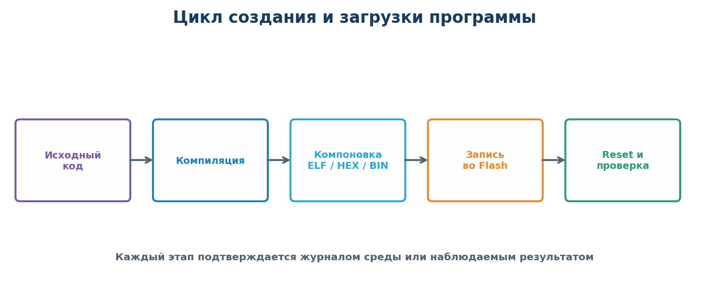
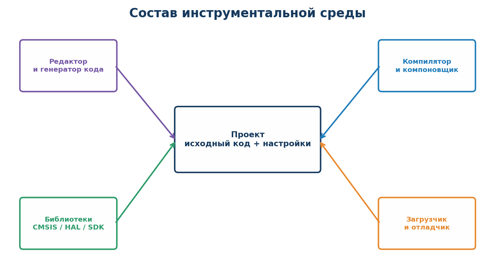
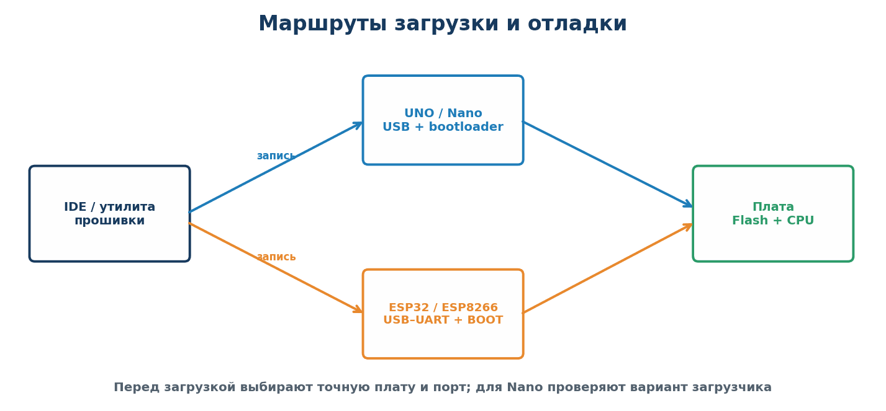
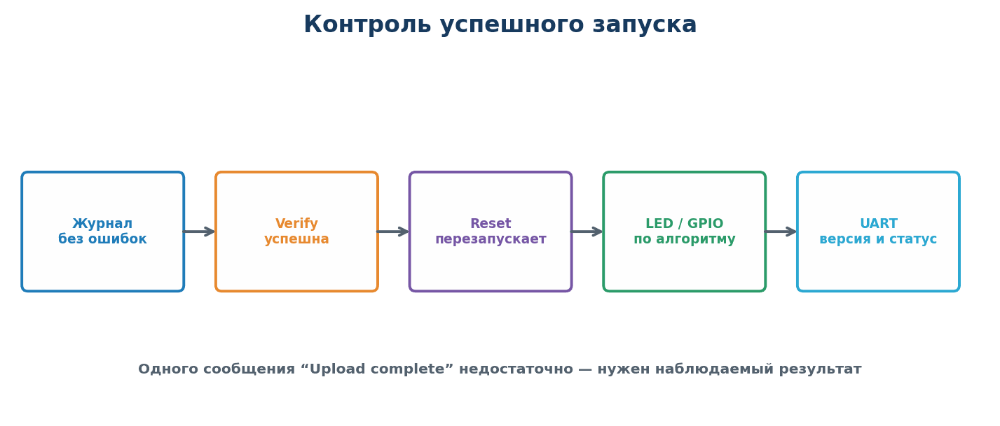

# Практическая работа № 9

## Настройка инструментальной среды, создание, сборка и загрузка тестовой программы для Arduino UNO R3, Arduino Nano, ESP32 и ESP8266

**Дисциплина:** Программирование микроконтроллеров  
**Специальность:** 09.02.01 «Компьютерные системы и комплексы»  
**Курс:** 4  
**Рекомендуемая продолжительность:** 4 академических часа  
**Форма работы:** индивидуальная, по варианту преподавателя

---

## 1. Цель работы

Освоить полный цикл подготовки и запуска программы в Arduino IDE для одной из четырёх плат: Arduino UNO R3, Arduino Nano, ESP32 или ESP8266 — от установки пакета платы и создания скетча до сборки, загрузки и экспериментальной проверки.

## 2. Планируемые результаты

После выполнения работы студент должен уметь:

- различать процессорное ядро, микроконтроллер, систему на кристалле и отладочную плату;
- устанавливать пакеты Arduino AVR Boards, esp32 и esp8266 и выбирать правильную плату;
- создавать проект и настраивать целевую плату, частоту и интерфейсы;
- читать журнал сборки и различать предупреждения, ошибки компиляции и ошибки компоновки;
- получать файл прошивки и оценивать использование Flash и RAM;
- загружать программу через USB-загрузчик или USB–UART;
- проверять GPIO, системное время, UART и аппаратное прерывание;
- использовать Serial Monitor и журнал загрузки для поиска неисправностей;
- документировать воспроизводимую последовательность настройки среды.

## 3. Оборудование и программное обеспечение

### 3.1. Оборудование

- компьютер с доступом к установочным пакетам и драйверам;
- микроконтроллерная плата, выданная преподавателем;
- исправный USB-кабель **с линиями данных**;
- при необходимости программатор AVR ISP или USB–UART-адаптер;
- светодиод с резистором 220–1000 Ом, кнопка и монтажные провода, если они отсутствуют на плате;
- мультиметр или логический анализатор — по возможности.

### 3.2. Используемая среда

| Плата | Пакет плат Arduino IDE | Микроконтроллер/SoC | Типичная загрузка |
|---|---|---|---|
| Arduino UNO R3 | Arduino AVR Boards | ATmega328P, AVR, логика 5 В | USB и встроенный загрузчик |
| Arduino Nano (classic) | Arduino AVR Boards | ATmega328P, AVR, логика 5 В | USB; иногда нужен пункт `ATmega328P (Old Bootloader)` |
| ESP32 Dev Module | esp32 by Espressif Systems | ESP32, логика 3,3 В | USB–UART; иногда кнопка BOOT |
| ESP8266 NodeMCU/Wemos | esp8266 by ESP8266 Community | ESP8266, логика 3,3 В | USB–UART и загрузчик |

Основная среда — Arduino IDE 2.x. В отчёте укажите фактическую версию IDE, версию пакета плат, выбранный профиль платы, порт и скорость загрузки.

### 3.3. Источники для подготовки

- лекция «AVR, ARM Cortex‑M, STM32 и ESP32» — для различения ядра, микроконтроллера, SoC и платы;
- лекция «Программная модель ARM Cortex‑M» — для понимания Flash, SRAM, стека, периферии и обработчиков прерываний; положения применяются сравнительно, поскольку платы этой работы не используют Cortex‑M;
- официальные страницы Arduino UNO R3 и классической Nano;
- инструкции установки Arduino core для ESP32 и ESP8266.

Актуальные ссылки приведены в разделе 12.

## 4. Краткие теоретические сведения

### 4.1. Что именно программируется

Необходимо различать четыре уровня:

| Уровень | Назначение | Пример |
|---|---|---|
| Ядро | Исполняет команды | AVR CPU, Xtensa |
| Микроконтроллер | Ядро, память и периферия в одном корпусе | ATmega328P |
| Система на кристалле | Вычислительные и коммуникационные узлы | ESP32, ESP8266 |
| Плата | Кристалл, питание, USB и разъёмы | UNO R3, Nano, ESP32 DevKit, NodeMCU |

Поэтому в Arduino IDE выбирают точный профиль платы. Например, `Arduino Nano` и `Arduino Nano ESP32` — разные устройства; в данной работе под Nano понимается классическая плата на ATmega328P.

### 4.2. Цепочка получения работающей программы



1. **Исходный код** содержит функции и обращения к библиотекам.
2. **Препроцессор** обрабатывает `#include`, макросы и условную компиляцию.
3. **Компилятор** преобразует каждый исходный файл в объектный код.
4. **Компоновщик** объединяет объектные файлы, библиотеки и таблицу векторов согласно linker script.
5. Получается `.elf`; для AVR обычно формируется `.hex`, для ESP — один или несколько `.bin`.
6. Программатор или загрузчик записывает образ во Flash микроконтроллера.
7. После сброса процессор получает начальный указатель стека и адрес обработчика Reset из таблицы векторов, выполняет инициализацию и переходит в `main()`.

### 4.3. Что настраивает инструментальная среда



Инструментальная среда объединяет редактор, компилятор, компоновщик, библиотеки, систему сборки, загрузчик и отладчик. При создании проекта необходимо согласовать:

- модель платы или микроконтроллера;
- источник и частоту тактирования;
- назначение выводов GPIO;
- профиль платы, вариант процессора/загрузчика и интерфейс прошивки;
- номер последовательного порта;
- скорость UART;
- тип framework или библиотек;
- конфигурацию Debug/Release.

Неверно выбранная цель может успешно компилироваться, но не запускаться из-за другой памяти, таблицы векторов, частоты или распиновки.

### 4.4. Flash, SRAM и периферия

Во Flash размещаются код, константы и таблица векторов. В SRAM находятся изменяемые данные, стек, куча и буферы. Регистры GPIO, UART и таймеров доступны как memory-mapped I/O. Переменные, изменяемые в ISR, объявляют `volatile`; для многобайтных данных на 8-битном AVR также учитывают атомарность.

После сборки зафиксируйте объём программы и статических данных. Проект не должен использовать память «впритык»: оставляется резерв на дальнейшее развитие и стек.

### 4.5. Системное время, таймеры и прерывания

Arduino core уже формирует время для `millis()` и `micros()`. Периодические действия реализуйте сравнением временных меток, а не длительной `delay()`. Корректный шаблон устойчив к переполнению счётчика:

```cpp
if (millis() - previous >= interval) {
    previous += interval;
    // периодическое действие
}
```

Аппаратное прерывание проходит путь:

`событие периферии → флаг → контроллер прерываний → сохранение контекста → ISR → возврат`.

ISR должен быть коротким: очистить источник, сохранить данные или установить флаг, а длительную работу передать основному циклу.

### 4.6. Загрузка и диагностика



- UNO R3 и Nano принимают прошивку через последовательный загрузчик. Для Nano при ошибке синхронизации проверьте пункт **Processor** и, при необходимости, `Old Bootloader`.
- ESP32 и ESP8266 обычно переходят в режим записи автоматически. На отдельных платах при начале загрузки требуется удерживать `BOOT/FLASH`.
- Serial Monitor подходит для диагностики, если его скорость совпадает с `Serial.begin(...)`.

### 4.7. Безопасное подключение

Перед включением питания:

1. UNO R3 и Nano используют логику 5 В; ESP32 и ESP8266 — 3,3 В, их GPIO нельзя подключать к сигналу 5 В;
2. проверьте полярность LED и наличие токоограничивающего резистора;
3. объедините общий провод платы и внешнего модуля;
4. не используйте загрузочные выводы ESP без проверки документации конкретной платы;
5. убедитесь, что вывод не соединён с двумя активными источниками сигнала;
6. не меняйте соединения на включённой схеме без разрешения преподавателя.

---

## 5. Постановка задачи

Для платы, назначенной преподавателем, и индивидуального варианта необходимо:

1. подготовить инструментальную среду;
2. создать новый проект для правильной цели;
3. реализовать тестовую программу варианта;
4. собрать проект без ошибок;
5. загрузить программу в микроконтроллер;
6. подтвердить работу LED/GPIO, UART и входного события;
7. зафиксировать параметры сборки и способ прошивки;
8. провести одну намеренно вызванную диагностическую проверку;
9. оформить отчёт, позволяющий повторить весь процесс на другом компьютере.

## 6. Порядок выполнения

### Этап 1. Идентификация платы

Заполните паспорт рабочего места.

| Параметр | Фактическое значение |
|---|---|
| Плата и ревизия |  |
| Микроконтроллер / SoC |  |
| Процессорное ядро |  |
| Напряжение логики |  |
| Встроенный LED и его вывод |  |
| Кнопка и её вывод |  |
| Интерфейс прошивки |  |
| Пакет плат и его версия |  |
| Последовательный порт |  |

Сведения берите с маркировки платы, принципиальной схемы и официальной документации. Не определяйте распиновку только по внешнему виду.

### Этап 2. Установка и настройка среды

1. Установите Arduino IDE 2.x.
2. Для UNO R3 и Nano установите через Boards Manager пакет **Arduino AVR Boards**.
3. Для ESP32 добавьте стабильный индекс пакета Espressif и установите пакет **esp32 by Espressif Systems**.
4. Для ESP8266 добавьте стабильный индекс пакета и установите **esp8266 by ESP8266 Community**.
5. При необходимости установите официальный драйвер USB–UART, соответствующий микросхеме на плате.
6. Подключите плату и определите появившийся последовательный порт.
7. Выберите профиль платы из таблицы ниже и зафиксируйте версии.

| Плата | Выбор в меню Board | Дополнительная проверка |
|---|---|---|
| UNO R3 | `Arduino Uno` | Порт появился после подключения |
| Nano classic | `Arduino Nano` | `Processor: ATmega328P`; при ошибке синхронизации проверить `Old Bootloader` |
| ESP32 DevKit | Профиль точной платы или `ESP32 Dev Module` | Flash size, частота загрузки, режим BOOT |
| ESP8266 NodeMCU | `NodeMCU 1.0 (ESP-12E Module)` либо точный профиль | Flash size и безопасные boot-пины |

> Не копируйте случайные адреса менеджеров плат и драйверы с неофициальных сайтов. Используйте ресурсы производителя и репозиторий, указанный преподавателем.

### Этап 3. Создание проекта

1. Создайте скетч `PR9_Vxx`, где `xx` — номер варианта.
2. Выберите плату и порт.
3. Объявите выводы именованными константами `LED_PIN`, `BUTTON_PIN`, `ANALOG_PIN`.
4. Для внешней кнопки используйте `INPUT_PULLUP`: кнопка соединяет вход с GND, нажатие читается как `LOW`.
5. Настройте `Serial.begin(115200)`.
6. Не подключайте внешнюю нагрузку к GPIO напрямую; используйте светодиод через резистор.

Рекомендуемые лабораторные выводы приведены ниже. Перед подключением проверьте маркировку своей платы.

| Плата | LED | Кнопка | Аналоговый вход | Примечание |
|---|---:|---:|---:|---|
| UNO R3 | встроенный `LED_BUILTIN` (D13) | D2 | A0 | D2 поддерживает внешнее прерывание |
| Nano classic | встроенный `LED_BUILTIN` (D13) | D2 | A0 | Не занимать D0/D1 при работе Serial |
| ESP32 Dev Module | внешний LED GPIO18 | кнопка GPIO4 | GPIO34 | GPIO34 — только вход, без внутренней подтяжки |
| ESP8266 NodeMCU | внешний LED GPIO5 (D1) | GPIO4 (D2) | A0 | Диапазон A0 зависит от платы; GPIO0/2/15 влияют на загрузку |

### Этап 4. Реализация общей части программы

Программа каждого варианта должна:

- после старта выдать по UART название платы и номер варианта;
- выполнить последовательность LED «старт» — три короткие вспышки;
- работать без блокирующей задержки в основном цикле;
- поддерживать счётчик миллисекунд или событий;
- реагировать на кнопку/цифровой вход;
- не выполнять форматирование длинных сообщений внутри ISR;
- каждые 5 секунд выводить строку состояния;
- при ошибочном состоянии перейти к различимой аварийной индикации.

Рекомендуемый каркас Arduino-скетча:

```cpp
const uint8_t LED_PIN = LED_BUILTIN;
const uint8_t BUTTON_PIN = 2;
volatile bool input_event = false;
volatile uint32_t event_count = 0;
uint32_t previous_ms = 0;
const uint32_t interval_ms = 500;

void input_isr(void) {
    event_count++;
    input_event = true;
}

void setup() {
    pinMode(LED_PIN, OUTPUT);
    pinMode(BUTTON_PIN, INPUT_PULLUP);
    Serial.begin(115200);
    attachInterrupt(digitalPinToInterrupt(BUTTON_PIN), input_isr, FALLING);
    // Выполнить стартовый тест и вывести номер варианта.
}

void loop() {
    uint32_t now = millis();
    if (now - previous_ms >= interval_ms) {
        previous_ms += interval_ms;
        digitalWrite(LED_PIN, !digitalRead(LED_PIN));
    }
    if (input_event) {
        noInterrupts();
        input_event = false;
        uint32_t count_copy = event_count;
        interrupts();
        Serial.println(count_copy);
    }
}
```

Для ESP32 функция ISR должна иметь атрибут, рекомендованный установленной версией Arduino-ESP32. Антидребезг и вся печать выполняются вне ISR.

### Этап 5. Сборка

1. Запустите полную сборку проекта.
2. Убедитесь, что ошибок нет.
3. Проанализируйте предупреждения; не игнорируйте предупреждения о типах, неинициализированных переменных и переполнении.
4. Зафиксируйте путь или название выходного `.elf`, `.hex` либо `.bin`.
5. Запишите объём кода во Flash и статических данных в RAM.
6. Рассчитайте долю использования памяти:

$$
K = \frac{V_{\mathrm{used}}}{V_{\mathrm{available}}} \cdot 100\%
$$

### Этап 6. Загрузка программы



1. Подключите плату выбранным способом.
2. Проверьте профиль платы, порт и питание.
3. Выполните загрузку.
4. Сохраните фрагмент журнала с подтверждением успешной записи и проверки.
5. Нажмите Reset и убедитесь, что программа автоматически запускается.

### Этап 7. Проверка варианта

Проведите не менее пяти испытаний:

| № | Проверяемая функция | Действие | Ожидаемый результат | Фактический результат |
|---:|---|---|---|---|
| 1 | Запуск после Reset | Нажать Reset | Три вспышки и стартовая строка |  |
| 2 | Периодическая задача | Наблюдать не менее 10 с | Период соответствует варианту |  |
| 3 | Входное событие | Нажать кнопку/подать сигнал | Событие зарегистрировано один раз |  |
| 4 | UART | Открыть монитор порта | Сообщения читаемы, скорость верна |  |
| 5 | Повторная прошивка | Изменить идентификатор сборки | После загрузки видна новая версия |  |

Измерьте период секундомером, логическим анализатором или по временным меткам UART. Рассчитайте относительное отклонение:

$$
\delta_T = \frac{|T_{meas}-T_{set}|}{T_{set}}\cdot100\%.
$$

### Этап 8. Обязательная диагностика

По указанию преподавателя выполните **один безопасный** эксперимент:

- выберите неправильный последовательный порт;
- внесите синтаксическую ошибку и найдите номер строки;
- обратитесь к несуществующей функции и определите ошибку компоновки;
- выберите неверный вывод LED, затем исправьте;
- установите неверную скорость Serial Monitor, затем исправьте.

Не вызывайте короткое замыкание, переполюсовку или подачу повышенного напряжения. В отчёте укажите симптом, причину, способ обнаружения и исправление.

### Этап 9. Сравнение результата на двух архитектурах

После выполнения основного варианта ответьте письменно:

1. относится ли используемая плата к AVR-микроконтроллерам или ESP-SoC;
2. какое напряжение логики используется;
3. какой пакет плат выполнил сборку;
4. какой файл прошивки формируется;
5. чем процедура загрузки отличалась бы на плате другой группы;
6. какие ресурсы Flash и RAM ограничивают усложнение программы.

---

## 7. Индивидуальные варианты

Период формируется неблокирующим способом. Кнопка должна обрабатываться прерыванием, если плата и выбранный вывод это поддерживают; иначе используйте неблокирующий опрос и отразите ограничение в отчёте. Дребезг устраните программно без задержки внутри ISR.

| № | Плата | Тестовая программа | Период/параметр | Реакция на вход и контроль UART |
|---:|---|---|---|---|
| 1 | Arduino UNO R3 | Переключение встроенного LED | 500 мс | Кнопка D2 меняет период 500/100 мс; вывести период |
| 2 | Arduino UNO R3 | Двойная вспышка | Цикл 2 с | D2 запускает цикл немедленно; вывести номер цикла |
| 3 | Arduino UNO R3 | Световой маяк | 100 мс ON, 900 мс OFF | D2 включает/выключает режим; вывести состояние |
| 4 | Arduino UNO R3 | Два программных таймера | 250 мс и 1 с | D2 сбрасывает счётчики; вывести оба значения |
| 5 | Arduino UNO R3 | Двоичный счётчик на трёх LED | Шаг 1 с | D2 обнуляет счёт; вывести число 0–7 |
| 6 | Arduino UNO R3 | Измерение A0 | 10 измерений/с | D2 фиксирует отсчёт; вывести код 0–1023 и проценты |
| 7 | Arduino Nano | Регулируемое мигание | 100–1000 мс, шаг 100 мс | D2 увеличивает период; вывести новое значение |
| 8 | Arduino Nano | Автомат `IDLE/RUN/ALARM` | Обновление 50 мс | Короткое/длинное нажатие D2 меняет состояние |
| 9 | Arduino Nano | Подавление дребезга | Окно 30 мс | Вывести число фронтов ISR и подтверждённых нажатий |
| 10 | Arduino Nano | Таймер активности | Тайм-аут 5 с | D2 продлевает режим; вывести остаток времени |
| 11 | Arduino Nano | UART-команды LED | `ON`, `OFF`, `TOGGLE` | D2 выполняет `TOGGLE`; неверная команда даёт `ERROR` |
| 12 | Arduino Nano | Плавная яркость PWM | D3, шаг 20 мс | D2 меняет направление; вывести уровень 0–255 |
| 13 | ESP32 | Неблокирующий LED-маяк | 200 мс/800 мс | GPIO4 переключает режим; вывести `millis()` |
| 14 | ESP32 | UART-команда периода | `T=100…2000` мс | GPIO4 возвращает 500 мс; проверить границы команды |
| 15 | ESP32 | PWM-регулировка LED | 10, 30, 60, 100 % | GPIO4 переключает уровень; вывести скважность |
| 16 | ESP32 | Измерение аналогового входа | GPIO34, 20 измерений/с | GPIO4 фиксирует значение; вывести код и проценты |
| 17 | ESP32 | Фильтр АЦП | Среднее по 32 отсчётам | GPIO4 очищает накопитель; вывести raw/average |
| 18 | ESP32 | Счётчик внешних событий | До 50 событий/с | IRQ GPIO4 увеличивает счёт; выводить частоту раз в секунду |
| 19 | ESP32 | Две независимые задачи времени | 100 мс и 1 с | GPIO4 сбрасывает статистику; вывести два счётчика |
| 20 | ESP8266 | Неблокирующее мигание | 750 мс | GPIO4 меняет период 750/150 мс; вывести режим |
| 21 | ESP8266 | Командный интерфейс | `STATUS`, `RESET`, `HELP` | GPIO4 вызывает `STATUS`; вывести ответ |
| 22 | ESP8266 | Измерение A0 | 5 измерений/с | GPIO4 фиксирует значение; сначала указать диапазон A0 платы |
| 23 | ESP8266 | Пороговый индикатор A0 | Порог 60 %, гистерезис 5 % | GPIO4 включает гистерезис; вывести состояние |
| 24 | ESP8266 | Счётчик прерываний | До 20 событий/с | GPIO4 — вход IRQ; вывести число событий без печати из ISR |
| 25 | ESP8266 | Самотестирование после Reset | Не более 3 с | Проверить LED, кнопку и Serial; GPIO4 повторяет тест |

Если для варианта требуется периферия, отсутствующая на плате, преподаватель назначает функционально близкий вариант либо разрешает программную имитацию входного сигнала. Факт замены фиксируется в отчёте.

---

## 8. Содержание отчёта

1. Номер и название работы, вариант.
2. Цель работы.
3. Паспорт платы и схема подключения.
4. Названия и версии среды, toolchain, framework и драйверов.
5. Последовательность создания и настройки проекта со скриншотами ключевых окон.
6. Алгоритм и листинг **собственной** части тестовой программы.
7. Результат сборки: предупреждения, Flash, RAM, выходной файл.
8. Способ загрузки и подтверждение успешной прошивки.
9. Таблица испытаний и измеренное отклонение периода.
10. Описание диагностического эксперимента и исправления.
11. Результат UART-трассировки и фрагмент журнала загрузки.
12. Вывод о достигнутом результате и найденных ограничениях.

## 9. Критерии оценивания

| Раздел | Баллы |
|---|---:|
| Идентификация платы и безопасное подключение | 10 |
| Установка и документирование среды | 15 |
| Корректное создание и конфигурирование проекта | 15 |
| Реализация общей части и индивидуального варианта | 20 |
| Сборка и анализ использования памяти | 10 |
| Загрузка и подтверждение запуска | 10 |
| Испытания и измерение периода | 10 |
| Диагностика, отладка и качество отчёта | 10 |
| **Итого** | **100** |

Рекомендуемый перевод: `90–100` — «5», `70–89` — «4», `50–69` — «3», менее `50` — «2».

### Существенные ошибки

- выбрана неправильная плата или микроконтроллер;
- не зафиксированы версии среды и пакета поддержки;
- программа собирается только с необъяснёнными критическими предупреждениями;
- используется блокирующая задержка вместо требуемой неблокирующей логики;
- ISR содержит длительную обработку или не очищает источник прерывания;
- программа не запускается автоматически после Reset;
- успешная загрузка не подтверждена наблюдаемым результатом;
- внешний LED подключён без резистора;
- отчёт не позволяет воспроизвести настройку.

## 10. Контрольные вопросы

1. Чем процессорное ядро отличается от микроконтроллера и платы?
2. Какие компоненты входят в инструментальную среду?
3. Чем компиляция отличается от компоновки?
4. Для чего нужны файлы `.elf`, `.hex` и `.bin`?
5. Почему проект для неверной цели может собраться, но не работать?
6. Что размещается во Flash, а что — в SRAM?
7. Зачем аппаратным регистрам и данным ISR нужен `volatile`?
8. Почему не следует выполнять длительные операции в ISR?
9. Чем загрузчик отличается от программатора AVR ISP?
10. Как подтвердить, что после прошивки выполняется именно новая версия программы?
11. Что означает скорость UART `115200 8N1`?
12. Чем ошибка компиляции отличается от ошибки загрузки?

## 11. Чек-лист перед сдачей

- [ ] Указаны точные модель платы и микроконтроллер.
- [ ] Зафиксированы версии среды, toolchain и framework.
- [ ] Приведена распиновка использованных сигналов.
- [ ] Проект собирается без ошибок.
- [ ] Критические предупреждения устранены.
- [ ] Записано использование Flash и RAM.
- [ ] Сохранён результат успешной загрузки.
- [ ] После Reset выполняется тест «три вспышки».
- [ ] Вариант реализован неблокирующим способом.
- [ ] Входное событие не теряется и не дублируется дребезгом.
- [ ] UART выводит номер варианта и состояние.
- [ ] Выполнены не менее пяти испытаний.
- [ ] Проведён безопасный диагностический эксперимент.
- [ ] Отчёт содержит вывод и позволяет повторить работу.

## 12. Использованные материалы

1. [Лекция: AVR, ARM Cortex‑M, STM32 и ESP32](https://github.com/BysonHunter/Tavrich_college/blob/main/ПМК/4%20курс/Лекции/Лекция_5_1_AVR_CortexM_STM32_ESP32_MD/Лекция_5_1_AVR_ARM_Cortex-M_STM32_ESP32.md).
2. [Лекция: программная модель ARM Cortex‑M](https://github.com/BysonHunter/Tavrich_college/blob/main/ПМК/4%20курс/Лекции/Лекция_5_2_ARM_Cortex-M_MD/Лекция_5_2_Программная_модель_ARM_Cortex-M.md).
3. [Официальная документация Arduino UNO R3](https://docs.arduino.cc/hardware/uno-rev3/).
4. [Официальная документация Arduino Nano](https://docs.arduino.cc/hardware/nano/).
5. [Установка Arduino core для ESP32](https://docs.espressif.com/projects/arduino-esp32/en/latest/installing.html).
6. [Установка Arduino core для ESP8266](https://arduino-esp8266.readthedocs.io/en/latest/installing.html).
